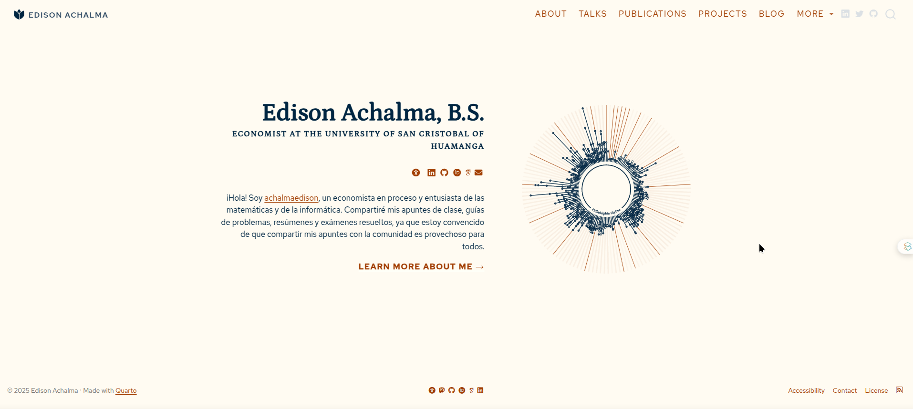

# ¡Bienvenidos a mi sitio web!

#readme

Este es el repositorio de mi página web personal, que puedes visitar en [https://achalmawebsite.netlify.app/](https://achalmawebsite.netlify.app/). En este sitio encontrarás información sobre mis proyectos, publicaciones y experiencias en distintas áreas como la informática, la filosofía y la economía.

## Tecnologías utilizadas

Mi sitio web está construido con:

- HTML
- CSS
- JavaScript
- Bootstrap
- Hugo
- Netlify

## Numeración de volúmenes, números e issues 

Publico de forma trimestral (4 números por año).
La numeración se organiza de la siguiente manera:

- **Volumen**: Corresponde al año de publicación (ejemplo: Vol. 2025 para todos los artículos publicados en 2025).

- **Número / Issue**: Indica el trimestre calendario en que se publicó el fascículo:

	- No. 1 → enero – marzo
	- No. 2 → abril – junio
	- No. 3 → julio – septiembre
	- No. 4 → octubre – diciembre

Ejemplos de citación recomendada:

Autor (2025). Título del artículo. *Actus Mercator*, 2025(2), 45-60.
Autor et al. (2022). Título. *Actus Mercator*, 2022(1), 12-25.

Esta estructura permite identificar rápidamente el período de publicación y facilita la indexación en bases de datos académicas (SciELO, Redalyc, Latindex, RENATI, etc.).

## Cómo contribuir

Si deseas contribuir a mi sitio web, puedes hacerlo de varias maneras, por ejemplo:

- Reportando errores o dando sugerencias a través de las issues
- Proponiendo mejoras en la página mediante un pull request
- Compartiendo mi sitio web en tus redes sociales

## Autor

Soy Edison Achalma, un economista en proceso y entusiasta de la tecnología. Puedes encontrarme en [LinkedIn](https://www.linkedin.com/in/achalmaedison/), [Medium](https://medium.com/@achalmaedison), [Dev.to](https://dev.to/achalmaedison), [Instagram](https://www.instagram.com/achalmaedison/) y [Twitter](https://twitter.com/achalmaedison)

## Licencia

Este proyecto está bajo la Licencia [LICENSE](license.qmd). Ver el archivo license.qmd para más detalles.

## Contacto

Si necesitas contactarme, puedes hacerlo a través de mi correo electrónico: [mailto:achalmed.18@gmail.com](https://achalmaedison.netlify.app/contact).

¡Gracias por visitar mi sitio web!

