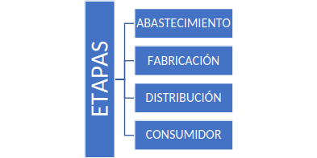
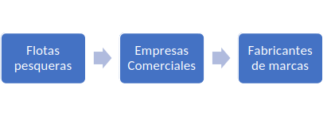

# Cadena de suministros

hola como estas 

## Conceptos básicos

Según Lambert (1998), la administración de la cadena de suministro (SCM, por sus siglas en inglés), se introdujo originalmente por consultores a principio de los ochentas y subsecuentemente ha ganado mucha atención.

La cadena de suministro no es una cadena de negocios de persona a persona, ni de relaciones entre una empresa y otra, sino que es una red de unidades de negocio con relaciones múltiples. Ofreciendo la oportunidad de capturar la sinergia de la integración administrativa intra e interempresarial. En ese sentido, consiste en procesos de excelencia y representa una nueva manera de manejar las transacciones comerciales y relaciones con otras unidades de negocio Chase, et.al. (2009).

Conjunto de empresas eficientemente integradas por los proveedores, los fabricantes, distribuidores y vendedores mayoristas o detallistas coordinados que busca ubicar uno o más productos en las cantidades correctas, en los lugares correctos y en el tiempo preciso, buscando el menor costo de las actividades de valor de los integrantes de la cadena y satisfacer los requerimientos de los consumidores. Lambert y Pohlen, (2001).

## Etapas de la Cadena de Suministro

{
  #fig-myimportedimage 
  fig-alt="Etapas de la cadena de Abastecimiento" 
  apa-note="Adaptación de acuerdo a Chopra y Meindel (2008)"
  }

### Abastecimiento o suministro:

Se encarga del cómo y dónde obtener las materias primas, dónde almacenarlas, cómo movilizarlas y qué criterios emplear en su selección. 

La etapa de abastecimiento se concentra en cómo, donde y cuando se consiguen y suministran las materias primas para fabricación de los productos terminados. Es la etapa relacionada con la función de compra, adquisición o abastecimiento de materias primas, insumos y soluciones complejas para el desarrollo de las actividades de fabricación o producción Bowersox et al., (2007).

### Fabricación:

Es el momento en sí de hacer físico el producto. Producirlo y hacerlo real.

En esta etapa se convierten las materias primas en productos terminados. Más allá del proceso propio de producción que una compañía manufacturera o de servicios pueda establecer, la cadena de abastecimiento se enfoca en definir los procesos que existe entre esta etapa de la cadena y la etapa de abastecimiento y posteriormente la de distribuidores. De esta forma las empresas, deben establecer canales que les ETAPAS ABASTECIMIENTO FABRICACIÓN DISTRIBUCIÓN CONSUMIDOR Cadenas de Suministro 15 permitan controlar los frentes importantes que una cadena de abastecimiento requiera, las cuales se pueden consolidar en las etapas Cala, (2005).

### Distribución:

Con el producto ya acabado es el momento de almacenarlo a la espera de que pase por el control de calidad.

Se encarga de que dichos productos terminados lleguen al consumidor atreves de una red de distribuidores, almacenes y comercios minoristas. Una vez finalizado el proceso de producción el producto final debe ser transportado hasta su destino final, de acuerdo con el acuerdo realizado entre el productor y el cliente, quienes determinan el lugar de entrega y el medio de transporte para su llegada Díaz et al., (2008).

### Consumidor:

Con la mercadería ya acabada y controlado ahora queda distribuirlo a los diferentes puntos de venta.

Es una persona u organización que demanda bienes o servicios proporcionados por el productor o el proveedor de bienes o servicios. Es decir, es cualquiera que se ve afectado por el servicio, el producto o el proceso Juran J. (2007).

## Tipos de cadenas de suministros

### Empresas industriales:

Tienen una **cadena de suministro** con mucha logística, que dependerán del tamaño de la empresa, de las líneas de producción con que cuentan y mercado al que van dirigidos sus productos. Generalmente incluye funciones como, desarrollo de nuevos productos, la mercadotecnia, importación, fabricación, la distribución, las finanzas y el servicio al cliente.

### Empresas comercializadoras:

En este caso son menos elaboradas, no maneja la parte productiva, maneja mayormente la obtención y venta de productos. Abarca funciones destinadas a la recepción de una solicitud del cliente y el cumplimiento de dicha solicitud.

### Empresas de servicios:

Estas cuentan con cadenas muy cortas. Es más, una cadena jerárquica y depende del recurso humano.

## Ejemplo de las cadenas de suministro del atún

La gran mayoría del atún en lata se produce para los mercados de Europa y Estados Unidos. Por ende, el consumo de atún en Estados Unidos y Europa depende de las cadenas de suministro mundiales en las que participan: 

- Las flotas encargadas de la pesca.  
- Los comerciantes que actúan como intermediarios entre las flotas pesqueras y los fabricantes.  
- Los fabricantes que procesan y envasan el pescado.  
- Los minoristas que venden el pescado al consumidor final

Los trabajadores del transporte desempeñan un papel de suma importancia en estas cadenas de suministro. Estas etapas están conectadas entre sí por trabajadores/as del transporte que trasladan el atún por carretera, ferrocarril, mar y aire entre empresas y ubicaciones.

## Bibliografías

Bowersox , D.J.(2007): *Administración y logística en la cadena de suministros, adquisición y fabricación Bixby.* Mc Graw Hill, México.

Cala, A.(2005): *Revista Electrónica CIVILIZAR* Universidad Sergio Arboleda, Sección Finanzas.

Chase, Richard, Jacobs, Robert, Aquilano, Nicholas (2009). *Administración de operaciones: Producción y cadena de suministros.* Decima edición. McGraw-Hill.

Díaz Hector; Garcia Rafael; Porcell Nestor (2008): *Las Pymes: Costos en la cadena de abastecimientos. Revista- escuela de administración de negocios,* Núm. 63, Mayo-Agosto 2008, pp. 5-21 Universidad EAN Colombia Redalyc.

Juran Joseph, Gryna Frank, Chua Richard, Defeo Josep (2007). *Análisis y planeación de la calidad, quinta edición.*

Lambert, D.M., Cooper, M.C., Pagh, J.D., (1998). *Supply opportunities.En: The international journal of logistics management*, vol.2, p1.

Lambert, Douglas M. y Pohlen, Terrance (2001). *Supply Chain Metric. The International Journal of Logistics Management,* Volume 12, Number 1.

# Publicaciones Similares

Si te interesó este artículo, te recomendamos que explores otros blogs y recursos relacionados que pueden ampliar tus conocimientos. Aquí te dejo algunas sugerencias:

1. [El Aborto](https://achalmaedison.netlify.app/blog/posts/2015-05-14-el-aborto) Lee sin conexión [PDF](https://achalmaedison.netlify.app/blog/posts/2015-05-14-el-aborto/index.pdf)
2. [Sitios Web Asombrosos](https://achalmaedison.netlify.app/blog/posts/2017-04-23-sitios-web-asombrosos) Lee sin conexión [PDF](https://achalmaedison.netlify.app/blog/posts/2017-04-23-sitios-web-asombrosos/index.pdf)
3. [El Mercantilismo](https://achalmaedison.netlify.app/blog/posts/2017-05-23-el-mercantilismo) Lee sin conexión [PDF](https://achalmaedison.netlify.app/blog/posts/2017-05-23-el-mercantilismo/index.pdf)
4. [Comandos De Google Assistant](https://achalmaedison.netlify.app/blog/posts/2020-05-23-comandos-de-google-assistant) Lee sin conexión [PDF](https://achalmaedison.netlify.app/blog/posts/2020-05-23-comandos-de-google-assistant/index.pdf)
5. [Plan De Negocio Exportacion De Trucha Arcoires](https://achalmaedison.netlify.app/blog/posts/2020-09-15-plan-de-negocio-exportacion-de-trucha-arcoires) Lee sin conexión [PDF](https://achalmaedison.netlify.app/blog/posts/2020-09-15-plan-de-negocio-exportacion-de-trucha-arcoires/index.pdf)
6. [Plan De Negocio Exportacion De Tuna](https://achalmaedison.netlify.app/blog/posts/2021-07-13-plan-de-negocio-exportacion-de-tuna) Lee sin conexión [PDF](https://achalmaedison.netlify.app/blog/posts/2021-07-13-plan-de-negocio-exportacion-de-tuna/index.pdf)
7. [Comandos De Blogdown](https://achalmaedison.netlify.app/blog/posts/2021-07-14-comandos-de-blogdown) Lee sin conexión [PDF](https://achalmaedison.netlify.app/blog/posts/2021-07-14-comandos-de-blogdown/index.pdf)
8. [Gestion Publica Y Administracion Publica](https://achalmaedison.netlify.app/blog/posts/2021-10-01-gestion-publica-y-administracion-publica) Lee sin conexión [PDF](https://achalmaedison.netlify.app/blog/posts/2021-10-01-gestion-publica-y-administracion-publica/index.pdf)
9. [Reformas Y Modernizacion De La Gestion Publica](https://achalmaedison.netlify.app/blog/posts/2021-10-01-reformas-y-modernizacion-de-la-gestion-publica) Lee sin conexión [PDF](https://achalmaedison.netlify.app/blog/posts/2021-10-01-reformas-y-modernizacion-de-la-gestion-publica/index.pdf)
10. [Economia Agraria](https://achalmaedison.netlify.app/blog/posts/2022-04-22-economia-agraria) Lee sin conexión [PDF](https://achalmaedison.netlify.app/blog/posts/2022-04-22-economia-agraria/index.pdf)
11. [Impacto Del Cambio Climatico](https://achalmaedison.netlify.app/blog/posts/2022-06-02-impacto-del-cambio-climatico) Lee sin conexión [PDF](https://achalmaedison.netlify.app/blog/posts/2022-06-02-impacto-del-cambio-climatico/index.pdf)
12. [Cualidades De Los Servidores Publicos](https://achalmaedison.netlify.app/blog/posts/2023-05-11-cualidades-de-los-servidores-publicos) Lee sin conexión [PDF](https://achalmaedison.netlify.app/blog/posts/2023-05-11-cualidades-de-los-servidores-publicos/index.pdf)
13. [La Economia Peruana Entre 1970 1990](https://achalmaedison.netlify.app/blog/posts/2023-05-12-la-economia-peruana-entre-1970-1990) Lee sin conexión [PDF](https://achalmaedison.netlify.app/blog/posts/2023-05-12-la-economia-peruana-entre-1970-1990/index.pdf)
14. [Economia Regional](https://achalmaedison.netlify.app/blog/posts/2023-05-16-economia-regional) Lee sin conexión [PDF](https://achalmaedison.netlify.app/blog/posts/2023-05-16-economia-regional/index.pdf)

Esperamos que encuentres estas publicaciones igualmente interesantes y útiles. ¡Disfruta de la lectura!

# Referencias

