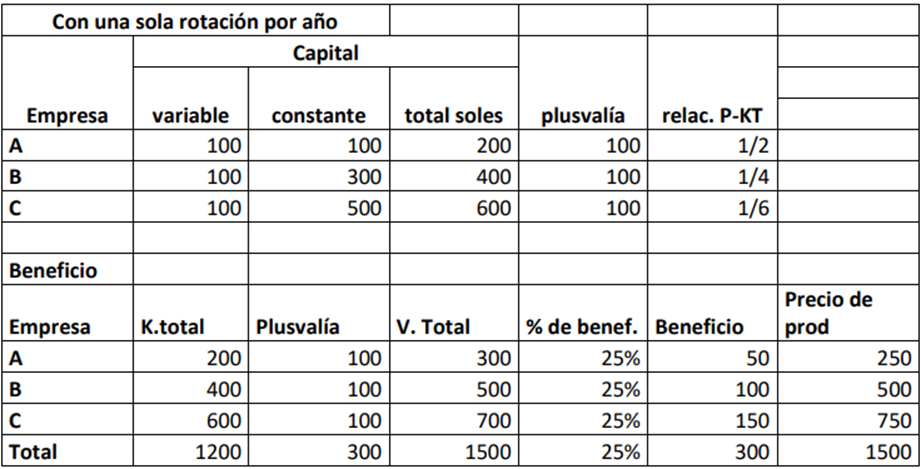

La economía agraria es una ciencia social aplicada que estudia cómo los productores, los consumidores y la sociedad usan los recursos escasos en la producción, el procesamiento, el mercadeo y el consumo de productos alimenticios y fibras. Este artículo desarrolla sus fundamentos en el contexto peruano: primero delimita el campo de la economía agraria y de la economía rural; luego examina la relación entre población, agricultura y desarrollo; a continuación analiza la empresa y la oferta agrarias, los sistemas de rotación, la teoría del valor, la plusvalía y la renta de la tierra; y finalmente discute la rentabilidad del agro, la seguridad alimentaria, las políticas fiscal y monetaria, la reforma agraria y los derechos de propiedad como base de las acciones estratégicas para el desarrollo.

# Economía agraria y economía rural

## La economía agraria

En sus inicios, la economía agraria aplicó los principios de la agricultura junto con los de la ganadería. Se constituyó luego como disciplina científica cuando, ante la necesidad de mejorar los rendimientos y la productividad, se ocupó del uso de la tierra y de los métodos para optimizar la toma de decisiones de los productores agropecuarios. En ese desarrollo se distinguen tres áreas:

- el uso de la tierra (identificación del recurso tierra);
- los métodos empleados para el uso de la tierra (herramientas o técnicas);
- la toma de decisiones del productor agropecuario y de los agronegocios.

La actividad agraria, en sentido estricto, es aquella actividad del ser humano llevada a cabo para producir alimentos y fibras (lana, seda, algodón) mediante el uso deliberado y controlado de vegetales y animales. Al incorporar la ganadería, el campo se vuelve agropecuario, y con el manejo forestal se amplía aún más. Aun así, su alcance es restringido, porque se limita a las esferas de la producción y el mercadeo del sector y no incluye el análisis del propio agricultor y de su hogar; ese vacío es el que llena el concepto de economía rural.

## El problema económico y la clasificación de los bienes

El problema económico puede definirse con dos afirmaciones corrientes. La primera es que los agentes se enfrentan a finalidades múltiples en competencia, entre las que deben elegir; toda elección implica renunciar a otras alternativas deseables, es decir, un costo de oportunidad: no se puede ordeñar la vaca y, al mismo tiempo, venderla. La segunda es que no se puede obtener algo por nada: toda acción orientada a obtener algo exige sacrificar otra cosa, esto es, tiene un costo ("no hay almuerzo gratis").

De estas afirmaciones se desprende una distinción básica. Los recursos abundantes, que pueden obtenerse sin esfuerzo alguno, son bienes no económicos, libres o gratuitos; aquellos que se obtienen con esfuerzo humano son bienes económicos. La búsqueda de estos últimos para satisfacer necesidades da origen a los actos económicos, y el encadenamiento y la repetición sistemática de dichos actos constituye la actividad económica. En ese encadenamiento —desde elegir el terreno hasta llegar al mercado— reside la habilidad del profesional en economía para determinar las acciones correctas que permiten satisfacer necesidades.

La enorme cantidad de bienes que la sociedad utiliza puede clasificarse desde dos ángulos: según su naturaleza y según su función.

**Según su naturaleza**, los bienes pueden entenderse:

1.  Por su modo de ser con referencia al ser humano: bienes naturales, que no son producidos por los humanos, y bienes manufacturados, producto de la combinación de la acción humana con los recursos naturales.

2.  Por su manera de ser considerados en sí mismos: bienes materiales, con existencia física, y bienes inmateriales, productos de la mente, que suelen alcanzar mayor valor.

**Según su función**, los bienes pueden ser:

1.  Bienes directos o de consumo, destinados al disfrute inmediato. El aire y la luz solar, un paisaje natural o una fruta comestible son de este tipo, en la medida en que satisfacen la necesidad de respirar, de obtener energía, de recreación o de alimentación.

2.  Bienes indirectos o factores de producción, que se emplean en preparar la satisfacción de las necesidades mediante la obtención de otros bienes que la satisfacen de modo directo: la lluvia, la energía solar, los minerales del suelo, la mano de obra, las máquinas y los equipos, en la medida en que ayudan a producir otros bienes.

Establecidas las nociones de recursos, elección, objetivos múltiples y escasez, la Economía puede definirse como la ciencia social que trata cómo los individuos, las empresas, el Estado y otras entidades de la sociedad asignan recursos en el marco de una situación de escasez caracterizada por el enfrentamiento de objetivos alternativos. La economía agraria implica la aplicación de la Economía a la agricultura; por lo tanto, se define como una ciencia social aplicada que trata sobre cómo los productores, los consumidores y la sociedad usan los recursos escasos en la producción, el procesamiento, el mercadeo y el consumo de productos alimenticios y fibras. No se estudia la producción en sí misma: se analiza todo lo que hace el agricultor —cómo y dónde produce— y para quién produce; en esa cadena, el mercadeo resulta incluso más importante que la producción.

## Aportes teóricos sobre la renta y los mercados agrarios

Los economistas clásicos sentaron las bases del análisis de la tierra como factor productivo. **Adam Smith** consideró que la tierra, como bien escaso, genera una renta semejante a la de todo monopolio. **David Ricardo** sostuvo que la renta es la porción del producto de la tierra que se paga al propietario por el uso de "las fuerzas originarias" del suelo y que, por tanto, varía según la calidad y la ubicación del terreno. **Carlos Marx** optó por distinguir entre la "renta absoluta", que resulta de la concentración de la propiedad de la tierra, y la "renta diferencial". **Henry Charles Carey** cuestionó las tesis de Smith y Ricardo sobre la renta, al considerar que siempre habría disponibles tierras de calidad y tecnología que permitieran producir más; su alternativa al modelo europeo fue el modelo estadounidense de tierras disponibles y proteccionismo. **Johann Heinrich von Thünen** hizo un aporte decisivo a la economía agrícola con su teoría de la localización, basada en el supuesto de que, si la actividad agrícola pudiera concentrarse como la producción industrial, se situaría cerca del mercado; enfatizó así la importancia de la renta de localización que, sin negar otros factores, postuló como el elemento más importante para configurar el territorio agropecuario.

Hoy el estudio de la geografía rural tiene en cuenta que una nueva ruralidad ha determinado la importancia de actividades no agropecuarias en el campo, como la minería y otras actividades extractivas.

Un campo propio de la economía agropecuaria es el de la especificidad de los mercados del sector. Al principio se estudió simplemente la aplicación de la oferta y la demanda; el **teorema de la telaraña** muestra la relación con la determinación del equilibrio en aquellos casos en que los ajustes son completamente discontinuos. Por su parte, **Alexander Chayanov** estudió la especificidad de la economía campesina: la organización de la unidad productiva familiar —sus objetivos y planes, la circulación de capital, trabajo y familia—, las consecuencias de todo ello para la economía nacional e internacional y la articulación de la economía campesina con el conjunto económico. Su obra contribuye a revalorar el aporte de los campesinos a la economía y a explicar la heterogeneidad de las formas de producción agropecuarias contemporáneas; sostuvo que el campesino tiene ventajas frente a otros productores, aunque su defensa de la economía campesina se basó en la experiencia de la URSS.

En cuanto a la escala de producción, los economistas aplicaron los postulados clásicos de las economías de escala al sector agropecuario para predecir el triunfo de la gran producción, como en el resto de la economía, limitada tan solo por la ley de los rendimientos decrecientes, es decir, por la proporcionalidad en el incremento de los distintos factores productivos: en algún momento se llega a un punto de saturación y la producción decrece. **Jacob Viner** concibió la agricultura campesina como uno de los factores de atraso que generan pobreza: mantener al campesino en esa condición es condenarlo, a él y a las siguientes generaciones, a la pobreza continua. Viner advirtió, sin mencionarlo expresamente, cómo los efectos de la economía externa capitalista afectan a la economía campesina que, al no adaptarse a las exigencias del mercado, queda condenada a la pobreza permanente. En el extremo opuesto, **Vandana Shiva** ha cuestionado todo el modelo de gran producción agropecuaria y el cambio tecnológico que lo ha acompañado —la revolución verde— y ha contabilizado los costos ambientales y otros costos no pagados por los agronegocios que, al permitir el consumo gratuito de recursos, garantizan una rentabilidad privada a costa de un enorme costo social e impacto ambiental.

Estrechamente vinculada a la economía agraria se encuentra la agronomía o ingeniería agronómica, agrupación de conocimientos de múltiples disciplinas que dirigen la praxis de la agricultura y la ganadería. Su objetivo es mejorar la calidad de las técnicas de producción y del proceso de transformación de artículos alimentarios y agrícolas, con fundamentos tecnológicos y científicos, a través del examen de los factores biológicos, físicos, económicos, químicos y sociales que intervienen en el desarrollo productivo. Su propósito de estudio es la transformación social del agroecosistema.

## La economía rural

La economía rural tiene un objeto de estudio más amplio que la economía agraria, porque supera la visión sectorial del trabajo: la unidad elemental de análisis pasa a ser el hogar del trabajador del área rural, como subconjunto de la actividad económica. Sin dejar de analizar la actividad agraria, incorpora el comportamiento, el quehacer diario y las fuentes de ingreso de la familia rural: el tamaño de la tierra, la pobreza, la desigualdad, la transferencia de población del área rural al área urbana, la educación del poblador y el análisis de los derechos humanos. La disciplina empezó a desarrollarse hace apenas tres o cuatro décadas, debido a la gran heterogeneidad social de los habitantes de las zonas rurales.

Esa heterogeneidad se expresa en la influencia del lugar sobre las estrategias del hogar:

- **Sierra:** el hogar tiende a ser más itinerante. Cuando los cultivos se cosechan una vez al año, los padres de familia salen del hogar para obtener ingresos en actividades distintas de la agraria, con migraciones de fuerza de trabajo que pueden ser prolongadas; el poblador rural, además de su actividad agropecuaria, puede ser comerciante o artesano, ofrecer sus servicios en la ciudad o brindar servicios de transporte de carga, de modo que son varias las fuentes de ingreso que sostienen el bienestar del hogar y el hogar tiende a fraccionarse.

- **Costa:** el hogar puede ser mucho más sedentario, porque las fuentes de ingreso son diversas y, cuando los cultivos son permanentes, el lugar de residencia es más estable y el hogar permanece más íntegro.

El análisis de la economía rural considera, entre otros, los siguientes aspectos:

- el ingreso obtenido por los habitantes de la zona rural en las diversas actividades que ejercen;
- la pobreza y la desigualdad como indicadores casi universales para gran parte de la población rural;
- la relación entre los ingresos bajos y la falta de seguridad alimentaria: los hogares no cuentan con recursos para satisfacer sus necesidades básicas;
- el acceso a bienes y servicios públicos, como la salud y la educación, y qué tan cercanos están al poblador rural;
- los efectos de la falta de salubridad en la alimentación y de la falta de educación: desnutrición y anemia, agravadas por hábitos de higiene insuficientes, que reducen las capacidades que deberían ser mayores en el área rural, donde más priman las diferencias con el área urbana.

La economía rural incorpora también el análisis de los derechos en las comunidades. En materia de derechos territoriales —por ejemplo, cuando las tierras donde se vivía y cultivaba pasan a la actividad minera— corresponde incorporar al análisis rural cuánto dependen los hogares de la agricultura y cuánto de la minería. Los derechos humanos bien entendidos deberían incorporar también las obligaciones: no se deben generar expectativas inexistentes en poblaciones que conocen más sus derechos que sus deberes.

En síntesis, **la economía rural es más amplia que la economía agraria**: mientras la agraria solo observa la producción y el mercadeo agropecuarios, la rural considera además a la familia —los niveles de ingreso, las estrategias para generar fuentes de ingreso, la tierra, la pobreza, la desigualdad, la transferencia de riqueza, la calidad de vida del poblador— y ahí se aprecia la riqueza del análisis, incluido el de los derechos humanos en las comunidades.

La economía rural incorpora, finalmente, el surgimiento y el desempeño de las instituciones agrarias, tanto privadas como públicas, y la participación de los organismos públicos que acuden —o no— en apoyo del poblador. Las Direcciones Regionales Agrarias intentan implementar una economía rural, pero su actividad es muy limitada y su enfoque no refleja la necesidad del área rural: su aporte suele reducirse a trámites de certificación o al registro de propiedad, se trata de instituciones muy burocráticas que, a veces, más obstáculos ponen al agricultor. Los fondos que canalizan se diluyen en la burocracia —una gran proporción se queda en el aparato administrativo y solo una fracción llega a los afectados—, la información estadística se obtiene de muestras mínimas y los pagos por daños o desastres muchas veces no llegan a quienes corresponden. Una institucionalidad agraria bien diseñada debería estar dirigida efectivamente al agro, partir de las necesidades reales y de información de campo confiable y, con ello, construir estrategias.

# La agricultura y el desarrollo

## Crecimiento de la población y sector agrícola

En la actividad agropecuaria es importante el estudio de los efectos del rápido crecimiento de la población, entendiendo que afecta al desarrollo integral del país. ¿Cómo afecta el aumento de la población del área rural al conjunto de la economía? En los países en desarrollo se combina una alta tasa de fertilidad con bajas tasas de mortalidad. Las altas tasas de fertilidad significan que debe destinarse una cantidad creciente de recursos a la agricultura solo para satisfacer los mismos requerimientos de alimentos por persona: si la población rural pasa de 10 a 15 personas, se necesita producir para 15 lo que antes se producía para 10 únicamente para mantener el mismo consumo por cabeza. Ello pone al área rural en desventaja frente al área urbana: se sacrifican más recursos con menor calidad de vida y menores ingresos. El crecimiento demográfico rápido, además, disminuye el crecimiento global de la economía, por lo que debe decidirse eficientemente qué inversiones priorizar, en qué condiciones se determinarán los rendimientos y cuáles son las inversiones estratégicas.

La experiencia peruana ilustra la dificultad de las políticas demográficas: en la década de 1990 se implementó una política de control de la natalidad mediante ligaduras y vasectomías dirigida a mujeres con muchos hijos, aplicada bajo metas impuestas al personal de salud, lo que produjo graves abusos —se esterilizó incluso a mujeres con un solo hijo—. En la actualidad la población crece alrededor del 1 % anual y existe un mayor control informado de la natalidad, especialmente en el área urbana. Para el análisis regional interesa, en esa línea, estudiar el crecimiento poblacional de Ayacucho, la migración del campo a la ciudad y su efecto sobre el producto departamental, es decir, la relación entre población, valor de la producción y migración.

El problema de la población para el sector agrícola se explica en términos de la tasa de crecimiento de su número y de su densidad —cuán dispersa está para acceder a lo que el área urbana puede brindarle—. En promedio, en Ayacucho el tamaño de la tierra es de 0.75 hectáreas por persona: el problema fundamental del agro es el tamaño de la tierra. No se trata, entonces, del problema tal como lo planteó Malthus —la población crece geométricamente y los alimentos aritméticamente—: la producción mundial y los ingresos crecieron en mayor porcentaje que la población. Lo que existe es un problema de distribución, porque el incremento del ingreso y de la producción se concentró en las ciudades; en países como el nuestro, el minifundio no permite una inversión de capital suficiente. En el largo plazo, sin embargo, Malthus podría reivindicarse: de aquí a muchos años, con una población saturada, podría no haber tierras suficientes para la actividad agropecuaria, y el problema de distribución se agravaría dada la población dedicada a esta actividad.

## Crecimiento y desarrollo económico

Sin crecimiento no hay desarrollo: el desarrollo necesita del crecimiento, pero no se reduce a él. El desarrollo significa crear las condiciones para la realización de la personalidad humana; por tanto, es posible que un país alcance crecimiento económico sin lograr un nivel mayor de desarrollo. Puede haber crecimiento sin desarrollo: sembrar más aumenta la disponibilidad de recursos, pero no implica que la actividad se haya desarrollado; en cambio, producir más con la misma extensión —con maquinaria y equipo, canales de distribución, más conocimiento y más educación— sí es desarrollo. El desarrollo, dirigido a la persona y a su grado de satisfacción, generalmente viene acompañado del incremento de la productividad y de la reducción de la pobreza, porque con el mismo tamaño de tierra se produce más, con mejor mano de obra, mejor tecnología y mejor uso de los recursos.

El mercado de trabajo agrario presenta, además, desequilibrios característicos: puede haber escasez local de mano de obra oportuna mientras fuera existe mano de obra desempleada; a ello se le llama desequilibrio laboral, y ocurre porque los trabajadores no están informados de las oportunidades de trabajo. En la cosecha, por ejemplo, los grandes productores contratan cuadrillas numerosas y los pequeños deben competir por los trabajadores restantes: la mano de obra siempre está disponible, aunque no siempre en la localidad.

Para analizar si hay cambios en el nivel de vida de la población pueden considerarse los siguientes indicadores de pobreza:

- **La proporción de personas que viven debajo de algún nivel de pobreza definido.** Quien percibe menos de 1.5 dólares por persona está en pobreza extrema; hay poblaciones con niveles de ingreso más altos que igualmente se consideran pobres según el umbral adoptado, porque el nivel de vida de referencia es distinto.

- **La tasa de desempleo.** Una gran cantidad de población sin empleo carece de ingresos. La comparación regional es ilustrativa: Ica llegó a tener 0 % de desempleo con un jornal de 35 soles y trabajadores ocupados todo el mes, mientras que en Ayacucho, con un jornal de 40 soles, se trabajaba una semana al mes; esa mano de obra de Ica resulta más productiva.

- **La desigualdad del ingreso.** Cuanto más amplia es la brecha entre el ingreso del pobre y el del rico, mayor es la pobreza. No se trata de evitar que el rico crezca, sino de que los ingresos de los demás aumenten en el mismo sentido; lo que genera esa convergencia es el empleo, como muestran las empresas de mandarina o de paltos.

- **La deserción escolar.** Quienes abandonan los estudios no tendrán el mismo nivel de oportunidades que quienes accedieron a la universidad.

- **Los derechos civiles y constitucionales.** Importa la participación de la población en los derechos civiles individuales y grupales, el conocimiento de sus deberes, la justicia y la participación ciudadana en las instituciones políticas y sociales, aspectos que requieren juicios de valor sobre la sociedad en que vivimos. Los servicios deben estar al alcance del poblador, que debe saber que puede acudir a su municipalidad para obtener alumbrado público o un canal de riego.

## El desarrollo como concepto ideológico

El desarrollo es un concepto ideológico que implica metas, principalmente en la **distribución del ingreso**. La distribución no consiste en quitar a todos los ricos para repartir entre los pobres —camino por el cual, con el tiempo, todos seríamos iguales en la pobreza—, sino en reducir la pobreza y fortalecer a la clase media. Debe haber también **metas en la justicia**: todos tenemos que ser juzgados en las mismas condiciones, y el deterioro de los criterios de selección de los magistrados muestra cuánto pesa el diseño institucional. Se requiere, además, la **incorporación de la participación de la población dentro de las instituciones políticas y sociales**: cuando las decisiones se toman sin representantes de las comunidades afectadas —como ocurrió en consultas realizadas sin las comunidades asháninkas—, la visión compartida no se construye. En conjunto, **el desarrollo económico requiere juicios de valor**: pareceres que permiten visualizar una sociedad desarrollada, cómo consideramos que debe ser la población de un área geográfica o de un país desarrollado y cómo imaginamos una sociedad adecuada para el desenvolvimiento con bienestar de la población, con todas sus actividades y sus males.

Estos juicios exigen ver detrás de lo que normalmente se ve: leer las consideraciones de una ley —la razón por la que se promulga—, preguntarse si un aumento de sueldo docente no debería acompañarse de diplomados y cursos que eleven la calidad educativa, y desconfiar de las falacias, esto es, de las mentiras que parecen verdad. Un ejemplo de análisis incompleto es la propuesta de legalizar la venta de coca en el VRAEM: probablemente aumentaría la producción y el precio subiría por un tiempo —o bajaría por exceso de oferta—, pero sin un enfoque social la zona se volvería tierra de nadie, con expansión del sicariato y de la inseguridad que el narcotráfico genera, con efectos directos sobre Ayacucho. Las experiencias de reconversión productiva muestran la alternativa: en Tarapoto el arroz permitió pasar a otro nivel de producción, aunque también hubo casos en que inversiones importantes —como una de 7 mil millones en cacao que buscaba producir el mejor cacao del mundo— fueron expulsadas por denuncias de daño ambiental. De igual modo, propuestas como crear una universidad autónoma en el VRAEM exigen preguntarse por la infraestructura, los estudios previos, la intensidad poblacional que configura la demanda y los requisitos de ley: sobre lo hecho se puede hacer. Los valores son muy importantes, así como examinar las condiciones que tenemos como sociedad, en armonía con el quehacer de la población; por eso el factor ideológico es el que prima, junto con el progreso de los derechos civiles individuales.

## La medición del bienestar

La medición del bienestar de la población es bastante subjetiva, pero puede aproximarse mediante ciertas escalas que relacionan el nivel de vida con el nivel de consumo:

- **el nivel de vida mínimo**, sinónimo del nivel mínimo de consumo (consumo autónomo);
- **el nivel de pobreza**, cuando, a medida que aumentan los ingresos, se supera el consumo mínimo y ya existe algún nivel de consumo;
- **el nivel de consumo**, en el que la población alcanza algún nivel de vida, aunque relativamente bajo;
- **el estándar de vida**, que ya forma parte del bienestar de la población y puede relacionarse con el ingreso como estándar de consumo (sin holguras, pero sin problemas).

Entre los **indicadores no monetarios de la condición humana** destaca el índice físico de la calidad de vida (IFCV), que toma en cuenta la mortalidad infantil, la esperanza de vida y el nivel de alfabetización, como muestra la @eq-ifcv:

$$
IFCV = \frac{MI + EV + NA}{3}
$$ {#eq-ifcv}

donde $MI$ es la mortalidad infantil, $EV$ la expectativa de vida y $NA$ el nivel de alfabetización. Cuanto más positivos sean estos indicadores en relación con años anteriores, mayor será el bienestar del país; la comparación también puede arrojar indicadores negativos.

## La demanda de alimentos y los cambios en el consumo

Para atender la demanda creciente debe determinarse la tasa a la cual el sector agrario tiene que crecer: para cubrir la demanda existente en el mercado es necesario saber a qué tasa crece la población y, con ello, cuánto debe incrementarse la producción agropecuaria. Interesa igualmente qué hacen los consumidores con el incremento de sus ingresos: en las economías de mercado se observa un crecimiento gradual del ahorro, aunque el ingreso neto de las personas se destina en un porcentaje relativamente alto al consumo. Debe analizarse, entonces, qué cambios sufren los hábitos de consumo de la población a medida que crece el ingreso.

Los cambios en los gastos de consumo siguen patrones regulares:

1.  **Alimentos.** Son la prioridad principal: en los países de bajos ingresos se destina un mayor porcentaje del ingreso al consumo de alimentos y bebidas, mientras que en los países de mayores ingresos ese porcentaje es menor.

2.  **Vestimenta.** Tanto en los países de altos ingresos como en los de bajos ingresos se destina casi el mismo porcentaje del ingreso.

3.  **Vivienda.** Los países con altos niveles de ingreso destinan un mayor porcentaje a vivienda; en los países menos desarrollados ese porcentaje es menor.

4.  **Salud, transporte y ocio.** En los países de mayores ingresos la población destina gran parte de sus ingresos al cuidado de la salud, la compra de vehículos, los viajes y el comer fuera de casa.

El análisis debe considerar, en consecuencia, el cambio en la proporción del ingreso gastado en bienes de consumo y servicios conforme crece el ingreso per cápita —en particular, la proporción del gasto en alimentos—, la distinción entre las necesidades nutricionales y la demanda económica de alimentos que cubre el producto, y la demanda efectiva.

La demanda creciente de alimentos y productos agrícolas debe estimarse a partir de la tasa de crecimiento de la población y de la tasa de crecimiento de la demanda de alimentos, asumiendo que los gustos y las preferencias del consumidor no han cambiado (curvas de indiferencia constantes). La tasa de crecimiento de la demanda de alimentos se expresa en la @eq-demanda:

$$
D = p + g \cdot n + h \cdot e
$$ {#eq-demanda}

donde $D$ es la tasa de crecimiento de la demanda, $p$ la tasa de crecimiento de la población, $g$ la tasa de crecimiento del ingreso, $n$ la elasticidad ingreso, $h$ la tasa de crecimiento del precio y $e$ la elasticidad precio.

# La agricultura en el desarrollo económico

Debido a que el crecimiento económico requiere un incremento más rápido de los sectores industrial y de servicios, los planes y las inversiones para el desarrollo nacional se han centrado en los sectores no agrícolas. Ello no debe ocultar los flujos recíprocos entre la agricultura y el resto de la economía.

La **contribución de la agricultura a otros sectores** comprende:

- el incremento de la producción de alimentos y otros productos agrícolas para uso del sector urbano doméstico y para la exportación;
- la oferta de fuerza de trabajo adicional a los sectores no agrícolas;
- el flujo neto de capital hacia afuera del sector, para ser invertido en otros sectores;
- el incremento de la demanda del consumidor del sector agrícola por los bienes y servicios producidos por otros sectores.

La **contribución de los otros sectores a la agricultura** incluye:

- los insumos mejorados que ofrece la industria: nitrógeno, fertilizantes, pesticidas, maquinaria y equipo, bombas de riego, mangueras y demás producción industrial;
- la mayor demanda de alimentos y otros productos agrícolas derivada del incremento del ingreso;
- la absorción de la migración de la fuerza de trabajo agrícola hacia otros sectores;
- la provisión de infraestructura: caminos, equipos de transporte, educación y comunicaciones;
- el capital humano y el conocimiento que genera la ciudad —en particular las universidades—, con lo cual la ciudad cumple su función en el desarrollo agropecuario.

## El capital humano y el desarrollo agrario

El primer componente del capital humano agrario es **el conocimiento**, pues un mismo cultivo involucra diversas especialidades: tipo de terreno, selección de semilla, profundidad de la siembra, curación y proceso de cosecha. A ello se suman formas particulares de tecnología —del producto, de la comercialización, social o institucional—. La agricultura necesita mayor inversión en capital humano: mayor nivel de educación y de entrenamiento, y un sistema de investigación y universidades que se adapten a la agricultura.

**Los derechos de propiedad** forman parte del conocimiento y de la formación del agricultor, que debe contar con seguridad jurídica.

**La salud de la persona** es otro componente: a mayor salud, mayor productividad; la buena salud mejora además las capacidades de los niños para absorber habilidades cognoscitivas en la educación, y el estado nutricional afecta directamente al capital humano del área rural.

Debe considerarse, por último, **el tamaño de la población**: la población del área rural es cada vez menor y la productividad debería ser mayor, pero, dadas esas limitaciones, la actividad agropecuaria reduce sus rendimientos.

El capital humano del área rural genera un flujo de ingresos en el tiempo hacia las ciudades y es reproducible: se puede alterar su stock haciendo inversiones tanto en calidad como en número, y tiene la capacidad de restaurarse, lo que solo se logra a través de la capacitación.

## Inversiones en investigación agrícola

La nueva tecnología de la producción incrementa la productividad: las investigaciones en mejoras tecnológicas de maquinaria y equipo aumentan la producción y, por ende, la productividad; la investigación tecnológica puede servir, por ejemplo, para adecuar la maquinaria y el equipo a la topografía, o para desarrollar variedades mejoradas, tractores y equipos. La producción y la distribución de la nueva tecnología extienden los beneficios del crecimiento económico de la sociedad a favor de los agricultores.

## Arreglos institucionales

Los arreglos institucionales se refieren a cómo están organizadas las instituciones públicas para la atención de la actividad agropecuaria. En el caso peruano se observa que:

- el diseño de políticas se ha sesgado a favor de otros sectores y no del sector agrícola;
- el sector ha contado con muy poca gente que articule y defienda efectivamente al agro en los órganos de gobierno;
- los ministros del sector tienden a no apoyarse en gente competente que priorice al sector;
- existe discriminación al sector agropecuario en la asignación presupuestal.

En el plano declarativo, la **visión** sectorial postula un "sector que gestiona la megabiodiversidad, líder en la producción agraria de calidad, con identidad cultural y en armonía con el medio ambiente", en el que "el Perú cree ver un agro próspero, competitivo e insertado al mercado nacional e internacional, a través de la productividad y la calidad de sus productos agroalimentarios"; el objetivo estratégico sectorial del ministerio de agricultura es elevar el nivel de competitividad del sector considerando el desarrollo sostenible. La **misión** consiste en "diseñar y ejecutar políticas para el desarrollo de negocios agrarios y de la agricultura familiar, a través de la provisión de bienes y servicios públicos de calidad".

# La empresa y la oferta en el sector agrario

## Elasticidades y comportamiento de la demanda

Para la teoría de la empresa agraria son relevantes la elasticidad precio de la demanda (elástica, unitaria o inelástica), la elasticidad ingreso (bienes de lujo, normales o inferiores) y la elasticidad cruzada, definida como $\frac{dQ_x}{dP_y}\cdot\frac{P_y}{Q_x}$. Por ejemplo, si consumimos papa y sus precios suben considerablemente, la gente puede migrar al consumo de maíz, su sustituto. La palta, en cambio, no tiene un sustituto cercano, de modo que su demanda depende del mercado: debe considerarse principalmente la elasticidad precio y el hecho de que, cuanto mayor es el ingreso, mayor es la demanda de palta. La lección es que el productor tiene que adaptarse al mercado, y no el mercado al productor.

El uso del agua debe ser pagado para poder financiar su mantenimiento: en las partes altas hay agua suficiente, pero no se construyen canales de riego ni se instalan mangueras; se espera la inversión del Estado. Los pequeños y medianos agricultores, en su gran mayoría, esperan todo del aparato estatal: existe una tendencia a la dependencia del Estado, reforzada por una educación que no está hecha a nuestra realidad y cuya enseñanza es estatista.

## Características de la oferta agraria

La agricultura es descentralizada, porque consta de varios procesos, y es oportuna: se tiene que sembrar en el tiempo adecuado. Más del 30 % de la población se dedica a esta actividad, con estructuras empresariales diversas (cooperativas, medianos propietarios, entre otras) que es necesario homogeneizar. La producción se desenvuelve en condiciones climatológicas muy variadas —el Perú posee 48 de las 108 zonas ecológicas—, por lo que no pueden hacerse políticas únicas para el agro, sino políticas para cada segmento de la población, y depende además de factores no controlables, como las plagas y el clima.

La oferta agraria presenta seis características centrales:

- **Estacionalidad:** en Ayacucho no se cuenta con estaciones marcadas en el año.
- **Dispersión:** en Ayacucho cada terreno está muy separado de los demás.
- **Riesgo e incertidumbre:** el clima y las plagas generan altos costos para cada productor.
- **Integración de la producción con la economía familiar:** en la sierra hay más integración familiar que agro empresarial.
- **Presencia de externalidades:** las plagas serían menos costosas si todos los productores las eliminaran conjuntamente.
- **Intervención del Estado:** el Estado no tiene que intervenir, solo regular.

Las empresas exportadoras ya no confían en el productor, y mucho menos en el pequeño productor, porque necesitan asegurar la calidad. La exportación de palta ilustra la frontera entre agricultura y agroindustria: la palta es resultado de la agricultura, pero cuando sale del Perú en contenedores ya es agroindustria, porque pasa por un proceso —se lava y se prepara para llegar a destino en condiciones impecables— que incorpora valor agregado.

La intervención para reducir la pobreza rural es, además, multisectorial: si los pobres no quieren ser ayudados, es imposible sacarlos de la pobreza y de la pobreza extrema; por eso es importante la participación de antropólogos y sociólogos antes de que ingresen los ingenieros, los economistas o el Estado, para persuadir de la necesidad de su participación activa. Finalmente, la localización de la inversión responde al mercado: se invierte en Lima y no en Ayacucho porque Ayacucho no permite obtener utilidades altas y, por tanto, no ofrece condiciones para generar inversión.

## La industria y la economía campesina

El capitalismo se desarrolla más en la industria y en la ciudad, mientras que el agro se desarrolla en el área rural y tiende a ser autosuficiente. El campesino antes tenía todo; ahora recurre al mercado: necesita dinero y, por ello, vende sus productos. La división del trabajo rural era débil, y por eso la industria urbana supera a la rural; la máquina sustituye al salario, no a la mano de obra. El servicio militar hizo que los jóvenes migraran del campo a la ciudad. La producción artesanal rural es reemplazada por la urbana porque esta tiene menores costos de producción —la ruina de los pobres—, aunque hay lugares donde la producción artesanal resulta más económica que la industrial; en todo caso, la artesanía no es fuente de enriquecimiento y la industria termina desplazándola.

El cierre de brechas de infraestructura condiciona este proceso. Para cerrar la brecha de agua y saneamiento se necesitan aproximadamente 14 millones de dólares, lo que exige proyectos reales, sin sobrevaluaciones y con costos reales, cumplidos a mediano y largo plazo. En transportes pueden desarrollarse ferrocarriles, carreteras y aeropuertos —mejorar, por ejemplo, el aeropuerto de Cusco—; si los barcos de gran calado entraran por Chincha, los precios de los productos bajarían, y se necesitan más puertos para que ingresen más barcos al país.

Ayacucho no tiene desarrollo industrial porque no se han creado las condiciones necesarias para la inversión. Los factores de producción son la tierra, el capital, la mano de obra y la capacidad empresarial; de ellos, el más importante es la capacidad empresarial, porque es la que reúne a los demás factores: la mano de obra sin dirección no puede utilizarse en la producción. Si se entiende eso y se generan las condiciones, la inversión llega.

## Panorama del Perú en la economía mundial

El desplazamiento de las fuerzas económicas, políticas y sociales afecta el producto mundial, y en América Latina debe observarse cómo se mueve esa correlación de fuerzas. El Perú fue ejemplo para los países de la región por su disciplina fiscal, el manejo del tipo de cambio y el desempeño de sus sectores: sin ser un país industrializado, mantuvo años de crecimiento por encima de la tasa de otros países de América Latina. En la actualidad atraviesa una situación difícil, como el resto de la región, y es previsible una redistribución de la correlación de fuerzas según el grado de importancia de cada país; Perú y Chile se encuentran en una situación distinta al resto, pues ya pasaron por etapas similares de incertidumbre. En Chile no se está haciendo respetar la propiedad privada y una de las propuestas es mejorar la redistribución de los ingresos; conviene recordar que, aun en su peor situación económica, los ingresos promedio de los trabajadores pobres y de clase media peruanos estaban por encima de los chilenos, aunque la concentración de la riqueza en el Perú es mucho mayor. La situación chilena se explica porque enfatizaron la exportación y descuidaron el mercado interno.

Fuera de América Latina, China e India tratan de liderar el mercado internacional pese a sus problemas: China entró en recesión e India enfrenta sequías que redujeron sus exportaciones, lo que eleva el precio del trigo y sus derivados; si no se toman medidas atenuantes, los precios subirán también en el Perú, y será difícil afrontarlo porque la disponibilidad presupuestal ya no es la misma —se ha gastado en bonos e incrementos de sueldos y el presupuesto perdió flexibilidad—. Estados Unidos, que traía una trayectoria ascendente de crecimiento, registra tasas de inflación altas y elevó su tasa de interés de referencia para reducir el impacto sobre los precios, además de incrementar las cuotas de importación, lo que beneficiaría a los países exportadores hacia ese mercado; por la guerra en Ucrania habrá que observar el efecto de su comportamiento sobre América Latina y en especial sobre el Perú: cuando las tasas de interés de referencia entran en vigencia, el precio del dólar sube, porque los dólares comienzan a retornar atraídos por la tasa de interés. El costo del transporte marítimo se ha cuadruplicado en algunas rutas, afectando exportaciones e importaciones; ello generará déficits de recaudación, presión tributaria adicional sobre los contribuyentes formales y, con ello, menor crecimiento y mayor informalización. El Banco Central de Reserva controla la tasa de inflación, pero poco puede hacer si la situación exterior sigue agravándose —la inflación es de todos los países— y si se adoptan políticas fiscales expansivas poco responsables. México y Brasil se están capitalizando, pero tienen problemas de producción porque las empresas que invierten en esos países también invertían en Rusia, donde sus fábricas pasaron al gobierno de turno o fueron expropiadas. América Latina recibirá un impacto muy fuerte de un exterior de destino todavía incierto, que afecta al tipo de cambio y exige medidas correctas para sostenerlo. Hipotéticamente, si Petroperú estuviera al 100 % de su capacidad se atenuaría en algo la situación del país, pero no es así, e incluso en ese caso seguiríamos dependiendo del exterior por la demanda insatisfecha existente.

# Sistemas de cultivo: rotación trienal y rotación de cultivos

## La rotación trienal

La rotación trienal expresa el compromiso entre la propiedad comunal de la tierra —que las comunidades exigen para el pastoreo— y la propiedad privada del suelo, que corresponde a las necesidades del campesino. Las comunidades eran antiguamente economías cerradas capaces de autoabastecerse; con el avance de la economía mercantil, y como resultado de la presión de la globalización, esa forma se volvió insostenible.

La rotación trienal proviene del sistema de cultivo de tres hojas, que organiza la tierra arable en tres usos: la tierra cultivable, la cría de ganado y el cuidado de las pasturas.

- **Tierras cultivables para la agricultura.** De uso personal, eran repartidas a los comuneros y se dividían, además, en tierras en descanso: se creía que después de siete años el cultivo tenía que rotar para que el suelo recuperara su fertilidad, restricción que con tecnología ágil podría superarse, aunque ello depende de los recursos con que cuentan los comuneros. Los prados y bosques comunes completan la totalidad de las tierras cultivables.

- **Tierras para la ganadería.** Este tipo de tierra era de uso común.

- **Pastos de uso común.** Los cultivos de los comuneros eran de uso propio, pero, al terminar la cosecha, los pastos —siempre que provinieran del mismo tipo de cosecha— quedaban para todos.

La industria, la producción urbana y el comercio estaban representados en las ferias —como las que aún se ven los sábados y domingos—; dichas ferias hirieron de muerte a las comunidades, que a lo largo del tiempo tienden a desaparecer y a ser absorbidas por la propiedad privada, proceso que la ley de tierras facilita al permitir que las comunidades pasen al sector privado. Esto trae problemas, porque obliga al poblador que se autosustenta a escoger entre quedarse en su pueblo en situación precaria o emigrar a ciudades que también se encuentran en condiciones vulnerables.

Uno de los indicadores de que la agricultura es influenciada por el mercado de las ciudades es el incremento de la producción de carne: la producción de cabezas de ganado ya no responde solo a la agricultura rural sino también a las exigencias del mercado. Antes la agricultura estaba relacionada directamente con las cabezas de ganado; ahora no necesariamente es así, porque la globalización y el comercio han permitido crear nuevos recursos para la agricultura, como el fertilizante NPK, del cual un gramo fertiliza mejor que diez kilos de abono de vaca. A la vez, nuevas prácticas como el vegetarianismo y la caída de los ingresos llevan a buscar sustitutos o a dejar de comer carne; según datos del INEI, la pobreza alcanza el 39.8 % en el área rural y el 26 % en el área urbana, lo que sugiere que a menor consumo de carne corresponde mayor pobreza.

## Rotación de cultivos y división del trabajo

La rotación de cultivos es el resultado de la transformación de la explotación agrícola a lo largo de la historia: rotando los cultivos pueden incrementarse los rendimientos y hacerse más productiva la mano de obra. Es recomendable incluso con la incorporación de mejoras tecnológicas, porque reduce los costos de producción y mejora los rendimientos. Es una técnica empleada solo en la agricultura, que consiste en alternar las plantas que se siembran en un terreno a fin de favorecer el incremento de los rendimientos, reducir el ataque de plagas o enfermedades a un determinado sembrío y cuidar la calidad del suelo, dado que algunas plantas necesitan de otras para subsistir o crecer bien. En la sierra, por ejemplo, se siembra primero papa y, luego de su cosecha, maíz: el maíz resultante crece mejor y en mayor cantidad, y esa alternancia permite que el suelo se recupere para el próximo sembrío de papa o de maíz. Por ello deben conocerse las propiedades de las plantas para una correcta planificación de la rotación; también hay combinaciones favorables específicas —donde se ha sembrado tomate crece mejor la lechuga—, y no todas las secuencias son beneficiosas.

La rotación de cultivos contribuye, además, a una mayor división del trabajo en la agricultura, importante porque implica mayor especialización en lo que se hace. La producción debe decidirse de acuerdo con la demanda del mercado y no según lo que se sabe producir; deben identificarse los cultivos de mayor rentabilidad y combinarse el mercado con los beneficios de la rotación para una producción correcta. Los criterios relevantes para la siembra son:

- el mercado;
- los beneficios;
- la condición del suelo (si es apta o no para el cultivo);
- las condiciones de transporte y viales para la extracción del producto, que reducen costos.

El pequeño agricultor es el que menos se preocupa por el mercado: llega cuando los precios están bajos y por eso está en constante pérdida. En cambio, con una correcta rotación de cultivos y una correcta especialización se amplía la extensión efectiva del terreno en el tiempo, porque se aprovechan todas las temporadas de siembra del año: los ingresos pueden cuadruplicarse cosechando cuatro veces al año productos diferentes —por ejemplo, especializándose en verduras, una temporada de cuatro meses para zanahoria y otras para lechuga, pimiento y tomate—. Podrían mejorarse las condiciones del área rural solo con la rotación de cultivos y la especialización del trabajo. Deben considerarse, no obstante, los ciclos de producción: las heladas y otros problemas climáticos no favorecen una rotación correcta; la costa tiene mayor ventaja porque no hay heladas y su única restricción es el agua —mientras haya agua, hay producción—.

La agricultura moderna es la única que produce sus propios instrumentos y animales, y sus obreros se incorporan con una división del trabajo esencialmente superior: cuando la agricultura es moderna y el tamaño de la propiedad es grande, la maquinaria y el equipo propios están a disposición del trabajador especializado. Esto no ocurre en la pequeña agricultura, que debe optimizar el uso de las herramientas necesarias para la explotación de la pequeña propiedad —solo lo justo y necesario para la producción del terreno—, pues de lo contrario no sería rentable. En conclusión, las comunidades solo alternan productos como papa y maíz; habría que buscar métodos para incorporar nuevos sembríos que permitan una correcta disposición de la rotación de cultivos.

# El valor, la plusvalía y el beneficio

## El valor

El valor se basa en la producción mercantil: el producto tiene como destino el mercado, y el fin principal es el mercado, no el consumo. Cuando se piensa en satisfacer necesidades suele pensarse en el sector público vía subsidios; la empresa también satisface necesidades, pero, más que satisfacerlas, genera beneficios y utilidades.

Dentro de la producción mercantil se distinguen dos rasgos. La **producción simple** se caracteriza por la división social del mercado: el mercado se especializa y existen determinados segmentos de consumidores que son el destino de la empresa. No se produce carne para todos, sino para un segmento de ingresos altos, con subproductos para los segmentos de ingresos bajos y los huesos para otro segmento, sin desperdiciar nada de la producción. La **propiedad privada sobre los medios de producción** es una característica propia del capitalismo: la infraestructura, la maquinaria y el equipo pertenecen a alguien; el resultado de la producción, en la que participa la fuerza de trabajo, también es propiedad privada, y la propia fuerza de trabajo es mercancía. La propiedad privada genera, entre los productores de mercancías, que unos pocos concentren más riqueza mientras la mayoría se mantiene en situación de pobreza: la concentración del capital es parte de la naturaleza del capitalismo; si hubiera igualdad, el esfuerzo no tendría sentido. En la actualidad el pobre se encuentra en mejores condiciones de vida que en el pasado, pero sigue siendo pobre, y la diferencia entre pobre y rico es cada vez mayor —la riqueza del rico crece más rápido—; lo que debe hacerse para que los pobres salgan de esa situación es la capacitación.

La mercancía es todo bien o servicio que satisface una determinada necesidad del hombre y cuyo destino es el cambio; sus dos características —satisfacer una necesidad y estar destinada al cambio— fundamentan el valor de uso y el valor de cambio:

- **Valor de uso:** la utilidad de las cosas, las cualidades que permiten a un producto satisfacer necesidades. Una herramienta de trabajo satisface una necesidad indirectamente, porque sirve como medio de producción.
- **Valor de cambio:** se expresa en una relación cuantitativa; su característica principal es el cambio y su destino es la venta. Si el producto es solo para consumo, no es mercancía: un carro de uso propio es valor de uso, pero si con él se ofrece un servicio de taxi se está vendiendo un servicio, y ese servicio tiene valor de cambio.

En síntesis, el valor es el trabajo social de los productores que se expresa y materializa en la mercancía. Un bolígrafo, por ejemplo, es el resultado de un proceso de producción social —no lo ha elaborado un solo trabajador, sino el esfuerzo social de la sociedad— materializado en un valor de dos soles.

Del doble carácter de la mercancía (valor de uso y valor de cambio) se deriva el **doble carácter del trabajo**:

- **Trabajo concreto:** la participación física y mental de la fuerza de trabajo que genera el producto; crea el valor de uso. El producto tiene valor por estar hecho con esfuerzo humano.
- **Trabajo abstracto:** la consideración de la inversión de fuerza de trabajo humana; crea el valor de la mercancía. Es la relación cuantitativa del producto considerando el esfuerzo realizado y los materiales puestos en él; por eso es abstracto. Cuando alguien prepara tallarines para el consumo del hogar hay solo valor de uso; cuando los vende, incorpora en el precio el esfuerzo y el tiempo, que son abstractos.

La magnitud del valor de cambio de una mercancía la determina **el tiempo de trabajo socialmente necesario**: el que se da en condiciones normales, con el promedio de la capacidad del hombre, el promedio de la técnica existente y el promedio de la intensidad de trabajo. No se considera la mejor tecnología ni la peor, ni a los más capaces ni a los incapaces, sino la media. Si una empresa implementa una tecnología y produce más, obtiene una ventaja frente al resto y beneficios extraordinarios de corto plazo; el día en que las demás empresas alcancen esa misma producción, esta se convertirá en la media y aquellos beneficios se perderán.

**La productividad del trabajo** se mide a través de la cantidad de productos obtenidos por unidad de tiempo, y depende de las mejores herramientas o tecnología, del avance científico, de la pericia y las habilidades del trabajador (destreza), de la racionalización del trabajo —una mayor producción podría aumentar o no la productividad— y de las condiciones naturales en las que participa la fuerza de trabajo (bosques, tierras más fértiles). Si un trabajador produce 5 lápices por hora y otro 10, el segundo es 100 % más productivo, pero deben examinarse las condiciones en que trabaja cada uno: quizá uno dispone de más tecnología. Las empresas tienen incentivos para incrementar la maquinaria y el equipo porque aumentan la productividad, y el trabajador más capacitado y hábil es más productivo; de ahí la necesidad de la mejor mano de obra. La capacidad empresarial es la racionalización del trabajo que determina la productividad, y la productividad del trabajo es propia del hombre.

**La intensidad del trabajo** está determinada por la inversión de fuerza de trabajo por unidad de tiempo: hacer lo mismo en menor tiempo o hacer más en el mismo tiempo. Un trabajo más intenso se materializa en más productos —si se paga por logro, se hace en menor tiempo—. Si la productividad aumenta, disminuye el tiempo de trabajo socialmente necesario y aumenta la intensidad del trabajo. El trabajo puede ser, además, simple o calificado, y el dinero se convierte en capital cuando se destina a la compra de fuerza de trabajo (ciclo D-M-D).

**El valor agregado** es la incorporación de mayor fuerza de trabajo, y es lo que genera el mayor valor de la mercancía; se distingue de la transferencia de valor de los bienes, insumos o materias primas que participan en el proceso como costos de producción. El **dinero** es la mercancía que sirve de equivalente universal de todas las mercancías —por eso compramos y vendemos en dinero— y cumple esa función en tanto sea de aceptación general; expresa, además, la materialización del trabajo social: los precios suben y bajan porque son la expresión del trabajo socialmente necesario, que no es resultado del esfuerzo individual sino del esfuerzo de muchos. En la producción de un plato de restaurante participan bienes (platos, ollas, gas, insumos) producidos por diferentes personas; por eso se habla de trabajo social, la relación y participación de los diferentes productores, y los precios expresan las relaciones de producción entre los productores de las mercancías.

Estas relaciones suelen quedar ocultas tras las apariencias. La competencia no es de los productos sino de los productores; sin embargo, aparentemente compiten las mercancías, y a esa apariencia se le llama **fetichismo de la mercancía**: parece que el producto tiene una cualidad especial de generar riqueza, cuando quien la genera es la fuerza de trabajo que está detrás, junto con las relaciones sociales de producción. Análogamente, el **fetichismo del capital** hace parecer que el capital —la maquinaria, el equipo, los muebles— genera la riqueza, cuando lo que realmente la genera es la fuerza de trabajo organizada mediante la capacidad empresarial, proceso del cual se encarga el empresario.

La finalidad de la empresa es ganar: su objetivo no es generar más puestos de trabajo ni repartir las utilidades pagando más a sus trabajadores; en ese afán de ganar más crea los puestos de trabajo necesarios. El Estado, por su parte, gasta más que invierte: invierte en valor público, y los gastos en inversión pública son generadores de actividad de la población —una cadena que genera valor, como una carretera bien asfaltada—, aunque el Estado no perciba una retribución directa.

## La plusvalía

La plusvalía es el valor de trabajo que el obrero asalariado crea después de cubrir el valor de su fuerza de trabajo, una vez descontados todos los costos: es el resultado del trabajo no retribuido apropiado por el contratista o empresario, en un proceso en el que la fuerza de trabajo está a disposición y bajo el control del capitalista, que busca el mínimo costo posible, los mayores rendimientos y la mayor productividad con la mayor intensidad del trabajo. El productor más eficiente llega al mercado con un precio más bajo y puede quebrar al resto de las empresas cuyos costos de producción son muy altos.

La piedra angular de la plusvalía es la **propiedad privada**, cuya ley es la anarquía y la competencia: solo en la propiedad privada puede el capital apropiarse gratuitamente de la fuerza de trabajo; sin propiedad privada no hay plusvalía.

Para el análisis se distinguen cuatro formas de capital:

- **Capital constante:** muebles, inmuebles, maquinaria, equipo, materias primas e insumos; en el proceso de producción no cambia de magnitud, solo transfiere valor.
- **Capital variable:** la mano de obra o fuerza de trabajo; es el único que genera riqueza, el que genera la plusvalía.
- **Capital fijo:** transfiere valor a lo largo de su vida útil, en varios procesos de producción (muebles e inmuebles, maquinaria y equipo).
- **Capital circulante:** se consume en un solo proceso de producción (fuerza de trabajo, materias primas, insumos).

La relación entre la plusvalía y el capital variable indica el grado de explotación de la fuerza de trabajo y se denomina cuota de plusvalía, como expresa la @eq-cuota:

$$
\text{Cuota de plusvalía} = \frac{\text{Plusvalía}}{\text{Capital variable}} \times 100
$$ {#eq-cuota}

Se distinguen tres **tipos de plusvalía**:

- **Absoluta:** se genera porque se amplía la jornada laboral.
- **Relativa:** se obtiene cuando se reduce el tiempo de trabajo necesario, con el consiguiente aumento del tiempo de trabajo excedente, porque se generan más productos por la intensidad con la que se produce.
- **Extraordinaria:** se presenta por la incorporación de métodos más perfeccionados —el progreso científico y técnico—; es el excedente de plusvalía del que se apropia el capitalista cuando reduce el valor individual de la mercancía en comparación con su valor social, y constituye una variedad de la plusvalía relativa, de corto plazo.

## Del cálculo de la plusvalía al concepto de beneficio

El beneficio se diferencia de la plusvalía porque su relación es con el capital total invertido. En la plusvalía, la mercancía es la que aparentemente genera la riqueza o compite en el mercado; en el caso del beneficio, el concepto parte del capital invertido. En el capitalismo, el capitalista invierte en la producción —en el capital, no en el trabajo—, de modo que el beneficio no se presenta como plusvalía sino como resultado del capital, y la tasa de beneficio se calcula sobre la cantidad de capital invertido; en la plusvalía, en cambio, el cálculo es en relación con el capital variable, de donde se obtiene la cuota de plusvalía. Cuando se habla de beneficio se habla de capital circulante y capital fijo, y ahí desaparece el concepto de plusvalía, porque ya no se relaciona solo con el monto invertido en remuneraciones y salarios (el capital variable).

La @tbl-plusvalia presenta el punto de partida del cálculo: tres empresas del mismo tipo, A, B y C, que realizan una sola rotación de capital al año, con el mismo capital variable —el destinado al pago de remuneraciones o salarios, 100 en los tres casos— y distinta inversión en capital constante (maquinaria, equipo, muebles, inmuebles, materias primas e insumos).

| **Empresa** | **Capital variable** | **Capital constante** | **Capital total (soles)** | **Plusvalía** | **Relación plusvalía–capital total** |
|:-----------:|:--------------------:|:---------------------:|:-------------------------:|:-------------:|:------------------------------------:|
| A           | 100                  | 100                   | 200                       | 100           | 1/2                                  |
| B           | 100                  | 300                   | 400                       | 100           | 1/4                                  |
| C           | 100                  | 500                   | 600                       | 100           | 1/6                                  |

: Producción con una sola rotación del capital por año {#tbl-plusvalia apa-note="El capital total es la suma del capital variable y el capital constante. La plusvalía generada por la mano de obra se asume al 100 % del capital variable en las tres empresas. Valores en soles."}

El razonamiento a partir de la @tbl-plusvalia es el siguiente:

- El capital total en soles es la suma del capital variable y el capital constante; para la empresa A, 100 + 100 = 200.

- Por definición, la plusvalía que genera la mano de obra es del 100 % del capital variable. Las tres empresas tienen el mismo nivel de plusvalía, dado que las tres invirtieron el mismo monto en el pago de remuneraciones a sus trabajadores (obreros, para homogeneizar con los textos).

- Si se relaciona la plusvalía con el capital total, la empresa más pequeña, que invierte 200, obtendría el 50 % de rentabilidad (1/2); la empresa B, con una inversión de 400, solo el 25 % (1/4); y la empresa más grande, que invierte 600, la sexta parte (1/6). Se presenta así un caso en el que la empresa más pequeña gana proporcionalmente más que la más grande: no habría incentivo para invertir y todas competirían por ser la más pequeña. La realidad no es así, aunque la tasa de plusvalía sea del 100 % para todas.

- La cuota de plusvalía —la plusvalía sobre el capital variable, según la @eq-cuota— sería 1, es decir, 100 %: el grado de explotación de estas empresas es del 100 %.

- Debe buscarse, sin embargo, una media, tal como se hace con el tiempo de trabajo socialmente necesario, la productividad y la intensidad: en la práctica no se toma como referencia al más pequeño ni al más grande, sino la tasa media de las empresas en la relación entre plusvalía y capital total, que en este caso es 1/4 (25 %).

La @fig-plusvalia resume el cálculo completo, que incorpora el concepto de beneficio sobre la tasa media.

{#fig-plusvalia fig-alt="Tabla comparativa del cálculo de la plusvalía y del beneficio para tres empresas" apa-note="En la parte superior se relaciona la plusvalía solo con el capital variable (cuota de plusvalía); en la parte inferior, el beneficio se calcula aplicando la tasa media de ganancia (25 %) sobre el capital total de cada empresa."}

- Con el concepto de beneficio, las tres empresas trabajan con el capital total: 200, 400 y 600, con plusvalías de 100 en cada caso. Sumando al capital total la plusvalía se obtiene el valor total: 300, 500 y 700, de modo que la economía en su conjunto genera un valor total de 1500.

- El beneficio se calcula con la tasa media del 25 % sobre el capital total: 25 % de 200 = 50; 25 % de 400 = 100; 25 % de 600 = 150. El precio del producto resulta de sumar el capital total y el beneficio: 250, 500 y 750 para A, B y C, respectivamente.

- La suma del valor total y la suma de los precios de los productos son iguales (1500): no ha variado el valor, lo que ha ocurrido es un reordenamiento de la distribución de la riqueza. Ahora quien invierte menos gana menos y existe un incentivo para que la empresa crezca: la inversión de 600 tiene un premio. Lo que funciona en el mercado es la búsqueda del beneficio, no de la plusvalía: a mayor capital invertido, mayor masa de beneficio cubierta por el capital.

- La empresa más grande, con maquinaria y equipo más modernos, obtiene el beneficio más alto; en su interior está la plusvalía, pues el único factor que genera la riqueza es la fuerza de trabajo: la maquinaria, el equipo, la materia prima y los insumos solo transfieren valor.

> Si hablamos de plusvalía, hablamos de capital constante y capital variable: tomando solo el capital variable (la mano de obra) se obtiene la plusvalía. Si relacionamos la plusvalía con el capital total, la estamos pasando al concepto de beneficio; y si hablamos de beneficio, hablamos de capital circulante y capital fijo, donde el concepto de plusvalía desaparece.

La rotación del capital también altera la relación entre plusvalía y capital total, como muestra la @tbl-rotacion: con varias rotaciones —dos, tres o hasta cuatro cosechas al año— la relación mejora para quien rota más rápido su capital.

| **Empresa** | **Capital total** | **Plusvalía** | **Relación plusvalía–capital** |
|:-----------:|:-----------------:|:-------------:|:------------------------------:|
| A           | 200               | 100           | 0.5                            |
| B           | 200               | 100           | 0.5                            |
| C           | 150               | 100           | 0.67                           |

: Relación entre plusvalía y capital total según la rotación {#tbl-rotacion apa-note="La relación de la plusvalía con la inversión total es menor que si se la relaciona solo con el capital variable. Valores en soles."}

# La renta de la tierra

## Renta diferencial

La renta diferencial es, como suele llamársela en el capitalismo, una definición usual de la ganancia; aquí interesa el manejo de los beneficios en la actividad agropecuaria, no en las fábricas o empresas de la ciudad, sino en el área rural. Entre los diversos tipos de beneficio que surgen en el capitalismo —el beneficio normal, el extraordinario o superbeneficio—, interesa el relacionado con los medios de producción aplicados al campo agropecuario. En el ámbito industrial, las empresas que incorporan maquinaria y equipo de última generación obtienen en el corto plazo beneficios extraordinarios, y eso las empuja a mejoras tecnológicas permanentes, en una lucha feroz por incorporarlas; a ese intento de obtener beneficios extraordinarios se le llama renta diferencial. En el agro, la producción que goza de medios de producción especiales o de ventajas particulares —tipo de terreno, ubicación— produce a costos menores, y se imponen las condiciones de producción dominantes.

La diferencia central con la industria es la formación del precio: en la industria se impone en el mercado quien produce a los costos más bajos posibles, con una tendencia de costos a la baja que hace quebrar a las empresas menos eficientes; en el agro, en cambio, **el precio que se impone en el mercado es el del peor terreno en producción**. El papero que llega al mercado pensando vender a 1 sol y encuentra la papa a 1.20 vende a 1.20: se adecua al precio que encontró, que es el precio impuesto por el peor terreno del pequeño productor, con costos que todavía le permiten estar en el mercado. Este razonamiento explica también por qué los productos importados destruyen al pequeño agricultor: si el importado puede venderse a 1.00 cuando el productor local necesita 1.20, el productor local se adecua al precio del importado y cae en pérdida.

### Renta diferencial por distinta fertilidad

Los tipos de terreno que brinda la naturaleza no tienen la misma fertilidad: unos son más fértiles, otros más pedregosos, con tierra negra o con pura arena. Si se asume que la inversión de los productores es la misma en los distintos tipos de terreno, la diferencia en el beneficio extraordinario o superbeneficio se debe única y fundamentalmente a las leyes especiales de la renta diferencial; en ella están comprometidos todos los recursos y fuerzas productivas, incluidas, por ejemplo, las aguas. El superbeneficio se origina en la desigual productividad de los diversos tipos de terreno, que se convierte en permanente: en un terreno pedregoso los rendimientos y la productividad de la mano de obra serán menores partiendo del mismo nivel de inversión.

En la agricultura no son los costos de producción los que determinan el precio a costo de factores —en la industria sí—: hay agricultores que permanecen transitoriamente en el mercado aun cuando el precio de venta no les permite recuperar toda su inversión en esa cosecha, tras la cual pueden retirarse. Dado que el peor terreno solo será explotado cuando la insuficiencia de la oferta haya hecho subir los precios a tal punto que su cultivo sea rentable, el precio que se impone en el mercado es el costo de producción necesario del peor terreno. Cuando la oferta es relativamente menor y la demanda eleva los precios lo suficiente, la actividad se hace rentable incluso en el peor terreno, y siempre habrá peores terrenos que son los que se imponen en el mercado. El petróleo ofrece una analogía: cuando el galón está barato no hay incentivos para buscar pozos —conviene importar—, pero si el precio mundial supera los 120 dólares, como en 2008, cuando llegó a 150, se hace rentable explotar incluso yacimientos de volúmenes menores como los peruanos. Igual en el agro: habrá un precio al cual será rentable ingresar a explotar los peores terrenos —o terrenos que siempre estuvieron en descanso—, y el costo de producción de ese terreno reflejará el precio a costo de factores del mercado, al cual se adecuarán los demás.

La @tbl-fertilidadbase presenta el caso básico con dos tipos de terreno.

| **Tipo de terreno** | **Producción (TM)** | **Capital anticipado** | **Tasa de ganancia** | **Valor total** | **Precio individual por TM** | **Venta total** | **Precio de mercado por TM** | **Renta diferencial** |
|:-------------------:|:-------------------:|:----------------------:|:--------------------:|:---------------:|:----------------------------:|:---------------:|:----------------------------:|:---------------------:|
| A                   | 450                 | 3200                   | 25 %                 | 4000            | 8.89                         | 4500            | 10                           | 500                   |
| B                   | 400                 | 3200                   | 25 %                 | 4000            | 10                           | 4000            | 10                           | 0                     |

: Renta diferencial por distinta fertilidad con dos tipos de terreno {#tbl-fertilidadbase apa-note="El precio de mercado lo impone el peor terreno en producción (tipo B). Valores monetarios en soles."}

El razonamiento es el siguiente: se tienen dos empresas con dos tipos de terreno, A y B, y lo que interesa es el rendimiento —450 y 400 toneladas métricas, respectivamente—. El capital destinado a producir es en ambos casos de 3200 soles y la tasa de ganancia es el 25 % que arrojó el cuadro del beneficio. El valor total resulta de sumar al capital anticipado el 25 %: 3200 + 800 = 4000 en ambos terrenos. El precio individual por tonelada métrica es 4000/450 = 8.89 en el terreno A y 4000/400 = 10 en el B. El precio que se impone en el mercado es 10 —el más alto, a diferencia de la industria, donde se impone el más bajo—, y el terreno A se adecua a él: su venta total es 450 × 10 = 4500, frente a 400 × 10 = 4000 del terreno B. La renta diferencial por efecto de la fertilidad es de 500 para el productor del terreno A, un beneficio extraordinario; ello no significa que el productor de B no gane: tiene su tasa de beneficio del 25 %, pero el productor de A obtiene, por encima del beneficio, un superbeneficio.

La @tbl-fertilidadpeor muestra qué ocurre cuando entra en producción un terreno peor.

| **Tipo de terreno** | **Producción (TM)** | **Capital anticipado** | **Tasa de ganancia** | **Valor total** | **Precio individual por TM** | **Venta total** | **Precio de mercado por TM** | **Renta diferencial** |
|:-------------------:|:-------------------:|:----------------------:|:--------------------:|:---------------:|:----------------------------:|:---------------:|:----------------------------:|:---------------------:|
| A                   | 450                 | 3200                   | 25 %                 | 4000            | 8.89                         | 5625            | 12.5                         | 1625                  |
| B                   | 400                 | 3200                   | 25 %                 | 4000            | 10                           | 5000            | 12.5                         | 1000                  |
| C                   | 320                 | 3200                   | 25 %                 | 4000            | 12.5                         | 4000            | 12.5                         | 0                     |

: Renta diferencial con el ingreso de un terreno de menor fertilidad {#tbl-fertilidadpeor apa-note="El ingreso del terreno C, de menor fertilidad, eleva el precio de mercado a 12.5 y genera renta diferencial incluso para el terreno B. Valores monetarios en soles."}

En este caso entra en producción un terreno de menor fertilidad: los precios subieron y se hizo rentable y justificado ingresar a él. Los terrenos A y B siguen produciendo 450 y 400, y el terreno C tiene un volumen de cosecha de 320; el capital invertido y la tasa de ganancia del 25 % no cambian, y el valor total se calcula como en el cuadro anterior. Los precios individuales de A y B son los mismos; para C es 4000/320 = 12.5, que pasa a ser el precio de mercado por haber ingresado un peor terreno a la producción. El ingreso total de A y B aumenta: B, que no tenía renta diferencial, ahora obtiene 1000 de beneficio extraordinario, y A pasa de 500 a 1625, gracias a que ha ingresado al mercado el terreno de tipo C.

La @tbl-fertilidadmejor completa el análisis con el ingreso de un terreno mejor.

| **Tipo de terreno** | **Producción (TM)** | **Capital anticipado** | **Tasa de ganancia** | **Valor total** | **Precio individual por TM** | **Venta total** | **Precio de mercado por TM** | **Renta diferencial** |
|:-------------------:|:-------------------:|:----------------------:|:--------------------:|:---------------:|:----------------------------:|:---------------:|:----------------------------:|:---------------------:|
| X                   | 500                 | 3200                   | 25 %                 | 4000            | 8.00                         | 5000            | 10                           | 1000                  |
| A                   | 450                 | 3200                   | 25 %                 | 4000            | 8.89                         | 4500            | 10                           | 500                   |
| B                   | 400                 | 3200                   | 25 %                 | 4000            | 10                           | 4000            | 10                           | 0                     |

: Renta diferencial con el ingreso de un terreno de mayor fertilidad {#tbl-fertilidadmejor apa-note="El terreno X, de mayor fertilidad, obtiene la mayor renta diferencial sin alterar el precio de mercado, que sigue imponiendo el peor terreno (tipo B). Valores monetarios en soles."}

En este tercer caso ingresa un terreno mejor que A y B —que podría haber estado en descanso—, mientras B sigue siendo el peor terreno. El terreno X, al tener mayor fertilidad, obtiene una mayor renta diferencial y no afecta la renta diferencial del terreno A, porque se mantiene el precio a costo de factores del terreno de tipo B visto en el primer caso.

El trasfondo demográfico refuerza este mecanismo: la población aumenta donde se desarrolla la industria, no donde se desarrolla la actividad agropecuaria —la concentración poblacional se da en las zonas de fábricas y actividades urbanas—, y con ello aumenta la demanda de medios de subsistencia, por lo que es necesario cultivar más y nuevas tierras o introducir mejoras tecnológicas. También es cierto que los rendimientos y la productividad han aumentado a la par del crecimiento de la población, o incluso a mayor velocidad; de haberse cumplido la tesis de Malthus —la población crece geométricamente y los alimentos aritméticamente—, la humanidad ya habría desaparecido, cuando en la actualidad lo que más hay son alimentos. Antes, de una hectárea se sacaban dos toneladas —en el mejor de los casos 2.5 toneladas métricas— de papa; ahora se sacan 40 toneladas por hectárea para ser rentable: los rendimientos son altísimos y la productividad ha aumentado. En todo caso, debe quedar claro que el precio a costo de factores que se impone en el mercado es el costo de producción del peor terreno que ha entrado en producción gracias a los precios incrementados por la insuficiencia de la oferta, dicho de otro modo, cuando la oferta es menor que la demanda.

### Renta diferencial por distancia al mercado

La renta diferencial se presenta también por la distancia al mercado: los terrenos más cercanos a la ciudad tienen ventajas. En el ejemplo de la @tbl-distancia, los tres lotes son iguales en fertilidad y en todo lo demás (ceteris paribus); se diferencian solo en la distancia al mercado: 5, 50 y 100 kilómetros.

| **Lote** | **Distancia al mercado (km)** | **Producción (TM)** | **Precio del producto en chacra** | **Costo de transporte** | **Precio de mercado** | **Renta diferencial** |
|:--------:|:-----------------------------:|:-------------------:|:---------------------------------:|:-----------------------:|:---------------------:|:---------------------:|
| A        | 5                             | 400                 | 4000                              | 20                      | 4400                  | 380                   |
| B        | 50                            | 400                 | 4000                              | 200                     | 4400                  | 200                   |
| C        | 100                           | 400                 | 4000                              | 400                     | 4400                  | 0                     |

: Renta diferencial por distancia al mercado {#tbl-distancia apa-note="Los lotes son iguales en fertilidad, producción e inversión; solo difieren en la distancia al mercado. El precio de mercado lo impone el lote más lejano. Valores monetarios en soles."}

El volumen de producción y la inversión son iguales en los tres lotes, y el precio del producto en chacra es de 4000, con el beneficio ya incluido. La diferencia está en el costo de transporte —20, 200 y 400 según la distancia, de donde se deduce un precio de transporte de 4 por kilómetro—. Al mercado se llega con el precio del terreno más lejano, 4400: el más lejano es el que se impone en el mercado y gana solo el beneficio, no el beneficio extraordinario o renta diferencial por distancia. Un ejemplo es la cebolla de Ayacucho, que entra con el precio de la de Arequipa. Por eso es importante mejorar la infraestructura vial: para reducir los costos de transporte y el tiempo.

### Renta diferencial por inversiones adicionales

Un tercer origen de renta diferencial es la mejora de la calidad de la tierra, el mayor empleo de trabajo y la mayor inversión de capital, sea en salarios, abonos o instrumentos:

- **Mejorar la calidad de la tierra:** los campesinos y pequeños agricultores no suelen ser capaces de mejorar su terreno —sacar piedras, rastrillar, hacer limpieza—; trabajan siempre sobre lo mismo.
- **Intensificar el trabajo:** si se está usando muy poca mano de obra, puede hacerse más intensivo su uso.
- **Adaptar la maquinaria** a la necesidad del terreno.
- **Invertir en bienes de capital y salarios:** puede contratarse mano de obra calificada a un precio al alcance del centro de explotación —con 25 a 30 hectáreas puede pagarse la visita mensual de un ingeniero especialista que supervise y reconozca los problemas, sin que ello signifique renunciar a la experiencia propia, pues el punto de vista del profesional quizá no se adapte a la realidad del predio—. En abonos, corresponde apoyarse en químicos, biólogos y agrónomos para conocer las combinaciones adecuadas —qué sembrar después de la papa y en qué abonos invertir—. En instrumentos, conviene incorporar los más modernos: en paltos, por ejemplo, la poda con motosierra de altura ahorra el tiempo que se pierde con la motosierra convencional.

La @tbl-inversiones ilustra el efecto de estas mejoras.

| **Lote de capital** | **Producción (TM)** | **Capital** | **Tasa de ganancia** | **Valor total** | **Precio de mercado por TM** | **Venta total** | **Renta diferencial** |
|:-------------------:|:-------------------:|:-----------:|:--------------------:|:---------------:|:----------------------------:|:---------------:|:---------------------:|
| A1                  | 450                 | 3200        | 25 %                 | 4000            | 10                           | 4500            | 500                   |
| A2                  | 420                 | 3200        | 25 %                 | 4000            | 10                           | 4200            | 200                   |
| Total               | 870                 | 6400        | 25 %                 | 8000            | 10                           | 8700            | 700                   |
| B                   | 400                 | 3200        | 25 %                 | 4000            | 10                           | 4000            | 0                     |

: Renta diferencial por inversiones adicionales en la explotación {#tbl-inversiones apa-note="El lote A2 corresponde a una inversión adicional con mejoras en la explotación A; su rendimiento (420 TM) supera al del terreno B y genera una renta diferencial de 200. Valores monetarios en soles."}

En la explotación A se hacen mejoras —inversiones adicionales y cambios sustanciales en la explotación del terreno—. En A1 y B se tienen volúmenes de producción de 450 y 400, con el precio a costo de factores impuesto de 10. Como resultado de las mejoras, en el lote adicional A2 se obtiene un rendimiento de 420, más alto que el de B: si al inicio la explotación A ya tenía una renta diferencial de 500 y B no tenía renta extraordinaria, ahora el lote A2 aporta una renta diferencial de 200. Este es el incentivo del sector agropecuario para mejorar la calidad de la tierra, emplear más trabajo e invertir más capital —en salarios, abonos, insecticidas, pesticidas, maquinaria y equipo—, según las necesidades: la instalación de agua o las represas artesanales, por ejemplo, generan más rendimiento. La explicación está en la mayor inversión y en la mejora que se efectúa en la explotación.

La renta diferencial también se presenta por rotación: si se sacan dos cosechas, se duplica; con tres, se triplica; y en hortalizas —lechuga, espinaca, coliflor— pueden sacarse hasta cuatro cosechas, con lo que entra en juego el tiempo de producción y la rotación técnica posible de cada cultivo.

## Renta absoluta

En síntesis, la **renta diferencial** consiste en que el capitalista puede obtener beneficios extraordinarios gracias a ventajas que le permiten producir a un precio inferior —con la misma inversión produce mayores volúmenes—; donde se concentra la población, además, el precio de los terrenos aumenta. La **renta absoluta**, en cambio, se refiere al monopolio del propietario terrateniente: sin su permiso no hay explotación posible. Si los dueños de terrenos en descanso —que no se dedican al sector agrario— no aceptan que entren en producción, esas tierras simplemente no se explotan. El peor terreno, o el terreno en descanso, entrará en producción siempre y cuando los precios hayan subido lo suficiente para estar por encima de los precios de producción a costo de factores, de modo que también le aseguren al propietario una superganancia.

El mecanismo es el siguiente: el agricultor que ve tierras en descanso en buenas condiciones acude al dueño y le propone alquilarlas; para que el cultivo se justifique, los precios del producto agropecuario deben ser lo suficientemente altos como para cubrir el alquiler y permitir al agricultor, además del beneficio normal y de la renta diferencial, otro ingreso adicional por cultivo: la renta absoluta. La @tbl-rentaabsoluta ilustra el resultado.

| **Tipo de terreno** | **Producción (TM)** | **Precio individual por TM** | **Precio general** | **Precio de mercado** | **Renta diferencial** | **Renta absoluta** | **Renta total** |
|:-------------------:|:-------------------:|:----------------------------:|:------------------:|:---------------------:|:---------------------:|:------------------:|:---------------:|
| A                   | 450                 | 8.88                         | 12.5               | 15                    | 1650                  | 1125               | 2775            |
| B                   | 400                 | 10                           | 12.5               | 15                    | 1000                  | 1000               | 2000            |
| C                   | 320                 | 12.5                         | 12.5               | 15                    | 0                     | 800                | 800             |

: Renta diferencial y renta absoluta por tipo de terreno {#tbl-rentaabsoluta apa-note="La renta total suma la renta diferencial y la renta absoluta, sin considerar el beneficio. El aumento del precio de mercado a 15, por encima del precio del peor terreno, genera la renta absoluta. Valores monetarios en soles."}

En este cuadro hay tres terrenos con producciones de 450, 400 y 320, cuyos precios a costo de factores son 8.88, 10 y 12.5; el precio que se impone es el del peor terreno, 12.5. Con ese precio se obtiene la renta diferencial: para A es 1650 —la diferencia entre vender su producción al precio de mercado y a su precio individual—, mientras que el último terreno no tiene renta diferencial, aunque sí obtiene su beneficio, al que no renuncia. Ahora bien, por la escasez de los productos u otros factores el precio ha aumentado a 15 soles, por encima del precio del peor terreno: la escasez de tierra ha hecho que ingresen tierras en descanso, y la diferencia de precios genera la renta absoluta —para A, 450 × 15 − 450 × 12.5 = 1125; incluso el peor terreno obtiene una renta absoluta de 800, de la que antes no era partícipe—. Sumando las rentas sin considerar el beneficio, el terreno A alcanza 2775.

Se comprueba así que hay una renta adicional —la renta absoluta— cuando ingresan en producción tierras en descanso; para que ello ocurra, los precios deben haber subido lo suficiente para cubrir los alquileres y generar beneficios incluso extraordinarios para el productor; de lo contrario, esas tierras siguen descansando. Las tierras en descanso son resultado de la propiedad privada, del monopolio sobre las tierras. Cabe anotar que el pequeño agricultor, que no produce con alta tecnología sino con insumos tradicionales, percibirá un efecto mínimo de estas variaciones; el efecto recae sobre quienes producen con destino al extranjero, los medianos y grandes productores.

# Estructura agraria, rentabilidad y conocimientos

## Superioridad técnica de la gran explotación

La comparación entre la pequeña y la gran explotación muestra la superioridad técnica de esta última. Cuanto más diferenciada es la actividad agropecuaria, más capitalista se vuelve: una agricultura bastante diferenciada es una agricultura orientada al mercado, y la gran explotación comienza a imponerse porque su principal objetivo es abastecer al mercado en las mejores condiciones, para lo cual necesita diferenciarse de otros productos. Mientras más se desarrolle una diferencia cualitativa desde el punto de vista de la tecnología entre la grande y la pequeña explotación, más capitalista será la agricultura.

En la antigüedad, los medios de producción del feudo no eran más que los del campesino. El libre propietario produce con sus propios instrumentos, animales y obreros asalariados, y es entonces cuando la pequeña explotación comienza a malgastar el tiempo de trabajo y los medios de trabajo. La diferencia se manifiesta primero en la casa y sus anexos, y la diferencia entre la industria y la agricultura es que la agricultura aún constituye una unidad con la economía doméstica. La @tbl-explotacion presenta un comparativo.

| **Una gran explotación (20 ha)**       | **Cincuenta pequeñas explotaciones (media ha)** |
|:---------------------------------------|:------------------------------------------------|
| 1 cocina, 5 cocineros, 5 focos          | 50 cocinas, 50 cocineros, 50 focos               |
| 1 establo con 100 reses                 | 50 establos                                      |
| 1 pozo de agua                          | 50 pozos                                         |
| 10 herramientas                         | 100 herramientas                                 |

: Comparativo de costos entre la gran y la pequeña explotación {#tbl-explotacion apa-note="La misma superficie total, fragmentada en cincuenta unidades, multiplica las instalaciones y herramientas requeridas y, con ello, los costos."}

Con dos propiedades —una explotación de 20 hectáreas y cincuenta explotaciones de media hectárea—, la gran explotación concentra todas sus comodidades, mientras que en la pequeña cada casa requiere su propio foco, cocina, establo y pozo: ¿dónde hay más costos? En las pequeñas. Los linderos, además, reducen el tamaño de las propiedades: cuanto más pequeñas las propiedades, más linderos y más terreno perdido por cercos, lo que limita incluso el uso del arado; cuanto más pequeña la explotación, en mayores costos incurre. En la pequeña explotación hay mayor inversión de capital por unidad y, sin embargo, los rendimientos y la productividad son menores; el pequeño agricultor es, además, el menos capacitado, con menos acceso al conocimiento y, por lo tanto, a la incorporación de tecnología de última generación. Es importante, entonces, agrandar la propiedad y capacitar, ya no en la producción —eso los agricultores lo saben—, sino en manejo de costos y en mercados: cómo y en qué momento llegar.

## Rentabilidad en la agricultura

La agricultura de América Latina está sometida a una contradicción: por un lado, tiene la necesidad urgente de modernizarse, porque de lo contrario no podrá enfrentar el subsidio de los países desarrollados —donde sí hay participación del Estado—; por otro, los países sudamericanos, además de no subsidiar ni adoptar medidas de protección, están reduciendo aquellos recursos con los cuales tradicionalmente se intentaba efectuar la modernización. Mientras tanto, en los países desarrollados continúan los subsidios y la protección mediante barreras arancelarias y no arancelarias (sanitarias, ambientales, entre otras); los países en desarrollo no tienen los recursos para contrarrestarlo ni el poder político para impedirlo, y una protección local solo favorecería a una minoría y perjudicaría a la mayoría de la población. Los frentes de trabajo posibles son la comercialización y el incremento de los rendimientos de los productos, que reduce el tiempo de trabajo socialmente necesario.

Los recursos que se destinaban a la actividad agropecuaria se están reduciendo, porque se prioriza a otros sectores: vivienda, minería, pesca, educación, salud. El sector agrario está siendo abandonado, y es uno de los sectores que más se asemeja en el mundo a **un mercado de libre competencia, donde la participación del Estado debe ser mínima**: los productores se parecen al modelo de competencia perfecta y, en los países en desarrollo, se desenvuelven en el abandono y sobreviven con esfuerzo propio. Cuando llegan a ser exitosos, por razones políticas o ideológicas los propios gobiernos los atacan —con impuestos— y reducen el apoyo al sector. El agro se encuentra así entre la espada y la pared: ataque del exterior y bloqueo interior, con problemas organizacionales en el país que no necesariamente colaboran con la actividad agraria del campo y de las comunidades campesinas, donde incluso la presencia de un agricultor exitoso genera recelo.

**Hay que rediseñar la política agraria.** A los riesgos institucionales se suman el mal manejo de las instituciones públicas, funcionarios que no están identificados con el sector y la falta de participación de los propios agricultores, todo lo cual mantiene la actividad permanentemente en riesgo.

No podemos poner barreras: a pesar de los avances logrados por las organizaciones de comercio, los países desarrollados siempre subsidian a sus agricultores mediante barreras arancelarias y pararancelarias, porque disponen de recursos. Estados Unidos destina 400 millones de dólares como apoyo a sus agricultores, mientras el presupuesto peruano anual correspondiente es de 198 mil soles: no tenemos los fondos, y las medidas arancelarias que podríamos imponer tampoco están a nuestro alcance. Estados Unidos nos pone barreras sanitarias y no arancelarias —examina si tal o cual producto reúne las exigencias de su mercado y nos rechaza algunos productos—. Nosotros, aun queriendo, no estamos organizados: si entra un producto chino tóxico, el control bromatológico que demostraría su toxicidad se hace cuando ya se vendió, y no se tienen recursos para contrarrestar sus manufacturas. Políticamente no tenemos el poder para impedir el ingreso de productos extranjeros; Brasil, en cambio, tiene una mayor capacidad de exportación.

En el caso peruano, en síntesis:

- somos un país pequeño;
- políticamente no tenemos claridad para conducir el país a buen puerto;
- no hay políticas agrarias bien definidas, por lo que somos fáciles de desarticular;
- una protección favorecería solo a una minoría: un subsidio a la papa beneficiaría a los cuatro o cinco dirigentes relacionados con los funcionarios, perjudicando a los pequeños agricultores, a pesar de destinarse gran parte del presupuesto;
- aunque se quisiera subsidiar, no se dispone de los recursos suficientes de los países desarrollados;
- prohibir la importación de algunos productos y elevar los aranceles traería grandes dificultades para nuestros productos de exportación si comenzamos a cerrar las fronteras.

La dependencia comercial agrava el cuadro: si la empresa china que opera Las Bambas cerrara la mina y se fuera, y ningún producto peruano ingresara a China, las exportaciones de palta y otros productos no tendrían ese destino; para China somos un país pequeño, nada significativo para su economía salvo por la minería, que es lo que prevalece en la relación bilateral.

En el plano regional, Ayacucho debería especializarse en aquellos productos en los que ha alcanzado competitividad —en arándanos puede producir con mayores rendimientos, identificando el mercado—, y los paltos que más se desarrollaron, con mejores volúmenes, deberían continuar en el mercado a fin de que los pequeños productores puedan direccionarse a otros productos. Los pequeños agricultores incurren en mayores costos y deberían tener mayor apoyo del gobierno: si llegan con un precio de 1 dólar pero con impuestos resulta 1.5, en el mercado exterior ya no compiten y quiebran. Así migraron los capitales que se fueron a Colombia y a México, mientras en Estados Unidos las actividades se revalorizaron y están retornando.

**En ese entendido, en la actividad agropecuaria los conocimientos emancipan a los agricultores de todos los niveles de dependencia, y los subsidios los condenan y perpetúan en la pobreza.**

## Subsidios, crédito y proteccionismo

La experiencia peruana con los créditos a tasa de interés cero es ilustrativa. En 1988 y 1989 el Banco Agrario otorgaba créditos a tasa cero: muchos agricultores gastaban el dinero en consumo inmediato y sembraban lo mismo de siempre; con la altísima inflación, al año los montos recibidos se habían pulverizado. La inflación hizo que el esquema no funcionara. Algunos, sin embargo, aprovecharon la oportunidad: grupos de agricultores que, apenas recibido el dinero, compraron bienes de capital —tractor, camión, ganado—. Esos agricultores son en la actualidad empresarios y grandes productores de papa, con tiendas y capitales: tienen capacidades empresariales, accedieron en su momento a lo que dio el Estado y lo aprovecharon. Saber qué producir, dónde producir y a quién vender emancipa al agricultor de cualquier dependencia.

**Los subsidios, en cambio, condenan a la pobreza: todo subsidio es un paliativo del momento y malacostumbra al agropecuario a no depender de su esfuerzo sino del Estado**, lógica que en el Perú se ha impregnado. La vida fácil y cómoda del proteccionismo y de los subsidios, ofrecida por quienes tienen la capacidad de tomar esas decisiones, es un planteamiento altamente perjudicial para los trabajadores: se ofrece lo que el Estado no está en condiciones de proporcionar, sabiendo que no podrá hacerlo. El subsidio sería incongruente e inadecuado porque no garantiza la presencia en el mercado, estimularía la perpetuación de la ineficiencia de los agricultores frente al Estado, y los fondos no son suficientes para atenderlos en forma permanente: subsidiar cada año es perder recursos, y el gobierno no deja de hacerlo porque no quiera, sino porque no tiene los recursos suficientes.

El proteccionismo tiene efectos análogos: **si cerramos el mercado a los productos internacionales, subirán los precios de los productos y se conducirá a la ineficiencia**, además de provocar que los capitales se retiren de la actividad agropecuaria y esta quede abandonada. El caso del paltero exitoso demuestra lo contrario del asistencialismo: el agricultor que vio resultados con sus beneficios amplió su tamaño de siembra y sigue creciendo; **cuanto menos participa el Estado, mejor**. El refinanciamiento, por su parte, no es un regalo: es ampliar el plazo, pero hay que seguir pagando; la esperanza de condonación —alimentada por bonos de gobierno con los que se sacó dinero que aún no se paga— desconoce que se hipotecó algo y hay que pagarlo. Debe recordarse también que el exportador es una empresa distinta del productor: paga 4 soles y exporta a 4.50.

Existen opciones distintas del subsidio. Si se quiere fomentar la producción de quinua, puede comprarse quinua en Puno, traer variedades con demanda mundial y regalar semillas: dos kilos a cada uno de cien agricultores de La Mar, de Cangallo y así en todas las provincias, capacitándolos y orientándolos; identificar previamente a los exportadores, firmar convenios y, cuando cosechen, ayudarles a vender. Al ver que les compran y que la ganancia está en el volumen, los agricultores obtienen resultados. A ello se oponen la falta de continuidad administrativa —no hay continuidad en el manejo y apoyo del Estado hacia los agricultores— y un aparato administrativo del gobierno que distorsiona y carece de agilidad. Es necesario y es obligación del gobierno, y nuestra, decirles la verdad a los agricultores con transparencia: que estas propuestas de los políticos tienen intereses creados detrás, aun cuando por el momento parezca que estamos contra ellos. Elegimos autoridades incompetentes porque no tenemos capacidad de análisis.

Competimos, además, con productos subsidiados en el exterior, en el mercado mundial: por eso hay agricultores muy eficientes o ex agricultores —el eficiente a secas no basta; hay quienes cierran la siembra y se dedican a otra cosa—. Los palteros alcanzaron niveles notables, pero los embates continúan: la renta diferencial por distancia al mercado se da a escala mundial, nuestros costos de transporte son mucho más altos que los de competidores más cercanos a los mercados, y eso limita la posibilidad de crecer más; en unos años tendrán que girar, cerrar más o cambiar de producto. El problema de la coca sigue la misma lógica: otros países, como Colombia, producen a menor precio, con mayores rendimientos y mejor calidad —y menos cocaína—; cuentan el tamaño de la explotación y la eficiencia del agricultor.

Para nuestro agricultor, en consecuencia:

- **el tamaño de la explotación es importantísimo**: agrandar el tamaño del sembrío con más hectáreas (hay agricultores con vehículos propios pero con costos innecesarios);
- **la agricultura rentable y competitiva es sinónimo de una agricultura muy eficiente**.

Las nefastas utopías populistas deben ser reemplazadas por planteamientos realistas: ante el escenario adverso, la agricultura rentable y competitiva se mantendrá en el mercado en tanto sea eficiente, y la única forma es proporcionar a los agricultores **más tecnología** y **más capacitación** —en abonos, maquinaria e insecticidas, con ingenieros capacitados—, junto con:

- **enseñar gestión predial**, ayudando a registrar el terreno con título de propiedad y a que el terreno sea conocido por las empresas;
- **buscar el mejor mercado**: la papa puede llevarse a Lima y venderse a mejor precio;
- **analizar el mercado y agregar valor**: ofrecer harina de papa o de yuca, tarea en la que pueden participar los ingenieros de industrias alimentarias;
- entender que **la rentabilidad y el éxito del agricultor se juegan en la fase de comercialización**: el fracaso está al final del túnel, al momento de vender; el esfuerzo de todo un año se pierde cuando, sin capacitación, se espera a que el comprador llegue a la puerta y pague 3 soles por lo que vale 8.

## Los conocimientos en el agro

Los conocimientos en el agro son subestimados por los propios agricultores: el especializado en maíz, trigo o alfalfa cree saberlo todo —"veinte años sembrando alfalfa y me va a enseñar"—; hay una subestimación del conocimiento y falta de receptividad, y aun cuando se escucha la recomendación, no se aplica. Esa actitud no favorece, y por eso es necesario e indispensable **actuar simultáneamente** en varios frentes, por ejemplo, mejorar la calidad de los productos cosechados. Los agricultores más realistas, más relacionados con el mercado, ya se están dando cuenta de que, para tener una actividad agraria rentable y competitiva, es indispensable ofrecer artículos de calidad y no solo volumen, minimizando los costos unitarios de producción.

Debe considerarse que el personal requerido en la agricultura varía bastante según el proceso: en la uva de Ica, por ejemplo, la siembra ocupa 4 trabajadores; el riego, 1; el abono, 3; la cosecha, 40, y luego solo 20. El Estado no puede imponer dotaciones fijas, porque varían con el proceso. La mecanización adecuada también cambia las proporciones: con una motobomba potente, de 100 metros de alcance acoplada al tractor, dos personas fumigan 20 hectáreas en un día —uno ejecuta y el otro cuida la manguera—.

Hay que **aumentar al máximo los ingresos por la venta de los excedentes y sobrantes**: si la palta que no alcanza la exportación se queda en el árbol, debe recogerse y venderse; si no se vende toda la naranja, puede adquirirse una máquina para producir jugo de naranja, que puede llegar a cubrir todo el costo de producción.

En el acceso a los factores de producción importa cómo lograr que los agricultores puedan comprar herramientas y equipos, así como la combinación de cultivos o **cultivos mixtos**: dos hileras de quinua intercaladas con maíz, o trigo con arveja combinada con haba.

### Los conocimientos emancipan; los subsidios perpetúan la dependencia

El país no cuenta con los recursos ni con el poder político para imponerse en el mercado internacional; por eso los conocimientos deben centrarse en identificar y resolver los problemas de ineficiencia organizacional al interior de cada finca o explotación:

- se deben **identificar las ineficiencias tecnológicas** para resolver los problemas;
- **no se necesitan grandes inversiones, sino conocimiento del manejo del cultivo** de un determinado producto y de las partes en las que permanentemente se equivocan los productores: en ellas hay que centrarse;
- **hay ineficiencias gerenciales de parte de los productores agrarios** que muchas veces pasan desapercibidas: el agricultor puede ser un gran productor y, sin embargo, carecer de habilidades gerenciales de dirección; no admite que podría mejorar e incrementar la producción tomando decisiones adecuadas en el uso y manejo de fertilizantes e insecticidas o en la distribución de la mano de obra; **no tiene autoridad sobre sus trabajadores, lo que también reduce las posibilidades de mejorar la producción**, la intensidad del trabajo y la productividad; por eso **debemos eliminar las ineficiencias**;
- el resultado en el mercado será un **agricultor muy eficiente o, simplemente, un ex agricultor** dedicado a otras actividades: la agricultura rentable y muy competitiva es sinónimo de un agricultor muy eficiente;
- cuando el producto de un agricultor es de exportación y ha alcanzado un nivel de eficiencia que lo pone al nivel de los mismos cultivos en el mundo, el gobierno central, el regional, el local y la población en conjunto deberíamos apoyar a esos agricultores y tomarlos como referencia, a fin de que otros imiten sus buenas prácticas;
- **debe cuidarse el acceso a los factores de producción** (tierra, capital, mano de obra y capacidad empresarial), el uso de los recursos disponibles, la selección y combinación de cultivos —que cubre los riesgos propios de la agricultura—, la administración de la finca y **la forma en que se aplican las tecnologías**.

Los gastos de inversión estatal en el área rural son altamente significativos, y **el sector privado debe concentrarse en invertir más en el área rural** para reducir el desempleo y el subempleo y, con ello, la pobreza y la pobreza extrema. ¿Por qué el aparato estatal no centra su esfuerzo en el área rural, si en la actualidad se sigue luchando contra la pobreza? La explicación es que el aparato estatal se ha retirado del sector agrario más que de otros sectores, porque este se desenvuelve con una característica especial: es la actividad que más se asemeja a la competencia perfecta. Como el Estado se ha retirado y no puede reingresar directamente, puede tenderse un puente redireccionando las inversiones estatales hacia la generación de puestos de trabajo: carreteras, represas, mejoras de los canales de irrigación, ampliación de la frontera agrícola. Mantener a una familia en la ciudad cuesta no menos de 22 veces más que mantenerla en el campo: al Estado le es altamente rentable invertir en el área rural.

De ello se derivan lineamientos concretos:

- **los recursos del Estado tienen que destinarse principalmente a la formación y capacitación de los productores**, para compensar las ineficiencias que se presentan en el mercado y que los productores se enfrenten a él en mejores condiciones;
- **debe haber libertad de mercado**, para que los productores puedan ubicarse en cualquier mercado local o nacional y ofrecer sus productos, mejorando sus ingresos sin necesidad de elevar los precios al consumidor, más bien favoreciéndolo;
- **debe existir un fuerte componente educativo centrado en lo autogestionario**, en el manejo endógeno más que autosustentado de los agricultores;
- **los créditos de inversión deben ser de bajo costo y de larga duración**;
- **las principales causas de la falta de rentabilidad en el agro son las ineficiencias tecnológicas, gerenciales y organizacionales**; el gobierno no cuenta con recursos para contrarrestarlas, por lo que la inversión privada debe ingresar al sector agropecuario, y lo poco que destina el Estado debe centrarse en la formación y capacitación de los agricultores para su emancipación;
- el esfuerzo debe centrarse principalmente en la autoproducción de insumos, el procesamiento agroindustrial y la comercialización.

¿Cómo liberarse de un Estado ineficiente? El Estado debe dar mayor apoyo político y financiero a las instituciones emancipadoras, públicas o privadas, que producen y difunden conocimientos: universidades, facultades y escuelas agrotécnicas, organismos de investigación, escuelas rurales e institutos tecnológicos agrarios. Los organismos de servicios de asistencia técnica y extensión rural deben estar acondicionados para eliminar sus propios sobredimensionamientos, la burocracia y los gastos improductivos del Estado; las entidades dependientes del gobierno central deben reducir la burocracia y los gastos improductivos para poder alcanzar y apoyar a estas entidades emancipadoras.

## Errores básicos en la actividad agropecuaria

Entre los errores primarios que se observan en la actividad agropecuaria destacan los siguientes:

- **los agricultores no llevan los registros mínimos** para mejorar la administración de la propiedad (finca);
- **no se concibe sembrar fuera de época**: todos siembran al mismo tiempo;
- debe corregirse la densidad de siembra inadecuada;
- no se diversifica la producción frente a la incertidumbre de la actividad agropecuaria: no se hacen rotaciones ni se usa materia orgánica;
- no se hacen análisis de suelo;
- falta oportunidad en la cosecha;
- el agricultor no es consciente de la necesidad de mejorar mediante el trabajo asociado y coordinado.

Necesitamos agricultores con conocimientos, habilidades y destrezas para reducir estos errores básicos, y cambiar las actitudes de los agricultores: que sepan, puedan y quieran incorporar las mejoras. **El desarrollo de la actividad agropecuaria y de estos conocimientos debe hacerse desde abajo y desde adentro**: comenzar con los pequeños agricultores y tomarlos como referentes; lograr que unos cuantos tengan éxito aplicando los nuevos conocimientos, de modo que el resto, al verlo, opte por las nuevas tecnologías y formas de producción. Los agricultores deben tener motivación, voluntad y autoconfianza para hacerlo.

## Aspectos para una agricultura rentable y competitiva

Para que la actividad tenga éxito y la productividad sea rentable en el Perú deben considerarse los siguientes aspectos:

1.  **priorizar los insumos intelectuales**: la capacitación;
2.  **empezar con la tecnificación** del cultivo hasta donde sea posible, para incrementar los rendimientos;
3.  **incrementar los rendimientos**;
4.  **administrar los predios**;
5.  **diversificar la producción**;
6.  **disminuir las pérdidas** en la cosecha;
7.  **hacer el procesamiento primario** (el primer eslabón de la agroindustria);
8.  **organizarse empresarialmente** para la llegada al mercado (no en lo sindical ni en lo político);
9.  **reducir el exceso de eslabones** en la cadena.

Los agricultores no deben renunciar a que el Estado les proporcione los instrumentos mínimos para hacer rentable y competitiva la actividad agraria: en lugar de mendigar a perpetuidad, deben **exigir conocimientos, técnicas y capacitación permanente y adecuada**, centrados en los pequeños agricultores, con metodologías y momentos especiales para ellos que los ayuden a reflexionar y a pensar distinto. La idiosincrasia de nuestra población es particular: hay que pensar, repensar y rediseñar los trabajos de enseñanza con los agricultores, de modo que la universidad y los institutos tecnológicos tengan ascendencia sobre la población dedicada al agro; el Estado debe brindar este tipo de apoyo. Previamente habrá que enseñar y cambiar, en alguna medida, usos y costumbres: la sociedad en su conjunto no ha trabajado adecuadamente para readaptar al agricultor a las nuevas condiciones. El pequeño agricultor del minifundio —el de 0.5 a 0.8 hectáreas, que es el promedio del tamaño de la tierra en Ayacucho— es el principal problema para que el agro no crezca más.

# Agricultura y seguridad alimentaria

La seguridad alimentaria es una tendencia mundial vinculada al control del medio ambiente. Las Naciones Unidas, en la cumbre mundial de 1996, aproximaron una definición: la seguridad alimentaria debe considerarse a nivel del individuo, del hogar, de la familia, del país y a nivel global, y se alcanza cuando todas las personas, en todo momento, tienen acceso físico y económico a suficientes alimentos —no solo suficientes, sino seguros y nutritivos— para satisfacer sus necesidades alimenticias y sus preferencias. Existe, sin embargo, una tendencia a la hambruna: se reducen los bienes disponibles para la población más vulnerable y cada vez se incrementa la población sumida en pobreza, pobreza extrema y hambruna —aproximadamente 30 millones de personas solo en América Latina—.

El primer fundamento es la **disponibilidad física de los alimentos**, que depende del nivel de producción y de las existencias en los grandes almacenes y centros de distribución. Esta noción es, en realidad, bastante discutible: como ha aclarado el autor del libro sobre cómo resolver el problema de la pobreza y de la alimentación en este mundo de abundancia, el agro ha incrementado sus rendimientos a mayor velocidad que el crecimiento de la población —lo que más tenemos en el mundo son productos alimenticios—; lo que hay son problemas de distribución. Los países más desarrollados no están dispuestos a compartir esa disponibilidad física, porque la finalidad de sus empresas no es compartir sino obtener el mayor beneficio posible: falta voluntad política de los grandes países para distribuir los remanentes, pues las empresas prefieren destruir los excedentes antes que bajar los precios. El problema está en la fase de distribución dentro de la comercialización, encarecida además porque el transporte —antes el más barato— ha aumentado sus precios en el mundo. La disponibilidad física debe entenderse, entonces, como bienes y alimentos disponibles **para la población**, no como existencias; en el nivel de producción estamos muy bien, con rendimientos muy altos que han crecido más que la población, y lo que falta es una **política de redistribución** con atención focalizada.

El segundo fundamento es el **acceso a los alimentos**, que garantiza el diseño de políticas destinadas a alcanzar los objetivos de seguridad alimentaria: los **gobiernos deben encargarse de materializar el acceso a la alimentación adecuada**, con **sistemas alimentarios que no excluyan a los grupos de población más vulnerables y más pobres**. Ahí entran a tallar los **programas sociales**, que son paliativos; lo que hay que hacer es **diseñar políticas para incrementar los rendimientos de los productos agropecuarios locales**: si producimos más, reducimos costos, elevamos los rendimientos y los alimentos se hacen más asequibles, complementándolo con una política especialmente diseñada de apoyo a la población pobre y más vulnerable, de modo que los alimentos lleguen a su mesa y la población pueda consumir alimentos seguros y nutritivos que cubran sus necesidades. Su implementación práctica es difícil: hay que crear mecanismos, conformar comisiones especiales —un grupo de técnicos que analice durante dos o tres años qué hacer y cómo llegar— y tiene que haber decisión política, sin perder de vista que hay que trabajar permanentemente sin abandonar al agro —que se parece a la competencia perfecta—, colaborando y facilitando la actividad agropecuaria: brindar mayores facilidades a los importadores de semillas, maquinarias y equipos, accesibilidad al capital —movilizar el capital nacional para importar insumos a los costos más bajos como condición de los préstamos—, y, si se trata de productos de exportación, buscar mercados a través de nuestras embajadas, reduciendo los costos de los estudios de mercado, que son altísimos. No tenemos agresividad en política comercial: el sector privado se las arregla solo, encontrando pequeños mercados tras buscar entre diferentes países. En las embajadas hay recursos que podrían aprovecharse con especialistas en comercio internacional —embajadores comerciales—, premiando a las embajadas que consigan más mercados para nuestros productos, con incentivos y sin egoísmos. El aparato estatal podría, además, armar un equipo de élite que diseñe una política de seguridad alimentaria en el Perú, juntando los presupuestos de los múltiples programas sociales que ya no funcionan, cerrándolos y **direccionando** esos recursos con precisión hacia la gente más pobre y vulnerable.

El tercer fundamento es el **uso de los alimentos**: la manera en que el cuerpo aprovecha los distintos nutrientes. La disponibilidad de alimentos seguros debe ser periódica y continua para garantizar el desarrollo de la niñez y de la juventud —no puntual—, pues de lo contrario se habla de riesgo nutricional; deben optimizarse los alimentos de acuerdo con el tiempo, tomando en cuenta los factores climáticos, y apoyar a los agricultores en las fases recesivas. El Estado tiene la obligación de que las personas no mueran de hambre: la alimentación adecuada deriva del derecho a la vida (artículo 2, inciso 1, de la Constitución Política); las personas deben tener acceso físico y económico a los alimentos en todo momento, en calidad y en cantidad, y debe reducirse a su mínima expresión la pobreza y la pobreza extrema. El gobierno debe encargarse de que haya mayor disponibilidad de alimentos, fomentando la actividad agropecuaria e incrementando los rendimientos, para proteger del hambre a la población.

La tendencia mundial incorpora también a la **bioeconomía**: ante la contaminación de la actividad pecuaria, la biología está contribuyendo enormemente a sustituirla —debe evaluarse el grado de rentabilidad y la capacidad de producción de los laboratorios—. Ya se ha llegado a producir carne cultivando microorganismos que se reproducen, sin sabor propio y enriquecidos con vitaminas, con los que puede prepararse desde un bistec hasta un helado. Esta línea está inspirada en la seguridad alimentaria, dado que la población mundial sigue creciendo y el consumo de carnes se incrementa con los niveles de ingreso, a la vez que existe la necesidad de reducir el tamaño de la población de animales productores de carne, como los vacunos.

Las soluciones para el agro como principal fuente de ingresos de los pobres pasan por **agrandar el tamaño de la propiedad**: lograr que un porcentaje de la población se dedique a otras actividades que absorban esa mano de obra, reduciendo la población dependiente de la actividad agropecuaria; al agrandarse la propiedad se reduce la población en situación de pobreza y se contribuye más a la seguridad alimentaria por la disponibilidad de productos. La mejora de la tecnología en el área rural implica mayor sustitución de mano de obra por maquinaria, lo que genera migración de la mano de obra hacia la ciudad y otras actividades económicas, y todo ello se apoya en el estado de la propiedad.

# Políticas fiscal y monetaria en el agro

## Política fiscal

La política fiscal se materializa a través del presupuesto, su instrumento principal: la distribución intersectorial del presupuesto indica cuáles son los sectores prioritarios para el gobierno. Sus rasgos centrales para el agro son:

- es la distribución intersectorial del presupuesto;
- distribuye recursos en un contexto de búsqueda de satisfacción de múltiples objetivos;
- introduce reformas administrativas y legales;
- en ella intervienen criterios económicos, burocráticos y políticos, por lo que es difícil evaluarlos;
- las inversiones del Estado contribuyen a la mejora de la competitividad del sector privado (canales de irrigación, carreteras, investigación, electrificación rural); en gastos corrientes es rentable la inversión en extensión y educación, en programas de defensa civil y gestión del riesgo de desastres y en programas alimentarios;
- los subsidios no son recomendables; más bien, son cuestionables.

## Política monetaria

La política monetaria se refiere al control de la oferta monetaria, la masa monetaria que circula en la economía. Cuando hay crecimiento económico se produce una expansión natural y proporcional de la oferta monetaria —de acuerdo con el crecimiento debe aumentar la oferta—; pero si el crecimiento cae y hay recesión, el exceso de masa monetaria que sigue circulando debería retirarse, porque un exceso de dinero en relación con la cantidad de producto genera un fenómeno inflacionario. Los déficits fiscales, que en muchos casos eran financiados por el Banco Central de Reserva, se financian en la actualidad con venta de bonos, por la capacidad de endeudamiento del país.

La política monetaria no influye significativamente, ni en el corto ni en el largo plazo, en el crecimiento de la producción agropecuaria: su incidencia es macroeconómica —el control de la oferta monetaria y del precio de las divisas—, y beneficia indirectamente al agro cuando un tipo de cambio bajo permite acceder a precios internacionales de tecnología e insumos; con el sector agrario, directamente, no hay mucha relación. Adicionalmente a estas dos grandes políticas económicas puede hablarse de la política tributaria, importantísima como parte de la política fiscal, que depende del Ministerio de Economía y Finanzas aun cuando su administración corresponda a un organismo público descentralizado.

# La reforma agraria en el Perú

## Antecedentes y marco normativo

La reforma se presenta bajo la coyuntura de transformación de haciendas en empresas asociativas. En 1963 se ofreció llevar a cabo una reforma agraria bajo el eslogan "Peruanicemos el Perú", en un contexto de invasiones de tierras; la primera Ley de Reforma Agraria se dio el 21 de mayo de 1964, y el Decreto Ley 17716, el 24 de junio de 1969.

## Principios básicos

1.  Se trataba de un instrumento de transformación de la estructura agraria del país.

2.  Permitía sustituir los regímenes de latifundio y minifundio por un sistema justo de propiedad, tenencia y explotación de la tierra.

3.  Permitía la creación de un nuevo ordenamiento agrario que garantizara la justicia social en el campo, aumentando la producción y la productividad del sector agropecuario.

### Características

- Fue de carácter masivo y radical.
- Eliminó el mercado de tierras, al considerarse la tierra un bien social.
- Instituyó la prenda agrícola para la obtención de crédito, que no se podía embargar ni rematar.
- Eliminó la participación de sociedades de capital o sociedades anónimas.
- Eliminó la conducción indirecta.
- Introdujo la propiedad colectiva: los dueños eran los trabajadores.
- Creó un régimen judicial especial.
- Valorizó los bienes expropiados a valor de libros.
- Pagó las expropiaciones e indemnizaciones con bonos a 20, 25 y 30 años.
- Benefició a un sector minoritario.
- Generó excesiva participación estatal.
- Produjo abusos en la etapa de afectación y expropiación.
- Eliminó la eficiencia y la productividad.

## Etapas: afectación, expropiación y adjudicación

### Afectación

Se constituyó en la limitación a la conducción de la propiedad. Fueron causales:

- la conducción indirecta;
- la contravención de la legislación laboral;
- el abandono;
- la explotación ineficiente;
- el condominio;
- las sociedades anónimas que no se convertían en sociedades de personas;
- el endeudamiento;
- el exceso del límite inafectable: 150 hectáreas con riego, 300 de secano y 15 000 de pasturas.

El procedimiento fue el siguiente:

- declaratoria de zona de reforma;
- estudio de titulación y elaboración del plano;
- expedición de la resolución directoral;
- notificación al propietario;
- con o sin observación, se podía impugnar ante la dirección regional;
- absuelta la impugnación, se solicitaba el decreto supremo correspondiente, con un periodo promedio de 90 días.

### Expropiación

- El propietario podía recurrir al Tribunal Agrario.
- Resuelto el recurso, se interponía la demanda para el pago en efectivo o en bonos.
- Los bienes pasaban a nombre de la Dirección Regional Agraria y de ahí al consejo transitorio de administración, o directamente a los campesinos previamente calificados.

### Adjudicación

- Proceso mediante el cual se calificaba a los beneficiarios.
- Luego se transfería la propiedad a favor del adjudicatario.
- Se hacía como compraventa, pero con 20 años de reserva, pagada en armadas anuales de entre 20 y 30 años.

En el proceso participaban un coronel como jefe de equipo, el jefe departamental de la Guardia Civil, el jefe departamental de la Policía de Investigaciones y el coordinador de cada empresa.

## El fracaso de la reforma y sus secuelas

El fracaso de la reforma agraria se explica principalmente por el cobro de impuestos adelantados a las cooperativas, por la comercialización integrada con intervención del Estado y porque se desfinanció el agro, es decir, se le quitaron las maquinarias y los equipos agrícolas. En el gobierno de Velasco Alvarado la deuda pública se triplicó.

Ante estas deficiencias, el gobierno implementó un proceso de capacitación, organización y constitución de cooperativas y sociedades agrarias de interés social, creando un conjunto de organismos que le permitieran sostener la "revolución peruana". Como se hicieron muchas reformas en el corto plazo, hubo descontento de la población: no había resultados y muchos vieron empeorar su situación económica, hasta el extremo de trabajar sin recibir nada a cambio, como muestra el movimiento de las cooperativas azucareras. Velasco creó **el Sistema Nacional de Movilización Social**, principal arma para controlar las iniciativas de movilización de las organizaciones contrarias al gobierno; en ese proceso acondicionaron a las cooperativas para que participaran a favor del régimen y crearon organismos paralelos a los existentes, entre ellos:

- la Central de Trabajadores de la Revolución Peruana;
- la Confederación General de Trabajadores del Perú;
- el Sindicato de Educadores de la Revolución Peruana;
- el Consejo Nacional Agrario, hoy Confederación Nacional Agraria.

Se dice, por ello, que la reforma agraria fue la madre de Sendero Luminoso: en el sector público los trabajadores tenían mentalidad de revolucionarios y en la educación pública también se inculcaron temas afines. La caída de la producción y de la productividad fue muy rápida: en dos años de gobierno habían bajado el volumen de producción y el PBI, mientras se daban los inicios del terrorismo. De esa época data también la proliferación de abreviaturas y siglas para toda organización, que persiste hasta ahora.

El gobierno entró en un periodo de politización, agitación y manejo demagógico de las empresas: quien hablaba en contra del gobierno era intervenido y, si pertenecía a una cooperativa, era excluido de ella y quedaba sin derecho a terreno alguno. El país quedó convertido en pequeñas parcelas —minifundios: personas con acceso a tierras menores a una hectárea—, con lo cual era difícil incorporar cualquier mejora en la actividad agropecuaria; la gestión de la época fue deficiente, pues los técnicos y profesionales que capacitaban no contaban con capacidad ni experiencia en temas agropecuarios. La colectivización de la propiedad en el agro y el modelo organizacional empresarial que imprimió la reforma no posibilitaron el incremento de la productividad. El fracaso dejó, además, un trauma en el agricultor que no permite el éxito de organizaciones más modernas: las malas experiencias, heredadas por las siguientes generaciones adversas a cualquier tipo de asociación, impiden implementar políticas de apoyo efectivo a los trabajadores.

Por otra parte, hubo indisciplina empresarial y laboral en las cooperativas agrarias, debido a la corrupción dirigencial, que se convirtió en medio de subsistencia de los dirigentes; se incrementó la ociosidad, pues los dirigentes no participaban en las labores del campo, se creían los dueños y, cuando las cooperativas se convirtieron en comunidades, se quedaron con los mejores y más grandes terrenos. La corrupción generalizada comenzó cuando se vendieron los productos a precios subvaluados y se compraron insumos sobrevaluados, práctica de los propios beneficiarios de la reforma; las solicitudes de crédito para pagar con cosechas posteriores eran aprovechadas por los dirigentes, y cuando una máquina se malograba no había fondos para su reparación, porque los dirigentes se habían apropiado de los fondos de la cooperativa. Hubo así problemas sociales: las cooperativas llegaron a tener deudas cuantiosas con cargo a la totalidad de los trabajadores, no a la deuda del dirigente.

La reforma agraria hubiera sido buena si se hubiera preparado bien a la población y si se hubiesen entregado las tierras en propiedad. El gobierno de Velasco se basó en los estudios de la CEPAL, que proponían reformas; implementó también el seguro social y un conjunto de organizaciones que hasta ahora existen sin modificaciones. Económicamente, sin embargo, fue un fracaso: hubo bajo rendimiento de la producción porque se entregó la administración de las cooperativas a la población menos capacitada. De alguna manera sirvió para que el país se modernizara, gracias a la migración y a la aparición de grandes fábricas.

## Consecuencias positivas de la reforma agraria

1.  Mejora del nivel socioeconómico de los trabajadores: la fuerte migración del campo a la ciudad favoreció e incentivó la implementación de empresas y fábricas en las ciudades, iniciando el movimiento hacia la industrialización del país.

2.  Construcción de viviendas, hospitales y colegios en las ciudades, con mejora de la infraestructura de educación, salud y otros servicios.

3.  La gente asumió que no tenía que trabajar gratis, sino ser remunerada.

4.  Aumentaron las oportunidades para la población joven, que tuvo acceso a mejores niveles de educación técnica y superior, incorporando además a los jóvenes analfabetos.

5.  Aumento y mejora del consumo personal y familiar.

6.  La población urbana comenzó a consumir más productos agropecuarios.

7.  Se comenzó a controlar la producción de drogas.

## Causas del fracaso de la reforma agraria

- La comercialización era integrada.
- La intervención del Estado era muy fuerte en el proceso de comercialización.
- Los fenómenos naturales y el congelamiento de precios mediante decretos imposibilitaron que crecieran o mejoraran las condiciones de los beneficiarios.

## Hacia una nueva reforma agraria

Una nueva reforma agraria consistiría en lo siguiente:

1.  Un país de propietarios de los terrenos: dotar de recursos al PETT y a COFOPRI para financiar el proceso de titulación de terrenos.

2.  Dotación de agua a nivel nacional, con riego tecnificado mediante mangueras.

3.  Creación de un ente rector especializado que encabece y conduzca la segunda reforma agraria.

4.  Protección de las aguas.

5.  Identificación de zonas agropecuarias.

6.  Eliminación de las propiedades comunales.

# Derechos de propiedad y tenencia de la tierra

La tenencia de la tierra es el acceso a ella en beneficio individual, como forma de conducción en el área urbana o rural. Durante los últimos 30 años se han dado grandes avances en la consolidación de los derechos de propiedad sobre las tierras urbanas y rurales: la Constitución de 1993 consolidó el respeto a la propiedad privada —nadie puede apoderarse de las propiedades ajenas ni invadir casa o terreno—, y estas reformas mejoraron significativamente el sistema de registro de predios y las condiciones para acceder a la propiedad legítima, documentada y con respaldo estatal, aunque todavía hay informalidad que corregir: en el área rural algunos quedaron solo con certificados de posesión, sin derecho pleno sobre sus tierras, porque hubo tierras heredadas solo de palabra.

Desde el año 2000 hubo reformas de acceso al derecho de propiedad con un gran avance de titulación de tierras, pero en los últimos años han reaparecido incentivos perversos para las invasiones y la informalidad: no hay una política definida del gobierno para el respeto de la propiedad privada, y en la actualidad existe tráfico de terrenos —una mafia de terrenos en la que están involucrados jueces, fiscales, abogados y cooperativas—. El gobierno central está en la obligación de hacer respetar la propiedad privada; sin embargo, promueve propiedades colectivas, lo que exacerba los ánimos e incentiva a personas con otras intenciones a las invasiones de terrenos y las compras ficticias.

El principal desafío actual consiste en efectuar las reformas pendientes y continuar con el proceso de reconocimiento y protección de los derechos de propiedad privada, para apalancar el desarrollo privado dentro de un mercado moderno. Deben fortalecerse las finanzas locales y regionales mediante la tributación de la propiedad privada —tributar para mejorar las ciudades—; integrar la información legal del país sobre los espacios libres y registrarla en el Sistema Nacional Integrado de Catastro, que debe fortalecerse; y registrar los terrenos, porque no hay seguridad inmobiliaria. El derecho de propiedad sobre el lote donde se practica la actividad agraria genera competitividad, porque crea incentivos para la inversión: la contribución de la propiedad privada es a la descentralización y a la competitividad. En las comunidades campesinas, por ser propiedad comunal, no hay incentivo a la inversión y por eso no hay competitividad.

## El crédito agrario

El crédito agrario está abierto a toda persona que tenga en propiedad un lote o terreno: en el área rural no hay crédito agrario sin derecho de propiedad; se accede al crédito en tanto se tenga el terreno debidamente registrado. Quien no tiene título de propiedad debidamente registrado no tiene acceso a ningún tipo de crédito —con certificados de posesión o documentos de compraventa no se otorgan créditos—. Debe demostrarse, además, que la actividad es rentable y que existe capacidad de pagar las tasas de interés que impone el mercado; cuanto más grande es la propiedad, más bajas son las tasas. Deben titularizarse todas las tierras rurales, de modo que sirvan para acceder al crédito, para enajenar, heredar o vender. Con pequeñas explotaciones no se podrá producir lo que produce un solo propietario con 10 hectáreas: los rendimientos, la productividad y la competitividad se reducen; este es el gran problema del agro.

## Retos estratégicos para el desarrollo a partir del derecho de propiedad

Partiendo del derecho de propiedad y de la tenencia de la tierra, las acciones estratégicas para el desarrollo del Perú son:

- lograr que el proceso de descentralización sea exitoso, es decir, que los gobiernos regionales alcancen niveles de desarrollo rápidamente;
- crear bases económicas para el desarrollo descentralizado regional, mejorando las condiciones necesarias para la inversión: la inversión se incrementará en las regiones cuanto mayor sea la seguridad jurídica sobre la propiedad privada;
- mejorar el clima de inversión y el acceso a los mercados.

La descentralización es un instrumento poderoso para asegurar los objetivos sociales, políticos y económicos de la población, pero esa mejora solo será posible si se basa en las realidades económicas de las regiones y municipalidades que incentivan el desarrollo del sector privado, es decir, en el respeto a la propiedad privada: todo inversionista estará seguro de su compra porque sabe que se respetará su propiedad, y por eso la propiedad privada genera desarrollo, inversión y competitividad.

## Las oportunidades de inversión

Debe tenerse en consideración que la economía que se desarrolla en el Perú y en el mundo debe estar orientada al mercado mundial, para tener acceso a fondos y recursos, como conocimientos y tecnologías. Las nuevas oportunidades de inversión deben dirigirse, por ejemplo, a casas de campo, flores, carne de alpaca, lana de vicuña, arándanos, palta, producción avícola, hortalizas, mango, caña de azúcar y algodón.

# Conclusiones

La economía agraria, entendida como la aplicación de la Economía a la producción, el procesamiento, el mercadeo y el consumo de alimentos y fibras, resulta insuficiente sin la mirada más amplia de la economía rural, que toma al hogar como unidad de análisis e incorpora la pobreza, la desigualdad y las instituciones. El análisis desarrollado permite extraer cuatro conclusiones. Primera: el problema fundamental del agro peruano es el tamaño de la tierra —el minifundio de 0.5 a 0.8 hectáreas promedio en Ayacucho—, agravado por un problema de distribución antes que de producción, pues los rendimientos han crecido más rápido que la población. Segunda: en un sector que es el que más se asemeja a la competencia perfecta, el precio lo impone el peor terreno en producción, y las rentas diferencial y absoluta explican los incentivos para mejorar la fertilidad, acortar la distancia al mercado e invertir en la explotación; la fase decisiva para la rentabilidad del agricultor es la comercialización. Tercera: la experiencia de la reforma agraria muestra que la colectivización, la excesiva participación estatal y la fragmentación de la propiedad eliminaron la eficiencia y la productividad, y dejaron un trauma asociativo heredado por las siguientes generaciones. Cuarta: los conocimientos emancipan a los agricultores de todos los niveles de dependencia, mientras los subsidios los condenan y perpetúan en la pobreza; por ello, las acciones estratégicas de desarrollo deben partir de los derechos de propiedad y la tenencia de la tierra —titulación, catastro y crédito—, de la capacitación como destino prioritario de los recursos públicos y de la libertad de mercado, con un Estado que regula, invierte en infraestructura y educación, y apoya a las instituciones emancipadoras que producen y difunden conocimiento.

# Publicaciones Similares

Si te interesó este artículo, te recomendamos que explores otros blogs y recursos relacionados que pueden ampliar tus conocimientos. Aquí te dejo algunas sugerencias:

1. [](https://achalmaedison.netlify.app/blog/posts/2017-04-23-sitios-web-asombrosos/index.pdf) [Sitios Web Asombrosos](https://achalmaedison.netlify.app/blog/posts/2017-04-23-sitios-web-asombrosos)
2. [](https://achalmaedison.netlify.app/blog/posts/2020-05-23-comandos-de-google-assistant/index.pdf) [Comandos De Google Assistant](https://achalmaedison.netlify.app/blog/posts/2020-05-23-comandos-de-google-assistant)
3. [](https://achalmaedison.netlify.app/blog/posts/2022-04-22-economia-agraria/index.pdf) [Economia Agraria](https://achalmaedison.netlify.app/blog/posts/2022-04-22-economia-agraria)
4. [](https://achalmaedison.netlify.app/blog/posts/2022-06-02-impacto-del-cambio-climatico/index.pdf) [Impacto Del Cambio Climatico](https://achalmaedison.netlify.app/blog/posts/2022-06-02-impacto-del-cambio-climatico)
5. [](https://achalmaedison.netlify.app/blog/posts/2023-05-12-la-economia-peruana-entre-1970-1990/index.pdf) [La Economia Peruana Entre 1970 1990](https://achalmaedison.netlify.app/blog/posts/2023-05-12-la-economia-peruana-entre-1970-1990)
6. [](https://achalmaedison.netlify.app/blog/posts/2023-05-16-economia-regional/index.pdf) [Economia Regional](https://achalmaedison.netlify.app/blog/posts/2023-05-16-economia-regional)

Esperamos que encuentres estas publicaciones igualmente interesantes y útiles. ¡Disfruta de la lectura!

