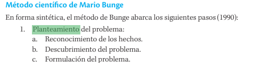

# Introducción

Al iniciar el semestre académico, es fundamental que los alumnos definan de manera precisa el objetivo de su trabajo de investigación y evalúen su relevancia, factibilidad y valor agregado. Se recomienda tomar estas decisiones después de revisar la literatura básica y explorar la disponibilidad de información estadística sobre el tema de investigación.

La investigación económica abarca una amplia diversidad y depende de la formación, capacidad y motivación del investigador. Algunos ejemplos de tipos de investigación incluyen:

1. Comprobación de hipótesis: En esta modalidad, el alumno presenta una hipótesis acerca de un fenómeno económico y busca comprobarla en su trabajo de investigación. Por ejemplo: "En la economía peruana, el mecanismo de transmisión de la política monetaria no es el canal de la tasa de interés, sino el canal del crédito".

2. Estudio de relaciones: Aquí, el alumno plantea el problema y se enfoca en determinar las relaciones entre variables económicas. Por ejemplo: ¿Cuál es la relación entre las exportaciones y el crecimiento económico en el Perú? ¿Cuáles son los determinantes del tipo de cambio real en el Perú?

3. Formulación de modelos: En esta modalidad, el alumno formula o reformula modelos para la economía peruana con el objetivo de explicar el comportamiento de variables económicas. Por ejemplo: Formulación de un modelo macroeconómico que explique la determinación de salarios, precios y empleo en el corto plazo.

A continuación, se presenta una estructura sugerida para la presentación del informe de investigación.

**I. Planteamiento del problema**

{#fig-1}

En esta sección, el estudiante, después de revisar la bibliografía relevante y los datos estadísticos relacionados con el problema económico a estudiar, llevará a cabo:

Análisis cuantitativo y/o cualitativo del comportamiento de la variable endógena (diagnóstico) - en este caso, el Producto Bruto Interno (PBI) nacional, Impuesto Selectivo al Consumo (ISC), Impuesto General a las Ventas (IGV), Impuesto a la Renta (IR) y otros impuestos.

Identificación de las causas del comportamiento de la variable endógena, basado en la relación existente entre la variable endógena y la variable exógena (explicación) - se puede emplear el método de Granger-MCO para esto.

Exposición de propuestas de política económica basadas en la explicación anterior (recomendación).

Formulación de preguntas que motiven respuestas en función del diagnóstico, explicación y recomendación.

**II. Objetivos**

En esta sección, el estudiante debe presentar de manera clara sus propósitos, tanto objetivos generales como específicos. Estos objetivos deben formularse después de responder las siguientes preguntas:

1. ¿Qué se desea lograr con la investigación?
2. ¿Qué conocimientos se busca adquirir?
3. ¿Qué se pretende demostrar?

Es importante destacar que las respuestas a estas preguntas deben contribuir a responder las interrogantes planteadas al final del planteamiento del problema.

**III. Importancia y justificación**

En esta sección, el alumno expone las razones por las cuales plantea la investigación. Estas motivaciones pueden tener un carácter teórico, metodológico o práctico. Además, se pueden abordar las siguientes interrogantes: [^1]

[^1]: Para esta sección, resulta útil revisar Mendez (1995), páginas 92-97.

- ¿Cuáles son los beneficios obtenidos al realizar esta investigación?
- ¿Por qué resulta necesaria esta investigación?
- ¿A quiénes beneficiará?
- ¿Quiénes serán los potenciales usuarios?

**IV. Antecedentes**

En esta parte, el alumno debe revisar y presentar los trabajos de investigación empírica relacionados con el tema. En general, es esencial presentar una síntesis de dichos estudios, haciendo énfasis en los objetivos, la metodología utilizada, las conclusiones y las recomendaciones.

**V. Consideraciones teóricas**

En esta sección, el alumno debe presentar la literatura teórica relevante al problema seleccionado.

**VI. Hipótesis**

En esta parte, el alumno, basándose en los elementos teóricos expuestos anteriormente, plantea una proposición de causa (variable exógena) y efecto (variable endógena). Cabe recordar que una hipótesis en modelos estáticos se traduce en palabras a partir de los resultados de los ejercicios de estática comparativa.

**VII. Metodología y datos**

En esta sección, el alumno:

1. Identifica el método a utilizar.
2. Identifica el tipo de investigación a realizar.
3. Presenta las variables económicas identificadas empíricamente.
4. Señala las fuentes de información y/o la forma de recopilación de los datos.
5. Describe el proceso de procesamiento de la información.

**VIII. Esquema**

En esta parte, el alumno presentará el esquema de la estructura del trabajo de investigación por capítulos. En cada capítulo, es necesario identificar los objetivos específicos correspondientes.

**IX. Desarrollo del esquema de investigación**

En esta sección, los alumnos, basándose en gráficos, tablas, técnicas estadísticas y econométricas, obtienen conclusiones y plantean recomendaciones en cada capítulo del esquema planteado.

**X. Bibliografía**

Aquí el alumno presenta la lista de obras consultadas que han servido para fundamentar el planteamiento del problema, los antecedentes, el marco teórico y las hipótesis.

# Bibliografía

Méndez Álvarez, C. E. (1995). Metodología: guía para elaborar diseños de investigación en ciencias económicas, contables y administrativas. Buenos Aires, Argentina: McGraw-Hill.

Mendoza Bellido, W. E. (2007). Cómo investigan los economistas: Guía para elaborar y desarrollar un proyecto de investigación. Fondo Editorial, PUCP.

# Publicaciones Similares

Si te interesó este artículo, te recomendamos que explores otros blogs y recursos relacionados que pueden ampliar tus conocimientos. Aquí te dejo algunas sugerencias:

1. [Comandos Goole Assistant](https://achalmaedison.netlify.app/blog/posts/2020-05-23-comandos-goole-assistant) Lee sin conexión 📚 [PDF](https://achalmaedison.netlify.app/blog/posts/2020-05-23-comandos-goole-assistant/index.pdf)
2. [Comandos Blogdown](https://achalmaedison.netlify.app/blog/posts/2021-07-14-comandos-blogdown) Lee sin conexión 📚 [PDF](https://achalmaedison.netlify.app/blog/posts/2021-07-14-comandos-blogdown/index.pdf)
3. [Gestion Publica Administracion Publica Definiciones Conceptos Aplicacion](https://achalmaedison.netlify.app/blog/posts/2021-10-01-gestion-publica-administracion-publica-definiciones-conceptos-aplicacion) Lee sin conexión 📚 [PDF](https://achalmaedison.netlify.app/blog/posts/2021-10-01-gestion-publica-administracion-publica-definiciones-conceptos-aplicacion/index.pdf)
4. [Reformas Modernizacion Gestion Publica Peru](https://achalmaedison.netlify.app/blog/posts/2021-10-01-reformas-modernizacion-gestion-publica-peru) Lee sin conexión 📚 [PDF](https://achalmaedison.netlify.app/blog/posts/2021-10-01-reformas-modernizacion-gestion-publica-peru/index.pdf)
5. [Economia Agraria](https://achalmaedison.netlify.app/blog/posts/2022-04-22-economia-agraria) Lee sin conexión 📚 [PDF](https://achalmaedison.netlify.app/blog/posts/2022-04-22-economia-agraria/index.pdf)
6. [Medio Ambiente](https://achalmaedison.netlify.app/blog/posts/2022-06-02-medio-ambiente) Lee sin conexión 📚 [PDF](https://achalmaedison.netlify.app/blog/posts/2022-06-02-medio-ambiente/index.pdf)
7. [Cualidades Servidores Publicos](https://achalmaedison.netlify.app/blog/posts/2023-05-11-cualidades-servidores-publicos) Lee sin conexión 📚 [PDF](https://achalmaedison.netlify.app/blog/posts/2023-05-11-cualidades-servidores-publicos/index.pdf)
8. [La Economia Peruana 1970 1990 Un Analisis Periodos Desafios](https://achalmaedison.netlify.app/blog/posts/2023-05-12-la-economia-peruana-1970-1990-un-analisis-periodos-desafios) Lee sin conexión 📚 [PDF](https://achalmaedison.netlify.app/blog/posts/2023-05-12-la-economia-peruana-1970-1990-un-analisis-periodos-desafios/index.pdf)
9. [Economia Regional](https://achalmaedison.netlify.app/blog/posts/2023-05-16-economia-regional) Lee sin conexión 📚 [PDF](https://achalmaedison.netlify.app/blog/posts/2023-05-16-economia-regional/index.pdf)
10. [Pautas Presentacion Informe Investigacion](https://achalmaedison.netlify.app/blog/posts/2023-06-03-pautas-presentacion-informe-investigacion) Lee sin conexión 📚 [PDF](https://achalmaedison.netlify.app/blog/posts/2023-06-03-pautas-presentacion-informe-investigacion/index.pdf)
11. [Recurso De Bibliografia Y Documentacion](https://achalmaedison.netlify.app/blog/posts/2025-01-12-recurso-de-bibliografia-y-documentacion) Lee sin conexión 📚 [PDF](https://achalmaedison.netlify.app/blog/posts/2025-01-12-recurso-de-bibliografia-y-documentacion/index.pdf)

Esperamos que encuentres estas publicaciones igualmente interesantes y útiles. ¡Disfruta de la lectura!

