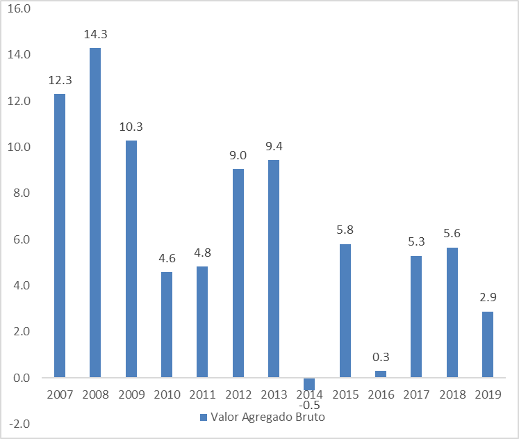

# Introducción

En el Perú, al igual que en otros países de Latinoamérica, el crecimiento económico juega un papel fundamental en la recaudación de impuestos. Sin embargo, eventos externos y factores negativos pueden afectar el crecimiento económico y, por ende, el crecimiento tributario. Como menciona CEPAL (2019), "Si bien los ingresos tributarios en las economías de ALC registraron un mayor dinamismo en 2018, la región enfrentó posteriormente importantes desafíos, los cuales se intensificaron como resultado de la pandemia del COVID-19".

Es crucial comprender la relación entre estas dos variables para establecer políticas económicas contracíclicas, que nos ayuden a generar mayores ingresos en la recaudación tributaria durante períodos de menor crecimiento económico. En los últimos diez años (2010-2019), la economía peruana ha experimentado un crecimiento anual promedio del 4.5%, y en los últimos cinco años (2015-2019) se ha expandido a una tasa promedio anual del 3.2% INEI (2019).

Aunque existen investigaciones previas sobre este tema, el objetivo de este estudio es aclarar y mejorar algunas afirmaciones, relacionando y explicando de manera más precisa la influencia y correlación entre el crecimiento económico y la recaudación tributaria en el Departamento de Ayacucho durante el período 2007-2019.

Esperamos que un mayor crecimiento económico se traduzca en una mayor recaudación tributaria, y que esta última tenga un impacto positivo en la inversión estatal en obras públicas, beneficiando así a la población y mejorando la calidad de los servicios de salud, infraestructura y educación, que son áreas prioritarias en Perú. Esta mejora en los sectores más necesitados a su vez influye en el crecimiento económico y, por lo tanto, en la recaudación tributaria.

Para abordar esta problemática, hemos llevado a cabo una exhaustiva búsqueda de información, desde artículos científicos hasta fuentes proporcionadas por entidades como SUNAT, BCRP e INEI.

El desarrollo de la investigación se dividió de la siguiente manera:

1. En la primera parte, se explicó el planteamiento del problema principal y sus problemas específicos, se establecieron los objetivos y se justificó teórica, práctica y metodológicamente la investigación. Luego, se presentaron investigaciones científicas relevantes relacionadas con nuestro tema de investigación.

2. A continuación, se detalló el marco conceptual de los principales términos, se plantearon las hipótesis, variables e indicadores, y se estableció la metodología a utilizar en el presente trabajo.

3. Finalmente, se llevaron a cabo diversos análisis estadísticos para obtener los resultados y presentar las conclusiones de nuestro estudio.

# Planteamiento del problema

## Problema General

¿En qué medida influye el crecimiento económico en la recaudación de impuestos por la SUNAT en el departamento de Ayacucho, periodo 2007-2019?

## Problemas específicos

1. ¿Cuál ha sido la tendencia de la recaudación de impuestos por la SUNAT en Ayacucho durante el periodo 2007-2019?
2. ¿Cuál ha sido la tendencia del crecimiento económico en el departamento de Ayacucho durante el periodo 2007-2019?
3. ¿Cuál es la relación entre la recaudación de impuestos por la SUNAT respecto al crecimiento económico durante el periodo 2007-2019?

# Objetivos

## Objetivos generales

Determinar la influencia del crecimiento económico en la recaudación de impuestos por la SUNAT en el departamento de Ayacucho, periodo 2007-2019.

## Objetivos específicos

1. Analizar la tendencia de la recaudación de impuestos por la SUNAT en Ayacucho durante el periodo 2007-2019.
2. Analizar la tendencia de crecimiento económico en el departamento de Ayacucho durante el periodo 2007-2019.
3. Analizar la relación existente entre crecimiento económico y la recaudación de impuestos durante el periodo 2007-2019.

# Justificación

<!-- En esta parte el alumno, expone cuáles son las razones por las que plantea la investigación. Estas motivaciones pueden ser de carácter teórico, metodológico o práctico.

¿Cuáles son los beneficios que se obtienen con su realización?

¿Por qué es necesaria esta investigación?

¿A quién o a quiénes beneficia?

¿Quién o quiénes serán los usuarios? -->

## Justificación teórica

El presente trabajo busca analizar e interpretar de manera fundamentada los efectos de la influencia del crecimiento económico en la recaudación de impuestos en la región de Ayacucho. A través de esta investigación, se espera contribuir teóricamente al conocimiento de los patrones de los diferentes sectores económicos que son importantes para el crecimiento económico. Los resultados obtenidos servirán como base para futuros estudios similares, generando un aporte significativo al entendimiento de estos fenómenos económicos.

## Justificación práctica

Los resultados de esta investigación ofrecerán información relevante para la toma de decisiones en el ámbito fiscal, lo cual puede traducirse en mejores resultados económicos tanto en la región de Ayacucho como en otras partes de Perú. Las autoridades regionales y municipales podrán utilizar estos resultados para anticipar posibles ineficiencias en la recaudación de impuestos, permitiendo un mejor manejo de los recursos fiscales en beneficio de la población. Asimismo, esta investigación ayudará a evaluar si las reformas implementadas en la política tributaria contribuyen al crecimiento económico, lo que a su vez permitirá al Estado tomar acciones para abordar la elusión y evasión fiscal en los diferentes sectores económicos y promover el desarrollo del país.

## Justificación metodológica

Esta investigación se basa en un análisis estadístico aplicado, descriptivo y cuantitativo para determinar los efectos del crecimiento económico en la recaudación de impuestos por la SUNAT. Se emplearán técnicas de análisis de datos que permitirán obtener resultados más precisos y confiables. Además, se generarán nuevas fuentes de información que podrían utilizarse en futuros estudios para explorar la relación entre el crecimiento económico, la recaudación de impuestos y otras variables relacionadas, en aras de obtener resultados más técnicos y robustos.

# Marco teórico

## Sistema teórico

Según @akanbi_impact_2020 en su artículo científico investigó “The Impact of Tax Collection and Incentives on Economic Growth: Evidence from Nigeria”. Para ello se utilizó el modelo econométrico de análisis de regresión múltiple entre el producto bruto interno real (variable dependiente) y las variables de recaudación de impuestos e incentivos que afectan al crecimiento económico, como los ingresos fiscales, la inversión extranjera directa de capital, la inversión extranjera directa de otro capital que mide los incentivos (variables independientes) que cubre un período de ocho años entre 2011 y 2018 obtenidos del Servicio Federal de Impuestos Internos y del Banco Central de Nigeria. Dada la siguiente ecuación de estimación:

$PIB = a + β_i TAXR + β_2 FDI + β_3 FDIC + e$

$TAXR$: Impuesto recaudado

$IED$: Inversión Extranjera Directa - Capital

$FDIC$: Inversión Extranjera Directa - Otros capitales Coeficientes sustituidos

Señala que los ingresos fiscales dependen del nivel de cumplimiento del pago de impuestos por parte de los contribuyentes y de la recaudación por parte del gobierno. Además, teniendo en cuenta la teoría de los impuestos de Ibn Jaldún, que un tipo impositivo elevado no garantiza que se vaya a maximizar los ingresos y la recaudación de impuestos, ya que al contrario desalientan al esfuerzo laboral y que se dé la evasión fiscal. Basado en la teoría de la curva de Laffer, el aumento de los ingresos fiscales totales se da por la reducción de los tipos impositivos ya que mejora la recaudación y el cumplimiento de los impuestos.

La teoría del beneficio fiscal menciona que una persona que obtenga mayores beneficios debería pagar más impuestos de acuerdo con su capacidad contributiva, su capacidad de pago y beneficio obtenido.

Los resultados revelaron que existe una relación negativa pero no significativa entre los ingresos fiscales y el crecimiento económico en Nigeria, lo que quiere decir que los ingresos fiscales no han repercutido en el PBI real. Por lo cual recomienda que las autoridades debieran realizar exoneraciones al pago de impuestos en los sectores productivos para reducir sus costes de producción y de esta manera, ayudar al aumento de la productividad en estos sectores que tendría efectos positivos sobre el crecimiento económico de Nigeria.

@ronquillo_recaudaciones_2017 en su artículo sobre “Las recaudaciones tributarias y el crecimiento económico, un análisis a través del PBI de Ecuador” en la cual muestran una relación empírica y teórica entre las variables tomadas. Por ello se tomaron datos históricos anuales entre el periodo 2008 al 2016, tomando el corte longitudinal con un enfoque cuantitativo y deductivo en el cual se aplicó un análisis de crecimiento porcentual, al final se realizó una regresión para saber la relación que existe entre estas variables que es el Producto Bruto Interno (variable independiente) y el Impuesto a la renta (variable dependiente).

En conclusión, en el análisis descriptivo de las variables menciona que los cambios en el PBI y el impuesto tuvieron un comportamiento parecido. Es decir, ambas variables presentan cambios positivos, que nos dice que existe un aumento en las recaudaciones tributarias y el PBI.

Además, la variable independiente (PBI) y la variable dependiente (Impuesto a la renta) indican que en el periodo estudiado tendrán un crecimiento del 6% y del 7.4% respectivamente.

Por otra parte, mediante un análisis de correlación, el PBI explica en un 93% con los resultados económicos del impuesto, por lo que existe un alto nivel de correlación entre las variables que es del 96%.

@cacay_cacay_efecto_2021 en su artículo “Efecto del crecimiento y la presión fiscal sobre el impuesto al valor agregado”, habla sobre el impuesto al valor agregado como primera fuente de ingreso de la economía ecuatoriana, y cómo esta variable se relaciona con el crecimiento económico y la presión fiscal.

El objetivo de este artículo es identificar la incidencia del crecimiento económico y la presión fiscal en la recaudación del impuesto del valor agregado para el periodo 2000 al 2019, para ello se utilizó un modelo de Mínimos cuadrados ordinarios (MCO), y ver qué tipo de relación existe entre las variables mencionadas.

La investigación de este artículo es de tipo explicativa con alcance correlacional, porque se analiza y mide el efecto y grado de relación entre las variables; para ello se hizo una estimación y algunos ajustes algebraicos. Para la estimación se utilizó cifras anuales y luego fueron transformadas a logaritmos para ser analizados como elasticidades. Se corrigieron problemas de heterocedasticidad, autocorrelación y multicolinealidad.

Finalmente se llegó a las siguientes conclusiones, el financiamiento público y la recaudación tributaria es un tema significativo, por lo tanto, la incidencia del crecimiento económico y la presión fiscal en la recaudación tributaria del impuesto al valor agregado son estadísticamente significativas; entonces a mayor crecimiento económico mayor recaudación del impuesto al valor agregado, es decir, existe una relación directa.

Kagan, J. (2021), investigó sobre la relación de los impuestos y el PBI con el objetivo de conocer si las tasas impositivas generan un crecimiento o una contracción económica, con la idea de comprender si pudiera existir más puestos de trabajo. La metodología de investigación es cualitativa, porque considera información del banco mundial donde encuentra datos respectivos entre los años 1972 – 2019, y muestra la relación que existe entre los impuestos y PBI, confirmando un crecimiento económico y una reducción de la pobreza a largo plazo. Además, toma en cuenta que, si bien tienen una relación directa a la recaudación de impuesto con el PBI, existen otros factores que contribuyen al crecimiento de la economía.

Por consiguiente, la relación que existe entre impuestos y PBI depende de los ingresos fiscales de una nación en relación con el tamaño de su economía, además, que los países con mayor desarrollo tienen una relación más alta entre el impuesto y PBI.

Paymaster, F. (2020) en su artículo científico investigó “Problems of Tax Collection and Its Effect on Gross Domestic Product in Nigeria”. Para ello utilizó el modelo de mínimos cuadrados ordinarios dinámicos desde el primer trimestre del año 2011 hasta el segundo trimestre de 2018 para estimar una relación dinámica entre los conjuntos de datos, teniendo como variable dependiente el producto interior bruto (PIB), el cual un indicador del crecimiento económico y también una medida de contabilidad de la renta nacional.

Debido a que el gobierno pierde ingresos fiscales a través de la evasión fiscal, se espera que los cambios en los indicadores de evasión fiscal predigan los cambios en el producto interior bruto, ya que ambas contribuyen enormemente a la caída de los ingresos.

Como resultado se obtuvo una causalidad unidireccional entre la evasión fiscal de la plusvalía y el PIB. Por lo tanto, se confirma que el PIB (valor p 0,0119 < 0,9369) evidentemente causa la evasión del impuesto de sociedades. Coincidiendo así con las teorías y algunos resultados empíricos en el que la evasión fiscal estanca el crecimiento económico.

@neog_tax_2020 En el presente estudio sobre “Tax structure and economic growth: a study of selected Indian states”, examina la relación largo y corto plazo entre la estructura tributaria y el desempeño del crecimiento a nivel estatal en la India para el período 1991-2016. La metodología empleada para el estudio es cuantitativa, dado que se basa en un análisis del modelo Acosta-Ormaechea y Yoo (2012), y para verificar la relación entre la tributación y el crecimiento económico se utiliza el método de regresión de panel, considerando 14 estados de la India.

Con base en el análisis se encontró que los impuestos a la propiedad son buenos para el crecimiento dado que se tiene un incremento, en cambio los impuestos sobre productos básicos y servicios lo reducen teniendo consecuencias negativas. Además, los impuestos de la renta no tienen un impacto significativo en el crecimiento.

@rivero_impuestos_2008 en su artículo “Impuestos y crecimiento económico: una panorámica” hace un estudio del crecimiento económico y su dependencia de los efectos de los impuestos.

Para ello hace uso de las teorías neoclásicas y el modelo de crecimiento endógeno de Romer, donde la tasa de crecimiento a largo plazo depende de factores exógenos como el crecimiento de la población y el progreso tecnológico, por lo que la política fiscal y el tamaño del sector público no explicarían diferenciales permanentes de tasas de crecimiento, aunque sí discrepancias a corto o medio plazo.

En conclusión, los modelos neoclásicos de crecimiento sostienen que los impuestos no son determinantes del crecimiento a largo plazo de las economías. Por otro lado, las teorías de crecimiento endógeno sí avalan dicha relación en la medida en que pueden afectar a la acumulación de capital humano y a la productividad del factor trabajo.

@fergusson_impuestos_2003 investigó sobre los Impuestos, Crecimiento Económico Y Bienestar En Colombia (1970-1999). Utilizó tasas que sirvieron para cuantificar los costos en bienestar y crecimiento de la tributación con base en un modelo sencillo de equilibrio general dinámico y previsión perfecta.

En el cual calculan las tasas efectivas promedio de tributación sobre el consumo y sobre el ingreso de los factores de producción en Colombia, en el período 1970-1999.

Menciona que la teoría económica sugiere que los impuestos, al distorsionar la toma de decisiones individuales, pueden reducir el bienestar y el crecimiento económicos. En conclusión, los resultados indican que desde 1970, más en la segunda mitad de la década del noventa, la política tributaria ha impuesto sobre la economía colombiana costos crecientes de eficiencia. También sugieren que se ha sacrificado el crecimiento, la magnitud de ese sacrificio es cuantitativamente despreciable en la mayoría de los casos, con la excepción de la segunda mitad de la década del noventa.

@carrera_ciclo_1999 Investigaron la relación entre el ciclo económico y la recaudación fiscal en la economía argentina, con cambios desde un contexto estable a uno inestable, tuvieron la finalidad de saber la intensidad de esta relación y las regularidades empíricas. Usaron la metodología general realizando un enfoque secuencial, eligiendo las variables más representativas del ciclo económico y la recaudación federal, analizando las características del comportamiento de la serie, luego estudiando las variables y sus características intrínsecas (tendencia, volatilidad, persistencia y simetría), después analizando las correlaciones y, por último, estudiando la causalidad a través de la prueba de Granger. Teniendo en cuenta lo anterior, realizaron el análisis de regresión para determinar la sensibilidad de la asociación entre los ciclos comparando los resultados para el período completo 1985-97 y también para 1991-97. Siendo las variables estudiadas el PBI y la recaudación total, inflación, DGI, IVA y ganancias. En sus estudios, encontraron correlaciones significativas respecto a la relación de la recaudación con el ciclo económico. Así mismo, según el estudio, el PBI causa en sentido de Granger de todas las variables, menos del IVA (impuesto al valor agregado).

Según @tello_determinantes_2018 en su artículo científico investigó “Determinantes de la recaudación estatal de impuestos en México”. Para ello utilizó un modelo de un panel de datos con efectos fijos por Mínimos Cuadrados Generalizados desde 2010 a 2014 que le permitió combinar tanto una dimensión temporal como una estructural.

Detalla previamente que existe una mayor recaudación estatal donde los contribuyentes tengan una alta capacidad contributiva y las instituciones sean suficientemente sólidas, confiables, eficientes y capaces de cumplir con sus funciones, así como de cobrar y fiscalizar los tributos.

En base a cinco determinantes sometidos a prueba, concluye que estas muestran significancia estadística, teniendo así al PIB per cápita (con un coeficiente asociado de 0.99) con el mayor peso explicativo, seguido de la presión fiscal (con un coeficiente de 0.55), la tasa del ISN (con un coeficiente de 0.28) y la importancia de las exportaciones (con un coeficiente de 0.05). Aunque la importancia de la industria en la economía como determinante de la recaudación, tiene significancia estadística, ésta debería tener un sentido negativo.

Con lo cual concluye que la recaudación se ve favorecida de manera directa con el PBI per cápita ya que a medida que la población tenga un nivel de ingreso más elevado se podrán obtener mayores impuestos per cápita, adicional al control que los gobiernos estatales realizan en los países.

@ordonez_crecimiento_2014 investigó sobre el “crecimiento económico e ingresos tributarios del Perú”. Para ello, se establecieron los indicadores en el cual se utilizó el método de Mínimos Cuadrados Ordinarios (MCO) para la estimación del efecto de la variable explicativa (el crecimiento económico) sobre la variable explicada (los ingresos tributarios), entre los años 1990 y 2010.

El propósito de la investigación ha sido determinar la relación entre el crecimiento económico y los ingresos tributarios del Perú en los años 1990 y 2010.

Para la estimación del efecto de la variable explicativa sobre la variable explicada, se recopiló y ordenó la información existente que permitió describir la estructura y evolución de cada una de las variables y establecer la relación que había entre ellas.

En conclusión, esta investigación ha permitido establecer de qué manera se han comportado los indicadores del crecimiento y de los impuestos en el Perú, tanto en términos absolutos como relativos, y de qué manera están relacionados dichos indicadores. Adicionalmente, podemos apreciar que, la tendencia creciente de la economía peruana, expresada en el aumento de la producción y los impuestos como la presión tributaria sigue siendo aún ineficiente.

@jaimovich_nonlinear_2017 en su artículo “Nonlinear effects of taxation on grow” proponen un modelo consistente con dos observaciones. Primero, las tasas impositivas adoptadas por diferentes países generalmente no están correlacionadas con su desempeño de crecimiento. En segundo lugar, los países que reducen drásticamente los incentivos privados para invertir perjudican gravemente su crecimiento.

El objetivo es identificar el efecto de los impuestos sobre la renta de capital en la tasa de crecimiento de la economía.

Para tal efecto se considera el modelo de Romer lo cual consiste en que el crecimiento es impulsado por la innovación que expande la variedad de insumos intermedios. Donde se observa la no linealidad entre el impuesto y el crecimiento generada por la heterogeneidad en la capacidad emprendedora.

En una economía donde existen impuestos bajos, la capacidad del empresario marginal es relativamente baja. Entonces, aumentar la tasa impositiva conduce a la salida de empresarios de baja capacidad y a una pequeña disminución en la tasa de crecimiento. En una economía con existencia de impuestos altos, la capacidad del empresario marginal es relativamente elevada. Por lo tanto, el aumento de la tasa impositiva conduce a la salida de empresarios de alta capacidad y a una gran disminución en la tasa de crecimiento.

En conclusión, los impuestos tienen un pequeño impacto a largo plazo del crecimiento cuando las tasas impositivas y otros desincentivos a la inversión son bajos o moderados. Pero a medida que aumentan las tasas impositivas, el impacto marginal de los impuestos sobre el crecimiento también aumenta.

@campos_sistema_2018 investigaron sobre El sistema tributario y su impacto en la Economía Popular y Solidaria en el Ecuador. lo cual buscaban desarrollar un nuevo modelo tributario que impulsará el desarrollo económico del país, a través de una recaudación tributaria eficiente y una distribución justa de la riqueza generada, inversión, crecimiento, productividad y empleo. En un análisis de series de tiempo, se encontró que, en Ecuador, las contribuciones tributarias aumentaron en más de 7 puntos porcentuales debido al lento desarrollo del sistema tributario ecuatoriano; en los últimos años, aumentó de 5,20% en 1997 a 12,80% en 2016.

Las principales causas del fraude son la falta de conocimiento tributario, contribución demasiado alta, estructura complicada del sistema tributario, no hay agencias administrativas que promulgan regulaciones tributarias. , bajo riesgo de detección, resistencia al pago de impuestos, falta de liquidez en las empresas, son los factores más importantes.

Con este estudio, es posible identificar las bases teóricas a fin de establecer políticas fiscales que promuevan el crecimiento de este sector económico, en el cual la clave es equilibrar los ingresos entre ingresos directos y Los impuestos indirectos y el Estado no deben crear más impuestos, sino aumentar el número de contribuyentes, con incentivos de cultura tributaria. Por lo tanto, el Estado de Ecuador debe establecer una política fiscal que incentive la inversión y el empleo mediante la implementación de una tasa de IVA discriminatoria y reducida para este sector, ya que actualmente existe una tasa impositiva única del 12% para todos los socios sociales. sectores económicos del país. , sin discriminar su capacidad económica.

Bejarano, H. (2013), en su artículo de investigación Tributación En Colombia: La Tasa Óptima Que Maximiza El Recaudo Tributario. En el que realizó un estudio con un objetivo general propuesto que es el de encontrar para la economía colombiana, la tasa impositiva adecuada de manera que se genere los máximos recaudos tributarios para el gobierno central.

La metodología empleada es la de una investigación cuantitativa, referida a la investigación empírica sistemática, a través del uso de técnicas estadísticas y matemáticas. La variable dependiente es el recaudo tributario real per cápita medido en pesos del año 2000 en el período t; y las variables independientes son: la tasa impositiva en el periodo t, e índice de producción industrial en el periodo t. Y respecto al modelo econométrico empleado, se utiliza una metodología de regresión lineal múltiple para el período 1980-2010.

En todas las regresiones ajustadas se llevó a cabo el proceso de verificación de supuestos mediante las pruebas Breusch-Pagan (heterocedasticidad), Breusch-Godfrey (auto correlación), y Kolmogorov-Smirnov (normalidad), llegando a la conclusión que los residuales estimados en todas las regresiones son normales, homocedásticos y auto correlacionados, por lo cual se aplica el método de corrección de mínimos cuadrados generalizados.  
Finalmente, la conclusión que arrojó la investigación es: para el caso colombiano se puede observar que aplicar una tasa tributaria sostenida del 26% en promedio debe conducir a alcanzar un óptimo de recaudo para el gobierno central, para lo cual se sugiere la aplicación de esta.

@gashi_effect_2018 En su artículo, “The Effect of Tax Structure in Economic Growth” analiza el efecto de la estructura fiscal en el crecimiento económico de Kosovo, el objetivo del artículo es evaluar el impacto de los impuestos sobre el crecimiento económico, La Administración Tributaria de Kosovo desde el comienzo de su funcionamiento logró importantes resultados en la recaudación de ingresos de manera eficaz, se refiere a la provisión de servicios de ayuda voluntaria, la igualdad de trato de todos los contribuyentes y la implementación exitosa de la planificación de la recaudación de ingresos. El éxito alcanzado se refiere a la prestación de servicios profesionales, transparentes y efectivos y a través de la implementación justa y uniforme de las leyes tributarias

Para el desarrollo de este trabajo se adoptó la metodología de análisis comparativo, utilizando data anual del 2007 al 2015, Usamos el modelo econométrico recolectando datos y transformando en logaritmos naturales usando el modelo LOG-LOG. ¿la política fiscal tendrá un impacto en el desarrollo y el crecimiento económicos o tendrá un impacto negativo en el PIB? Al plantear las hipótesis de investigación, examinamos el efecto positivo o negativo de la estructura de los impuestos en el crecimiento económico.

Esta investigación contribuye a la política fiscal para crear una estructura tributaria que sea compatible con el nivel de desarrollo económico, teniendo efectos positivos sobre los ingresos, las inversiones, el empleo y el crecimiento económico. Los resultados de este estudio muestran que no todos los impuestos tienen un impacto positivo en su crecimiento económico. se concluye que el impuesto a las utilidades, el impuesto a las empresas individuales, el impuesto al valor agregado, la tributación de los estados mensuales, la recaudación de recursos y el pago de impuestos sobre intereses, dividendos, derechos de propiedad, Los alquileres, las ganancias de loterías y juegos de azar y el impuesto de sociedades son importantes y tienen un impacto positivo en el PIB de Kosovo, a diferencia de los impuestos personales y las retenciones en origen, que no son significativos y tienen un impacto negativo en el crecimiento económico.

@chiappelo_crecimiento_2018 investigaron el “Crecimiento económico y el rol de los impuestos: evidencia para América” analizando la relación entre el crecimiento económico y los impuestos al ingreso personal y corporativo para las economías más considerables de América, buscando evidencia empírica de la existencia de una curva de crecimiento de Laffer. Para ello trabajaron con 20 países de América en el periodo de 1990 a 2016 y utilizando una relación cuadrática, entre el crecimiento del PBI per cápita y las tasas de los impuestos a estudiar, estimando a través de efectos fijos.

$g_{i, t} = \alpha + \beta_{1}X_{i, t}^{´} + \beta_{2}X_{i, t}^{´2} + \beta_{3}Z_{i, t}^{´} + \delta_{i, t}^{´} + u_{i, t} + \epsilon_{i, t}$

Donde los subíndices indican el país (i) y el periodo (t), la variable dependiente es el promedio de tres años de la tasa de crecimiento del PBI per cápita $g_{i, t}$, y las variables dependientes son: el vector de las tasas máximas marginales de los impuestos al ingreso personal y corporativo en el año inicial de cada subperiodo $X_{i, t}$, el factor cuadrático de la medida anterior para controlar la no-linealidad de las tasas, el vector de las variables explicativas basadas en la literatura de crecimiento $Z_{i, t}$, dummies de tiempo capturando shocks que afectan el crecimiento de la economía $\delta_{i, t}^{´}$, el efecto fijo del país i $u_{i}$ y finalmente el término del error del modelo $\epsilon_{i, t}$.

Encontrando que el aumento en la tasa de impuestos al ingreso personal y corporativo, causan un incremento en el crecimiento, hasta que en un punto los resultados se revierten y se vuelve negativo. Así mismo, estimando el modelo con diversas especificaciones de la literatura, se confirma la existencia de una curva de crecimiento de Laffer (growth Laffer curve).

@beltran-ayala_impuestos_2020 Investigaron sobre” Los impuestos directos e indirectos y su incidencia en el crecimiento económico en el Ecuador”. Por el cual se determinó mediante un modelo econométrico de regresión múltiple, con datos de series de tiempo. Se utilizaron datos trimestrales del periodo comprendido entre el primer trimestre 2008 y el segundo trimestre 2020, así como los datos proyectados para el tercer trimestre 2020, para lo cual el modelo planteado tuvo como variable dependiente al PIB, y como variables independientes a los impuestos directos (ID) e impuestos indirectos (IID).

Este trabajo tuvo como objetivo analizar la relación de la recaudación tributaria con el crecimiento económico además se optó por introducir al consumo del gobierno (G) como variable de control debido a su mayor grado de explicación sobre PIB. inclusive se incluyó la variable consumo de los hogares (C); con el fin de darle mayor robustez al modelo por lo que no es necesario explicar su comportamiento.

Los resultados obtenidos muestran que los impuestos indirectos guardan una relación directa con el crecimiento económico, sin embargo, la correlación entre impuestos directos y crecimiento económico no es significativa para el modelo.

@banda-ortiz_impacto_2018 en su artículo “Impacto de la estructura tributaria sobre el crecimiento económico: el caso de México” analiza el impacto de la estructura tributaria sobre el crecimiento económico mexicano en los periodos de 2005 a 2006, donde desarrolló un modelo econométrico, donde las variables independientes son los impuestos a la renta, impuesto al valor agregado, impuesto sobre la producción, e impuestos sobre las importaciones y la variable dependiente es el PBI.

El objetivo de este artículo es establecer una relación entre las variables, además de estudiar cómo es su influencia y su correlación entre ellas, por ello el objetivo es establecer un modelo que explique una relación entre las variables ya mencionadas.

La metodología que se sigue en este artículo es un enfoque cualitativo, porque se utiliza la data trimestral de los periodos 2005/01 al 2016/02, primero se desarrollaron los elementos teóricos del crecimiento económico y de la tributación para establecer una relación entre las variables establecidas.

Finalmente, llegó a la conclusión de que los impuestos tienen un impacto negativo, porque reducen el ingreso disponible, pero también son la fuente principal de gasto público, si recauda bien tendría un impacto negativo en la economía, pero esto solo se da en economías muy desarrolladas. Por ello se debe estudiar qué tipo de impuesto tiene un impacto positivo y que impuesto tiene impactos negativos.

En los hallazgos previos, se comprueba que los impuestos al ingreso impactan negativamente sobre el nivel y la tasa de crecimiento del PBI, por el contrario, los impuestos al consumo tienen un impacto positivo.

Kalas,B.; Mirovic V. & Milenković, N. (2018) en su artículo científico investigó “The Relationship Between Taxes And Economic Growth: Evidence From Serbia And Croatia”. Para ello utilizó el modelo de una regresión de panel para estudiar la relación entre las variables. Tomando como período desde el 2007 hasta el 2016 en Serbia y Croacia, utilizando la participación porcentual del PIB a partir de los datos oficiales del Fondo Monetario Internacional. Estableciendo el siguiente modelo de regresión:

$GDP_{i, t} = β_0 + β_{1}CIT_{i, t}+ β_{2}VAT_{i, t} + β_{3}SSC_{i, t} + β_{4}EXC_{i, t} + ε_{i, t}$

$CIT$: Impuesto sobre la renta de sociedades

$VAT$: Impuesto al valor agregado

$SSC$: Contribuciones de seguridad

$EXC$: Impuestos especiales

Previamente en su análisis teórico señala que el sistema fiscal de Serbia desde el año 2000 ha tenido un crecimiento en el PBI gracias a las contribuciones a la seguridad social que son fuente principal de sus ingresos tributarios. Mientras que en Croacia la participación de los ingresos fiscales no tiene una participación muy pronunciada en cuanto al efecto que pueda causar en su PBI, teniendo así una diferencia de al menos 10% de aporte PBI con respecto al otro país.

Los resultados del análisis mostraron que el impuesto sobre la renta de las sociedades, el impuesto al valor agregado y las contribuciones a la seguridad social tiene un impacto positivo en el PBI, mientras que los impuestos especiales lo afectan de manera negativa. Además, quien impacta en mayor medida es el VAT en comparación con los otros, lo que en base a los resultados se puede decir que ante un aumento del 1% del impuesto al valor agregado el PIB aumenta en un 3.09%.

@taha_effect_2011 En su artículo, “El efecto del crecimiento económico en los ingresos fiscales: El caso de un país recientemente industrializado”, investigaron los ingresos fiscales del gobierno de Malasia durante el período 1970-2009.

Utilizaron la técnica de identificación de la raíz unitaria con el objetivo determinar las características de la serie individual, también se considera la cointegración a largo plazo con el enfoque de Johansen con el objetivo de determinar si alguna combinación de las variables está cointegrada. Por ello se usó crecimiento del PIB como un proxy del crecimiento económico (EG) y el valor del PIB (Año base 2000 = 100). Para medir los ingresos fiscales del gobierno (TR), los ingresos fiscales totales incluyen la recaudación de los ingresos por impuestos directos e indirectos.

Con base a los resultados muestran que los cambios en la tributación no tienen algún impacto en el crecimiento económico, también los resultados muestran que el fuerte crecimiento económico ayuda a impulsar el aumento de la recaudación de impuesto y la estabilidad económica a largo plazo y a corto plazo provocando resultados positivos. Por lo tanto, considerando la descomposición de ingresos tributarios directos, indirectos y no tributarios pueden proporcionar resultados significativos.

@velepucha_ecuador_2021 en su artículo científico “Ecuador: Recaudación de tributos comparado con principales indicadores macroeconómicos, 2010-2019”, hizo un estudio con la finalidad de encontrar una relación de las reformas tributarias con el crecimiento económico del país. Por ello utilizó el método cuantitativo con un análisis estadístico donde se analiza primeramente las tendencias del impuesto al valor agregado (IVA) y el impuesto a la renta (IR), así mismo las tendencias de los principales indicadores económicos tales como desempleo, inflación y PIB, por medio de las series de tiempo. Además, analiza una correlación cruzada entre los indicadores y los recaudos para determinar el comportamiento entre las variables seleccionadas. Se concluye que existe una relación directa entre la recaudación de impuestos y el PBI, dado que durante el periodo de estudio 2010-2019 se encontró que los gobiernos ecuatorianos han llevado a cabo diferentes reformas tributarias, con el fin de obtener mayores ingresos fiscales para poder cubrir los diferentes gastos.

@narvaez_cumbicos_impacto_2019 en su artículo científico analizó sobre el “Impacto entre la actividad económica y el efecto del incremento de la recaudación tributaria en Ecuador: periodo 2010-2017”. Para dicho estudio llevó a cabo un análisis descriptivo, bibliográfico y se utilizó una metodología de investigación correlacional integral, aplicando la regresión lineal, considerando el modelo de regresión de mínimo cuadrados ordinarios teniendo como variable dependiente Recaudación Tributaria y la variable independiente a actividad económica en la provincia de Santa Elena.

Con los resultados de la regresión obteniendo un valor de R2=0.76, llegaron a la conclusión de que un aumento de la actividad económica en la provincia de Santa Elena afectó de manera positiva en el incremento de la Recaudación Tributaria Nacional periodo 2010-2017, teniendo un aumento de la recaudación tributaria nacional a través de tiempo paralelo con la recaudación tributaria de la provincia de Santa Elena de manera proporcional. También realizó la prueba de correlación, y se obtuvo un valor de 0.871 de asociación y su nivel de significancia aceptable.

@benitez_impacto_2019 En su investigación “Impacto del PIB sobre los ingresos tributarios del Ecuador durante el periodo 2000-2018”. Realizó el estudio con la finalidad de medir el impacto del Producto Interno Bruto del Ecuador, en la recaudación tributaria del Impuesto al Valor Agregado, Impuesto sobre la Renta y Derechos Arancelarios frente a las Importaciones, desde el año 2000 hasta junio del 2018 con una perspectiva para corto y largo plazo. En el cual lo realizó mediante Mínimos Cuadrados Ordinarios, y los de corto plazo con el Modelo de Corrección de Errores con datos trimestrales equivalentes a 74 observaciones desde el I trimestre del año 2000 hasta el II trimestre del 2018.Como resultado menciona que las recaudaciones tributarias efectivas, según la serie de tiempo analizada (2000 – 2018) del ISR, IVA y DA, no han sido suficientes para el presupuesto general del Estado.

En cambio, para el modelo de elasticidad estimados en el largo plazo indican que, por cada punto porcentual de aumento en el PIB, la recaudación de largo plazo del ISR se incrementará en 2,32%, del IVA en 1,50%, y los DA en 0,97% cuando las importaciones se incrementan en 1%. De acuerdo con los datos, se tiene que el ISR es la principal fuente de ingresos tributarios para el Fisco, debido a que este impuesto se grava directamente sobre los salarios y sobre la renta de capital, lo cual afecta a la renta de los trabajadores, a las utilidades de los inversionistas, y, a las decisiones relacionadas con el ahorro y la inversión.

@nina_politicas_2017 investigaron “Las políticas tributarias en el crecimiento económico de Ecuador, 2000-2015” para determinar la incidencia de las políticas tributarias en el crecimiento económico en la economía ecuatoriana en dicho periodo. Para ello trabajaron con datos de serie de tiempo de recaudación tributaria desde el año 2000, debido a que en ese año toma mayor importancia las políticas tributarias; la investigación se basa en un enfoque cuantitativo y deductivo empleando un análisis de tipo correlacional, porque se busca una asociación y correlación entre las variables de estudio. El modelo econométrico aplicado es con logaritmos, siendo un modelo de regresión múltiple.

$𝑙𝑛𝑌_𝑖 = 𝛽_0 + 𝛽_{1}𝑙𝑛𝑋_1 + 𝛽_{2}𝑙𝑛𝑋_2 + 𝛽_{3}𝑙𝑛𝑋_3 + 𝛽_{4}𝑙𝑛𝑋_4 + 𝛽_{5}𝑙𝑛𝑋_5 + 𝑈_𝑖$

Dónde:

$LnY_i$= Logaritmo del Producto Interno Bruto (PIB)

$LnX_1$= Logaritmo del Impuesto a la renta

$LnX_2$= Logaritmo del Impuesto al valor agregado (IVA)

$LnX_3$= Logaritmo del Impuesto a los consumos especiales (ICE)

$LnX_4$= Logaritmo del Impuestos agregados especiales

$LnX_5$= Logaritmo de Otros impuestos

$U_i$= Término de perturbación estocástica.

Los resultados establecen una correlación significativa entre las políticas tributarias y el crecimiento económico de Ecuador, así mismo, existe una dependencia de las variables, por lo tanto, la variable dependiente (crecimiento económico) está explicada por la variable independiente (políticas tributarias). Concluyendo que existe una relación positiva entre los ingresos por concepto de tributación y el crecimiento económico y que los ingresos tributarios constituyen una fuente importante de ingresos para la economía de Ecuador, siendo los principales y más representativos en la recaudación: el impuesto a la renta, al valor agregado y a los consumos especiales, las cuales tuvieron un comportamiento creciente a lo largo del periodo de estudio.

@henriquez_impuesto_2014 estudió el impuesto sobre el valor agregado (IVA) analizando su eficiencia y relación con el crecimiento económico en la economía de Chile. Para el estudio llevó a cabo un análisis descriptivo, debido a que está basado en teorías, siendo un estudio no experimental.

Según el estudio, el IVA es una forma de tributación al gasto en consumo caracterizado por ser más eficiente que otras alternativas para gravar el gasto, ya que no genera el efecto piramidación y cascada, siendo el principal impuesto recaudador del sistema tributario chileno. El IVA no distorsiona el precio relativo entre consumo presente y el consumo futuro, por lo tanto, no incentiva ni desincentiva el ahorro y la inversión, debido a ello tiene una ventaja con respecto al impuesto a la renta, que es otro impuesto recaudador muy importante en la economía chilena. Concluyendo que el IVA es un impuesto “amigable” con el crecimiento económico, ya que no grava el ahorro y la inversión.

@cid_pedraza_espacio_2018 en su investigación sobre Espacio Fiscal Para Salud En Las Américas: ¿Es Suficiente El Crecimiento Económico? Realizó un estudio con la finalidad de determinar para cada uno de los países de la Región, si pueden alcanzar la meta de 6% en el PBI con solo el crecimiento económico. Por lo cual realizó un estudio de tipo cuantitativo, exploratorio y longitudinal, también se utilizó datos del Banco Mundial y de la Organización Mundial de Salud con los cuales se llegaron a estimar las elasticidades del gasto público en salud con respecto al PIB para cada país. Con base en el crecimiento económico real y el proyectado por el Fondo Monetario Internacional 2016–2021.

Respecto a los estudios realizados llegaron a la conclusión que los estudios específicos para países han mostrado que el crecimiento económico es una fuente con potencial técnico y factibilidad política para aumentar el gasto público en salud (GPS) en la región. No obstante, su evolución y la relación entre ambas variables establecen limitaciones. Por lo cual los resultados son contundentes mostrando que pocos países pueden alcanzar la meta de GPS igual a 6% del PIB con base en los recursos que genere el crecimiento económico.

@de_la_fuente_relacion_2021 En su artículo sobre La relación entre el crecimiento de los ingresos tributarios autonómicos y el crecimiento del PBI. Estudió la relación que existe entre la evolución del PBI regional y la de los ingresos tributarios homogéneos tras eliminar los efectos de los principales cambios normativos que afectan a la recaudación de los impuestos relevantes. Por lo que vio conveniente estimar la relación entre el crecimiento del PBI regional y el de los ingresos tributarios homogéneos de las comunidades autónomas. Los datos que usó fueron los impuestos cedidos tradicionales y el crecimiento del PBI durante los años 2002-2018. Respecto a los resultados obtenidos de las múltiples regresiones que se hizo muestran la relación directa, entre el crecimiento de cada una de estas partidas de recaudación y el del PBI nominal.

@fernandez_producto_2019 en su artículo científico investigó “El Producto Bruto Interno (PBI) y su relación con los ingresos tributarios en el Perú 2007-2018”. Para ello, primero realizó una prueba de normalidad para demostrar si los datos se distribuyen normalmente y debido a la normalidad encontrada utilizó el análisis de correlación de Pearson. Utilizó la información documental de la SUNAT del Producto Bruto Interno (PBI) y los Ingresos Tributarios desde el 2007 hasta el 2018.

El gasto público es uno de los cuatro componentes más importantes dentro de los cuales también encontramos al consumo privado, la inversión privada y las exportaciones; es necesario que el estado asegure el cumplimiento de la recaudación tributaria a través de los impuestos justos que posteriormente tendrá resultados positivos en la calidad de los ciudadanos.

Con los resultados obtenidos del análisis se mostró que existe una relación significativa entre los ingresos tributarios que recauda el gobierno central con el PBI, además debido a la correlación alta entre ambas variables se puede afirmar que existe una relación directa. Concluyendo que si la actividad económica tiende a crecer esto se verá reflejado en la recaudación de los ingresos tributarios y a su vez en el mayor aumento de la demanda interna y externa, los cuales son elementos muy importantes para la reactivación de la economía del Perú.

@shuai_effect_2013 en su artículo científico investigó “The Effect of State Corporate Income Tax Rate Cuts on Job Creation”. Para ello, utilizó un modelo econométrico de panel de datos con efectos fijos. Por lo cual, con el fin de seleccionar el más apropiado realizó la prueba de Haussman del siguiente modelo especificado:

$EG_{i, t} = β_{1}PG_{i, t-1} + β_{2}TaxRate_{i, t} + β_{3}TaxCutInd_{i, t-L} + γ_t + ε_{i, t}$

$EG_{i, t}$: Tasas de crecimiento anual del empleo

$PG_{i, t-1}$: Tasa de crecimiento demográfico rezagada

$TaxRate_{i, t}$: Tasas del impuesto sobre la renta de las empresas estatales.

$TaxCutInd_{i, t-L}$: Acción de un recorte de impuestos (L, desfase de tiempo en los años 0 a 5)

Utilizó la información de series de tiempo de 50 estados y el distrito de Columbia desde 1990 hasta el 2012.

Con el fin de acelerar la recuperación económica se han planteado diversas acciones a favor del crecimiento económico a través de los recortes de impuestos, generalmente para incentivar a las empresas a contratar a más trabajadores y no tener una alta tasa de desempleados. Por lo cual, los gobiernos encargados de establecer estos impuestos deben tomar en cuenta los diversos efectos que estos tendrán en las actividades económicas antes de llevarlos a cabo.

Con los resultados obtenidos se tiene que el crecimiento demográfico tiene un efecto positivo y significativo sobre la tasa de crecimiento anual del empleo; las tasas del impuesto sobre la renta de las empresas estatales tienen un efecto negativo y significativo; y la acción de reducción de impuestos tiene un efecto positivo y significativo cuando L=0, lo cual permite beneficios inmediatos para impulsar el empleo, pero a medida que se utiliza los rezagos posteriores, el coeficiente se convierte insignificante y positivo.

En conclusión, la recaudación de impuestos de parte de las autoridades estatales sobre la renta de las empresas estatales no permite el crecimiento anual del empleo, y aunque se realice un recorte de impuestos para influir positivamente en el empleo esta solo se mantiene de forma temporal.

@macek_impact_2014 en su artículo “The Impact of Taxation on Economic Growth: Case Study of OECD Countries” Nos menciona que el objetivo es evaluar el impacto de los tipos de impuestos sobre el crecimiento económico utilizando análisis de regresión en los países de la OCDE para el período 2000 - 2011. Para ver la relación entre las variables tributación y crecimiento económico se utiliza el método de regresión de panel.

Si los ingresos provenientes de los impuestos se utilizan solo para la acumulación de capital humano, entonces existe una dependencia positiva entre el crecimiento económico y la tributación. Diferentes enfoques de la creación y características del sistema tributario en relación con los problemas presupuestarios de las economías desarrolladas enfatizan la importancia del tema de la interacción mutua entre impuestos (carga tributaria) y crecimiento económico (como objetivo básico de los responsables de la política económica). Al evaluar el impacto de la tributación en la dinámica económica, es imposible trabajar con tasas impositivas legales porque tienen un poder explicativo muy bajo cuando se trata de la representación de la carga tributaria real.

Se confirmó una relación negativa con el crecimiento económico en el caso de los impuestos corporativos y los impuestos sobre la renta de las personas.

@husak_relationship_2021 en su artículo “The relationship between taxation and U.S. economic growth” analiza la relación entre los distintos tipos de impuestos y el crecimiento económico de Estados Unidos, además, menciona que restringir la economía de libre mercado por medio de políticas, como es el caso del aumento de impuestos, es muy perjudicial para la economía de Estados unidos, por lo cual busca saber qué tipos de impuestos afectan positivamente y qué tipo de impuestos afectan negativamente. La metodología de este artículo es netamente cualitativa, por lo tanto, se utilizó data anual desde 1990 hasta el 2010.

La reducción de impuestos para los propietarios de empresas y otras formas de capital, rara vez tuvo efectos perceptibles sobre la inversión o el crecimiento económico, pero aun así estos recortes aún tienen efectos económicos. Debido a que los ingresos del capital se distribuyen de manera tan desigual, la reducción de las tasas impositivas sobre las empresas y las inversiones crea una redistribución ascendente de los ingresos, enriqueciendo a los de mayores ingresos.

En conclusión, muestra que los cambios impositivos pueden tener grandes efectos en la economía de los EE. UU. Pero estos cambios no han afectado de manera significativa al crecimiento económico general o a la inversión corporativa en las últimas décadas. En cambio, la investigación y los datos establecen firmemente que los principales efectos de los cambios tributarios se dan en la desigualdad y en los ingresos del gobierno.

@mingo_recaudacion_2003 en su artículo científico” Recaudación de las tasas municipales y los efectos del ciclo económico. Caso aplicado al municipio de General Pueyrredón”, busca medir empíricamente la influencia del PBI en las tasas de variación de la recaudación de tributos, para lo cual tomó como periodo de análisis los comprendidos entre 1985 - 2003.

Se aplica un análisis de regresión lineal a las series de recaudación de tasas municipales: y se toma como variables dependientes la tasa de alumbrado público y limpieza.

Modelo teórico

$Y_t=β_0+β_{1}INFL+β_{2}PBI+μ_t$

$Y_t$= Tasa de variación de la recaudación real

$INFL$= Tasa de variación de la inflación

$PBI$= Tasa de variación del PBI real

Se observa que existe una relación positiva entre la tasa de variación del PBI real y la tasa de variación de la recaudación de los ingresos corrientes; esto significa que, si la tasa de variación del PBI real aumenta en 1%, se produce un aumento de 2.08% en promedio en IC.

Por lo tanto, se puede concluir que, existe prociclicidad en las tasas respecto de las variaciones del PBI.

@engen_taxation_1996 en su artículo “Taxation and Economic Growth” examina la relación entre el crecimiento económico y la tributación a la luz de la acumulada evidencia económica.

Para ello, se utilizaron tres enfoques, el primero consiste en examinar el historial de la economía estadounidense para evaluar si los recortes de impuestos se han asociado con el crecimiento económico. El segundo, es considerar la evidencia sobre impuestos y crecimiento para una gran muestra de países. Y finalmente, utilizamos evidencia de estudios a nivel micro sobre la oferta laboral, la demanda de inversión y el crecimiento de la productividad.

Concluyendo de que los impuestos afectan positivamente el crecimiento económico ya que hay suficiente evidencia que vincula impuestos y crecimiento económico para hacer la inferencia razonable que los cambios beneficiosos en los impuestos pueden tener efectos modestos en el crecimiento de la producción.

@gale_effects_2014 en su documento “Effects of Income Tax Changes on Economic Growth”, estudia cómo los cambios en el impuesto afectan el crecimiento económico a largo plazo.

Para este estudio utilizaron un modelo econométrico desarrollado en la Reserva Federal y encontraron que una reducción en los impuestos que es algo similar a los recortes del impuesto sobre la renta de las personas físicas, reduce la producción a largo plazo y solo tiene un ligero efecto positivo en la producción en los primeros 10 años.

Además, se enfocan en dos tipos de cambios impositivos: reducciones en las tasas del impuesto sobre la renta de las personas físicas y la "reforma del impuesto sobre la renta". Define este último como cambios que amplían la base del impuesto sobre la renta y reducen el impuesto sobre la renta legal de tarifas, sin embargo, mantienen los niveles generales de ingresos y la distribución de cargas fiscales implícito por los ingresos corrientes del sistema.

Se concluye que tanto los cambios en el nivel de ingresos como los cambios en la estructura del sistema tributario puede influir en la actividad económica, pero no todos los cambios impositivos tienen equivalentes, o incluso efectos positivos sobre el crecimiento a largo plazo.

@lahura_efecto_2018 en su trabajo “El efecto de los cambios tributarios en la actividad económica en el Perú: una aplicación del enfoque narrativo”, buscó estimar el efecto de los cambios tributarios en la actividad económica en el Perú; para ello, utilizaron el enfoque narrativo para construir una serie temporal de cambios tributarios exógenos. Los datos utilizados cubren los años 1991-2015 y se revisan trimestralmente.

Empíricamente, Blanchard y Perotti, basándose en la evidencia internacional de que las reducciones de impuestos tienen un efecto positivo en la actividad económica, al hacerlo se determinará si el efecto es positivo o no. La estimación del efecto de los cambios impositivos exógenos sobre la actividad económica se realiza mediante la estimación de modelos econométricos estándar de series temporales.

La estimación del efecto de cambios tributarios sobre el nivel de actividad real se basó en la estimación de tres modelos básicos:

$\Delta Y_t = \beta_{1} + \sum_{i=0}^{L} a_i$

$ $

$ $

$ $

La certeza de los resultados obtenidos de las tres especificaciones (Modelos 1, 2 y 3) se analizó en dos dimensiones. Primero, los modelos base se vuelven a estimar utilizando tres índices sustitutos de cambio tributario: se observa el cambio en el impuesto establecido por la ley, el cambio en el impuesto ajustado al ciclo económico y el cambio en los ingresos recaudados. En segundo lugar, las extensiones del modelo VAR se estiman incluyendo variables como el gasto público real, los términos de intercambio (logarítmicos) y la carga tributaria.

El principal resultado del estudio es que los aumentos de impuestos tienen un efecto negativo y estadísticamente significativo sobre el PBI real; Además, la dinámica del efecto estimado es relativamente fuerte para los diferentes modelos utilizados. En particular, encontramos que la elasticidad del PBI real a la presión fiscal es de aproximadamente -0.11 en el mismo trimestre en el que se produce el cambio fiscal y de -0.22 seis trimestres después. Además, frente a un aumento de impuestos equivalente a 1 µl del PBI, la carga tributaria disminuyó simultáneamente en 0.28 puntos porcentuales y alcanzó una reducción máxima de 0,9 puntos porcentuales después de siete trimestres.

Estos resultados implican que la reducción de impuestos puede tener un efecto positivo en la actividad económica; sin embargo, este impacto no es suficiente para recuperar los ingresos iniciales que serán sacrificados.

## Marco conceptual

**Crecimiento económico**

El crecimiento económico se refiere a la mejora en los estándares de vida de la población en un territorio, generalmente en países, y se mide mediante el aumento de la capacidad productiva, es decir, la producción de bienes y servicios finales y el aumento de la renta en un período determinado en comparación con el mismo período del año anterior. Algunos indicadores que muestran el crecimiento económico incluyen una balanza comercial favorable, aumento del ahorro, inversión y consumo per cápita, entre otros. Los factores que influyen en el crecimiento económico son diversos e incluyen recursos naturales, recursos humanos, cambio tecnológico, acumulación de capital, estabilidad socio-política, innovación e inversión.

**Recaudación de impuestos**

La recaudación de impuestos se refiere al proceso de recolectar fondos a través de funciones administrativas por parte del gobierno central, regional o local, con el fin de llevar a cabo actividades administrativas, como obras públicas y mantenimiento, en beneficio de los ciudadanos. Existen políticas y períodos de aplazamiento para el pago de impuestos, y se aplican leyes para garantizar el cumplimiento de la recaudación, como el embargo de bienes.

**Valor agregado bruto**

El valor agregado bruto (VAB) o valor añadido bruto es una medida macroeconómica que mide el valor agregado o generado en las distintas etapas del proceso productivo de bienes y servicios. A partir del VAB se calcula el producto bruto interno (PBI) al agregar al valor agregado los impuestos indirectos. El VAB permite calcular la producción total de bienes y servicios durante un período de tiempo en un territorio, sector, país o región, sin incluir los impuestos indirectos y descontando los insumos necesarios para la producción.

**Impuesto General a las Ventas (IGV)**

El Impuesto General a las Ventas (IGV) es un tipo de tributo que recae en el consumidor final y se incluye generalmente en el precio de compra de bienes y servicios. El IGV se aplica a todas las transacciones comerciales de venta de bienes y servicios en Perú, y es pagado tanto por personas jurídicas como naturales. La tasa de este impuesto en Perú es del 18%. Existen diferentes tipos de IGV, como el IGV por cobrar, por pagar, por acreditar y por trasladar.

**Impuesto a la renta**

El impuesto a la renta es un tributo que se determina anualmente y grava los ingresos provenientes del trabajo o la explotación de un capital por parte de personas, empresas y otras entidades legales. Estos ingresos pueden ser generados por alquileres, cesiones de bienes muebles e inmuebles, acciones, valores mobiliarios y trabajo independiente o dependiente, según la categoría a la que pertenezcan. El impuesto a la renta se aplica mediante tarifas específicas y se recauda a través de retenciones o directamente por el contribuyente. Este impuesto es importante en el sistema tributario, ya que vincula el ahorro con la inversión y afecta los incentivos en el mercado laboral y empresarial.

**Ingresos fiscales**

Los ingresos fiscales son los recursos monetarios recaudados por el Estado para financiar las actividades del sector público a través de tributos, tasas y otras contribuciones. Estos ingresos se dividen en ingresos tributarios, relacionados con los impuestos, y no tributarios, asociados a las cotizaciones a la seguridad social. Los ingresos fiscales son fundamentales para el Estado, ya que representan una parte importante de sus ingresos y permiten la creación de presupuestos y la planificación del gasto público.

**Beneficio fiscal**

El beneficio fiscal se refiere al ahorro de impuestos o tributos que se obtiene a través de exenciones o reducciones fiscales. Es una forma de obtener ingresos fiscales y se aplica cuando una persona o entidad realiza prácticas consideradas positivas, lo cual se premia con un menor pago de impuestos. Los beneficios fiscales se rigen por la normativa vigente y pueden incluir exenciones, deducciones, reducciones, bonificaciones y subvenciones.

**Presión fiscal**

La presión fiscal, también conocida como presión tributaria o presión impositiva, es un término que representa la cantidad de dinero que los individuos, familias y empresas contribuyen efectivamente al Estado a través de impuestos, tasas y otros tributos. La presión fiscal se calcula como la relación porcentual entre el Producto Bruto Interno (PBI) y la recaudación tributaria del Estado. Los impuestos son la principal fuente de ingresos públicos. Una alta presión fiscal indica que se destina un mayor porcentaje del PBI al pago de impuestos, mientras que una baja presión fiscal no implica necesariamente impuestos bajos, ya que puede estar influenciada por la evasión fiscal y la informalidad económica. En economías desarrolladas, generalmente se observa una presión tributaria mayor en comparación con las economías en desarrollo.

**Gasto público**

El gasto público es el desembolso total realizado por el sector público y representa la cantidad de dinero que el Estado destina a sus actividades. Este gasto se utiliza para satisfacer las necesidades colectivas y puede incluir la adquisición de bienes y servicios. El gasto público está destinado a cubrir deficiencias del mercado y mejorar aspectos como el empleo y la educación. Se clasifica en diferentes tipos, como gasto corriente, gasto de capital, gasto de transferencia y gasto de inversión.

**PBI**

El Producto Bruto Interno (PBI) es un indicador económico que muestra el valor monetario de todos los bienes y servicios finales producidos en un territorio durante un período de tiempo determinado. Se utiliza para medir la riqueza generada por un país. El cálculo del PBI implica conocer el valor de todos los bienes y servicios finales producidos y sumarlos. Es un indicador complejo debido a la variedad de actividades económicas y su medición precisa.

**Sistema tributario**

El sistema tributario es el conjunto de normas, principios e instituciones que regulan la aplicación de los tributos en un país. Incluye los diferentes impuestos y su forma de aplicación en un determinado momento y territorio. El sistema tributario se rige por la legislación vigente y tiene como objetivo establecer las bases para la recaudación equitativa y eficiente de impuestos.

**Impuesto selectivo al consumo**

El impuesto selectivo al consumo grava aquellos productos que no son considerados de primera necesidad y cuyo consumo se desea desalentar. Ejemplos de estos productos son perfumes, armas, cigarrillos, bebidas alcohólicas, joyas, relojes, entre otros. También se aplican a bienes que causan impacto ambiental negativo, como los combustibles. El objetivo de este impuesto es reducir el consumo de dichos productos debido a sus consecuencias individuales, sociales o ambientales.

**Evasión fiscal**

La evasión fiscal es una actividad ilegal que consiste en ocultar bienes o ingresos con el fin de pagar menos impuestos de los que corresponden. Los contribuyentes que evaden impuestos lo hacen de manera consciente y voluntaria. Esta actividad ilícita puede acarrear graves consecuencias legales, como multas, prohibiciones para realizar ciertas actividades e incluso penas de cárcel.

# Hipótesis

## Hipótesis General

La influencia del crecimiento económico en recaudación de impuestos por la SUNAT en el departamento de Ayacucho, periodo 2007-2019, es directa.

## Hipótesis Específicas

1. La tendencia de la recaudación de impuestos por la SUNAT es creciente.
2. La tendencia del crecimiento económico en el departamento de Ayacucho es creciente.
3. La relación entre crecimiento económico y la recaudación de impuestos durante el periodo 2007-2019, es positiva.

# Variables e indicadores

En el presente estudio se analizan diversas variables e indicadores para comprender la relación entre el crecimiento económico y la recaudación de impuestos. A continuación, se detallan las variables e indicadores utilizados:

## Variable independiente

- Crecimiento económico: Esta variable representa la tasa de crecimiento económico de la región o país en estudio. Se utiliza como un indicador del desarrollo y la expansión de la actividad económica.

Indicador:

- Valor agregado bruto (VAB) - Valores a Precios Constantes de 2007 (Miles de soles): Este indicador cuantifica el valor total de la producción económica de la región o país, ajustado a precios constantes de 2007. El VAB es una medida ampliamente utilizada para evaluar el desempeño económico y el nivel de actividad productiva.

## Variable dependiente

- Recaudación de impuestos: Esta variable representa la cantidad total de impuestos recaudados por el gobierno o la entidad fiscalizadora en la región o país en estudio. Indica la capacidad de generar ingresos fiscales a partir de la imposición de tributos.

Indicadores:

- Impuesto General a las Ventas interno según departamento - Ayacucho (Miles de soles): Este indicador especifica la cantidad de impuestos generados a través del Impuesto General a las Ventas (IGV) en el departamento de Ayacucho, expresado en miles de soles. El IGV es un impuesto al consumo aplicado en la venta de bienes y servicios.

- Impuesto a la renta según departamento - Ayacucho (Miles de soles): Este indicador muestra la cantidad de impuestos recaudados a través del Impuesto a la Renta en el departamento de Ayacucho, expresado en miles de soles. El Impuesto a la Renta grava los ingresos y ganancias obtenidos por personas y empresas.

- Impuesto a la producción y consumo según departamento - Ayacucho (Miles de soles): Este indicador indica la cantidad de impuestos generados a través del Impuesto a la Producción y Consumo en el departamento de Ayacucho, expresado en miles de soles. Este impuesto se aplica a la producción y venta de bienes específicos.

- Otros gastos según departamento - Ayacucho (Miles de soles): Este indicador refleja los otros gastos relacionados con impuestos y contribuciones en el departamento de Ayacucho, expresados en miles de soles. Incluye gastos adicionales que no están cubiertos por los indicadores anteriores.

# Metodología

En esta sección se presenta la metodología utilizada en el estudio, abordando el tipo y nivel de investigación empleado.

## Tipo y nivel de investigación

### Tipo

La investigación realizada se clasifica en los siguientes tipos:

a. Investigación aplicada: Esta investigación se enfoca en la explicación y resolución de fenómenos económicos concretos. En este caso, se analiza la relación entre el Valor Agregado Bruto y la recaudación de impuestos en la vida real, tanto a nivel gubernamental como empresarial.

b. Investigación descriptiva: Se lleva a cabo un análisis detallado de la realidad a través de una serie de indicadores. En este estudio, se describen y analizan los indicadores relacionados con el Valor Agregado Bruto y los impuestos.

c. Investigación cuantitativa: Se emplea un enfoque numérico para examinar la información. En este caso, se recopilaron datos cronológicos del Valor Agregado Bruto en relación con los impuestos, y se utilizaron herramientas estadísticas para su análisis.

### Nivel

El estudio se encuentra en los siguientes niveles:

a. Nivel descriptivo: El objetivo es describir las situaciones, fenómenos o contextos relacionados con el Valor Agregado Bruto y la recaudación de impuestos.

b. Nivel correlacional: Se busca establecer la asociación o grado de relación existente entre las variables de estudio en un periodo y espacio determinado. En este caso, se analiza la relación entre el Valor Agregado Bruto y la recaudación de impuestos.

## Población y muestra

### Población

La población de estudio comprende el crecimiento económico y la recaudación tributaria en Ayacucho a lo largo de los años desde la creación de la República del Perú.

### Muestra

La muestra seleccionada está compuesta por el crecimiento económico y la recaudación tributaria en el departamento de Ayacucho durante los años 2007 a 2019.

## Fuentes de información

### Tipo de información

Esta investigación se basa en información secundaria obtenida de las siguientes fuentes:

- Banco Central de Reserva del Perú (BCRP)
- Superintendencia Nacional de Aduanas y de Administración Tributaria (SUNAT)

### Recopilación y procesamiento de información

El procesamiento y análisis de datos en este estudio se llevó a cabo siguiendo el siguiente procedimiento:

- Recopilación de información
- Consolidación de datos
- Generación de cuadros y gráficos utilizando Excel para el análisis descriptivo
- Aplicación de técnicas econométricas utilizando EViews para el análisis explicativo

## Diseño de investigación

Este estudio se basa en un diseño de investigación **no experimental**, en el cual se observan e interpretan las variables para llegar a conclusiones.

## Técnicas e instrumentos

Las técnicas e instrumentos utilizados en esta investigación son los siguientes:

- Histogramas
- Análisis de series históricas obtenidas del BCRP y SUNAT
- Técnicas de correlación
- Mediciones estadísticas

## Plan de análisis

: Procedimiento econométrico utilizado para la investigación {#tbl-1}

| Nombre de la Etapa                                                         | Tests o técnicas econométricas empleadas                                                                                                                                                                                |
| -------------------------------------------------------------------------- | ----------------------------------------------------------------------------------------------------------------------------------------------------------------------------------------------------------------------- |
| 1. Análisis de estacionariedad de las series                               | Test de estacionariedad de Dickey – Fuller aumentado (DFA)   Prueba de Phillips Perron                                                                                                                               |
| 2. Análisis de causalidad entre pares de series                            | Test de causalidad de Granger (GRG)                                                                                                                                                                                     |
| 3. Estimación del modelo econométrico de la investigación (modelo inicial) | Regresión lineal múltiple                                                                                                                                                                                               |
| 4. Evaluación de robustez estadística del modelo                           | Test de heteroscedasticidad de White   Test de heteroscedasticidad de Koenker-Basset   Test de autocorrelación de primer orden de Durbin-Watson   Test de autocorrelación de orden múltiple de Breusch-Godfrey |

Nota: La tabla presenta las etapas del análisis econométrico y las correspondientes pruebas y técnicas empleadas en cada una de ellas.

# Resultados

## Análisis e interpretación de nuestros resultados

### La recaudación de impuestos en la SUNAT, departamento de Ayacucho en el periodo 2007 – 2019 (miles de soles)

: Ayacucho Ingresos tributarios recaudados por la SUNAT - Tributos internos, 2007-2019 (miles de soles) {#tbl-2}

| AÑOS | Impuesto a la Renta | Primera Categoría | Segunda Categoría | Tercera Categoría | Cuarta Categoría | Quinta Categoría | No domiciliados | Regularización | Régimen Especial IR | Régimen Mype Tributario | Otras Rentas 2/ | Impuesto General a las Ventas | Impuesto Selectivo al Consumo | Otros Ingresos |
| ---- | ------------------- | ----------------- | ----------------- | ----------------- | ---------------- | ---------------- | --------------- | -------------- | ------------------- | ----------------------- | --------------- | ----------------------------- | ----------------------------- | -------------- |
| 2007 | 11,313.4            | 786.2             | 24.5              | 6,869.1           | 858.6            | 1,781.0          | 3.5             | 627.9          | 277.5               | -                       | 85.1            | 10,686.1                      | 10.3                          | 3,010.6        |
| 2008 | 15,564.1            | 945.5             | 80.4              | 9,653.0           | 966.3            | 2,275.2          | 11.6            | 1,177.2        | 394.6               | -                       | 67.5            | 10,022.1                      | 12.8                          | 3,514.7        |
| 2009 | 16,804.3            | 606.2             | 260.3             | 10,368.7          | 1,062.1          | 2,574.1          | 13.7            | 1,284.3        | 474.4               | -                       | 160.4           | 10,447.8                      | 16.8                          | 5,569.9        |
| 2010 | 19,394.1            | 620.7             | 478.2             | 12,278.4          | 1,052.6          | 2,862.0          | 6.3             | 1,278.4        | 572.3               | -                       | 245.4           | 12,311.6                      | 20.5                          | 6,016.7        |
| 2011 | 22,410.3            | 772.0             | 911.0             | 13,109.1          | 989.8            | 4,141.4          | 75.5            | 1,313.2        | 752.6               | -                       | 345.8           | 11,550.1                      | 18.3                          | 7,744.0        |
| 2012 | 29,425.3            | 961.9             | 964.5             | 17,557.5          | 1,722.7          | 5,140.7          | 77.0            | 1,854.1        | 1,001.8             | -                       | 145.1           | 18,027.0                      | 22.4                          | 16,524.2       |
| 2013 | 38,204.6            | 1,213.9           | 1,395.6           | 22,946.3          | 2,298.0          | 6,654.5          | 57.7            | 2,307.8        | 1,201.0             | -                       | 129.7           | 23,915.0                      | 203.9                         | 18,398.9       |
| 2014 | 52,753.6            | 1,569.5           | 1,387.3           | 30,192.5          | 2,685.3          | 10,817.8         | 9.1             | 4,289.0        | 1,665.6             | -                       | 137.5           | 32,525.2                      | 35.7                          | 20,848.4       |
| 2015 | 53,684.9            | 2,135.5           | 2,032.8           | 30,063.3          | 2,533.8          | 8,691.4          | 121.3           | 5,969.9        | 2,034.7             | -                       | 102.1           | 39,272.5                      | 42.2                          | 21,587.9       |
| 2016 | 58,538.2            | 2,548.5           | 1,787.0           | 33,142.4          | 3,089.1          | 9,937.2          | 15.6            | 5,472.7        | 2,393.0             | -                       | 152.7           | 44,115.9                      | 15.3                          | 20,231.6       |
| 2017 | 55,934.3            | 2,635.2           | 1,689.6           | 19,570.8          | 3,431.8          | 10,301.9         | 21.5            | 5,468.6        | 2,267.6             | 10,435.1                | 112.2           | 46,339.9                      | 12.0                          | 19,843.5       |
| 2018 | 65,930.3            | 3,076.9           | 1,890.4           | 17,379.3          | 3,896.8          | 15,696.3         | 30.3            | 6,731.3        | 2,497.8             | 14,486.5                | 244.8           | 50,144.8                      | 19.6                          | 21,064.1       |
| 2019 | 68,365.1            | 3,194.0           | 2,126.9           | 15,942.7          | 3,903.0          | 19,251.2         | 47.7            | 5,270.6        | 2,567.3             | 15,867.1                | 194.5           | 52,868.9                      | 50.1                          | 22,092.7       |

Nota: Elaboración propia (datos SUNAT)

En Ayacucho, las principales fuentes de recaudación de impuestos provienen del impuesto a la renta, que representa una de las mayores contribuciones en la región, así como del impuesto general a las ventas (IGV), el impuesto selectivo al consumo (ISC) y otros ingresos que incluyen impuestos a las transferencias financieras, impuesto al activo, impuesto especial a la minería, entre otros. A continuación, se detallan estas fuentes de recaudación:

{#fig-1}

Interpretación:

La figura muestra la recaudación interna de impuestos a la renta por parte de la SUNAT en el departamento de Ayacucho. Se observa un claro crecimiento a lo largo de los años, pasando de 11,313 miles de soles en 2007 a 68,365 miles de soles en 2019. Sin embargo, en 2017 se registró una disminución en la recaudación de impuestos a la renta en comparación con el año anterior. Esta caída se debe principalmente a las menores recaudaciones en los impuestos de segunda categoría, tercera categoría y cuarta categoría.

{#fig-2}

Nota: Incluye el Impuesto General a las Ventas por Cuenta Propia, No Domiciliados y liquidaciones de compra-retenciones, operaciones internas arroz, Impuesto Especial a las Ventas, Decreto de Urgencia N° 089-97(DCTP Fertilizantes) e Impuesto Promoción Municipal.

Interpretación:

El impuesto general a las ventas es una de las principales fuentes de recaudación en el departamento de Ayacucho. Durante el período estudiado, se observó un importante crecimiento en esta recaudación, como se muestra en la figura. Pasó de 10,686.1 miles de soles en 2007 a 52,868.9 miles de soles en 2019, alcanzando su punto máximo de recaudación en este último año. Aunque se registraron algunas caídas leves en los años 2019 y 2011, en general, el impuesto general a las ventas mostró un crecimiento significativo hasta 2019.

{#fig-3}

Nota: Incluye combustibles, gaseosas, cervezas, cigarrillos, tragamonedas, licores, agua mineral, vehículos, pagos de I.S.C. en formularios 151 y 185, Casinos de juego, Juegos de azar y apuestas, Loterías, Bingos, Rifas y Eventos hípicos.

Interpretación:

Aunque el impuesto selectivo al consumo (ISC) es uno de los sectores de menor recaudación en el departamento de Ayacucho, la tabla muestra un crecimiento significativo a lo largo de los años. En 2007, la recaudación por este concepto fue de solo 10.3 mil soles, pero en 2017 superó los 203.9 mil soles, siendo la cifra más alta entre los periodos mencionados. A pesar de su posición relativamente baja en comparación con otros impuestos, el ISC experimentó un notorio incremento a lo largo del tiempo en el departamento de Ayacucho.

### Crecimiento económico del departamento de Ayacucho en el periodo 2007 – 2019

: Valor Agregado Bruto (VAB) según actividad económica en Ayacucho (2007-2019, Tasa de crecimiento %) {#tbl-3}

| Actividades                                         | 2007  | 2008  | 2009 | 2010 | 2011  | 2012 | 2013 | 2014 | 2015 | 2016  | 2017 | 2018 | 2019  |
| --------------------------------------------------- | ----- | ----- | ---- | ---- | ----- | ---- | ---- | ---- | ---- | ----- | ---- | ---- | ----- |
| Agricultura, Ganadería, Caza y Silvicultura         | 3.3   | 14.3  | 3.2  | -5.1 | -4.1  | 16.1 | -5.3 | -9.2 | 1.3  | -1.2  | 6.1  | 15.2 | -1.3  |
| Pesca y Acuicultura                                 | -13.4 | -18.5 | 10.8 | -7.7 | 121.7 | 37.4 | 2.3  | 5.5  | 13.6 | 12.1  | 41.9 | 1.9  | -51.7 |
| Extracción de Petróleo, Gas y Minerales             | 107.4 | 49.6  | 35.8 | 6.2  | 3.3   | 2.7  | 25.9 | -3.1 | 14.8 | -0.8  | 6.4  | 3.4  | 6.2   |
| Manufactura                                         | 6.7   | 6.0   | 0.2  | 7.4  | 4.4   | 2.0  | -0.3 | -7.9 | -2.4 | 3.7   | 2.1  | 5.6  | 0.1   |
| Electricidad, Gas y Agua                            | 2.1   | 7.4   | -1.6 | 8.1  | 5.6   | 10.8 | 6.1  | 15.2 | 7.0  | -18.2 | 4.9  | 6.3  | 0.5   |
| Construcción                                        | 36.6  | 10.9  | 14.2 | 12.3 | 21.8  | 23.9 | 26.4 | 0.3  | 2.2  | -15.5 | 11.0 | 7.7  | -1.1  |
| Comercio                                            | 6.7   | 12.6  | 2.3  | 10.1 | 6.8   | 13.2 | 6.1  | 1.0  | 1.9  | 1.6   | 1.1  | 1.4  | 2.4   |
| Transporte, Almacenamiento, Correo y Mensajería     | 10.7  | 8.2   | 2.5  | 8.2  | 8.5   | 7.0  | 6.0  | 3.7  | 3.5  | 3.3   | 2.9  | 2.6  | 2.2   |
| Alojamiento y Restaurantes                          | 8.5   | 9.9   | 0.6  | 5.6  | 8.5   | 9.0  | 6.9  | 4.2  | 2.8  | 3.2   | 2.0  | 4.0  | 4.8   |
| Telecomunicaciones y Otros Servicios de Información | 0     | 24.5  | 14.3 | 15.9 | 15.0  | 17.9 | 14.1 | 11.0 | 10.1 | 13.8  | 12.4 | 9.8  | 7.8   |
| Administración Pública y Defensa                    | 4.7   | 7.5   | 13.2 | 2.9  | 3.8   | 4.0  | 4.0  | 4.6  | 6.6  | 7.6   | 5.4  | 5.7  | 6.0   |
| Otros Servicios                                     | 6.9   | 3.9   | 5.2  | 3.7  | 5.0   | 6.7  | 5.8  | 5.7  | 6.0  | 4.6   | 3.7  | 3.6  | 2.9   |
| Valor Agregado Bruto                                | 12.3  | 14.3  | 10.3 | 4.6  | 4.8   | 9.0  | 9.4  | -0.5 | 5.8  | 0.3   | 5.3  | 5.6  | 2.9   |

Fuente: Elaboración propia (datos: INEI, BCRP)

{#fig-4}

La evolución del Valor Agregado Bruto (VAB) en la región de Ayacucho se muestra en el gráfico, revelando variaciones significativas a lo largo de los últimos años. Aunque no se observa un crecimiento continuo, se destaca que en algunos períodos el VAB ha experimentado un crecimiento negativo, como en el año 2014 con una disminución del 0.5%. Es importante mencionar que el año más destacado en términos de crecimiento fue el 2008, cuando alcanzó un impresionante incremento del 14.3%.

### Relación entre el crecimiento económico y la recaudación de impuestos en la SUNAT, departamento de Lambayeque en el periodo 2007 – 2019

Nuestro objetivo es analizar la relación entre el crecimiento económico y la recaudación de impuestos en el departamento de Ayacucho. Utilizamos como indicador de crecimiento económico la actividad económica de la región y la recaudación de impuestos por parte de la SUNAT. Para lograrlo, aplicamos estimaciones econométricas lineales mediante un modelo de regresión lineal simple. El propósito de este enfoque es demostrar el efecto del crecimiento económico en la recaudación de impuestos. Los parámetros estimados en el modelo son los siguientes:

Modelo: $R_i = β_1 + β_{2}*VAB + u_i$

: Resultados del modelo estimado inicial {#tbl-4}

Dependent Variable: RI

Method: Least Squares

Date: 12/27/21 Time: 19:06

Sample: 2007-2019

Included observations: 13

| Variable           | Coefficient | Std. Error            | t-Statistic | Prob.  |
| ------------------ | ----------- | --------------------- | ----------- | ------ |
| C                  | -135238.1   | 18103.46              | -7.470290   | 0.0000 |
| VAB                | 0.046999    | 0.003858              | 12.18173    | 0.0000 |
| R-squared          | 0.930989    | Mean dependent var    | 81344.83    |
| Adjusted R-squared | 0.924715    | S.D. dependent var    | 44814.89    |
| S.E. of regression | 12296.35    | Akaike info criterion | 21.81263    |
| Sum squared resid  | 1.66E+09    | Schwarz criterion     | 21.89955    |
| Log likelihood     | -139.7821   | Hannan-Quinn criter.  | 21.79477    |
| F-statistic        | 148.3945    | Durbin-Watson stat    | 0.880483    |
| Prob(F-statistic)  | 0.000000    |

La variable independiente del PBI departamental explica el 93.1% de la variabilidad de los impuestos, con un total de 13 observaciones. Según la prueba de t de Student, los parámetros del modelo son estadísticamente significativos con un nivel de significancia del 5%. Además, de acuerdo a la prueba F, el modelo es estadísticamente significativo.

Para analizar la estacionariedad de las variables, se utilizó el **test de Dickey-Fuller aumentado**, el cual es ampliamente empleado en la literatura. Se aplicó este test a la serie de logaritmo de la variable VAB con su diferencia, utilizando el criterio de información de Akaike. El valor crítico obtenido fue de -1.91, el cual es menor que -2.86 con un nivel de significancia del 5%. Por lo tanto, se acepta la hipótesis nula, lo que implica la existencia de raíz unitaria y no estacionariedad (Anexo-Figura 5).

Se realizó el mismo análisis de estacionariedad utilizando el test de Dickey-Fuller aumentado para la variable RI. Se obtuvo un valor crítico de -0.057, el cual es menor que -2.86 con un nivel de significancia del 5%. Por lo tanto, se acepta la hipótesis nula, indicando la existencia de raíz unitaria y no estacionalidad (Anexo-Figura 6).

Se aplicó la **prueba de Phillips Perron** a nuestra variable independiente, obteniendo un p-valor de -1.75 con un nivel de significancia del 5%. Se acepta la hipótesis nula, lo que indica la existencia de raíz unitaria y no estacionariedad (Anexo-Figura 7). También se realizó la prueba de Phillips Perron para la variable dependiente, obteniendo un p-valor de 0.056 con un nivel de significancia del 5%. Se acepta la hipótesis nula, lo que sugiere la existencia de raíz unitaria y no estacionariedad (Anexo-Figura 8).

Para detectar la presencia de **heterocedasticidad** en los errores, se llevaron a cabo dos pruebas: la prueba de White y la prueba Koenker-Bassett. En ambos casos, se concluyó que no hay evidencia de heterocedasticidad en nuestra regresión (Anexo-Figuras 11 y 12).

Se realizó una **prueba de autocorrelación** utilizando el estadístico Durbin-Watson. Un valor de d menor que 1.01 o mayor que 2.99 indica un problema potencialmente grave de autocorrelación. En nuestro caso, el estadístico Durbin-Watson es 0.8880485, que es menor que 1.5, lo que indica la presencia de problemas de autocorrelación (Anexo-Figuras 13 y 14).

Se llevó a cabo un análisis de causalidad utilizando la **prueba de Granger** para examinar las combinaciones de las variables de recaudación de impuestos y Valor Agregado Bruto (VAB). El resultado de la prueba de causalidad de Granger muestra un p-valor menor que 0.05, lo cual nos lleva a rechazar la hipótesis nula de que el VAB causa cambios en la recaudación de impuestos. Para determinar el rezago óptimo, se utilizó el criterio de información de Akaike, y se encontró que el primer rezago era el más adecuado (Anexo-Figura 9).

# Discusión de los Resultados

El crecimiento económico, representado por el Valor Agregado Bruto (VAB), es fundamental para los gobiernos, ya que el gobierno busca alcanzar un crecimiento óptimo y estable en la producción. En esta investigación, se evaluó el crecimiento económico del departamento de Ayacucho durante el periodo 2007-2019, centrándose en los sectores productivos como indicadores de dicho crecimiento. Los resultados mostraron que el crecimiento económico del departamento de Ayacucho tuvo un impacto positivo en los ingresos generados por los impuestos, destacando la contribución más significativa del Impuesto General a la Renta. Además, se identificó que la evasión tributaria influye en la recaudación de impuestos.

El crecimiento económico puede influir en una mayor recaudación tributaria, por lo que el objetivo de esta investigación fue analizar la relación entre ambas variables. Los resultados revelaron una relación casi perfecta entre el crecimiento económico y la recaudación de impuestos. Mediante el uso de una regresión lineal y un análisis estadístico, se obtuvo un coeficiente de determinación del 93.1%, lo que indica que la variable independiente del PBI departamental explica de manera significativa la variable dependiente de la recaudación de impuestos. Además, se verificó la significancia estadística de los parámetros del modelo mediante la prueba de t de Student con un nivel de significancia del 5%. Asimismo, la prueba F confirmó que el modelo es estadísticamente significativo.

# Conclusiones

En conclusión, el análisis estadístico de causalidad de las variables demuestra que el Valor Agregado Bruto (VAB) es un factor determinante en la recaudación de impuestos en el departamento de Ayacucho durante el periodo 2007-2019.

En cuanto a la recaudación de impuestos en Ayacucho, se observa un notable crecimiento del 4.02% en 2012, impulsado por un crecimiento económico del 0.53%. Sin embargo, se registró una brusca caída del 0.05% en la recaudación de impuestos en 2017, debido a una disminución del Valor Agregado Bruto por debajo de su línea de tendencia, algo que no había ocurrido desde 2007.

El Valor Agregado Bruto experimentó un crecimiento acelerado desde 2008 hasta 2015, pero a partir de ese año su crecimiento se situó por debajo de la línea de tendencia. A pesar de ello, se observó un incremento en la recaudación fiscal.

Por otro lado, mediante una regresión lineal simple se estableció el grado de asociación o relación entre las variables. Se encontró que la recaudación de impuestos muestra un coeficiente de 0.046, lo que significa que un aumento del 1% en el Valor Agregado Bruto se traduce en un incremento del 4.6% en la recaudación de impuestos en el departamento de Ayacucho. Esto demuestra que la recaudación de impuestos es sensible al crecimiento económico.

# Referencias

::: {#refs}
:::
