# Resuelva las siguientes preguntas

## ¿Qué es el cambio climático y cómo afecta a nuestras vidas?

El cambio climático se refiere a la alteración del clima atribuida a causas naturales y, de manera directa o indirecta, a la actividad humana. Provoca cambios en la composición de la atmósfera a nivel global y se suma a la variabilidad natural del clima a lo largo del tiempo, afectando diversos parámetros climáticos como la temperatura, las precipitaciones y la nubosidad, entre otros. Cuando el cambio climático amenaza gravemente a las sociedades, las economías y la naturaleza, se convierte en un problema peligroso.

El impacto del cambio climático se extiende a todas las personas. Sus consecuencias potenciales son enormes, incluyendo la escasez de agua potable, cambios significativos en las condiciones de producción de alimentos y un aumento en la mortalidad debido a eventos extremos como inundaciones, tormentas, sequías y olas de calor. Es importante destacar que el cambio climático no es solo un fenómeno ambiental, sino que también tiene profundas implicaciones económicas y sociales. Los países más pobres, que suelen estar menos preparados para hacer frente a cambios rápidos, serán los más afectados por las graves consecuencias.

Además, se prevé la extinción de numerosas especies de animales y plantas, ya que los hábitats están cambiando a una velocidad tan rápida que muchas especies no pueden adaptarse a tiempo. La Organización Mundial de la Salud ha advertido sobre las amenazas para la salud de millones de personas debido al aumento de enfermedades como la malaria, la desnutrición y las enfermedades transmitidas por el agua. En el caso de Perú, su ubicación geográfica y sus características socioeconómicas lo hacen particularmente vulnerable al cambio climático.

Aquí está el texto mejorado:

## ¿Cómo mitigar el cambio climático?

La lucha contra el cambio climático es un desafío importante, pero con el esfuerzo colectivo y la implementación de medidas adecuadas de mitigación, podemos reducir al mínimo los daños. Para lograrlo, es necesario tomar las siguientes acciones:

- Mejorar la eficiencia energética y dar prioridad a las fuentes de energía renovable en lugar de depender de los combustibles fósiles.

- Fomentar el uso del transporte público y promover la movilidad sostenible, alentando el uso de la bicicleta para desplazamientos urbanos, reduciendo los vuelos en avión y favoreciendo los viajes en tren y en coche compartido.

- Impulsar la adopción de prácticas ecológicas en la industria, la agricultura, la pesca y la ganadería, promoviendo la sostenibilidad alimentaria, el consumo responsable y la aplicación de la regla de las 3R (reducir, reutilizar y reciclar).

- Imponer impuestos al uso de combustibles fósiles y establecer mercados de emisiones de CO2, con el objetivo de desincentivar su utilización y promover la reducción de las emisiones de gases de efecto invernadero.

Además, es fundamental promover la conciencia ambiental y la educación sobre el cambio climático en todos los niveles de la sociedad, así como fomentar la colaboración internacional para abordar este desafío global de manera efectiva. Juntos, podemos marcar la diferencia en la mitigación del cambio climático y construir un futuro más sostenible.

## ¿Cómo adaptarnos a los cambios?

Cuando se trata de adaptarnos a las consecuencias del cambio climático, existen diversas medidas que nos ayudan a reducir nuestra vulnerabilidad. A continuación, se presentan algunas acciones clave:

- Construir edificaciones e infraestructuras más seguras y sostenibles, teniendo en cuenta los posibles impactos del cambio climático. Además, es importante enfocarse en la restauración de los ecosistemas dañados, lo que contribuye a fortalecer la resiliencia frente a eventos climáticos extremos.
- Llevar a cabo la restauración paisajística y la reforestación de bosques, ya que estas acciones no solo promueven la conservación de la biodiversidad, sino que también ayudan a mitigar los efectos del cambio climático.
- Fomentar la diversificación de los cultivos, de manera que sean capaces de adaptarse a las condiciones climáticas cambiantes. Esto implica explorar variedades de cultivos más resistentes y promover prácticas agrícolas sostenibles que se adapten a los cambios en los patrones de lluvia y temperatura.
- Promover la investigación y el desarrollo de soluciones innovadoras para la prevención y gestión de catástrofes naturales, con el objetivo de anticiparse y responder de manera eficiente a los eventos climáticos extremos.
- Establecer protocolos de actuación claros y eficaces para situaciones de emergencia climática, con el fin de minimizar los riesgos y proteger a la población de manera rápida y efectiva.

## ¿Cómo promover reformas inclusivas?

Una forma efectiva de promover reformas inclusivas es a través de la "Creación y Fomento de Capacidades". Este enfoque se basa en difundir y concienciar a la ciudadanía sobre los problemas ambientales, especialmente aquellos relacionados con el cambio climático, al mismo tiempo que se fomenta la educación, la sensibilización y la investigación sobre este tema en Perú.

La creación y el fomento de capacidades se refieren a fortalecer el conocimiento y las habilidades de las personas, permitiéndoles participar de manera activa y significativa en la toma de decisiones y acciones relacionadas con el cambio climático. Algunas acciones clave en este enfoque incluyen:

- Promover programas educativos y de sensibilización sobre el cambio climático, dirigidos a diferentes grupos de la sociedad, desde estudiantes hasta profesionales y líderes comunitarios. Estos programas deben abordar tanto los aspectos científicos como los sociales y económicos del cambio climático, fomentando una comprensión integral del tema.
- Impulsar la investigación y el desarrollo de soluciones innovadoras para abordar los desafíos del cambio climático. Esto incluye apoyar la investigación científica, tecnológica y social, así como fomentar la colaboración entre instituciones académicas, organizaciones de la sociedad civil y el sector privado.
- Facilitar el acceso a recursos y oportunidades para que las comunidades vulnerables puedan adaptarse y mitigar los impactos del cambio climático. Esto implica brindar apoyo técnico, financiero y de capacitación para promover la resiliencia en estas comunidades.
- Fomentar la participación activa de la sociedad civil en la toma de decisiones y en la formulación de políticas relacionadas con el cambio climático. Esto incluye la creación de espacios de diálogo y consulta, así como la promoción de la inclusión de diferentes grupos de interés en el proceso de toma de decisiones.

Aquí está el texto mejorado:

# Otros problemas ambientales.

a. **El cambio climático no es el único factor que amenaza el desarrollo sostenible. Existen otros componentes críticos del capital natural que también están en peligro, como la pérdida de biodiversidad, la contaminación del aire, el uso insostenible del agua, la erosión del suelo y la deforestación.**

Utilizando la afirmación anterior, planteamos un modelo económico y un modelo econométrico que especifica las variables y los datos que se utilizarían para analizar estas variables.

Ante los desafíos del cambio climático y las amenazas a nuestro capital natural, se propone el uso de un modelo económico que busca contrarrestar estos efectos:

**Modelo de Economía Circular**

El modelo de economía circular surge como una alternativa al tradicional modelo económico de desperdicio y extracción, que contribuye al cambio climático.

El modelo de economía circular ofrece un marco de soluciones sistémicas para el desarrollo económico, abordando de manera integral el cambio climático, la pérdida de biodiversidad, el incremento de residuos y la contaminación. Además, este modelo se basa en el diseño y el uso de energías y materiales renovables, revolucionando la forma en que diseñamos, producimos y consumimos. Se fundamenta en tres principios clave: eliminar residuos y contaminación, mantener productos y materiales en uso, y regenerar sistemas naturales (Albaladejo & Mirazo, 2021).

En este sentido, se plantean las variables con las que se desarrollará el modelo económico circular y se definen sus respectivos indicadores:

- **Variable endógena:** Desarrollo sostenible
- **Variables exógenas:** Pérdida de biodiversidad, contaminación del aire, uso insostenible del agua y deforestación.

A continuación, se proporciona la definición conceptual, los indicadores y las unidades de medida de estas variables:

| Variable                                     | Definición Conceptual                                                                                                                                                                                                                           | Indicador                                          |
| -------------------------------------------- | ----------------------------------------------------------------------------------------------------------------------------------------------------------------------------------------------------------------------------------------------- | -------------------------------------------------- |
| **Variable Endógena:** Desarrollo sostenible | Se refiere al desarrollo que satisface las necesidades del presente sin comprometer la capacidad de las futuras generaciones, garantizando el equilibrio entre crecimiento económico, cuidado del medio ambiente y bienestar social.            | Índice de Enriquecimiento inclusivo (PBI verde)    |
| **Variables Exógenas:**                      |                                                                                                                                                                                                                                                 |                                                    |
| Contaminación del aire                       | Se refiere a la presencia en el aire de partículas pequeñas o productos gaseosos secundarios que pueden representar riesgos, daños o molestias para las personas, las plantas y los animales expuestos a dicho ambiente.                        | Emisiones anuales de CO2 en toneladas por año      |
| Pérdida de biodiversidad                     | Hace referencia a la disminución o desaparición de los seres vivos que habitan el planeta, incluyendo los distintos niveles de organización biológica y su variabilidad genética, así como los patrones naturales presentes en los ecosistemas. | Número de especies de fauna y flora                |
| Deforestación                                | Se refiere a la eliminación completa de un bosque mediante la tala, para dar espacio a otros usos en su lugar.                                                                                                                                  | Pérdida de superficie forestal medida en hectáreas |

: Variables e indicadores del modelo de economía circular {#tbl-1}

En base a lo expuesto, planteamos el siguiente modelo econométrico:

$$
PBI_{V} = \beta_{0} + \beta_{1}CA + \beta_{2}BIO + \beta_{3}DEF + \mu
$$ {#eq-1}

Donde:

$PBI_{V}$: Producto Bruto Interno Verde

$CA$: Contaminación del aire

$BIO$: Pérdida de biodiversidad

$DEF$: Deforestación

$μ$: Término de perturbación

Con este modelo, buscamos analizar la relación entre el Producto Bruto Interno Verde y las variables exógenas de contaminación del aire, pérdida de biodiversidad y deforestación. Estos datos nos permitirán comprender cómo influyen estos factores en el desarrollo sostenible y orientar las políticas y acciones necesarias para promover un crecimiento económico más sostenible y resiliente al cambio climático.

b. **Las prácticas agrícolas insostenibles tienen un impacto negativo en el medio ambiente, erosionando el suelo, agotando las reservas de agua dulce y reduciendo la superficie forestal. Estas acciones provocan la disminución de la capacidad del planeta para absorber dióxido de carbono y contribuyen a la pérdida de biodiversidad, la cual es fundamental para adaptarse al cambio climático.**

Utilice la afirmación (b) y explique y grafique la relación entre las prácticas agrícolas insostenibles y la pérdida de biodiversidad.

Para comprender la relación entre las prácticas agrícolas insostenibles y la pérdida de biodiversidad, podemos analizarla tanto de manera explicativa como visual. En la @fig-1, presentada a continuación, se grafica esta relación:

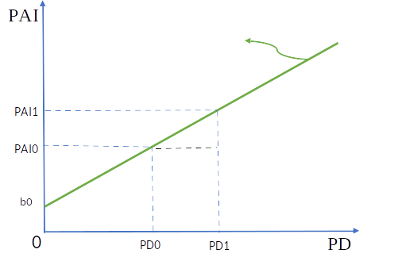{#fig-1}

En la gráfica, se observa una relación positiva entre las prácticas agrícolas insostenibles (PAI) y la pérdida de diversidad (PD). A medida que las prácticas agrícolas insostenibles aumentan, la pérdida de biodiversidad también se incrementa. Sin embargo, la magnitud del impacto de las prácticas agrícolas insostenibles en la pérdida de biodiversidad se mide mediante la sensibilidad o elasticidad, que se calcula como el cambio porcentual de las prácticas agrícolas insostenibles dividido por el cambio porcentual en la pérdida de diversidad.

La ecuación que representa esta relación es:

$$

PD = b0 + b1 \* PAI

$$

$↑PAI → ↑PD$: A mayor cantidad de prácticas agrícolas insostenibles, se genera una mayor pérdida de diversidad.

Donde b1 es la sensibilidad y mide la variación de la pérdida de biodiversidad ante cambios en las prácticas agrícolas insostenibles.

Este análisis se fundamenta en el respaldo teórico proporcionado por la Secretaría del Convenio sobre la Diversidad Biológica (2008), que señala cómo en las últimas cinco décadas la expansión agrícola, especialmente en zonas tropicales y subtropicales, ha reducido significativamente los niveles de diversidad biológica y los servicios ecosistémicos en áreas clave, socavando así la sostenibilidad a largo plazo de la producción agrícola en sí (p. 22).

# El Perú es vulnerable al cambio climático.

**¿Qué sectores son más vulnerables y contribuyen más a las emisiones de gases de efecto invernadero?**

El Perú se enfrenta a la vulnerabilidad provocada por el cambio climático, especialmente en sectores clave para el crecimiento inclusivo. La vulnerabilidad se refiere a la sensibilidad y falta de capacidad de respuesta y adaptación frente a los daños causados por el cambio climático. El país presenta zonas vulnerables debido a diversas condiciones, y aún tiene desafíos para superar la pobreza y la desigualdad.

En 2014, las regiones más afectadas por emergencias de origen climático fueron Amazonas, Apurímac, Cusco, Huancavelica y Pasco, concentrando más del 63% de las emergencias a nivel nacional. Estas situaciones exponen a la población al riesgo de caer o mantenerse en la pobreza debido a su vulnerabilidad frente al cambio climático.

Los sectores agrícola y pesquero, esenciales para la seguridad alimentaria del país, dependen directamente del clima. Estos sectores contribuyen con el 5,7% del Producto Bruto Interno (PBI) y emplean al 25,8% de la población económicamente activa ocupada a nivel nacional y al 74% de la población económicamente activa rural. Dado que el 55% de la población en situación de pobreza trabaja en estas actividades, queda en evidencia la sensibilidad de un gran número de personas al cambio climático. Además, el clima también afecta a sectores relevantes como la minería y la energía hidroeléctrica, que dependen de los recursos hídricos para su funcionamiento.

- **Sector Agrícola**

La agricultura en el Perú es vulnerable a las variaciones climáticas, como inundaciones, granizadas, heladas y eventos del fenómeno El Niño (ENSO), que afectan el rendimiento de los cultivos. El 34% de la superficie agrícola se riega y se concentra en la costa, donde hay mayor infraestructura. El 66% de la agricultura se desarrolla bajo secano, dependiendo exclusivamente de las lluvias, y se encuentra principalmente en la sierra y la selva. La sierra enfrenta deficiencias en infraestructura de almacenamiento de agua y riego, a pesar de recibir mayores precipitaciones. Además, la topografía accidentada limita la disponibilidad de nuevas tierras para el cultivo. Las sequías tienen efectos negativos significativos en esta zona. Por otro lado, la selva experimenta altas precipitaciones durante seis meses al año, pero cuenta con áreas limitadas propicias para la agricultura debido a restricciones naturales.

- **Sector Ganadero**

El cambio climático también generará cambios importantes en el sector ganadero, como la disminución de las áreas de pastoreo y la competencia espacial con la agricultura. Se espera una reducción de aproximadamente el 50% en la extensión de los pajonales, bofedales y arbustales en la puna, que representan el 77,6% de la extensión total de la región. Esta reducción afectará la capacidad de carga y la contribución relativa de la ganadería al PBI. Además, la disminución de los bofedales, una fuente importante de forraje durante los períodos de sequía, dificultará el desarrollo de la ganadería, especialmente en áreas áridas donde son la principal fuente de agua durante períodos críticos.

- **Sector Pesquero**

La disponibilidad de la anchoveta, recurso pesquero clave, se verá afectada negativamente por el cambio climático, especialmente en los escenarios RCP 8.5 y RCP 4.5. Se esperan cambios en las condiciones de temperatura, oxígeno disuelto y productividad primaria. Esto resultará en una disminución importante de la contribución económica del sector pesquero a la economía nacional.

- **Sector Minero**

En la mayoría de las cuencas mineras, los impactos del cambio climático en la disponibilidad hídrica no son significativos, excepto en las cuencas mineras de cobre y zinc. La eficiencia en el uso y consumo del agua contribuirá a reducir futuros conflictos por este recurso y garantizar su disponibilidad para la minería, considerando que el consumo humano y agrícola tienen prioridad legal.

- **Sector de Hidroenergía**

La producción eléctrica del sector de hidroenergía en el Perú está estrechamente relacionada con la disponibilidad de agua en las cuencas. Por lo tanto, el cambio climático puede afectar la actividad de este sector debido a las variaciones en las condiciones de precipitación.

- **Sector de Infraestructura**

La infraestructura se verá afectada por eventos climáticos extremos, especialmente relacionados con las precipitaciones. Se espera que el aumento de lluvias genere modificaciones en los caudales de agua cerca de las redes viales, lo que afectaría las estructuras de drenaje y aumentaría la probabilidad de daños en las carreteras. Esto se traduciría en un aumento en los costos de mantenimiento y reparación de infraestructuras viales.

- **Sector Turismo**

El turismo es un sector importante para la economía peruana en términos de generación de empleo, divisas, comercio e inversión. El cambio climático afectará directamente los destinos turísticos debido a factores como temperatura, precipitación, viento, humedad y aumento del nivel del mar, así como eventos climáticos extremos. Estos cambios causarán daños a la infraestructura y requerirán medidas adicionales de emergencia, lo que aumentará los gastos en seguros, sistemas de reserva de agua, electricidad y evacuación, afectando la competitividad, la demanda turística, la estacionalidad y los gastos de adaptación y mitigación.

- **Sector Salud**

El cambio climático representa una amenaza directa para el sector de la salud y la economía en general. Puede afectar directamente a la población al modificar la frecuencia y distribución de enfermedades transmitidas por vectores, como la malaria, y también puede tener efectos indirectos al empeorar la economía de los hogares.

En cuanto a las emisiones de gases de efecto invernadero, no todos los sectores productivos contribuyen de la misma manera. Según el Panel Intergubernamental sobre el Cambio Climático, los principales emisores a nivel mundial son la generación de electricidad, las actividades agropecuarias y la industria.

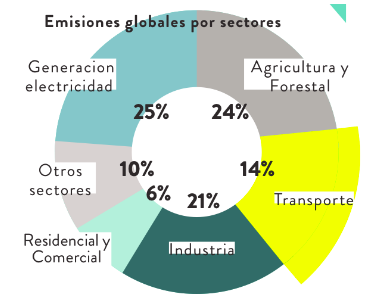{#fig-2}

Nota: Prevencionintegral&ORP

**Se manifiesta que la fijación de precios y la regulación son los principales instrumentos para promover el uso sostenible de los Recursos Naturales.**

La fijación de precios y la regulación son herramientas fundamentales utilizadas para promover el uso sostenible de los recursos naturales. Estas políticas ambientales buscan reducir la degradación del medio ambiente al costo social más bajo posible. Un enfoque clave para lograr este objetivo es alinear los costos privados con los costos sociales, de manera que las externalidades sean consideradas en la toma de decisiones.

En los últimos años, se ha acumulado evidencia que respalda la efectividad de los instrumentos económicos para mejorar la calidad ambiental y fomentar la sostenibilidad de los recursos naturales. Estos instrumentos económicos pueden generar beneficios significativos, como la reducción de los costos de cumplimiento para las industrias, la disminución de las cargas administrativas en el sector público, la mejora de las condiciones ambientales y la promoción de la salud humana. A su vez, esto contribuye a mejorar la productividad económica y reducir los gastos en atención médica.

En el contexto legal, la legislación ambiental en el Perú se basa en la Constitución Política de 1993, que garantiza a todas las personas el derecho a disfrutar de un medio ambiente seguro y adecuado para su sustento. En este marco, se ha incorporado el principio del "usuario pagador" en la legislación, que establece que aquellos que utilizan los recursos naturales tienen la responsabilidad de pagar por su uso. Este principio se encuentra explícitamente incluido en la Ley Orgánica para el Aprovechamiento Sostenible de los Recursos Naturales.

Sin embargo, en la práctica, la implementación del principio del "contaminador pagador" en relación con el control y prevención de la contaminación en sectores industriales presenta desafíos y limitaciones. Aunque existen políticas de precios y regulaciones establecidas, su aplicación efectiva aún requiere mejoras para garantizar un cumplimiento adecuado y promover un mayor control de la contaminación en el sector industrial.

# Análisis de las exportaciones de productos tradicionales, precios del petróleo crudo y derivados, y precios del gas natural durante el periodo enero 2012 - mayo 2022

En este análisis, examinaremos tanto las exportaciones de productos tradicionales como los precios del petróleo crudo y derivados, y los precios del gas natural de forma individual y conjunta durante el periodo comprendido entre enero de 2012 y mayo de 2022.

## Análisis individual de las series

### Análisis de los gráficos

La @fig-3 muestra las exportaciones de productos tradicionales en comparación con los precios del petróleo crudo y derivados (en dólares estadounidenses por barril).

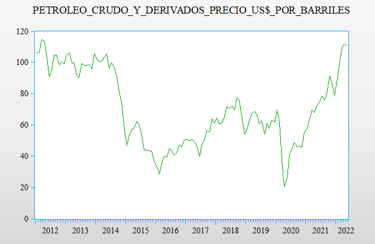{#fig-3}

_Nota: Fuente: BCRP (14 de julio de 2022). Elaboración propia._

**Interpretación:** La serie de precios del petróleo crudo y derivados muestra un comportamiento con cambios bruscos y repentinos durante casi todo el periodo analizado, con valores atípicos destacados en los años 2014, 2015, 2020 y 2022. Esto sugiere que la serie exhibe una variación aleatoria en su comportamiento.

La caída de los precios del petróleo entre mediados de 2014 y principios de 2015 se debió principalmente a factores relacionados con la oferta, como el aumento de la producción de petróleo en Estados Unidos, la disminución de las tensiones geopolíticas y los cambios en las políticas de la OPEP. Esta caída del precio del petróleo también afectó negativamente las previsiones de demanda de petróleo durante mediados de 2015 y principios de 2016.

En el año 2017, se observó un aumento en el interés de las empresas internacionales por la exploración y explotación de petróleo en aguas profundas (offshore), debido al potencial de reservas de petróleo. Esto resultó en un incremento de los precios del petróleo entre 2017 y 2018.

En 2022, se produjo un fuerte aumento en los precios del petróleo debido a la situación crítica que enfrentaba Europa y a las políticas establecidas para reducir la dependencia de los suministros rusos. Del 25 de mayo al 1 de junio de 2022, el precio del petróleo aumentó un 2,1%, alcanzando los 115,3 dólares por barril. Este incremento reflejó la señal de una menor oferta y una creciente demanda antes de la temporada alta de conducción de verano en Estados Unidos y Europa. En mayo, el precio del petróleo subió un 9,4%.

La @fig-4 muestra las exportaciones de productos tradicionales en relación con los precios del gas natural (en dólares estadounidenses por metro cúbico).

{#fig-4}

_Nota: Fuente: BCRP (14 de julio de 2022). Elaboración propia._

**Interpretación:** La serie de precios del gas natural presenta valores atípicos en los años 2021 y 2022, con cambios bruscos más pronunciados durante esos mismos años. Además, se observa un patrón cíclico en el periodo comprendido entre 2012 y 2020, seguido de una variación aleatoria en los últimos años.

A partir de 2019 y 2020, el precio del gas natural se redujo debido a la "revolución" del gas de fracking en Estados Unidos. Sin embargo, en julio y agosto de 2020, los precios del gas se vieron afectados por la crisis del Covid-19.

A finales de 2020, se reactivó la demanda de gas natural, pero la oferta no pudo mantenerse al ritmo necesario, lo que generó retrasos en la respuesta a la demanda, principalmente debido a problemas logísticos relacionados con el transporte de gas. Además, el invierno prolongado agotó las reservas en el hemisferio norte. Asia fue responsable del 70% del consumo global de gas natural y pagó precios elevados. Europa también experimentó un déficit de suministro a finales de 2020, situación que se prolongó a lo largo de 2021.

En septiembre de 2021, el precio del gas natural aumentó debido a que la producción mundial de gas no creció al mismo ritmo que la demanda, lo que provocó un incremento en el precio. Los niveles de almacenamiento en los 48 estados inferiores de EE. UU. se encontraban ligeramente por debajo de lo normal, según la Administración de Información Energética. Esta situación se vio agravada por el huracán Ida, que interrumpió la producción en Noruega y Rusia, así como en el Golfo de México, donde gran parte de la producción de petróleo y gas quedó fuera de servicio.

En abril de 2022, la producción de hidrocarburos experimentó un crecimiento interanual del 26,2%, impulsado por una mayor extracción de todos sus componentes (hidrocarburos líquidos y gas natural) desde 2021. En el periodo de enero a abril, el sector se expandió un 15,0%.

### Análisis de normalidad de las series

La @fig-5 muestra los resultados de la prueba de normalidad aplicada al precio del Petróleo crudo y derivados.

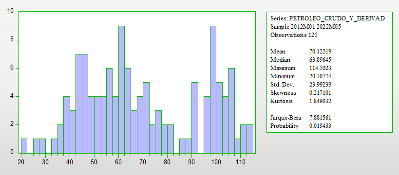{#fig-5}

_Nota: Elaboración propia._

**Interpretación:** En cuanto a la prueba de normalidad, se observa que la serie del precio del Petróleo crudo y derivados presenta una cercanía entre la media y la mediana. Además, el coeficiente de asimetría (skewness=0.217) tiende a cero y la kurtosis tiende débilmente a 3, lo cual sugiere que la distribución podría ser normal.

Sin embargo, para realizar un análisis más riguroso, se utiliza el estadístico de Jarque-Bera bajo la hipótesis nula de que la serie sigue una distribución normal. En este caso, el valor de JB es 7.88, que es mayor que el valor crítico de 5.99, lo que nos lleva a rechazar la hipótesis nula de normalidad. Además, la probabilidad asociada al valor de JB es 0.019, que es menor al nivel de significancia del 5%, lo que confirma que la serie no sigue una distribución normal.

Para corregir la falta de normalidad, se aplica una transformación logarítmica a la serie del Petróleo crudo y derivados.

La @fig-6 muestra la serie del precio del Petróleo crudo y derivados después de aplicar la transformación logarítmica para corregir la falta de normalidad.

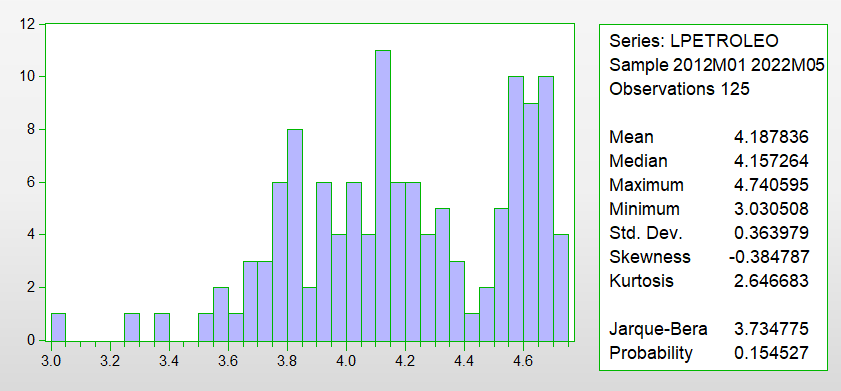{#fig-6}

_Nota: Elaboración propia._

**Interpretación:** Al aplicar la transformación logarítmica a la serie del Petróleo crudo y derivados, se observa que se corrige la falta de normalidad. El estadístico de Jarque-Bera es 3.73, que es menor que el valor crítico de 5.99, lo que nos lleva a aceptar la hipótesis nula de normalidad. Además, la probabilidad asociada al valor de JB es 0.155, que es mayor al nivel de significancia del 5%, lo que confirma que la serie sigue una distribución normal después de la transformación logarítmica.

La @fig-7 muestra los resultados de la prueba de normalidad aplicada al precio del Gas natural.

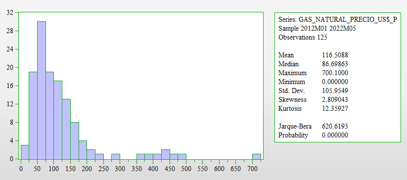{#fig-7}

_Nota: Elaboración propia._

**Interpretación:** Según la prueba de normalidad, la serie del precio del Gas natural presenta poca cercanía entre la media y la mediana. Además, el coeficiente de asimetría (skewness=2.809) no tiende a cero y la kurtosis es 12.36, lo cual indica que la distribución se aleja de una distribución normal. Para realizar un análisis más riguroso, se utiliza el estadístico de Jarque-Bera bajo la hipótesis nula de que la serie sigue una distribución normal. En este caso, el valor de JB es 620.619, que es mayor que el valor crítico de 5.99, lo que nos lleva a rechazar la hipótesis nula de normalidad. Además, la probabilidad asociada al valor de JB es 0.000, que es menor al nivel de significancia del 5%, confirmando que la serie no sigue una distribución normal.

La @fig-8 muestra la serie del precio del Gas natural después de aplicar una transformación para corregir la falta de normalidad.

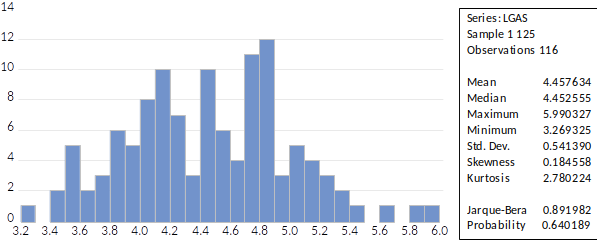{#fig-8}

_Nota: Elaboración propia._

**Interpretación:** Al aplicar la transformación de datos, se logra una distribución normal en los precios del Gas natural. La transformación se realiza utilizando la media y la desviación estándar de la distribución, y se reemplazan los valores atípicos y extremos con valores nulos o perdidos en el sistema. Se observa que el estadístico de Jarque-Bera es 0.89, que es menor que el valor crítico de 5.99, lo que nos permite aceptar la hipótesis nula de presencia de una distribución normal. Además, la probabilidad asociada al valor de JB es 0.64, que es mayor al nivel de significancia del 5%, lo que confirma que la serie de precios del Gas natural sigue una distribución normal después de la transformación.

## Análisis conjunta de las series

La @fig-9 muestra la evolución del precio del petróleo y el gas en dólares.

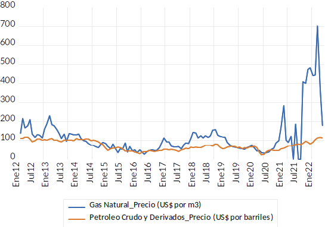{#fig-9}

_**Nota:** Datos obtenidos del BCRP y gráfico elaborado por nosotros._

**Interpretación:** El incremento de los precios del petróleo y el gas en esta visualización se debe a la guerra en Ucrania y los temores sobre el suministro de materias primas provenientes de Rusia. El precio del petróleo alcanzó su máximo en casi diez años, mientras que el gas natural alcanzó récords históricos.

Las tensiones geopolíticas internacionales y el encarecimiento del petróleo fueron factores clave para el aumento en los precios del gas. Sin embargo, este aumento también ha tenido un impacto negativo en los alimentos y el costo de vida de las familias más pobres, lo que plantea un desafío para el gobierno.

La @fig-10 muestra un análisis de caja y bigote del precio de gas y petróleo.

::: {#fig-10 layout-ncol=2}

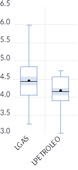{#fig-10.1}

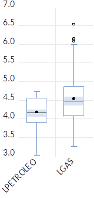{#fig-10.2}

Análisis de caja y bigote del precio de gas y petróleo
:::

_**Nota:** Datos obtenidos del BCRP y gráfico elaborado por nosotros._

**Interpretación:** En el gráfico de la izquierda, se observa que tanto el precio del gas natural como el precio del petróleo tienen rangos normales, lo que indica que los datos están concentrados dentro de esos rangos. Además, el precio del gas natural muestra una distribución simétrica, ya que la línea de la mediana está cerca del centro de la caja. Sin embargo, se presentan algunos datos atípicos.

En el gráfico de la derecha, utilizando una transformación de datos, se logra una distribución normal en los precios del gas. La distribución se crea utilizando la media y la desviación estándar de la distribución de gas. En esta distribución, las líneas de la mediana y la media se superponen, los rangos intercuartílicos (representados por los bigotes) y las cajas son de tamaño similar, y los datos atípicos son poco comunes.

En cuanto al precio del petróleo, también muestra una distribución simétrica, ya que la mediana está cerca del centro de la caja. En esta distribución, la media es similar a la mediana, lo que indica una distribución normal.

La @fig-11 muestra un gráfico de dispersión que representa la relación entre el precio del gas y el precio del petróleo.

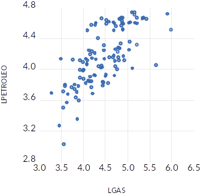{#fig-11}

_**Nota:** Datos obtenidos del BCRP y gráfico elaborado por nosotros._

**Interpretación:** En el gráfico, se puede observar una relación lineal positiva moderada entre el precio del petróleo y el precio del gas. A medida que el precio del petróleo aumenta, el precio del gas también tiende a aumentar.

La Tabla 2 muestra los resultados de la regresión entre el precio del petróleo y el precio del gas.

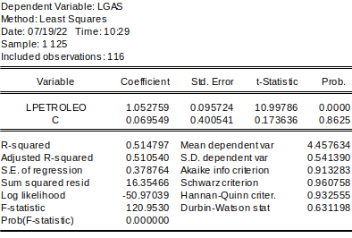

_**Nota:** Datos obtenidos del BCRP._

El valor P < 0.05 en el análisis de regresión indica que el precio del petróleo que estamos analizando es significativo y tiene una relación con el precio del gas.

Además, el coeficiente R-Sq (adj) nos indica que el 51% de la variación en el precio del gas se explica por el precio del petróleo.

La ecuación de regresión muestra que, por cada aumento en el precio del petróleo, el precio del gas aumenta en 1.0527 dólares.

# Relación entre el volumen del cobre (miles de toneladas) y el oro (miles de onzas troy).

Para analizar la relación entre el volumen del cobre (medido en miles de toneladas) y el oro (medido en miles de onzas troy), consideramos las series mensuales de exportaciones de productos tradicionales del BCRP. Graficaremos y explicaremos su comportamiento, evaluando si existe una relación de largo plazo (cointegración) entre ambas variables en el Perú, utilizando el mismo período que en las preguntas anteriores (mencionar el período específico).
$$
