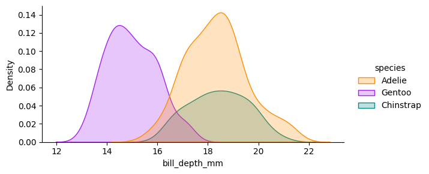

::: {.cell tags='[]' execution_count=1}
``` {.python .cell-code}
import pandas as pd
import altair as alt
import seaborn as sns
from matplotlib import pyplot as plt
```
:::


Data from [Palmer Penguins R package](https://allisonhorst.github.io/palmerpenguins/)

::: {.cell tags='["import"]' execution_count=2}
``` {.python .cell-code}
penguins = pd.read_csv("https://pos.it/palmer-penguins-github-csv")
```
:::


::: {.cell tags='[]' execution_count=3}
``` {.python .cell-code}
penguins.groupby("species").size().reset_index(name = "count")
```

::: {#species-counts .cell-output .cell-output-display execution_count=3}

```{=html}
<div>
<style scoped>
    .dataframe tbody tr th:only-of-type {
        vertical-align: middle;
    }

    .dataframe tbody tr th {
        vertical-align: top;
    }

    .dataframe thead th {
        text-align: right;
    }
</style>
<table border="1" class="dataframe">
  <thead>
    <tr style="text-align: right;">
      <th></th>
      <th>species</th>
      <th>count</th>
    </tr>
  </thead>
  <tbody>
    <tr>
      <th>0</th>
      <td>Adelie</td>
      <td>152</td>
    </tr>
    <tr>
      <th>1</th>
      <td>Chinstrap</td>
      <td>68</td>
    </tr>
    <tr>
      <th>2</th>
      <td>Gentoo</td>
      <td>124</td>
    </tr>
  </tbody>
</table>
</div>
```

:::
:::


::: {.cell tags='[]' execution_count=4}
``` {.python .cell-code}
colors = ["#FF8C00", "#A020F0", "#008B8B"]
sns.set_palette(colors, n_colors = 3)
```
:::


::: {.cell tags='["bill-ratio"]' execution_count=5}
``` {.python .cell-code}
penguins["bill_ratio"] = (
   penguins["bill_length_mm"] / penguins["bill_depth_mm"] 
)
sns.displot(penguins, 
            x = "bill_ratio", 
            hue = "species", 
            kind = "kde", fill = True, aspect = 2, height = 3)
plt.show()
```

::: {.cell-output .cell-output-display}
{fig-alt='A density plot of bill ratio by species.'}
:::
:::


::: {#fig-bill-marginal .cell tags='[]' layout-ncol='2' execution_count=6}
``` {.python .cell-code}
sns.displot(penguins, 
            x = "bill_depth_mm", 
            hue = "species", 
            kind = "kde", fill = True, 
            aspect = 2, height = 3)
plt.show()
sns.displot(penguins, 
            x = "bill_length_mm", 
            hue = "species", 
            kind = "kde", fill = True, 
            aspect = 2, height = 3)
plt.show()
```

::: {.cell-output .cell-output-display}
{#fig-bill-marginal-1 fig-alt='Density plot of bill depth by species.'}
:::

::: {.cell-output .cell-output-display}
{#fig-bill-marginal-2 fig-alt='Density plot of bill length by species.'}
:::

Marginal distributions of bill dimensions
:::


::: {.cell tags='[]' execution_count=7}
``` {.python .cell-code}
scale = alt.Scale(domain = ['Adelie', 'Chinstrap', 'Gentoo'],
                  range = colors)
```
:::


::: {.cell tags='[]' execution_count=8}
``` {.python .cell-code}
alt.Chart(penguins).mark_circle(size=60).encode(
    alt.X('bill_length_mm',
        scale=alt.Scale(zero=False)
    ),
    alt.Y('bill_depth_mm',
        scale=alt.Scale(zero=False)
    ),
    color = alt.Color('species', scale = scale),
    tooltip=['species', 'sex', 'island']
)
```

::: {#fig-bill-scatter .cell-output .cell-output-display execution_count=8}

```{=html}

<div id="altair-viz-3dc7764a9fe74e719651acdeb7f74f6e"></div>
<script type="text/javascript">
  var VEGA_DEBUG = (typeof VEGA_DEBUG == "undefined") ? {} : VEGA_DEBUG;
  (function(spec, embedOpt){
    let outputDiv = document.currentScript.previousElementSibling;
    if (outputDiv.id !== "altair-viz-3dc7764a9fe74e719651acdeb7f74f6e") {
      outputDiv = document.getElementById("altair-viz-3dc7764a9fe74e719651acdeb7f74f6e");
    }
    const paths = {
      "vega": "https://cdn.jsdelivr.net/npm//vega@5?noext",
      "vega-lib": "https://cdn.jsdelivr.net/npm//vega-lib?noext",
      "vega-lite": "https://cdn.jsdelivr.net/npm//vega-lite@4.17.0?noext",
      "vega-embed": "https://cdn.jsdelivr.net/npm//vega-embed@6?noext",
    };

    function maybeLoadScript(lib, version) {
      var key = `${lib.replace("-", "")}_version`;
      return (VEGA_DEBUG[key] == version) ?
        Promise.resolve(paths[lib]) :
        new Promise(function(resolve, reject) {
          var s = document.createElement('script');
          document.getElementsByTagName("head")[0].appendChild(s);
          s.async = true;
          s.onload = () => {
            VEGA_DEBUG[key] = version;
            return resolve(paths[lib]);
          };
          s.onerror = () => reject(`Error loading script: ${paths[lib]}`);
          s.src = paths[lib];
        });
    }

    function showError(err) {
      outputDiv.innerHTML = `<div class="error" style="color:red;">${err}</div>`;
      throw err;
    }

    function displayChart(vegaEmbed) {
      vegaEmbed(outputDiv, spec, embedOpt)
        .catch(err => showError(`Javascript Error: ${err.message}<br>This usually means there's a typo in your chart specification. See the javascript console for the full traceback.`));
    }

    if(typeof define === "function" && define.amd) {
      requirejs.config({paths});
      require(["vega-embed"], displayChart, err => showError(`Error loading script: ${err.message}`));
    } else {
      maybeLoadScript("vega", "5")
        .then(() => maybeLoadScript("vega-lite", "4.17.0"))
        .then(() => maybeLoadScript("vega-embed", "6"))
        .catch(showError)
        .then(() => displayChart(vegaEmbed));
    }
  })({"config": {"view": {"continuousWidth": 400, "continuousHeight": 300}}, "data": {"name": "data-13a4a4a1abc24bd65caa504098aad626"}, "mark": {"type": "circle", "size": 60}, "encoding": {"color": {"field": "species", "scale": {"domain": ["Adelie", "Chinstrap", "Gentoo"], "range": ["#FF8C00", "#A020F0", "#008B8B"]}, "type": "nominal"}, "tooltip": [{"field": "species", "type": "nominal"}, {"field": "sex", "type": "nominal"}, {"field": "island", "type": "nominal"}], "x": {"field": "bill_length_mm", "scale": {"zero": false}, "type": "quantitative"}, "y": {"field": "bill_depth_mm", "scale": {"zero": false}, "type": "quantitative"}}, "$schema": "https://vega.github.io/schema/vega-lite/v4.17.0.json", "datasets": {"data-13a4a4a1abc24bd65caa504098aad626": [{"species": "Adelie", "island": "Torgersen", "bill_length_mm": 39.1, "bill_depth_mm": 18.7, "flipper_length_mm": 181.0, "body_mass_g": 3750.0, "sex": "male", "year": 2007, "bill_ratio": 2.0909090909090913}, {"species": "Adelie", "island": "Torgersen", "bill_length_mm": 39.5, "bill_depth_mm": 17.4, "flipper_length_mm": 186.0, "body_mass_g": 3800.0, "sex": "female", "year": 2007, "bill_ratio": 2.270114942528736}, {"species": "Adelie", "island": "Torgersen", "bill_length_mm": 40.3, "bill_depth_mm": 18.0, "flipper_length_mm": 195.0, "body_mass_g": 3250.0, "sex": "female", "year": 2007, "bill_ratio": 2.238888888888889}, {"species": "Adelie", "island": "Torgersen", "bill_length_mm": null, "bill_depth_mm": null, "flipper_length_mm": null, "body_mass_g": null, "sex": null, "year": 2007, "bill_ratio": null}, {"species": "Adelie", "island": "Torgersen", "bill_length_mm": 36.7, "bill_depth_mm": 19.3, "flipper_length_mm": 193.0, "body_mass_g": 3450.0, "sex": "female", "year": 2007, "bill_ratio": 1.9015544041450778}, {"species": "Adelie", "island": "Torgersen", "bill_length_mm": 39.3, "bill_depth_mm": 20.6, "flipper_length_mm": 190.0, "body_mass_g": 3650.0, "sex": "male", "year": 2007, "bill_ratio": 1.907766990291262}, {"species": "Adelie", "island": "Torgersen", "bill_length_mm": 38.9, "bill_depth_mm": 17.8, "flipper_length_mm": 181.0, "body_mass_g": 3625.0, "sex": "female", "year": 2007, "bill_ratio": 2.185393258426966}, {"species": "Adelie", "island": "Torgersen", "bill_length_mm": 39.2, "bill_depth_mm": 19.6, "flipper_length_mm": 195.0, "body_mass_g": 4675.0, "sex": "male", "year": 2007, "bill_ratio": 2.0}, {"species": "Adelie", "island": "Torgersen", "bill_length_mm": 34.1, "bill_depth_mm": 18.1, "flipper_length_mm": 193.0, "body_mass_g": 3475.0, "sex": null, "year": 2007, "bill_ratio": 1.8839779005524862}, {"species": "Adelie", "island": "Torgersen", "bill_length_mm": 42.0, "bill_depth_mm": 20.2, "flipper_length_mm": 190.0, "body_mass_g": 4250.0, "sex": null, "year": 2007, "bill_ratio": 2.0792079207920793}, {"species": "Adelie", "island": "Torgersen", "bill_length_mm": 37.8, "bill_depth_mm": 17.1, "flipper_length_mm": 186.0, "body_mass_g": 3300.0, "sex": null, "year": 2007, "bill_ratio": 2.2105263157894735}, {"species": "Adelie", "island": "Torgersen", "bill_length_mm": 37.8, "bill_depth_mm": 17.3, "flipper_length_mm": 180.0, "body_mass_g": 3700.0, "sex": null, "year": 2007, "bill_ratio": 2.184971098265896}, {"species": "Adelie", "island": "Torgersen", "bill_length_mm": 41.1, "bill_depth_mm": 17.6, "flipper_length_mm": 182.0, "body_mass_g": 3200.0, "sex": "female", "year": 2007, "bill_ratio": 2.3352272727272725}, {"species": "Adelie", "island": "Torgersen", "bill_length_mm": 38.6, "bill_depth_mm": 21.2, "flipper_length_mm": 191.0, "body_mass_g": 3800.0, "sex": "male", "year": 2007, "bill_ratio": 1.8207547169811322}, {"species": "Adelie", "island": "Torgersen", "bill_length_mm": 34.6, "bill_depth_mm": 21.1, "flipper_length_mm": 198.0, "body_mass_g": 4400.0, "sex": "male", "year": 2007, "bill_ratio": 1.6398104265402844}, {"species": "Adelie", "island": "Torgersen", "bill_length_mm": 36.6, "bill_depth_mm": 17.8, "flipper_length_mm": 185.0, "body_mass_g": 3700.0, "sex": "female", "year": 2007, "bill_ratio": 2.056179775280899}, {"species": "Adelie", "island": "Torgersen", "bill_length_mm": 38.7, "bill_depth_mm": 19.0, "flipper_length_mm": 195.0, "body_mass_g": 3450.0, "sex": "female", "year": 2007, "bill_ratio": 2.0368421052631582}, {"species": "Adelie", "island": "Torgersen", "bill_length_mm": 42.5, "bill_depth_mm": 20.7, "flipper_length_mm": 197.0, "body_mass_g": 4500.0, "sex": "male", "year": 2007, "bill_ratio": 2.0531400966183577}, {"species": "Adelie", "island": "Torgersen", "bill_length_mm": 34.4, "bill_depth_mm": 18.4, "flipper_length_mm": 184.0, "body_mass_g": 3325.0, "sex": "female", "year": 2007, "bill_ratio": 1.8695652173913044}, {"species": "Adelie", "island": "Torgersen", "bill_length_mm": 46.0, "bill_depth_mm": 21.5, "flipper_length_mm": 194.0, "body_mass_g": 4200.0, "sex": "male", "year": 2007, "bill_ratio": 2.13953488372093}, {"species": "Adelie", "island": "Biscoe", "bill_length_mm": 37.8, "bill_depth_mm": 18.3, "flipper_length_mm": 174.0, "body_mass_g": 3400.0, "sex": "female", "year": 2007, "bill_ratio": 2.065573770491803}, {"species": "Adelie", "island": "Biscoe", "bill_length_mm": 37.7, "bill_depth_mm": 18.7, "flipper_length_mm": 180.0, "body_mass_g": 3600.0, "sex": "male", "year": 2007, "bill_ratio": 2.016042780748663}, {"species": "Adelie", "island": "Biscoe", "bill_length_mm": 35.9, "bill_depth_mm": 19.2, "flipper_length_mm": 189.0, "body_mass_g": 3800.0, "sex": "female", "year": 2007, "bill_ratio": 1.8697916666666667}, {"species": "Adelie", "island": "Biscoe", "bill_length_mm": 38.2, "bill_depth_mm": 18.1, "flipper_length_mm": 185.0, "body_mass_g": 3950.0, "sex": "male", "year": 2007, "bill_ratio": 2.110497237569061}, {"species": "Adelie", "island": "Biscoe", "bill_length_mm": 38.8, "bill_depth_mm": 17.2, "flipper_length_mm": 180.0, "body_mass_g": 3800.0, "sex": "male", "year": 2007, "bill_ratio": 2.255813953488372}, {"species": "Adelie", "island": "Biscoe", "bill_length_mm": 35.3, "bill_depth_mm": 18.9, "flipper_length_mm": 187.0, "body_mass_g": 3800.0, "sex": "female", "year": 2007, "bill_ratio": 1.8677248677248677}, {"species": "Adelie", "island": "Biscoe", "bill_length_mm": 40.6, "bill_depth_mm": 18.6, "flipper_length_mm": 183.0, "body_mass_g": 3550.0, "sex": "male", "year": 2007, "bill_ratio": 2.182795698924731}, {"species": "Adelie", "island": "Biscoe", "bill_length_mm": 40.5, "bill_depth_mm": 17.9, "flipper_length_mm": 187.0, "body_mass_g": 3200.0, "sex": "female", "year": 2007, "bill_ratio": 2.2625698324022347}, {"species": "Adelie", "island": "Biscoe", "bill_length_mm": 37.9, "bill_depth_mm": 18.6, "flipper_length_mm": 172.0, "body_mass_g": 3150.0, "sex": "female", "year": 2007, "bill_ratio": 2.0376344086021505}, {"species": "Adelie", "island": "Biscoe", "bill_length_mm": 40.5, "bill_depth_mm": 18.9, "flipper_length_mm": 180.0, "body_mass_g": 3950.0, "sex": "male", "year": 2007, "bill_ratio": 2.1428571428571432}, {"species": "Adelie", "island": "Dream", "bill_length_mm": 39.5, "bill_depth_mm": 16.7, "flipper_length_mm": 178.0, "body_mass_g": 3250.0, "sex": "female", "year": 2007, "bill_ratio": 2.3652694610778444}, {"species": "Adelie", "island": "Dream", "bill_length_mm": 37.2, "bill_depth_mm": 18.1, "flipper_length_mm": 178.0, "body_mass_g": 3900.0, "sex": "male", "year": 2007, "bill_ratio": 2.0552486187845305}, {"species": "Adelie", "island": "Dream", "bill_length_mm": 39.5, "bill_depth_mm": 17.8, "flipper_length_mm": 188.0, "body_mass_g": 3300.0, "sex": "female", "year": 2007, "bill_ratio": 2.2191011235955056}, {"species": "Adelie", "island": "Dream", "bill_length_mm": 40.9, "bill_depth_mm": 18.9, "flipper_length_mm": 184.0, "body_mass_g": 3900.0, "sex": "male", "year": 2007, "bill_ratio": 2.164021164021164}, {"species": "Adelie", "island": "Dream", "bill_length_mm": 36.4, "bill_depth_mm": 17.0, "flipper_length_mm": 195.0, "body_mass_g": 3325.0, "sex": "female", "year": 2007, "bill_ratio": 2.1411764705882352}, {"species": "Adelie", "island": "Dream", "bill_length_mm": 39.2, "bill_depth_mm": 21.1, "flipper_length_mm": 196.0, "body_mass_g": 4150.0, "sex": "male", "year": 2007, "bill_ratio": 1.8578199052132702}, {"species": "Adelie", "island": "Dream", "bill_length_mm": 38.8, "bill_depth_mm": 20.0, "flipper_length_mm": 190.0, "body_mass_g": 3950.0, "sex": "male", "year": 2007, "bill_ratio": 1.94}, {"species": "Adelie", "island": "Dream", "bill_length_mm": 42.2, "bill_depth_mm": 18.5, "flipper_length_mm": 180.0, "body_mass_g": 3550.0, "sex": "female", "year": 2007, "bill_ratio": 2.2810810810810813}, {"species": "Adelie", "island": "Dream", "bill_length_mm": 37.6, "bill_depth_mm": 19.3, "flipper_length_mm": 181.0, "body_mass_g": 3300.0, "sex": "female", "year": 2007, "bill_ratio": 1.9481865284974094}, {"species": "Adelie", "island": "Dream", "bill_length_mm": 39.8, "bill_depth_mm": 19.1, "flipper_length_mm": 184.0, "body_mass_g": 4650.0, "sex": "male", "year": 2007, "bill_ratio": 2.083769633507853}, {"species": "Adelie", "island": "Dream", "bill_length_mm": 36.5, "bill_depth_mm": 18.0, "flipper_length_mm": 182.0, "body_mass_g": 3150.0, "sex": "female", "year": 2007, "bill_ratio": 2.0277777777777777}, {"species": "Adelie", "island": "Dream", "bill_length_mm": 40.8, "bill_depth_mm": 18.4, "flipper_length_mm": 195.0, "body_mass_g": 3900.0, "sex": "male", "year": 2007, "bill_ratio": 2.217391304347826}, {"species": "Adelie", "island": "Dream", "bill_length_mm": 36.0, "bill_depth_mm": 18.5, "flipper_length_mm": 186.0, "body_mass_g": 3100.0, "sex": "female", "year": 2007, "bill_ratio": 1.945945945945946}, {"species": "Adelie", "island": "Dream", "bill_length_mm": 44.1, "bill_depth_mm": 19.7, "flipper_length_mm": 196.0, "body_mass_g": 4400.0, "sex": "male", "year": 2007, "bill_ratio": 2.238578680203046}, {"species": "Adelie", "island": "Dream", "bill_length_mm": 37.0, "bill_depth_mm": 16.9, "flipper_length_mm": 185.0, "body_mass_g": 3000.0, "sex": "female", "year": 2007, "bill_ratio": 2.1893491124260356}, {"species": "Adelie", "island": "Dream", "bill_length_mm": 39.6, "bill_depth_mm": 18.8, "flipper_length_mm": 190.0, "body_mass_g": 4600.0, "sex": "male", "year": 2007, "bill_ratio": 2.106382978723404}, {"species": "Adelie", "island": "Dream", "bill_length_mm": 41.1, "bill_depth_mm": 19.0, "flipper_length_mm": 182.0, "body_mass_g": 3425.0, "sex": "male", "year": 2007, "bill_ratio": 2.1631578947368424}, {"species": "Adelie", "island": "Dream", "bill_length_mm": 37.5, "bill_depth_mm": 18.9, "flipper_length_mm": 179.0, "body_mass_g": 2975.0, "sex": null, "year": 2007, "bill_ratio": 1.9841269841269842}, {"species": "Adelie", "island": "Dream", "bill_length_mm": 36.0, "bill_depth_mm": 17.9, "flipper_length_mm": 190.0, "body_mass_g": 3450.0, "sex": "female", "year": 2007, "bill_ratio": 2.011173184357542}, {"species": "Adelie", "island": "Dream", "bill_length_mm": 42.3, "bill_depth_mm": 21.2, "flipper_length_mm": 191.0, "body_mass_g": 4150.0, "sex": "male", "year": 2007, "bill_ratio": 1.9952830188679245}, {"species": "Adelie", "island": "Biscoe", "bill_length_mm": 39.6, "bill_depth_mm": 17.7, "flipper_length_mm": 186.0, "body_mass_g": 3500.0, "sex": "female", "year": 2008, "bill_ratio": 2.2372881355932206}, {"species": "Adelie", "island": "Biscoe", "bill_length_mm": 40.1, "bill_depth_mm": 18.9, "flipper_length_mm": 188.0, "body_mass_g": 4300.0, "sex": "male", "year": 2008, "bill_ratio": 2.121693121693122}, {"species": "Adelie", "island": "Biscoe", "bill_length_mm": 35.0, "bill_depth_mm": 17.9, "flipper_length_mm": 190.0, "body_mass_g": 3450.0, "sex": "female", "year": 2008, "bill_ratio": 1.9553072625698324}, {"species": "Adelie", "island": "Biscoe", "bill_length_mm": 42.0, "bill_depth_mm": 19.5, "flipper_length_mm": 200.0, "body_mass_g": 4050.0, "sex": "male", "year": 2008, "bill_ratio": 2.1538461538461537}, {"species": "Adelie", "island": "Biscoe", "bill_length_mm": 34.5, "bill_depth_mm": 18.1, "flipper_length_mm": 187.0, "body_mass_g": 2900.0, "sex": "female", "year": 2008, "bill_ratio": 1.9060773480662982}, {"species": "Adelie", "island": "Biscoe", "bill_length_mm": 41.4, "bill_depth_mm": 18.6, "flipper_length_mm": 191.0, "body_mass_g": 3700.0, "sex": "male", "year": 2008, "bill_ratio": 2.225806451612903}, {"species": "Adelie", "island": "Biscoe", "bill_length_mm": 39.0, "bill_depth_mm": 17.5, "flipper_length_mm": 186.0, "body_mass_g": 3550.0, "sex": "female", "year": 2008, "bill_ratio": 2.2285714285714286}, {"species": "Adelie", "island": "Biscoe", "bill_length_mm": 40.6, "bill_depth_mm": 18.8, "flipper_length_mm": 193.0, "body_mass_g": 3800.0, "sex": "male", "year": 2008, "bill_ratio": 2.1595744680851063}, {"species": "Adelie", "island": "Biscoe", "bill_length_mm": 36.5, "bill_depth_mm": 16.6, "flipper_length_mm": 181.0, "body_mass_g": 2850.0, "sex": "female", "year": 2008, "bill_ratio": 2.1987951807228914}, {"species": "Adelie", "island": "Biscoe", "bill_length_mm": 37.6, "bill_depth_mm": 19.1, "flipper_length_mm": 194.0, "body_mass_g": 3750.0, "sex": "male", "year": 2008, "bill_ratio": 1.9685863874345548}, {"species": "Adelie", "island": "Biscoe", "bill_length_mm": 35.7, "bill_depth_mm": 16.9, "flipper_length_mm": 185.0, "body_mass_g": 3150.0, "sex": "female", "year": 2008, "bill_ratio": 2.112426035502959}, {"species": "Adelie", "island": "Biscoe", "bill_length_mm": 41.3, "bill_depth_mm": 21.1, "flipper_length_mm": 195.0, "body_mass_g": 4400.0, "sex": "male", "year": 2008, "bill_ratio": 1.9573459715639807}, {"species": "Adelie", "island": "Biscoe", "bill_length_mm": 37.6, "bill_depth_mm": 17.0, "flipper_length_mm": 185.0, "body_mass_g": 3600.0, "sex": "female", "year": 2008, "bill_ratio": 2.211764705882353}, {"species": "Adelie", "island": "Biscoe", "bill_length_mm": 41.1, "bill_depth_mm": 18.2, "flipper_length_mm": 192.0, "body_mass_g": 4050.0, "sex": "male", "year": 2008, "bill_ratio": 2.258241758241758}, {"species": "Adelie", "island": "Biscoe", "bill_length_mm": 36.4, "bill_depth_mm": 17.1, "flipper_length_mm": 184.0, "body_mass_g": 2850.0, "sex": "female", "year": 2008, "bill_ratio": 2.1286549707602336}, {"species": "Adelie", "island": "Biscoe", "bill_length_mm": 41.6, "bill_depth_mm": 18.0, "flipper_length_mm": 192.0, "body_mass_g": 3950.0, "sex": "male", "year": 2008, "bill_ratio": 2.3111111111111113}, {"species": "Adelie", "island": "Biscoe", "bill_length_mm": 35.5, "bill_depth_mm": 16.2, "flipper_length_mm": 195.0, "body_mass_g": 3350.0, "sex": "female", "year": 2008, "bill_ratio": 2.191358024691358}, {"species": "Adelie", "island": "Biscoe", "bill_length_mm": 41.1, "bill_depth_mm": 19.1, "flipper_length_mm": 188.0, "body_mass_g": 4100.0, "sex": "male", "year": 2008, "bill_ratio": 2.1518324607329844}, {"species": "Adelie", "island": "Torgersen", "bill_length_mm": 35.9, "bill_depth_mm": 16.6, "flipper_length_mm": 190.0, "body_mass_g": 3050.0, "sex": "female", "year": 2008, "bill_ratio": 2.1626506024096384}, {"species": "Adelie", "island": "Torgersen", "bill_length_mm": 41.8, "bill_depth_mm": 19.4, "flipper_length_mm": 198.0, "body_mass_g": 4450.0, "sex": "male", "year": 2008, "bill_ratio": 2.154639175257732}, {"species": "Adelie", "island": "Torgersen", "bill_length_mm": 33.5, "bill_depth_mm": 19.0, "flipper_length_mm": 190.0, "body_mass_g": 3600.0, "sex": "female", "year": 2008, "bill_ratio": 1.763157894736842}, {"species": "Adelie", "island": "Torgersen", "bill_length_mm": 39.7, "bill_depth_mm": 18.4, "flipper_length_mm": 190.0, "body_mass_g": 3900.0, "sex": "male", "year": 2008, "bill_ratio": 2.1576086956521743}, {"species": "Adelie", "island": "Torgersen", "bill_length_mm": 39.6, "bill_depth_mm": 17.2, "flipper_length_mm": 196.0, "body_mass_g": 3550.0, "sex": "female", "year": 2008, "bill_ratio": 2.302325581395349}, {"species": "Adelie", "island": "Torgersen", "bill_length_mm": 45.8, "bill_depth_mm": 18.9, "flipper_length_mm": 197.0, "body_mass_g": 4150.0, "sex": "male", "year": 2008, "bill_ratio": 2.4232804232804233}, {"species": "Adelie", "island": "Torgersen", "bill_length_mm": 35.5, "bill_depth_mm": 17.5, "flipper_length_mm": 190.0, "body_mass_g": 3700.0, "sex": "female", "year": 2008, "bill_ratio": 2.0285714285714285}, {"species": "Adelie", "island": "Torgersen", "bill_length_mm": 42.8, "bill_depth_mm": 18.5, "flipper_length_mm": 195.0, "body_mass_g": 4250.0, "sex": "male", "year": 2008, "bill_ratio": 2.3135135135135134}, {"species": "Adelie", "island": "Torgersen", "bill_length_mm": 40.9, "bill_depth_mm": 16.8, "flipper_length_mm": 191.0, "body_mass_g": 3700.0, "sex": "female", "year": 2008, "bill_ratio": 2.4345238095238093}, {"species": "Adelie", "island": "Torgersen", "bill_length_mm": 37.2, "bill_depth_mm": 19.4, "flipper_length_mm": 184.0, "body_mass_g": 3900.0, "sex": "male", "year": 2008, "bill_ratio": 1.9175257731958766}, {"species": "Adelie", "island": "Torgersen", "bill_length_mm": 36.2, "bill_depth_mm": 16.1, "flipper_length_mm": 187.0, "body_mass_g": 3550.0, "sex": "female", "year": 2008, "bill_ratio": 2.248447204968944}, {"species": "Adelie", "island": "Torgersen", "bill_length_mm": 42.1, "bill_depth_mm": 19.1, "flipper_length_mm": 195.0, "body_mass_g": 4000.0, "sex": "male", "year": 2008, "bill_ratio": 2.2041884816753927}, {"species": "Adelie", "island": "Torgersen", "bill_length_mm": 34.6, "bill_depth_mm": 17.2, "flipper_length_mm": 189.0, "body_mass_g": 3200.0, "sex": "female", "year": 2008, "bill_ratio": 2.011627906976744}, {"species": "Adelie", "island": "Torgersen", "bill_length_mm": 42.9, "bill_depth_mm": 17.6, "flipper_length_mm": 196.0, "body_mass_g": 4700.0, "sex": "male", "year": 2008, "bill_ratio": 2.4374999999999996}, {"species": "Adelie", "island": "Torgersen", "bill_length_mm": 36.7, "bill_depth_mm": 18.8, "flipper_length_mm": 187.0, "body_mass_g": 3800.0, "sex": "female", "year": 2008, "bill_ratio": 1.952127659574468}, {"species": "Adelie", "island": "Torgersen", "bill_length_mm": 35.1, "bill_depth_mm": 19.4, "flipper_length_mm": 193.0, "body_mass_g": 4200.0, "sex": "male", "year": 2008, "bill_ratio": 1.8092783505154642}, {"species": "Adelie", "island": "Dream", "bill_length_mm": 37.3, "bill_depth_mm": 17.8, "flipper_length_mm": 191.0, "body_mass_g": 3350.0, "sex": "female", "year": 2008, "bill_ratio": 2.095505617977528}, {"species": "Adelie", "island": "Dream", "bill_length_mm": 41.3, "bill_depth_mm": 20.3, "flipper_length_mm": 194.0, "body_mass_g": 3550.0, "sex": "male", "year": 2008, "bill_ratio": 2.0344827586206895}, {"species": "Adelie", "island": "Dream", "bill_length_mm": 36.3, "bill_depth_mm": 19.5, "flipper_length_mm": 190.0, "body_mass_g": 3800.0, "sex": "male", "year": 2008, "bill_ratio": 1.8615384615384614}, {"species": "Adelie", "island": "Dream", "bill_length_mm": 36.9, "bill_depth_mm": 18.6, "flipper_length_mm": 189.0, "body_mass_g": 3500.0, "sex": "female", "year": 2008, "bill_ratio": 1.9838709677419353}, {"species": "Adelie", "island": "Dream", "bill_length_mm": 38.3, "bill_depth_mm": 19.2, "flipper_length_mm": 189.0, "body_mass_g": 3950.0, "sex": "male", "year": 2008, "bill_ratio": 1.9947916666666665}, {"species": "Adelie", "island": "Dream", "bill_length_mm": 38.9, "bill_depth_mm": 18.8, "flipper_length_mm": 190.0, "body_mass_g": 3600.0, "sex": "female", "year": 2008, "bill_ratio": 2.0691489361702127}, {"species": "Adelie", "island": "Dream", "bill_length_mm": 35.7, "bill_depth_mm": 18.0, "flipper_length_mm": 202.0, "body_mass_g": 3550.0, "sex": "female", "year": 2008, "bill_ratio": 1.9833333333333334}, {"species": "Adelie", "island": "Dream", "bill_length_mm": 41.1, "bill_depth_mm": 18.1, "flipper_length_mm": 205.0, "body_mass_g": 4300.0, "sex": "male", "year": 2008, "bill_ratio": 2.270718232044199}, {"species": "Adelie", "island": "Dream", "bill_length_mm": 34.0, "bill_depth_mm": 17.1, "flipper_length_mm": 185.0, "body_mass_g": 3400.0, "sex": "female", "year": 2008, "bill_ratio": 1.9883040935672514}, {"species": "Adelie", "island": "Dream", "bill_length_mm": 39.6, "bill_depth_mm": 18.1, "flipper_length_mm": 186.0, "body_mass_g": 4450.0, "sex": "male", "year": 2008, "bill_ratio": 2.187845303867403}, {"species": "Adelie", "island": "Dream", "bill_length_mm": 36.2, "bill_depth_mm": 17.3, "flipper_length_mm": 187.0, "body_mass_g": 3300.0, "sex": "female", "year": 2008, "bill_ratio": 2.092485549132948}, {"species": "Adelie", "island": "Dream", "bill_length_mm": 40.8, "bill_depth_mm": 18.9, "flipper_length_mm": 208.0, "body_mass_g": 4300.0, "sex": "male", "year": 2008, "bill_ratio": 2.1587301587301586}, {"species": "Adelie", "island": "Dream", "bill_length_mm": 38.1, "bill_depth_mm": 18.6, "flipper_length_mm": 190.0, "body_mass_g": 3700.0, "sex": "female", "year": 2008, "bill_ratio": 2.0483870967741935}, {"species": "Adelie", "island": "Dream", "bill_length_mm": 40.3, "bill_depth_mm": 18.5, "flipper_length_mm": 196.0, "body_mass_g": 4350.0, "sex": "male", "year": 2008, "bill_ratio": 2.1783783783783783}, {"species": "Adelie", "island": "Dream", "bill_length_mm": 33.1, "bill_depth_mm": 16.1, "flipper_length_mm": 178.0, "body_mass_g": 2900.0, "sex": "female", "year": 2008, "bill_ratio": 2.0559006211180124}, {"species": "Adelie", "island": "Dream", "bill_length_mm": 43.2, "bill_depth_mm": 18.5, "flipper_length_mm": 192.0, "body_mass_g": 4100.0, "sex": "male", "year": 2008, "bill_ratio": 2.3351351351351353}, {"species": "Adelie", "island": "Biscoe", "bill_length_mm": 35.0, "bill_depth_mm": 17.9, "flipper_length_mm": 192.0, "body_mass_g": 3725.0, "sex": "female", "year": 2009, "bill_ratio": 1.9553072625698324}, {"species": "Adelie", "island": "Biscoe", "bill_length_mm": 41.0, "bill_depth_mm": 20.0, "flipper_length_mm": 203.0, "body_mass_g": 4725.0, "sex": "male", "year": 2009, "bill_ratio": 2.05}, {"species": "Adelie", "island": "Biscoe", "bill_length_mm": 37.7, "bill_depth_mm": 16.0, "flipper_length_mm": 183.0, "body_mass_g": 3075.0, "sex": "female", "year": 2009, "bill_ratio": 2.35625}, {"species": "Adelie", "island": "Biscoe", "bill_length_mm": 37.8, "bill_depth_mm": 20.0, "flipper_length_mm": 190.0, "body_mass_g": 4250.0, "sex": "male", "year": 2009, "bill_ratio": 1.89}, {"species": "Adelie", "island": "Biscoe", "bill_length_mm": 37.9, "bill_depth_mm": 18.6, "flipper_length_mm": 193.0, "body_mass_g": 2925.0, "sex": "female", "year": 2009, "bill_ratio": 2.0376344086021505}, {"species": "Adelie", "island": "Biscoe", "bill_length_mm": 39.7, "bill_depth_mm": 18.9, "flipper_length_mm": 184.0, "body_mass_g": 3550.0, "sex": "male", "year": 2009, "bill_ratio": 2.100529100529101}, {"species": "Adelie", "island": "Biscoe", "bill_length_mm": 38.6, "bill_depth_mm": 17.2, "flipper_length_mm": 199.0, "body_mass_g": 3750.0, "sex": "female", "year": 2009, "bill_ratio": 2.244186046511628}, {"species": "Adelie", "island": "Biscoe", "bill_length_mm": 38.2, "bill_depth_mm": 20.0, "flipper_length_mm": 190.0, "body_mass_g": 3900.0, "sex": "male", "year": 2009, "bill_ratio": 1.9100000000000001}, {"species": "Adelie", "island": "Biscoe", "bill_length_mm": 38.1, "bill_depth_mm": 17.0, "flipper_length_mm": 181.0, "body_mass_g": 3175.0, "sex": "female", "year": 2009, "bill_ratio": 2.2411764705882353}, {"species": "Adelie", "island": "Biscoe", "bill_length_mm": 43.2, "bill_depth_mm": 19.0, "flipper_length_mm": 197.0, "body_mass_g": 4775.0, "sex": "male", "year": 2009, "bill_ratio": 2.2736842105263158}, {"species": "Adelie", "island": "Biscoe", "bill_length_mm": 38.1, "bill_depth_mm": 16.5, "flipper_length_mm": 198.0, "body_mass_g": 3825.0, "sex": "female", "year": 2009, "bill_ratio": 2.309090909090909}, {"species": "Adelie", "island": "Biscoe", "bill_length_mm": 45.6, "bill_depth_mm": 20.3, "flipper_length_mm": 191.0, "body_mass_g": 4600.0, "sex": "male", "year": 2009, "bill_ratio": 2.2463054187192117}, {"species": "Adelie", "island": "Biscoe", "bill_length_mm": 39.7, "bill_depth_mm": 17.7, "flipper_length_mm": 193.0, "body_mass_g": 3200.0, "sex": "female", "year": 2009, "bill_ratio": 2.2429378531073447}, {"species": "Adelie", "island": "Biscoe", "bill_length_mm": 42.2, "bill_depth_mm": 19.5, "flipper_length_mm": 197.0, "body_mass_g": 4275.0, "sex": "male", "year": 2009, "bill_ratio": 2.1641025641025644}, {"species": "Adelie", "island": "Biscoe", "bill_length_mm": 39.6, "bill_depth_mm": 20.7, "flipper_length_mm": 191.0, "body_mass_g": 3900.0, "sex": "female", "year": 2009, "bill_ratio": 1.9130434782608696}, {"species": "Adelie", "island": "Biscoe", "bill_length_mm": 42.7, "bill_depth_mm": 18.3, "flipper_length_mm": 196.0, "body_mass_g": 4075.0, "sex": "male", "year": 2009, "bill_ratio": 2.3333333333333335}, {"species": "Adelie", "island": "Torgersen", "bill_length_mm": 38.6, "bill_depth_mm": 17.0, "flipper_length_mm": 188.0, "body_mass_g": 2900.0, "sex": "female", "year": 2009, "bill_ratio": 2.2705882352941176}, {"species": "Adelie", "island": "Torgersen", "bill_length_mm": 37.3, "bill_depth_mm": 20.5, "flipper_length_mm": 199.0, "body_mass_g": 3775.0, "sex": "male", "year": 2009, "bill_ratio": 1.819512195121951}, {"species": "Adelie", "island": "Torgersen", "bill_length_mm": 35.7, "bill_depth_mm": 17.0, "flipper_length_mm": 189.0, "body_mass_g": 3350.0, "sex": "female", "year": 2009, "bill_ratio": 2.1}, {"species": "Adelie", "island": "Torgersen", "bill_length_mm": 41.1, "bill_depth_mm": 18.6, "flipper_length_mm": 189.0, "body_mass_g": 3325.0, "sex": "male", "year": 2009, "bill_ratio": 2.2096774193548385}, {"species": "Adelie", "island": "Torgersen", "bill_length_mm": 36.2, "bill_depth_mm": 17.2, "flipper_length_mm": 187.0, "body_mass_g": 3150.0, "sex": "female", "year": 2009, "bill_ratio": 2.104651162790698}, {"species": "Adelie", "island": "Torgersen", "bill_length_mm": 37.7, "bill_depth_mm": 19.8, "flipper_length_mm": 198.0, "body_mass_g": 3500.0, "sex": "male", "year": 2009, "bill_ratio": 1.9040404040404042}, {"species": "Adelie", "island": "Torgersen", "bill_length_mm": 40.2, "bill_depth_mm": 17.0, "flipper_length_mm": 176.0, "body_mass_g": 3450.0, "sex": "female", "year": 2009, "bill_ratio": 2.364705882352941}, {"species": "Adelie", "island": "Torgersen", "bill_length_mm": 41.4, "bill_depth_mm": 18.5, "flipper_length_mm": 202.0, "body_mass_g": 3875.0, "sex": "male", "year": 2009, "bill_ratio": 2.2378378378378376}, {"species": "Adelie", "island": "Torgersen", "bill_length_mm": 35.2, "bill_depth_mm": 15.9, "flipper_length_mm": 186.0, "body_mass_g": 3050.0, "sex": "female", "year": 2009, "bill_ratio": 2.2138364779874213}, {"species": "Adelie", "island": "Torgersen", "bill_length_mm": 40.6, "bill_depth_mm": 19.0, "flipper_length_mm": 199.0, "body_mass_g": 4000.0, "sex": "male", "year": 2009, "bill_ratio": 2.136842105263158}, {"species": "Adelie", "island": "Torgersen", "bill_length_mm": 38.8, "bill_depth_mm": 17.6, "flipper_length_mm": 191.0, "body_mass_g": 3275.0, "sex": "female", "year": 2009, "bill_ratio": 2.204545454545454}, {"species": "Adelie", "island": "Torgersen", "bill_length_mm": 41.5, "bill_depth_mm": 18.3, "flipper_length_mm": 195.0, "body_mass_g": 4300.0, "sex": "male", "year": 2009, "bill_ratio": 2.26775956284153}, {"species": "Adelie", "island": "Torgersen", "bill_length_mm": 39.0, "bill_depth_mm": 17.1, "flipper_length_mm": 191.0, "body_mass_g": 3050.0, "sex": "female", "year": 2009, "bill_ratio": 2.280701754385965}, {"species": "Adelie", "island": "Torgersen", "bill_length_mm": 44.1, "bill_depth_mm": 18.0, "flipper_length_mm": 210.0, "body_mass_g": 4000.0, "sex": "male", "year": 2009, "bill_ratio": 2.45}, {"species": "Adelie", "island": "Torgersen", "bill_length_mm": 38.5, "bill_depth_mm": 17.9, "flipper_length_mm": 190.0, "body_mass_g": 3325.0, "sex": "female", "year": 2009, "bill_ratio": 2.1508379888268156}, {"species": "Adelie", "island": "Torgersen", "bill_length_mm": 43.1, "bill_depth_mm": 19.2, "flipper_length_mm": 197.0, "body_mass_g": 3500.0, "sex": "male", "year": 2009, "bill_ratio": 2.244791666666667}, {"species": "Adelie", "island": "Dream", "bill_length_mm": 36.8, "bill_depth_mm": 18.5, "flipper_length_mm": 193.0, "body_mass_g": 3500.0, "sex": "female", "year": 2009, "bill_ratio": 1.989189189189189}, {"species": "Adelie", "island": "Dream", "bill_length_mm": 37.5, "bill_depth_mm": 18.5, "flipper_length_mm": 199.0, "body_mass_g": 4475.0, "sex": "male", "year": 2009, "bill_ratio": 2.027027027027027}, {"species": "Adelie", "island": "Dream", "bill_length_mm": 38.1, "bill_depth_mm": 17.6, "flipper_length_mm": 187.0, "body_mass_g": 3425.0, "sex": "female", "year": 2009, "bill_ratio": 2.164772727272727}, {"species": "Adelie", "island": "Dream", "bill_length_mm": 41.1, "bill_depth_mm": 17.5, "flipper_length_mm": 190.0, "body_mass_g": 3900.0, "sex": "male", "year": 2009, "bill_ratio": 2.3485714285714288}, {"species": "Adelie", "island": "Dream", "bill_length_mm": 35.6, "bill_depth_mm": 17.5, "flipper_length_mm": 191.0, "body_mass_g": 3175.0, "sex": "female", "year": 2009, "bill_ratio": 2.0342857142857143}, {"species": "Adelie", "island": "Dream", "bill_length_mm": 40.2, "bill_depth_mm": 20.1, "flipper_length_mm": 200.0, "body_mass_g": 3975.0, "sex": "male", "year": 2009, "bill_ratio": 2.0}, {"species": "Adelie", "island": "Dream", "bill_length_mm": 37.0, "bill_depth_mm": 16.5, "flipper_length_mm": 185.0, "body_mass_g": 3400.0, "sex": "female", "year": 2009, "bill_ratio": 2.242424242424242}, {"species": "Adelie", "island": "Dream", "bill_length_mm": 39.7, "bill_depth_mm": 17.9, "flipper_length_mm": 193.0, "body_mass_g": 4250.0, "sex": "male", "year": 2009, "bill_ratio": 2.217877094972067}, {"species": "Adelie", "island": "Dream", "bill_length_mm": 40.2, "bill_depth_mm": 17.1, "flipper_length_mm": 193.0, "body_mass_g": 3400.0, "sex": "female", "year": 2009, "bill_ratio": 2.350877192982456}, {"species": "Adelie", "island": "Dream", "bill_length_mm": 40.6, "bill_depth_mm": 17.2, "flipper_length_mm": 187.0, "body_mass_g": 3475.0, "sex": "male", "year": 2009, "bill_ratio": 2.36046511627907}, {"species": "Adelie", "island": "Dream", "bill_length_mm": 32.1, "bill_depth_mm": 15.5, "flipper_length_mm": 188.0, "body_mass_g": 3050.0, "sex": "female", "year": 2009, "bill_ratio": 2.070967741935484}, {"species": "Adelie", "island": "Dream", "bill_length_mm": 40.7, "bill_depth_mm": 17.0, "flipper_length_mm": 190.0, "body_mass_g": 3725.0, "sex": "male", "year": 2009, "bill_ratio": 2.394117647058824}, {"species": "Adelie", "island": "Dream", "bill_length_mm": 37.3, "bill_depth_mm": 16.8, "flipper_length_mm": 192.0, "body_mass_g": 3000.0, "sex": "female", "year": 2009, "bill_ratio": 2.220238095238095}, {"species": "Adelie", "island": "Dream", "bill_length_mm": 39.0, "bill_depth_mm": 18.7, "flipper_length_mm": 185.0, "body_mass_g": 3650.0, "sex": "male", "year": 2009, "bill_ratio": 2.085561497326203}, {"species": "Adelie", "island": "Dream", "bill_length_mm": 39.2, "bill_depth_mm": 18.6, "flipper_length_mm": 190.0, "body_mass_g": 4250.0, "sex": "male", "year": 2009, "bill_ratio": 2.10752688172043}, {"species": "Adelie", "island": "Dream", "bill_length_mm": 36.6, "bill_depth_mm": 18.4, "flipper_length_mm": 184.0, "body_mass_g": 3475.0, "sex": "female", "year": 2009, "bill_ratio": 1.9891304347826089}, {"species": "Adelie", "island": "Dream", "bill_length_mm": 36.0, "bill_depth_mm": 17.8, "flipper_length_mm": 195.0, "body_mass_g": 3450.0, "sex": "female", "year": 2009, "bill_ratio": 2.0224719101123596}, {"species": "Adelie", "island": "Dream", "bill_length_mm": 37.8, "bill_depth_mm": 18.1, "flipper_length_mm": 193.0, "body_mass_g": 3750.0, "sex": "male", "year": 2009, "bill_ratio": 2.0883977900552484}, {"species": "Adelie", "island": "Dream", "bill_length_mm": 36.0, "bill_depth_mm": 17.1, "flipper_length_mm": 187.0, "body_mass_g": 3700.0, "sex": "female", "year": 2009, "bill_ratio": 2.1052631578947367}, {"species": "Adelie", "island": "Dream", "bill_length_mm": 41.5, "bill_depth_mm": 18.5, "flipper_length_mm": 201.0, "body_mass_g": 4000.0, "sex": "male", "year": 2009, "bill_ratio": 2.2432432432432434}, {"species": "Gentoo", "island": "Biscoe", "bill_length_mm": 46.1, "bill_depth_mm": 13.2, "flipper_length_mm": 211.0, "body_mass_g": 4500.0, "sex": "female", "year": 2007, "bill_ratio": 3.4924242424242427}, {"species": "Gentoo", "island": "Biscoe", "bill_length_mm": 50.0, "bill_depth_mm": 16.3, "flipper_length_mm": 230.0, "body_mass_g": 5700.0, "sex": "male", "year": 2007, "bill_ratio": 3.067484662576687}, {"species": "Gentoo", "island": "Biscoe", "bill_length_mm": 48.7, "bill_depth_mm": 14.1, "flipper_length_mm": 210.0, "body_mass_g": 4450.0, "sex": "female", "year": 2007, "bill_ratio": 3.4539007092198584}, {"species": "Gentoo", "island": "Biscoe", "bill_length_mm": 50.0, "bill_depth_mm": 15.2, "flipper_length_mm": 218.0, "body_mass_g": 5700.0, "sex": "male", "year": 2007, "bill_ratio": 3.2894736842105265}, {"species": "Gentoo", "island": "Biscoe", "bill_length_mm": 47.6, "bill_depth_mm": 14.5, "flipper_length_mm": 215.0, "body_mass_g": 5400.0, "sex": "male", "year": 2007, "bill_ratio": 3.282758620689655}, {"species": "Gentoo", "island": "Biscoe", "bill_length_mm": 46.5, "bill_depth_mm": 13.5, "flipper_length_mm": 210.0, "body_mass_g": 4550.0, "sex": "female", "year": 2007, "bill_ratio": 3.4444444444444446}, {"species": "Gentoo", "island": "Biscoe", "bill_length_mm": 45.4, "bill_depth_mm": 14.6, "flipper_length_mm": 211.0, "body_mass_g": 4800.0, "sex": "female", "year": 2007, "bill_ratio": 3.1095890410958904}, {"species": "Gentoo", "island": "Biscoe", "bill_length_mm": 46.7, "bill_depth_mm": 15.3, "flipper_length_mm": 219.0, "body_mass_g": 5200.0, "sex": "male", "year": 2007, "bill_ratio": 3.0522875816993467}, {"species": "Gentoo", "island": "Biscoe", "bill_length_mm": 43.3, "bill_depth_mm": 13.4, "flipper_length_mm": 209.0, "body_mass_g": 4400.0, "sex": "female", "year": 2007, "bill_ratio": 3.231343283582089}, {"species": "Gentoo", "island": "Biscoe", "bill_length_mm": 46.8, "bill_depth_mm": 15.4, "flipper_length_mm": 215.0, "body_mass_g": 5150.0, "sex": "male", "year": 2007, "bill_ratio": 3.038961038961039}, {"species": "Gentoo", "island": "Biscoe", "bill_length_mm": 40.9, "bill_depth_mm": 13.7, "flipper_length_mm": 214.0, "body_mass_g": 4650.0, "sex": "female", "year": 2007, "bill_ratio": 2.985401459854015}, {"species": "Gentoo", "island": "Biscoe", "bill_length_mm": 49.0, "bill_depth_mm": 16.1, "flipper_length_mm": 216.0, "body_mass_g": 5550.0, "sex": "male", "year": 2007, "bill_ratio": 3.043478260869565}, {"species": "Gentoo", "island": "Biscoe", "bill_length_mm": 45.5, "bill_depth_mm": 13.7, "flipper_length_mm": 214.0, "body_mass_g": 4650.0, "sex": "female", "year": 2007, "bill_ratio": 3.321167883211679}, {"species": "Gentoo", "island": "Biscoe", "bill_length_mm": 48.4, "bill_depth_mm": 14.6, "flipper_length_mm": 213.0, "body_mass_g": 5850.0, "sex": "male", "year": 2007, "bill_ratio": 3.315068493150685}, {"species": "Gentoo", "island": "Biscoe", "bill_length_mm": 45.8, "bill_depth_mm": 14.6, "flipper_length_mm": 210.0, "body_mass_g": 4200.0, "sex": "female", "year": 2007, "bill_ratio": 3.136986301369863}, {"species": "Gentoo", "island": "Biscoe", "bill_length_mm": 49.3, "bill_depth_mm": 15.7, "flipper_length_mm": 217.0, "body_mass_g": 5850.0, "sex": "male", "year": 2007, "bill_ratio": 3.140127388535032}, {"species": "Gentoo", "island": "Biscoe", "bill_length_mm": 42.0, "bill_depth_mm": 13.5, "flipper_length_mm": 210.0, "body_mass_g": 4150.0, "sex": "female", "year": 2007, "bill_ratio": 3.111111111111111}, {"species": "Gentoo", "island": "Biscoe", "bill_length_mm": 49.2, "bill_depth_mm": 15.2, "flipper_length_mm": 221.0, "body_mass_g": 6300.0, "sex": "male", "year": 2007, "bill_ratio": 3.2368421052631584}, {"species": "Gentoo", "island": "Biscoe", "bill_length_mm": 46.2, "bill_depth_mm": 14.5, "flipper_length_mm": 209.0, "body_mass_g": 4800.0, "sex": "female", "year": 2007, "bill_ratio": 3.1862068965517243}, {"species": "Gentoo", "island": "Biscoe", "bill_length_mm": 48.7, "bill_depth_mm": 15.1, "flipper_length_mm": 222.0, "body_mass_g": 5350.0, "sex": "male", "year": 2007, "bill_ratio": 3.2251655629139075}, {"species": "Gentoo", "island": "Biscoe", "bill_length_mm": 50.2, "bill_depth_mm": 14.3, "flipper_length_mm": 218.0, "body_mass_g": 5700.0, "sex": "male", "year": 2007, "bill_ratio": 3.5104895104895104}, {"species": "Gentoo", "island": "Biscoe", "bill_length_mm": 45.1, "bill_depth_mm": 14.5, "flipper_length_mm": 215.0, "body_mass_g": 5000.0, "sex": "female", "year": 2007, "bill_ratio": 3.110344827586207}, {"species": "Gentoo", "island": "Biscoe", "bill_length_mm": 46.5, "bill_depth_mm": 14.5, "flipper_length_mm": 213.0, "body_mass_g": 4400.0, "sex": "female", "year": 2007, "bill_ratio": 3.206896551724138}, {"species": "Gentoo", "island": "Biscoe", "bill_length_mm": 46.3, "bill_depth_mm": 15.8, "flipper_length_mm": 215.0, "body_mass_g": 5050.0, "sex": "male", "year": 2007, "bill_ratio": 2.9303797468354427}, {"species": "Gentoo", "island": "Biscoe", "bill_length_mm": 42.9, "bill_depth_mm": 13.1, "flipper_length_mm": 215.0, "body_mass_g": 5000.0, "sex": "female", "year": 2007, "bill_ratio": 3.2748091603053435}, {"species": "Gentoo", "island": "Biscoe", "bill_length_mm": 46.1, "bill_depth_mm": 15.1, "flipper_length_mm": 215.0, "body_mass_g": 5100.0, "sex": "male", "year": 2007, "bill_ratio": 3.0529801324503314}, {"species": "Gentoo", "island": "Biscoe", "bill_length_mm": 44.5, "bill_depth_mm": 14.3, "flipper_length_mm": 216.0, "body_mass_g": 4100.0, "sex": null, "year": 2007, "bill_ratio": 3.1118881118881117}, {"species": "Gentoo", "island": "Biscoe", "bill_length_mm": 47.8, "bill_depth_mm": 15.0, "flipper_length_mm": 215.0, "body_mass_g": 5650.0, "sex": "male", "year": 2007, "bill_ratio": 3.1866666666666665}, {"species": "Gentoo", "island": "Biscoe", "bill_length_mm": 48.2, "bill_depth_mm": 14.3, "flipper_length_mm": 210.0, "body_mass_g": 4600.0, "sex": "female", "year": 2007, "bill_ratio": 3.370629370629371}, {"species": "Gentoo", "island": "Biscoe", "bill_length_mm": 50.0, "bill_depth_mm": 15.3, "flipper_length_mm": 220.0, "body_mass_g": 5550.0, "sex": "male", "year": 2007, "bill_ratio": 3.2679738562091503}, {"species": "Gentoo", "island": "Biscoe", "bill_length_mm": 47.3, "bill_depth_mm": 15.3, "flipper_length_mm": 222.0, "body_mass_g": 5250.0, "sex": "male", "year": 2007, "bill_ratio": 3.091503267973856}, {"species": "Gentoo", "island": "Biscoe", "bill_length_mm": 42.8, "bill_depth_mm": 14.2, "flipper_length_mm": 209.0, "body_mass_g": 4700.0, "sex": "female", "year": 2007, "bill_ratio": 3.0140845070422535}, {"species": "Gentoo", "island": "Biscoe", "bill_length_mm": 45.1, "bill_depth_mm": 14.5, "flipper_length_mm": 207.0, "body_mass_g": 5050.0, "sex": "female", "year": 2007, "bill_ratio": 3.110344827586207}, {"species": "Gentoo", "island": "Biscoe", "bill_length_mm": 59.6, "bill_depth_mm": 17.0, "flipper_length_mm": 230.0, "body_mass_g": 6050.0, "sex": "male", "year": 2007, "bill_ratio": 3.5058823529411764}, {"species": "Gentoo", "island": "Biscoe", "bill_length_mm": 49.1, "bill_depth_mm": 14.8, "flipper_length_mm": 220.0, "body_mass_g": 5150.0, "sex": "female", "year": 2008, "bill_ratio": 3.3175675675675675}, {"species": "Gentoo", "island": "Biscoe", "bill_length_mm": 48.4, "bill_depth_mm": 16.3, "flipper_length_mm": 220.0, "body_mass_g": 5400.0, "sex": "male", "year": 2008, "bill_ratio": 2.969325153374233}, {"species": "Gentoo", "island": "Biscoe", "bill_length_mm": 42.6, "bill_depth_mm": 13.7, "flipper_length_mm": 213.0, "body_mass_g": 4950.0, "sex": "female", "year": 2008, "bill_ratio": 3.109489051094891}, {"species": "Gentoo", "island": "Biscoe", "bill_length_mm": 44.4, "bill_depth_mm": 17.3, "flipper_length_mm": 219.0, "body_mass_g": 5250.0, "sex": "male", "year": 2008, "bill_ratio": 2.566473988439306}, {"species": "Gentoo", "island": "Biscoe", "bill_length_mm": 44.0, "bill_depth_mm": 13.6, "flipper_length_mm": 208.0, "body_mass_g": 4350.0, "sex": "female", "year": 2008, "bill_ratio": 3.235294117647059}, {"species": "Gentoo", "island": "Biscoe", "bill_length_mm": 48.7, "bill_depth_mm": 15.7, "flipper_length_mm": 208.0, "body_mass_g": 5350.0, "sex": "male", "year": 2008, "bill_ratio": 3.101910828025478}, {"species": "Gentoo", "island": "Biscoe", "bill_length_mm": 42.7, "bill_depth_mm": 13.7, "flipper_length_mm": 208.0, "body_mass_g": 3950.0, "sex": "female", "year": 2008, "bill_ratio": 3.1167883211678835}, {"species": "Gentoo", "island": "Biscoe", "bill_length_mm": 49.6, "bill_depth_mm": 16.0, "flipper_length_mm": 225.0, "body_mass_g": 5700.0, "sex": "male", "year": 2008, "bill_ratio": 3.1}, {"species": "Gentoo", "island": "Biscoe", "bill_length_mm": 45.3, "bill_depth_mm": 13.7, "flipper_length_mm": 210.0, "body_mass_g": 4300.0, "sex": "female", "year": 2008, "bill_ratio": 3.3065693430656933}, {"species": "Gentoo", "island": "Biscoe", "bill_length_mm": 49.6, "bill_depth_mm": 15.0, "flipper_length_mm": 216.0, "body_mass_g": 4750.0, "sex": "male", "year": 2008, "bill_ratio": 3.3066666666666666}, {"species": "Gentoo", "island": "Biscoe", "bill_length_mm": 50.5, "bill_depth_mm": 15.9, "flipper_length_mm": 222.0, "body_mass_g": 5550.0, "sex": "male", "year": 2008, "bill_ratio": 3.1761006289308176}, {"species": "Gentoo", "island": "Biscoe", "bill_length_mm": 43.6, "bill_depth_mm": 13.9, "flipper_length_mm": 217.0, "body_mass_g": 4900.0, "sex": "female", "year": 2008, "bill_ratio": 3.1366906474820144}, {"species": "Gentoo", "island": "Biscoe", "bill_length_mm": 45.5, "bill_depth_mm": 13.9, "flipper_length_mm": 210.0, "body_mass_g": 4200.0, "sex": "female", "year": 2008, "bill_ratio": 3.273381294964029}, {"species": "Gentoo", "island": "Biscoe", "bill_length_mm": 50.5, "bill_depth_mm": 15.9, "flipper_length_mm": 225.0, "body_mass_g": 5400.0, "sex": "male", "year": 2008, "bill_ratio": 3.1761006289308176}, {"species": "Gentoo", "island": "Biscoe", "bill_length_mm": 44.9, "bill_depth_mm": 13.3, "flipper_length_mm": 213.0, "body_mass_g": 5100.0, "sex": "female", "year": 2008, "bill_ratio": 3.37593984962406}, {"species": "Gentoo", "island": "Biscoe", "bill_length_mm": 45.2, "bill_depth_mm": 15.8, "flipper_length_mm": 215.0, "body_mass_g": 5300.0, "sex": "male", "year": 2008, "bill_ratio": 2.8607594936708862}, {"species": "Gentoo", "island": "Biscoe", "bill_length_mm": 46.6, "bill_depth_mm": 14.2, "flipper_length_mm": 210.0, "body_mass_g": 4850.0, "sex": "female", "year": 2008, "bill_ratio": 3.2816901408450705}, {"species": "Gentoo", "island": "Biscoe", "bill_length_mm": 48.5, "bill_depth_mm": 14.1, "flipper_length_mm": 220.0, "body_mass_g": 5300.0, "sex": "male", "year": 2008, "bill_ratio": 3.4397163120567376}, {"species": "Gentoo", "island": "Biscoe", "bill_length_mm": 45.1, "bill_depth_mm": 14.4, "flipper_length_mm": 210.0, "body_mass_g": 4400.0, "sex": "female", "year": 2008, "bill_ratio": 3.1319444444444446}, {"species": "Gentoo", "island": "Biscoe", "bill_length_mm": 50.1, "bill_depth_mm": 15.0, "flipper_length_mm": 225.0, "body_mass_g": 5000.0, "sex": "male", "year": 2008, "bill_ratio": 3.3400000000000003}, {"species": "Gentoo", "island": "Biscoe", "bill_length_mm": 46.5, "bill_depth_mm": 14.4, "flipper_length_mm": 217.0, "body_mass_g": 4900.0, "sex": "female", "year": 2008, "bill_ratio": 3.2291666666666665}, {"species": "Gentoo", "island": "Biscoe", "bill_length_mm": 45.0, "bill_depth_mm": 15.4, "flipper_length_mm": 220.0, "body_mass_g": 5050.0, "sex": "male", "year": 2008, "bill_ratio": 2.922077922077922}, {"species": "Gentoo", "island": "Biscoe", "bill_length_mm": 43.8, "bill_depth_mm": 13.9, "flipper_length_mm": 208.0, "body_mass_g": 4300.0, "sex": "female", "year": 2008, "bill_ratio": 3.151079136690647}, {"species": "Gentoo", "island": "Biscoe", "bill_length_mm": 45.5, "bill_depth_mm": 15.0, "flipper_length_mm": 220.0, "body_mass_g": 5000.0, "sex": "male", "year": 2008, "bill_ratio": 3.033333333333333}, {"species": "Gentoo", "island": "Biscoe", "bill_length_mm": 43.2, "bill_depth_mm": 14.5, "flipper_length_mm": 208.0, "body_mass_g": 4450.0, "sex": "female", "year": 2008, "bill_ratio": 2.9793103448275864}, {"species": "Gentoo", "island": "Biscoe", "bill_length_mm": 50.4, "bill_depth_mm": 15.3, "flipper_length_mm": 224.0, "body_mass_g": 5550.0, "sex": "male", "year": 2008, "bill_ratio": 3.2941176470588234}, {"species": "Gentoo", "island": "Biscoe", "bill_length_mm": 45.3, "bill_depth_mm": 13.8, "flipper_length_mm": 208.0, "body_mass_g": 4200.0, "sex": "female", "year": 2008, "bill_ratio": 3.2826086956521734}, {"species": "Gentoo", "island": "Biscoe", "bill_length_mm": 46.2, "bill_depth_mm": 14.9, "flipper_length_mm": 221.0, "body_mass_g": 5300.0, "sex": "male", "year": 2008, "bill_ratio": 3.1006711409395975}, {"species": "Gentoo", "island": "Biscoe", "bill_length_mm": 45.7, "bill_depth_mm": 13.9, "flipper_length_mm": 214.0, "body_mass_g": 4400.0, "sex": "female", "year": 2008, "bill_ratio": 3.287769784172662}, {"species": "Gentoo", "island": "Biscoe", "bill_length_mm": 54.3, "bill_depth_mm": 15.7, "flipper_length_mm": 231.0, "body_mass_g": 5650.0, "sex": "male", "year": 2008, "bill_ratio": 3.4585987261146496}, {"species": "Gentoo", "island": "Biscoe", "bill_length_mm": 45.8, "bill_depth_mm": 14.2, "flipper_length_mm": 219.0, "body_mass_g": 4700.0, "sex": "female", "year": 2008, "bill_ratio": 3.2253521126760565}, {"species": "Gentoo", "island": "Biscoe", "bill_length_mm": 49.8, "bill_depth_mm": 16.8, "flipper_length_mm": 230.0, "body_mass_g": 5700.0, "sex": "male", "year": 2008, "bill_ratio": 2.964285714285714}, {"species": "Gentoo", "island": "Biscoe", "bill_length_mm": 46.2, "bill_depth_mm": 14.4, "flipper_length_mm": 214.0, "body_mass_g": 4650.0, "sex": null, "year": 2008, "bill_ratio": 3.2083333333333335}, {"species": "Gentoo", "island": "Biscoe", "bill_length_mm": 49.5, "bill_depth_mm": 16.2, "flipper_length_mm": 229.0, "body_mass_g": 5800.0, "sex": "male", "year": 2008, "bill_ratio": 3.055555555555556}, {"species": "Gentoo", "island": "Biscoe", "bill_length_mm": 43.5, "bill_depth_mm": 14.2, "flipper_length_mm": 220.0, "body_mass_g": 4700.0, "sex": "female", "year": 2008, "bill_ratio": 3.063380281690141}, {"species": "Gentoo", "island": "Biscoe", "bill_length_mm": 50.7, "bill_depth_mm": 15.0, "flipper_length_mm": 223.0, "body_mass_g": 5550.0, "sex": "male", "year": 2008, "bill_ratio": 3.3800000000000003}, {"species": "Gentoo", "island": "Biscoe", "bill_length_mm": 47.7, "bill_depth_mm": 15.0, "flipper_length_mm": 216.0, "body_mass_g": 4750.0, "sex": "female", "year": 2008, "bill_ratio": 3.18}, {"species": "Gentoo", "island": "Biscoe", "bill_length_mm": 46.4, "bill_depth_mm": 15.6, "flipper_length_mm": 221.0, "body_mass_g": 5000.0, "sex": "male", "year": 2008, "bill_ratio": 2.9743589743589745}, {"species": "Gentoo", "island": "Biscoe", "bill_length_mm": 48.2, "bill_depth_mm": 15.6, "flipper_length_mm": 221.0, "body_mass_g": 5100.0, "sex": "male", "year": 2008, "bill_ratio": 3.08974358974359}, {"species": "Gentoo", "island": "Biscoe", "bill_length_mm": 46.5, "bill_depth_mm": 14.8, "flipper_length_mm": 217.0, "body_mass_g": 5200.0, "sex": "female", "year": 2008, "bill_ratio": 3.1418918918918917}, {"species": "Gentoo", "island": "Biscoe", "bill_length_mm": 46.4, "bill_depth_mm": 15.0, "flipper_length_mm": 216.0, "body_mass_g": 4700.0, "sex": "female", "year": 2008, "bill_ratio": 3.0933333333333333}, {"species": "Gentoo", "island": "Biscoe", "bill_length_mm": 48.6, "bill_depth_mm": 16.0, "flipper_length_mm": 230.0, "body_mass_g": 5800.0, "sex": "male", "year": 2008, "bill_ratio": 3.0375}, {"species": "Gentoo", "island": "Biscoe", "bill_length_mm": 47.5, "bill_depth_mm": 14.2, "flipper_length_mm": 209.0, "body_mass_g": 4600.0, "sex": "female", "year": 2008, "bill_ratio": 3.3450704225352115}, {"species": "Gentoo", "island": "Biscoe", "bill_length_mm": 51.1, "bill_depth_mm": 16.3, "flipper_length_mm": 220.0, "body_mass_g": 6000.0, "sex": "male", "year": 2008, "bill_ratio": 3.1349693251533743}, {"species": "Gentoo", "island": "Biscoe", "bill_length_mm": 45.2, "bill_depth_mm": 13.8, "flipper_length_mm": 215.0, "body_mass_g": 4750.0, "sex": "female", "year": 2008, "bill_ratio": 3.2753623188405796}, {"species": "Gentoo", "island": "Biscoe", "bill_length_mm": 45.2, "bill_depth_mm": 16.4, "flipper_length_mm": 223.0, "body_mass_g": 5950.0, "sex": "male", "year": 2008, "bill_ratio": 2.75609756097561}, {"species": "Gentoo", "island": "Biscoe", "bill_length_mm": 49.1, "bill_depth_mm": 14.5, "flipper_length_mm": 212.0, "body_mass_g": 4625.0, "sex": "female", "year": 2009, "bill_ratio": 3.386206896551724}, {"species": "Gentoo", "island": "Biscoe", "bill_length_mm": 52.5, "bill_depth_mm": 15.6, "flipper_length_mm": 221.0, "body_mass_g": 5450.0, "sex": "male", "year": 2009, "bill_ratio": 3.3653846153846154}, {"species": "Gentoo", "island": "Biscoe", "bill_length_mm": 47.4, "bill_depth_mm": 14.6, "flipper_length_mm": 212.0, "body_mass_g": 4725.0, "sex": "female", "year": 2009, "bill_ratio": 3.2465753424657535}, {"species": "Gentoo", "island": "Biscoe", "bill_length_mm": 50.0, "bill_depth_mm": 15.9, "flipper_length_mm": 224.0, "body_mass_g": 5350.0, "sex": "male", "year": 2009, "bill_ratio": 3.144654088050314}, {"species": "Gentoo", "island": "Biscoe", "bill_length_mm": 44.9, "bill_depth_mm": 13.8, "flipper_length_mm": 212.0, "body_mass_g": 4750.0, "sex": "female", "year": 2009, "bill_ratio": 3.253623188405797}, {"species": "Gentoo", "island": "Biscoe", "bill_length_mm": 50.8, "bill_depth_mm": 17.3, "flipper_length_mm": 228.0, "body_mass_g": 5600.0, "sex": "male", "year": 2009, "bill_ratio": 2.936416184971098}, {"species": "Gentoo", "island": "Biscoe", "bill_length_mm": 43.4, "bill_depth_mm": 14.4, "flipper_length_mm": 218.0, "body_mass_g": 4600.0, "sex": "female", "year": 2009, "bill_ratio": 3.013888888888889}, {"species": "Gentoo", "island": "Biscoe", "bill_length_mm": 51.3, "bill_depth_mm": 14.2, "flipper_length_mm": 218.0, "body_mass_g": 5300.0, "sex": "male", "year": 2009, "bill_ratio": 3.612676056338028}, {"species": "Gentoo", "island": "Biscoe", "bill_length_mm": 47.5, "bill_depth_mm": 14.0, "flipper_length_mm": 212.0, "body_mass_g": 4875.0, "sex": "female", "year": 2009, "bill_ratio": 3.392857142857143}, {"species": "Gentoo", "island": "Biscoe", "bill_length_mm": 52.1, "bill_depth_mm": 17.0, "flipper_length_mm": 230.0, "body_mass_g": 5550.0, "sex": "male", "year": 2009, "bill_ratio": 3.0647058823529414}, {"species": "Gentoo", "island": "Biscoe", "bill_length_mm": 47.5, "bill_depth_mm": 15.0, "flipper_length_mm": 218.0, "body_mass_g": 4950.0, "sex": "female", "year": 2009, "bill_ratio": 3.1666666666666665}, {"species": "Gentoo", "island": "Biscoe", "bill_length_mm": 52.2, "bill_depth_mm": 17.1, "flipper_length_mm": 228.0, "body_mass_g": 5400.0, "sex": "male", "year": 2009, "bill_ratio": 3.052631578947368}, {"species": "Gentoo", "island": "Biscoe", "bill_length_mm": 45.5, "bill_depth_mm": 14.5, "flipper_length_mm": 212.0, "body_mass_g": 4750.0, "sex": "female", "year": 2009, "bill_ratio": 3.1379310344827585}, {"species": "Gentoo", "island": "Biscoe", "bill_length_mm": 49.5, "bill_depth_mm": 16.1, "flipper_length_mm": 224.0, "body_mass_g": 5650.0, "sex": "male", "year": 2009, "bill_ratio": 3.074534161490683}, {"species": "Gentoo", "island": "Biscoe", "bill_length_mm": 44.5, "bill_depth_mm": 14.7, "flipper_length_mm": 214.0, "body_mass_g": 4850.0, "sex": "female", "year": 2009, "bill_ratio": 3.0272108843537415}, {"species": "Gentoo", "island": "Biscoe", "bill_length_mm": 50.8, "bill_depth_mm": 15.7, "flipper_length_mm": 226.0, "body_mass_g": 5200.0, "sex": "male", "year": 2009, "bill_ratio": 3.2356687898089174}, {"species": "Gentoo", "island": "Biscoe", "bill_length_mm": 49.4, "bill_depth_mm": 15.8, "flipper_length_mm": 216.0, "body_mass_g": 4925.0, "sex": "male", "year": 2009, "bill_ratio": 3.1265822784810124}, {"species": "Gentoo", "island": "Biscoe", "bill_length_mm": 46.9, "bill_depth_mm": 14.6, "flipper_length_mm": 222.0, "body_mass_g": 4875.0, "sex": "female", "year": 2009, "bill_ratio": 3.212328767123288}, {"species": "Gentoo", "island": "Biscoe", "bill_length_mm": 48.4, "bill_depth_mm": 14.4, "flipper_length_mm": 203.0, "body_mass_g": 4625.0, "sex": "female", "year": 2009, "bill_ratio": 3.3611111111111107}, {"species": "Gentoo", "island": "Biscoe", "bill_length_mm": 51.1, "bill_depth_mm": 16.5, "flipper_length_mm": 225.0, "body_mass_g": 5250.0, "sex": "male", "year": 2009, "bill_ratio": 3.096969696969697}, {"species": "Gentoo", "island": "Biscoe", "bill_length_mm": 48.5, "bill_depth_mm": 15.0, "flipper_length_mm": 219.0, "body_mass_g": 4850.0, "sex": "female", "year": 2009, "bill_ratio": 3.2333333333333334}, {"species": "Gentoo", "island": "Biscoe", "bill_length_mm": 55.9, "bill_depth_mm": 17.0, "flipper_length_mm": 228.0, "body_mass_g": 5600.0, "sex": "male", "year": 2009, "bill_ratio": 3.288235294117647}, {"species": "Gentoo", "island": "Biscoe", "bill_length_mm": 47.2, "bill_depth_mm": 15.5, "flipper_length_mm": 215.0, "body_mass_g": 4975.0, "sex": "female", "year": 2009, "bill_ratio": 3.045161290322581}, {"species": "Gentoo", "island": "Biscoe", "bill_length_mm": 49.1, "bill_depth_mm": 15.0, "flipper_length_mm": 228.0, "body_mass_g": 5500.0, "sex": "male", "year": 2009, "bill_ratio": 3.2733333333333334}, {"species": "Gentoo", "island": "Biscoe", "bill_length_mm": 47.3, "bill_depth_mm": 13.8, "flipper_length_mm": 216.0, "body_mass_g": 4725.0, "sex": null, "year": 2009, "bill_ratio": 3.4275362318840576}, {"species": "Gentoo", "island": "Biscoe", "bill_length_mm": 46.8, "bill_depth_mm": 16.1, "flipper_length_mm": 215.0, "body_mass_g": 5500.0, "sex": "male", "year": 2009, "bill_ratio": 2.9068322981366457}, {"species": "Gentoo", "island": "Biscoe", "bill_length_mm": 41.7, "bill_depth_mm": 14.7, "flipper_length_mm": 210.0, "body_mass_g": 4700.0, "sex": "female", "year": 2009, "bill_ratio": 2.8367346938775513}, {"species": "Gentoo", "island": "Biscoe", "bill_length_mm": 53.4, "bill_depth_mm": 15.8, "flipper_length_mm": 219.0, "body_mass_g": 5500.0, "sex": "male", "year": 2009, "bill_ratio": 3.3797468354430378}, {"species": "Gentoo", "island": "Biscoe", "bill_length_mm": 43.3, "bill_depth_mm": 14.0, "flipper_length_mm": 208.0, "body_mass_g": 4575.0, "sex": "female", "year": 2009, "bill_ratio": 3.0928571428571425}, {"species": "Gentoo", "island": "Biscoe", "bill_length_mm": 48.1, "bill_depth_mm": 15.1, "flipper_length_mm": 209.0, "body_mass_g": 5500.0, "sex": "male", "year": 2009, "bill_ratio": 3.185430463576159}, {"species": "Gentoo", "island": "Biscoe", "bill_length_mm": 50.5, "bill_depth_mm": 15.2, "flipper_length_mm": 216.0, "body_mass_g": 5000.0, "sex": "female", "year": 2009, "bill_ratio": 3.322368421052632}, {"species": "Gentoo", "island": "Biscoe", "bill_length_mm": 49.8, "bill_depth_mm": 15.9, "flipper_length_mm": 229.0, "body_mass_g": 5950.0, "sex": "male", "year": 2009, "bill_ratio": 3.132075471698113}, {"species": "Gentoo", "island": "Biscoe", "bill_length_mm": 43.5, "bill_depth_mm": 15.2, "flipper_length_mm": 213.0, "body_mass_g": 4650.0, "sex": "female", "year": 2009, "bill_ratio": 2.861842105263158}, {"species": "Gentoo", "island": "Biscoe", "bill_length_mm": 51.5, "bill_depth_mm": 16.3, "flipper_length_mm": 230.0, "body_mass_g": 5500.0, "sex": "male", "year": 2009, "bill_ratio": 3.1595092024539877}, {"species": "Gentoo", "island": "Biscoe", "bill_length_mm": 46.2, "bill_depth_mm": 14.1, "flipper_length_mm": 217.0, "body_mass_g": 4375.0, "sex": "female", "year": 2009, "bill_ratio": 3.276595744680851}, {"species": "Gentoo", "island": "Biscoe", "bill_length_mm": 55.1, "bill_depth_mm": 16.0, "flipper_length_mm": 230.0, "body_mass_g": 5850.0, "sex": "male", "year": 2009, "bill_ratio": 3.44375}, {"species": "Gentoo", "island": "Biscoe", "bill_length_mm": 44.5, "bill_depth_mm": 15.7, "flipper_length_mm": 217.0, "body_mass_g": 4875.0, "sex": null, "year": 2009, "bill_ratio": 2.8343949044585988}, {"species": "Gentoo", "island": "Biscoe", "bill_length_mm": 48.8, "bill_depth_mm": 16.2, "flipper_length_mm": 222.0, "body_mass_g": 6000.0, "sex": "male", "year": 2009, "bill_ratio": 3.0123456790123457}, {"species": "Gentoo", "island": "Biscoe", "bill_length_mm": 47.2, "bill_depth_mm": 13.7, "flipper_length_mm": 214.0, "body_mass_g": 4925.0, "sex": "female", "year": 2009, "bill_ratio": 3.445255474452555}, {"species": "Gentoo", "island": "Biscoe", "bill_length_mm": null, "bill_depth_mm": null, "flipper_length_mm": null, "body_mass_g": null, "sex": null, "year": 2009, "bill_ratio": null}, {"species": "Gentoo", "island": "Biscoe", "bill_length_mm": 46.8, "bill_depth_mm": 14.3, "flipper_length_mm": 215.0, "body_mass_g": 4850.0, "sex": "female", "year": 2009, "bill_ratio": 3.2727272727272725}, {"species": "Gentoo", "island": "Biscoe", "bill_length_mm": 50.4, "bill_depth_mm": 15.7, "flipper_length_mm": 222.0, "body_mass_g": 5750.0, "sex": "male", "year": 2009, "bill_ratio": 3.210191082802548}, {"species": "Gentoo", "island": "Biscoe", "bill_length_mm": 45.2, "bill_depth_mm": 14.8, "flipper_length_mm": 212.0, "body_mass_g": 5200.0, "sex": "female", "year": 2009, "bill_ratio": 3.054054054054054}, {"species": "Gentoo", "island": "Biscoe", "bill_length_mm": 49.9, "bill_depth_mm": 16.1, "flipper_length_mm": 213.0, "body_mass_g": 5400.0, "sex": "male", "year": 2009, "bill_ratio": 3.0993788819875774}, {"species": "Chinstrap", "island": "Dream", "bill_length_mm": 46.5, "bill_depth_mm": 17.9, "flipper_length_mm": 192.0, "body_mass_g": 3500.0, "sex": "female", "year": 2007, "bill_ratio": 2.597765363128492}, {"species": "Chinstrap", "island": "Dream", "bill_length_mm": 50.0, "bill_depth_mm": 19.5, "flipper_length_mm": 196.0, "body_mass_g": 3900.0, "sex": "male", "year": 2007, "bill_ratio": 2.5641025641025643}, {"species": "Chinstrap", "island": "Dream", "bill_length_mm": 51.3, "bill_depth_mm": 19.2, "flipper_length_mm": 193.0, "body_mass_g": 3650.0, "sex": "male", "year": 2007, "bill_ratio": 2.671875}, {"species": "Chinstrap", "island": "Dream", "bill_length_mm": 45.4, "bill_depth_mm": 18.7, "flipper_length_mm": 188.0, "body_mass_g": 3525.0, "sex": "female", "year": 2007, "bill_ratio": 2.427807486631016}, {"species": "Chinstrap", "island": "Dream", "bill_length_mm": 52.7, "bill_depth_mm": 19.8, "flipper_length_mm": 197.0, "body_mass_g": 3725.0, "sex": "male", "year": 2007, "bill_ratio": 2.6616161616161618}, {"species": "Chinstrap", "island": "Dream", "bill_length_mm": 45.2, "bill_depth_mm": 17.8, "flipper_length_mm": 198.0, "body_mass_g": 3950.0, "sex": "female", "year": 2007, "bill_ratio": 2.539325842696629}, {"species": "Chinstrap", "island": "Dream", "bill_length_mm": 46.1, "bill_depth_mm": 18.2, "flipper_length_mm": 178.0, "body_mass_g": 3250.0, "sex": "female", "year": 2007, "bill_ratio": 2.5329670329670333}, {"species": "Chinstrap", "island": "Dream", "bill_length_mm": 51.3, "bill_depth_mm": 18.2, "flipper_length_mm": 197.0, "body_mass_g": 3750.0, "sex": "male", "year": 2007, "bill_ratio": 2.8186813186813184}, {"species": "Chinstrap", "island": "Dream", "bill_length_mm": 46.0, "bill_depth_mm": 18.9, "flipper_length_mm": 195.0, "body_mass_g": 4150.0, "sex": "female", "year": 2007, "bill_ratio": 2.433862433862434}, {"species": "Chinstrap", "island": "Dream", "bill_length_mm": 51.3, "bill_depth_mm": 19.9, "flipper_length_mm": 198.0, "body_mass_g": 3700.0, "sex": "male", "year": 2007, "bill_ratio": 2.577889447236181}, {"species": "Chinstrap", "island": "Dream", "bill_length_mm": 46.6, "bill_depth_mm": 17.8, "flipper_length_mm": 193.0, "body_mass_g": 3800.0, "sex": "female", "year": 2007, "bill_ratio": 2.6179775280898876}, {"species": "Chinstrap", "island": "Dream", "bill_length_mm": 51.7, "bill_depth_mm": 20.3, "flipper_length_mm": 194.0, "body_mass_g": 3775.0, "sex": "male", "year": 2007, "bill_ratio": 2.5467980295566504}, {"species": "Chinstrap", "island": "Dream", "bill_length_mm": 47.0, "bill_depth_mm": 17.3, "flipper_length_mm": 185.0, "body_mass_g": 3700.0, "sex": "female", "year": 2007, "bill_ratio": 2.7167630057803467}, {"species": "Chinstrap", "island": "Dream", "bill_length_mm": 52.0, "bill_depth_mm": 18.1, "flipper_length_mm": 201.0, "body_mass_g": 4050.0, "sex": "male", "year": 2007, "bill_ratio": 2.87292817679558}, {"species": "Chinstrap", "island": "Dream", "bill_length_mm": 45.9, "bill_depth_mm": 17.1, "flipper_length_mm": 190.0, "body_mass_g": 3575.0, "sex": "female", "year": 2007, "bill_ratio": 2.6842105263157894}, {"species": "Chinstrap", "island": "Dream", "bill_length_mm": 50.5, "bill_depth_mm": 19.6, "flipper_length_mm": 201.0, "body_mass_g": 4050.0, "sex": "male", "year": 2007, "bill_ratio": 2.576530612244898}, {"species": "Chinstrap", "island": "Dream", "bill_length_mm": 50.3, "bill_depth_mm": 20.0, "flipper_length_mm": 197.0, "body_mass_g": 3300.0, "sex": "male", "year": 2007, "bill_ratio": 2.5149999999999997}, {"species": "Chinstrap", "island": "Dream", "bill_length_mm": 58.0, "bill_depth_mm": 17.8, "flipper_length_mm": 181.0, "body_mass_g": 3700.0, "sex": "female", "year": 2007, "bill_ratio": 3.258426966292135}, {"species": "Chinstrap", "island": "Dream", "bill_length_mm": 46.4, "bill_depth_mm": 18.6, "flipper_length_mm": 190.0, "body_mass_g": 3450.0, "sex": "female", "year": 2007, "bill_ratio": 2.494623655913978}, {"species": "Chinstrap", "island": "Dream", "bill_length_mm": 49.2, "bill_depth_mm": 18.2, "flipper_length_mm": 195.0, "body_mass_g": 4400.0, "sex": "male", "year": 2007, "bill_ratio": 2.7032967032967035}, {"species": "Chinstrap", "island": "Dream", "bill_length_mm": 42.4, "bill_depth_mm": 17.3, "flipper_length_mm": 181.0, "body_mass_g": 3600.0, "sex": "female", "year": 2007, "bill_ratio": 2.450867052023121}, {"species": "Chinstrap", "island": "Dream", "bill_length_mm": 48.5, "bill_depth_mm": 17.5, "flipper_length_mm": 191.0, "body_mass_g": 3400.0, "sex": "male", "year": 2007, "bill_ratio": 2.7714285714285714}, {"species": "Chinstrap", "island": "Dream", "bill_length_mm": 43.2, "bill_depth_mm": 16.6, "flipper_length_mm": 187.0, "body_mass_g": 2900.0, "sex": "female", "year": 2007, "bill_ratio": 2.602409638554217}, {"species": "Chinstrap", "island": "Dream", "bill_length_mm": 50.6, "bill_depth_mm": 19.4, "flipper_length_mm": 193.0, "body_mass_g": 3800.0, "sex": "male", "year": 2007, "bill_ratio": 2.6082474226804124}, {"species": "Chinstrap", "island": "Dream", "bill_length_mm": 46.7, "bill_depth_mm": 17.9, "flipper_length_mm": 195.0, "body_mass_g": 3300.0, "sex": "female", "year": 2007, "bill_ratio": 2.608938547486034}, {"species": "Chinstrap", "island": "Dream", "bill_length_mm": 52.0, "bill_depth_mm": 19.0, "flipper_length_mm": 197.0, "body_mass_g": 4150.0, "sex": "male", "year": 2007, "bill_ratio": 2.736842105263158}, {"species": "Chinstrap", "island": "Dream", "bill_length_mm": 50.5, "bill_depth_mm": 18.4, "flipper_length_mm": 200.0, "body_mass_g": 3400.0, "sex": "female", "year": 2008, "bill_ratio": 2.7445652173913047}, {"species": "Chinstrap", "island": "Dream", "bill_length_mm": 49.5, "bill_depth_mm": 19.0, "flipper_length_mm": 200.0, "body_mass_g": 3800.0, "sex": "male", "year": 2008, "bill_ratio": 2.6052631578947367}, {"species": "Chinstrap", "island": "Dream", "bill_length_mm": 46.4, "bill_depth_mm": 17.8, "flipper_length_mm": 191.0, "body_mass_g": 3700.0, "sex": "female", "year": 2008, "bill_ratio": 2.6067415730337076}, {"species": "Chinstrap", "island": "Dream", "bill_length_mm": 52.8, "bill_depth_mm": 20.0, "flipper_length_mm": 205.0, "body_mass_g": 4550.0, "sex": "male", "year": 2008, "bill_ratio": 2.6399999999999997}, {"species": "Chinstrap", "island": "Dream", "bill_length_mm": 40.9, "bill_depth_mm": 16.6, "flipper_length_mm": 187.0, "body_mass_g": 3200.0, "sex": "female", "year": 2008, "bill_ratio": 2.4638554216867465}, {"species": "Chinstrap", "island": "Dream", "bill_length_mm": 54.2, "bill_depth_mm": 20.8, "flipper_length_mm": 201.0, "body_mass_g": 4300.0, "sex": "male", "year": 2008, "bill_ratio": 2.605769230769231}, {"species": "Chinstrap", "island": "Dream", "bill_length_mm": 42.5, "bill_depth_mm": 16.7, "flipper_length_mm": 187.0, "body_mass_g": 3350.0, "sex": "female", "year": 2008, "bill_ratio": 2.5449101796407185}, {"species": "Chinstrap", "island": "Dream", "bill_length_mm": 51.0, "bill_depth_mm": 18.8, "flipper_length_mm": 203.0, "body_mass_g": 4100.0, "sex": "male", "year": 2008, "bill_ratio": 2.7127659574468086}, {"species": "Chinstrap", "island": "Dream", "bill_length_mm": 49.7, "bill_depth_mm": 18.6, "flipper_length_mm": 195.0, "body_mass_g": 3600.0, "sex": "male", "year": 2008, "bill_ratio": 2.672043010752688}, {"species": "Chinstrap", "island": "Dream", "bill_length_mm": 47.5, "bill_depth_mm": 16.8, "flipper_length_mm": 199.0, "body_mass_g": 3900.0, "sex": "female", "year": 2008, "bill_ratio": 2.827380952380952}, {"species": "Chinstrap", "island": "Dream", "bill_length_mm": 47.6, "bill_depth_mm": 18.3, "flipper_length_mm": 195.0, "body_mass_g": 3850.0, "sex": "female", "year": 2008, "bill_ratio": 2.601092896174863}, {"species": "Chinstrap", "island": "Dream", "bill_length_mm": 52.0, "bill_depth_mm": 20.7, "flipper_length_mm": 210.0, "body_mass_g": 4800.0, "sex": "male", "year": 2008, "bill_ratio": 2.5120772946859904}, {"species": "Chinstrap", "island": "Dream", "bill_length_mm": 46.9, "bill_depth_mm": 16.6, "flipper_length_mm": 192.0, "body_mass_g": 2700.0, "sex": "female", "year": 2008, "bill_ratio": 2.8253012048192767}, {"species": "Chinstrap", "island": "Dream", "bill_length_mm": 53.5, "bill_depth_mm": 19.9, "flipper_length_mm": 205.0, "body_mass_g": 4500.0, "sex": "male", "year": 2008, "bill_ratio": 2.6884422110552766}, {"species": "Chinstrap", "island": "Dream", "bill_length_mm": 49.0, "bill_depth_mm": 19.5, "flipper_length_mm": 210.0, "body_mass_g": 3950.0, "sex": "male", "year": 2008, "bill_ratio": 2.5128205128205128}, {"species": "Chinstrap", "island": "Dream", "bill_length_mm": 46.2, "bill_depth_mm": 17.5, "flipper_length_mm": 187.0, "body_mass_g": 3650.0, "sex": "female", "year": 2008, "bill_ratio": 2.64}, {"species": "Chinstrap", "island": "Dream", "bill_length_mm": 50.9, "bill_depth_mm": 19.1, "flipper_length_mm": 196.0, "body_mass_g": 3550.0, "sex": "male", "year": 2008, "bill_ratio": 2.664921465968586}, {"species": "Chinstrap", "island": "Dream", "bill_length_mm": 45.5, "bill_depth_mm": 17.0, "flipper_length_mm": 196.0, "body_mass_g": 3500.0, "sex": "female", "year": 2008, "bill_ratio": 2.676470588235294}, {"species": "Chinstrap", "island": "Dream", "bill_length_mm": 50.9, "bill_depth_mm": 17.9, "flipper_length_mm": 196.0, "body_mass_g": 3675.0, "sex": "female", "year": 2009, "bill_ratio": 2.8435754189944134}, {"species": "Chinstrap", "island": "Dream", "bill_length_mm": 50.8, "bill_depth_mm": 18.5, "flipper_length_mm": 201.0, "body_mass_g": 4450.0, "sex": "male", "year": 2009, "bill_ratio": 2.745945945945946}, {"species": "Chinstrap", "island": "Dream", "bill_length_mm": 50.1, "bill_depth_mm": 17.9, "flipper_length_mm": 190.0, "body_mass_g": 3400.0, "sex": "female", "year": 2009, "bill_ratio": 2.7988826815642462}, {"species": "Chinstrap", "island": "Dream", "bill_length_mm": 49.0, "bill_depth_mm": 19.6, "flipper_length_mm": 212.0, "body_mass_g": 4300.0, "sex": "male", "year": 2009, "bill_ratio": 2.5}, {"species": "Chinstrap", "island": "Dream", "bill_length_mm": 51.5, "bill_depth_mm": 18.7, "flipper_length_mm": 187.0, "body_mass_g": 3250.0, "sex": "male", "year": 2009, "bill_ratio": 2.7540106951871657}, {"species": "Chinstrap", "island": "Dream", "bill_length_mm": 49.8, "bill_depth_mm": 17.3, "flipper_length_mm": 198.0, "body_mass_g": 3675.0, "sex": "female", "year": 2009, "bill_ratio": 2.8786127167630053}, {"species": "Chinstrap", "island": "Dream", "bill_length_mm": 48.1, "bill_depth_mm": 16.4, "flipper_length_mm": 199.0, "body_mass_g": 3325.0, "sex": "female", "year": 2009, "bill_ratio": 2.932926829268293}, {"species": "Chinstrap", "island": "Dream", "bill_length_mm": 51.4, "bill_depth_mm": 19.0, "flipper_length_mm": 201.0, "body_mass_g": 3950.0, "sex": "male", "year": 2009, "bill_ratio": 2.705263157894737}, {"species": "Chinstrap", "island": "Dream", "bill_length_mm": 45.7, "bill_depth_mm": 17.3, "flipper_length_mm": 193.0, "body_mass_g": 3600.0, "sex": "female", "year": 2009, "bill_ratio": 2.6416184971098264}, {"species": "Chinstrap", "island": "Dream", "bill_length_mm": 50.7, "bill_depth_mm": 19.7, "flipper_length_mm": 203.0, "body_mass_g": 4050.0, "sex": "male", "year": 2009, "bill_ratio": 2.5736040609137056}, {"species": "Chinstrap", "island": "Dream", "bill_length_mm": 42.5, "bill_depth_mm": 17.3, "flipper_length_mm": 187.0, "body_mass_g": 3350.0, "sex": "female", "year": 2009, "bill_ratio": 2.4566473988439306}, {"species": "Chinstrap", "island": "Dream", "bill_length_mm": 52.2, "bill_depth_mm": 18.8, "flipper_length_mm": 197.0, "body_mass_g": 3450.0, "sex": "male", "year": 2009, "bill_ratio": 2.776595744680851}, {"species": "Chinstrap", "island": "Dream", "bill_length_mm": 45.2, "bill_depth_mm": 16.6, "flipper_length_mm": 191.0, "body_mass_g": 3250.0, "sex": "female", "year": 2009, "bill_ratio": 2.7228915662650603}, {"species": "Chinstrap", "island": "Dream", "bill_length_mm": 49.3, "bill_depth_mm": 19.9, "flipper_length_mm": 203.0, "body_mass_g": 4050.0, "sex": "male", "year": 2009, "bill_ratio": 2.477386934673367}, {"species": "Chinstrap", "island": "Dream", "bill_length_mm": 50.2, "bill_depth_mm": 18.8, "flipper_length_mm": 202.0, "body_mass_g": 3800.0, "sex": "male", "year": 2009, "bill_ratio": 2.670212765957447}, {"species": "Chinstrap", "island": "Dream", "bill_length_mm": 45.6, "bill_depth_mm": 19.4, "flipper_length_mm": 194.0, "body_mass_g": 3525.0, "sex": "female", "year": 2009, "bill_ratio": 2.350515463917526}, {"species": "Chinstrap", "island": "Dream", "bill_length_mm": 51.9, "bill_depth_mm": 19.5, "flipper_length_mm": 206.0, "body_mass_g": 3950.0, "sex": "male", "year": 2009, "bill_ratio": 2.6615384615384614}, {"species": "Chinstrap", "island": "Dream", "bill_length_mm": 46.8, "bill_depth_mm": 16.5, "flipper_length_mm": 189.0, "body_mass_g": 3650.0, "sex": "female", "year": 2009, "bill_ratio": 2.836363636363636}, {"species": "Chinstrap", "island": "Dream", "bill_length_mm": 45.7, "bill_depth_mm": 17.0, "flipper_length_mm": 195.0, "body_mass_g": 3650.0, "sex": "female", "year": 2009, "bill_ratio": 2.6882352941176473}, {"species": "Chinstrap", "island": "Dream", "bill_length_mm": 55.8, "bill_depth_mm": 19.8, "flipper_length_mm": 207.0, "body_mass_g": 4000.0, "sex": "male", "year": 2009, "bill_ratio": 2.818181818181818}, {"species": "Chinstrap", "island": "Dream", "bill_length_mm": 43.5, "bill_depth_mm": 18.1, "flipper_length_mm": 202.0, "body_mass_g": 3400.0, "sex": "female", "year": 2009, "bill_ratio": 2.4033149171270716}, {"species": "Chinstrap", "island": "Dream", "bill_length_mm": 49.6, "bill_depth_mm": 18.2, "flipper_length_mm": 193.0, "body_mass_g": 3775.0, "sex": "male", "year": 2009, "bill_ratio": 2.7252747252747254}, {"species": "Chinstrap", "island": "Dream", "bill_length_mm": 50.8, "bill_depth_mm": 19.0, "flipper_length_mm": 210.0, "body_mass_g": 4100.0, "sex": "male", "year": 2009, "bill_ratio": 2.6736842105263157}, {"species": "Chinstrap", "island": "Dream", "bill_length_mm": 50.2, "bill_depth_mm": 18.7, "flipper_length_mm": 198.0, "body_mass_g": 3775.0, "sex": "female", "year": 2009, "bill_ratio": 2.6844919786096257}]}}, {"mode": "vega-lite"});
</script>
```


A scatterplot of bill dimensions for 
penguins, made with Altair.

:::
:::


