# Introducción a los gráficos con Python

## ¿Por qué los gráficos son importantes en el análisis de datos?

Cuando nos enfrentamos a un conjunto de datos, a veces puede resultar abrumador tratar de extraer información significativa y comprender patrones importantes. Aquí es donde entran en juego los gráficos. Los gráficos son una herramienta visual poderosa que nos permite representar datos de manera clara y comprensible.

Imagina esto: en lugar de mirar una larga lista de números o leer tablas extensas, puedes ver tus datos plasmados en un gráfico colorido y fácil de interpretar. Los gráficos nos permiten visualizar tendencias, comparar valores y descubrir relaciones ocultas entre variables. Son como una ventana que nos permite explorar y comprender los datos de manera más intuitiva.

Los gráficos no solo hacen que el análisis de datos sea más accesible, sino que también nos ayudan a comunicar nuestros hallazgos de manera efectiva. Una imagen vale más que mil palabras, ¿verdad? Al presentar información a través de gráficos, podemos transmitir mensajes complejos de manera clara y concisa, lo que facilita que otras personas comprendan nuestros resultados.

## Ventajas de utilizar Python para crear gráficos

Cuando se trata de crear gráficos, Python ofrece una serie de ventajas que lo convierten en una herramienta popular y poderosa en el análisis de datos. Veamos algunas de estas ventajas:

1.  **Facilidad de uso**: Python es un lenguaje de programación de alto nivel y fácil de aprender. Su sintaxis clara y legible permite a los usuarios escribir código de forma concisa y comprensible. Esto facilita la creación de gráficos, incluso para aquellos que no tienen experiencia previa en programación.

2.  **Gran cantidad de bibliotecas**: Python cuenta con una amplia gama de bibliotecas especializadas en la visualización de datos. Algunas de las más populares son Matplotlib, Seaborn y Plotly. Estas bibliotecas ofrecen una variedad de estilos de gráficos, opciones de personalización y herramientas interactivas para explorar y presentar tus datos de manera efectiva.

3.  **Compatibilidad con otras herramientas**: Python se integra fácilmente con otras herramientas y bibliotecas utilizadas en el análisis de datos. Puedes combinar el poder de Python con bibliotecas como Pandas para el procesamiento de datos, NumPy para operaciones numéricas y SciPy para análisis científico. Esta interoperabilidad facilita la manipulación y preparación de datos antes de crear tus gráficos.

4.  **Comunidad activa**: Python cuenta con una gran comunidad de desarrolladores y usuarios que constantemente contribuyen con nuevas funcionalidades, mejoras y ejemplos de uso. Esto significa que siempre encontrarás recursos, tutoriales y soporte disponibles para ayudarte a resolver cualquier problema o desafío que encuentres al crear tus gráficos.

5.  **Flexibilidad y versatilidad**: Python te permite crear una amplia variedad de gráficos, desde simples diagramas de barras hasta complejas visualizaciones en 3D. Puedes adaptar tus gráficos a tus necesidades específicas y personalizarlos con colores, etiquetas, leyendas y más. Además, puedes exportar tus gráficos en varios formatos de imagen o incrustarlos en informes y aplicaciones.

# Preparación del entorno de trabajo

## Instalación de Python y las bibliotecas necesarias

Antes de sumergirnos en el emocionante mundo de los gráficos con Python, es importante asegurarnos de tener todo configurado correctamente. A continuación, te guiaré a través de los pasos para instalar Python y las bibliotecas necesarias:

**Paso 1: Descargar Python** Dirígete al sitio web oficial de Python (https://www.python.org/) y descarga la última versión estable. Elige la versión adecuada para tu sistema operativo y sigue las instrucciones de instalación.

**Paso 2: Verificar la instalación** Una vez que hayas instalado Python, puedes verificar si se instaló correctamente abriendo una ventana de terminal y escribiendo el siguiente comando:

```         
python --version
```

Si aparece la versión de Python que instalaste, ¡felicidades! Estás listo para seguir adelante.

**Paso 3: Instalar las bibliotecas** Para crear gráficos con Python, necesitarás instalar algunas bibliotecas populares como Matplotlib, Seaborn y Plotly. Puedes instalar estas bibliotecas utilizando el administrador de paquetes de Python, pip. Simplemente ejecuta los siguientes comandos en tu terminal:

```         
pip install matplotlib
pip install seaborn
pip install plotly
```

Esto instalará las bibliotecas requeridas y todas sus dependencias.

¡Y eso es todo! Ahora tienes Python y las bibliotecas necesarias instaladas en tu sistema. Estás listo para empezar a crear increíbles gráficos y explorar tus datos de manera visual.

## Configuración del entorno de desarrollo

Antes de sumergirnos en la creación de gráficos increíbles, es importante configurar nuestro entorno de desarrollo para trabajar de manera eficiente. Sigue estos pasos sencillos para asegurarte de tener todo listo:

**Paso 1: Elige tu entorno** Existen diferentes entornos de desarrollo integrados (IDE) disponibles para Python, como PyCharm, Jupyter Notebook y Visual Studio Code. Elige el que te resulte más cómodo y familiar, o siéntete libre de probar varios para encontrar el que se ajuste mejor a tus necesidades.

**Paso 2: Crea un proyecto** Organizar tu trabajo en proyectos te ayudará a mantener todo ordenado y estructurado. Crea un nuevo proyecto en tu IDE y asigna un nombre significativo. Esto te permitirá tener todos tus archivos y recursos relacionados en un solo lugar.

**Paso 3: Importa las bibliotecas necesarias** Recuerda importar las bibliotecas que instalaste previamente, como Matplotlib, Seaborn y Plotly, en tu proyecto. Asegúrate de incluir las siguientes líneas de código al comienzo de tu archivo de Python:

``` python
import matplotlib.pyplot as plt
import seaborn as sns
import plotly.graph_objects as go
```

Esto permitirá que tu proyecto reconozca estas bibliotecas y puedas utilizar sus funciones y capacidades.

**Paso 4: Configura tu entorno** Dependiendo del IDE que elijas, es posible que tengas opciones de configuración adicionales. Ajusta el tema, el tamaño de fuente y los atajos de teclado según tus preferencias. Esto te permitirá personalizar tu experiencia de desarrollo y trabajar de manera más eficiente.

¡Y eso es todo! Ahora tienes tu entorno de desarrollo configurado y listo para crear gráficos sorprendentes con Python. En el siguiente fragmento del blog, exploraremos diferentes tipos de gráficos y cómo utilizar las funciones y opciones disponibles en las bibliotecas para obtener resultados impactantes.

¡Prepárate para desatar tu creatividad y visualizar tus datos como nunca antes!

# Tipos de gráficos básicos

## Gráficos de línea

Los gráficos de línea son una de las formas más comunes y simples de representar datos. Son ideales para mostrar la relación y la tendencia entre diferentes puntos de datos a lo largo de un eje X (horizontal). Veamos cómo crear un gráfico de línea en Python utilizando la biblioteca Matplotlib.

**Paso 1: Preparar los datos** Antes de crear el gráfico, necesitamos tener nuestros datos listos. Asegúrate de tener dos listas o arrays: una para el eje X, que representará las etiquetas o valores en el eje horizontal, y otra para el eje Y, que será la variable que queremos visualizar en el eje vertical.

**Paso 2: Crear el gráfico** Utilizaremos la función `plot()` de Matplotlib para crear el gráfico de línea. Pasaremos nuestros datos de los ejes X e Y como argumentos. A continuación, utilizaremos la función `show()` para visualizar el gráfico.

::: {.cell execution_count=1}
``` {.python .cell-code}
import matplotlib.pyplot as plt

# Datos de ejemplo
x = [1, 2, 3, 4, 5]
y = [2, 4, 6, 8, 10]

# Crear el gráfico de línea
plt.plot(x, y)

# Mostrar el gráfico
plt.show()
```

::: {.cell-output .cell-output-display}
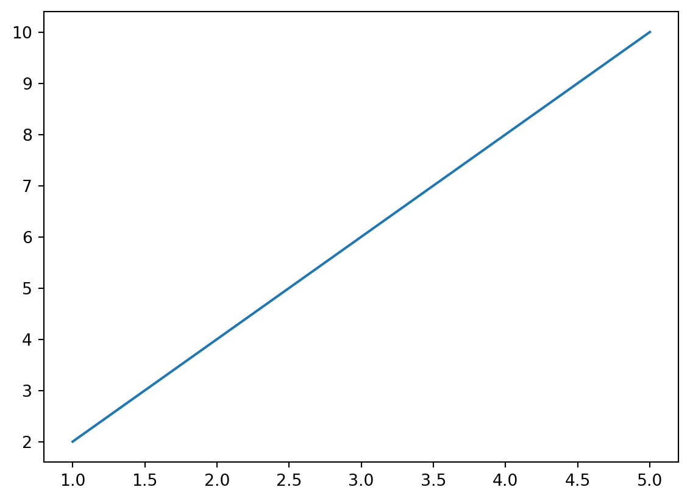{width=564 height=410}
:::
:::


## Gráficos de barras

Los gráficos de barras son una excelente forma de representar datos categóricos y comparar diferentes valores entre categorías. Son ideales cuando queremos mostrar la relación entre una variable independiente (categoría) y una variable dependiente (valor).

**Paso 1: Preparar los datos**
Antes de crear el gráfico de barras, necesitamos tener nuestros datos organizados. Asegúrate de tener una lista o array con las categorías que deseas representar en el eje X, y otra lista o array con los valores correspondientes en el eje Y.

**Paso 2: Crear el gráfico**
Utilizaremos la función `bar()` de Matplotlib para crear el gráfico de barras. Pasaremos nuestros datos de los ejes X e Y como argumentos. A continuación, utilizaremos la función `show()` para visualizar el gráfico.

::: {.cell execution_count=2}
``` {.python .cell-code}
import matplotlib.pyplot as plt

# Datos de ejemplo
categorias = ['A', 'B', 'C', 'D']
valores = [10, 15, 7, 12]

# Crear el gráfico de barras
plt.bar(categorias, valores)

# Mostrar el gráfico
plt.show()
```

::: {.cell-output .cell-output-display}
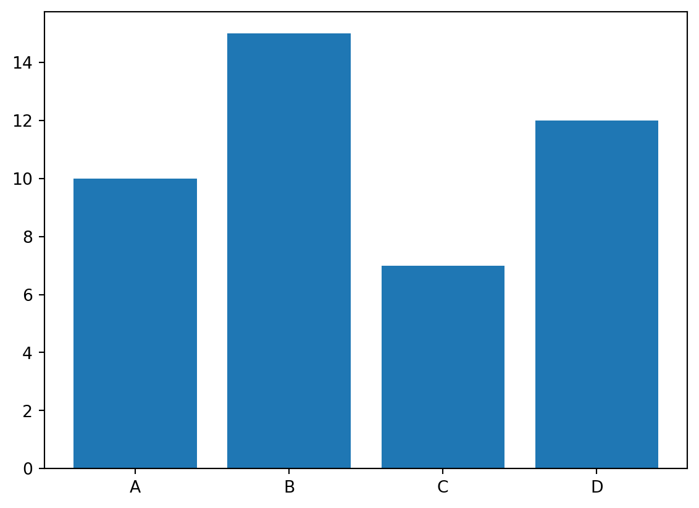{width=564 height=410}
:::
:::


## Gráficos de dispersión

Los gráficos de dispersión son una excelente opción cuando queremos visualizar la relación entre dos variables numéricas. Son especialmente útiles para identificar patrones, tendencias o la existencia de alguna correlación entre los datos.

**Paso 1: Preparar los datos**
Antes de crear el gráfico de dispersión, debemos asegurarnos de tener dos conjuntos de datos: uno para el eje X (variable independiente) y otro para el eje Y (variable dependiente). Asegúrate de que ambos conjuntos tengan la misma longitud y correspondencia adecuada.

**Paso 2: Crear el gráfico**
Utilizaremos la función `scatter()` de Matplotlib para crear el gráfico de dispersión. Pasaremos nuestros datos de los ejes X e Y como argumentos. Luego, utilizaremos la función `show()` para visualizar el gráfico.

::: {.cell execution_count=3}
``` {.python .cell-code}
import matplotlib.pyplot as plt

# Datos de ejemplo
x = [1, 2, 3, 4, 5]
y = [4, 7, 2, 9, 5]

# Crear el gráfico de dispersión
plt.scatter(x, y)

# Mostrar el gráfico
plt.show()
```

::: {.cell-output .cell-output-display}
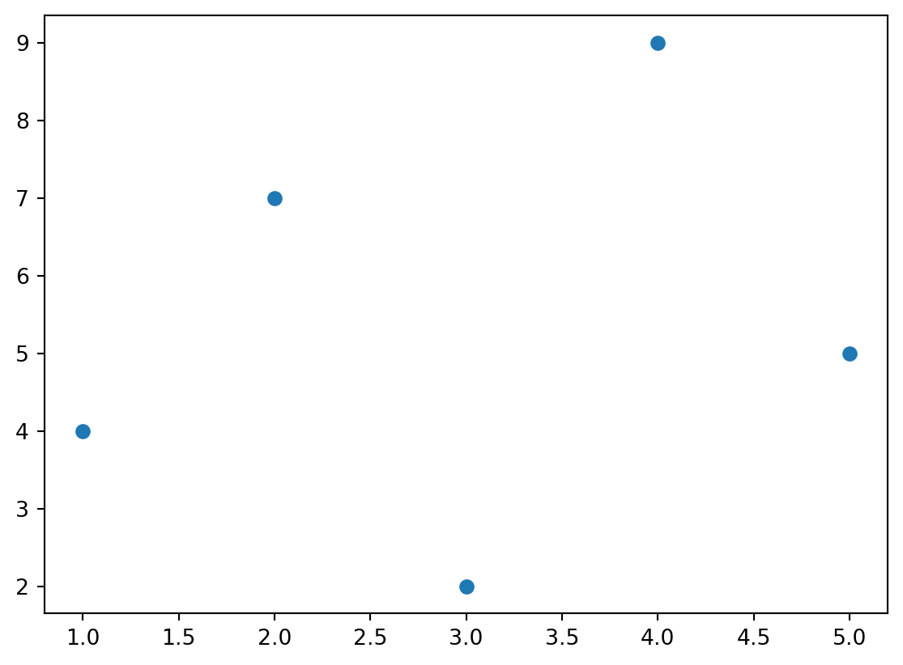{width=557 height=410}
:::
:::


## Gráficos de área

Los gráficos de área son una forma efectiva de visualizar la distribución o acumulación de datos a lo largo de una variable. Estos gráficos son útiles cuando queremos mostrar la contribución relativa de diferentes categorías o variables a un total.

**Paso 1: Preparar los datos**
Antes de crear el gráfico de área, debemos tener un conjunto de datos que represente las diferentes categorías o variables que queremos visualizar. También necesitaremos los valores correspondientes para cada categoría o variable.

**Paso 2: Crear el gráfico**
Utilizaremos la función `fill_between()` de Matplotlib para crear el gráfico de área. Pasaremos los datos de los ejes X e Y como argumentos y especificaremos el color del área. Luego, utilizaremos la función `show()` para visualizar el gráfico.

::: {.cell execution_count=4}
``` {.python .cell-code}
import matplotlib.pyplot as plt

# Datos de ejemplo
x = [1, 2, 3, 4, 5]
y = [2, 4, 6, 4, 8]

# Crear el gráfico de área
plt.fill_between(x, y, color='skyblue')

# Mostrar el gráfico
plt.show()
```

::: {.cell-output .cell-output-display}
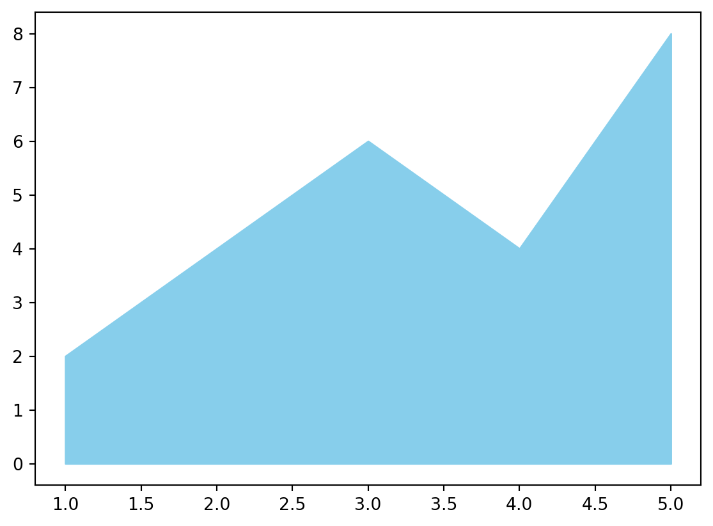{width=557 height=410}
:::
:::


## Gráficos de pastel

Los gráficos de pastel son una forma popular de visualizar la proporción de diferentes categorías o variables en un conjunto de datos. Estos gráficos circulares son útiles para representar datos que se dividen en partes proporcionales.

**Paso 1: Preparar los datos**
Antes de crear el gráfico de pastel, debemos tener un conjunto de datos con las categorías o variables que queremos representar y los valores correspondientes para cada una de ellas.

**Paso 2: Crear el gráfico**
Utilizaremos la función `pie()` de Matplotlib para crear el gráfico de pastel. Pasaremos los valores de las categorías como argumentos y especificaremos los colores y etiquetas correspondientes. Luego, utilizaremos la función `show()` para visualizar el gráfico.

::: {.cell execution_count=5}
``` {.python .cell-code}
import matplotlib.pyplot as plt

# Datos de ejemplo
categorias = ['Manzanas', 'Naranjas', 'Plátanos']
valores = [30, 40, 20]

# Crear el gráfico de pastel
plt.pie(valores, labels=categorias, colors=['red', 'orange', 'yellow'])

# Mostrar el gráfico
plt.show()
```

::: {.cell-output .cell-output-display}
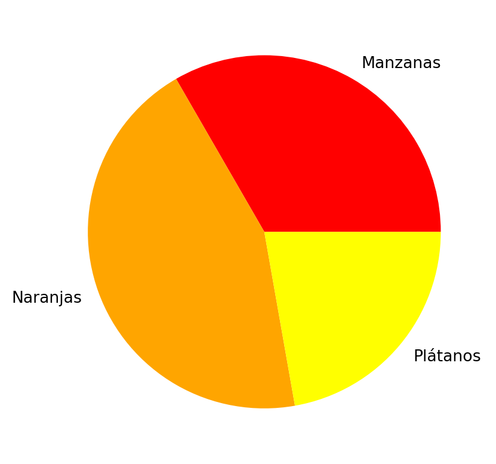{width=410 height=389}
:::
:::


# Personalización de gráficos

## Cambio de colores y estilos

La personalización de colores y estilos en los gráficos es una forma de agregar tu toque personal y hacer que tus visualizaciones sean más atractivas y significativas. Con Python, puedes cambiar fácilmente los colores de las líneas, los puntos y las áreas en tus gráficos, así como también aplicar diferentes estilos para resaltar la información más relevante.

**Cambio de colores:**

Puedes cambiar los colores predeterminados de tus gráficos utilizando la opción `color` en las funciones de trazado. Por ejemplo, si deseas cambiar el color de una línea en un gráfico de línea, puedes especificar un color diferente utilizando el argumento `color` seguido del nombre del color o su código hexadecimal.

::: {.cell execution_count=6}
``` {.python .cell-code}
import matplotlib.pyplot as plt

# Datos de ejemplo
x = [1, 2, 3, 4]
y = [10, 20, 15, 25]

# Cambiar el color de la línea a rojo
plt.plot(x, y, color='red')

# Mostrar el gráfico
plt.show()
```

::: {.cell-output .cell-output-display}
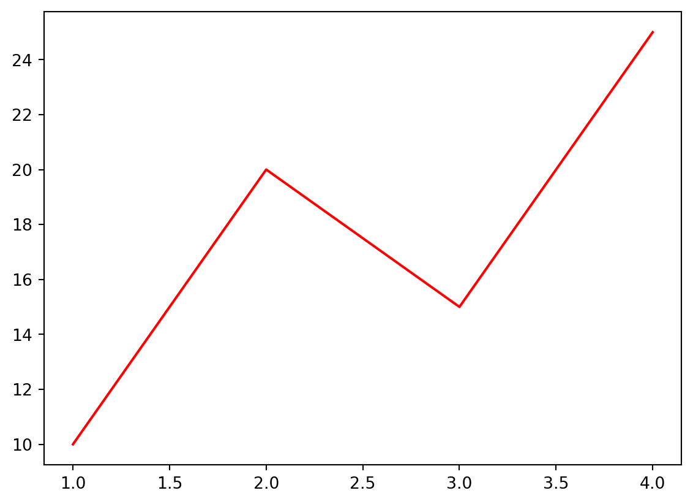{width=564 height=410}
:::
:::


Además de los colores predefinidos, también puedes utilizar códigos hexadecimales para seleccionar colores personalizados. Por ejemplo, `color='#FF0000'` representa el color rojo.

**Cambio de estilos:**

Python también te permite cambiar el estilo de tus gráficos para adaptarlos a tus preferencias. Puedes utilizar diferentes estilos predefinidos, como `'seaborn'`, `'ggplot'`, `'fivethirtyeight'`, entre otros. Simplemente utiliza la función `plt.style.use()` y pasa el nombre del estilo que deseas aplicar.

::: {.cell execution_count=7}
``` {.python .cell-code}
import matplotlib.pyplot as plt

# Estilo de gráfico 'seaborn'
plt.style.use('seaborn')

# Datos y trazado del gráfico
x = [1, 2, 3, 4]
y = [10, 20, 15, 25]
plt.plot(x, y)

# Mostrar el gráfico
plt.show()
```

::: {.cell-output .cell-output-display}
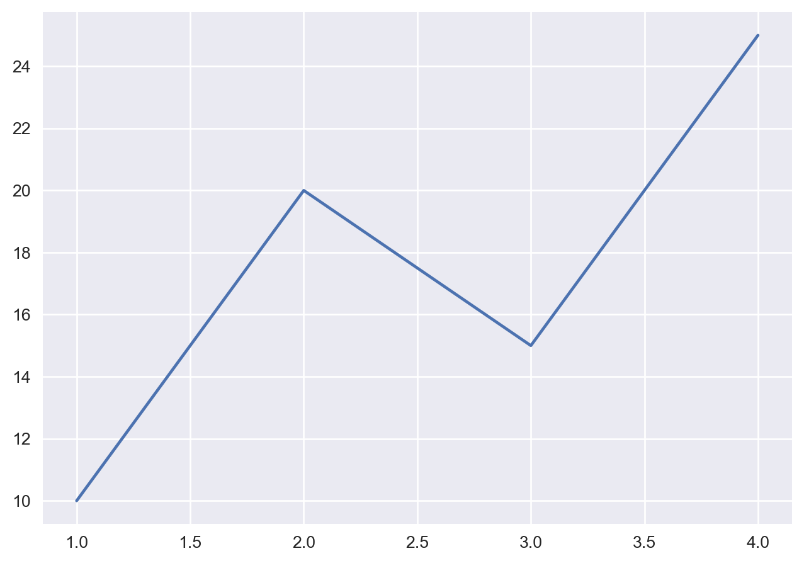{width=639 height=447}
:::
:::


Puedes experimentar con diferentes estilos y encontrar el que se ajuste mejor a tus necesidades y preferencias.


## Agregando etiquetas y títulos

Las etiquetas y los títulos son elementos clave en tus gráficos, ya que proporcionan información adicional y ayudan a interpretar los datos de manera más clara. Python te ofrece varias opciones para agregar etiquetas a los ejes, así como títulos para el gráfico en general.

**Etiquetas de ejes:**

Las etiquetas de ejes son fundamentales para comprender qué representan los valores en los gráficos. Puedes agregar etiquetas a los ejes x e y utilizando las funciones `plt.xlabel()` y `plt.ylabel()`, respectivamente. Simplemente pasa una cadena de texto como argumento para describir cada eje.

::: {.cell execution_count=8}
``` {.python .cell-code}
import matplotlib.pyplot as plt

# Datos de ejemplo
x = [1, 2, 3, 4]
y = [10, 20, 15, 25]

# Trazado del gráfico
plt.plot(x, y)

# Etiquetas de ejes
plt.xlabel('Eje X')
plt.ylabel('Eje Y')

# Mostrar el gráfico
plt.show()
```

::: {.cell-output .cell-output-display}
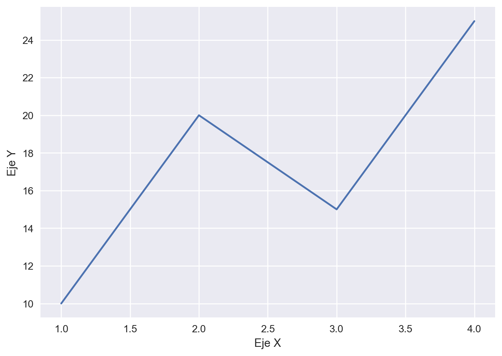{width=656 height=464}
:::
:::


Asegúrate de elegir etiquetas descriptivas que reflejen el contenido y la interpretación de los datos en tus gráficos.

**Título del gráfico:**

El título del gráfico es útil para resumir la información principal o el propósito del gráfico. Puedes agregar un título utilizando la función `plt.title()` y pasando una cadena de texto como argumento.

::: {.cell execution_count=9}
``` {.python .cell-code}
import matplotlib.pyplot as plt

# Datos de ejemplo
x = [1, 2, 3, 4]
y = [10, 20, 15, 25]

# Trazado del gráfico
plt.plot(x, y)

# Título del gráfico
plt.title('Gráfico de ejemplo')

# Mostrar el gráfico
plt.show()
```

::: {.cell-output .cell-output-display}
{width=639 height=467}
:::
:::


Al igual que con las etiquetas de ejes, elige un título claro y conciso que resuma la información que se muestra en el gráfico.


## Configuración de ejes y leyendas

La configuración de los ejes y las leyendas en tus gráficos es fundamental para proporcionar más información y claridad a tus visualizaciones. Python te ofrece diversas opciones para personalizar los ejes y agregar leyendas que ayuden a interpretar tus gráficos de manera efectiva.

**Personalización de ejes:**

Puedes personalizar los ejes de tu gráfico mediante la función `plt.axis()`, que te permite establecer los límites de los ejes x e y. Pasa una lista en el siguiente orden: `[xmin, xmax, ymin, ymax]` para definir los límites de cada eje.

::: {.cell execution_count=10}
``` {.python .cell-code}
import matplotlib.pyplot as plt

# Datos de ejemplo
x = [1, 2, 3, 4]
y = [10, 20, 15, 25]

# Trazado del gráfico
plt.plot(x, y)

# Personalización de ejes
plt.axis([0, 5, 0, 30])

# Mostrar el gráfico
plt.show()
```

::: {.cell-output .cell-output-display}
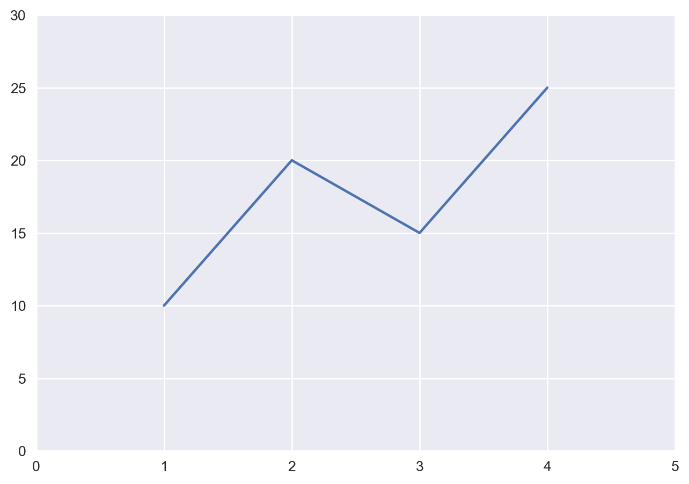{width=642 height=452}
:::
:::


Establecer límites adecuados en los ejes es importante para asegurarte de que tus datos se muestren correctamente y se ajusten al espacio disponible en el gráfico.

**Agregando leyendas:**

Las leyendas son útiles para identificar diferentes elementos en tus gráficos, como líneas, barras o puntos. Puedes agregar una leyenda utilizando la función `plt.legend()` después de trazar los elementos en tu gráfico. Además, puedes especificar la ubicación de la leyenda pasando un argumento como `'upper right'`, `'lower left'`, etc.

::: {.cell execution_count=11}
``` {.python .cell-code}
import matplotlib.pyplot as plt

# Datos de ejemplo
x = [1, 2, 3, 4]
y1 = [10, 20, 15, 25]
y2 = [5, 15, 10, 20]

# Trazado del gráfico
plt.plot(x, y1, label='Serie 1')
plt.plot(x, y2, label='Serie 2')

# Agregar leyenda
plt.legend(loc='upper right')

# Mostrar el gráfico
plt.show()
```

::: {.cell-output .cell-output-display}
{width=650 height=447}
:::
:::


Asegúrate de proporcionar etiquetas claras para cada serie de datos en tu gráfico. Esto ayudará a los lectores a comprender qué representa cada línea o elemento visualizado.


## Añadiendo anotaciones y texto

Las anotaciones y el texto son una forma poderosa de resaltar puntos clave o proporcionar información adicional en tus gráficos. Python te ofrece diversas opciones para añadir anotaciones y texto de manera sencilla y efectiva.

**Anotaciones:**

Puedes añadir anotaciones en puntos específicos de tu gráfico utilizando la función `plt.annotate()`. Esta función te permite colocar texto en coordenadas específicas del gráfico. Puedes especificar las coordenadas `xy` del punto donde deseas colocar la anotación y las coordenadas `xytext` donde deseas que aparezca el texto.

::: {.cell execution_count=12}
``` {.python .cell-code}
import matplotlib.pyplot as plt

# Datos de ejemplo
x = [1, 2, 3, 4]
y = [10, 20, 15, 25]

# Trazado del gráfico
plt.plot(x, y)

# Añadir una anotación
plt.annotate('Punto importante', xy=(2, 20), xytext=(3, 22),
             arrowprops=dict(arrowstyle='->'))

# Mostrar el gráfico
plt.show()
```

::: {.cell-output .cell-output-display}
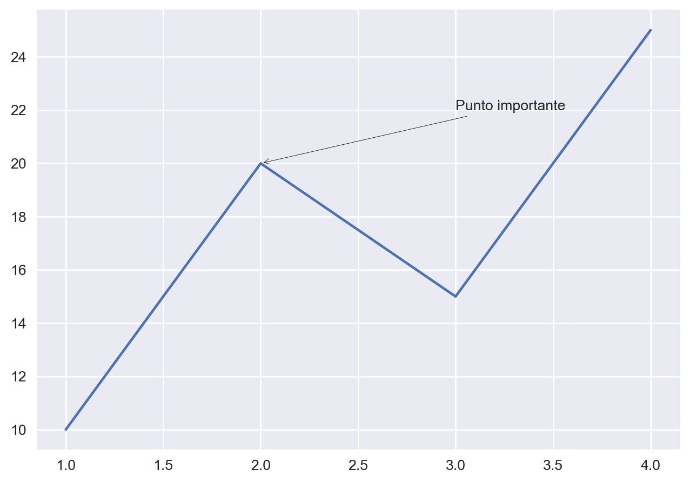{width=639 height=447}
:::
:::


Puedes personalizar aún más las anotaciones agregando flechas utilizando el parámetro `arrowprops`. Esto puede ayudar a resaltar la relación entre la anotación y el punto correspondiente en el gráfico.

**Texto:**

Además de las anotaciones, también puedes agregar texto en ubicaciones específicas utilizando la función `plt.text()`. Esta función te permite colocar texto en cualquier posición del gráfico especificando las coordenadas `x` e `y` del punto donde deseas que aparezca el texto.

::: {.cell execution_count=13}
``` {.python .cell-code}
import matplotlib.pyplot as plt

# Datos de ejemplo
x = [1, 2, 3, 4]
y = [10, 20, 15, 25]

# Trazado del gráfico
plt.plot(x, y)

# Añadir texto
plt.text(2, 20, 'Texto adicional', fontsize=12)

# Mostrar el gráfico
plt.show()
```

::: {.cell-output .cell-output-display}
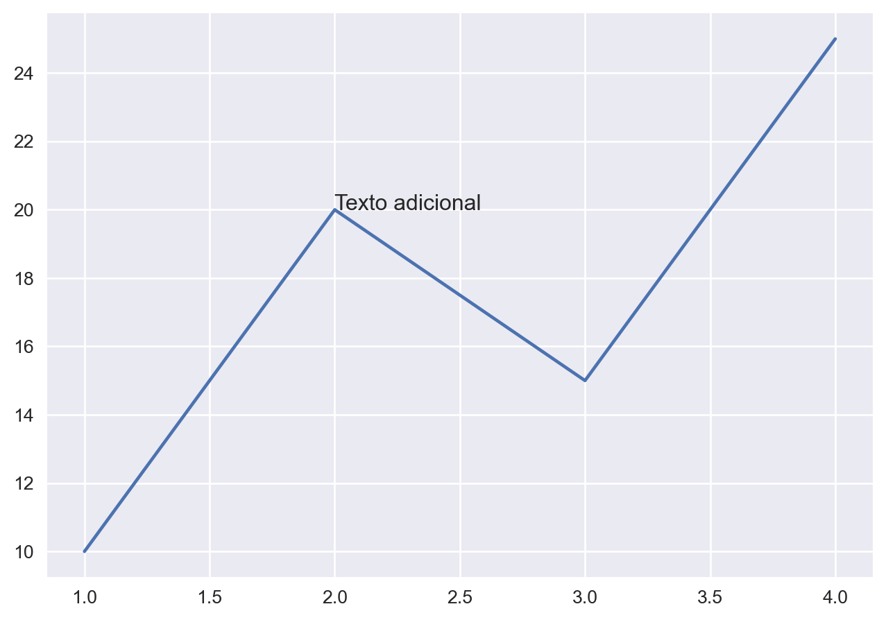{width=639 height=447}
:::
:::


Puedes ajustar el tamaño de la fuente del texto mediante el parámetro `fontsize` para asegurarte de que sea legible y se ajuste a tu gráfico.


# Gráficos avanzados

## Gráficos de contorno

Los gráficos de contorno son una forma efectiva de visualizar datos tridimensionales en un formato bidimensional. Estos gráficos utilizan líneas de contorno para representar las diferentes regiones de valores en un plano. 

En Python, puedes crear gráficos de contorno utilizando la función `plt.contour()` de Matplotlib. Esta función toma los datos en forma de matrices 2D y genera el gráfico de contorno correspondiente.

::: {.cell execution_count=14}
``` {.python .cell-code}
import matplotlib.pyplot as plt
import numpy as np

# Datos de ejemplo
x = np.linspace(-2, 2, 100)
y = np.linspace(-2, 2, 100)
X, Y = np.meshgrid(x, y)
Z = np.sin(X**2 + Y**2)

# Crear gráfico de contorno
plt.contour(X, Y, Z)

# Personalizar el gráfico
plt.title('Gráfico de contorno')
plt.xlabel('Eje X')
plt.ylabel('Eje Y')

# Mostrar el gráfico
plt.show()
```

::: {.cell-output .cell-output-display}
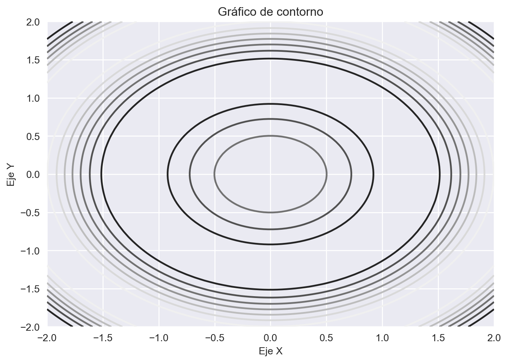{width=677 height=484}
:::
:::


En el código anterior, creamos una matriz 2D de valores `Z` basados en los valores de las matrices `X` e `Y`. Luego utilizamos `plt.contour()` para trazar el gráfico de contorno. Puedes ajustar la apariencia del gráfico personalizando los títulos de los ejes y agregando etiquetas.

Los gráficos de contorno son útiles para visualizar relaciones y patrones en datos tridimensionales de manera más comprensible. Puedes experimentar con diferentes configuraciones y colores para resaltar áreas específicas o ajustar los niveles de contorno para obtener más detalles.

## Gráficos 3D

Los gráficos 3D son una forma visualmente impactante de representar datos en tres dimensiones. Estos gráficos nos permiten explorar relaciones complejas y patrones en nuestros datos de una manera más inmersiva.

En Python, podemos crear gráficos 3D utilizando la biblioteca Matplotlib. La función `plt.plot_surface()` nos permite trazar superficies 3D a partir de matrices de datos.

::: {.cell execution_count=15}
``` {.python .cell-code}
import matplotlib.pyplot as plt
import numpy as np

# Datos de ejemplo
x = np.linspace(-5, 5, 100)
y = np.linspace(-5, 5, 100)
X, Y = np.meshgrid(x, y)
Z = np.sin(np.sqrt(X**2 + Y**2))

# Crear gráfico 3D
fig = plt.figure()
ax = fig.add_subplot(111, projection='3d')
ax.plot_surface(X, Y, Z)

# Personalizar el gráfico
ax.set_title('Gráfico 3D')
ax.set_xlabel('Eje X')
ax.set_ylabel('Eje Y')
ax.set_zlabel('Eje Z')

# Mostrar el gráfico
plt.show()
```

::: {.cell-output .cell-output-display}
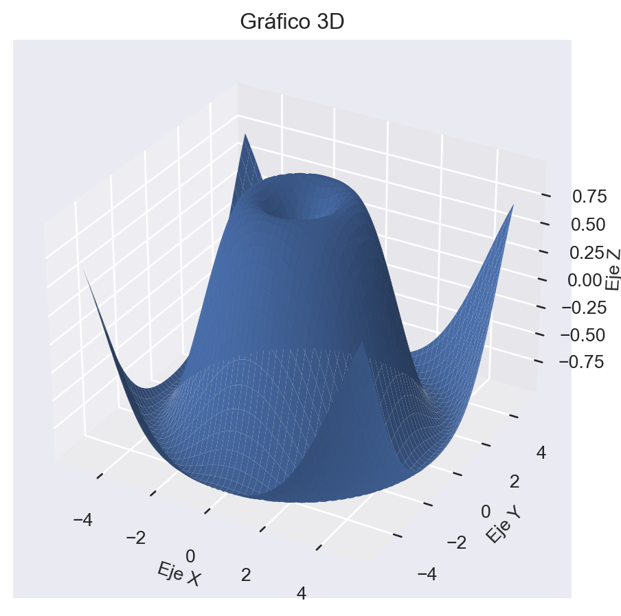{width=452 height=449}
:::
:::


En el código anterior, creamos matrices `X`, `Y` y `Z` que representan los puntos de la superficie tridimensional. Luego, utilizamos `plt.plot_surface()` junto con la proyección `'3d'` para trazar la superficie en el gráfico 3D.

Puedes personalizar el gráfico ajustando los títulos de los ejes y agregando etiquetas según sea necesario. Además, puedes experimentar con diferentes configuraciones, como cambiar los colores, ajustar la iluminación o agregar puntos de datos adicionales.

Los gráficos 3D son especialmente útiles cuando trabajamos con datos que involucran múltiples variables. Nos permiten visualizar relaciones complejas y descubrir patrones que podrían no ser evidentes en gráficos bidimensionales.

## Gráficos de mapas

Los gráficos de mapas son una forma poderosa de visualizar datos geoespaciales y resaltar patrones y distribuciones en un mapa interactivo. Con Python, podemos utilizar diversas bibliotecas, como Folium o Plotly, para crear gráficos de mapas personalizados.

Una de las bibliotecas más populares para gráficos de mapas es Folium. Esta biblioteca nos permite crear mapas interactivos utilizando datos geoespaciales y agregar capas adicionales, como marcadores o polígonos.

::: {.cell execution_count=16}
``` {.python .cell-code}
# pip install folium
import folium

# Crear un mapa
mapa = folium.Map(location=[40.7128, -74.0060], zoom_start=10)

# Agregar un marcador
folium.Marker(location=[40.7128, -74.0060], popup='Nueva York').add_to(mapa)

# Mostrar el mapa
mapa
```

::: {.cell-output .cell-output-display execution_count=124}

```{=html}
<div style="width:100%;"><div style="position:relative;width:100%;height:0;padding-bottom:60%;"><span style="color:#565656">Make this Notebook Trusted to load map: File -> Trust Notebook</span><iframe srcdoc="&lt;!DOCTYPE html&gt;
&lt;html&gt;
&lt;head&gt;
    
    &lt;meta http-equiv=&quot;content-type&quot; content=&quot;text/html; charset=UTF-8&quot; /&gt;
    
        &lt;script&gt;
            L_NO_TOUCH = false;
            L_DISABLE_3D = false;
        &lt;/script&gt;
    
    &lt;style&gt;html, body {width: 100%;height: 100%;margin: 0;padding: 0;}&lt;/style&gt;
    &lt;style&gt;#map {position:absolute;top:0;bottom:0;right:0;left:0;}&lt;/style&gt;
    &lt;script src=&quot;https://cdn.jsdelivr.net/npm/leaflet@1.9.3/dist/leaflet.js&quot;&gt;&lt;/script&gt;
    &lt;script src=&quot;https://code.jquery.com/jquery-1.12.4.min.js&quot;&gt;&lt;/script&gt;
    &lt;script src=&quot;https://cdn.jsdelivr.net/npm/bootstrap@5.2.2/dist/js/bootstrap.bundle.min.js&quot;&gt;&lt;/script&gt;
    &lt;script src=&quot;https://cdnjs.cloudflare.com/ajax/libs/Leaflet.awesome-markers/2.0.2/leaflet.awesome-markers.js&quot;&gt;&lt;/script&gt;
    &lt;link rel=&quot;stylesheet&quot; href=&quot;https://cdn.jsdelivr.net/npm/leaflet@1.9.3/dist/leaflet.css&quot;/&gt;
    &lt;link rel=&quot;stylesheet&quot; href=&quot;https://cdn.jsdelivr.net/npm/bootstrap@5.2.2/dist/css/bootstrap.min.css&quot;/&gt;
    &lt;link rel=&quot;stylesheet&quot; href=&quot;https://netdna.bootstrapcdn.com/bootstrap/3.0.0/css/bootstrap.min.css&quot;/&gt;
    &lt;link rel=&quot;stylesheet&quot; href=&quot;https://cdn.jsdelivr.net/npm/@fortawesome/fontawesome-free@6.2.0/css/all.min.css&quot;/&gt;
    &lt;link rel=&quot;stylesheet&quot; href=&quot;https://cdnjs.cloudflare.com/ajax/libs/Leaflet.awesome-markers/2.0.2/leaflet.awesome-markers.css&quot;/&gt;
    &lt;link rel=&quot;stylesheet&quot; href=&quot;https://cdn.jsdelivr.net/gh/python-visualization/folium/folium/templates/leaflet.awesome.rotate.min.css&quot;/&gt;
    
            &lt;meta name=&quot;viewport&quot; content=&quot;width=device-width,
                initial-scale=1.0, maximum-scale=1.0, user-scalable=no&quot; /&gt;
            &lt;style&gt;
                #map_cd5e96dbb6176e90ec4e3f1725141e76 {
                    position: relative;
                    width: 100.0%;
                    height: 100.0%;
                    left: 0.0%;
                    top: 0.0%;
                }
                .leaflet-container { font-size: 1rem; }
            &lt;/style&gt;
        
&lt;/head&gt;
&lt;body&gt;
    
    
            &lt;div class=&quot;folium-map&quot; id=&quot;map_cd5e96dbb6176e90ec4e3f1725141e76&quot; &gt;&lt;/div&gt;
        
&lt;/body&gt;
&lt;script&gt;
    
    
            var map_cd5e96dbb6176e90ec4e3f1725141e76 = L.map(
                &quot;map_cd5e96dbb6176e90ec4e3f1725141e76&quot;,
                {
                    center: [40.7128, -74.006],
                    crs: L.CRS.EPSG3857,
                    zoom: 10,
                    zoomControl: true,
                    preferCanvas: false,
                }
            );

            

        
    
            var tile_layer_d556eccb7fd5beaca687ee5bb8468f42 = L.tileLayer(
                &quot;https://{s}.tile.openstreetmap.org/{z}/{x}/{y}.png&quot;,
                {&quot;attribution&quot;: &quot;Data by \u0026copy; \u003ca target=\&quot;_blank\&quot; href=\&quot;http://openstreetmap.org\&quot;\u003eOpenStreetMap\u003c/a\u003e, under \u003ca target=\&quot;_blank\&quot; href=\&quot;http://www.openstreetmap.org/copyright\&quot;\u003eODbL\u003c/a\u003e.&quot;, &quot;detectRetina&quot;: false, &quot;maxNativeZoom&quot;: 18, &quot;maxZoom&quot;: 18, &quot;minZoom&quot;: 0, &quot;noWrap&quot;: false, &quot;opacity&quot;: 1, &quot;subdomains&quot;: &quot;abc&quot;, &quot;tms&quot;: false}
            ).addTo(map_cd5e96dbb6176e90ec4e3f1725141e76);
        
    
            var marker_f98dc9e9b48c5ba7eac10077110222d1 = L.marker(
                [40.7128, -74.006],
                {}
            ).addTo(map_cd5e96dbb6176e90ec4e3f1725141e76);
        
    
        var popup_b92839a0a2c557a2b12df2fde5701084 = L.popup({&quot;maxWidth&quot;: &quot;100%&quot;});

        
            
                var html_fb2c3073fdbe19196a4d7574327083a3 = $(`&lt;div id=&quot;html_fb2c3073fdbe19196a4d7574327083a3&quot; style=&quot;width: 100.0%; height: 100.0%;&quot;&gt;Nueva York&lt;/div&gt;`)[0];
                popup_b92839a0a2c557a2b12df2fde5701084.setContent(html_fb2c3073fdbe19196a4d7574327083a3);
            
        

        marker_f98dc9e9b48c5ba7eac10077110222d1.bindPopup(popup_b92839a0a2c557a2b12df2fde5701084)
        ;

        
    
&lt;/script&gt;
&lt;/html&gt;" style="position:absolute;width:100%;height:100%;left:0;top:0;border:none !important;" allowfullscreen webkitallowfullscreen mozallowfullscreen></iframe></div></div>
```

:::
:::


En el código anterior, creamos un mapa centrado en una ubicación específica (latitud y longitud) utilizando `folium.Map()`. Luego, agregamos un marcador en la misma ubicación utilizando `folium.Marker()`. Puedes personalizar el marcador y agregar información adicional, como un mensaje emergente, para proporcionar más detalles.

Folium también nos permite agregar capas adicionales, como polígonos o rutas, utilizando funciones como `folium.Polygon()` o `folium.PolyLine()`. Estas capas pueden ayudarnos a representar datos geoespaciales más complejos y enriquecer nuestra visualización.

Otra biblioteca popular para gráficos de mapas es Plotly, que nos ofrece capacidades de visualización interactiva y personalizable. Con Plotly, podemos crear mapas con múltiples capas y utilizar técnicas de visualización avanzadas, como el mapa de calor o la agregación espacial.

Los gráficos de mapas son especialmente útiles para visualizar datos geoespaciales, como ubicaciones de tiendas, distribución de población o rutas. Nos permiten comprender mejor la información cuando está relacionada con la ubicación geográfica.


## Gráficos interactivos

Los gráficos interactivos son una forma fascinante de visualizar datos y permitir a los usuarios explorar la información de manera dinámica. Python nos ofrece varias bibliotecas poderosas para crear gráficos interactivos, como Plotly, Bokeh y Altair.

Una de las bibliotecas más populares para gráficos interactivos es Plotly. Esta biblioteca nos permite crear gráficos interactivos con características como zoom, pan y herramientas para resaltar puntos de datos específicos. Además, Plotly proporciona una interfaz sencilla para personalizar y diseñar nuestros gráficos.

::: {.cell execution_count=17}
``` {.python .cell-code}
import pandas as pd

# Definir los datos y exportamos a un .csv
datos = {
    'nombre': ['Juan', 'María', 'Carlos', 'Laura'],
    'edad': [25, 30, 35, 28],
    'salario': [50000, 60000, 70000, 55000],
    'departamento': ['Ventas', 'Marketing', 'Finanzas', 'Recursos Humanos']
}

# Crear un DataFrame con los datos
df = pd.DataFrame(datos)

# Guardar el DataFrame en un archivo CSV
df.to_csv('datos.csv', index=False)
```
:::


::: {.cell execution_count=18}
``` {.python .cell-code}
import pandas as pd
import plotly.express as px

df = pd.read_csv('datos.csv')

# Crear un gráfico interactivo de dispersión
fig = px.scatter(df, x="edad", y="salario", color="departamento", hover_data=["nombre"])

# Personalizar el diseño y las herramientas interactivas
fig.update_layout(
    title="Relación entre edad, salario y departamento",
    xaxis_title="Edad",
    yaxis_title="Salario",
    hovermode="closest"
)

# Mostrar el gráfico interactivo
fig.show()
```

::: {.cell-output .cell-output-display}

```{=html}
<div>                            <div id="18a8fc5c-2cb1-4364-a214-9a6915bb328c" class="plotly-graph-div" style="height:525px; width:100%;"></div>            <script type="text/javascript">                require(["plotly"], function(Plotly) {                    window.PLOTLYENV=window.PLOTLYENV || {};                                    if (document.getElementById("18a8fc5c-2cb1-4364-a214-9a6915bb328c")) {                    Plotly.newPlot(                        "18a8fc5c-2cb1-4364-a214-9a6915bb328c",                        [{"customdata":[["Juan"]],"hovertemplate":"departamento=Ventas<br>edad=%{x}<br>salario=%{y}<br>nombre=%{customdata[0]}<extra></extra>","legendgroup":"Ventas","marker":{"color":"#636efa","symbol":"circle"},"mode":"markers","name":"Ventas","orientation":"v","showlegend":true,"x":[25],"xaxis":"x","y":[50000],"yaxis":"y","type":"scatter"},{"customdata":[["Mar\u00eda"]],"hovertemplate":"departamento=Marketing<br>edad=%{x}<br>salario=%{y}<br>nombre=%{customdata[0]}<extra></extra>","legendgroup":"Marketing","marker":{"color":"#EF553B","symbol":"circle"},"mode":"markers","name":"Marketing","orientation":"v","showlegend":true,"x":[30],"xaxis":"x","y":[60000],"yaxis":"y","type":"scatter"},{"customdata":[["Carlos"]],"hovertemplate":"departamento=Finanzas<br>edad=%{x}<br>salario=%{y}<br>nombre=%{customdata[0]}<extra></extra>","legendgroup":"Finanzas","marker":{"color":"#00cc96","symbol":"circle"},"mode":"markers","name":"Finanzas","orientation":"v","showlegend":true,"x":[35],"xaxis":"x","y":[70000],"yaxis":"y","type":"scatter"},{"customdata":[["Laura"]],"hovertemplate":"departamento=Recursos Humanos<br>edad=%{x}<br>salario=%{y}<br>nombre=%{customdata[0]}<extra></extra>","legendgroup":"Recursos Humanos","marker":{"color":"#ab63fa","symbol":"circle"},"mode":"markers","name":"Recursos Humanos","orientation":"v","showlegend":true,"x":[28],"xaxis":"x","y":[55000],"yaxis":"y","type":"scatter"}],                        {"template":{"data":{"histogram2dcontour":[{"type":"histogram2dcontour","colorbar":{"outlinewidth":0,"ticks":""},"colorscale":[[0.0,"#0d0887"],[0.1111111111111111,"#46039f"],[0.2222222222222222,"#7201a8"],[0.3333333333333333,"#9c179e"],[0.4444444444444444,"#bd3786"],[0.5555555555555556,"#d8576b"],[0.6666666666666666,"#ed7953"],[0.7777777777777778,"#fb9f3a"],[0.8888888888888888,"#fdca26"],[1.0,"#f0f921"]]}],"choropleth":[{"type":"choropleth","colorbar":{"outlinewidth":0,"ticks":""}}],"histogram2d":[{"type":"histogram2d","colorbar":{"outlinewidth":0,"ticks":""},"colorscale":[[0.0,"#0d0887"],[0.1111111111111111,"#46039f"],[0.2222222222222222,"#7201a8"],[0.3333333333333333,"#9c179e"],[0.4444444444444444,"#bd3786"],[0.5555555555555556,"#d8576b"],[0.6666666666666666,"#ed7953"],[0.7777777777777778,"#fb9f3a"],[0.8888888888888888,"#fdca26"],[1.0,"#f0f921"]]}],"heatmap":[{"type":"heatmap","colorbar":{"outlinewidth":0,"ticks":""},"colorscale":[[0.0,"#0d0887"],[0.1111111111111111,"#46039f"],[0.2222222222222222,"#7201a8"],[0.3333333333333333,"#9c179e"],[0.4444444444444444,"#bd3786"],[0.5555555555555556,"#d8576b"],[0.6666666666666666,"#ed7953"],[0.7777777777777778,"#fb9f3a"],[0.8888888888888888,"#fdca26"],[1.0,"#f0f921"]]}],"heatmapgl":[{"type":"heatmapgl","colorbar":{"outlinewidth":0,"ticks":""},"colorscale":[[0.0,"#0d0887"],[0.1111111111111111,"#46039f"],[0.2222222222222222,"#7201a8"],[0.3333333333333333,"#9c179e"],[0.4444444444444444,"#bd3786"],[0.5555555555555556,"#d8576b"],[0.6666666666666666,"#ed7953"],[0.7777777777777778,"#fb9f3a"],[0.8888888888888888,"#fdca26"],[1.0,"#f0f921"]]}],"contourcarpet":[{"type":"contourcarpet","colorbar":{"outlinewidth":0,"ticks":""}}],"contour":[{"type":"contour","colorbar":{"outlinewidth":0,"ticks":""},"colorscale":[[0.0,"#0d0887"],[0.1111111111111111,"#46039f"],[0.2222222222222222,"#7201a8"],[0.3333333333333333,"#9c179e"],[0.4444444444444444,"#bd3786"],[0.5555555555555556,"#d8576b"],[0.6666666666666666,"#ed7953"],[0.7777777777777778,"#fb9f3a"],[0.8888888888888888,"#fdca26"],[1.0,"#f0f921"]]}],"surface":[{"type":"surface","colorbar":{"outlinewidth":0,"ticks":""},"colorscale":[[0.0,"#0d0887"],[0.1111111111111111,"#46039f"],[0.2222222222222222,"#7201a8"],[0.3333333333333333,"#9c179e"],[0.4444444444444444,"#bd3786"],[0.5555555555555556,"#d8576b"],[0.6666666666666666,"#ed7953"],[0.7777777777777778,"#fb9f3a"],[0.8888888888888888,"#fdca26"],[1.0,"#f0f921"]]}],"mesh3d":[{"type":"mesh3d","colorbar":{"outlinewidth":0,"ticks":""}}],"scatter":[{"fillpattern":{"fillmode":"overlay","size":10,"solidity":0.2},"type":"scatter"}],"parcoords":[{"type":"parcoords","line":{"colorbar":{"outlinewidth":0,"ticks":""}}}],"scatterpolargl":[{"type":"scatterpolargl","marker":{"colorbar":{"outlinewidth":0,"ticks":""}}}],"bar":[{"error_x":{"color":"#2a3f5f"},"error_y":{"color":"#2a3f5f"},"marker":{"line":{"color":"#E5ECF6","width":0.5},"pattern":{"fillmode":"overlay","size":10,"solidity":0.2}},"type":"bar"}],"scattergeo":[{"type":"scattergeo","marker":{"colorbar":{"outlinewidth":0,"ticks":""}}}],"scatterpolar":[{"type":"scatterpolar","marker":{"colorbar":{"outlinewidth":0,"ticks":""}}}],"histogram":[{"marker":{"pattern":{"fillmode":"overlay","size":10,"solidity":0.2}},"type":"histogram"}],"scattergl":[{"type":"scattergl","marker":{"colorbar":{"outlinewidth":0,"ticks":""}}}],"scatter3d":[{"type":"scatter3d","line":{"colorbar":{"outlinewidth":0,"ticks":""}},"marker":{"colorbar":{"outlinewidth":0,"ticks":""}}}],"scattermapbox":[{"type":"scattermapbox","marker":{"colorbar":{"outlinewidth":0,"ticks":""}}}],"scatterternary":[{"type":"scatterternary","marker":{"colorbar":{"outlinewidth":0,"ticks":""}}}],"scattercarpet":[{"type":"scattercarpet","marker":{"colorbar":{"outlinewidth":0,"ticks":""}}}],"carpet":[{"aaxis":{"endlinecolor":"#2a3f5f","gridcolor":"white","linecolor":"white","minorgridcolor":"white","startlinecolor":"#2a3f5f"},"baxis":{"endlinecolor":"#2a3f5f","gridcolor":"white","linecolor":"white","minorgridcolor":"white","startlinecolor":"#2a3f5f"},"type":"carpet"}],"table":[{"cells":{"fill":{"color":"#EBF0F8"},"line":{"color":"white"}},"header":{"fill":{"color":"#C8D4E3"},"line":{"color":"white"}},"type":"table"}],"barpolar":[{"marker":{"line":{"color":"#E5ECF6","width":0.5},"pattern":{"fillmode":"overlay","size":10,"solidity":0.2}},"type":"barpolar"}],"pie":[{"automargin":true,"type":"pie"}]},"layout":{"autotypenumbers":"strict","colorway":["#636efa","#EF553B","#00cc96","#ab63fa","#FFA15A","#19d3f3","#FF6692","#B6E880","#FF97FF","#FECB52"],"font":{"color":"#2a3f5f"},"hovermode":"closest","hoverlabel":{"align":"left"},"paper_bgcolor":"white","plot_bgcolor":"#E5ECF6","polar":{"bgcolor":"#E5ECF6","angularaxis":{"gridcolor":"white","linecolor":"white","ticks":""},"radialaxis":{"gridcolor":"white","linecolor":"white","ticks":""}},"ternary":{"bgcolor":"#E5ECF6","aaxis":{"gridcolor":"white","linecolor":"white","ticks":""},"baxis":{"gridcolor":"white","linecolor":"white","ticks":""},"caxis":{"gridcolor":"white","linecolor":"white","ticks":""}},"coloraxis":{"colorbar":{"outlinewidth":0,"ticks":""}},"colorscale":{"sequential":[[0.0,"#0d0887"],[0.1111111111111111,"#46039f"],[0.2222222222222222,"#7201a8"],[0.3333333333333333,"#9c179e"],[0.4444444444444444,"#bd3786"],[0.5555555555555556,"#d8576b"],[0.6666666666666666,"#ed7953"],[0.7777777777777778,"#fb9f3a"],[0.8888888888888888,"#fdca26"],[1.0,"#f0f921"]],"sequentialminus":[[0.0,"#0d0887"],[0.1111111111111111,"#46039f"],[0.2222222222222222,"#7201a8"],[0.3333333333333333,"#9c179e"],[0.4444444444444444,"#bd3786"],[0.5555555555555556,"#d8576b"],[0.6666666666666666,"#ed7953"],[0.7777777777777778,"#fb9f3a"],[0.8888888888888888,"#fdca26"],[1.0,"#f0f921"]],"diverging":[[0,"#8e0152"],[0.1,"#c51b7d"],[0.2,"#de77ae"],[0.3,"#f1b6da"],[0.4,"#fde0ef"],[0.5,"#f7f7f7"],[0.6,"#e6f5d0"],[0.7,"#b8e186"],[0.8,"#7fbc41"],[0.9,"#4d9221"],[1,"#276419"]]},"xaxis":{"gridcolor":"white","linecolor":"white","ticks":"","title":{"standoff":15},"zerolinecolor":"white","automargin":true,"zerolinewidth":2},"yaxis":{"gridcolor":"white","linecolor":"white","ticks":"","title":{"standoff":15},"zerolinecolor":"white","automargin":true,"zerolinewidth":2},"scene":{"xaxis":{"backgroundcolor":"#E5ECF6","gridcolor":"white","linecolor":"white","showbackground":true,"ticks":"","zerolinecolor":"white","gridwidth":2},"yaxis":{"backgroundcolor":"#E5ECF6","gridcolor":"white","linecolor":"white","showbackground":true,"ticks":"","zerolinecolor":"white","gridwidth":2},"zaxis":{"backgroundcolor":"#E5ECF6","gridcolor":"white","linecolor":"white","showbackground":true,"ticks":"","zerolinecolor":"white","gridwidth":2}},"shapedefaults":{"line":{"color":"#2a3f5f"}},"annotationdefaults":{"arrowcolor":"#2a3f5f","arrowhead":0,"arrowwidth":1},"geo":{"bgcolor":"white","landcolor":"#E5ECF6","subunitcolor":"white","showland":true,"showlakes":true,"lakecolor":"white"},"title":{"x":0.05},"mapbox":{"style":"light"}}},"xaxis":{"anchor":"y","domain":[0.0,1.0],"title":{"text":"Edad"}},"yaxis":{"anchor":"x","domain":[0.0,1.0],"title":{"text":"Salario"}},"legend":{"title":{"text":"departamento"},"tracegroupgap":0},"margin":{"t":60},"title":{"text":"Relaci\u00f3n entre edad, salario y departamento"},"hovermode":"closest"},                        {"responsive": true}                    ).then(function(){
                            
var gd = document.getElementById('18a8fc5c-2cb1-4364-a214-9a6915bb328c');
var x = new MutationObserver(function (mutations, observer) {{
        var display = window.getComputedStyle(gd).display;
        if (!display || display === 'none') {{
            console.log([gd, 'removed!']);
            Plotly.purge(gd);
            observer.disconnect();
        }}
}});

// Listen for the removal of the full notebook cells
var notebookContainer = gd.closest('#notebook-container');
if (notebookContainer) {{
    x.observe(notebookContainer, {childList: true});
}}

// Listen for the clearing of the current output cell
var outputEl = gd.closest('.output');
if (outputEl) {{
    x.observe(outputEl, {childList: true});
}}

                        })                };                });            </script>        </div>
```

:::
:::


En el código anterior, utilizamos la biblioteca Plotly Express para crear un gráfico interactivo de dispersión. Especificamos las columnas del DataFrame que deseamos visualizar y personalizamos el gráfico con títulos, etiquetas y configuraciones de interacción.

Además de Plotly, Bokeh y Altair también son bibliotecas populares para crear gráficos interactivos en Python. Bokeh nos permite crear visualizaciones interactivas basadas en navegadores web, mientras que Altair se centra en la creación de gráficos declarativos y basados en gramáticas.

Los gráficos interactivos son ideales para explorar datos, ya que permiten a los usuarios interactuar con los gráficos y profundizar en la información. Pueden ser utilizados para resaltar puntos de datos, mostrar detalles adicionales en herramientas emergentes o incluso para filtrar y seleccionar subconjuntos de datos.


# Visualización de datos en tiempo real

## Uso de bibliotecas para datos en continuo

La visualización de datos en tiempo real es una técnica poderosa para analizar y monitorear datos que evolucionan constantemente. Python ofrece varias bibliotecas que nos permiten visualizar datos en continuo y actualizar gráficos en tiempo real.

Una de las bibliotecas más utilizadas para visualización en tiempo real es Matplotlib. Aunque Matplotlib es conocida principalmente por crear gráficos estáticos, también podemos aprovechar sus capacidades para visualizar datos en tiempo real. Podemos utilizar la función `plt.plot()` en un bucle mientras los datos se actualizan continuamente para lograr la visualización en tiempo real.

::: {.cell execution_count=19}
``` {.python .cell-code}
import matplotlib.pyplot as plt
import numpy as np

# Configuración inicial
fig, ax = plt.subplots()
x = np.linspace(0, 10, 100)
y = np.sin(x)

# Actualización en tiempo real
for i in range(100):
    y = np.sin(x + i * 0.1)
    ax.clear()
    ax.plot(x, y)
    plt.pause(0.1)

plt.show()
```

::: {.cell-output .cell-output-display}
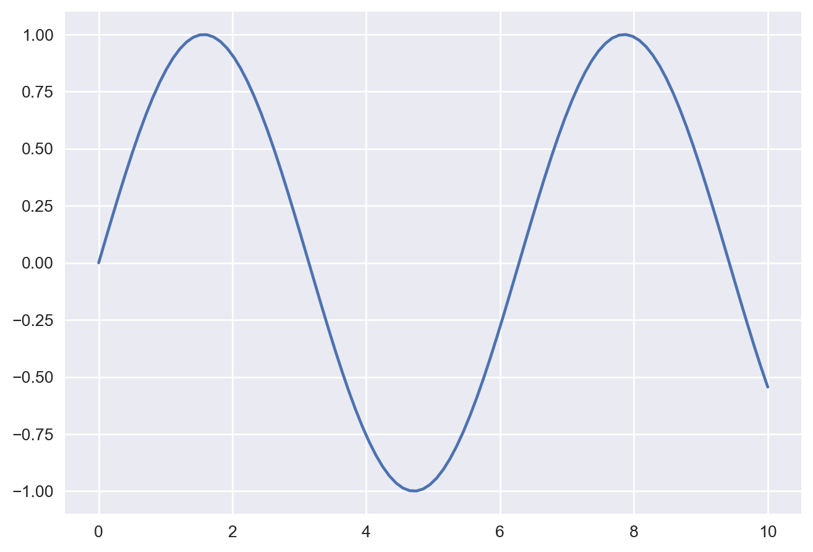{width=658 height=447}
:::
:::


En el código anterior, utilizamos Matplotlib para crear un gráfico de línea en tiempo real. En cada iteración del bucle, actualizamos los datos y redibujamos el gráfico utilizando `ax.clear()` para eliminar el contenido anterior y `ax.plot()` para trazar los nuevos datos. Luego, utilizamos `plt.pause()` para pausar brevemente la ejecución y permitir la actualización visual.

Otra biblioteca popular para visualización en tiempo real es Bokeh. Bokeh nos permite crear gráficos interactivos y actualizables en un navegador web. Con su funcionalidad de streaming de datos, podemos conectar nuestros datos en continuo y observar cómo evolucionan en tiempo real.

::: {.cell execution_count=20}
``` {.python .cell-code}
from bokeh.plotting import figure, curdoc
from bokeh.models import ColumnDataSource
import numpy as np

# Configuración inicial
p = figure()
x = np.linspace(0, 10, 100)
y = np.sin(x)

# Actualización en tiempo real
source = ColumnDataSource(data=dict(x=x, y=y))
p.line(x='x', y='y', source=source)

def update():
    new_y = np.sin(x + curdoc().count * 0.1)
    source.data = dict(x=x, y=new_y)
    curdoc().count += 1

curdoc().count = 0
curdoc().add_periodic_callback(update, 100)

curdoc().title = "Visualización en tiempo real"
curdoc().add_root(p)
```
:::


En este ejemplo de Bokeh, utilizamos la función `figure()` para crear un nuevo gráfico y `p.line()` para trazar la línea inicial. Luego, definimos una función `update()` que actualiza los datos y los asigna a la fuente de datos `ColumnDataSource`. Utilizamos `curdoc().add_periodic_callback()` para llamar a la función `update()` periódicamente y actualizar los datos en tiempo real.


## Actualización de gráficos en tiempo real

Una de las características más interesantes de la visualización de datos en tiempo real es la capacidad de actualizar los gráficos de forma dinámica a medida que los datos cambian. Esto nos permite observar los cambios en tiempo real y tomar decisiones basadas en la información más reciente.

Existen diferentes enfoques para lograr la actualización de gráficos en tiempo real, dependiendo de la biblioteca de visualización que estemos utilizando. Veamos algunos ejemplos con las bibliotecas Matplotlib y Bokeh.

### Matplotlib

En Matplotlib, podemos lograr la actualización de gráficos en tiempo real utilizando la función `plt.pause()` dentro de un bucle. Veamos un ejemplo:

::: {.cell execution_count=21}
``` {.python .cell-code}
import matplotlib.pyplot as plt
import numpy as np

# Configuración inicial
fig, ax = plt.subplots()
x = np.linspace(0, 10, 100)
y = np.sin(x)

# Actualización en tiempo real
for i in range(100):
    y = np.sin(x + i * 0.1)
    ax.clear()
    ax.plot(x, y)
    plt.pause(0.1)

plt.show()
```

::: {.cell-output .cell-output-display}
{width=658 height=447}
:::
:::


En este ejemplo, creamos un gráfico de línea que se actualiza en tiempo real. En cada iteración del bucle, generamos nuevos datos y los trazamos utilizando `ax.plot()`. Utilizamos `ax.clear()` para eliminar el contenido anterior y `plt.pause()` para pausar brevemente la ejecución y permitir la actualización visual.

### Bokeh

En Bokeh, podemos utilizar la función `ColumnDataSource` y el método `stream()` para lograr la actualización en tiempo real. Veamos un ejemplo:

::: {.cell execution_count=22}
``` {.python .cell-code}
from bokeh.plotting import figure, curdoc
from bokeh.models import ColumnDataSource
import numpy as np

# Configuración inicial
p = figure()
x = np.linspace(0, 10, 100)
y = np.sin(x)

# Actualización en tiempo real
source = ColumnDataSource(data=dict(x=x, y=y))
p.line(x='x', y='y', source=source)

def update():
    new_y = np.sin(x + curdoc().count * 0.1)
    source.stream(dict(x=x, y=new_y), rollover=100)

curdoc().count = 0
curdoc().add_periodic_callback(update, 100)

curdoc().title = "Actualización en tiempo real"
curdoc().add_root(p)
```
:::


En este ejemplo de Bokeh, utilizamos la función `ColumnDataSource` para almacenar nuestros datos y el método `stream()` para actualizarlos en tiempo real. La función `update()` genera nuevos datos y los agrega a la fuente de datos utilizando `source.stream()`. Utilizamos `curdoc().add_periodic_callback()` para llamar a la función `update()` periódicamente y actualizar los datos en tiempo real.


# Visualización de datos geoespaciales

## Utilización de datos geoespaciales

La visualización de datos geoespaciales nos permite representar información en relación con su ubicación geográfica. Esto resulta especialmente útil cuando queremos explorar patrones, tendencias y relaciones en datos que tienen una dimensión espacial.

Para utilizar datos geoespaciales en nuestras visualizaciones, necesitamos fuentes de datos que contengan información geográfica, como coordenadas de latitud y longitud, códigos postales o nombres de ciudades. Estos datos pueden provenir de diversas fuentes, como bases de datos especializadas, servicios de mapas en línea o conjuntos de datos abiertos.

Una de las bibliotecas más populares para trabajar con datos geoespaciales en Python es GeoPandas. GeoPandas es una extensión de la biblioteca Pandas que agrega capacidades espaciales, lo que nos permite manipular y visualizar datos geoespaciales de manera sencilla.

Veamos un ejemplo básico de cómo utilizar GeoPandas para visualizar datos geoespaciales en un mapa:

::: {.cell execution_count=23}
``` {.python .cell-code}
#pip install geopandas
import geopandas as gpd
import matplotlib.pyplot as plt

# Cargar datos geoespaciales
world = gpd.read_file(gpd.datasets.get_path('naturalearth_lowres'))

# Visualizar mapa
world.plot()

# Mostrar el mapa
plt.show()
```

::: {.cell-output .cell-output-display}
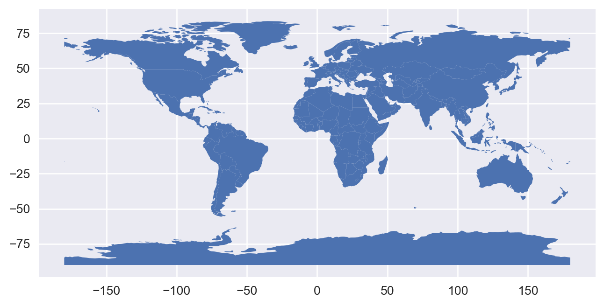{width=646 height=328}
:::
:::


En este ejemplo, cargamos un conjunto de datos geoespaciales que contiene información sobre los países del mundo. Utilizamos el método `plot()` para visualizar los datos en un mapa. Luego, utilizamos `plt.show()` para mostrar el mapa en una ventana emergente.

Además de GeoPandas, existen otras bibliotecas como Folium y Plotly que también nos permiten crear visualizaciones interactivas de datos geoespaciales. Estas bibliotecas nos brindan opciones avanzadas para personalizar los mapas, agregar capas adicionales y explorar datos de manera interactiva.

La visualización de datos geoespaciales nos ayuda a comprender mejor la distribución geográfica de los datos y revelar patrones ocultos que podrían pasar desapercibidos en otro tipo de gráficos. Explorar y visualizar datos en un contexto geoespacial agrega un nivel adicional de información y nos permite tomar decisiones basadas en la ubicación.

## Mapas de calor y mapas temáticos

Los mapas de calor y los mapas temáticos son poderosas herramientas de visualización que nos permiten representar datos geoespaciales de manera más significativa. Estos mapas nos ayudan a identificar patrones y tendencias en función de valores numéricos o categorías específicas.

Un mapa de calor utiliza colores para representar la intensidad o densidad de un fenómeno en un área geográfica. Es ideal para mostrar la concentración de datos o la variación espacial de una variable, como la temperatura, la densidad de población o el rendimiento de un producto en diferentes regiones.

Por otro lado, los mapas temáticos se utilizan para representar categorías o clases específicas en un mapa. Cada categoría se asocia con un color o un patrón único, lo que permite visualizar la distribución espacial de diferentes características o atributos, como el tipo de vegetación, la diversidad cultural o las tasas de criminalidad en diferentes áreas.

Para crear mapas de calor y mapas temáticos, podemos utilizar bibliotecas especializadas como Matplotlib, Seaborn y GeoPandas. Estas bibliotecas nos brindan una variedad de funciones y herramientas para personalizar la apariencia de nuestros mapas y resaltar la información más relevante.

Aquí tienes un ejemplo básico de cómo crear un mapa de calor utilizando Seaborn:

::: {.cell execution_count=24}
``` {.python .cell-code}
#pip install seaborn matplotlib
import seaborn as sns
import matplotlib.pyplot as plt
import numpy as np

# Cargar datos
data = np.random.rand(10, 10)

# Crear mapa de calor
sns.heatmap(data)

# Mostrar el mapa de calor
plt.show()
```

::: {.cell-output .cell-output-display}
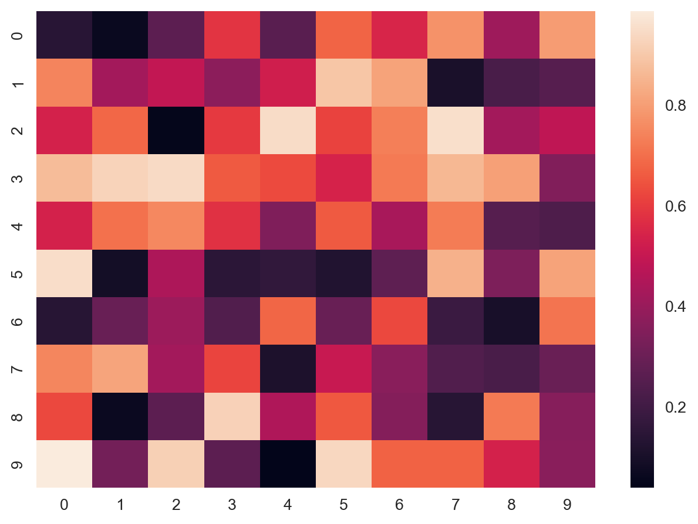{width=595 height=447}
:::
:::


En este ejemplo, cargamos nuestros datos y utilizamos la función `heatmap()` de Seaborn para crear el mapa de calor. Luego, utilizamos `plt.show()` para mostrar el mapa en una ventana emergente.

Recuerda que la elección de colores es importante en los mapas de calor y mapas temáticos. Debes seleccionar una paleta de colores que sea perceptualmente equilibrada y que permita una fácil interpretación de los datos.

Explorar datos geoespaciales a través de mapas de calor y mapas temáticos nos brinda una visión más completa y comprensible de los patrones y relaciones espaciales. Estas visualizaciones nos ayudan a tomar decisiones más informadas y a comunicar eficazmente la información a otras personas.


# Gráficos y análisis estadístico

## Boxplots y diagramas de violín

En el análisis de datos, a menudo necesitamos comprender la distribución y la variabilidad de nuestros datos. Dos tipos de gráficos útiles para visualizar esta información son los boxplots y los diagramas de violín.

Un boxplot, también conocido como diagrama de caja y bigotes, nos proporciona una representación visual de la mediana, el rango intercuartil (IQR) y los valores atípicos de un conjunto de datos. El gráfico consiste en una caja que representa el IQR, una línea que representa la mediana y dos líneas (los bigotes) que se extienden hasta los valores mínimo y máximo dentro de un rango aceptable. Los valores atípicos se muestran como puntos fuera de los bigotes.

Por otro lado, los diagramas de violín combinan un boxplot con una representación de la densidad de probabilidad de los datos. Estos gráficos muestran una forma de violín que se estrecha o ensancha según la densidad de los datos en diferentes rangos. Esto nos proporciona información adicional sobre la distribución y la concentración de los datos.

Tanto los boxplots como los diagramas de violín son útiles para comparar la distribución de diferentes grupos o categorías, identificar valores atípicos y comprender la variabilidad en nuestros datos. Estos gráficos nos ayudan a obtener una visión rápida y clara de la información estadística clave.

Para crear boxplots y diagramas de violín, podemos utilizar bibliotecas como Matplotlib y Seaborn. Estas bibliotecas nos ofrecen funciones simples y personalizables para generar estos gráficos con facilidad.

Aquí tienes un ejemplo básico de cómo crear un boxplot utilizando Matplotlib:

::: {.cell execution_count=25}
``` {.python .cell-code}
import matplotlib.pyplot as plt
import numpy as np

# Cargar datos
data = np.random.randn(100)

# Crear boxplot
plt.boxplot(data)

# Mostrar el boxplot
plt.show()
```

::: {.cell-output .cell-output-display}
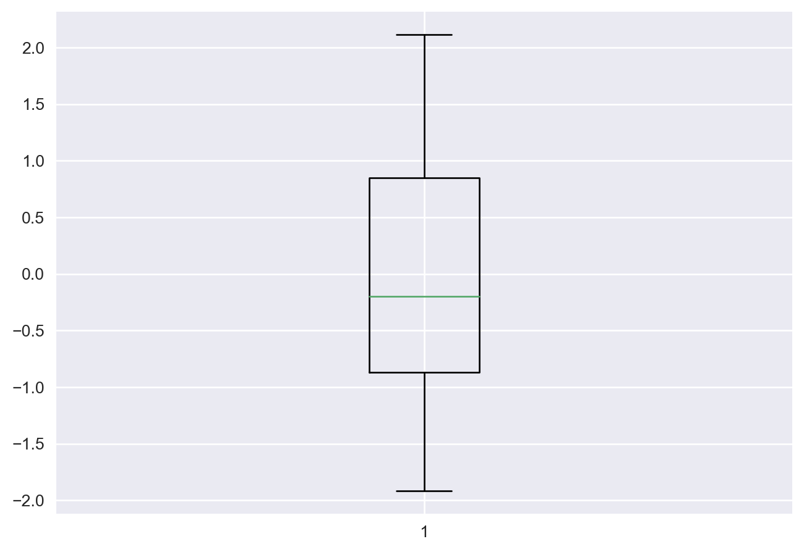{width=639 height=447}
:::
:::


En este ejemplo, cargamos nuestros datos y utilizamos la función `boxplot()` de Matplotlib para crear el gráfico. Luego, utilizamos `plt.show()` para mostrar el boxplot en una ventana emergente.


## Histogramas y distribuciones

En el análisis de datos, es crucial comprender la distribución de nuestros datos para obtener información valiosa. Una herramienta visual poderosa para explorar la distribución es el histograma.

Un histograma es un gráfico de barras que muestra la frecuencia de aparición de diferentes valores en un conjunto de datos. La variable que estamos analizando se divide en intervalos y se representa en el eje x, mientras que la frecuencia se muestra en el eje y. Cada barra representa la cantidad de valores dentro de un intervalo específico.

Al observar un histograma, podemos identificar rápidamente la forma y la simetría de la distribución de nuestros datos. Podemos detectar si los datos siguen una distribución normal, están sesgados hacia la derecha o hacia la izquierda, o si tienen múltiples picos. Esto nos proporciona información valiosa sobre la naturaleza de nuestros datos y nos ayuda a tomar decisiones informadas.

Para crear un histograma, podemos utilizar bibliotecas como Matplotlib y Seaborn. Estas bibliotecas ofrecen funciones sencillas para generar histogramas y personalizar su apariencia.

Aquí tienes un ejemplo básico de cómo crear un histograma utilizando Matplotlib:

::: {.cell execution_count=26}
``` {.python .cell-code}
import matplotlib.pyplot as plt

# Cargar datos
data = np.random.randn(100)

# Crear histograma
plt.hist(data, bins=10)  # bins representa el número de intervalos

# Mostrar el histograma
plt.show()
```

::: {.cell-output .cell-output-display}
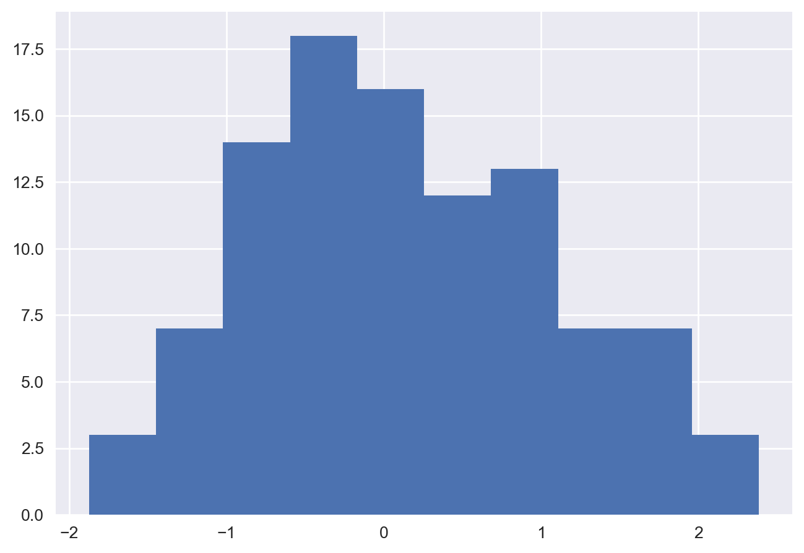{width=650 height=447}
:::
:::


En este ejemplo, cargamos nuestros datos y utilizamos la función `hist()` de Matplotlib para crear el histograma. El parámetro `bins` nos permite especificar el número de intervalos en los que queremos dividir nuestros datos.


## Gráficos de correlación

Cuando trabajamos con conjuntos de datos, a menudo queremos explorar la relación entre diferentes variables. Los gráficos de correlación nos permiten visualizar esta relación y determinar si existe una conexión significativa entre las variables.

Un gráfico de correlación muestra cómo se relacionan dos variables entre sí. Nos ayuda a identificar patrones y tendencias, así como la fuerza y dirección de la relación. El coeficiente de correlación nos proporciona una medida numérica de la relación, donde valores cercanos a 1 indican una correlación positiva, valores cercanos a -1 indican una correlación negativa, y valores cercanos a 0 indican una correlación débil o inexistente.

Una forma común de representar gráficamente la correlación es mediante un diagrama de dispersión. En este tipo de gráfico, cada punto representa una observación en el conjunto de datos, y su posición en el plano cartesiano refleja los valores de las dos variables. Si los puntos tienden a formar una línea ascendente o descendente, indica una correlación positiva o negativa, respectivamente.

Para crear un gráfico de correlación, podemos utilizar bibliotecas como Matplotlib y Seaborn. Estas bibliotecas nos ofrecen funciones sencillas para generar diagramas de dispersión y calcular los coeficientes de correlación.

Aquí tienes un ejemplo básico de cómo crear un gráfico de correlación utilizando Seaborn:

::: {.cell execution_count=27}
``` {.python .cell-code}
#pip install seaborn
#pip install matplotlib

import seaborn as sns
import matplotlib.pyplot as plt

# Cargar datos
data = pd.DataFrame({'variable1': [1, 2, 3, 4, 5],
                     'variable2': [2, 4, 6, 8, 10]})

# Crear gráfico de correlación
sns.scatterplot(x=data['variable1'], y=data['variable2'])

# Mostrar el gráfico
plt.show()
```

::: {.cell-output .cell-output-display}
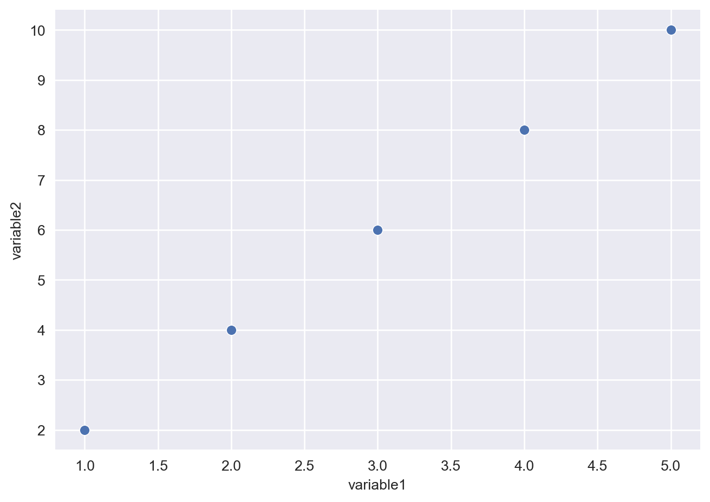{width=656 height=464}
:::
:::


En este ejemplo, cargamos nuestros datos y utilizamos la función `scatterplot()` de Seaborn para crear el gráfico de correlación. Simplemente especificamos las variables que queremos comparar en los ejes x e y.


# Mejores prácticas y consejos

Cuando se trata de crear gráficos efectivos en Python, es importante seguir algunas mejores prácticas que aseguren la organización, claridad y legibilidad de tus visualizaciones. Aquí te presentamos algunos consejos útiles:

## Organización y estructura de los gráficos

- Utiliza títulos claros y descriptivos para tus gráficos.
- Etiqueta correctamente los ejes x e y para indicar qué representan.
- Agrega leyendas y anotaciones para proporcionar información adicional sobre los elementos del gráfico.
- Considera la inclusión de una clave de color si tienes múltiples categorías o variables.

## Selección adecuada de gráficos según los datos

- Elige el tipo de gráfico adecuado para representar tus datos. Algunos ejemplos comunes incluyen gráficos de línea, barras, dispersión y pastel.
- Considera las características y propiedades de tus datos, como el tipo de variable (categórica o numérica) y la distribución, al seleccionar el gráfico más apropiado.

## Optimización de la legibilidad y claridad

- Asegúrate de que el tamaño del gráfico sea adecuado para su visualización, evitando que los elementos se superpongan o se vuelvan ilegibles.
- Utiliza colores y estilos que sean fáciles de distinguir y que resalten la información importante.
- Evita el exceso de elementos decorativos que puedan distraer la atención del mensaje principal del gráfico.

# Bibliotecas populares para gráficos en Python

Afortunadamente, Python cuenta con varias bibliotecas populares que facilitan la creación de gráficos de calidad. Aquí te presentamos algunas de las más utilizadas:

## Matplotlib

Matplotlib es una biblioteca ampliamente utilizada y flexible que proporciona una gran variedad de funciones y estilos para crear gráficos estáticos. Es una excelente opción para aquellos que desean un control detallado sobre la apariencia de sus visualizaciones.

## Seaborn

Seaborn es una biblioteca basada en Matplotlib que simplifica la creación de gráficos estéticamente agradables. Ofrece una interfaz de alto nivel y opciones predefinidas para la visualización de datos estadísticos y de análisis exploratorio.

## Plotly

Plotly es una biblioteca interactiva que permite crear gráficos interactivos y dinámicos, incluyendo gráficos en 3D, diagramas de dispersión animados y mapas interactivos. Además, ofrece opciones de visualización en la web y la posibilidad de compartir tus gráficos en línea.

## Bokeh

Bokeh es otra biblioteca de visualización interactiva que se centra en la creación de gráficos interactivos de alta calidad para la web. Ofrece una sintaxis sencilla y la posibilidad de crear gráficos interactivos con herramientas de zoom, selección y desplazamiento.


# Casos de estudio y ejemplos prácticos

La visualización de datos con Python no solo es útil en teoría, sino que también puede aplicarse en diversos casos de estudio y ejemplos prácticos. Veamos algunos ejemplos interesantes:

## Visualización de datos de ventas

Imagina que eres el gerente de ventas de una empresa y quieres analizar el rendimiento de tus productos en diferentes regiones. Utilizando gráficos de barras y gráficos de dispersión, puedes representar visualmente las ventas por región, identificar patrones de crecimiento y comparar el desempeño de productos específicos. Estos gráficos te ayudarán a tomar decisiones informadas para mejorar tus estrategias de ventas.

## Análisis de sentimientos en redes sociales

Las redes sociales son una fuente inagotable de datos. Si estás interesado en analizar el sentimiento de los usuarios hacia una marca o un evento específico, puedes utilizar técnicas de procesamiento de lenguaje natural y visualización de datos para mostrar la distribución de sentimientos en forma de gráficos de barras, gráficos de tarta o gráficos de líneas. Esto te permitirá comprender mejor la percepción de los usuarios y tomar medidas adecuadas en función de los resultados obtenidos.

## Gráficos interactivos para análisis financiero

En el ámbito financiero, es crucial comprender y analizar datos complejos de manera interactiva. Puedes utilizar bibliotecas como Plotly o Bokeh para crear gráficos interactivos que te permitan explorar datos financieros en tiempo real, aplicar filtros, realizar zoom y obtener detalles específicos sobre puntos de datos. Estos gráficos interactivos facilitan el análisis financiero y te ayudan a tomar decisiones más fundamentadas en tus inversiones.

Estos casos de estudio y ejemplos prácticos son solo algunas de las muchas aplicaciones de la visualización de datos con Python. Desde el análisis de ventas hasta el monitoreo de sentimientos en redes sociales y el análisis financiero, las posibilidades son infinitas. ¡Explora, experimenta y descubre cómo la visualización de datos puede potenciar tu análisis y comprensión de la información!

# Recursos adicionales y próximos pasos

La visualización de datos con Python es un campo amplio y emocionante, y hay muchos recursos disponibles para seguir aprendiendo y perfeccionando tus habilidades. Aquí tienes algunos recursos adicionales que te pueden ser útiles:

## Enlaces a tutoriales y documentación

- **Documentación oficial de Matplotlib**: La documentación oficial de Matplotlib es una fuente completa de información sobre la biblioteca. Puedes encontrar tutoriales, ejemplos de código y una guía detallada para aprovechar al máximo todas las funcionalidades que ofrece.

- **Documentación oficial de Seaborn**: Si estás interesado en explorar más sobre Seaborn, la documentación oficial es un recurso invaluable. Aquí encontrarás ejemplos de gráficos, descripciones de las funciones y consejos para crear visualizaciones atractivas.

- **Documentación oficial de Plotly**: Para aquellos que deseen adentrarse en la visualización de datos interactiva, Plotly ofrece una documentación detallada. Aprende cómo crear gráficos interactivos, agregar animaciones y personalizar tus visualizaciones.

## Otras fuentes de aprendizaje y comunidad

- **Cursos en línea**: Existen plataformas en línea que ofrecen cursos especializados en visualización de datos con Python. Algunos sitios populares incluyen Coursera, Udemy y DataCamp. Estos cursos te brindarán una base sólida y te guiarán a través de ejemplos prácticos.

- **Foros y comunidades**: Únete a comunidades en línea dedicadas a la visualización de datos, como el subreddit r/dataisbeautiful o los grupos de LinkedIn especializados. Estos espacios te permitirán conectarte con otros entusiastas de la visualización de datos, hacer preguntas y obtener consejos valiosos.

- **Libros y recursos impresos**: Explora libros dedicados a la visualización de datos en Python, como "Python for Data Analysis" de Wes McKinney o "Python Data Science Handbook" de Jake VanderPlas. Estos recursos ofrecen una visión más detallada y práctica de la visualización de datos.

¡Recuerda que la práctica constante es clave para mejorar tus habilidades en la visualización de datos! No dudes en experimentar con diferentes conjuntos de datos, probar nuevas técnicas y explorar las posibilidades que Python ofrece en este campo.

En este blog, hemos cubierto una amplia gama de temas relacionados con la visualización de datos en Python. Espero que hayas encontrado información útil y te sientas inspirado para explorar y crear visualizaciones impactantes. ¡No dudes en compartir tus creaciones y experiencias con la comunidad!

Si tienes alguna pregunta o necesitas más recursos, ¡no dudes en comunicarte! ¡Feliz visualización de datos!

