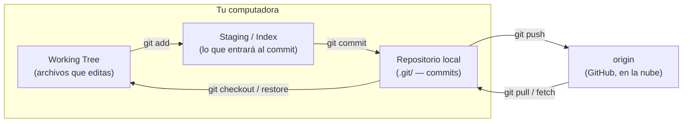
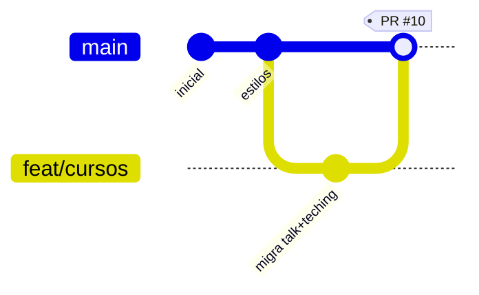
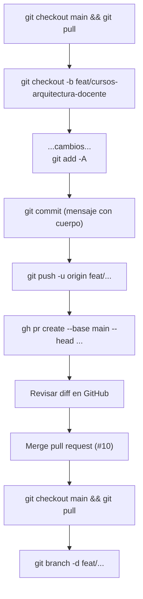
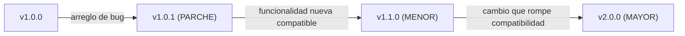

# Manual de Git y GitHub — flujo de trabajo de `website-achalma`

> Guía completa, paso a paso y con ejemplos reales, del flujo de trabajo con Git y
> GitHub usado en este proyecto. Sirve como documentación oficial del repositorio
> **y** como material educativo para aprender Git con un caso real.

**Autor:** documentación del proyecto · **Nivel:** de principiante a intermedio ·
**Idioma:** español · **Formato:** Markdown.

---

## Cómo usar esta guía

- **Un solo proyecto de ejemplo.** Todo gira alrededor de este repositorio,
  `website-achalma` (un sitio académico en Quarto desplegado en Netlify). No hay
  ejemplos sueltos: seguimos una sola historia, desde que el proyecto no tiene Git
  hasta un Pull Request mergeado y una versión publicada.
- **Cada capítulo sigue la misma plantilla** (para que las futuras guías —Quarto,
  Bash, LaTeX…— tengan el mismo estilo):

  > **🎯 Objetivo** · **💡 Concepto** · **⚙️ Qué ocurre internamente** ·
  > **⌨️ Comandos** · **📁 Ejemplo real** · **✅ Resultado esperado** ·
  > **⚠️ Errores comunes** · **⭐ Buenas prácticas** · **📌 Resumen**

- **Convenciones tipográficas:**
  - `código` = algo que escribes en la terminal o un nombre de archivo.
  - En los bloques, las líneas con `$` son lo que **tú** escribes; el resto es la salida.
  - Los bloques `mermaid` son diagramas (se ven como dibujo en GitHub/VS Code).

**Datos del repositorio (referencia rápida):**

| Dato | Valor |
|------|-------|
| Rama principal | `main` |
| Remoto | `origin` → `git@github.com:achalmed/website-achalma.git` |
| Web | <https://github.com/achalmed/website-achalma> |
| Licencia de **código** | Mozilla Public License 2.0 (`LICENSE`) |
| Licencia de **contenido** | CC BY-SA (frontmatter Quarto) |
| CLI de GitHub | `gh` (GitHub CLI) |

---

## Capítulo 0 — Modelo mental de Git

### 🎯 Objetivo
Entender **qué es** Git antes de escribir comandos. El 90% de los errores vienen
de no tener claro este mapa mental.

### 💡 Concepto
Git es una **máquina de fotos** de tu proyecto. Cada foto es un **commit**:
una instantánea completa de todos tus archivos en un momento dado, con un mensaje
que explica qué cambió. Los commits se encadenan formando la **historia**.

Trabajas en **ramas** (líneas de commits independientes) para no tocar la versión
oficial (`main`) mientras experimentas. Cuando algo está listo, lo subes a **GitHub**
(la copia en la nube) y propones integrarlo con un **Pull Request**.

### ⚙️ Qué ocurre internamente

Git guarda todo en una carpeta oculta `.git/`. Internamente hay 3 tipos de objetos:

- **blob** = el contenido de un archivo.
- **tree** = una carpeta (lista de blobs y otros trees).
- **commit** = un tree (la foto completa) + autor + fecha + mensaje + puntero al
  commit anterior (su "padre").

Cada objeto se identifica por un **hash** (ej. `21fa303…`), una huella única de su
contenido. `HEAD` es simplemente un puntero que dice "**dónde estás parado ahora**"
(normalmente, el último commit de tu rama actual).



**Las 4 zonas donde vive un cambio** (memorízalas, aparecen en toda la guía):

| Zona | Qué es | Cómo se llega |
|------|--------|---------------|
| **Working Tree** | tus archivos con cambios sin guardar | editas con tu editor |
| **Staging (Index)** | lo que elegiste para el próximo commit | `git add` |
| **Repositorio local** | las fotos guardadas en tu PC | `git commit` |
| **Remoto (`origin`)** | la copia en GitHub | `git push` |

**Glosario mínimo de este capítulo** (se detallan más adelante):

| Término | En una frase |
|---------|--------------|
| **snapshot** | la foto completa que es cada commit |
| **HEAD** | "dónde estoy parado" (último commit de la rama actual) |
| **branch (rama)** | una línea de commits independiente |
| **origin / remote** | el repositorio remoto (GitHub) |
| **tracking branch** | rama local "emparejada" con una rama remota |
| **merge** | unir el trabajo de dos ramas |
| **fast-forward** | merge sin bifurcación: solo adelantar el puntero |
| **merge commit** | merge con bifurcación: crea un commit que une dos historias |
| **squash** | aplastar varios commits en uno solo |
| **rebase** | reescribir la historia moviendo commits sobre otra base |
| **Pull Request (PR)** | propuesta de fusionar una rama en `main`, con revisión |
| **Issue** | nota/tarea/bug en GitHub (sin código) |
| **tag** | etiqueta fija sobre un commit (ej. `v1.0.0`) |
| **release** | publicación de una versión en GitHub, basada en un tag |

### ⭐ Buenas prácticas
- Piensa en commits como "puntos de guardado" de un videojuego: guarda seguido y
  con mensajes claros.
- Nunca trabajes directo en `main`; `main` es "la versión que funciona".

### 📌 Resumen
Git = fotos (commits) encadenadas; trabajas en ramas y las subes a GitHub. Cuatro
zonas: working tree → staging → repo local → remoto.

---

## Capítulo 1 — Nace el repositorio: `git init`

### 🎯 Objetivo
Convertir una carpeta normal en un repositorio Git.

### 💡 Concepto
`git init` crea la carpeta oculta `.git/`, que es **todo** el repositorio (la
historia, la configuración, las ramas). Si borras `.git/`, vuelve a ser una
carpeta normal; si la copias, te llevas toda la historia.

### ⚙️ Qué ocurre internamente
Se crea `.git/` con, entre otros:

```
.git/
├── HEAD            # apunta a la rama actual (ref: refs/heads/main)
├── config          # configuración del repo (remotos, usuario…)
├── objects/        # aquí viven los commits, trees y blobs (comprimidos)
├── refs/heads/     # tus ramas locales (cada archivo = un puntero a un commit)
└── refs/remotes/   # las ramas del remoto que conoces
```

### ⌨️ Comandos

```bash
mkdir website-achalma          # crear la carpeta del proyecto
cd website-achalma             # entrar en ella
git init                       # inicializar Git (crea .git/)
git config user.name  "achalmed"                 # quién hace los commits
git config user.email "achalmed.18@gmail.com"
git branch -m main             # asegurar que la rama principal se llame "main"
```

### 📁 Ejemplo real
Este proyecto ya está inicializado. Puedes inspeccionar su estado interno:

```bash
$ git rev-parse --is-inside-work-tree     # ¿estoy dentro de un repo?
true
$ ls .git/                                 # ver las tripas del repo
HEAD  config  objects  refs  ...
$ git config --get remote.origin.url       # a qué GitHub apunta
git@github.com:achalmed/website-achalma.git
```

### ✅ Resultado esperado
`git status` responde (en vez de "not a git repository"):

```
On branch main
nothing to commit, working tree clean
```

### ⚠️ Errores comunes
- **"fatal: not a git repository"** → no estás dentro de la carpeta con `.git/`.
  Solución: `cd` a la carpeta correcta, o `git init` si de verdad es nueva.
- **Hacer `git init` dentro de otro repo** (repos anidados) → confusión. Verifica
  con `git rev-parse --show-toplevel` cuál es la raíz.

### ⭐ Buenas prácticas
- Configura `user.name`/`user.email` **antes** del primer commit (si no, los
  commits quedan con autor equivocado).
- Un repositorio = un proyecto con sentido propio.

### 📌 Resumen
`git init` crea `.git/` y con eso la carpeta ya es un repositorio con historia.

---

## Capítulo 2 — Estructura profesional del repositorio

### 🎯 Objetivo
Saber qué archivos "de gobernanza" tiene un repo serio, para qué sirven, y cuáles
tiene (o le faltan) a este proyecto.

### 💡 Concepto
Además del código/contenido, un repositorio público profesional incluye archivos
que explican **cómo usarlo, contribuir, licenciarlo y reportar problemas**.

### 📁 Ejemplo real — lo que tiene y le falta a `website-achalma`

| Archivo | Para qué sirve | ¿En este repo? |
|---------|----------------|----------------|
| `README.md` | Portada: qué es, cómo instalar/usar. Lo primero que se lee. | ❌ **falta** (candidato a crear) |
| `LICENSE` | Términos legales de uso del **código**. | ✅ MPL-2.0 |
| `.gitignore` | Lista de archivos que Git debe **ignorar** (no versionar). | ✅ |
| `.editorconfig` | Reglas de formato (indentación, saltos de línea) entre editores. | ❌ falta |
| `.gitattributes` | Cómo trata Git ciertos archivos (fin de línea, binarios, `linguist`). | ❌ falta |
| `CONTRIBUTING.md` | Cómo contribuir (estilo de commits, ramas, PRs). | ❌ falta |
| `CODE_OF_CONDUCT.md` | Normas de convivencia de la comunidad. | ✅ |
| `SECURITY.md` | Cómo reportar vulnerabilidades. | ✅ |
| `CHANGELOG.md` | Historial legible de cambios por versión. | ❌ falta |
| `CITATION.cff` | Cómo citar el proyecto académicamente. | ✅ |
| `.github/ISSUE_TEMPLATE/` | Plantillas para reportar bugs/pedir features. | ✅ (`bug_report.md`) |
| `.github/PULL_REQUEST_TEMPLATE.md` | Plantilla que rellena cada PR. | ❌ falta |
| `.github/workflows/` | Automatizaciones (CI/CD con GitHub Actions). | ❌ falta |
| `.github/FUNDING.yml` | Botón "Sponsor". | ✅ |
| `docs/` | Documentación extendida (¡esta guía vive aquí!). | ✅ |

### ⚙️ Qué ocurre internamente — el `.gitignore`
`.gitignore` **no** borra archivos; solo le dice a Git "no los rastrees". En este
repo ignora, por ejemplo, artefactos LaTeX (`*.aux`, `*.log`, `*.nav`, `*.snm`),
la caché de Quarto y el sitio compilado (`_site/`). Ejemplo de líneas:

```gitignore
# Beamer (diapositivas)
*.nav
*.snm
*.vrb
# Build tools
*.fdb_latexmk
*.synctex.gz
```

> ⚠️ Si un archivo **ya está rastreado**, agregarlo al `.gitignore` no lo saca.
> Hay que `git rm --cached <archivo>` primero (así pasó aquí con los artefactos
> LaTeX que se habían commiteado antes de existir la regla).

### ⭐ Buenas prácticas
- Crea el `README.md` **temprano** (aquí falta: sería la primera mejora).
- Un `.gitignore` desde el inicio evita commitear basura (builds, cachés, PDFs).
- Añade plantillas de Issue/PR cuando el repo reciba colaboradores.

### 📌 Resumen
Un repo profesional se reconoce por su README, LICENSE, `.gitignore` y archivos
de comunidad. Este repo tiene varios, pero **le falta un README**.

---

## Capítulo 3 — Licencias: elegir bien

### 🎯 Objetivo
Entender las licencias más comunes y por qué este proyecto usa **dos**.

### 💡 Concepto
La licencia dice **qué puede hacer otra persona** con tu trabajo. Sin licencia,
por defecto **nadie** puede reutilizarlo legalmente. Hay dos familias:

- **Licencias de software** (para código).
- **Licencias Creative Commons** (para contenido: texto, imágenes, cursos).

### 📁 Comparativa (software)

| Licencia | Filosofía | ¿Obliga a liberar tus cambios? | Uso típico |
|----------|-----------|-------------------------------|------------|
| **MIT** | Permisiva, mínima | No | Máxima adopción, librerías |
| **Apache 2.0** | Permisiva + patentes | No | Empresas (protección de patentes) |
| **BSD** | Permisiva | No | Similar a MIT |
| **MPL-2.0** | Copyleft **débil** (por archivo) | Sí, solo los **archivos MPL** modificados | Equilibrio (**este repo**) |
| **GPL-3.0** | Copyleft **fuerte** | Sí, **todo** el proyecto derivado | Software libre estricto |

### 📁 Comparativa (contenido — Creative Commons)

| Licencia | Permite | Condición |
|----------|---------|-----------|
| **CC BY** | Usar y adaptar, incluso comercial | Dar crédito |
| **CC BY-SA** | Igual que BY | Crédito **+ compartir igual** (misma licencia) |
| **CC BY-NC** | Usar y adaptar | Crédito + **no comercial** |
| **CC0** | Todo (dominio público) | Nada |

### 📁 Ejemplo real — la doble licencia de este proyecto
- **Código** (los `.scss`, `.lua`, `.sh`, `.qmd` como plantillas) → **MPL-2.0**
  (archivo `LICENSE`): copyleft débil, obliga a compartir solo los archivos MPL
  modificados, no todo tu proyecto.
- **Contenido académico** (posts, cursos, PDFs) → **CC BY-SA** (declarado en el
  frontmatter Quarto, `license: "CC BY-SA"`): cualquiera puede reutilizar los
  materiales educativos citándote y manteniendo la misma licencia.

### ⭐ Buenas prácticas
- **Código** → MIT/Apache/MPL según cuánto "copyleft" quieras.
- **Material educativo** → CC BY o CC BY-SA (fomenta la reutilización con crédito).
- Declara la licencia de contenido en cada página (aquí, en `_metadata.yml`).

### 📌 Resumen
Este repo separa licencias: **MPL-2.0** para el código y **CC BY-SA** para el
contenido educativo. Sin licencia, no hay permiso de reutilización.

---

## Capítulo 4 — El primer commit (y las herramientas de inspección)

### 🎯 Objetivo
Guardar la primera foto y aprender los comandos que usarás **todos los días**.

### 💡 Concepto
Un commit se hace en **dos tiempos**: primero eliges qué entra (`git add`, va al
staging), luego lo guardas (`git commit`). Esta separación te deja armar commits
limpios (solo lo relacionado con un cambio).

### ⌨️ Comandos (el kit diario)

```bash
git status                 # ¿qué cambió y en qué zona/rama estoy?  ← el más usado
git add README.md          # mandar UN archivo al staging
git add -A                 # mandar TODO (nuevos, modificados, borrados)
git commit -m "docs: add project README"   # guardar la foto con mensaje
git log --oneline -10      # ver las últimas 10 fotos (resumidas)
git diff                   # ver cambios que aún NO están en staging
git diff --staged          # ver cambios que YA están en staging (irán al commit)
git show <hash>            # ver el detalle de un commit concreto
git restore <archivo>      # descartar cambios no guardados de un archivo
git restore --staged <a>   # sacar un archivo del staging (sin perder el cambio)
git reset --soft HEAD~1    # deshacer el último commit, CONSERVANDO los cambios
git reflog                 # bitácora de TODO lo que hizo HEAD (tu red de seguridad)
```

### ⚙️ Qué ocurre internamente
`git commit` crea un objeto commit que apunta al tree (la foto) y al commit padre,
y **mueve `HEAD`** (y la rama) a ese nuevo commit. `git reflog` registra cada
movimiento de `HEAD`: por eso casi nada se pierde de verdad (puedes volver a un
commit "borrado" mientras `reflog` lo recuerde, ~90 días).

### 📁 Ejemplo real
El primer commit de este repositorio fue:

```bash
$ git log --oneline --reverse | head -1
d14806e docs: complete website documentation overhaul with APA templates
$ git rev-list --count HEAD      # cuántos commits hay hoy
17
```

### ✅ Resultado esperado
Tras un commit, `git status` dice `nothing to commit, working tree clean` y
`git log` muestra tu commit arriba del todo.

### ⚠️ Errores comunes (y cómo salir)
- **"Hice cambios pero `git commit` dice 'nothing to commit'"** → olvidaste el
  `git add`. Los cambios están en el working tree, no en staging.
- **"Agregué un archivo de más al commit"** (antes de commitear) →
  `git restore --staged <archivo>`.
- **"Me equivoqué en el mensaje del último commit"** (y aún **no** hiciste push) →
  `git commit --amend -m "mensaje corregido"`.
- **"Deshice un commit y creo que perdí el trabajo"** → `git reflog`, busca el
  hash y `git checkout <hash>` o `git reset --soft <hash>`.

### ⭐ Buenas prácticas
- Corre `git status` y `git diff` **antes** de cada `git add` para no meter basura.
- Un commit = una idea. No mezcles "arreglé un bug" con "cambié colores".

### 📌 Resumen
`add` (elige) → `commit` (guarda). `status`/`diff`/`log` para ver; `restore`/
`reset`/`reflog` para deshacer sin drama.

---

## Capítulo 5 — Ramas (branches)

### 🎯 Objetivo
Aislar cada cambio en su propia línea de trabajo.

### 💡 Concepto
Una **rama** es un puntero móvil a un commit. Crear una rama es baratísimo (solo
un puntero). Trabajas en la rama, y `main` queda intacta hasta que decides unir.



### ⌨️ Comandos

```bash
git branch                       # listar ramas (la actual con *)
git branch --show-current        # solo el nombre de la rama actual
git checkout -b feat/mi-cambio   # crear una rama Y cambiarme a ella
git switch feat/mi-cambio        # alternativa moderna para cambiar de rama
git checkout main                # volver a main
git branch -d feat/mi-cambio     # borrar una rama ya fusionada (segura)
```

### 📁 Ejemplo real — convención de nombres de este proyecto
Formato: **`<tipo>/<nombre-corto-con-guiones>`**, en minúsculas.

| Prefijo | Cuándo | Ejemplo real / posible |
|---------|--------|------------------------|
| `feat/` | funcionalidad nueva | `feat/cursos-arquitectura-docente` (PR #10) |
| `fix/` | corregir un error | `fix/pdf-render-latex` |
| `docs/` | solo documentación | `docs/add-claude-md` (PR #8) |
| `refactor/` | reorganizar sin cambiar comportamiento | `refactor/scss-modular` |
| `style/` | formato/estética (sin lógica) | `style/navbar-spacing` |
| `test/` | pruebas | `test/listing-render` |
| `build/` | compilación/estilos generados | `build/page-css` |
| `chore/` | mantenimiento (deps, `.gitignore`) | `chore/limpiar-artefactos` |
| `hotfix/` | arreglo urgente en producción | `hotfix/enlace-roto` |
| `release/` | preparar una versión | `release/v1.0.0` |

### ⚠️ Errores comunes (y cómo salir)
- **"Empecé a editar en `main` sin querer"** → aún puedes moverlo a una rama:
  ```bash
  git stash                        # guarda tus cambios aparte
  git checkout -b feat/mi-cambio   # crea la rama correcta
  git stash pop                    # recupera los cambios en la rama nueva
  ```
- **"No me deja borrar la rama"** (`-d` falla) → aún no está fusionada; usa `-D`
  (mayúscula) solo si estás seguro de descartarla.

### ⭐ Buenas prácticas
- Una rama por tarea. Ramas cortas y con nombre descriptivo.
- Parte siempre de `main` actualizado (`git checkout main && git pull`).

### 📌 Resumen
Las ramas aíslan el trabajo; nómbralas `tipo/descripcion` y mantenlas cortas.

---

## Capítulo 6 — Trabajo diario: modificar, mover, borrar, comparar

### 🎯 Objetivo
Dominar las operaciones cotidianas dentro de una rama.

### ⌨️ Comandos

```bash
# ver diferencias
git diff                       # working tree vs. último commit
git diff main..feat/x          # diferencias entre dos ramas
git diff HEAD~1 HEAD           # entre el commit anterior y el actual

# mover y borrar dejando que Git lo registre
git mv viejo.qmd nuevo.qmd     # renombrar/mover (Git conserva la historia)
git rm archivo.pdf             # borrar y registrar el borrado
git rm --cached archivo.pdf    # dejar de rastrear PERO conservar el archivo local
```

### ⚙️ Qué ocurre internamente — `git mv` vs `mv`
`git mv a b` = `mv a b` + `git add`. Git detecta renombres comparando contenido,
así que **conserva la historia** del archivo (puedes seguir su evolución con
`git log --follow nuevo.qmd`).

### 📁 Ejemplo real
En este mismo capítulo renombramos la guía preservando su historial:

```bash
$ git mv docs/guia-flujo-pr.md docs/git-github-workflow.md
```

Y en el PR #10 se movieron carpetas enteras conservando su historia, p. ej.
`talk/…` → `cursos/metodologia-de-la-investigacion/2025-1-cau-unsch/…`.

### ⚙️ Conflictos sencillos (cuando dos ramas tocan la misma línea)
Al fusionar, si dos ramas cambiaron **la misma línea**, Git no adivina y marca el
archivo así:

```
<<<<<<< HEAD
línea como está en main
=======
línea como está en tu rama
>>>>>>> feat/mi-cambio
```

Se resuelve **a mano**: editas dejando la versión correcta, borras las marcas
`<<<`, `===`, `>>>`, y luego:

```bash
git add archivo-en-conflicto.qmd     # marcar como resuelto
git commit                           # cerrar el merge
```

### ⚠️ Errores comunes
- **"`git rm` me borró el archivo y lo quería conservar"** → usa `git rm --cached`
  (deja de rastrearlo pero no lo borra del disco).
- **"Perdí un archivo con `git restore`"** → si estaba en un commit,
  `git checkout <hash> -- ruta/archivo` lo recupera.

### ⭐ Buenas prácticas
- Prefiere `git mv`/`git rm` a mover/borrar "a mano": mantienen la historia limpia.
- Antes de fusionar ramas viejas, actualízalas con `main` para minimizar conflictos.

### 📌 Resumen
`git mv`/`git rm` registran movimientos y borrados; `git diff` compara todo con
todo; los conflictos se resuelven editando y volviendo a `add`.

---

## Capítulo 7 — Conectar con GitHub: remoto y `push`

### 🎯 Objetivo
Subir tu rama local a la nube (GitHub).

### 💡 Concepto
Un **remoto** es una copia del repo en otro lugar. El remoto por defecto se llama
**`origin`** (tu repo en GitHub). Una **tracking branch** es una rama local
"emparejada" con una remota: así `git push`/`git pull` saben con quién hablar.

### ⚙️ Qué ocurre internamente
`git push` envía tus commits locales que faltan en el remoto y adelanta el puntero
de la rama remota. `-u` (o `--set-upstream`) **crea el emparejamiento** la primera
vez; después, `git push` y `git pull` a secas ya funcionan.

### ⌨️ Comandos

```bash
git remote -v                                  # ver los remotos configurados
git push -u origin feat/mi-cambio              # PRIMERA vez: sube y empareja
git push                                        # siguientes veces (lo que llamas "gp")
git pull                                        # traer e integrar cambios del remoto
git fetch                                       # solo traer (sin integrar todavía)
```

### 📁 Ejemplo real
En el PR #10:

```bash
$ git push -u origin feat/cursos-arquitectura-docente
 * [new branch]  feat/cursos-arquitectura-docente -> feat/cursos-arquitectura-docente
branch '...' set up to track 'origin/...'.
```

### ⚠️ Errores comunes
- **"fatal: The current branch has no upstream branch"** → es la primera vez;
  ejecuta el `git push -u origin <rama>` que el propio Git te sugiere.
- **"Updates were rejected (non-fast-forward)"** → el remoto tiene commits que tú
  no. Solución: `git pull` (integra), resuelve conflictos si los hay, y vuelve a
  `git push`. **Nunca** uses `git push --force` en una rama compartida.

### ⭐ Buenas prácticas
- `git pull` antes de empezar y antes de `push`.
- `git fetch` + `git log origin/main` si quieres **ver** qué hay en el remoto sin
  mezclarlo aún.

### 📌 Resumen
`origin` = GitHub. `push -u` la primera vez (empareja); luego `push`/`pull` a
secas. Si te rechazan el push, `pull` primero.

---

## Capítulo 8 — GitHub desde la terminal: `gh` (GitHub CLI)

### 🎯 Objetivo
Hacer PRs, Issues y Releases **sin salir de la terminal**.

### 💡 Concepto
`gh` es la CLI oficial de GitHub. Lo que harías clickeando en la web, lo haces con
comandos (más rápido y reproducible).

### ⌨️ Comandos (mapa general)

```bash
gh auth login              # autenticarte (una vez por máquina)
gh auth status             # ver si estás autenticado
gh repo view --web         # abrir el repo en el navegador
gh pr    ...               # Pull Requests (Capítulo 9)
gh issue ...               # Issues (abajo)
gh release ...             # versiones publicadas (Capítulo 10)
gh workflow list           # GitHub Actions (si el repo tuviera automatizaciones)
gh browse                  # abrir en el navegador el archivo/línea actual
```

### 📁 Ejemplo real — Issues (tareas/bugs en GitHub)
Un **Issue** es una nota de "hay que hacer/arreglar X". No toca código.

```bash
gh issue create --title "Crear README.md del proyecto" \
  --body "El repo no tiene README (ver guía Cap. 2). Añadir portada con qué es,
requisitos (Quarto/R/Python) y comandos de render."
gh issue list                 # ver los abiertos
gh issue view 3 --web         # abrir el #3 en el navegador
gh issue close 3              # cerrarlo
```

> 🔗 **Truco:** si un PR incluye `Closes #3` en su descripción, al mergear el PR
> se **cierra solo** el Issue #3. Flujo típico:
> `Issue "falta X"` → rama `fix/x` → PR con `Closes #3` → merge → Issue cerrado.

### ⚠️ Errores comunes
- **"gh: command not found"** → instala: `sudo apt install gh` (Ubuntu).
- **"HTTP 401 / not logged in"** → `gh auth login` y sigue los pasos.

### ⭐ Buenas prácticas
- Usa Issues para no olvidar tareas (en vez de tenerlas solo en la cabeza).
- Enlaza Issues y PRs con `Closes #n` para cerrar el círculo automáticamente.

### 📌 Resumen
`gh` lleva GitHub a la terminal: `gh pr`, `gh issue`, `gh release`. Enlaza Issues
con PRs usando `Closes #n`.

---

## Capítulo 9 — Pull Requests: el flujo completo

### 🎯 Objetivo
Proponer, revisar e integrar cambios en `main` de forma ordenada. **Este es el
corazón del flujo del proyecto.**

### 💡 Concepto
Un **Pull Request** es una propuesta: "quiero fusionar mi rama en `main`". Permite
**revisar** el diff, comentar y decidir cómo integrar, antes de tocar `main`.

### ⚙️ Formas de integrar (merge) — comparación

| Estrategia | Qué hace | Cuándo usarla |
|------------|----------|---------------|
| **Merge commit** | conserva todos los commits + un commit de fusión | historia detallada (lo usado en PR #10) |
| **Squash** | aplasta todos los commits de la rama en **uno** | ramas con muchos commits "wip" |
| **Rebase** | pega los commits sin commit de fusión | historia lineal, sin "merges" |
| **Fast-forward** | si `main` no avanzó, solo mueve el puntero | ramas simples sin bifurcación |

### 📁 Ejemplo real — el ciclo de vida del PR #10 (de principio a fin)



Los comandos exactos que se usaron:

```bash
# 1) rama
git checkout -b feat/cursos-arquitectura-docente

# 2) commit con título + cuerpo (forma cómoda, sin pelear con comillas)
git add -A
git commit -F - <<'MSG'
feat(cursos): repositorio docente OCW que unifica talk/ y teching/

- 31 cursos en 6 áreas; migración con git mv + aliases (preserva URLs).
- Estructura estándar de sesión (slides/practice/homework/evaluation/resources).
- Metodología: ediciones 2025-1-cau-unsch y 2026-1-cau-unsch.

Co-Authored-By: Claude Opus 4.8 <noreply@anthropic.com>
MSG

# 3) subir la rama
git push -u origin feat/cursos-arquitectura-docente

# 4) abrir el PR (cuerpo largo con here-doc)
gh pr create --base main --head feat/cursos-arquitectura-docente \
  --title "feat(cursos): repositorio docente OCW que unifica talk/ y teching/" \
  --body "$(cat <<'MD'
## Resumen
Reemplaza talk/ y teching/ por cursos/ (curso → edición → sesión), estilo OCW.

## Cambios principales
- 31 cursos en 6 áreas; migración con git mv + aliases (preserva /teching y /talk).
- Estructura estándar de sesión; Metodología con ediciones 2025-1 y 2026-1-cau-unsch.

## Verificación
`quarto render cursos --to html` sin errores; 31 cursos y 6 facetas.
MD
)"
# → https://github.com/achalmed/website-achalma/pull/10
```

### ⚙️ Anatomía de un buen cuerpo de PR
Usa siempre las mismas secciones (plantilla del proyecto):
`## Resumen` → `## Cambios principales` → `## Verificación` → `## Pendiente`.

### ⌨️ Comandos de PR

```bash
gh pr create --base main --head <rama> --title "..." --body "..."
gh pr list                     # PRs abiertos
gh pr view 10 --web            # abrir el #10 en el navegador
gh pr checks                   # estado de los checks (Netlify/CI)
gh pr merge 10 --merge         # integrar (o --squash / --rebase)
gh pr merge 10 --squash --delete-branch   # squash + borrar la rama
```

### ✅ Resultado esperado
En `git log` de `main` aparece el merge, p. ej.:

```
cf27fce Merge pull request #10 from achalmed/feat/cursos-arquitectura-docente
21fa303 feat(cursos): repositorio docente OCW que unifica talk/ y teching/
```

### ⚠️ Errores comunes (y cómo salir)
- **"Olvidé crear la rama e hice commit en `main`"** → mueve ese commit a una rama:
  ```bash
  git branch feat/mi-cambio     # crea una rama que apunta al commit actual
  git reset --hard origin/main  # regresa main a como estaba en el remoto (⚠️ descarta local no subido)
  git checkout feat/mi-cambio   # sigue trabajando en la rama
  ```
  (Hazlo solo si ese commit **no** se ha subido a `main` en el remoto.)
- **"Quiero deshacer un merge ya hecho"** (local, sin push) →
  `git reset --hard HEAD~1`. Si ya se subió, mejor `git revert -m 1 <hash-merge>`
  (crea un commit que revierte, sin reescribir historia compartida).
- **"El PR no me deja mergear"** → suele ser un check en rojo o conflictos; revisa
  `gh pr checks` y resuelve conflictos en la rama (`git pull origin main`).

### ⭐ Buenas prácticas
- PRs **pequeños y enfocados**: más fáciles de revisar (el PR #10 fue grande por
  ser una migración; la norma es que sean chicos).
- Título de PR = estilo de commit (`tipo(ámbito): …`).
- Describe **cómo verificaste** que funciona (aquí: `quarto render`).
- Borra la rama tras el merge (local y remota) para no acumular basura.

### 📌 Resumen
Rama → commits → push → `gh pr create` → revisar → merge → volver a `main`. El
PR #10 es el ejemplo completo de referencia.

---

## Capítulo 10 — Versiones: Tags y Releases

### 🎯 Objetivo
Marcar versiones estables del proyecto y publicarlas.

### 💡 Concepto
Un **tag** es una etiqueta fija sobre un commit (no se mueve, a diferencia de una
rama). Un **release** de GitHub es una publicación basada en un tag, con notas de
versión (y opcionalmente archivos adjuntos). Se nombran con **SemVer**
(`vMAYOR.MENOR.PARCHE`):



| Parte | Sube cuando… | Ejemplo |
|-------|--------------|---------|
| **MAYOR** | rompes compatibilidad | `v1.4.2` → `v2.0.0` |
| **MENOR** | agregas algo compatible | `v1.4.2` → `v1.5.0` |
| **PARCHE** | corriges un bug | `v1.4.2` → `v1.4.3` |

### ⌨️ Comandos

```bash
git tag -a v1.0.0 -m "Primera versión estable: sección cursos/ (OCW)"
git push origin v1.0.0                       # subir el tag a GitHub
gh release create v1.0.0 --title "v1.0.0 — Repositorio docente OCW" \
  --notes "Unifica talk/ y teching/ en cursos/. Ver PR #10."
gh release list                               # ver releases publicados
```

### 📁 Ejemplo real (propuesto para este repo)
Tras mergear el PR #10, un buen momento para etiquetar `v1.0.0` (la primera
versión con la arquitectura de cursos completa).

### ⚠️ Errores comunes
- **"Etiqueté el commit equivocado"** → borra y recrea:
  `git tag -d v1.0.0 && git push origin :refs/tags/v1.0.0`, luego vuelve a crearlo.
- **Confundir tag con rama** → el tag **no** avanza; es un marcador histórico fijo.

### ⭐ Buenas prácticas
- Usa **SemVer** y escribe notas de versión legibles (idealmente desde un
  `CHANGELOG.md`).
- Etiqueta solo commits de `main` ya probados.

### 📌 Resumen
Tag = marcador fijo de versión (SemVer); release = publicación en GitHub basada en
un tag.

---

## Chuleta copiar-pegar (el 95% de las veces)

```bash
# 1. Partir limpio y actualizado
git checkout main && git pull

# 2. Rama nueva
git checkout -b feat/mi-cambio            # tipo/descripcion

# 3. ...editar archivos...

# 4. Revisar y guardar
git status
git diff
git add -A
git commit -m "feat(ambito): qué cambió y por qué"

# 5. Subir y abrir PR
git push -u origin feat/mi-cambio
gh pr create --base main --head feat/mi-cambio \
  --title "feat(ambito): título corto" \
  --body "Qué cambió, por qué, y cómo lo verifiqué."

# 6. Revisar, mergear y limpiar
gh pr merge --squash --delete-branch
git checkout main && git pull
git branch -d feat/mi-cambio
```

## Tabla de rescate rápido (cuando algo sale mal)

| Situación | Solución |
|-----------|----------|
| Edité en `main` sin querer | `git stash` → `git checkout -b feat/x` → `git stash pop` |
| Hice commit en `main` (sin push) | `git branch feat/x` → `git reset --hard origin/main` → `git checkout feat/x` |
| Mensaje del último commit mal (sin push) | `git commit --amend -m "nuevo mensaje"` |
| Metí un archivo de más al staging | `git restore --staged <archivo>` |
| Quiero descartar cambios de un archivo | `git restore <archivo>` (⚠️ pierde lo no guardado) |
| Deshacer el último commit, conservar cambios | `git reset --soft HEAD~1` |
| Recuperar un commit "perdido" | `git reflog` → `git checkout <hash>` |
| Recuperar un archivo borrado (estaba en un commit) | `git checkout <hash> -- ruta/archivo` |
| Push rechazado (non-fast-forward) | `git pull` → resolver → `git push` |
| Deshacer un merge ya subido | `git revert -m 1 <hash-del-merge>` |

---

## Glosario

- **repositorio**: proyecto versionado (la carpeta con `.git/`).
- **commit**: foto guardada de los archivos, con mensaje e historia.
- **snapshot**: sinónimo de la foto que es cada commit.
- **working tree**: tus archivos con cambios sin guardar.
- **staging / index**: la sala de espera de lo que entrará al próximo commit.
- **HEAD**: puntero a "dónde estás parado ahora".
- **branch (rama)**: línea de commits independiente (un puntero móvil).
- **origin / remote**: el repositorio remoto (aquí, GitHub).
- **tracking branch (upstream)**: rama local emparejada con una remota.
- **push / pull / fetch**: subir / bajar+integrar / solo bajar.
- **merge**: unir dos ramas. **fast-forward**: sin bifurcación. **merge commit**:
  con commit de unión. **squash**: aplastar en uno. **rebase**: reescribir sobre
  otra base.
- **Pull Request (PR)**: propuesta de fusión con revisión.
- **Issue**: nota/tarea/bug en GitHub (sin código).
- **tag**: etiqueta fija sobre un commit. **release**: publicación basada en un tag.
- **SemVer**: `vMAYOR.MENOR.PARCHE`.
- **`gh`**: CLI de GitHub.

---

## Apéndice — Familia de guías (mismo estilo editorial)

Esta guía es la primera de una serie con la **misma plantilla** (Objetivo →
Concepto → Interno → Comandos → Ejemplo real → Resultado → Errores → Buenas
prácticas → Resumen). Próximas guías planeadas con este formato: **Quarto,
Linux, Bash, GitHub Actions, YAML, Obsidian, LaTeX, Python, R, Docker, Dev
Containers, Claude Code.**

> Convención de archivos: `docs/<tema>-workflow.md` (p. ej. `docs/quarto-workflow.md`).
