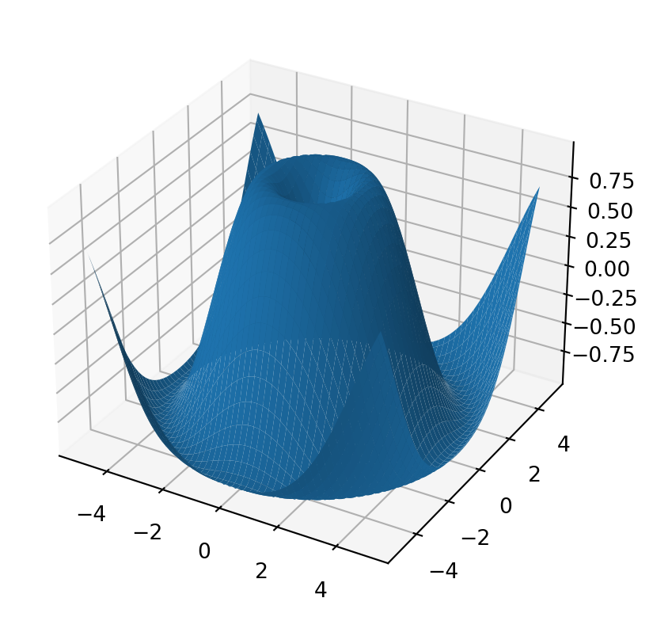
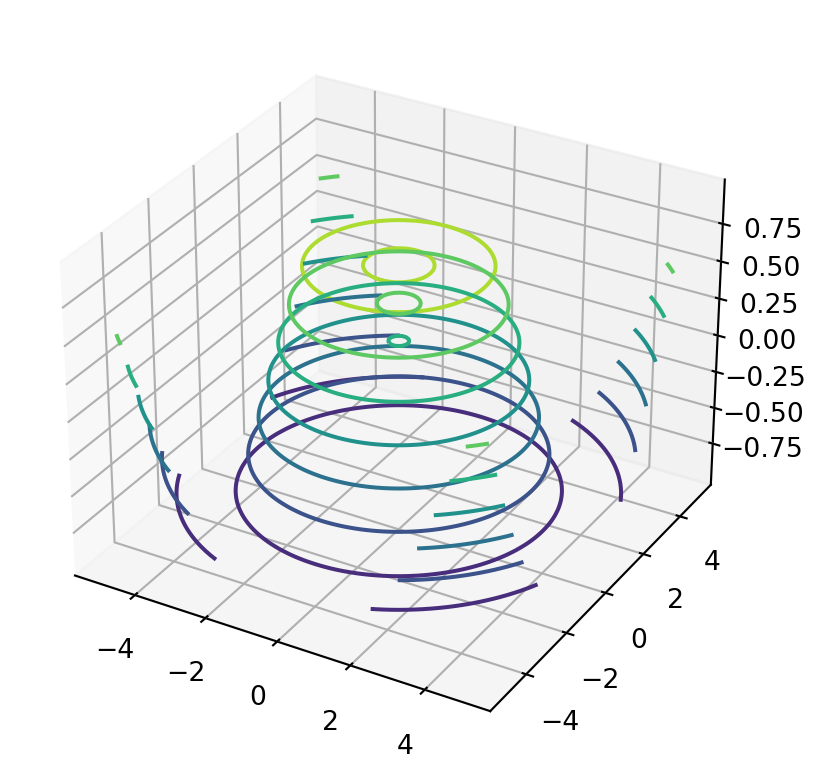
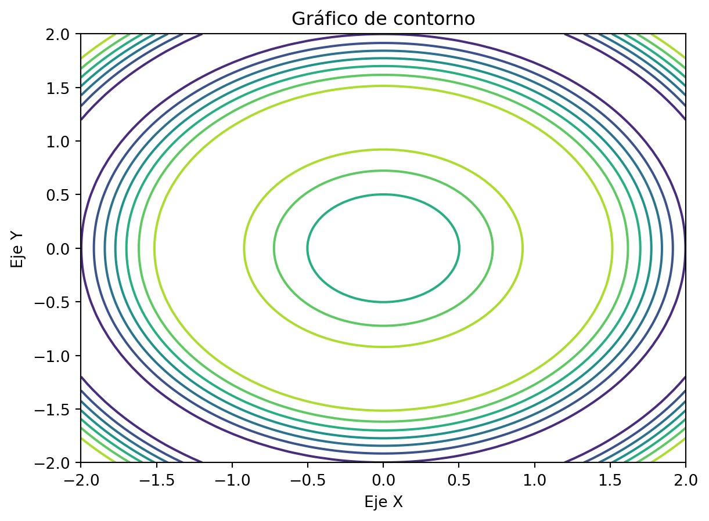
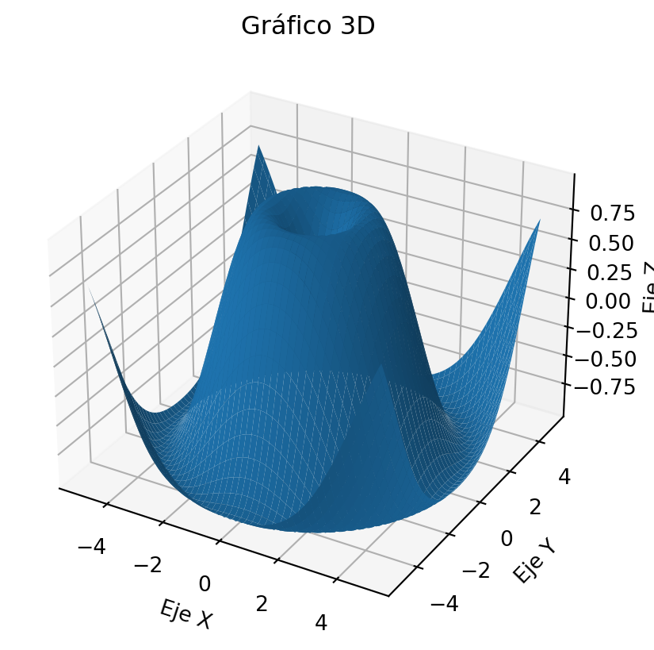
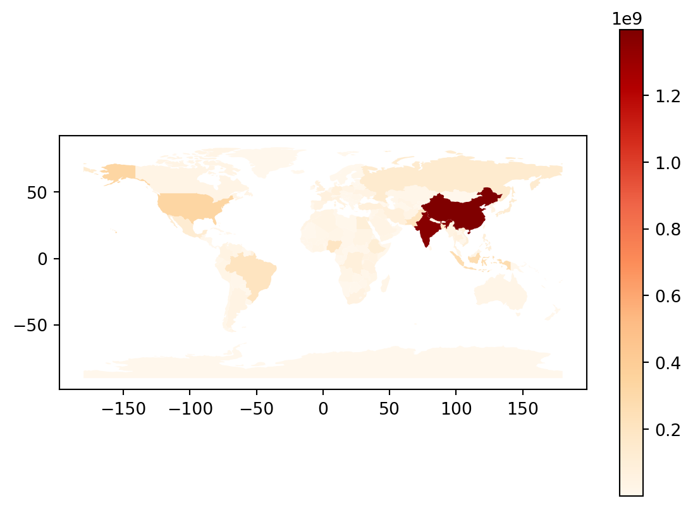

# Introducción a los gráficos avanzados

## Explorando técnicas más allá de los gráficos básicos

¡Hola y bienvenido al blog sobre gráficos avanzados! En esta serie de artículos, vamos a adentrarnos en el fascinante mundo de las técnicas de visualización más allá de los gráficos básicos. Prepárate para explorar nuevas dimensiones de representación de datos y aprender a comunicar información de manera impactante y efectiva.

Sabemos que los gráficos básicos, como las gráficas de barras y líneas, son útiles y ampliamente utilizados. Pero en este blog, vamos a ir más allá y descubrir técnicas avanzadas que te permitirán crear visualizaciones impresionantes y visualmente atractivas. Desde gráficos 3D que dan vida a tus datos, hasta gráficos interactivos que permiten explorar y desglosar información detallada, te enseñaremos cómo utilizar estas herramientas para llevar tus visualizaciones al siguiente nivel.

Así que, si estás listo para explorar técnicas más allá de los gráficos básicos y descubrir cómo comunicar información de manera impactante, ¡prepárate para sumergirte en el mundo de los gráficos avanzados! Acompáñanos en este emocionante viaje y descubre cómo puedes destacarte y captar la atención de tu audiencia con visualizaciones impresionantes. ¡Vamos a empezar!

## Importancia de los gráficos avanzados en el análisis de datos

¿Alguna vez te has preguntado por qué los gráficos avanzados son tan importantes en el análisis de datos? Bueno, déjame decirte que los gráficos avanzados van más allá de simplemente mostrar datos en un formato visualmente atractivo.

Estos gráficos nos permiten explorar y descubrir patrones ocultos, relaciones complejas y tendencias significativas en nuestros datos. Nos ayudan a visualizar la información de una manera que es más fácil de entender y nos permite tomar decisiones informadas.

Imagina tener un conjunto de datos enorme y abrumador. ¿Cómo puedes extraer información valiosa de él? Aquí es donde entran en juego los gráficos avanzados. Pueden ayudarnos a identificar anomalías, detectar patrones ocultos, comparar múltiples variables y comunicar de manera efectiva nuestros hallazgos.

Además, los gráficos avanzados nos permiten presentar nuestros datos de manera impactante y persuasiva. Cuando queremos transmitir un mensaje poderoso o persuadir a nuestra audiencia, los gráficos avanzados pueden ser una herramienta invaluable. Nos permiten contar historias visuales y transmitir información de una manera memorable.


## Introducción a las bibliotecas específicas para gráficos avanzados en Python

En el mundo de la visualización de datos con Python, existen diversas bibliotecas específicamente diseñadas para crear gráficos avanzados. Estas bibliotecas ofrecen una amplia gama de herramientas y funciones que nos permiten crear visualizaciones más sofisticadas y personalizadas.

A continuación, te presento algunas de las bibliotecas más populares y ampliamente utilizadas para gráficos avanzados:

1. **Matplotlib**: Es una biblioteca ampliamente utilizada y altamente personalizable para la creación de gráficos estáticos. Proporciona una gran variedad de tipos de gráficos, como gráficos de líneas, de barras, de dispersión, de área, de pastel, entre otros. Matplotlib ofrece un alto grado de control sobre la apariencia de los gráficos, lo que permite realizar personalizaciones detalladas.

2. **Seaborn**: Es una biblioteca que se basa en Matplotlib y ofrece una interfaz más sencilla y elegante para la creación de gráficos estadísticos. Seaborn proporciona estilos predefinidos y funciones específicas para la visualización de datos en estadística, como gráficos de distribución, de correlación y de boxplots. Además, cuenta con una integración fluida con las estructuras de datos de pandas.

3. **Plotly**: Es una biblioteca que se centra en la creación de gráficos interactivos y visualizaciones en línea. Plotly permite crear gráficos interactivos de alta calidad, como gráficos de dispersión 3D, mapas interactivos, diagramas de contorno y muchos más. Además, ofrece características interactivas, como zoom, desplazamiento y herramientas de selección, que permiten explorar y analizar los datos de forma dinámica.

4. **Folium**: Es una biblioteca especializada en la visualización de datos geoespaciales y la creación de mapas interactivos. Folium utiliza los datos geoespaciales de GeoJSON y ofrece una amplia gama de herramientas para crear mapas temáticos, mapas de calor, mapas de coropletas y mucho más. Además, permite agregar capas adicionales, como marcadores y polígonos, para una mayor personalización.

# Gráficos 3D

## Introducción a los gráficos tridimensionales

Los gráficos tridimensionales son una poderosa herramienta de visualización que nos permite representar datos en tres dimensiones: dos dimensiones espaciales (x, y) y una dimensión adicional representada por el eje z. Esta dimensión adicional nos permite visualizar cómo una tercera variable afecta la relación entre las variables x e y.

Al utilizar gráficos tridimensionales, podemos explorar relaciones más complejas y capturar patrones que no serían visibles en gráficos bidimensionales. Esto es especialmente útil cuando trabajamos con conjuntos de datos que involucran múltiples variables.


## Uso de bibliotecas como Matplotlib y Plotly para crear gráficos 3D

Cuando se trata de crear gráficos 3D, las bibliotecas de Python como Matplotlib y Plotly son tus mejores aliados. Estas herramientas te brindan la flexibilidad y las funciones necesarias para crear visualizaciones tridimensionales impresionantes.

Con Matplotlib, puedes crear gráficos 3D utilizando la subbiblioteca `mpl_toolkits.mplot3d`. Esta subbiblioteca te permite agregar una dimensión adicional a tus gráficos, generando perspectivas en 3D realistas. Puedes crear gráficos de dispersión tridimensionales, superficies tridimensionales y muchas otras visualizaciones impactantes.

Por otro lado, Plotly también ofrece una gran variedad de opciones para crear gráficos 3D interactivos. Puedes utilizar la función `scatter_3d` para crear gráficos de dispersión tridimensionales y la función `surface` para crear superficies tridimensionales. Además, Plotly te permite personalizar y explorar tus gráficos en un entorno interactivo, lo que facilita la visualización de los detalles y la interacción con tus datos.

## Ejemplos prácticos de gráficos de superficie, dispersión y contorno en 3D

Exploremos algunos ejemplos prácticos de cómo crear y visualizar gráficos de superficie, dispersión y contorno en 3D utilizando bibliotecas como Matplotlib y Plotly.

### Gráfico de superficie

Un gráfico de superficie representa una superficie tridimensional a partir de datos numéricos. Veamos un ejemplo de cómo crear un gráfico de superficie utilizando Matplotlib:

::: {.cell execution_count=1}
``` {.python .cell-code}
import numpy as np
import matplotlib.pyplot as plt

# Crear datos de ejemplo
x = np.linspace(-5, 5, 100)
y = np.linspace(-5, 5, 100)
X, Y = np.meshgrid(x, y)
Z = np.sin(np.sqrt(X**2 + Y**2))

# Crear gráfico de superficie
fig = plt.figure()
ax = fig.add_subplot(111, projection='3d')
ax.plot_surface(X, Y, Z)

# Mostrar el gráfico
plt.show()
```

::: {.cell-output .cell-output-display}
{width=413 height=390}
:::
:::


### Gráfico de dispersión

Un gráfico de dispersión en 3D nos permite visualizar cómo los puntos se distribuyen en un espacio tridimensional. A continuación, un ejemplo de cómo crear un gráfico de dispersión utilizando Plotly:

::: {.cell execution_count=2}
``` {.python .cell-code}
import plotly.graph_objects as go

# Crear datos de ejemplo
x = [1, 2, 3, 4, 5]
y = [2, 4, 1, 5, 3]
z = [3, 1, 2, 4, 5]

# Crear gráfico de dispersión
fig = go.Figure(data=go.Scatter3d(x=x, y=y, z=z, mode='markers'))

# Mostrar el gráfico
fig.show()
```

::: {.cell-output .cell-output-display}

```{=html}
<div>                            <div id="1e220e5c-2146-4ec1-bb40-8b27349d3203" class="plotly-graph-div" style="height:525px; width:100%;"></div>            <script type="text/javascript">                require(["plotly"], function(Plotly) {                    window.PLOTLYENV=window.PLOTLYENV || {};                                    if (document.getElementById("1e220e5c-2146-4ec1-bb40-8b27349d3203")) {                    Plotly.newPlot(                        "1e220e5c-2146-4ec1-bb40-8b27349d3203",                        [{"mode":"markers","x":[1,2,3,4,5],"y":[2,4,1,5,3],"z":[3,1,2,4,5],"type":"scatter3d"}],                        {"template":{"data":{"histogram2dcontour":[{"type":"histogram2dcontour","colorbar":{"outlinewidth":0,"ticks":""},"colorscale":[[0.0,"#0d0887"],[0.1111111111111111,"#46039f"],[0.2222222222222222,"#7201a8"],[0.3333333333333333,"#9c179e"],[0.4444444444444444,"#bd3786"],[0.5555555555555556,"#d8576b"],[0.6666666666666666,"#ed7953"],[0.7777777777777778,"#fb9f3a"],[0.8888888888888888,"#fdca26"],[1.0,"#f0f921"]]}],"choropleth":[{"type":"choropleth","colorbar":{"outlinewidth":0,"ticks":""}}],"histogram2d":[{"type":"histogram2d","colorbar":{"outlinewidth":0,"ticks":""},"colorscale":[[0.0,"#0d0887"],[0.1111111111111111,"#46039f"],[0.2222222222222222,"#7201a8"],[0.3333333333333333,"#9c179e"],[0.4444444444444444,"#bd3786"],[0.5555555555555556,"#d8576b"],[0.6666666666666666,"#ed7953"],[0.7777777777777778,"#fb9f3a"],[0.8888888888888888,"#fdca26"],[1.0,"#f0f921"]]}],"heatmap":[{"type":"heatmap","colorbar":{"outlinewidth":0,"ticks":""},"colorscale":[[0.0,"#0d0887"],[0.1111111111111111,"#46039f"],[0.2222222222222222,"#7201a8"],[0.3333333333333333,"#9c179e"],[0.4444444444444444,"#bd3786"],[0.5555555555555556,"#d8576b"],[0.6666666666666666,"#ed7953"],[0.7777777777777778,"#fb9f3a"],[0.8888888888888888,"#fdca26"],[1.0,"#f0f921"]]}],"heatmapgl":[{"type":"heatmapgl","colorbar":{"outlinewidth":0,"ticks":""},"colorscale":[[0.0,"#0d0887"],[0.1111111111111111,"#46039f"],[0.2222222222222222,"#7201a8"],[0.3333333333333333,"#9c179e"],[0.4444444444444444,"#bd3786"],[0.5555555555555556,"#d8576b"],[0.6666666666666666,"#ed7953"],[0.7777777777777778,"#fb9f3a"],[0.8888888888888888,"#fdca26"],[1.0,"#f0f921"]]}],"contourcarpet":[{"type":"contourcarpet","colorbar":{"outlinewidth":0,"ticks":""}}],"contour":[{"type":"contour","colorbar":{"outlinewidth":0,"ticks":""},"colorscale":[[0.0,"#0d0887"],[0.1111111111111111,"#46039f"],[0.2222222222222222,"#7201a8"],[0.3333333333333333,"#9c179e"],[0.4444444444444444,"#bd3786"],[0.5555555555555556,"#d8576b"],[0.6666666666666666,"#ed7953"],[0.7777777777777778,"#fb9f3a"],[0.8888888888888888,"#fdca26"],[1.0,"#f0f921"]]}],"surface":[{"type":"surface","colorbar":{"outlinewidth":0,"ticks":""},"colorscale":[[0.0,"#0d0887"],[0.1111111111111111,"#46039f"],[0.2222222222222222,"#7201a8"],[0.3333333333333333,"#9c179e"],[0.4444444444444444,"#bd3786"],[0.5555555555555556,"#d8576b"],[0.6666666666666666,"#ed7953"],[0.7777777777777778,"#fb9f3a"],[0.8888888888888888,"#fdca26"],[1.0,"#f0f921"]]}],"mesh3d":[{"type":"mesh3d","colorbar":{"outlinewidth":0,"ticks":""}}],"scatter":[{"fillpattern":{"fillmode":"overlay","size":10,"solidity":0.2},"type":"scatter"}],"parcoords":[{"type":"parcoords","line":{"colorbar":{"outlinewidth":0,"ticks":""}}}],"scatterpolargl":[{"type":"scatterpolargl","marker":{"colorbar":{"outlinewidth":0,"ticks":""}}}],"bar":[{"error_x":{"color":"#2a3f5f"},"error_y":{"color":"#2a3f5f"},"marker":{"line":{"color":"#E5ECF6","width":0.5},"pattern":{"fillmode":"overlay","size":10,"solidity":0.2}},"type":"bar"}],"scattergeo":[{"type":"scattergeo","marker":{"colorbar":{"outlinewidth":0,"ticks":""}}}],"scatterpolar":[{"type":"scatterpolar","marker":{"colorbar":{"outlinewidth":0,"ticks":""}}}],"histogram":[{"marker":{"pattern":{"fillmode":"overlay","size":10,"solidity":0.2}},"type":"histogram"}],"scattergl":[{"type":"scattergl","marker":{"colorbar":{"outlinewidth":0,"ticks":""}}}],"scatter3d":[{"type":"scatter3d","line":{"colorbar":{"outlinewidth":0,"ticks":""}},"marker":{"colorbar":{"outlinewidth":0,"ticks":""}}}],"scattermapbox":[{"type":"scattermapbox","marker":{"colorbar":{"outlinewidth":0,"ticks":""}}}],"scatterternary":[{"type":"scatterternary","marker":{"colorbar":{"outlinewidth":0,"ticks":""}}}],"scattercarpet":[{"type":"scattercarpet","marker":{"colorbar":{"outlinewidth":0,"ticks":""}}}],"carpet":[{"aaxis":{"endlinecolor":"#2a3f5f","gridcolor":"white","linecolor":"white","minorgridcolor":"white","startlinecolor":"#2a3f5f"},"baxis":{"endlinecolor":"#2a3f5f","gridcolor":"white","linecolor":"white","minorgridcolor":"white","startlinecolor":"#2a3f5f"},"type":"carpet"}],"table":[{"cells":{"fill":{"color":"#EBF0F8"},"line":{"color":"white"}},"header":{"fill":{"color":"#C8D4E3"},"line":{"color":"white"}},"type":"table"}],"barpolar":[{"marker":{"line":{"color":"#E5ECF6","width":0.5},"pattern":{"fillmode":"overlay","size":10,"solidity":0.2}},"type":"barpolar"}],"pie":[{"automargin":true,"type":"pie"}]},"layout":{"autotypenumbers":"strict","colorway":["#636efa","#EF553B","#00cc96","#ab63fa","#FFA15A","#19d3f3","#FF6692","#B6E880","#FF97FF","#FECB52"],"font":{"color":"#2a3f5f"},"hovermode":"closest","hoverlabel":{"align":"left"},"paper_bgcolor":"white","plot_bgcolor":"#E5ECF6","polar":{"bgcolor":"#E5ECF6","angularaxis":{"gridcolor":"white","linecolor":"white","ticks":""},"radialaxis":{"gridcolor":"white","linecolor":"white","ticks":""}},"ternary":{"bgcolor":"#E5ECF6","aaxis":{"gridcolor":"white","linecolor":"white","ticks":""},"baxis":{"gridcolor":"white","linecolor":"white","ticks":""},"caxis":{"gridcolor":"white","linecolor":"white","ticks":""}},"coloraxis":{"colorbar":{"outlinewidth":0,"ticks":""}},"colorscale":{"sequential":[[0.0,"#0d0887"],[0.1111111111111111,"#46039f"],[0.2222222222222222,"#7201a8"],[0.3333333333333333,"#9c179e"],[0.4444444444444444,"#bd3786"],[0.5555555555555556,"#d8576b"],[0.6666666666666666,"#ed7953"],[0.7777777777777778,"#fb9f3a"],[0.8888888888888888,"#fdca26"],[1.0,"#f0f921"]],"sequentialminus":[[0.0,"#0d0887"],[0.1111111111111111,"#46039f"],[0.2222222222222222,"#7201a8"],[0.3333333333333333,"#9c179e"],[0.4444444444444444,"#bd3786"],[0.5555555555555556,"#d8576b"],[0.6666666666666666,"#ed7953"],[0.7777777777777778,"#fb9f3a"],[0.8888888888888888,"#fdca26"],[1.0,"#f0f921"]],"diverging":[[0,"#8e0152"],[0.1,"#c51b7d"],[0.2,"#de77ae"],[0.3,"#f1b6da"],[0.4,"#fde0ef"],[0.5,"#f7f7f7"],[0.6,"#e6f5d0"],[0.7,"#b8e186"],[0.8,"#7fbc41"],[0.9,"#4d9221"],[1,"#276419"]]},"xaxis":{"gridcolor":"white","linecolor":"white","ticks":"","title":{"standoff":15},"zerolinecolor":"white","automargin":true,"zerolinewidth":2},"yaxis":{"gridcolor":"white","linecolor":"white","ticks":"","title":{"standoff":15},"zerolinecolor":"white","automargin":true,"zerolinewidth":2},"scene":{"xaxis":{"backgroundcolor":"#E5ECF6","gridcolor":"white","linecolor":"white","showbackground":true,"ticks":"","zerolinecolor":"white","gridwidth":2},"yaxis":{"backgroundcolor":"#E5ECF6","gridcolor":"white","linecolor":"white","showbackground":true,"ticks":"","zerolinecolor":"white","gridwidth":2},"zaxis":{"backgroundcolor":"#E5ECF6","gridcolor":"white","linecolor":"white","showbackground":true,"ticks":"","zerolinecolor":"white","gridwidth":2}},"shapedefaults":{"line":{"color":"#2a3f5f"}},"annotationdefaults":{"arrowcolor":"#2a3f5f","arrowhead":0,"arrowwidth":1},"geo":{"bgcolor":"white","landcolor":"#E5ECF6","subunitcolor":"white","showland":true,"showlakes":true,"lakecolor":"white"},"title":{"x":0.05},"mapbox":{"style":"light"}}}},                        {"responsive": true}                    ).then(function(){
                            
var gd = document.getElementById('1e220e5c-2146-4ec1-bb40-8b27349d3203');
var x = new MutationObserver(function (mutations, observer) {{
        var display = window.getComputedStyle(gd).display;
        if (!display || display === 'none') {{
            console.log([gd, 'removed!']);
            Plotly.purge(gd);
            observer.disconnect();
        }}
}});

// Listen for the removal of the full notebook cells
var notebookContainer = gd.closest('#notebook-container');
if (notebookContainer) {{
    x.observe(notebookContainer, {childList: true});
}}

// Listen for the clearing of the current output cell
var outputEl = gd.closest('.output');
if (outputEl) {{
    x.observe(outputEl, {childList: true});
}}

                        })                };                });            </script>        </div>
```

:::
:::


### Gráfico de contorno

Un gráfico de contorno en 3D representa la variación de una variable en un espacio tridimensional mediante líneas de contorno. Veamos un ejemplo de cómo crear un gráfico de contorno utilizando Matplotlib:

::: {.cell execution_count=3}
``` {.python .cell-code}
import numpy as np
import matplotlib.pyplot as plt

# Crear datos de ejemplo
x = np.linspace(-5, 5, 100)
y = np.linspace(-5, 5, 100)
X, Y = np.meshgrid(x, y)
Z = np.sin(np.sqrt(X**2 + Y**2))

# Crear gráfico de contorno
fig = plt.figure()
ax = fig.add_subplot(111, projection='3d')
ax.contour3D(X, Y, Z)

# Mostrar el gráfico
plt.show()
```

::: {.cell-output .cell-output-display}
{width=413 height=390}
:::
:::


Los gráficos de contorno son una forma efectiva de visualizar datos tridimensionales en un formato bidimensional. Estos gráficos utilizan líneas de contorno para representar las diferentes regiones de valores en un plano.

En Python, puedes crear gráficos de contorno utilizando la función `plt.contour()` de Matplotlib. Esta función toma los datos en forma de matrices 2D y genera el gráfico de contorno correspondiente.

::: {.cell execution_count=4}
``` {.python .cell-code}
import plotly.express as px
import pandas as pd
import folium
import matplotlib.pyplot as plt
import numpy as np

# Datos de ejemplo
x = np.linspace(-2, 2, 100)
y = np.linspace(-2, 2, 100)
X, Y = np.meshgrid(x, y)
Z = np.sin(X**2 + Y**2)

# Crear gráfico de contorno
plt.contour(X, Y, Z)

# Personalizar el gráfico
plt.title('Gráfico de contorno')
plt.xlabel('Eje X')
plt.ylabel('Eje Y')

# Mostrar el gráfico
plt.show()
```

::: {.cell-output .cell-output-display}
{width=611 height=449}
:::
:::


En el código anterior, creamos una matriz 2D de valores `Z` basados en los valores de las matrices `X` e `Y`. Luego utilizamos `plt.contour()` para trazar el gráfico de contorno. Puedes ajustar la apariencia del gráfico personalizando los títulos de los ejes y agregando etiquetas.

Los gráficos de contorno son útiles para visualizar relaciones y patrones en datos tridimensionales de manera más comprensible. Puedes experimentar con diferentes configuraciones y colores para resaltar áreas específicas o ajustar los niveles de contorno para obtener más detalles.

### Gráficos 3D

Los gráficos 3D son una forma visualmente impactante de representar datos en tres dimensiones. Estos gráficos nos permiten explorar relaciones complejas y patrones en nuestros datos de una manera más inmersiva.

En Python, podemos crear gráficos 3D utilizando la biblioteca Matplotlib. La función `plt.plot_surface()` nos permite trazar superficies 3D a partir de matrices de datos.

::: {.cell execution_count=5}
``` {.python .cell-code}
# Datos de ejemplo
x = np.linspace(-5, 5, 100)
y = np.linspace(-5, 5, 100)
X, Y = np.meshgrid(x, y)
Z = np.sin(np.sqrt(X**2 + Y**2))

# Crear gráfico 3D
fig = plt.figure()
ax = fig.add_subplot(111, projection='3d')
ax.plot_surface(X, Y, Z)

# Personalizar el gráfico
ax.set_title('Gráfico 3D')
ax.set_xlabel('Eje X')
ax.set_ylabel('Eje Y')
ax.set_zlabel('Eje Z')

# Mostrar el gráfico
plt.show()
```

::: {.cell-output .cell-output-display}
{width=413 height=410}
:::
:::


En el código anterior, creamos matrices `X`, `Y` y `Z` que representan los puntos de la superficie tridimensional. Luego, utilizamos `plt.plot_surface()` junto con la proyección `'3d'` para trazar la superficie en el gráfico 3D.

Puedes personalizar el gráfico ajustando los títulos de los ejes y agregando etiquetas según sea necesario. Además, puedes experimentar con diferentes configuraciones, como cambiar los colores, ajustar la iluminación o agregar puntos de datos adicionales.

Los gráficos 3D son especialmente útiles cuando trabajamos con datos que involucran múltiples variables. Nos permiten visualizar relaciones complejas y descubrir patrones que podrían no ser evidentes en gráficos bidimensionales.

Estos ejemplos te brindan una idea de cómo puedes utilizar gráficos de superficie, dispersión y contorno en 3D para visualizar tus datos en un espacio tridimensional. Experimenta con diferentes conjuntos de datos y opciones de personalización para obtener visualizaciones impactantes y comprensibles.

# Gráficos interactivos

## Utilización de bibliotecas como Plotly y Bokeh para crear gráficos interactivos

La visualización de datos se vuelve aún más emocionante cuando podemos interactuar con los gráficos. Para lograr esto, podemos utilizar bibliotecas como Plotly y Bokeh, que ofrecen poderosas herramientas para crear gráficos interactivos. Veamos cómo utilizar estas bibliotecas:

### Gráficos interactivos con Plotly

Plotly es una biblioteca de visualización de datos que nos permite crear gráficos interactivos con facilidad. A través de su interfaz intuitiva, podemos explorar y analizar nuestros datos de manera dinámica. Aquí hay un ejemplo de cómo crear un gráfico de dispersión interactivo con Plotly:

::: {.cell execution_count=6}
``` {.python .cell-code}
import plotly.express as px

# Cargar datos de ejemplo
data = px.data.iris()

# Crear gráfico de dispersión interactivo
fig = px.scatter(data, x="sepal_width", y="sepal_length", color="species", hover_data=["petal_length", "petal_width"])

# Mostrar el gráfico interactivo
fig.show()
```

::: {.cell-output .cell-output-display}

```{=html}
<div>                            <div id="3048621a-f268-48f7-a43f-80eef6e7c63d" class="plotly-graph-div" style="height:525px; width:100%;"></div>            <script type="text/javascript">                require(["plotly"], function(Plotly) {                    window.PLOTLYENV=window.PLOTLYENV || {};                                    if (document.getElementById("3048621a-f268-48f7-a43f-80eef6e7c63d")) {                    Plotly.newPlot(                        "3048621a-f268-48f7-a43f-80eef6e7c63d",                        [{"customdata":[[1.4,0.2],[1.4,0.2],[1.3,0.2],[1.5,0.2],[1.4,0.2],[1.7,0.4],[1.4,0.3],[1.5,0.2],[1.4,0.2],[1.5,0.1],[1.5,0.2],[1.6,0.2],[1.4,0.1],[1.1,0.1],[1.2,0.2],[1.5,0.4],[1.3,0.4],[1.4,0.3],[1.7,0.3],[1.5,0.3],[1.7,0.2],[1.5,0.4],[1.0,0.2],[1.7,0.5],[1.9,0.2],[1.6,0.2],[1.6,0.4],[1.5,0.2],[1.4,0.2],[1.6,0.2],[1.6,0.2],[1.5,0.4],[1.5,0.1],[1.4,0.2],[1.5,0.1],[1.2,0.2],[1.3,0.2],[1.5,0.1],[1.3,0.2],[1.5,0.2],[1.3,0.3],[1.3,0.3],[1.3,0.2],[1.6,0.6],[1.9,0.4],[1.4,0.3],[1.6,0.2],[1.4,0.2],[1.5,0.2],[1.4,0.2]],"hovertemplate":"species=setosa\u003cbr\u003esepal_width=%{x}\u003cbr\u003esepal_length=%{y}\u003cbr\u003epetal_length=%{customdata[0]}\u003cbr\u003epetal_width=%{customdata[1]}\u003cextra\u003e\u003c\u002fextra\u003e","legendgroup":"setosa","marker":{"color":"#636efa","symbol":"circle"},"mode":"markers","name":"setosa","orientation":"v","showlegend":true,"x":[3.5,3.0,3.2,3.1,3.6,3.9,3.4,3.4,2.9,3.1,3.7,3.4,3.0,3.0,4.0,4.4,3.9,3.5,3.8,3.8,3.4,3.7,3.6,3.3,3.4,3.0,3.4,3.5,3.4,3.2,3.1,3.4,4.1,4.2,3.1,3.2,3.5,3.1,3.0,3.4,3.5,2.3,3.2,3.5,3.8,3.0,3.8,3.2,3.7,3.3],"xaxis":"x","y":[5.1,4.9,4.7,4.6,5.0,5.4,4.6,5.0,4.4,4.9,5.4,4.8,4.8,4.3,5.8,5.7,5.4,5.1,5.7,5.1,5.4,5.1,4.6,5.1,4.8,5.0,5.0,5.2,5.2,4.7,4.8,5.4,5.2,5.5,4.9,5.0,5.5,4.9,4.4,5.1,5.0,4.5,4.4,5.0,5.1,4.8,5.1,4.6,5.3,5.0],"yaxis":"y","type":"scatter"},{"customdata":[[4.7,1.4],[4.5,1.5],[4.9,1.5],[4.0,1.3],[4.6,1.5],[4.5,1.3],[4.7,1.6],[3.3,1.0],[4.6,1.3],[3.9,1.4],[3.5,1.0],[4.2,1.5],[4.0,1.0],[4.7,1.4],[3.6,1.3],[4.4,1.4],[4.5,1.5],[4.1,1.0],[4.5,1.5],[3.9,1.1],[4.8,1.8],[4.0,1.3],[4.9,1.5],[4.7,1.2],[4.3,1.3],[4.4,1.4],[4.8,1.4],[5.0,1.7],[4.5,1.5],[3.5,1.0],[3.8,1.1],[3.7,1.0],[3.9,1.2],[5.1,1.6],[4.5,1.5],[4.5,1.6],[4.7,1.5],[4.4,1.3],[4.1,1.3],[4.0,1.3],[4.4,1.2],[4.6,1.4],[4.0,1.2],[3.3,1.0],[4.2,1.3],[4.2,1.2],[4.2,1.3],[4.3,1.3],[3.0,1.1],[4.1,1.3]],"hovertemplate":"species=versicolor\u003cbr\u003esepal_width=%{x}\u003cbr\u003esepal_length=%{y}\u003cbr\u003epetal_length=%{customdata[0]}\u003cbr\u003epetal_width=%{customdata[1]}\u003cextra\u003e\u003c\u002fextra\u003e","legendgroup":"versicolor","marker":{"color":"#EF553B","symbol":"circle"},"mode":"markers","name":"versicolor","orientation":"v","showlegend":true,"x":[3.2,3.2,3.1,2.3,2.8,2.8,3.3,2.4,2.9,2.7,2.0,3.0,2.2,2.9,2.9,3.1,3.0,2.7,2.2,2.5,3.2,2.8,2.5,2.8,2.9,3.0,2.8,3.0,2.9,2.6,2.4,2.4,2.7,2.7,3.0,3.4,3.1,2.3,3.0,2.5,2.6,3.0,2.6,2.3,2.7,3.0,2.9,2.9,2.5,2.8],"xaxis":"x","y":[7.0,6.4,6.9,5.5,6.5,5.7,6.3,4.9,6.6,5.2,5.0,5.9,6.0,6.1,5.6,6.7,5.6,5.8,6.2,5.6,5.9,6.1,6.3,6.1,6.4,6.6,6.8,6.7,6.0,5.7,5.5,5.5,5.8,6.0,5.4,6.0,6.7,6.3,5.6,5.5,5.5,6.1,5.8,5.0,5.6,5.7,5.7,6.2,5.1,5.7],"yaxis":"y","type":"scatter"},{"customdata":[[6.0,2.5],[5.1,1.9],[5.9,2.1],[5.6,1.8],[5.8,2.2],[6.6,2.1],[4.5,1.7],[6.3,1.8],[5.8,1.8],[6.1,2.5],[5.1,2.0],[5.3,1.9],[5.5,2.1],[5.0,2.0],[5.1,2.4],[5.3,2.3],[5.5,1.8],[6.7,2.2],[6.9,2.3],[5.0,1.5],[5.7,2.3],[4.9,2.0],[6.7,2.0],[4.9,1.8],[5.7,2.1],[6.0,1.8],[4.8,1.8],[4.9,1.8],[5.6,2.1],[5.8,1.6],[6.1,1.9],[6.4,2.0],[5.6,2.2],[5.1,1.5],[5.6,1.4],[6.1,2.3],[5.6,2.4],[5.5,1.8],[4.8,1.8],[5.4,2.1],[5.6,2.4],[5.1,2.3],[5.1,1.9],[5.9,2.3],[5.7,2.5],[5.2,2.3],[5.0,1.9],[5.2,2.0],[5.4,2.3],[5.1,1.8]],"hovertemplate":"species=virginica\u003cbr\u003esepal_width=%{x}\u003cbr\u003esepal_length=%{y}\u003cbr\u003epetal_length=%{customdata[0]}\u003cbr\u003epetal_width=%{customdata[1]}\u003cextra\u003e\u003c\u002fextra\u003e","legendgroup":"virginica","marker":{"color":"#00cc96","symbol":"circle"},"mode":"markers","name":"virginica","orientation":"v","showlegend":true,"x":[3.3,2.7,3.0,2.9,3.0,3.0,2.5,2.9,2.5,3.6,3.2,2.7,3.0,2.5,2.8,3.2,3.0,3.8,2.6,2.2,3.2,2.8,2.8,2.7,3.3,3.2,2.8,3.0,2.8,3.0,2.8,3.8,2.8,2.8,2.6,3.0,3.4,3.1,3.0,3.1,3.1,3.1,2.7,3.2,3.3,3.0,2.5,3.0,3.4,3.0],"xaxis":"x","y":[6.3,5.8,7.1,6.3,6.5,7.6,4.9,7.3,6.7,7.2,6.5,6.4,6.8,5.7,5.8,6.4,6.5,7.7,7.7,6.0,6.9,5.6,7.7,6.3,6.7,7.2,6.2,6.1,6.4,7.2,7.4,7.9,6.4,6.3,6.1,7.7,6.3,6.4,6.0,6.9,6.7,6.9,5.8,6.8,6.7,6.7,6.3,6.5,6.2,5.9],"yaxis":"y","type":"scatter"}],                        {"template":{"data":{"histogram2dcontour":[{"type":"histogram2dcontour","colorbar":{"outlinewidth":0,"ticks":""},"colorscale":[[0.0,"#0d0887"],[0.1111111111111111,"#46039f"],[0.2222222222222222,"#7201a8"],[0.3333333333333333,"#9c179e"],[0.4444444444444444,"#bd3786"],[0.5555555555555556,"#d8576b"],[0.6666666666666666,"#ed7953"],[0.7777777777777778,"#fb9f3a"],[0.8888888888888888,"#fdca26"],[1.0,"#f0f921"]]}],"choropleth":[{"type":"choropleth","colorbar":{"outlinewidth":0,"ticks":""}}],"histogram2d":[{"type":"histogram2d","colorbar":{"outlinewidth":0,"ticks":""},"colorscale":[[0.0,"#0d0887"],[0.1111111111111111,"#46039f"],[0.2222222222222222,"#7201a8"],[0.3333333333333333,"#9c179e"],[0.4444444444444444,"#bd3786"],[0.5555555555555556,"#d8576b"],[0.6666666666666666,"#ed7953"],[0.7777777777777778,"#fb9f3a"],[0.8888888888888888,"#fdca26"],[1.0,"#f0f921"]]}],"heatmap":[{"type":"heatmap","colorbar":{"outlinewidth":0,"ticks":""},"colorscale":[[0.0,"#0d0887"],[0.1111111111111111,"#46039f"],[0.2222222222222222,"#7201a8"],[0.3333333333333333,"#9c179e"],[0.4444444444444444,"#bd3786"],[0.5555555555555556,"#d8576b"],[0.6666666666666666,"#ed7953"],[0.7777777777777778,"#fb9f3a"],[0.8888888888888888,"#fdca26"],[1.0,"#f0f921"]]}],"heatmapgl":[{"type":"heatmapgl","colorbar":{"outlinewidth":0,"ticks":""},"colorscale":[[0.0,"#0d0887"],[0.1111111111111111,"#46039f"],[0.2222222222222222,"#7201a8"],[0.3333333333333333,"#9c179e"],[0.4444444444444444,"#bd3786"],[0.5555555555555556,"#d8576b"],[0.6666666666666666,"#ed7953"],[0.7777777777777778,"#fb9f3a"],[0.8888888888888888,"#fdca26"],[1.0,"#f0f921"]]}],"contourcarpet":[{"type":"contourcarpet","colorbar":{"outlinewidth":0,"ticks":""}}],"contour":[{"type":"contour","colorbar":{"outlinewidth":0,"ticks":""},"colorscale":[[0.0,"#0d0887"],[0.1111111111111111,"#46039f"],[0.2222222222222222,"#7201a8"],[0.3333333333333333,"#9c179e"],[0.4444444444444444,"#bd3786"],[0.5555555555555556,"#d8576b"],[0.6666666666666666,"#ed7953"],[0.7777777777777778,"#fb9f3a"],[0.8888888888888888,"#fdca26"],[1.0,"#f0f921"]]}],"surface":[{"type":"surface","colorbar":{"outlinewidth":0,"ticks":""},"colorscale":[[0.0,"#0d0887"],[0.1111111111111111,"#46039f"],[0.2222222222222222,"#7201a8"],[0.3333333333333333,"#9c179e"],[0.4444444444444444,"#bd3786"],[0.5555555555555556,"#d8576b"],[0.6666666666666666,"#ed7953"],[0.7777777777777778,"#fb9f3a"],[0.8888888888888888,"#fdca26"],[1.0,"#f0f921"]]}],"mesh3d":[{"type":"mesh3d","colorbar":{"outlinewidth":0,"ticks":""}}],"scatter":[{"fillpattern":{"fillmode":"overlay","size":10,"solidity":0.2},"type":"scatter"}],"parcoords":[{"type":"parcoords","line":{"colorbar":{"outlinewidth":0,"ticks":""}}}],"scatterpolargl":[{"type":"scatterpolargl","marker":{"colorbar":{"outlinewidth":0,"ticks":""}}}],"bar":[{"error_x":{"color":"#2a3f5f"},"error_y":{"color":"#2a3f5f"},"marker":{"line":{"color":"#E5ECF6","width":0.5},"pattern":{"fillmode":"overlay","size":10,"solidity":0.2}},"type":"bar"}],"scattergeo":[{"type":"scattergeo","marker":{"colorbar":{"outlinewidth":0,"ticks":""}}}],"scatterpolar":[{"type":"scatterpolar","marker":{"colorbar":{"outlinewidth":0,"ticks":""}}}],"histogram":[{"marker":{"pattern":{"fillmode":"overlay","size":10,"solidity":0.2}},"type":"histogram"}],"scattergl":[{"type":"scattergl","marker":{"colorbar":{"outlinewidth":0,"ticks":""}}}],"scatter3d":[{"type":"scatter3d","line":{"colorbar":{"outlinewidth":0,"ticks":""}},"marker":{"colorbar":{"outlinewidth":0,"ticks":""}}}],"scattermapbox":[{"type":"scattermapbox","marker":{"colorbar":{"outlinewidth":0,"ticks":""}}}],"scatterternary":[{"type":"scatterternary","marker":{"colorbar":{"outlinewidth":0,"ticks":""}}}],"scattercarpet":[{"type":"scattercarpet","marker":{"colorbar":{"outlinewidth":0,"ticks":""}}}],"carpet":[{"aaxis":{"endlinecolor":"#2a3f5f","gridcolor":"white","linecolor":"white","minorgridcolor":"white","startlinecolor":"#2a3f5f"},"baxis":{"endlinecolor":"#2a3f5f","gridcolor":"white","linecolor":"white","minorgridcolor":"white","startlinecolor":"#2a3f5f"},"type":"carpet"}],"table":[{"cells":{"fill":{"color":"#EBF0F8"},"line":{"color":"white"}},"header":{"fill":{"color":"#C8D4E3"},"line":{"color":"white"}},"type":"table"}],"barpolar":[{"marker":{"line":{"color":"#E5ECF6","width":0.5},"pattern":{"fillmode":"overlay","size":10,"solidity":0.2}},"type":"barpolar"}],"pie":[{"automargin":true,"type":"pie"}]},"layout":{"autotypenumbers":"strict","colorway":["#636efa","#EF553B","#00cc96","#ab63fa","#FFA15A","#19d3f3","#FF6692","#B6E880","#FF97FF","#FECB52"],"font":{"color":"#2a3f5f"},"hovermode":"closest","hoverlabel":{"align":"left"},"paper_bgcolor":"white","plot_bgcolor":"#E5ECF6","polar":{"bgcolor":"#E5ECF6","angularaxis":{"gridcolor":"white","linecolor":"white","ticks":""},"radialaxis":{"gridcolor":"white","linecolor":"white","ticks":""}},"ternary":{"bgcolor":"#E5ECF6","aaxis":{"gridcolor":"white","linecolor":"white","ticks":""},"baxis":{"gridcolor":"white","linecolor":"white","ticks":""},"caxis":{"gridcolor":"white","linecolor":"white","ticks":""}},"coloraxis":{"colorbar":{"outlinewidth":0,"ticks":""}},"colorscale":{"sequential":[[0.0,"#0d0887"],[0.1111111111111111,"#46039f"],[0.2222222222222222,"#7201a8"],[0.3333333333333333,"#9c179e"],[0.4444444444444444,"#bd3786"],[0.5555555555555556,"#d8576b"],[0.6666666666666666,"#ed7953"],[0.7777777777777778,"#fb9f3a"],[0.8888888888888888,"#fdca26"],[1.0,"#f0f921"]],"sequentialminus":[[0.0,"#0d0887"],[0.1111111111111111,"#46039f"],[0.2222222222222222,"#7201a8"],[0.3333333333333333,"#9c179e"],[0.4444444444444444,"#bd3786"],[0.5555555555555556,"#d8576b"],[0.6666666666666666,"#ed7953"],[0.7777777777777778,"#fb9f3a"],[0.8888888888888888,"#fdca26"],[1.0,"#f0f921"]],"diverging":[[0,"#8e0152"],[0.1,"#c51b7d"],[0.2,"#de77ae"],[0.3,"#f1b6da"],[0.4,"#fde0ef"],[0.5,"#f7f7f7"],[0.6,"#e6f5d0"],[0.7,"#b8e186"],[0.8,"#7fbc41"],[0.9,"#4d9221"],[1,"#276419"]]},"xaxis":{"gridcolor":"white","linecolor":"white","ticks":"","title":{"standoff":15},"zerolinecolor":"white","automargin":true,"zerolinewidth":2},"yaxis":{"gridcolor":"white","linecolor":"white","ticks":"","title":{"standoff":15},"zerolinecolor":"white","automargin":true,"zerolinewidth":2},"scene":{"xaxis":{"backgroundcolor":"#E5ECF6","gridcolor":"white","linecolor":"white","showbackground":true,"ticks":"","zerolinecolor":"white","gridwidth":2},"yaxis":{"backgroundcolor":"#E5ECF6","gridcolor":"white","linecolor":"white","showbackground":true,"ticks":"","zerolinecolor":"white","gridwidth":2},"zaxis":{"backgroundcolor":"#E5ECF6","gridcolor":"white","linecolor":"white","showbackground":true,"ticks":"","zerolinecolor":"white","gridwidth":2}},"shapedefaults":{"line":{"color":"#2a3f5f"}},"annotationdefaults":{"arrowcolor":"#2a3f5f","arrowhead":0,"arrowwidth":1},"geo":{"bgcolor":"white","landcolor":"#E5ECF6","subunitcolor":"white","showland":true,"showlakes":true,"lakecolor":"white"},"title":{"x":0.05},"mapbox":{"style":"light"}}},"xaxis":{"anchor":"y","domain":[0.0,1.0],"title":{"text":"sepal_width"}},"yaxis":{"anchor":"x","domain":[0.0,1.0],"title":{"text":"sepal_length"}},"legend":{"title":{"text":"species"},"tracegroupgap":0},"margin":{"t":60}},                        {"responsive": true}                    ).then(function(){
                            
var gd = document.getElementById('3048621a-f268-48f7-a43f-80eef6e7c63d');
var x = new MutationObserver(function (mutations, observer) {{
        var display = window.getComputedStyle(gd).display;
        if (!display || display === 'none') {{
            console.log([gd, 'removed!']);
            Plotly.purge(gd);
            observer.disconnect();
        }}
}});

// Listen for the removal of the full notebook cells
var notebookContainer = gd.closest('#notebook-container');
if (notebookContainer) {{
    x.observe(notebookContainer, {childList: true});
}}

// Listen for the clearing of the current output cell
var outputEl = gd.closest('.output');
if (outputEl) {{
    x.observe(outputEl, {childList: true});
}}

                        })                };                });            </script>        </div>
```

:::
:::


Con Plotly, podemos personalizar nuestro gráfico, agregar colores y etiquetas, y explorar los detalles de cada punto al pasar el cursor sobre ellos.

### Gráficos interactivos con Bokeh

Bokeh es otra biblioteca popular que nos permite crear gráficos interactivos en Python. Podemos utilizar Bokeh para crear visualizaciones atractivas con herramientas de interacción, como zoom, panorámica y selección. Aquí tienes un ejemplo de cómo crear un gráfico de líneas interactivo con Bokeh:

::: {.cell execution_count=7}
``` {.python .cell-code}
#pip install bokeh

from bokeh.plotting import figure, show
from bokeh.io import output_notebook

# Configurar la salida para mostrar en el notebook
output_notebook()

# Crear datos de ejemplo
x = [1, 2, 3, 4, 5]
y = [2, 4, 1, 5, 3]

# Crear gráfico de líneas interactivo
p = figure(title="Gráfico interactivo de líneas", x_axis_label="X", y_axis_label="Y")
p.line(x, y)

# Mostrar el gráfico interactivo
show(p)
```

::: {.cell-output .cell-output-display}

```{=html}
<style>
        .bk-notebook-logo {
            display: block;
            width: 20px;
            height: 20px;
            background-image: url(data:image/png;base64,iVBORw0KGgoAAAANSUhEUgAAABQAAAAUCAYAAACNiR0NAAAABHNCSVQICAgIfAhkiAAAAAlwSFlzAAALEgAACxIB0t1+/AAAABx0RVh0U29mdHdhcmUAQWRvYmUgRmlyZXdvcmtzIENTNui8sowAAAOkSURBVDiNjZRtaJVlGMd/1/08zzln5zjP1LWcU9N0NkN8m2CYjpgQYQXqSs0I84OLIC0hkEKoPtiH3gmKoiJDU7QpLgoLjLIQCpEsNJ1vqUOdO7ppbuec5+V+rj4ctwzd8IIbbi6u+8f1539dt3A78eXC7QizUF7gyV1fD1Yqg4JWz84yffhm0qkFqBogB9rM8tZdtwVsPUhWhGcFJngGeWrPzHm5oaMmkfEg1usvLFyc8jLRqDOMru7AyC8saQr7GG7f5fvDeH7Ej8CM66nIF+8yngt6HWaKh7k49Soy9nXurCi1o3qUbS3zWfrYeQDTB/Qj6kX6Ybhw4B+bOYoLKCC9H3Nu/leUTZ1JdRWkkn2ldcCamzrcf47KKXdAJllSlxAOkRgyHsGC/zRday5Qld9DyoM4/q/rUoy/CXh3jzOu3bHUVZeU+DEn8FInkPBFlu3+nW3Nw0mk6vCDiWg8CeJaxEwuHS3+z5RgY+YBR6V1Z1nxSOfoaPa4LASWxxdNp+VWTk7+4vzaou8v8PN+xo+KY2xsw6une2frhw05CTYOmQvsEhjhWjn0bmXPjpE1+kplmmkP3suftwTubK9Vq22qKmrBhpY4jvd5afdRA3wGjFAgcnTK2s4hY0/GPNIb0nErGMCRxWOOX64Z8RAC4oCXdklmEvcL8o0BfkNK4lUg9HTl+oPlQxdNo3Mg4Nv175e/1LDGzZen30MEjRUtmXSfiTVu1kK8W4txyV6BMKlbgk3lMwYCiusNy9fVfvvwMxv8Ynl6vxoByANLTWplvuj/nF9m2+PDtt1eiHPBr1oIfhCChQMBw6Aw0UulqTKZdfVvfG7VcfIqLG9bcldL/+pdWTLxLUy8Qq38heUIjh4XlzZxzQm19lLFlr8vdQ97rjZVOLf8nclzckbcD4wxXMidpX30sFd37Fv/GtwwhzhxGVAprjbg0gCAEeIgwCZyTV2Z1REEW8O4py0wsjeloKoMr6iCY6dP92H6Vw/oTyICIthibxjm/DfN9lVz8IqtqKYLUXfoKVMVQVVJOElGjrnnUt9T9wbgp8AyYKaGlqingHZU/uG2NTZSVqwHQTWkx9hxjkpWDaCg6Ckj5qebgBVbT3V3NNXMSiWSDdGV3hrtzla7J+duwPOToIg42ChPQOQjspnSlp1V+Gjdged7+8UN5CRAV7a5EdFNwCjEaBR27b3W890TE7g24NAP/mMDXRWrGoFPQI9ls/MWO2dWFAar/xcOIImbbpA3zgAAAABJRU5ErkJggg==);
        }
    </style>
    <div>
        <a href="https://bokeh.org" target="_blank" class="bk-notebook-logo"></a>
        <span id="b98a416e-bc23-4bab-b906-6f95e10a303b">Loading BokehJS ...</span>
    </div>
```

:::

::: {.cell-output .cell-output-display}

```{=html}
<script type="application/javascript">
(function(root) {
  function now() {
    return new Date();
  }

  const force = true;

  if (typeof root._bokeh_onload_callbacks === "undefined" || force === true) {
    root._bokeh_onload_callbacks = [];
    root._bokeh_is_loading = undefined;
  }

const JS_MIME_TYPE = 'application/javascript';
  const HTML_MIME_TYPE = 'text/html';
  const EXEC_MIME_TYPE = 'application/vnd.bokehjs_exec.v0+json';
  const CLASS_NAME = 'output_bokeh rendered_html';

  /**
   * Render data to the DOM node
   */
  function render(props, node) {
    const script = document.createElement("script");
    node.appendChild(script);
  }

  /**
   * Handle when an output is cleared or removed
   */
  function handleClearOutput(event, handle) {
    const cell = handle.cell;

    const id = cell.output_area._bokeh_element_id;
    const server_id = cell.output_area._bokeh_server_id;
    // Clean up Bokeh references
    if (id != null && id in Bokeh.index) {
      Bokeh.index[id].model.document.clear();
      delete Bokeh.index[id];
    }

    if (server_id !== undefined) {
      // Clean up Bokeh references
      const cmd_clean = "from bokeh.io.state import curstate; print(curstate().uuid_to_server['" + server_id + "'].get_sessions()[0].document.roots[0]._id)";
      cell.notebook.kernel.execute(cmd_clean, {
        iopub: {
          output: function(msg) {
            const id = msg.content.text.trim();
            if (id in Bokeh.index) {
              Bokeh.index[id].model.document.clear();
              delete Bokeh.index[id];
            }
          }
        }
      });
      // Destroy server and session
      const cmd_destroy = "import bokeh.io.notebook as ion; ion.destroy_server('" + server_id + "')";
      cell.notebook.kernel.execute(cmd_destroy);
    }
  }

  /**
   * Handle when a new output is added
   */
  function handleAddOutput(event, handle) {
    const output_area = handle.output_area;
    const output = handle.output;

    // limit handleAddOutput to display_data with EXEC_MIME_TYPE content only
    if ((output.output_type != "display_data") || (!Object.prototype.hasOwnProperty.call(output.data, EXEC_MIME_TYPE))) {
      return
    }

    const toinsert = output_area.element.find("." + CLASS_NAME.split(' ')[0]);

    if (output.metadata[EXEC_MIME_TYPE]["id"] !== undefined) {
      toinsert[toinsert.length - 1].firstChild.textContent = output.data[JS_MIME_TYPE];
      // store reference to embed id on output_area
      output_area._bokeh_element_id = output.metadata[EXEC_MIME_TYPE]["id"];
    }
    if (output.metadata[EXEC_MIME_TYPE]["server_id"] !== undefined) {
      const bk_div = document.createElement("div");
      bk_div.innerHTML = output.data[HTML_MIME_TYPE];
      const script_attrs = bk_div.children[0].attributes;
      for (let i = 0; i < script_attrs.length; i++) {
        toinsert[toinsert.length - 1].firstChild.setAttribute(script_attrs[i].name, script_attrs[i].value);
        toinsert[toinsert.length - 1].firstChild.textContent = bk_div.children[0].textContent
      }
      // store reference to server id on output_area
      output_area._bokeh_server_id = output.metadata[EXEC_MIME_TYPE]["server_id"];
    }
  }

  function register_renderer(events, OutputArea) {

    function append_mime(data, metadata, element) {
      // create a DOM node to render to
      const toinsert = this.create_output_subarea(
        metadata,
        CLASS_NAME,
        EXEC_MIME_TYPE
      );
      this.keyboard_manager.register_events(toinsert);
      // Render to node
      const props = {data: data, metadata: metadata[EXEC_MIME_TYPE]};
      render(props, toinsert[toinsert.length - 1]);
      element.append(toinsert);
      return toinsert
    }

    /* Handle when an output is cleared or removed */
    events.on('clear_output.CodeCell', handleClearOutput);
    events.on('delete.Cell', handleClearOutput);

    /* Handle when a new output is added */
    events.on('output_added.OutputArea', handleAddOutput);

    /**
     * Register the mime type and append_mime function with output_area
     */
    OutputArea.prototype.register_mime_type(EXEC_MIME_TYPE, append_mime, {
      /* Is output safe? */
      safe: true,
      /* Index of renderer in `output_area.display_order` */
      index: 0
    });
  }

  // register the mime type if in Jupyter Notebook environment and previously unregistered
  if (root.Jupyter !== undefined) {
    const events = require('base/js/events');
    const OutputArea = require('notebook/js/outputarea').OutputArea;

    if (OutputArea.prototype.mime_types().indexOf(EXEC_MIME_TYPE) == -1) {
      register_renderer(events, OutputArea);
    }
  }
  if (typeof (root._bokeh_timeout) === "undefined" || force === true) {
    root._bokeh_timeout = Date.now() + 5000;
    root._bokeh_failed_load = false;
  }

  const NB_LOAD_WARNING = {'data': {'text/html':
     "<div style='background-color: #fdd'>\n"+
     "<p>\n"+
     "BokehJS does not appear to have successfully loaded. If loading BokehJS from CDN, this \n"+
     "may be due to a slow or bad network connection. Possible fixes:\n"+
     "</p>\n"+
     "<ul>\n"+
     "<li>re-rerun `output_notebook()` to attempt to load from CDN again, or</li>\n"+
     "<li>use INLINE resources instead, as so:</li>\n"+
     "</ul>\n"+
     "<code>\n"+
     "from bokeh.resources import INLINE\n"+
     "output_notebook(resources=INLINE)\n"+
     "</code>\n"+
     "</div>"}};

  function display_loaded() {
    const el = document.getElementById("b98a416e-bc23-4bab-b906-6f95e10a303b");
    if (el != null) {
      el.textContent = "BokehJS is loading...";
    }
    if (root.Bokeh !== undefined) {
      if (el != null) {
        el.textContent = "BokehJS " + root.Bokeh.version + " successfully loaded.";
      }
    } else if (Date.now() < root._bokeh_timeout) {
      setTimeout(display_loaded, 100)
    }
  }

  function run_callbacks() {
    try {
      root._bokeh_onload_callbacks.forEach(function(callback) {
        if (callback != null)
          callback();
      });
    } finally {
      delete root._bokeh_onload_callbacks
    }
    console.debug("Bokeh: all callbacks have finished");
  }

  function load_libs(css_urls, js_urls, callback) {
    if (css_urls == null) css_urls = [];
    if (js_urls == null) js_urls = [];

    root._bokeh_onload_callbacks.push(callback);
    if (root._bokeh_is_loading > 0) {
      console.debug("Bokeh: BokehJS is being loaded, scheduling callback at", now());
      return null;
    }
    if (js_urls == null || js_urls.length === 0) {
      run_callbacks();
      return null;
    }
    console.debug("Bokeh: BokehJS not loaded, scheduling load and callback at", now());
    root._bokeh_is_loading = css_urls.length + js_urls.length;

    function on_load() {
      root._bokeh_is_loading--;
      if (root._bokeh_is_loading === 0) {
        console.debug("Bokeh: all BokehJS libraries/stylesheets loaded");
        run_callbacks()
      }
    }

    function on_error(url) {
      console.error("failed to load " + url);
    }

    for (let i = 0; i < css_urls.length; i++) {
      const url = css_urls[i];
      const element = document.createElement("link");
      element.onload = on_load;
      element.onerror = on_error.bind(null, url);
      element.rel = "stylesheet";
      element.type = "text/css";
      element.href = url;
      console.debug("Bokeh: injecting link tag for BokehJS stylesheet: ", url);
      document.body.appendChild(element);
    }

    for (let i = 0; i < js_urls.length; i++) {
      const url = js_urls[i];
      const element = document.createElement('script');
      element.onload = on_load;
      element.onerror = on_error.bind(null, url);
      element.async = false;
      element.src = url;
      console.debug("Bokeh: injecting script tag for BokehJS library: ", url);
      document.head.appendChild(element);
    }
  };

  function inject_raw_css(css) {
    const element = document.createElement("style");
    element.appendChild(document.createTextNode(css));
    document.body.appendChild(element);
  }

  const js_urls = ["https://cdn.bokeh.org/bokeh/release/bokeh-3.2.1.min.js", "https://cdn.bokeh.org/bokeh/release/bokeh-gl-3.2.1.min.js", "https://cdn.bokeh.org/bokeh/release/bokeh-widgets-3.2.1.min.js", "https://cdn.bokeh.org/bokeh/release/bokeh-tables-3.2.1.min.js", "https://cdn.bokeh.org/bokeh/release/bokeh-mathjax-3.2.1.min.js"];
  const css_urls = [];

  const inline_js = [    function(Bokeh) {
      Bokeh.set_log_level("info");
    },
function(Bokeh) {
    }
  ];

  function run_inline_js() {
    if (root.Bokeh !== undefined || force === true) {
          for (let i = 0; i < inline_js.length; i++) {
      inline_js[i].call(root, root.Bokeh);
    }
if (force === true) {
        display_loaded();
      }} else if (Date.now() < root._bokeh_timeout) {
      setTimeout(run_inline_js, 100);
    } else if (!root._bokeh_failed_load) {
      console.log("Bokeh: BokehJS failed to load within specified timeout.");
      root._bokeh_failed_load = true;
    } else if (force !== true) {
      const cell = $(document.getElementById("b98a416e-bc23-4bab-b906-6f95e10a303b")).parents('.cell').data().cell;
      cell.output_area.append_execute_result(NB_LOAD_WARNING)
    }
  }

  if (root._bokeh_is_loading === 0) {
    console.debug("Bokeh: BokehJS loaded, going straight to plotting");
    run_inline_js();
  } else {
    load_libs(css_urls, js_urls, function() {
      console.debug("Bokeh: BokehJS plotting callback run at", now());
      run_inline_js();
    });
  }
}(window));
</script>
```

:::

::: {.cell-output .cell-output-display}

```{=html}

  <div id="bfac7f62-a66c-4905-903c-3ac8e588dc2a" data-root-id="p1001" style="display: contents;"></div>
```

:::

::: {.cell-output .cell-output-display}

```{=html}
<script type="application/javascript">
(function(root) {
  function embed_document(root) {
  const docs_json = {"cf77912c-4211-4fdc-9dda-573e6365bddc":{"version":"3.2.1","title":"Bokeh Application","roots":[{"type":"object","name":"Figure","id":"p1001","attributes":{"x_range":{"type":"object","name":"DataRange1d","id":"p1002"},"y_range":{"type":"object","name":"DataRange1d","id":"p1003"},"x_scale":{"type":"object","name":"LinearScale","id":"p1011"},"y_scale":{"type":"object","name":"LinearScale","id":"p1012"},"title":{"type":"object","name":"Title","id":"p1004","attributes":{"text":"Gr\u00e1fico interactivo de l\u00edneas"}},"renderers":[{"type":"object","name":"GlyphRenderer","id":"p1036","attributes":{"data_source":{"type":"object","name":"ColumnDataSource","id":"p1030","attributes":{"selected":{"type":"object","name":"Selection","id":"p1031","attributes":{"indices":[],"line_indices":[]}},"selection_policy":{"type":"object","name":"UnionRenderers","id":"p1032"},"data":{"type":"map","entries":[["x",[1,2,3,4,5]],["y",[2,4,1,5,3]]]}}},"view":{"type":"object","name":"CDSView","id":"p1037","attributes":{"filter":{"type":"object","name":"AllIndices","id":"p1038"}}},"glyph":{"type":"object","name":"Line","id":"p1033","attributes":{"x":{"type":"field","field":"x"},"y":{"type":"field","field":"y"},"line_color":"#1f77b4"}},"nonselection_glyph":{"type":"object","name":"Line","id":"p1034","attributes":{"x":{"type":"field","field":"x"},"y":{"type":"field","field":"y"},"line_color":"#1f77b4","line_alpha":0.1}},"muted_glyph":{"type":"object","name":"Line","id":"p1035","attributes":{"x":{"type":"field","field":"x"},"y":{"type":"field","field":"y"},"line_color":"#1f77b4","line_alpha":0.2}}}}],"toolbar":{"type":"object","name":"Toolbar","id":"p1010","attributes":{"tools":[{"type":"object","name":"PanTool","id":"p1023"},{"type":"object","name":"WheelZoomTool","id":"p1024"},{"type":"object","name":"BoxZoomTool","id":"p1025","attributes":{"overlay":{"type":"object","name":"BoxAnnotation","id":"p1026","attributes":{"syncable":false,"level":"overlay","visible":false,"left_units":"canvas","right_units":"canvas","bottom_units":"canvas","top_units":"canvas","line_color":"black","line_alpha":1.0,"line_width":2,"line_dash":[4,4],"fill_color":"lightgrey","fill_alpha":0.5}}}},{"type":"object","name":"SaveTool","id":"p1027"},{"type":"object","name":"ResetTool","id":"p1028"},{"type":"object","name":"HelpTool","id":"p1029"}]}},"left":[{"type":"object","name":"LinearAxis","id":"p1018","attributes":{"ticker":{"type":"object","name":"BasicTicker","id":"p1019","attributes":{"mantissas":[1,2,5]}},"formatter":{"type":"object","name":"BasicTickFormatter","id":"p1020"},"axis_label":"Y","major_label_policy":{"type":"object","name":"AllLabels","id":"p1021"}}}],"below":[{"type":"object","name":"LinearAxis","id":"p1013","attributes":{"ticker":{"type":"object","name":"BasicTicker","id":"p1014","attributes":{"mantissas":[1,2,5]}},"formatter":{"type":"object","name":"BasicTickFormatter","id":"p1015"},"axis_label":"X","major_label_policy":{"type":"object","name":"AllLabels","id":"p1016"}}}],"center":[{"type":"object","name":"Grid","id":"p1017","attributes":{"axis":{"id":"p1013"}}},{"type":"object","name":"Grid","id":"p1022","attributes":{"dimension":1,"axis":{"id":"p1018"}}}]}}]}};
  const render_items = [{"docid":"cf77912c-4211-4fdc-9dda-573e6365bddc","roots":{"p1001":"bfac7f62-a66c-4905-903c-3ac8e588dc2a"},"root_ids":["p1001"]}];
  root.Bokeh.embed.embed_items_notebook(docs_json, render_items);
  }
  if (root.Bokeh !== undefined) {
    embed_document(root);
  } else {
    let attempts = 0;
    const timer = setInterval(function(root) {
      if (root.Bokeh !== undefined) {
        clearInterval(timer);
        embed_document(root);
      } else {
        attempts++;
        if (attempts > 100) {
          clearInterval(timer);
          console.log("Bokeh: ERROR: Unable to run BokehJS code because BokehJS library is missing");
        }
      }
    }, 10, root)
  }
})(window);
</script>
```

:::
:::


Con Bokeh, podemos explorar el gráfico de líneas interactivo utilizando herramientas como el zoom y la panorámica. Además, podemos agregar anotaciones y personalizar el diseño según nuestras necesidades.

Tanto Plotly como Bokeh nos ofrecen opciones versátiles para crear gráficos interactivos, lo que nos permite comunicar nuestros datos de manera más efectiva y atractiva. ¡Diviértete experimentando con estas bibliotecas y lleva tus visualizaciones al siguiente nivel!

## Ejemplos prácticos de gráficos interactivos con zoom, selección y herramientas interactivas

Ahora, vamos a explorar algunos ejemplos prácticos de gráficos interactivos que utilizan funciones de zoom, selección y otras herramientas interactivas. Estas características nos permiten explorar los datos de manera más detallada y realizar análisis más profundos. Veamos dos ejemplos utilizando las bibliotecas Plotly y Bokeh:

### Ejemplo 1: Gráfico interactivo de dispersión con selección

En este ejemplo, utilizaremos Plotly para crear un gráfico de dispersión interactivo que nos permita seleccionar puntos específicos. Esto puede ser útil cuando queremos resaltar ciertos puntos de interés en nuestros datos. Aquí está el código:

::: {.cell execution_count=8}
``` {.python .cell-code}
#pip install --upgrade plotly
#pip install dash
import dash
import dash_core_components as dcc
import dash_html_components as html
import plotly.express as px

# Cargar datos de ejemplo
data = px.data.iris()

# Crear la aplicación Dash
app = dash.Dash(__name__)

# Definir el diseño de la aplicación
app.layout = html.Div([
    dcc.Graph(
        id='scatter-plot',
        figure=px.scatter(
            data, x="sepal_width", y="sepal_length", color="species",
            hover_data=["petal_length", "petal_width"]
        )
    )
])

# Ejecutar la aplicación
if __name__ == '__main__':
    app.run_server(debug=True)
```

::: {.cell-output .cell-output-display}

```{=html}

        <iframe
            width="100%"
            height="650"
            src="http://127.0.0.1:8050/"
            frameborder="0"
            allowfullscreen
            
        ></iframe>
        
```

:::
:::


Al seleccionar puntos en el gráfico, podemos obtener información detallada sobre ellos y realizar análisis adicionales.

### Ejemplo 2: Gráfico interactivo de líneas con zoom y herramientas interactivas

En este ejemplo, utilizaremos Bokeh para crear un gráfico de líneas interactivo que nos permita hacer zoom y utilizar herramientas interactivas adicionales. Esto es especialmente útil cuando tenemos conjuntos de datos grandes y queremos explorar diferentes partes del gráfico en detalle. Aquí tienes el código:

::: {.cell execution_count=9}
``` {.python .cell-code}
from bokeh.plotting import figure, show
from bokeh.io import output_notebook
from bokeh.models import WheelZoomTool, HoverTool

# Configurar la salida para mostrar en el notebook
output_notebook()

# Crear datos de ejemplo
x = [1, 2, 3, 4, 5]
y = [2, 4, 1, 5, 3]

# Crear gráfico de líneas interactivo con zoom y herramientas interactivas
p = figure(title="Gráfico interactivo de líneas", x_axis_label="X", y_axis_label="Y", tools=[WheelZoomTool(), HoverTool()])
p.line(x, y)

# Mostrar el gráfico interactivo
show(p)
```

::: {.cell-output .cell-output-display}

```{=html}
<style>
        .bk-notebook-logo {
            display: block;
            width: 20px;
            height: 20px;
            background-image: url(data:image/png;base64,iVBORw0KGgoAAAANSUhEUgAAABQAAAAUCAYAAACNiR0NAAAABHNCSVQICAgIfAhkiAAAAAlwSFlzAAALEgAACxIB0t1+/AAAABx0RVh0U29mdHdhcmUAQWRvYmUgRmlyZXdvcmtzIENTNui8sowAAAOkSURBVDiNjZRtaJVlGMd/1/08zzln5zjP1LWcU9N0NkN8m2CYjpgQYQXqSs0I84OLIC0hkEKoPtiH3gmKoiJDU7QpLgoLjLIQCpEsNJ1vqUOdO7ppbuec5+V+rj4ctwzd8IIbbi6u+8f1539dt3A78eXC7QizUF7gyV1fD1Yqg4JWz84yffhm0qkFqBogB9rM8tZdtwVsPUhWhGcFJngGeWrPzHm5oaMmkfEg1usvLFyc8jLRqDOMru7AyC8saQr7GG7f5fvDeH7Ej8CM66nIF+8yngt6HWaKh7k49Soy9nXurCi1o3qUbS3zWfrYeQDTB/Qj6kX6Ybhw4B+bOYoLKCC9H3Nu/leUTZ1JdRWkkn2ldcCamzrcf47KKXdAJllSlxAOkRgyHsGC/zRday5Qld9DyoM4/q/rUoy/CXh3jzOu3bHUVZeU+DEn8FInkPBFlu3+nW3Nw0mk6vCDiWg8CeJaxEwuHS3+z5RgY+YBR6V1Z1nxSOfoaPa4LASWxxdNp+VWTk7+4vzaou8v8PN+xo+KY2xsw6une2frhw05CTYOmQvsEhjhWjn0bmXPjpE1+kplmmkP3suftwTubK9Vq22qKmrBhpY4jvd5afdRA3wGjFAgcnTK2s4hY0/GPNIb0nErGMCRxWOOX64Z8RAC4oCXdklmEvcL8o0BfkNK4lUg9HTl+oPlQxdNo3Mg4Nv175e/1LDGzZen30MEjRUtmXSfiTVu1kK8W4txyV6BMKlbgk3lMwYCiusNy9fVfvvwMxv8Ynl6vxoByANLTWplvuj/nF9m2+PDtt1eiHPBr1oIfhCChQMBw6Aw0UulqTKZdfVvfG7VcfIqLG9bcldL/+pdWTLxLUy8Qq38heUIjh4XlzZxzQm19lLFlr8vdQ97rjZVOLf8nclzckbcD4wxXMidpX30sFd37Fv/GtwwhzhxGVAprjbg0gCAEeIgwCZyTV2Z1REEW8O4py0wsjeloKoMr6iCY6dP92H6Vw/oTyICIthibxjm/DfN9lVz8IqtqKYLUXfoKVMVQVVJOElGjrnnUt9T9wbgp8AyYKaGlqingHZU/uG2NTZSVqwHQTWkx9hxjkpWDaCg6Ckj5qebgBVbT3V3NNXMSiWSDdGV3hrtzla7J+duwPOToIg42ChPQOQjspnSlp1V+Gjdged7+8UN5CRAV7a5EdFNwCjEaBR27b3W890TE7g24NAP/mMDXRWrGoFPQI9ls/MWO2dWFAar/xcOIImbbpA3zgAAAABJRU5ErkJggg==);
        }
    </style>
    <div>
        <a href="https://bokeh.org" target="_blank" class="bk-notebook-logo"></a>
        <span id="b04e1cdd-57fe-438d-9d41-65055ee5f8b3">Loading BokehJS ...</span>
    </div>
```

:::

::: {.cell-output .cell-output-display}

```{=html}
<script type="application/javascript">
(function(root) {
  function now() {
    return new Date();
  }

  const force = true;

  if (typeof root._bokeh_onload_callbacks === "undefined" || force === true) {
    root._bokeh_onload_callbacks = [];
    root._bokeh_is_loading = undefined;
  }

const JS_MIME_TYPE = 'application/javascript';
  const HTML_MIME_TYPE = 'text/html';
  const EXEC_MIME_TYPE = 'application/vnd.bokehjs_exec.v0+json';
  const CLASS_NAME = 'output_bokeh rendered_html';

  /**
   * Render data to the DOM node
   */
  function render(props, node) {
    const script = document.createElement("script");
    node.appendChild(script);
  }

  /**
   * Handle when an output is cleared or removed
   */
  function handleClearOutput(event, handle) {
    const cell = handle.cell;

    const id = cell.output_area._bokeh_element_id;
    const server_id = cell.output_area._bokeh_server_id;
    // Clean up Bokeh references
    if (id != null && id in Bokeh.index) {
      Bokeh.index[id].model.document.clear();
      delete Bokeh.index[id];
    }

    if (server_id !== undefined) {
      // Clean up Bokeh references
      const cmd_clean = "from bokeh.io.state import curstate; print(curstate().uuid_to_server['" + server_id + "'].get_sessions()[0].document.roots[0]._id)";
      cell.notebook.kernel.execute(cmd_clean, {
        iopub: {
          output: function(msg) {
            const id = msg.content.text.trim();
            if (id in Bokeh.index) {
              Bokeh.index[id].model.document.clear();
              delete Bokeh.index[id];
            }
          }
        }
      });
      // Destroy server and session
      const cmd_destroy = "import bokeh.io.notebook as ion; ion.destroy_server('" + server_id + "')";
      cell.notebook.kernel.execute(cmd_destroy);
    }
  }

  /**
   * Handle when a new output is added
   */
  function handleAddOutput(event, handle) {
    const output_area = handle.output_area;
    const output = handle.output;

    // limit handleAddOutput to display_data with EXEC_MIME_TYPE content only
    if ((output.output_type != "display_data") || (!Object.prototype.hasOwnProperty.call(output.data, EXEC_MIME_TYPE))) {
      return
    }

    const toinsert = output_area.element.find("." + CLASS_NAME.split(' ')[0]);

    if (output.metadata[EXEC_MIME_TYPE]["id"] !== undefined) {
      toinsert[toinsert.length - 1].firstChild.textContent = output.data[JS_MIME_TYPE];
      // store reference to embed id on output_area
      output_area._bokeh_element_id = output.metadata[EXEC_MIME_TYPE]["id"];
    }
    if (output.metadata[EXEC_MIME_TYPE]["server_id"] !== undefined) {
      const bk_div = document.createElement("div");
      bk_div.innerHTML = output.data[HTML_MIME_TYPE];
      const script_attrs = bk_div.children[0].attributes;
      for (let i = 0; i < script_attrs.length; i++) {
        toinsert[toinsert.length - 1].firstChild.setAttribute(script_attrs[i].name, script_attrs[i].value);
        toinsert[toinsert.length - 1].firstChild.textContent = bk_div.children[0].textContent
      }
      // store reference to server id on output_area
      output_area._bokeh_server_id = output.metadata[EXEC_MIME_TYPE]["server_id"];
    }
  }

  function register_renderer(events, OutputArea) {

    function append_mime(data, metadata, element) {
      // create a DOM node to render to
      const toinsert = this.create_output_subarea(
        metadata,
        CLASS_NAME,
        EXEC_MIME_TYPE
      );
      this.keyboard_manager.register_events(toinsert);
      // Render to node
      const props = {data: data, metadata: metadata[EXEC_MIME_TYPE]};
      render(props, toinsert[toinsert.length - 1]);
      element.append(toinsert);
      return toinsert
    }

    /* Handle when an output is cleared or removed */
    events.on('clear_output.CodeCell', handleClearOutput);
    events.on('delete.Cell', handleClearOutput);

    /* Handle when a new output is added */
    events.on('output_added.OutputArea', handleAddOutput);

    /**
     * Register the mime type and append_mime function with output_area
     */
    OutputArea.prototype.register_mime_type(EXEC_MIME_TYPE, append_mime, {
      /* Is output safe? */
      safe: true,
      /* Index of renderer in `output_area.display_order` */
      index: 0
    });
  }

  // register the mime type if in Jupyter Notebook environment and previously unregistered
  if (root.Jupyter !== undefined) {
    const events = require('base/js/events');
    const OutputArea = require('notebook/js/outputarea').OutputArea;

    if (OutputArea.prototype.mime_types().indexOf(EXEC_MIME_TYPE) == -1) {
      register_renderer(events, OutputArea);
    }
  }
  if (typeof (root._bokeh_timeout) === "undefined" || force === true) {
    root._bokeh_timeout = Date.now() + 5000;
    root._bokeh_failed_load = false;
  }

  const NB_LOAD_WARNING = {'data': {'text/html':
     "<div style='background-color: #fdd'>\n"+
     "<p>\n"+
     "BokehJS does not appear to have successfully loaded. If loading BokehJS from CDN, this \n"+
     "may be due to a slow or bad network connection. Possible fixes:\n"+
     "</p>\n"+
     "<ul>\n"+
     "<li>re-rerun `output_notebook()` to attempt to load from CDN again, or</li>\n"+
     "<li>use INLINE resources instead, as so:</li>\n"+
     "</ul>\n"+
     "<code>\n"+
     "from bokeh.resources import INLINE\n"+
     "output_notebook(resources=INLINE)\n"+
     "</code>\n"+
     "</div>"}};

  function display_loaded() {
    const el = document.getElementById("b04e1cdd-57fe-438d-9d41-65055ee5f8b3");
    if (el != null) {
      el.textContent = "BokehJS is loading...";
    }
    if (root.Bokeh !== undefined) {
      if (el != null) {
        el.textContent = "BokehJS " + root.Bokeh.version + " successfully loaded.";
      }
    } else if (Date.now() < root._bokeh_timeout) {
      setTimeout(display_loaded, 100)
    }
  }

  function run_callbacks() {
    try {
      root._bokeh_onload_callbacks.forEach(function(callback) {
        if (callback != null)
          callback();
      });
    } finally {
      delete root._bokeh_onload_callbacks
    }
    console.debug("Bokeh: all callbacks have finished");
  }

  function load_libs(css_urls, js_urls, callback) {
    if (css_urls == null) css_urls = [];
    if (js_urls == null) js_urls = [];

    root._bokeh_onload_callbacks.push(callback);
    if (root._bokeh_is_loading > 0) {
      console.debug("Bokeh: BokehJS is being loaded, scheduling callback at", now());
      return null;
    }
    if (js_urls == null || js_urls.length === 0) {
      run_callbacks();
      return null;
    }
    console.debug("Bokeh: BokehJS not loaded, scheduling load and callback at", now());
    root._bokeh_is_loading = css_urls.length + js_urls.length;

    function on_load() {
      root._bokeh_is_loading--;
      if (root._bokeh_is_loading === 0) {
        console.debug("Bokeh: all BokehJS libraries/stylesheets loaded");
        run_callbacks()
      }
    }

    function on_error(url) {
      console.error("failed to load " + url);
    }

    for (let i = 0; i < css_urls.length; i++) {
      const url = css_urls[i];
      const element = document.createElement("link");
      element.onload = on_load;
      element.onerror = on_error.bind(null, url);
      element.rel = "stylesheet";
      element.type = "text/css";
      element.href = url;
      console.debug("Bokeh: injecting link tag for BokehJS stylesheet: ", url);
      document.body.appendChild(element);
    }

    for (let i = 0; i < js_urls.length; i++) {
      const url = js_urls[i];
      const element = document.createElement('script');
      element.onload = on_load;
      element.onerror = on_error.bind(null, url);
      element.async = false;
      element.src = url;
      console.debug("Bokeh: injecting script tag for BokehJS library: ", url);
      document.head.appendChild(element);
    }
  };

  function inject_raw_css(css) {
    const element = document.createElement("style");
    element.appendChild(document.createTextNode(css));
    document.body.appendChild(element);
  }

  const js_urls = ["https://cdn.bokeh.org/bokeh/release/bokeh-3.2.1.min.js", "https://cdn.bokeh.org/bokeh/release/bokeh-gl-3.2.1.min.js", "https://cdn.bokeh.org/bokeh/release/bokeh-widgets-3.2.1.min.js", "https://cdn.bokeh.org/bokeh/release/bokeh-tables-3.2.1.min.js", "https://cdn.bokeh.org/bokeh/release/bokeh-mathjax-3.2.1.min.js"];
  const css_urls = [];

  const inline_js = [    function(Bokeh) {
      Bokeh.set_log_level("info");
    },
function(Bokeh) {
    }
  ];

  function run_inline_js() {
    if (root.Bokeh !== undefined || force === true) {
          for (let i = 0; i < inline_js.length; i++) {
      inline_js[i].call(root, root.Bokeh);
    }
if (force === true) {
        display_loaded();
      }} else if (Date.now() < root._bokeh_timeout) {
      setTimeout(run_inline_js, 100);
    } else if (!root._bokeh_failed_load) {
      console.log("Bokeh: BokehJS failed to load within specified timeout.");
      root._bokeh_failed_load = true;
    } else if (force !== true) {
      const cell = $(document.getElementById("b04e1cdd-57fe-438d-9d41-65055ee5f8b3")).parents('.cell').data().cell;
      cell.output_area.append_execute_result(NB_LOAD_WARNING)
    }
  }

  if (root._bokeh_is_loading === 0) {
    console.debug("Bokeh: BokehJS loaded, going straight to plotting");
    run_inline_js();
  } else {
    load_libs(css_urls, js_urls, function() {
      console.debug("Bokeh: BokehJS plotting callback run at", now());
      run_inline_js();
    });
  }
}(window));
</script>
```

:::

::: {.cell-output .cell-output-display}

```{=html}

  <div id="af0af8cc-8084-4431-bcdb-ddbfe3c2fb59" data-root-id="p1041" style="display: contents;"></div>
```

:::

::: {.cell-output .cell-output-display}

```{=html}
<script type="application/javascript">
(function(root) {
  function embed_document(root) {
  const docs_json = {"47956f6b-a62a-4837-8f48-4de1c52e2886":{"version":"3.2.1","title":"Bokeh Application","roots":[{"type":"object","name":"Figure","id":"p1041","attributes":{"x_range":{"type":"object","name":"DataRange1d","id":"p1042"},"y_range":{"type":"object","name":"DataRange1d","id":"p1043"},"x_scale":{"type":"object","name":"LinearScale","id":"p1051"},"y_scale":{"type":"object","name":"LinearScale","id":"p1052"},"title":{"type":"object","name":"Title","id":"p1044","attributes":{"text":"Gr\u00e1fico interactivo de l\u00edneas"}},"renderers":[{"type":"object","name":"GlyphRenderer","id":"p1069","attributes":{"data_source":{"type":"object","name":"ColumnDataSource","id":"p1063","attributes":{"selected":{"type":"object","name":"Selection","id":"p1064","attributes":{"indices":[],"line_indices":[]}},"selection_policy":{"type":"object","name":"UnionRenderers","id":"p1065"},"data":{"type":"map","entries":[["x",[1,2,3,4,5]],["y",[2,4,1,5,3]]]}}},"view":{"type":"object","name":"CDSView","id":"p1070","attributes":{"filter":{"type":"object","name":"AllIndices","id":"p1071"}}},"glyph":{"type":"object","name":"Line","id":"p1066","attributes":{"x":{"type":"field","field":"x"},"y":{"type":"field","field":"y"},"line_color":"#1f77b4"}},"nonselection_glyph":{"type":"object","name":"Line","id":"p1067","attributes":{"x":{"type":"field","field":"x"},"y":{"type":"field","field":"y"},"line_color":"#1f77b4","line_alpha":0.1}},"muted_glyph":{"type":"object","name":"Line","id":"p1068","attributes":{"x":{"type":"field","field":"x"},"y":{"type":"field","field":"y"},"line_color":"#1f77b4","line_alpha":0.2}}}}],"toolbar":{"type":"object","name":"Toolbar","id":"p1050","attributes":{"tools":[{"type":"object","name":"WheelZoomTool","id":"p1039"},{"type":"object","name":"HoverTool","id":"p1040","attributes":{"renderers":"auto"}}]}},"left":[{"type":"object","name":"LinearAxis","id":"p1058","attributes":{"ticker":{"type":"object","name":"BasicTicker","id":"p1059","attributes":{"mantissas":[1,2,5]}},"formatter":{"type":"object","name":"BasicTickFormatter","id":"p1060"},"axis_label":"Y","major_label_policy":{"type":"object","name":"AllLabels","id":"p1061"}}}],"below":[{"type":"object","name":"LinearAxis","id":"p1053","attributes":{"ticker":{"type":"object","name":"BasicTicker","id":"p1054","attributes":{"mantissas":[1,2,5]}},"formatter":{"type":"object","name":"BasicTickFormatter","id":"p1055"},"axis_label":"X","major_label_policy":{"type":"object","name":"AllLabels","id":"p1056"}}}],"center":[{"type":"object","name":"Grid","id":"p1057","attributes":{"axis":{"id":"p1053"}}},{"type":"object","name":"Grid","id":"p1062","attributes":{"dimension":1,"axis":{"id":"p1058"}}}]}}]}};
  const render_items = [{"docid":"47956f6b-a62a-4837-8f48-4de1c52e2886","roots":{"p1041":"af0af8cc-8084-4431-bcdb-ddbfe3c2fb59"},"root_ids":["p1041"]}];
  root.Bokeh.embed.embed_items_notebook(docs_json, render_items);
  }
  if (root.Bokeh !== undefined) {
    embed_document(root);
  } else {
    let attempts = 0;
    const timer = setInterval(function(root) {
      if (root.Bokeh !== undefined) {
        clearInterval(timer);
        embed_document(root);
      } else {
        attempts++;
        if (attempts > 100) {
          clearInterval(timer);
          console.log("Bokeh: ERROR: Unable to run BokehJS code because BokehJS library is missing");
        }
      }
    }, 10, root)
  }
})(window);
</script>
```

:::
:::


Con este gráfico interactivo, podemos hacer zoom en áreas específicas, obtener información detallada al pasar el cursor sobre los puntos y explorar diferentes partes del gráfico según nuestras necesidades.


## Gráficos interactivos

Los gráficos interactivos son una forma fascinante de visualizar datos y permitir a los usuarios explorar la información de manera dinámica. Python nos ofrece varias bibliotecas poderosas para crear gráficos interactivos, como Plotly, Bokeh y Altair.

Una de las bibliotecas más populares para gráficos interactivos es Plotly. Esta biblioteca nos permite crear gráficos interactivos con características como zoom, pan y herramientas para resaltar puntos de datos específicos. Además, Plotly proporciona una interfaz sencilla para personalizar y diseñar nuestros gráficos.

::: {.cell execution_count=10}
``` {.python .cell-code}
# Definir los datos y exportamos a un .csv
datos = {
    'nombre': ['Juan', 'María', 'Carlos', 'Laura'],
    'edad': [25, 30, 35, 28],
    'salario': [50000, 60000, 70000, 55000],
    'departamento': ['Ventas', 'Marketing', 'Finanzas', 'Recursos Humanos']
}

# Crear un DataFrame con los datos
df = pd.DataFrame(datos)

# Guardar el DataFrame en un archivo CSV
df.to_csv('datos.csv', index=False)
```
:::


::: {.cell execution_count=11}
``` {.python .cell-code}
df = pd.read_csv('datos.csv')

# Crear un gráfico interactivo de dispersión
fig = px.scatter(df, x="edad", y="salario",
                 color="departamento", hover_data=["nombre"])

# Personalizar el diseño y las herramientas interactivas
fig.update_layout(
    title="Relación entre edad, salario y departamento",
    xaxis_title="Edad",
    yaxis_title="Salario",
    hovermode="closest"
)

# Mostrar el gráfico interactivo
fig.show()
```

::: {.cell-output .cell-output-display}

```{=html}
<div>                            <div id="96cf7226-91b5-4e52-9f5a-7f415f4ac653" class="plotly-graph-div" style="height:525px; width:100%;"></div>            <script type="text/javascript">                require(["plotly"], function(Plotly) {                    window.PLOTLYENV=window.PLOTLYENV || {};                                    if (document.getElementById("96cf7226-91b5-4e52-9f5a-7f415f4ac653")) {                    Plotly.newPlot(                        "96cf7226-91b5-4e52-9f5a-7f415f4ac653",                        [{"customdata":[["Juan"]],"hovertemplate":"departamento=Ventas\u003cbr\u003eedad=%{x}\u003cbr\u003esalario=%{y}\u003cbr\u003enombre=%{customdata[0]}\u003cextra\u003e\u003c\u002fextra\u003e","legendgroup":"Ventas","marker":{"color":"#636efa","symbol":"circle"},"mode":"markers","name":"Ventas","orientation":"v","showlegend":true,"x":[25],"xaxis":"x","y":[50000],"yaxis":"y","type":"scatter"},{"customdata":[["Mar\u00eda"]],"hovertemplate":"departamento=Marketing\u003cbr\u003eedad=%{x}\u003cbr\u003esalario=%{y}\u003cbr\u003enombre=%{customdata[0]}\u003cextra\u003e\u003c\u002fextra\u003e","legendgroup":"Marketing","marker":{"color":"#EF553B","symbol":"circle"},"mode":"markers","name":"Marketing","orientation":"v","showlegend":true,"x":[30],"xaxis":"x","y":[60000],"yaxis":"y","type":"scatter"},{"customdata":[["Carlos"]],"hovertemplate":"departamento=Finanzas\u003cbr\u003eedad=%{x}\u003cbr\u003esalario=%{y}\u003cbr\u003enombre=%{customdata[0]}\u003cextra\u003e\u003c\u002fextra\u003e","legendgroup":"Finanzas","marker":{"color":"#00cc96","symbol":"circle"},"mode":"markers","name":"Finanzas","orientation":"v","showlegend":true,"x":[35],"xaxis":"x","y":[70000],"yaxis":"y","type":"scatter"},{"customdata":[["Laura"]],"hovertemplate":"departamento=Recursos Humanos\u003cbr\u003eedad=%{x}\u003cbr\u003esalario=%{y}\u003cbr\u003enombre=%{customdata[0]}\u003cextra\u003e\u003c\u002fextra\u003e","legendgroup":"Recursos Humanos","marker":{"color":"#ab63fa","symbol":"circle"},"mode":"markers","name":"Recursos Humanos","orientation":"v","showlegend":true,"x":[28],"xaxis":"x","y":[55000],"yaxis":"y","type":"scatter"}],                        {"template":{"data":{"histogram2dcontour":[{"type":"histogram2dcontour","colorbar":{"outlinewidth":0,"ticks":""},"colorscale":[[0.0,"#0d0887"],[0.1111111111111111,"#46039f"],[0.2222222222222222,"#7201a8"],[0.3333333333333333,"#9c179e"],[0.4444444444444444,"#bd3786"],[0.5555555555555556,"#d8576b"],[0.6666666666666666,"#ed7953"],[0.7777777777777778,"#fb9f3a"],[0.8888888888888888,"#fdca26"],[1.0,"#f0f921"]]}],"choropleth":[{"type":"choropleth","colorbar":{"outlinewidth":0,"ticks":""}}],"histogram2d":[{"type":"histogram2d","colorbar":{"outlinewidth":0,"ticks":""},"colorscale":[[0.0,"#0d0887"],[0.1111111111111111,"#46039f"],[0.2222222222222222,"#7201a8"],[0.3333333333333333,"#9c179e"],[0.4444444444444444,"#bd3786"],[0.5555555555555556,"#d8576b"],[0.6666666666666666,"#ed7953"],[0.7777777777777778,"#fb9f3a"],[0.8888888888888888,"#fdca26"],[1.0,"#f0f921"]]}],"heatmap":[{"type":"heatmap","colorbar":{"outlinewidth":0,"ticks":""},"colorscale":[[0.0,"#0d0887"],[0.1111111111111111,"#46039f"],[0.2222222222222222,"#7201a8"],[0.3333333333333333,"#9c179e"],[0.4444444444444444,"#bd3786"],[0.5555555555555556,"#d8576b"],[0.6666666666666666,"#ed7953"],[0.7777777777777778,"#fb9f3a"],[0.8888888888888888,"#fdca26"],[1.0,"#f0f921"]]}],"heatmapgl":[{"type":"heatmapgl","colorbar":{"outlinewidth":0,"ticks":""},"colorscale":[[0.0,"#0d0887"],[0.1111111111111111,"#46039f"],[0.2222222222222222,"#7201a8"],[0.3333333333333333,"#9c179e"],[0.4444444444444444,"#bd3786"],[0.5555555555555556,"#d8576b"],[0.6666666666666666,"#ed7953"],[0.7777777777777778,"#fb9f3a"],[0.8888888888888888,"#fdca26"],[1.0,"#f0f921"]]}],"contourcarpet":[{"type":"contourcarpet","colorbar":{"outlinewidth":0,"ticks":""}}],"contour":[{"type":"contour","colorbar":{"outlinewidth":0,"ticks":""},"colorscale":[[0.0,"#0d0887"],[0.1111111111111111,"#46039f"],[0.2222222222222222,"#7201a8"],[0.3333333333333333,"#9c179e"],[0.4444444444444444,"#bd3786"],[0.5555555555555556,"#d8576b"],[0.6666666666666666,"#ed7953"],[0.7777777777777778,"#fb9f3a"],[0.8888888888888888,"#fdca26"],[1.0,"#f0f921"]]}],"surface":[{"type":"surface","colorbar":{"outlinewidth":0,"ticks":""},"colorscale":[[0.0,"#0d0887"],[0.1111111111111111,"#46039f"],[0.2222222222222222,"#7201a8"],[0.3333333333333333,"#9c179e"],[0.4444444444444444,"#bd3786"],[0.5555555555555556,"#d8576b"],[0.6666666666666666,"#ed7953"],[0.7777777777777778,"#fb9f3a"],[0.8888888888888888,"#fdca26"],[1.0,"#f0f921"]]}],"mesh3d":[{"type":"mesh3d","colorbar":{"outlinewidth":0,"ticks":""}}],"scatter":[{"fillpattern":{"fillmode":"overlay","size":10,"solidity":0.2},"type":"scatter"}],"parcoords":[{"type":"parcoords","line":{"colorbar":{"outlinewidth":0,"ticks":""}}}],"scatterpolargl":[{"type":"scatterpolargl","marker":{"colorbar":{"outlinewidth":0,"ticks":""}}}],"bar":[{"error_x":{"color":"#2a3f5f"},"error_y":{"color":"#2a3f5f"},"marker":{"line":{"color":"#E5ECF6","width":0.5},"pattern":{"fillmode":"overlay","size":10,"solidity":0.2}},"type":"bar"}],"scattergeo":[{"type":"scattergeo","marker":{"colorbar":{"outlinewidth":0,"ticks":""}}}],"scatterpolar":[{"type":"scatterpolar","marker":{"colorbar":{"outlinewidth":0,"ticks":""}}}],"histogram":[{"marker":{"pattern":{"fillmode":"overlay","size":10,"solidity":0.2}},"type":"histogram"}],"scattergl":[{"type":"scattergl","marker":{"colorbar":{"outlinewidth":0,"ticks":""}}}],"scatter3d":[{"type":"scatter3d","line":{"colorbar":{"outlinewidth":0,"ticks":""}},"marker":{"colorbar":{"outlinewidth":0,"ticks":""}}}],"scattermapbox":[{"type":"scattermapbox","marker":{"colorbar":{"outlinewidth":0,"ticks":""}}}],"scatterternary":[{"type":"scatterternary","marker":{"colorbar":{"outlinewidth":0,"ticks":""}}}],"scattercarpet":[{"type":"scattercarpet","marker":{"colorbar":{"outlinewidth":0,"ticks":""}}}],"carpet":[{"aaxis":{"endlinecolor":"#2a3f5f","gridcolor":"white","linecolor":"white","minorgridcolor":"white","startlinecolor":"#2a3f5f"},"baxis":{"endlinecolor":"#2a3f5f","gridcolor":"white","linecolor":"white","minorgridcolor":"white","startlinecolor":"#2a3f5f"},"type":"carpet"}],"table":[{"cells":{"fill":{"color":"#EBF0F8"},"line":{"color":"white"}},"header":{"fill":{"color":"#C8D4E3"},"line":{"color":"white"}},"type":"table"}],"barpolar":[{"marker":{"line":{"color":"#E5ECF6","width":0.5},"pattern":{"fillmode":"overlay","size":10,"solidity":0.2}},"type":"barpolar"}],"pie":[{"automargin":true,"type":"pie"}]},"layout":{"autotypenumbers":"strict","colorway":["#636efa","#EF553B","#00cc96","#ab63fa","#FFA15A","#19d3f3","#FF6692","#B6E880","#FF97FF","#FECB52"],"font":{"color":"#2a3f5f"},"hovermode":"closest","hoverlabel":{"align":"left"},"paper_bgcolor":"white","plot_bgcolor":"#E5ECF6","polar":{"bgcolor":"#E5ECF6","angularaxis":{"gridcolor":"white","linecolor":"white","ticks":""},"radialaxis":{"gridcolor":"white","linecolor":"white","ticks":""}},"ternary":{"bgcolor":"#E5ECF6","aaxis":{"gridcolor":"white","linecolor":"white","ticks":""},"baxis":{"gridcolor":"white","linecolor":"white","ticks":""},"caxis":{"gridcolor":"white","linecolor":"white","ticks":""}},"coloraxis":{"colorbar":{"outlinewidth":0,"ticks":""}},"colorscale":{"sequential":[[0.0,"#0d0887"],[0.1111111111111111,"#46039f"],[0.2222222222222222,"#7201a8"],[0.3333333333333333,"#9c179e"],[0.4444444444444444,"#bd3786"],[0.5555555555555556,"#d8576b"],[0.6666666666666666,"#ed7953"],[0.7777777777777778,"#fb9f3a"],[0.8888888888888888,"#fdca26"],[1.0,"#f0f921"]],"sequentialminus":[[0.0,"#0d0887"],[0.1111111111111111,"#46039f"],[0.2222222222222222,"#7201a8"],[0.3333333333333333,"#9c179e"],[0.4444444444444444,"#bd3786"],[0.5555555555555556,"#d8576b"],[0.6666666666666666,"#ed7953"],[0.7777777777777778,"#fb9f3a"],[0.8888888888888888,"#fdca26"],[1.0,"#f0f921"]],"diverging":[[0,"#8e0152"],[0.1,"#c51b7d"],[0.2,"#de77ae"],[0.3,"#f1b6da"],[0.4,"#fde0ef"],[0.5,"#f7f7f7"],[0.6,"#e6f5d0"],[0.7,"#b8e186"],[0.8,"#7fbc41"],[0.9,"#4d9221"],[1,"#276419"]]},"xaxis":{"gridcolor":"white","linecolor":"white","ticks":"","title":{"standoff":15},"zerolinecolor":"white","automargin":true,"zerolinewidth":2},"yaxis":{"gridcolor":"white","linecolor":"white","ticks":"","title":{"standoff":15},"zerolinecolor":"white","automargin":true,"zerolinewidth":2},"scene":{"xaxis":{"backgroundcolor":"#E5ECF6","gridcolor":"white","linecolor":"white","showbackground":true,"ticks":"","zerolinecolor":"white","gridwidth":2},"yaxis":{"backgroundcolor":"#E5ECF6","gridcolor":"white","linecolor":"white","showbackground":true,"ticks":"","zerolinecolor":"white","gridwidth":2},"zaxis":{"backgroundcolor":"#E5ECF6","gridcolor":"white","linecolor":"white","showbackground":true,"ticks":"","zerolinecolor":"white","gridwidth":2}},"shapedefaults":{"line":{"color":"#2a3f5f"}},"annotationdefaults":{"arrowcolor":"#2a3f5f","arrowhead":0,"arrowwidth":1},"geo":{"bgcolor":"white","landcolor":"#E5ECF6","subunitcolor":"white","showland":true,"showlakes":true,"lakecolor":"white"},"title":{"x":0.05},"mapbox":{"style":"light"}}},"xaxis":{"anchor":"y","domain":[0.0,1.0],"title":{"text":"Edad"}},"yaxis":{"anchor":"x","domain":[0.0,1.0],"title":{"text":"Salario"}},"legend":{"title":{"text":"departamento"},"tracegroupgap":0},"margin":{"t":60},"title":{"text":"Relaci\u00f3n entre edad, salario y departamento"},"hovermode":"closest"},                        {"responsive": true}                    ).then(function(){
                            
var gd = document.getElementById('96cf7226-91b5-4e52-9f5a-7f415f4ac653');
var x = new MutationObserver(function (mutations, observer) {{
        var display = window.getComputedStyle(gd).display;
        if (!display || display === 'none') {{
            console.log([gd, 'removed!']);
            Plotly.purge(gd);
            observer.disconnect();
        }}
}});

// Listen for the removal of the full notebook cells
var notebookContainer = gd.closest('#notebook-container');
if (notebookContainer) {{
    x.observe(notebookContainer, {childList: true});
}}

// Listen for the clearing of the current output cell
var outputEl = gd.closest('.output');
if (outputEl) {{
    x.observe(outputEl, {childList: true});
}}

                        })                };                });            </script>        </div>
```

:::
:::


En el código anterior, utilizamos la biblioteca Plotly Express para crear un gráfico interactivo de dispersión. Especificamos las columnas del DataFrame que deseamos visualizar y personalizamos el gráfico con títulos, etiquetas y configuraciones de interacción.

Además de Plotly, Bokeh y Altair también son bibliotecas populares para crear gráficos interactivos en Python. Bokeh nos permite crear visualizaciones interactivas basadas en navegadores web, mientras que Altair se centra en la creación de gráficos declarativos y basados en gramáticas.

Los gráficos interactivos son ideales para explorar datos, ya que permiten a los usuarios interactuar con los gráficos y profundizar en la información. Pueden ser utilizados para resaltar puntos de datos, mostrar detalles adicionales en herramientas emergentes o incluso para filtrar y seleccionar subconjuntos de datos.


Estos ejemplos ilustran cómo podemos aprovechar las herramientas interactivas de las bibliotecas Plotly y Bokeh para crear visualizaciones atractivas y explorar nuestros datos de manera más eficiente. 


# Mapas temáticos

## Introducción a la visualización de datos geoespaciales

En esta sección, exploraremos la visualización de datos geoespaciales y cómo podemos utilizarla para comprender mejor la información relacionada con ubicaciones geográficas. Los mapas temáticos nos permiten representar datos en un contexto geográfico, lo que facilita la identificación de patrones, tendencias y relaciones espaciales.

## Uso de bibliotecas como Geopandas, Plotly y Folium para crear mapas temáticos

Utilizaremos bibliotecas populares como Geopandas, Plotly y Folium para crear mapas temáticos interactivos y personalizados. Estas herramientas nos permiten cargar datos geoespaciales, agregar capas temáticas y aplicar estilos visuales para resaltar información relevante en nuestros mapas.


### Geopandas
Geopandas es una biblioteca de Python que proporciona una manera fácil y eficiente de trabajar con datos geoespaciales. Combina las capacidades de las bibliotecas Pandas y Shapely para manejar y analizar datos espaciales. Geopandas permite cargar, manipular y visualizar datos geoespaciales, como formas de países, líneas de carreteras o puntos de interés. Además, ofrece funcionalidades para realizar operaciones espaciales y análisis geoespacial.

Para instalar Geopandas, puedes utilizar el gestor de paquetes de Python, pip. Ejecuta el siguiente comando en tu terminal o entorno de Python:

```
pip install geopandas
```

Además de Geopandas, esta biblioteca depende de otras bibliotecas como Pandas, Numpy y Shapely. Asegúrate de tenerlas instaladas previamente.

### Plotly
Plotly es una biblioteca de visualización de datos interactiva que permite crear gráficos y visualizaciones de alta calidad. Es especialmente conocida por su capacidad de generar gráficos interactivos, incluyendo mapas temáticos. Plotly ofrece una amplia gama de gráficos, desde gráficos de barras y dispersión hasta gráficos 3D y mapas interactivos. Además, permite personalizar la apariencia de los gráficos y agregar interactividad como zoom, selección y herramientas de exploración.

Para instalar Plotly, también puedes utilizar el gestor de paquetes pip. Ejecuta el siguiente comando:

```
pip install plotly
```

Plotly requiere la instalación de una biblioteca adicional llamada Plotly.js. Puedes instalarla ejecutando el siguiente comando:

```
pip install plotly-geo
```

### Folium
Folium es una biblioteca de Python que se basa en Leaflet.js, una biblioteca de JavaScript para visualización de mapas interactivos. Folium facilita la creación de mapas interactivos y la superposición de datos en ellos. Permite cargar datos geoespaciales en diferentes formatos, como GeoJSON y Shapefiles, y agregar capas temáticas, como polígonos coloreados, marcadores o líneas. Folium también ofrece herramientas para personalizar la apariencia de los mapas y agregar interactividad, como información emergente y controles de visualización.

La instalación de Folium también se puede realizar a través de pip. Ejecuta el siguiente comando:

```
pip install folium
```

Folium utiliza Leaflet.js como dependencia, por lo que no requiere instalaciones adicionales.

Estas tres bibliotecas son herramientas poderosas para trabajar con datos geoespaciales y crear mapas temáticos interactivos en Python. Cada una tiene sus propias fortalezas y características, por lo que puedes elegir la que mejor se adapte a tus necesidades y preferencias. ¡Experimenta con ellas y descubre cómo pueden enriquecer tus visualizaciones geoespaciales!

# Ejemplos prácticos de mapas de calor, mapas de coropletas y mapas de puntos

Exploraremos ejemplos prácticos de diferentes tipos de mapas temáticos utilizando bibliotecas como Geopandas, Plotly y Folium. Estas herramientas nos permiten visualizar datos geoespaciales de manera efectiva. Veamos algunos ejemplos:

## Ejemplo 1: Mapa de calor

Utilizaremos la biblioteca Plotly para crear un mapa de calor que muestre la intensidad de un fenómeno en diferentes ubicaciones geográficas. Aquí está el código:

::: {.cell execution_count=12}
``` {.python .cell-code}
import plotly.graph_objects as go

# Crear datos de ejemplo
locations = ['New York', 'Los Angeles', 'Chicago', 'Houston', 'Phoenix']
intensity = [100, 200, 150, 300, 250]

# Crear el mapa de calor
fig = go.Figure(data=go.Choropleth(
    locations=locations,
    z=intensity,
    locationmode='USA-states',
    colorscale='Reds',
    colorbar_title='Intensidad',
))

# Configurar el diseño del mapa
fig.update_layout(
    title='Mapa de calor',
    geo_scope='usa',
)

# Mostrar el mapa de calor
fig.show()
```

::: {.cell-output .cell-output-display}

```{=html}
<div>                            <div id="ac2501c4-ee83-47db-b63f-bc296b7e31a0" class="plotly-graph-div" style="height:525px; width:100%;"></div>            <script type="text/javascript">                require(["plotly"], function(Plotly) {                    window.PLOTLYENV=window.PLOTLYENV || {};                                    if (document.getElementById("ac2501c4-ee83-47db-b63f-bc296b7e31a0")) {                    Plotly.newPlot(                        "ac2501c4-ee83-47db-b63f-bc296b7e31a0",                        [{"colorbar":{"title":{"text":"Intensidad"}},"colorscale":[[0.0,"rgb(255,245,240)"],[0.125,"rgb(254,224,210)"],[0.25,"rgb(252,187,161)"],[0.375,"rgb(252,146,114)"],[0.5,"rgb(251,106,74)"],[0.625,"rgb(239,59,44)"],[0.75,"rgb(203,24,29)"],[0.875,"rgb(165,15,21)"],[1.0,"rgb(103,0,13)"]],"locationmode":"USA-states","locations":["New York","Los Angeles","Chicago","Houston","Phoenix"],"z":[100,200,150,300,250],"type":"choropleth"}],                        {"template":{"data":{"histogram2dcontour":[{"type":"histogram2dcontour","colorbar":{"outlinewidth":0,"ticks":""},"colorscale":[[0.0,"#0d0887"],[0.1111111111111111,"#46039f"],[0.2222222222222222,"#7201a8"],[0.3333333333333333,"#9c179e"],[0.4444444444444444,"#bd3786"],[0.5555555555555556,"#d8576b"],[0.6666666666666666,"#ed7953"],[0.7777777777777778,"#fb9f3a"],[0.8888888888888888,"#fdca26"],[1.0,"#f0f921"]]}],"choropleth":[{"type":"choropleth","colorbar":{"outlinewidth":0,"ticks":""}}],"histogram2d":[{"type":"histogram2d","colorbar":{"outlinewidth":0,"ticks":""},"colorscale":[[0.0,"#0d0887"],[0.1111111111111111,"#46039f"],[0.2222222222222222,"#7201a8"],[0.3333333333333333,"#9c179e"],[0.4444444444444444,"#bd3786"],[0.5555555555555556,"#d8576b"],[0.6666666666666666,"#ed7953"],[0.7777777777777778,"#fb9f3a"],[0.8888888888888888,"#fdca26"],[1.0,"#f0f921"]]}],"heatmap":[{"type":"heatmap","colorbar":{"outlinewidth":0,"ticks":""},"colorscale":[[0.0,"#0d0887"],[0.1111111111111111,"#46039f"],[0.2222222222222222,"#7201a8"],[0.3333333333333333,"#9c179e"],[0.4444444444444444,"#bd3786"],[0.5555555555555556,"#d8576b"],[0.6666666666666666,"#ed7953"],[0.7777777777777778,"#fb9f3a"],[0.8888888888888888,"#fdca26"],[1.0,"#f0f921"]]}],"heatmapgl":[{"type":"heatmapgl","colorbar":{"outlinewidth":0,"ticks":""},"colorscale":[[0.0,"#0d0887"],[0.1111111111111111,"#46039f"],[0.2222222222222222,"#7201a8"],[0.3333333333333333,"#9c179e"],[0.4444444444444444,"#bd3786"],[0.5555555555555556,"#d8576b"],[0.6666666666666666,"#ed7953"],[0.7777777777777778,"#fb9f3a"],[0.8888888888888888,"#fdca26"],[1.0,"#f0f921"]]}],"contourcarpet":[{"type":"contourcarpet","colorbar":{"outlinewidth":0,"ticks":""}}],"contour":[{"type":"contour","colorbar":{"outlinewidth":0,"ticks":""},"colorscale":[[0.0,"#0d0887"],[0.1111111111111111,"#46039f"],[0.2222222222222222,"#7201a8"],[0.3333333333333333,"#9c179e"],[0.4444444444444444,"#bd3786"],[0.5555555555555556,"#d8576b"],[0.6666666666666666,"#ed7953"],[0.7777777777777778,"#fb9f3a"],[0.8888888888888888,"#fdca26"],[1.0,"#f0f921"]]}],"surface":[{"type":"surface","colorbar":{"outlinewidth":0,"ticks":""},"colorscale":[[0.0,"#0d0887"],[0.1111111111111111,"#46039f"],[0.2222222222222222,"#7201a8"],[0.3333333333333333,"#9c179e"],[0.4444444444444444,"#bd3786"],[0.5555555555555556,"#d8576b"],[0.6666666666666666,"#ed7953"],[0.7777777777777778,"#fb9f3a"],[0.8888888888888888,"#fdca26"],[1.0,"#f0f921"]]}],"mesh3d":[{"type":"mesh3d","colorbar":{"outlinewidth":0,"ticks":""}}],"scatter":[{"fillpattern":{"fillmode":"overlay","size":10,"solidity":0.2},"type":"scatter"}],"parcoords":[{"type":"parcoords","line":{"colorbar":{"outlinewidth":0,"ticks":""}}}],"scatterpolargl":[{"type":"scatterpolargl","marker":{"colorbar":{"outlinewidth":0,"ticks":""}}}],"bar":[{"error_x":{"color":"#2a3f5f"},"error_y":{"color":"#2a3f5f"},"marker":{"line":{"color":"#E5ECF6","width":0.5},"pattern":{"fillmode":"overlay","size":10,"solidity":0.2}},"type":"bar"}],"scattergeo":[{"type":"scattergeo","marker":{"colorbar":{"outlinewidth":0,"ticks":""}}}],"scatterpolar":[{"type":"scatterpolar","marker":{"colorbar":{"outlinewidth":0,"ticks":""}}}],"histogram":[{"marker":{"pattern":{"fillmode":"overlay","size":10,"solidity":0.2}},"type":"histogram"}],"scattergl":[{"type":"scattergl","marker":{"colorbar":{"outlinewidth":0,"ticks":""}}}],"scatter3d":[{"type":"scatter3d","line":{"colorbar":{"outlinewidth":0,"ticks":""}},"marker":{"colorbar":{"outlinewidth":0,"ticks":""}}}],"scattermapbox":[{"type":"scattermapbox","marker":{"colorbar":{"outlinewidth":0,"ticks":""}}}],"scatterternary":[{"type":"scatterternary","marker":{"colorbar":{"outlinewidth":0,"ticks":""}}}],"scattercarpet":[{"type":"scattercarpet","marker":{"colorbar":{"outlinewidth":0,"ticks":""}}}],"carpet":[{"aaxis":{"endlinecolor":"#2a3f5f","gridcolor":"white","linecolor":"white","minorgridcolor":"white","startlinecolor":"#2a3f5f"},"baxis":{"endlinecolor":"#2a3f5f","gridcolor":"white","linecolor":"white","minorgridcolor":"white","startlinecolor":"#2a3f5f"},"type":"carpet"}],"table":[{"cells":{"fill":{"color":"#EBF0F8"},"line":{"color":"white"}},"header":{"fill":{"color":"#C8D4E3"},"line":{"color":"white"}},"type":"table"}],"barpolar":[{"marker":{"line":{"color":"#E5ECF6","width":0.5},"pattern":{"fillmode":"overlay","size":10,"solidity":0.2}},"type":"barpolar"}],"pie":[{"automargin":true,"type":"pie"}]},"layout":{"autotypenumbers":"strict","colorway":["#636efa","#EF553B","#00cc96","#ab63fa","#FFA15A","#19d3f3","#FF6692","#B6E880","#FF97FF","#FECB52"],"font":{"color":"#2a3f5f"},"hovermode":"closest","hoverlabel":{"align":"left"},"paper_bgcolor":"white","plot_bgcolor":"#E5ECF6","polar":{"bgcolor":"#E5ECF6","angularaxis":{"gridcolor":"white","linecolor":"white","ticks":""},"radialaxis":{"gridcolor":"white","linecolor":"white","ticks":""}},"ternary":{"bgcolor":"#E5ECF6","aaxis":{"gridcolor":"white","linecolor":"white","ticks":""},"baxis":{"gridcolor":"white","linecolor":"white","ticks":""},"caxis":{"gridcolor":"white","linecolor":"white","ticks":""}},"coloraxis":{"colorbar":{"outlinewidth":0,"ticks":""}},"colorscale":{"sequential":[[0.0,"#0d0887"],[0.1111111111111111,"#46039f"],[0.2222222222222222,"#7201a8"],[0.3333333333333333,"#9c179e"],[0.4444444444444444,"#bd3786"],[0.5555555555555556,"#d8576b"],[0.6666666666666666,"#ed7953"],[0.7777777777777778,"#fb9f3a"],[0.8888888888888888,"#fdca26"],[1.0,"#f0f921"]],"sequentialminus":[[0.0,"#0d0887"],[0.1111111111111111,"#46039f"],[0.2222222222222222,"#7201a8"],[0.3333333333333333,"#9c179e"],[0.4444444444444444,"#bd3786"],[0.5555555555555556,"#d8576b"],[0.6666666666666666,"#ed7953"],[0.7777777777777778,"#fb9f3a"],[0.8888888888888888,"#fdca26"],[1.0,"#f0f921"]],"diverging":[[0,"#8e0152"],[0.1,"#c51b7d"],[0.2,"#de77ae"],[0.3,"#f1b6da"],[0.4,"#fde0ef"],[0.5,"#f7f7f7"],[0.6,"#e6f5d0"],[0.7,"#b8e186"],[0.8,"#7fbc41"],[0.9,"#4d9221"],[1,"#276419"]]},"xaxis":{"gridcolor":"white","linecolor":"white","ticks":"","title":{"standoff":15},"zerolinecolor":"white","automargin":true,"zerolinewidth":2},"yaxis":{"gridcolor":"white","linecolor":"white","ticks":"","title":{"standoff":15},"zerolinecolor":"white","automargin":true,"zerolinewidth":2},"scene":{"xaxis":{"backgroundcolor":"#E5ECF6","gridcolor":"white","linecolor":"white","showbackground":true,"ticks":"","zerolinecolor":"white","gridwidth":2},"yaxis":{"backgroundcolor":"#E5ECF6","gridcolor":"white","linecolor":"white","showbackground":true,"ticks":"","zerolinecolor":"white","gridwidth":2},"zaxis":{"backgroundcolor":"#E5ECF6","gridcolor":"white","linecolor":"white","showbackground":true,"ticks":"","zerolinecolor":"white","gridwidth":2}},"shapedefaults":{"line":{"color":"#2a3f5f"}},"annotationdefaults":{"arrowcolor":"#2a3f5f","arrowhead":0,"arrowwidth":1},"geo":{"bgcolor":"white","landcolor":"#E5ECF6","subunitcolor":"white","showland":true,"showlakes":true,"lakecolor":"white"},"title":{"x":0.05},"mapbox":{"style":"light"}}},"geo":{"scope":"usa"},"title":{"text":"Mapa de calor"}},                        {"responsive": true}                    ).then(function(){
                            
var gd = document.getElementById('ac2501c4-ee83-47db-b63f-bc296b7e31a0');
var x = new MutationObserver(function (mutations, observer) {{
        var display = window.getComputedStyle(gd).display;
        if (!display || display === 'none') {{
            console.log([gd, 'removed!']);
            Plotly.purge(gd);
            observer.disconnect();
        }}
}});

// Listen for the removal of the full notebook cells
var notebookContainer = gd.closest('#notebook-container');
if (notebookContainer) {{
    x.observe(notebookContainer, {childList: true});
}}

// Listen for the clearing of the current output cell
var outputEl = gd.closest('.output');
if (outputEl) {{
    x.observe(outputEl, {childList: true});
}}

                        })                };                });            </script>        </div>
```

:::
:::


En este ejemplo, hemos creado un mapa de calor que muestra la intensidad de un fenómeno en diferentes ubicaciones geográficas en Estados Unidos. Los datos de ejemplo incluyen nombres de ciudades y una medida de intensidad asociada a cada ciudad.

## Ejemplo 2: Mapa de coropletas

Utilizaremos la biblioteca Geopandas para crear un mapa de coropletas que muestre la distribución de un indicador específico en diferentes regiones geográficas. Aquí está el código:

::: {.cell execution_count=13}
``` {.python .cell-code}
import geopandas as gpd
import matplotlib.pyplot as plt

# Cargar datos geoespaciales de ejemplo
world = gpd.read_file(gpd.datasets.get_path('naturalearth_lowres'))

# Crear mapa de coropletas
world.plot(column='pop_est', cmap='OrRd', legend=True)

# Mostrar el mapa de coropletas
plt.show()
```

::: {.cell-output .cell-output-display}
{width=548 height=403}
:::
:::


Este mapa de coropletas nos permite visualizar la población estimada en diferentes países o regiones.

## Ejemplo 3: Mapa de puntos

Utilizaremos la biblioteca Folium para crear un mapa de puntos que muestre la ubicación de puntos de interés en un área geográfica. Aquí está el código:

::: {.cell execution_count=14}
``` {.python .cell-code}
import folium

# Crear mapa
mapa = folium.Map(location=[51.5074, -0.1278], zoom_start=12)

# Agregar marcadores de puntos de interés
folium.Marker(location=[51.5074, -0.1278], popup='Londres').add_to(mapa)
folium.Marker(location=[48.8566, 2.3522], popup='París').add_to(mapa)
folium.Marker(location=[40.7128, -74.0060], popup='Nueva York').add_to(mapa)

# Mostrar el mapa de puntos
mapa
```

::: {.cell-output .cell-output-display execution_count=14}

```{=html}
<div style="width:100%;"><div style="position:relative;width:100%;height:0;padding-bottom:60%;"><span style="color:#565656">Make this Notebook Trusted to load map: File -> Trust Notebook</span><iframe srcdoc="&lt;!DOCTYPE html&gt;
&lt;html&gt;
&lt;head&gt;
    
    &lt;meta http-equiv=&quot;content-type&quot; content=&quot;text/html; charset=UTF-8&quot; /&gt;
    
        &lt;script&gt;
            L_NO_TOUCH = false;
            L_DISABLE_3D = false;
        &lt;/script&gt;
    
    &lt;style&gt;html, body {width: 100%;height: 100%;margin: 0;padding: 0;}&lt;/style&gt;
    &lt;style&gt;#map {position:absolute;top:0;bottom:0;right:0;left:0;}&lt;/style&gt;
    &lt;script src=&quot;https://cdn.jsdelivr.net/npm/leaflet@1.9.3/dist/leaflet.js&quot;&gt;&lt;/script&gt;
    &lt;script src=&quot;https://code.jquery.com/jquery-1.12.4.min.js&quot;&gt;&lt;/script&gt;
    &lt;script src=&quot;https://cdn.jsdelivr.net/npm/bootstrap@5.2.2/dist/js/bootstrap.bundle.min.js&quot;&gt;&lt;/script&gt;
    &lt;script src=&quot;https://cdnjs.cloudflare.com/ajax/libs/Leaflet.awesome-markers/2.0.2/leaflet.awesome-markers.js&quot;&gt;&lt;/script&gt;
    &lt;link rel=&quot;stylesheet&quot; href=&quot;https://cdn.jsdelivr.net/npm/leaflet@1.9.3/dist/leaflet.css&quot;/&gt;
    &lt;link rel=&quot;stylesheet&quot; href=&quot;https://cdn.jsdelivr.net/npm/bootstrap@5.2.2/dist/css/bootstrap.min.css&quot;/&gt;
    &lt;link rel=&quot;stylesheet&quot; href=&quot;https://netdna.bootstrapcdn.com/bootstrap/3.0.0/css/bootstrap.min.css&quot;/&gt;
    &lt;link rel=&quot;stylesheet&quot; href=&quot;https://cdn.jsdelivr.net/npm/@fortawesome/fontawesome-free@6.2.0/css/all.min.css&quot;/&gt;
    &lt;link rel=&quot;stylesheet&quot; href=&quot;https://cdnjs.cloudflare.com/ajax/libs/Leaflet.awesome-markers/2.0.2/leaflet.awesome-markers.css&quot;/&gt;
    &lt;link rel=&quot;stylesheet&quot; href=&quot;https://cdn.jsdelivr.net/gh/python-visualization/folium/folium/templates/leaflet.awesome.rotate.min.css&quot;/&gt;
    
            &lt;meta name=&quot;viewport&quot; content=&quot;width=device-width,
                initial-scale=1.0, maximum-scale=1.0, user-scalable=no&quot; /&gt;
            &lt;style&gt;
                #map_cf71bec6e48f85cb0270a3bdd14b1008 {
                    position: relative;
                    width: 100.0%;
                    height: 100.0%;
                    left: 0.0%;
                    top: 0.0%;
                }
                .leaflet-container { font-size: 1rem; }
            &lt;/style&gt;
        
&lt;/head&gt;
&lt;body&gt;
    
    
            &lt;div class=&quot;folium-map&quot; id=&quot;map_cf71bec6e48f85cb0270a3bdd14b1008&quot; &gt;&lt;/div&gt;
        
&lt;/body&gt;
&lt;script&gt;
    
    
            var map_cf71bec6e48f85cb0270a3bdd14b1008 = L.map(
                &quot;map_cf71bec6e48f85cb0270a3bdd14b1008&quot;,
                {
                    center: [51.5074, -0.1278],
                    crs: L.CRS.EPSG3857,
                    zoom: 12,
                    zoomControl: true,
                    preferCanvas: false,
                }
            );

            

        
    
            var tile_layer_6b98898723b74c0bcb49d22fdee7deb9 = L.tileLayer(
                &quot;https://{s}.tile.openstreetmap.org/{z}/{x}/{y}.png&quot;,
                {&quot;attribution&quot;: &quot;Data by \u0026copy; \u003ca target=\&quot;_blank\&quot; href=\&quot;http://openstreetmap.org\&quot;\u003eOpenStreetMap\u003c/a\u003e, under \u003ca target=\&quot;_blank\&quot; href=\&quot;http://www.openstreetmap.org/copyright\&quot;\u003eODbL\u003c/a\u003e.&quot;, &quot;detectRetina&quot;: false, &quot;maxNativeZoom&quot;: 18, &quot;maxZoom&quot;: 18, &quot;minZoom&quot;: 0, &quot;noWrap&quot;: false, &quot;opacity&quot;: 1, &quot;subdomains&quot;: &quot;abc&quot;, &quot;tms&quot;: false}
            ).addTo(map_cf71bec6e48f85cb0270a3bdd14b1008);
        
    
            var marker_72a1e78b3614fc0587103dcb9c1dc918 = L.marker(
                [51.5074, -0.1278],
                {}
            ).addTo(map_cf71bec6e48f85cb0270a3bdd14b1008);
        
    
        var popup_b352d4c785f9b265a431ba6cbe682ba3 = L.popup({&quot;maxWidth&quot;: &quot;100%&quot;});

        
            
                var html_c4ce93ec543cca3a93fa707f7625aae8 = $(`&lt;div id=&quot;html_c4ce93ec543cca3a93fa707f7625aae8&quot; style=&quot;width: 100.0%; height: 100.0%;&quot;&gt;Londres&lt;/div&gt;`)[0];
                popup_b352d4c785f9b265a431ba6cbe682ba3.setContent(html_c4ce93ec543cca3a93fa707f7625aae8);
            
        

        marker_72a1e78b3614fc0587103dcb9c1dc918.bindPopup(popup_b352d4c785f9b265a431ba6cbe682ba3)
        ;

        
    
    
            var marker_acbbb19d91be443f3891c6e6a5870444 = L.marker(
                [48.8566, 2.3522],
                {}
            ).addTo(map_cf71bec6e48f85cb0270a3bdd14b1008);
        
    
        var popup_7f44a35cfc9ed8dce7dc0811c4d7d8f1 = L.popup({&quot;maxWidth&quot;: &quot;100%&quot;});

        
            
                var html_4c6e63e1bb718ea79b76c19aa2b2a2c7 = $(`&lt;div id=&quot;html_4c6e63e1bb718ea79b76c19aa2b2a2c7&quot; style=&quot;width: 100.0%; height: 100.0%;&quot;&gt;París&lt;/div&gt;`)[0];
                popup_7f44a35cfc9ed8dce7dc0811c4d7d8f1.setContent(html_4c6e63e1bb718ea79b76c19aa2b2a2c7);
            
        

        marker_acbbb19d91be443f3891c6e6a5870444.bindPopup(popup_7f44a35cfc9ed8dce7dc0811c4d7d8f1)
        ;

        
    
    
            var marker_dc7ace1b76e77f63c262038a3fa8dd66 = L.marker(
                [40.7128, -74.006],
                {}
            ).addTo(map_cf71bec6e48f85cb0270a3bdd14b1008);
        
    
        var popup_79f0ebad0e629d8015e91d88af756499 = L.popup({&quot;maxWidth&quot;: &quot;100%&quot;});

        
            
                var html_9bc690f67ef01549f4f11c8e564221a3 = $(`&lt;div id=&quot;html_9bc690f67ef01549f4f11c8e564221a3&quot; style=&quot;width: 100.0%; height: 100.0%;&quot;&gt;Nueva York&lt;/div&gt;`)[0];
                popup_79f0ebad0e629d8015e91d88af756499.setContent(html_9bc690f67ef01549f4f11c8e564221a3);
            
        

        marker_dc7ace1b76e77f63c262038a3fa8dd66.bindPopup(popup_79f0ebad0e629d8015e91d88af756499)
        ;

        
    
&lt;/script&gt;
&lt;/html&gt;" style="position:absolute;width:100%;height:100%;left:0;top:0;border:none !important;" allowfullscreen webkitallowfullscreen mozallowfullscreen></iframe></div></div>
```

:::
:::


Este mapa de puntos nos permite visualizar la ubicación de diferentes ciudades en un área geográfica específica.

## Gráficos de mapas

Los gráficos de mapas son una forma poderosa de visualizar datos geoespaciales y resaltar patrones y distribuciones en un mapa interactivo. Con Python, podemos utilizar diversas bibliotecas, como Folium o Plotly, para crear gráficos de mapas personalizados.

Una de las bibliotecas más populares para gráficos de mapas es Folium. Esta biblioteca nos permite crear mapas interactivos utilizando datos geoespaciales y agregar capas adicionales, como marcadores o polígonos.

::: {.cell execution_count=15}
``` {.python .cell-code}
# pip install folium

# Crear un mapa
mapa = folium.Map(location=[40.7128, -74.0060], zoom_start=10)

# Agregar un marcador
folium.Marker(location=[40.7128, -74.0060], popup='Nueva York').add_to(mapa)

# Mostrar el mapa
mapa
```

::: {.cell-output .cell-output-display execution_count=15}

```{=html}
<div style="width:100%;"><div style="position:relative;width:100%;height:0;padding-bottom:60%;"><span style="color:#565656">Make this Notebook Trusted to load map: File -> Trust Notebook</span><iframe srcdoc="&lt;!DOCTYPE html&gt;
&lt;html&gt;
&lt;head&gt;
    
    &lt;meta http-equiv=&quot;content-type&quot; content=&quot;text/html; charset=UTF-8&quot; /&gt;
    
        &lt;script&gt;
            L_NO_TOUCH = false;
            L_DISABLE_3D = false;
        &lt;/script&gt;
    
    &lt;style&gt;html, body {width: 100%;height: 100%;margin: 0;padding: 0;}&lt;/style&gt;
    &lt;style&gt;#map {position:absolute;top:0;bottom:0;right:0;left:0;}&lt;/style&gt;
    &lt;script src=&quot;https://cdn.jsdelivr.net/npm/leaflet@1.9.3/dist/leaflet.js&quot;&gt;&lt;/script&gt;
    &lt;script src=&quot;https://code.jquery.com/jquery-1.12.4.min.js&quot;&gt;&lt;/script&gt;
    &lt;script src=&quot;https://cdn.jsdelivr.net/npm/bootstrap@5.2.2/dist/js/bootstrap.bundle.min.js&quot;&gt;&lt;/script&gt;
    &lt;script src=&quot;https://cdnjs.cloudflare.com/ajax/libs/Leaflet.awesome-markers/2.0.2/leaflet.awesome-markers.js&quot;&gt;&lt;/script&gt;
    &lt;link rel=&quot;stylesheet&quot; href=&quot;https://cdn.jsdelivr.net/npm/leaflet@1.9.3/dist/leaflet.css&quot;/&gt;
    &lt;link rel=&quot;stylesheet&quot; href=&quot;https://cdn.jsdelivr.net/npm/bootstrap@5.2.2/dist/css/bootstrap.min.css&quot;/&gt;
    &lt;link rel=&quot;stylesheet&quot; href=&quot;https://netdna.bootstrapcdn.com/bootstrap/3.0.0/css/bootstrap.min.css&quot;/&gt;
    &lt;link rel=&quot;stylesheet&quot; href=&quot;https://cdn.jsdelivr.net/npm/@fortawesome/fontawesome-free@6.2.0/css/all.min.css&quot;/&gt;
    &lt;link rel=&quot;stylesheet&quot; href=&quot;https://cdnjs.cloudflare.com/ajax/libs/Leaflet.awesome-markers/2.0.2/leaflet.awesome-markers.css&quot;/&gt;
    &lt;link rel=&quot;stylesheet&quot; href=&quot;https://cdn.jsdelivr.net/gh/python-visualization/folium/folium/templates/leaflet.awesome.rotate.min.css&quot;/&gt;
    
            &lt;meta name=&quot;viewport&quot; content=&quot;width=device-width,
                initial-scale=1.0, maximum-scale=1.0, user-scalable=no&quot; /&gt;
            &lt;style&gt;
                #map_853125734883eb35c63aafe032b69dba {
                    position: relative;
                    width: 100.0%;
                    height: 100.0%;
                    left: 0.0%;
                    top: 0.0%;
                }
                .leaflet-container { font-size: 1rem; }
            &lt;/style&gt;
        
&lt;/head&gt;
&lt;body&gt;
    
    
            &lt;div class=&quot;folium-map&quot; id=&quot;map_853125734883eb35c63aafe032b69dba&quot; &gt;&lt;/div&gt;
        
&lt;/body&gt;
&lt;script&gt;
    
    
            var map_853125734883eb35c63aafe032b69dba = L.map(
                &quot;map_853125734883eb35c63aafe032b69dba&quot;,
                {
                    center: [40.7128, -74.006],
                    crs: L.CRS.EPSG3857,
                    zoom: 10,
                    zoomControl: true,
                    preferCanvas: false,
                }
            );

            

        
    
            var tile_layer_4cd3285cbb2c3ac5cefd1d6f4d82ca44 = L.tileLayer(
                &quot;https://{s}.tile.openstreetmap.org/{z}/{x}/{y}.png&quot;,
                {&quot;attribution&quot;: &quot;Data by \u0026copy; \u003ca target=\&quot;_blank\&quot; href=\&quot;http://openstreetmap.org\&quot;\u003eOpenStreetMap\u003c/a\u003e, under \u003ca target=\&quot;_blank\&quot; href=\&quot;http://www.openstreetmap.org/copyright\&quot;\u003eODbL\u003c/a\u003e.&quot;, &quot;detectRetina&quot;: false, &quot;maxNativeZoom&quot;: 18, &quot;maxZoom&quot;: 18, &quot;minZoom&quot;: 0, &quot;noWrap&quot;: false, &quot;opacity&quot;: 1, &quot;subdomains&quot;: &quot;abc&quot;, &quot;tms&quot;: false}
            ).addTo(map_853125734883eb35c63aafe032b69dba);
        
    
            var marker_cc70735b7de83a084662a441e6cdbce7 = L.marker(
                [40.7128, -74.006],
                {}
            ).addTo(map_853125734883eb35c63aafe032b69dba);
        
    
        var popup_0930b48f44c9998dfdf02996e522ed92 = L.popup({&quot;maxWidth&quot;: &quot;100%&quot;});

        
            
                var html_1b0318bbd4bbc5714908acf8c2739c70 = $(`&lt;div id=&quot;html_1b0318bbd4bbc5714908acf8c2739c70&quot; style=&quot;width: 100.0%; height: 100.0%;&quot;&gt;Nueva York&lt;/div&gt;`)[0];
                popup_0930b48f44c9998dfdf02996e522ed92.setContent(html_1b0318bbd4bbc5714908acf8c2739c70);
            
        

        marker_cc70735b7de83a084662a441e6cdbce7.bindPopup(popup_0930b48f44c9998dfdf02996e522ed92)
        ;

        
    
&lt;/script&gt;
&lt;/html&gt;" style="position:absolute;width:100%;height:100%;left:0;top:0;border:none !important;" allowfullscreen webkitallowfullscreen mozallowfullscreen></iframe></div></div>
```

:::
:::


En el código anterior, creamos un mapa centrado en una ubicación específica (latitud y longitud) utilizando `folium.Map()`. Luego, agregamos un marcador en la misma ubicación utilizando `folium.Marker()`. Puedes personalizar el marcador y agregar información adicional, como un mensaje emergente, para proporcionar más detalles.

Folium también nos permite agregar capas adicionales, como polígonos o rutas, utilizando funciones como `folium.Polygon()` o `folium.PolyLine()`. Estas capas pueden ayudarnos a representar datos geoespaciales más complejos y enriquecer nuestra visualización.

Otra biblioteca popular para gráficos de mapas es Plotly, que nos ofrece capacidades de visualización interactiva y personalizable. Con Plotly, podemos crear mapas con múltiples capas y utilizar técnicas de visualización avanzadas, como el mapa de calor o la agregación espacial.

Los gráficos de mapas son especialmente útiles para visualizar datos geoespaciales, como ubicaciones de tiendas, distribución de población o rutas. Nos permiten comprender mejor la información cuando está relacionada con la ubicación geográfica.

Estos ejemplos ilustran cómo podemos utilizar las bibliotecas Geopandas, Plotly y Folium para crear mapas temáticos que resalten información geoespacial de manera efectiva. ¡Diviértete explorando diferentes tipos de mapas y descubre nuevas perspectivas en tus datos geoespaciales!


# Casos de estudio y ejemplos prácticos

## Aplicación de gráficos avanzados en escenarios reales

En el ámbito científico, los gráficos avanzados pueden ayudarnos a representar datos experimentales, modelados matemáticos y resultados de investigaciones. Podremos visualizar relaciones complejas, patrones y tendencias en los datos, lo que nos permitirá obtener una comprensión más profunda de los fenómenos estudiados.

En el mundo empresarial, los gráficos avanzados son una herramienta poderosa para presentar datos financieros, análisis de mercado y resultados de proyectos. Estos gráficos nos permiten identificar oportunidades de crecimiento, evaluar el desempeño de productos o servicios, y comunicar estrategias de manera clara y persuasiva.

En el campo de la geografía y la cartografía, los gráficos avanzados nos ayudan a visualizar datos espaciales y crear mapas temáticos. Podremos representar variables geográficas como densidad de población, distribución de recursos naturales o patrones de movimiento, lo que nos facilitará el análisis y la toma de decisiones en temas como urbanismo, planificación territorial y conservación ambiental.

## Ejemplos de visualización de datos en campos como ciencia, negocios, geografía, etc.

En el ámbito científico, podemos utilizar gráficos avanzados para representar datos experimentales y resultados de investigaciones. Por ejemplo, podemos crear gráficos de líneas para mostrar la evolución temporal de variables en un experimento, o gráficos de dispersión para analizar la relación entre dos variables. Estos gráficos nos ayudan a identificar patrones, tendencias y correlaciones en los datos científicos.

En el mundo empresarial, la visualización de datos es fundamental para comprender el rendimiento de un negocio y tomar decisiones estratégicas. Podemos utilizar gráficos avanzados para representar datos financieros, como gráficos de barras para comparar ventas por categoría o gráficos de torta para mostrar la participación de mercado de diferentes productos. Estos gráficos nos permiten identificar oportunidades de mejora, evaluar el éxito de nuestras estrategias y comunicar de manera efectiva a los interesados.

En el campo de la geografía, los gráficos avanzados nos ayudan a visualizar datos espaciales y crear mapas temáticos. Por ejemplo, podemos utilizar gráficos de coropletas para representar la densidad de población en diferentes regiones, o gráficos de puntos para mostrar la ubicación de sitios de interés. Estos gráficos nos permiten comprender mejor la distribución geográfica de los datos y tomar decisiones informadas en temas como planificación urbana, gestión de recursos naturales y desarrollo sostenible.


## Análisis de datos complejos utilizando gráficos avanzados

Un ejemplo común de análisis de datos complejos es el estudio de redes y relaciones. Utilizando gráficos avanzados, podemos representar y analizar redes sociales, redes de colaboración científica, interacciones entre personas, entre otros. Los gráficos de redes nos ayudan a identificar comunidades, detectar influencias y comprender la estructura de las relaciones en un conjunto de datos.

Otro ejemplo es el análisis de datos multivariables, donde tenemos múltiples variables que se relacionan entre sí. Utilizando gráficos avanzados como los gráficos de dispersión en varias dimensiones, los gráficos de radar o los gráficos de superficie, podemos visualizar y explorar las relaciones complejas entre múltiples variables. Esto nos permite identificar patrones, tendencias y correlaciones que podrían pasar desapercibidos en un análisis univariable.

Además, los gráficos avanzados nos brindan herramientas interactivas que nos permiten explorar los datos en detalle. Podemos aplicar filtros, hacer zoom, obtener información detallada al pasar el cursor sobre los elementos del gráfico y realizar comparaciones dinámicas. Esto facilita el análisis exploratorio de datos y nos ayuda a descubrir información oculta o insights inesperados.

# Conclusiones y recursos adicionales

En este blog, hemos explorado el fascinante mundo de los gráficos avanzados con Python. Hemos aprendido cómo utilizar bibliotecas como Matplotlib, Seaborn, Plotly, y Folium para crear visualizaciones impactantes y efectivas.

Algunas de las conclusiones clave que hemos obtenido son:

- Los gráficos avanzados nos permiten representar datos complejos de manera clara y comprensible.
- La elección adecuada de gráficos es fundamental para transmitir la información de manera efectiva.
- Las bibliotecas de Python ofrecen una amplia variedad de herramientas y opciones para crear visualizaciones interactivas y atractivas.
- La personalización y la atención a los detalles son importantes para lograr gráficos de alta calidad.

Para seguir aprendiendo sobre gráficos avanzados, te recomendamos los siguientes recursos adicionales:

- Documentación oficial de las bibliotecas: Matplotlib, Seaborn, Plotly, Folium.
- Tutoriales en línea y cursos especializados en visualización de datos con Python.
- Blogs y libros sobre visualización de datos que aborden técnicas avanzadas y mejores prácticas.

¡Explora, experimenta y diviértete creando gráficos avanzados con Python! Recuerda que la visualización de datos es una herramienta poderosa para comunicar y analizar información de manera efectiva.


# Publicaciones Similares

Si te interesó este artículo, te recomendamos que explores otros blogs y recursos relacionados que pueden ampliar tus conocimientos. Aquí te dejo algunas sugerencias:

1.  [Introducción](../2023-06-22-01-introduccion-a-python/index.qmd)

2.  [Variables, expresiones y statements](../2023-06-23-02-variables-expresiones-y-statements-con-python/index.qmd)

3.  [Objetos de Python](../2023-06-24-03-objetos-de-python/index.qmd)

4.  [Ejecución condicional](../2023-06-25-04-ejecucion-condicional-con-python/index.qmd)

5.  [Iteraciones](../2023-06-26-05-iteraciones-con-python/index.qmd)

6.  [Funciones](../2023-06-27-06-funciones-con-python/index.qmd)

7.  [Dataframes](../2023-06-28-07-dataframes-con-python/index.qmd)

8.  [Introducción a la visualización de datos](../2023-06-29-introduccion-a-la-visualizacion-de-datos-con-python/index.qmd)

9.  [Gráficos avanzados](../2023-06-30-graficos-avanzados-con-python/index.qmd)

10. [Visualización de datos en tiempo real](../2023-07-01-visualizacion-de-datos-en-tiempo-real-con-python/index.qmd)

11. [Visualización de datos en finanzas](../2023-07-02-visualizacion-de-datos-en-finanzas-con-python/index.qmd)

12. [Visualización de datos en microeconomía](../2023-07-03-visualizacion-de-datos-en-microeconomia-con-python/index.qmd)

13. [Visualización de datos en macroeconomía](../2023-07-04-visualizacion-de-datos-en-macroeconomia-con-python/index.qmd)

14. [Visualización de datos en estadística](../2023-07-05-visualizacion-de-datos-en-estadistica-con-python/index.qmd)

15. [Visualización de datos en econometría](../2023-07-06-visualizacion-de-datos-en-econometria-con-python/index.qmd)

16. [Mejores prácticas y consejos de visualización de datos](../2023-07-07-mejores-practicas-y-consejos-de-visualizacion-de-datos-con-python/index.qmd)

17. [Predicción y métrica de performance](../2023-07-08-08-prediccion-y-metrica-de-performance-con-python/index.qmd)

18. [Métodos de machine learning para clasificación](../2023-07-09-09-metodos-de-machine-learning-para-clasificacion-con-python/index.qmd)

19. [Métodos de machine learning para regresión](../2023-07-10-10-metodos-de-machine-learning-para-regresion-con-python/index.qmd)

20. [Validación cruzada y composición del modelo](../2023-07-11-11-validacion-cruzada-y-composicion-del-modelo-con-python/index.qmd)

Esperamos que encuentres estas publicaciones igualmente interesantes y útiles. ¡Disfruta de la lectura!

