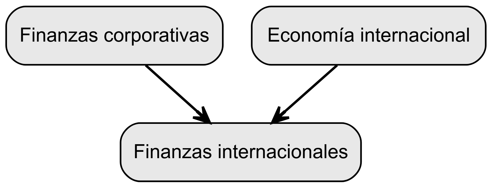

# Orígenes y Conceptos Fundamentales de las Finanzas Internacionales

## Economía Internacional

El campo de las finanzas internacionales es de vital importancia en el ámbito económico global, ya que abarca una amplia gama de temas relacionados con las transacciones financieras entre países y el funcionamiento de los mercados financieros internacionales. A continuación, se exploran los conceptos clave que sustentan las finanzas internacionales.

1.  **Regímenes Cambiarios:** Los regímenes cambiarios se refieren al conjunto de políticas y acuerdos que determinan cómo se fijan los tipos de cambio entre las distintas monedas. Existen diferentes tipos de regímenes cambiarios, como tipos de cambio fijos, flexibles o ajustables, y cada uno tiene implicaciones en la estabilidad monetaria y en las transacciones internacionales.

2.  **Sistema Monetario Internacional:** El sistema monetario internacional comprende las instituciones, acuerdos y mecanismos que regulan las transacciones financieras y el intercambio de monedas entre países. Este sistema facilita el comercio internacional y la inversión al establecer reglas y procedimientos para el intercambio de divisas, los pagos internacionales y la gestión de las reservas internacionales.

3.  **Procesos de Ajuste en la Balanza de Pagos:** La balanza de pagos registra todas las transacciones económicas y financieras entre un país y el resto del mundo. Los procesos de ajuste se refieren a los mecanismos mediante los cuales los países corrigen los desequilibrios en sus balanzas de pagos, como los déficits o los superávits. Estos ajustes pueden implicar cambios en los tipos de cambio, políticas monetarias o fiscales, y afectan la competitividad y la estabilidad económica de los países.

4.  **Determinantes del Tipo de Cambio:** El tipo de cambio es el precio relativo entre dos monedas y juega un papel crucial en las transacciones internacionales. Los factores que influyen en el tipo de cambio incluyen los diferenciales de tasas de interés, la inflación, los flujos de capital, la política económica y las expectativas del mercado. Comprender estos determinantes es fundamental para analizar los movimientos y la volatilidad de las divisas.

5.  **Condiciones de Paridad:** Las condiciones de paridad son teorías que establecen relaciones entre los tipos de cambio y los precios relativos en diferentes países. Estas teorías incluyen la paridad de tasas de interés, que establece una relación entre las tasas de interés y los tipos de cambio, y la paridad de poder adquisitivo, que establece una relación entre los niveles de precios y los tipos de cambio. Estas condiciones proporcionan un marco teórico para entender las interacciones entre las variables económicas y los tipos de cambio.

## Finanzas Corporativas

En el ámbito de las finanzas corporativas, las empresas se enfrentan a desafíos y oportunidades en el contexto de un entorno global. Los conceptos clave en finanzas corporativas internacionales son los siguientes:

1.  **Mercados Financieros Internacionales:** Los mercados financieros internacionales son aquellos en los que se negocian activos financieros, como acciones, bonos, divisas y derivados, entre inversores de diferentes países. Estos mercados proporcionan a las empresas acceso a fuentes de financiamiento globales, permitiéndoles captar capital y gestionar los riesgos asociados a las fluctuaciones de los tipos de cambio y las tasas de interés.

2.  **Operaciones a Escala Mundial:** Las empresas internacionales realizan operaciones comerciales y financieras en múltiples países, lo que implica la gestión de aspectos como el comercio internacional, la inversión extranjera directa y las alianzas estratégicas. Estas operaciones requieren una comprensión profunda de las diferencias en las regulaciones, los sistemas fiscales, los riesgos políticos y los aspectos culturales de cada país.

3.  **Evaluación y Gestión del Riesgo Cambiario:** El riesgo cambiario se refiere a las pérdidas potenciales que una empresa puede sufrir debido a las fluctuaciones adversas en los tipos de cambio. La evaluación y gestión del riesgo cambiario involucra la identificación, medición y aplicación de estrategias para mitigar el impacto de las fluctuaciones cambiarias en los resultados financieros de la empresa. Estas estrategias pueden incluir el uso de instrumentos derivados, como los contratos de futuros o las opciones, para cubrir las exposiciones al riesgo cambiario.

4.  **Financiamiento Internacional:** El financiamiento internacional se refiere a la obtención de capital por parte de las empresas en los mercados financieros internacionales. Esto puede incluir la emisión de bonos en mercados extranjeros, la obtención de préstamos de bancos internacionales o el acceso a inversionistas globales a través de la emisión de acciones en los mercados de valores internacionales. El financiamiento internacional proporciona a las empresas los recursos necesarios para financiar sus operaciones y proyectos a nivel mundial.

5.  **Inversión en Portafolios Internacionales:** La inversión en portafolios internacionales implica la adquisición de activos financieros, como acciones y bonos, emitidos por empresas o gobiernos extranjeros. Los inversores internacionales diversifican sus carteras de inversión para aprovechar las oportunidades de rendimiento y reducir los riesgos asociados con la concentración en un solo país o una sola moneda. La inversión en portafolios internacionales requiere un análisis detallado de los mercados financieros y una evaluación de los riesgos y las oportunidades en cada país.

Al comprender estos conceptos en los campos de la economía internacional y las finanzas corporativas, se puede tener una visión más completa de los aspectos fundamentales que sustentan las transacciones financieras internacionales y las operaciones corporativas en un entorno global en constante cambio.

::::::{.cell layout-align="default"}

:::::{.cell-output-display}

::::{}
`<figure class=''>`{=html}

:::{}

{width="6.5in" height="6.5in" fig-pos='H' fig-env='figure'}
:::
`</figure>`{=html}
::::
:::::
::::::

# Finanzas Internacionales: Conceptos y Relevancia

## ¿Qué son las Finanzas Internacionales?

Las finanzas internacionales constituyen un campo de estudio que se enfoca en analizar los flujos de efectivo y la valuación de activos en un contexto global. Este ámbito abarca tanto los movimientos de capital entre países como la valoración de activos ubicados en diferentes naciones y denominados en diversas monedas. Las finanzas internacionales son fundamentales para comprender y gestionar las transacciones financieras que trascienden las fronteras nacionales.

## Administración Financiera Internacional

La administración financiera internacional se refiere al proceso de toma de decisiones financieras por parte de ejecutivos de empresas multinacionales que operan en un entorno global. Estas decisiones están influenciadas por una serie de factores, como los riesgos asociados a los flujos de efectivo a través de distintos marcos políticos y legales, así como la exposición a fluctuaciones en los tipos de cambio. La administración financiera internacional implica considerar tanto los aspectos económicos como los monetarios de la economía global.

## Importancia del Riesgo Político y de Tipo de Cambio

En el ámbito de las finanzas internacionales, es crucial tener en cuenta los riesgos asociados a los flujos de efectivo en diferentes países y monedas. El riesgo político se refiere a la incertidumbre y las posibles consecuencias que surgen de los cambios en los marcos políticos y legales de un país. Por otro lado, el riesgo de tipo de cambio se relaciona con la volatilidad en las tasas de cambio entre distintas monedas. Estos riesgos pueden afectar significativamente los resultados financieros de las organizaciones y deben ser gestionados adecuadamente.

## Imperfecciones de los Mercados Internacionales

Los mercados financieros internacionales presentan diversas imperfecciones que pueden generar tanto amenazas como oportunidades para las organizaciones. Entre estas imperfecciones se encuentran los costos de transacción, los costos de información, las restricciones legales, las diferencias en los sistemas impositivos, la movilidad imperfecta de los factores de producción y las obstrucciones al comercio, entre otros. Comprender y manejar estas imperfecciones es esencial para aprovechar las oportunidades y mitigar los riesgos asociados a las operaciones internacionales.

## Generación de Valor y Problema de Agencia

El objetivo principal en las finanzas internacionales es generar valor para las empresas. La fórmula utilizada para medir este valor es la siguiente:

$$
Valor = \sum_{t=1}^{n} \frac{E(FE_t)}{(1+k)^t}
$$

Donde $E(FE_t)$ representa los flujos de efectivo esperados en el periodo t, k es la tasa de descuento y n es el número total de periodos considerados. Sin embargo, en un entorno financiero cada vez más integrado e interdependiente, surge el problema de agencia, que implica conflictos de intereses entre los diferentes participantes del mercado y los ejecutivos de las organizaciones. Este problema debe ser abordado de manera efectiva para garantizar la maximización del valor para los accionistas y la sostenibilidad de las empresas en el largo plazo.

## Globalización: Un Nuevo Paradigma Económico

### La Globalización

La globalización es un proceso de integración económica, social y política que tiene como objetivo la creación de un mercado mundial unificado. En este mercado, se comercian productos similares, producidos por empresas cuyas operaciones se extienden a varios países, lo que dificulta determinar su origen exacto. La globalización no solo se manifiesta en el ámbito de la producción, sino también en la inversión y el consumo.

### La Globalización en Distintas Áreas

El proceso de globalización no se desarrolla de manera uniforme en todas las áreas. Algunas regiones están más avanzadas en términos de integración económica global que otras. Por ejemplo, el mercado de divisas se ha vuelto más integrado, con la existencia de un precio único para las diferentes monedas. Asimismo, los mercados de capital están experimentando un rápido avance en su integración, facilitando la movilidad de los flujos financieros a nivel mundial.

### Factores que Impulsan la Globalización

La creciente globalización se ha visto influenciada por diversos factores. Algunos de los principales son:

1.  **Reducción de barreras comerciales:** Después de la Segunda Guerra Mundial, se produjo un aumento significativo en el comercio mundial debido a la reducción de las barreras arancelarias y no arancelarias. Esto ha permitido un mayor intercambio de bienes y servicios entre países.

2.  **Estandarización de bienes y servicios:** La globalización ha llevado a una cierta homogeneización de los gustos y preferencias a nivel mundial. Los consumidores tienen acceso a productos estandarizados y marcas reconocidas internacionalmente.

3.  **Encogimiento del espacio geográfico:** Los avances en las telecomunicaciones y el transporte han acortado las distancias físicas entre países. Las mejoras en las comunicaciones han reducido los costos de las llamadas internacionales, mientras que los avances en el transporte han disminuido los costos y los tiempos de viaje. Esto ha contribuido a que el mundo parezca más pequeño y accesible.

4.  **Cambios políticos y económicos:** El colapso del sistema comunista y el fin de la Guerra Fría han permitido la apertura de nuevos mercados y la integración de economías anteriormente aisladas. Además, se ha observado un movimiento global hacia el liberalismo, tanto en el ámbito político, con la democratización de los gobiernos, como en el económico, con la adopción del libre mercado y la reducción del papel del Estado en la economía.

5.  **Liberalización financiera:** A partir de la década de 1980, se inició un proceso de liberalización financiera que ha facilitado la movilidad de los flujos de capital a nivel internacional. Esto ha permitido una mayor integración de los mercados financieros y una mayor disponibilidad de recursos para la inversión.

6.  **Tercera Revolución Industrial:** La introducción de tecnologías avanzadas y la reestructuración de los procesos productivos han transformado la forma en que se organizan las empresas y se llevan a cabo las actividades económicas. Esta revolución ha tenido un impacto significativo en la globalización, ya que ha permitido una mayor interconexión y colaboración a nivel global.

### Desafíos y Oportunidades para los Países en Desarrollo

En el contexto de la globalización, los países en desarrollo se enfrentan a un doble desafío. Por un lado, deben cerrar la brecha que los separa de los países desarrollados en términos de desarrollo económico y social. Por otro lado, deben reestructurar sus economías para ser competitivos en la nueva economía global. Esto implica la adopción de políticas que promuevan la innovación, el desarrollo de capacidades y la apertura a los mercados internacionales.

## Medidas de la Globalización: Un Mundo Cada Vez más Integrado

### Participación de las Exportaciones en el Producto Interno Bruto (PIB) Mundial

La participación de las exportaciones en el PIB mundial es una medida que indica el grado de integración económica a nivel global. Durante las últimas cinco décadas, esta participación ha experimentado un crecimiento significativo, pasando de un 7% a un 20%. Este aumento demuestra que las economías están cada vez más interconectadas a través del comercio internacional.

### Tasa de Crecimiento de las Exportaciones en Comparación con el Crecimiento Económico

La tasa de crecimiento de las exportaciones en relación con el crecimiento económico es otra medida importante de la globalización. En la segunda mitad del siglo XX, las exportaciones crecieron a un ritmo tres veces superior al crecimiento del PIB. Entre 1950 y 2000, el volumen de las exportaciones mundiales se multiplicó por 100. Para muchas empresas, las exportaciones son una fuente crucial de crecimiento en términos de ventas y ganancias.

### Porcentaje de la Producción Industrial Atribuido a Empresas Multinacionales

El porcentaje de la producción industrial atribuido a empresas multinacionales ubicadas en un país es un indicador del grado de internacionalización de la economía. Aunque no existen datos a nivel mundial, en países con economías altamente globalizadas, como Irlanda y Hungría, este porcentaje supera el 70%. En Canadá, por ejemplo, alcanza el 50%. Esto refleja la presencia significativa de empresas multinacionales y su impacto en la producción industrial.

### Monto de Transacciones en los Mercados Financieros Internacionales

El monto de las transacciones en los mercados financieros internacionales es una medida clave para evaluar la globalización económica. En 2004, el promedio diario de transacciones en el mercado de divisas alcanzó 1.9 billones (millones de millones) de dólares. Esto significa que, en promedio, cada habitante del planeta estaba involucrado en transacciones por un valor de 320 dólares diarios. Esta cifra destaca la importancia de los flujos financieros internacionales y su impacto en la economía global.

### Grado de Internacionalización de los Portafolios de Inversión

El grado de internacionalización de los portafolios de inversión es una medida que muestra el alcance de las inversiones en activos financieros en diferentes países. En un entorno globalizado, los inversionistas buscan diversificar sus portafolios a nivel internacional para reducir riesgos y aprovechar oportunidades en diferentes mercados. Esta internacionalización de los portafolios refleja la creciente interconexión de los mercados financieros y la búsqueda de rendimientos en un contexto global.

## Impacto de la Globalización en el Crecimiento Empresarial y Macroeconómico

### Apertura Económica y Crecimiento de la Inversión Extranjera Directa (IED)

Desde el inicio del proceso de apertura económica en 1986, se ha observado un crecimiento sin precedentes en la Inversión Extranjera Directa (IED). La IED se refiere a la inversión realizada por empresas extranjeras en países diferentes al de su origen, con el propósito de establecer operaciones comerciales o productivas. Esta creciente IED ha sido un resultado directo de la globalización, que ha permitido la expansión de las empresas a nivel internacional y la búsqueda de nuevos mercados y oportunidades.

### Crecimiento de los Instrumentos Derivados y Flujos Internacionales de Capital

En la década de 1990, se observó un rápido crecimiento en los contratos de los instrumentos derivados, con una tasa anual de crecimiento del 40%. Los instrumentos derivados son productos financieros cuyo valor se deriva del valor de un activo subyacente, como acciones, bonos, commodities o tipos de cambio. Este crecimiento refleja la mayor interdependencia y complejidad de los mercados financieros internacionales.

Asimismo, los flujos internacionales de capital también han aumentado como resultado de la globalización. Los flujos de capital representan la transferencia de fondos entre países para la inversión en diferentes activos financieros, como acciones, bonos y bienes raíces. Estos flujos reflejan la creciente interconexión de los mercados financieros y la búsqueda de rendimientos en un contexto global.

### Clasificación de Empresas según su Integración en la Economía Mundial

Las empresas pueden ser clasificadas según su grado de integración en la economía mundial. Estas clasificaciones incluyen:

1.  Empresa Internacional: Una empresa que participa en actividades de exportación e importación.
2.  Empresa Multinacional: Una empresa que traslada parte de sus operaciones, como diseño, investigación, publicidad o producción, a otro país.
3.  Empresa Transnacional: Una empresa cuyas actividades multinacionales forman una red compleja, dificultando determinar su país de origen y diferenciar entre la matriz y las sucursales.

Estas clasificaciones reflejan la creciente presencia y complejidad de las empresas en un entorno globalizado.

### Ventajas de las Empresas Multinacionales y Beneficios Macroeconómicos de la Globalización

Las empresas multinacionales (CMN) obtienen diversas ventajas de su presencia en múltiples mercados:

-   Acceso a economías de escala y alcance debido al mercado ampliado.
-   Diversificación de riesgos a través de la variación en los ciclos económicos de diferentes países.
-   Acceso a fuentes de financiamiento más económicas y diversas.
-   Mayor conocimiento de las nuevas tendencias, tecnologías y formas de gestión a través de su presencia en varios mercados, lo que mejora su capacidad de respuesta a los desafíos.

A nivel macroeconómico, la integración en la economía global ofrece varias ventajas:

-   Competencia por la inversión extranjera, promoviendo la estabilidad macroeconómica, baja inflación, finanzas sólidas e instituciones financieras estables.
-   Estimulación de la competencia, productividad y eficiencia en la asignación de recursos a través de políticas de apertura al exterior. - Impulso de reformas estructurales, inversiones en infraestructura y capital humano, y fortalecimiento de las instituciones para mantener la competitividad internacional. - Transferencia más rápida de conocimiento científico, tecnológico y administrativo.

| Puesto | Nombre de la Compañía | Ventas (billones de dólares) | Beneficios (billones de dólares) | Activos (billones de dólares) | Valor de Mercado (billones de dólares) |
|--------|-----------------------|------------------------------|---------------------------------|------------------------------|-------------------------------------|
|   1    | Walmart               | 559.2                        | 15.5                            | 2365.7                       | 407.0                               |
|   2    | Sinopec Group         | 407.0                        | 6.8                             | 333.4                        | 146.1                               |
|   3    | State Grid            | 383.2                        | 7.9                             | 780.0                        | 329.9                               |
|   4    | China National Petroleum Corporation | 379.1               | 2.4                             | 595.0                        | 197.4                               |
|   5    | Saudi Aramco          | 330.5                        | 49.0                            | 441.6                        | 1899.5                              |
|   6    | Amazon                | 386.1                        | 21.3                            | 321.2                        | 1556.4                              |
|   7    | Volkswagen            | 268.4                        | 13.0                            | 484.9                        | 121.1                               |
|   8    | Toyota Motor          | 249.4                        | 19.9                            | 619.4                        | 275.4                               |
|   9    | Apple                 | 294.2                        | 57.4                            | 354.1                        | 2388.1                              |
|   10   | Exxon Mobil           | 264.9                        | -22.4                           | 433.5                        | 240.3                               |

: Las empresas mas grandes del mudno para el 2021 {#tbl-1}

::::::{.cell layout-align="default"}

:::::{.cell-output-display}

::::{}
`<figure class=''>`{=html}

:::{}

{width="6.5in" height="6.5in" fig-pos='H' fig-env='figure'}
:::
`</figure>`{=html}
::::
:::::
::::::

## Críticas a la Globalización

La globalización, a pesar de sus beneficios y oportunidades, también ha sido objeto de críticas y preocupaciones por parte de diversos actores. A continuación, se presentan algunas de las principales críticas a la globalización:

### 1. Excesiva volatilidad de los precios

La globalización ha llevado a una mayor interconexión de los mercados internacionales, lo que puede resultar en una mayor volatilidad de los precios de los bienes y servicios. Los cambios en la demanda y la oferta a nivel global, así como los eventos económicos y políticos, pueden tener un impacto significativo en los precios de los productos. Esta volatilidad puede dificultar la planificación y la estabilidad económica tanto a nivel microeconómico como macroeconómico.

### 2. Efecto de contagio

La interconexión de los mercados financieros y económicos a nivel global puede llevar a un efecto de contagio, donde las crisis económicas o financieras en un país se propagan rápidamente a otros países. Esto se debe a la interdependencia de las economías y a la rápida transmisión de información y capitales a través de las fronteras. El efecto de contagio puede amplificar las crisis y dificultar su contención.

### 3. Tendencia hacia la deflación

Algunos críticos argumentan que la globalización ha llevado a una tendencia hacia la deflación, es decir, una disminución generalizada y persistente de los precios. Esto se debe a la competencia global y la presión sobre los costos de producción, lo que puede llevar a una reducción de los precios de los bienes y servicios. La deflación puede tener efectos negativos en la economía, como la disminución de los ingresos y la demanda agregada.

### 4. Incremento de la desigualdad distributiva

Se argumenta que la globalización ha contribuido al aumento de la desigualdad distributiva en muchos países. A medida que las empresas se expanden internacionalmente, tienden a buscar la maximización de sus beneficios, lo que puede conducir a la explotación de la mano de obra barata en países en desarrollo. Además, los beneficios de la globalización pueden no distribuirse equitativamente, lo que resulta en una mayor concentración de riqueza en manos de unos pocos, mientras que otros experimentan un estancamiento o disminución de sus ingresos.

### 5. Tensión de conflictos por limitados mercados y recursos

La globalización también ha generado tensiones y conflictos relacionados con la competencia por mercados y recursos limitados. A medida que las empresas buscan expandirse y obtener ventajas competitivas, pueden surgir conflictos entre países por el acceso a recursos naturales, como petróleo, minerales o agua. Estos conflictos pueden tener implicaciones políticas, económicas y sociales.

### 6. Impacto negativo en los trabajadores de países desarrollados

Una crítica común es que la globalización perjudica a los trabajadores en los países desarrollados, ya que las empresas trasladan la producción a países con mano de obra más barata. Esto puede resultar en la pérdida de empleos en los países desarrollados y en una disminución de los salarios. Los trabajadores pueden enfrentar dificultades para competir en un mercado

laboral globalizado y pueden experimentar una mayor inseguridad laboral.

### 7. Reducción de la soberanía nacional

La globalización plantea desafíos para la soberanía nacional, ya que implica una mayor interdependencia y la necesidad de coordinación y cooperación entre los países. Al participar en acuerdos comerciales y organizaciones internacionales, los países pueden enfrentar limitaciones a su autonomía para tomar decisiones económicas y políticas. Algunos críticos argumentan que esto puede socavar la capacidad de los gobiernos para proteger los intereses nacionales y satisfacer las necesidades de sus ciudadanos.

### 8. Crisis financieras cada vez más graves

Otra crítica importante es que la globalización ha llevado a una mayor frecuencia y gravedad de las crisis financieras. La interconexión de los mercados financieros internacionales ha aumentado la rapidez con la que las crisis se propagan y puede dificultar la implementación de medidas efectivas para controlarlas. Los flujos de capital especulativos y la falta de regulación adecuada pueden contribuir a la aparición de crisis financieras sistémicas.

# Publicaciones Similares

Si te interesó este artículo, te recomendamos que explores otros blogs y recursos relacionados que pueden ampliar tus conocimientos. Aquí te dejo algunas sugerencias:

1. [Finanzas Internacionales Globalizacion](https://achalmaedison.netlify.app/finanzas/finanzas-internacionales/2023-06-16-finanzas-internacionales-globalizacion) Lee sin conexión 📚 [PDF](https://achalmaedison.netlify.app/finanzas/finanzas-internacionales/2023-06-16-finanzas-internacionales-globalizacion/index.pdf)
2. [Sistema Monetario Internacional](https://achalmaedison.netlify.app/finanzas/finanzas-internacionales/2023-06-17-sistema-monetario-internacional) Lee sin conexión 📚 [PDF](https://achalmaedison.netlify.app/finanzas/finanzas-internacionales/2023-06-17-sistema-monetario-internacional/index.pdf)
3. [Balanza Pagos](https://achalmaedison.netlify.app/finanzas/finanzas-internacionales/2023-06-23-balanza-pagos) Lee sin conexión 📚 [PDF](https://achalmaedison.netlify.app/finanzas/finanzas-internacionales/2023-06-23-balanza-pagos/index.pdf)

Esperamos que encuentres estas publicaciones igualmente interesantes y útiles. ¡Disfruta de la lectura!

