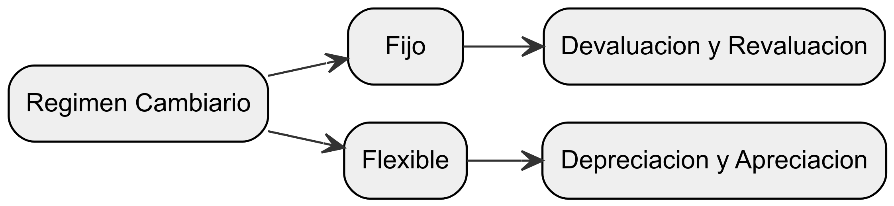
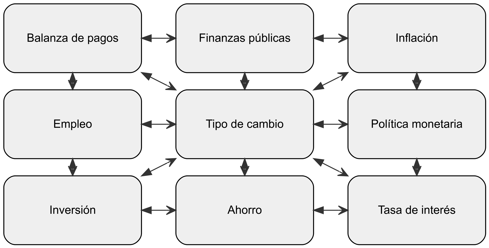

# El Sistema Monetario Internacional

El sistema monetario internacional es un marco institucional establecido para facilitar los pagos internacionales, regular los flujos de capital y determinar los tipos de cambio entre las diferentes monedas. Este sistema se basa en acuerdos internacionales y requiere un alto grado de cooperación entre los gobiernos de los principales países. En el contexto de la globalización, donde los flujos internacionales de bienes, servicios y capitales son cada vez más intensos, se hace necesaria la existencia de instituciones que regulen y faciliten estas transacciones.

## Regímenes cambiarios y apertura

Es importante destacar que los países pueden seguir diferentes reglas en lo que respecta a los regímenes cambiarios y el grado de apertura de sus economías. Algunos países optan por tipos de cambio fijos, donde el valor de su moneda se mantiene constante en relación con otra moneda o una canasta de monedas. Otros países tienen tipos de cambio flexibles, donde el valor de su moneda fluctúa en respuesta a las fuerzas del mercado. Además, el grado de apertura de una economía se refiere a la medida en que permite el comercio internacional y los flujos de capital.

## Volatilidad y tipos de cambio

En la actualidad, los mercados financieros internacionales se caracterizan por una alta volatilidad en todas las variables económicas, especialmente en los tipos de cambio. Esta volatilidad se debe a las constantes modificaciones de las variables económicas, el progreso tecnológico y la liberalización financiera. Los tipos de cambio fluctúan en respuesta a factores como las tasas de interés, la inflación, los flujos de capital y los eventos económicos y políticos a nivel mundial.

## Divisas y cotización de tipos de cambio

Una divisa es la moneda de otro país, siempre y cuando sea libremente convertible a otras monedas en el mercado cambiario. La cotización del tipo de cambio se refiere a la forma en que se establece el valor de una moneda en relación con otra. La manera más común de cotizar el tipo de cambio es mediante la cantidad de la moneda nacional necesaria para comprar un dólar estadounidense (USD). Por ejemplo, si se requieren 1.5 unidades de la moneda nacional para comprar 1 USD, se diría que el tipo de cambio es de 1.5.

# Regímenes Cambiarios

El régimen cambiario se refiere a un conjunto de reglas que describen el papel que desempeña el Banco Central en la determinación del tipo de cambio. El Fondo Monetario Internacional (FMI) clasifica los regímenes cambiarios en ocho categorías, que van desde aquellos donde no existe una moneda nacional legal hasta aquellos basados en la flotación libre del tipo de cambio. Cada régimen tiene implicaciones diferentes para la política monetaria, la estabilidad económica y el comercio internacional.

**1. No existe moneda nacional legal**

En este régimen, el país no tiene su propia moneda nacional legal y utiliza la moneda de otro país, como el dólar estadounidense o el euro, como medio de pago y unidad de cuenta. Ejemplos de países en este régimen son Ecuador y Panamá, que adoptaron el dólar estadounidense como su moneda oficial.

**2. Consejo monetario o Caja de conversión**

Este régimen se basa en un compromiso legislativo en el que se establece que la moneda nacional debe cambiarse por una moneda extranjera específica a un tipo de cambio determinado. Las autoridades emisoras aceptan restricciones para cumplir con esta obligación legal. Ejemplos de países con este régimen son Bosnia y Herzegovina, Brunei, Bulgaria, Hong Kong, Djibouti y Estonia.

**3. Moneda nacional pegada a una moneda o una canasta de monedas**

En este régimen de tipo de cambio fijo o convertible, el país vincula su moneda a una moneda importante o a una canasta de monedas. El valor del tipo de cambio se determina en función del valor de las monedas de los principales socios comerciales o financieros. Dentro de este régimen, existe el régimen de tipo de cambio fijo, donde el tipo de cambio fluctúa dentro de un margen estrecho alrededor de un tipo central establecido.

**4. Moneda nacional pegada, pero dentro de bandas horizontales**

En este régimen, la moneda nacional se mantiene dentro de ciertos márgenes de fluctuación en torno a un tipo de cambio central fijo. Algunos países también participan en el mecanismo de tipos de cambio del sistema monetario europeo. La amplitud de la banda determina el grado de discrecionalidad de la política monetaria. Ejemplos de países en este régimen son Dinamarca, Chipre, Egipto, Hungría y Tonga.

**5. Tipo de cambio de ajuste gradual**

En este régimen, el tipo de cambio se ajusta periódicamente en pequeñas magnitudes, ya sea a una tasa fija o en respuesta a cambios en indicadores cuantitativos. El objetivo es generar ajustes en el valor de la moneda en línea con la inflación retrospectiva o proyectada. Se imponen restricciones a la política monetaria para mantener el tipo de cambio flexible, similar a un régimen de tipo de cambio fijo. Ejemplos de países en este régimen son Bolivia, Costa Rica, Nicaragua e Islas Salomón.

**6. Tipo de cambio ajustable dentro de una banda**

En este régimen, la moneda se mantiene dentro de ciertos márgenes de fluctuación alrededor de un tipo de cambio central, que se ajusta periódicamente a una tasa fija o en respuesta a cambios en indicadores cuantitativos. El grado de flexibilidad del tipo de cambio depende de la amplitud de la banda. Puede haber bandas simétricas alrededor de un tipo central móvil o bandas asimétricas que se amplían gradualmente. La política monetaria está limitada por la necesidad de mantener el tipo de cambio dentro de la banda.

**7. Flotación administrada sin una ruta anunciada**

En este régimen, la autoridad monetaria interviene activamente en el mercado cambiario para determinar el tipo de cambio, sin comprometerse con una trayectoria preanunciada. Se utilizan indicadores como el saldo de la Balanza de Pagos, las reservas internacionales y la evolución del mercado paralelo para regular el tipo de cambio. Los ajustes pueden no ser automáticos y la intervención tiene como objetivo moderar la tasa de variación y evitar fluctuaciones excesivas del tipo de cambio.

**8. Flotación libre**

En este régimen, el tipo de cambio se determina mediante el juego de oferta y demanda en el mercado. La intervención del Banco Central tiene como objetivo moderar la tasa de variación y evitar fluctuaciones excesivas, pero no se establece un nivel específico del tipo de cambio. En este régimen, la política monetaria es independiente de la política cambiaria. Ejemplos de países que siguen este régimen son Argentina, Australia, Brasil, Canadá, Estados Unidos, Japón, México y Reino Unido.

::::::{.cell layout-align="default"}

:::::{.cell-output-display}

::::{#fig-1}

:::{}

{width="6.5in" height="6.5in" fig-pos='H' fig-env='figure'}
:::

Regímenes cambiarios
::::
:::::
::::::

En una economía abierta, la política cambiaria juega un papel crucial en la consecución de los objetivos de la política macroeconómica, que incluyen el logro de un equilibrio tanto interno como externo.

Dado que las economías abiertas se enfrentan a diversos desafíos, la conducción de la política cambiaria depende de las prioridades establecidas en variables clave como la inflación, el desempleo, las tasas de interés, la balanza comercial y el crecimiento económico. Estas variables influyen en la toma de decisiones relacionadas con el tipo de cambio y su gestión.

La evolución del sistema monetario internacional en el siglo XX ha estado marcada por la confrontación entre regímenes cambiarios fijos y flexibles, así como por la búsqueda de un equilibrio tanto interno como externo en los objetivos macroeconómicos. Esta historia refleja los esfuerzos constantes por encontrar el enfoque más adecuado para manejar las fluctuaciones cambiarias y mantener la estabilidad en la economía global.

Es importante tener en cuenta que ningún régimen cambiario puede funcionar eficientemente si no se complementa con políticas fiscales y monetarias responsables y prudentes. Estas políticas son fundamentales para respaldar y fortalecer el régimen cambiario elegido, garantizando así su efectividad y sostenibilidad a largo plazo.

::::::{.cell layout-align="default"}

:::::{.cell-output-display}

::::{#fig-2}

:::{}

{width="6.5in" height="6.5in" fig-pos='H' fig-env='figure'}
:::

Interrelaciones entre tipo de cambio, variables y políticas económicas
::::
:::::
::::::

# La Unión Monetaria Europea y el Euro

En 1979, los países de la Comunidad Económica Europea (CEE) establecieron el Sistema Monetario Europeo (SME) con el objetivo de crear una zona de estabilidad monetaria en Europa, coordinar políticas cambiarias y preparar el camino para la Unión Económica Europea. Sin embargo, el sistema no logró su funcionamiento óptimo debido a la falta de coordinación de las políticas macroeconómicas entre los países miembros.

## La creación del Euro y la Unión Monetaria Europea

En 1991, los 12 miembros de la CEE firmaron el Tratado de Maastricht, el cual estableció un cronograma para la creación de la Unión Europea (UE) con una moneda común, el Euro, y un banco central común. Los países acordaron coordinar sus políticas fiscales y monetarias, y se establecieron criterios de convergencia.

## Los compromisos y criterios de convergencia

Cada país se comprometió a mantener el déficit presupuestario por debajo del 3% del Producto Interno Bruto (PIB), la deuda pública por debajo del 60% del PIB, lograr una baja inflación y mantener el tipo de cambio dentro de un rango establecido.

## Ventajas del Euro y la Unión Monetaria

La adopción del Euro ha generado diversas ventajas para los países miembros de la UE, entre las cuales se destacan:

1.  **Reducción de los costos de transacción:** Estimaciones indican que los costos de transacción se redujeron en un 0.4% del PIB en la UE.

2.  **Eliminación de la incertidumbre cambiaria:** El Euro ha fomentado la competencia y la inversión al eliminar la volatilidad en los tipos de cambio.

3.  **Homogeneización y reducción de precios:** El Euro ha contribuido a la homogeneización y reducción de precios en la zona Euro.

4.  **Promoción del comercio y la reestructuración industrial:** La moneda común ha impulsado el comercio y la reestructuración industrial a nivel continental, lo que ha aumentado la eficiencia y competitividad de la economía europea.

5.  **Desarrollo de un mercado de capital:** La Unión Monetaria ha fomentado el desarrollo de un mercado de capital en la zona Euro, reduciendo los costos de capital para las empresas y brindando oportunidades a los inversionistas.

6.  **Cooperación política y paz:** El Euro ha contribuido a una mayor cooperación política entre los países miembros y se considera un factor de estabilidad que promueve la paz en Europa.

## Desventajas de la moneda común

A pesar de las ventajas mencionadas, la moneda común también presenta ciertas desventajas:

1.  Pérdida de soberanía monetaria y cambiaria: Los gobiernos de los países miembros pierden la capacidad de tomar decisiones independientes en materia monetaria y cambiaria.

2.  Choques asimétricos y recursos limitados: En caso de enfrentar un choque asimétrico, el único recurso para un país afectado es la deflación y la reducción de salarios nominales, lo que puede generar dificultades económicas y sociales.

3.  Impacto diferencial en países con monedas fuertes y débiles: Al adoptar el Euro, los países que tenían monedas débiles, como Italia y España, han experimentado beneficios relativos en comparación con países que tenían monedas fuertes, como Alemania y los Países Bajos.

# Historia del sistema monetario internacional

## El patrón oro clásico: 1875-1914

En el periodo del patrón oro clásico, que abarcó desde 1875 hasta 1914, el sistema monetario internacional se basaba en el uso del oro como respaldo y base monetaria. Este sistema implicaba que la cantidad de dinero en circulación en cada país estaba limitada por la cantidad de oro que poseía. El patrón oro garantizaba la estabilidad del valor del dinero y establecía mecanismos de ajuste para corregir los desequilibrios en la balanza de pagos.

**Ajuste a los desequilibrios en la balanza de pagos bajo el patrón oro**

Existían dos mecanismos principales para corregir los desequilibrios en la balanza de pagos bajo el patrón oro. El primero, propuesto por los economistas clásicos, se basaba en la relación entre la balanza de pagos, la cantidad de dinero en la economía, el nivel de precios y las tasas de interés. En caso de un déficit en la balanza de pagos, se producía una salida de oro y una reducción de la oferta monetaria. Esto a su vez generaba una disminución de los precios internos, mejoraba la competitividad del país en términos de exportaciones y reducía las importaciones. Además, las tasas de interés se incrementaban, lo que atraía capital extranjero en el corto plazo. Estos ajustes permitían restablecer el equilibrio externo.

El enfoque mercantilista, que proponía restricciones al comercio para evitar la salida de oro, fue refutado por Hume. Él demostró que la riqueza de un país no dependía de la acumulación de oro, sino de su capacidad de producción de bienes y servicios. El proceso de ajuste bajo el patrón oro era automático y rápido, pero requería una disminución de la actividad económica (recesión) para lograr una reducción de los precios (deflación), lo que afectaba el nivel de vida de la población.

**Reglas del juego y costos sociales**

Para facilitar el ajuste bajo el patrón oro, se establecieron reglas del juego. En caso de un déficit en la balanza de pagos, el banco central del país estaba obligado a vender activos internos (instrumentos de deuda) para reducir aún más la base monetaria y acelerar el ajuste. Esto incrementaba las tasas de interés y restringía el crédito. Respetar estas reglas hacía el proceso de ajuste más doloroso pero más rápido.

Sin embargo, los países superavitarios no siempre respetaban estas reglas, lo que recaía principalmente en los países deficitarios. Esto generaba inestabilidad interna y resultaba en recesiones frecuentes y profundas. Aunque el patrón oro se caracterizó por una baja inflación, los costos sociales de este sistema fueron elevados.

**Limitaciones y práctica del ajuste bajo el patrón oro**

En la práctica, el mecanismo de ajuste no siempre funcionaba como se describía en la teoría. La reducción de los precios era poco frecuente debido a las políticas de esterilización implementadas por las autoridades monetarias y a la rigidez de los precios a la baja. Se requería un largo periodo de recesión para que los precios disminuyeran. En realidad, el incremento de las importaciones, principal causante de los desequilibrios en la balanza de pagos, resultaba en una reducción de la actividad económica debido al desplazamiento de la demanda interna, la disminución de la inversión y la reducción de los ingresos de la población.

Investigaciones empíricas del periodo del patrón oro revelan que el mecanismo real de ajuste se basaba en los movimientos de capital a corto plazo, atraídos por las altas tasas de interés. Además, se producía una reducción de la actividad económica en los países deficitarios. Los precios solo bajaban en raras ocasiones. Ante este escenario, las autoridades buscaban alternativas no recesivas para lograr el equilibrio externo, como el proteccionismo, restricciones a los movimientos internacionales de capital y políticas de esterilización.

## El periodo de Entreguerras (1918-1939)

El periodo de Entreguerras, que abarca desde 1918 hasta 1939, se caracterizó por desafíos significativos para el sistema monetario internacional, especialmente el patrón oro, debido a los efectos de la Primera Guerra Mundial y la posterior Gran Depresión.

**El impacto de la Primera Guerra Mundial en el patrón oro**

La Primera Guerra Mundial tuvo un efecto disruptivo en el funcionamiento del patrón oro. El flujo internacional de bienes y capitales se vio interrumpido y el oro se convirtió en la única forma de pago externo. Durante el periodo de 1918 a 1923, Alemania y otros países experimentaron episodios de hiperinflación sin precedentes en la historia. Los intentos de regresar al patrón oro, realizados por Estados Unidos en 1918, Gran Bretaña en 1925 y Francia en 1928, fracasaron repetidamente.

**El desafío de establecer tipos de cambio realistas**

El problema no resuelto durante este periodo fue cómo establecer tipos de cambio que reflejaran las realidades económicas de la posguerra. Los países que intentaban volver al patrón oro no sabían qué paridad garantizaría el equilibrio externo. En este sentido, la teoría de la paridad del poder adquisitivo desempeñó un papel relevante al intentar determinar las relaciones de cambio que reflejaran el poder adquisitivo de las diferentes monedas.

**La Gran Depresión y el abandono del patrón** **oro**

El periodo de 1929 a 1939 es conocido como la Gran Depresión, y marcó un hito importante en la historia económica mundial. Con el colapso del sistema bancario en Austria en 1931, las principales naciones abandonaron el patrón oro. En 1934, Estados Unidos implementó un patrón oro modificado, fijando el valor de una onza de oro en 35 dólares. Sin embargo, todos los intentos de regresar al patrón oro resultaron en recesiones e inestabilidad política.

**Devaluaciones competitivas y políticas proteccionistas**

En un intento por resolver los desequilibrios internos, muchos países recurrieron a devaluaciones competitivas para fomentar su empleo interno y "exportar el desempleo" a otros países. Estas devaluaciones buscaban aumentar las exportaciones y reducir las importaciones. Además, se implementaron políticas proteccionistas, como altos aranceles, cuotas y medidas administrativas, que buscaban "empobrecer al vecino". Sin embargo, estas políticas provocaron represalias y desencadenaron "guerras comerciales", perjudicando a todos los participantes.

**La libre flotación de las principales divisas y la especulación**

Durante la Gran Depresión, la libre flotación de las principales divisas en los mercados cambiarios no lograba establecer paridades de equilibrio. Los especuladores sistemáticamente elevaban el valor de las monedas fuertes y reducían el valor de las monedas débiles, generando mayores inestabilidades en los tipos de cambio.

## El sistema de Bretton Woods (1944-1971): Cooperación monetaria y colapso

El sistema de Bretton Woods, establecido en la Conferencia de Bretton Woods en julio de 1944, fue un marco internacional diseñado para promover el crecimiento económico, el comercio y la estabilidad económica.

**Los objetivos y requisitos del sistema de Bretton Woods**

El sistema de Bretton Woods se estableció con los siguientes objetivos:

- Promover la cooperación monetaria internacional.
- Facilitar el crecimiento del comercio.
- Mantener la estabilidad de los tipos de cambio.
- Establecer un sistema multilateral de pagos.
- Crear una base de reserva internacional.

**Las instituciones del sistema de Bretton Woods**

El sistema de Bretton Woods se basaba en tres instituciones principales:

- **Fondo Monetario Internacional (FMI):** Encargado de supervisar la cooperación monetaria internacional, proporcionar asistencia financiera y promover la estabilidad cambiaria.
- **Banco Mundial:** Establecido para financiar proyectos de desarrollo económico y reducir la pobreza en los países miembros.
- **Acuerdo General sobre Aranceles Aduaneros y Comercio (GATT):** Un acuerdo multilateral destinado a promover el comercio internacional y reducir las barreras comerciales.

**El régimen cambiario y el patrón oro de cambio**

El sistema de Bretton Woods se basó en el patrón oro de cambio, donde cada país fijaba el valor de su moneda en términos de oro o dólares estadounidenses. Los tipos de cambio debían mantenerse dentro de un rango de variación del 1% de su paridad en oro. Para hacer frente a los desequilibrios temporales, los países utilizaban sus reservas y préstamos del FMI. En casos de desequilibrios fundamentales, el FMI permitía ajustes en las paridades.

**Funcionamiento y evolución del sistema de Bretton Woods**

Durante los primeros años, el sistema de Bretton Woods fue exitoso. Sin embargo, se enfrentó a desafíos, como la resistencia de los países industrializados en desequilibrio fundamental para ajustar el valor de sus monedas y las frecuentes devaluaciones en los países en desarrollo. Para abordar estos problemas, el FMI realizó ajustes y modificaciones a su funcionamiento. Además, en 1969 se crearon los Derechos Especiales de Giro (DEG) como una unidad alternativa de reserva para abordar la escasez de oro.

**El problema de la balanza de pagos de Estados Unidos**

Después de la Segunda Guerra Mundial, Estados Unidos experimentó crecientes déficits en su balanza de pagos. A pesar de ser la moneda de reserva internacional, la demanda del dólar superó su disponibilidad en el mercado. Estados Unidos perdió una cantidad significativa de sus reservas en oro durante este periodo.

**El colapso del sistema de Bretton Woods**

La incapacidad de Estados Unidos para reducir sus déficits y la falta de confianza en el dólar condujeron al colapso del sistema. En 1971, se produjo una fuga masiva de capitales de Estados Unidos debido a las expectativas de devaluación del dólar. Ante los intentos de algunos bancos centrales europeos de convertir sus reservas de dólares en oro, Estados Unidos suspendió la convertibilidad del dólar en oro y estableció una sobretasa del 10% a las importaciones. A pesar del intento del Acuerdo Smithsoniano en 1971 de devaluar el dólar y revaluar otras monedas, no pudo restablecer la confianza. Finalmente, en 1973, los principales países adoptaron el régimen cambiario de libre flotación.

**Causas del derrumbe del sistema de Bretton Woods**

El sistema de patrón oro de cambio dependía de la confianza internacional en un solo país, lo cual fue una debilidad estructural. Los costos de ajuste de los tipos de cambio entre las principales monedas resultaron elevados en la práctica. Además, las políticas expansivas de Estados Unidos crearon un fenómeno de "exportación de la inflación", lo que llevó a la libre flotación de las monedas como opción para evitar "importar la inflación" de Estados Unidos.

## El sistema monetario internacional actual: Adaptación a las condiciones cambiantes de la economía mundial

El sistema monetario internacional se encuentra en constante ajuste para responder a las dinámicas de la economía global. En las últimas dos décadas, se ha observado una aceleración significativa en el ritmo de los cambios. En un contexto de profundos cambios estructurales a nivel mundial, los sistemas de tipos de cambio fijos resultarían inadecuados para acomodar transformaciones tan dramáticas. Parece ser que, en este escenario, la opción más viable es el sistema de tipos de cambio flexibles.

**Transformación del poder económico y su impacto en el sistema monetario**

El poder económico relativo de los países y continentes experimenta constantes cambios. El peso económico de Estados Unidos en la economía global ha disminuido, pero esto no se debe a una supuesta decadencia del país, sino al impresionante ascenso económico de naciones asiáticas como Japón, los "cuatro tigres" y, más recientemente, China e India.

**Desafíos y desequilibrios en el mercado**

El cambio en el poder económico conlleva la aparición de desequilibrios crecientes en el mercado. El enorme déficit comercial de Estados Unidos lo convierte en una "locomotora" de la economía mundial, y una recesión grave en ese país podría tener efectos incalculables para las naciones exportadoras. Además, los precios relativos de productos como el petróleo, metales, café y semiconductores se modifican constantemente, y un deterioro brusco en los términos de intercambio puede llevar a un país superavitario a un déficit comercial.

**Formación de bloques económicos regionales y la integración de países comunistas**

En el escenario actual, se están creando bloques económicos regionales en Europa, América del Norte y Asia. Además, los países que alguna vez formaron parte del bloque comunista se están integrando a la economía global, generando nuevos flujos económicos y comerciales.

**El papel del Fondo Monetario Internacional y los atributos de un sistema monetario ideal**

Tras el colapso definitivo del sistema de Bretton Woods en 1973, el Fondo Monetario Internacional (FMI) se vio en la necesidad de buscar un nuevo rol que justificara su existencia. En este contexto, el FMI ha asumido diversas funciones para promover la estabilidad económica a nivel mundial y coordinar esfuerzos internacionales con el objetivo de perfeccionar el sistema monetario.

El FMI desempeña las siguientes funciones:

- Monitoreo de la política económica de los países miembros para identificar fortalezas y debilidades.

- Promoción de políticas fiscales y monetarias responsables que contribuyan a la estabilidad económica.

- Impulso al desarrollo del sector privado y los mercados libres, facilitando un entorno institucional y político propicio para el crecimiento del sector privado.

- Señalización de puntos débiles en las economías nacionales y exigencia de medidas correctivas para abordar los desequilibrios económicos.

- Organización de paquetes de rescate para países en dificultades financieras.

- Promoción de reformas en los sistemas financieros de los países miembros.

- Coordinación de esfuerzos internacionales para mejorar el sistema monetario internacional.

**Los atributos de un sistema monetario ideal**

Según algunos teóricos, un sistema monetario ideal debería contar con los siguientes atributos:

- Tipos de cambio fijos: Establecer tasas de cambio fijas entre las distintas monedas para brindar estabilidad en las transacciones internacionales.

- Libertad de movimientos internacionales de capital: Permitir la libre movilidad de los flujos de capital entre países para fomentar la inversión y el desarrollo económico.

- Independencia de las políticas monetarias: Garantizar que cada país pueda tomar decisiones autónomas respecto a su política monetaria, incluyendo el control sobre su oferta monetaria y las tasas de interés.

Sin embargo, se plantea el trilema fundamental de la macroeconomía, donde un país solo puede elegir dos de los tres atributos mencionados. No es posible mantener simultáneamente un tipo de cambio fijo, un mercado de capitales abierto y una autonomía monetaria. La mayoría de los países opta por permitir el libre movimiento de capitales y mantener una política monetaria independiente.

**Homogeneización de las políticas económicas en la era de la globalización**

En los últimos años, se ha observado una homogeneización de facto de las políticas económicas de los países que se han integrado al proceso de globalización. Para ser competitivos en este entorno, los países implementan diversas medidas, como:

- Eliminación de barreras comerciales para fomentar el comercio internacional.

- Otorgamiento de autonomía a los bancos centrales y reducción de la inflación para mantener la estabilidad monetaria.

- Sanear las finanzas públicas y modernizar el sistema impositivo para fortalecer la capacidad fiscal del Estado.

- Desregulación de las economías y fortalecimiento del sistema de economía de mercado para promover la competencia y la eficiencia.

- Privatización de empresas estatales y promoción de la competencia para impulsar la productividad y la innovación.

- Estímulo del ahorro y la inversión para fomentar el crecimiento económico sostenible.

- Inversión en infraestructura física y desarrollo del capital humano para mejorar la productividad y la calidad de vida.

# El Futuro del Fondo Monetario Internacional

En vista de los dramáticos cambios en la economía mundial, se plantea la necesidad de realizar ajustes en la arquitectura del sistema monetario internacional, establecido hace más de 60 años. En este sentido, el Fondo Monetario Internacional (FMI) ha sido objeto de críticas y se han propuesto diversas medidas para fortalecer su rol y capacidad de respuesta ante los nuevos desafíos. A continuación, se presentan algunas propuestas de cambio para el FMI.

1.  **Fortalecimiento de la base de capital del FMI:** Se propone aumentar los recursos del FMI, tanto a través del incremento de las cuotas asignadas a los países miembros como de la posibilidad de obtener recursos en los mercados de capital. Además, se sugiere la creación y promoción de los Derechos Especiales de Giro (DEG), que son activos de reserva internacionales utilizados por los países miembros del FMI. Estas medidas permitirían al FMI contar con los recursos necesarios para hacer frente a las crisis económicas globales.

2.  **Reajuste de la representación y votación:** Se propone otorgar mayor peso y participación en la toma de decisiones del FMI a los países de Asia, América Latina y África. Actualmente, la distribución de votos en el FMI se basa en el PIB nominal de los países miembros, lo cual favorece a los países industrializados. Se sugiere que los votos se calculen en función del PIB estimado con base en la paridad del poder adquisitivo (PPA), lo que reduciría la proporción de votos de los países industrializados y promovería una mayor representatividad.

3.  **Reestructuración del Directorio Ejecutivo:** Es necesario realizar cambios en la composición y representación del Directorio Ejecutivo del FMI. Actualmente, Europa tiene una proporción desproporcionada de representantes en comparación con Asia. Se propone ajustar esta distribución para reflejar de manera más precisa la participación de cada región en el PIB mundial, según la PPA. Además, se busca mejorar la rendición de cuentas y transparencia en el funcionamiento del Directorio Ejecutivo.

4.  **Transformación del FMI en un "Consejo de Seguridad Económica":** Se plantea convertir al FMI en un prestamista universal de última instancia, enfocándose en brindar asistencia en situaciones de crisis de liquidez a corto plazo, en lugar de proporcionar préstamos a largo plazo para reformas estructurales. Bajo este concepto, el FMI actuaría como un "Consejo de Seguridad Económica" y se centraría en garantizar la estabilidad y confianza en el sistema financiero internacional.

# Comparación entre Tipos de Cambio Fijos y Flexibles: Características y Consecuencias

En el ámbito del sistema monetario internacional, existen diferentes enfoques en cuanto a la gestión de los tipos de cambio. Dos de los enfoques principales son los tipos de cambio fijos y los tipos de cambio flexibles. A continuación, se analizan las características y las consecuencias de cada uno de ellos.

## Tipos de cambio fijos

Los tipos de cambio fijos se caracterizan por mantener una paridad establecida entre las monedas de diferentes países. Algunas de las características y consecuencias asociadas son las siguientes:

1.  **Ajuste automático:** Cuando se producen desequilibrios en la balanza de pagos, el ajuste se realiza mediante la modificación de la paridad establecida. Esto implica que el proceso de ajuste es automático y no requiere intervención activa por parte de las autoridades monetarias.

2.  **Ajuste gradual y de bajo costo:** Los cambios en los tipos de cambio bajo un sistema de tipo fijo suelen ser graduales y de bajo costo. Esto permite una mayor estabilidad en los flujos comerciales y financieros entre los países.

3.  **Confianza en la economía:** La eliminación de las devaluaciones catastróficas, que suelen estar asociadas con los tipos de cambio flexibles, aumenta la confianza en la economía. Los agentes económicos tienen mayor certidumbre en cuanto a los precios y las transacciones internacionales.

4.  **Reservas internacionales:** En un sistema de tipo de cambio fijo, no es necesario mantener grandes reservas internacionales para intervenir en el mercado cambiario. Esto puede resultar beneficioso para los países, ya que las reservas pueden destinarse a otros fines.

5.  **Independencia de las políticas monetarias:** Bajo un tipo de cambio fijo, las autoridades monetarias no están sujetas a las exigencias del equilibrio externo. Tienen mayor margen de maniobra para implementar políticas monetarias orientadas al logro de objetivos internos, como el control de la inflación o el fomento del crecimiento económico.

## Tipos de cambio flexibles

Por otro lado, los tipos de cambio flexibles permiten que las tasas de cambio se determinen libremente en los mercados de divisas. A continuación, se presentan las características y las consecuencias asociadas a este enfoque:

1.  **Liberalización de los movimientos de capital:** Con los tipos de cambio flexibles, se fomenta la liberalización de los flujos internacionales de capital. Esto implica que los inversionistas tienen mayor libertad para realizar operaciones financieras en diferentes países.

2.  **Crecimiento de los mercados financieros internacionales:** Al permitir la fluctuación de los tipos de cambio, se promueve el crecimiento de los mercados financieros internacionales. Los inversores pueden aprovechar las oportunidades de arbitraje y diversificación a nivel global.

3.  **Reversibilidad de las depreciaciones:** En un sistema de tipo de cambio flexible, las depreciaciones de una moneda no necesariamente se traducen de inmediato en un incremento de los precios internos. Esto puede brindar cierta flexibilidad a las economías en términos de ajuste frente a choques externos.

# Publicaciones Similares

Si te interesó este artículo, te recomendamos que explores otros blogs y recursos relacionados que pueden ampliar tus conocimientos. Aquí te dejo algunas sugerencias:

1. [Finanzas Internacionales Globalizacion](https://achalmaedison.netlify.app/finanzas/finanzas-internacionales/2023-06-16-finanzas-internacionales-globalizacion) Lee sin conexión 📚 [PDF](https://achalmaedison.netlify.app/finanzas/finanzas-internacionales/2023-06-16-finanzas-internacionales-globalizacion/index.pdf)
2. [Sistema Monetario Internacional](https://achalmaedison.netlify.app/finanzas/finanzas-internacionales/2023-06-17-sistema-monetario-internacional) Lee sin conexión 📚 [PDF](https://achalmaedison.netlify.app/finanzas/finanzas-internacionales/2023-06-17-sistema-monetario-internacional/index.pdf)
3. [Balanza Pagos](https://achalmaedison.netlify.app/finanzas/finanzas-internacionales/2023-06-23-balanza-pagos) Lee sin conexión 📚 [PDF](https://achalmaedison.netlify.app/finanzas/finanzas-internacionales/2023-06-23-balanza-pagos/index.pdf)

Esperamos que encuentres estas publicaciones igualmente interesantes y útiles. ¡Disfruta de la lectura!

