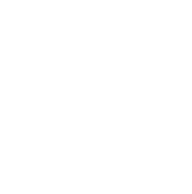

```{=html}
<!-- Bug in hero - only displays properly with empty div at the top -->
<div class="jumbotron bgimg">
  <div class="container">
    <h1 class="display-4"></h1>
    <p class="lead"></p>
  </div>
</div>
<style type="text/css">
.bgimg {
  background-image: url('images/hero.jpg');
  Background-size: cover;
}
.lead {
    font-family: "Zilla Slab";
    text-align: center;
}
.hero-quote {
  font-family: "Zilla Slab";
  font-color: white;
  color: white;
}

.fw-bold {
  /* font-family: "Zilla Slab Highlight"; */
  font-style: bold !important;
  color: white !important;
}
</style>
<div class="p-5 mb-4 bg-light rounded-3 bgimg">
  <br><br><br><br>
  <div class="hero-quote">
    <h1 class="display-5 fw-bold">Looking<br>to do more<br>with data and AI?</h1>
  </div>
</div>
<p class="lead">
   <small class="text-hero">ECONOMIA &emsp; | &emsp; FILOSOFIA & POLITICA &emsp; | &emsp; MATEMATICA & ESTADISTICA &emsp; | &emsp; INFORMATICA </small>
</p>
```


<br>

::: {.grid}
::: {.g-col-1}
:::

::: {.g-col-10}
¡Hola!
Soy [achalmaedison](https://achalmaedison.netlify.app/cv.pdf), un economista en proceso y entusiasta de las matemáticas y de la informática.
Compartiré mis apuntes de clase, guías de problemas, resúmenes y exámenes resueltos, ya que estoy convencido de que compartir mis apuntes con la comunidad es provechoso para todos.

Cuando no estoy frente a mi computadora, disfruto de la fotografía y de viajar a nuevos lugares.
Además, me encanta pasar el tiempo en cafeterías, preferiblemente con un delicioso capuchino en la mano.

A lo largo de mi trayectoria, he adquirido experiencia en programación y seguridad informática.
Estoy comprometido en la excelencia, el aprendizaje continuo, el impacto positivo y el respeto hacia los demás.
Estos principios me guían en mi vida y en mi carrera, y me inspiran a alcanzar mis metas y contribuir al mundo de manera significativa.

Mi objetivo principal es brindar información relevante y de calidad sobre temas que me apasionan y en los cuales tengo conocimientos sólidos con el fin de inspirar, educar y generar discusiones constructivas.
Me apasiona la economía y la informática y estoy emocionado de poder compartir mi conocimiento y experiencias contigo.

Te invito a explorar las diferentes secciones de mi página para conocer más sobre mis proyectos, publicaciones y logros.
Si tienes alguna pregunta o te gustaría colaborar en algún proyecto, no dudes en contactarme a través de la sección de contacto.

:::

::: {.g-col-1}
:::
:::

<br><br>

:::: {#light-grey-background}
::: {.grid}
::: {.g-col-8}

### ¿Por qué tomo mis apuntes con una PC en lugar de usar un cuaderno?

En mi opinión, hay más razones para elegir la tecnología que desventajas.
Claro, existe la posibilidad de que se corte la luz y me quede sin acceso a mis apuntes, pero hasta ahora eso no ha sucedido.
Además, las ventajas son realmente geniales:

-   **Es más rápido y ordenado:** Escribir en la PC, ¡incluso las ecuaciones!,
    es mucho más rápido y prolijo que hacerlo en papel.
    Los dibujos pueden ser un desafío al principio, ¡pero con práctica se resuelve todo!

-   **Compartir es fácil:** Puedo enviar mis apuntes rápidamente a cualquier parte del mundo a través de Internet.

-   **Adiós al polvo:** Olvídate de los volúmenes de cuadernos y papeles acumulándose y juntando polvo.
    ¡Todo está en la nube!

-   **Robusto y versátil:** Hago tantas copias como necesito, y si alguna vez quiero una versión impresa, ¡solo tengo que darle al botón de imprimir!

-   **Siempre disponibles:** Con una computadora e internet, mis apuntes están a solo unos clics de distancia en cualquier momento.

-   **El siguiente paso:** Creo que la tecnología es el siguiente paso en la evolución de la escritura y la toma de apuntes.
    ¿Por qué no mantenerse al día?
    
<small class="text-muted">Data Architecture | MLOps (Machine Learning Operations) | Federated Learning | Privacy-Enhancing Technologies</small>
:::

:::{.g-col-4}

:::
:::
::::

<br>

:::: {#applied-ai}
::: {.grid}
::: {.g-col-4}

:::

::: {.g-col-8}
### Mis Softwares Favoritos

Quero contarles acerca del software que uso y que realmente recomiendo.
¡Echen un vistazo!

-   **Kubuntu:** Es como Ubuntu, ¡pero con una interfaz gráfica mucho más completa, rápida y personalizable!

    *¡Nota Importante:* No necesitas Linux para disfrutar de estos programas.
    Creo que la mayoría está disponible tanto para Linux como para Windows y OS X.

-   **Lyx:** Este programa hace que escribir en LaTeX sea pan comido.
    ¡La vida del que escribe mejora notablemente!

-   **Inkscape:** Un programa de diseño gráfico para crear dibujos vectoriales.
    ¡Y se integra perfectamente con Lyx!

-   **Python:** No necesita presentación, ¿verdad?
    Una herramienta esencial.

-   **SmartGit:** Una interfaz gráfica para Git.
    Hace que trabajar con Git sea mucho más amigable.

-   **wxMaxima:** Un programa de cálculo simbólico (como Mathematica o Wolfram, pero gratis).

-   **Zotero:** Ideal para organizar libros y papers.
    ¡La salvación para los amantes de la investigación!

-   **Stata**: Es un programa de análisis estadístico que se utiliza comúnmente en la investigación social.
    Sin embargo, es un software propietario y puede ser costoso.

-   **Rstudio**: Es un IDE para el lenguaje de programación R.
    Es muy popular entre los científicos de datos y los analistas estadísticos debido a su capacidad para crear gráficos y visualizaciones de datos.

-   **Obsidian**: Es un software de notas que utiliza Markdown para formatear el texto.
    Es muy personalizable y se puede utilizar para organizar y vincular notas de investigación.

-   **Xournal++**: Es un programa de toma de notas a mano alzada que permite a los usuarios editar, escribir y dibujar en documentos PDF.

En su mayoría, el software que uso es libre y gratuito, y creo que en todos los casos es multiplataforma (Linux, Windows, OS X).
En general, creo que apuntar a alternativas libres es una buena práctica, ¡aunque tengan algunos features menos!

<small class="text-muted">Explainable AI | Generative AI & Large Language Models | Physics-Informed Machine Learning</small> 
:::
:::
::::

<br>

:::: {#light-grey-background}
::: {.grid}
::: {.g-col-8}

### Experiencias {.experiencias_titulo}

**Docente, UNIVERSIDAD AUTÓNOMA DE HUANTA, Huanta**

Diciembre 2018 - Enero 2018

Enseñé el curso de Gestión de Proyectos a estudiantes de pregrado en la UNH, lo que me permitió desarrollar habilidades de enseñanza y comunicación efectiva.

**Practicante, DIRECCIÓN DE INFORMACIÓN AGRARIA Y ESTUDIOS ECONÓMICOS, DRA-Ayacucho**

Agosto 2021 - Abril 2022

Contribuí en la formulación de estudios económicos y en la generación y procesamiento de información relevante para el sector agrario de la región.
Adquirí habilidades en análisis de datos, investigación y trabajo en equipo en un entorno profesional.

**Secretario, CENTRO DE ESTUDIANTES DE ECONOMÍA, Ayacucho**

Agosto 2021 - Julio 2020

Como Secretario de Prensa del Centro de Estudiantes de Economía, fui responsable de la difusión de las actividades y eventos del centro, así como de mantener una comunicación fluida y efectiva con los estudiantes y demás miembros del centro.
Desarrollé habilidades en comunicación, trabajo en equipo y organización.

**Secretario de archivos, MUNICIPALIDAD PROVINCIAL DE CANGALLO., Cangallo**

Abril 2019 - Enero 2019

Desempeñé el cargo de Secretario de Archivos en la Oficina de Archivos de la Municipalidad Provincial de Cangallo.

**Parlamentario Joven, CONGRESO DE LA REPÚBLICA, Ayacucho**

Diciembre 2018 - Enero 2018

Auspiciado por la Fundación Hanns Seidel y la Oficina de Participación Ciudadana del Congreso de la República del Perú, fortalecí mis capacidades de liderazgo y aprendí sobre el funcionamiento del Congreso de la República, sus comisiones de trabajo y la valoración del trabajo en un espacio de participación y fomento de valores democráticos.

<small class="text-muted">One-the-job coaching for individuals and teams | Challenge-based learning | Technical deep-dives for experts</small> 
:::

::: {.g-col-4}

:::
:::
::::

<br>

:::: {.container}
::: {.grid}
::: {.g-col-4}

:::

::: {.g-col-8}

### Proyectos {.proyecto}

CHAT BOT

2021 - 2022

-   Repositorio: [github.com/achalmed/bot-whatsapp](https://chat.openai.com/c/github.com/achalmed/bot-whatsapp)
-   Descripción: Creación e implementación de un chatbot para la MDSJB-Ayacucho utilizando node.js y dialogflow.
-   Tecnologías utilizadas: Node.js, Dialogflow.
-   Herramientas utilizadas: Whatsapp.

### Voluntaridos {.voluntariado}

**NATS de Movimiento de Adolescentes y Niños Trabajadores Hijos de Obreros Cristianos -- MANTHOC**

-   Año: 2016

**Corresponsal de No Apto Para Adultos -- NAPA**

-   Año: 2014
-   Descripción: Colaboración en la creación del magazine televisivo diario de media hora de duración con información y reportajes de actualidad para niños y adolescentes de 13 a 17 años. NAPA es difundido por 40 canales de Red TV en todo el Perú, y en Lima a través de la señal de JN19 UHF y en el canal 57 de Cable Mágico.


<small class="text-muted">Keynote speeches | Masterclasses for management and executives | Inspirational lectures</small>
:::
:::
::::

<br>

:::: {#logo-board}

:::

<br>


```{=html}
<style>
#light-grey-background {
  padding-top: 35px;
  padding-bottom: 20px;
  padding-left: 35px;
  background-color: #000000;
  color: #ffffff;
  border-radius: .3rem !important;
}
#logo-board {
  padding-top: 20px;
  border-radius: .3rem !important;
  background-color: #ffffff;
}
</style>
```


::: {.grid}
::: {.g-col-2}
:::

::: {.g-col-6}
{fig-align="center"}

### "As a data architect and AI expert I can help you create sustainable change with digital technologies."
:::

::: {.g-col-2}
:::
:::


<br><br><br>


¡Espero que encuentres este sitio interesante y útil!
¡Gracias por visitar!

## 📷 ☕ ️😅 ¡Gracias por visitar mi página web!

### Contact details

**email:** [achalmaedison\@kapital.net](mailto:achalmed.18@gmail.com) <br>
