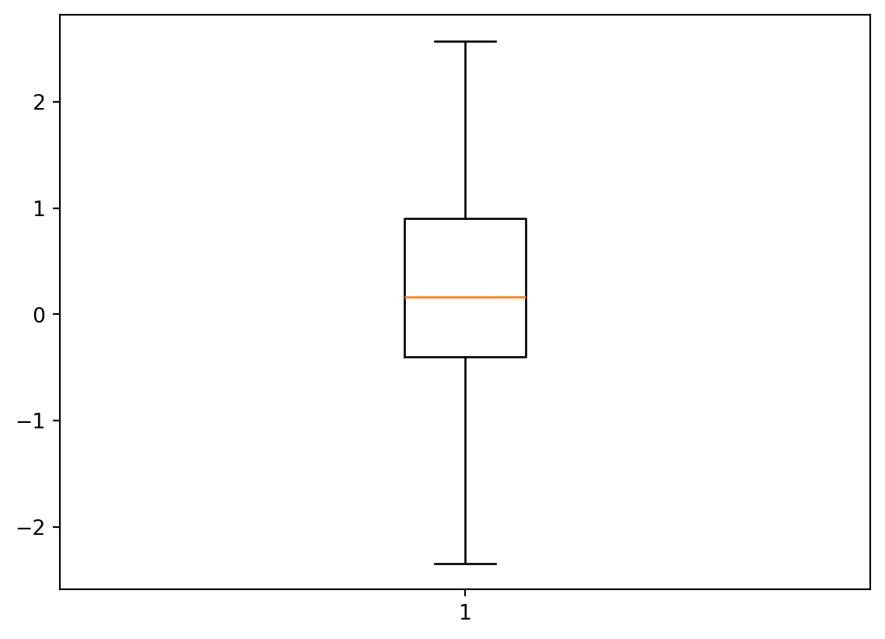
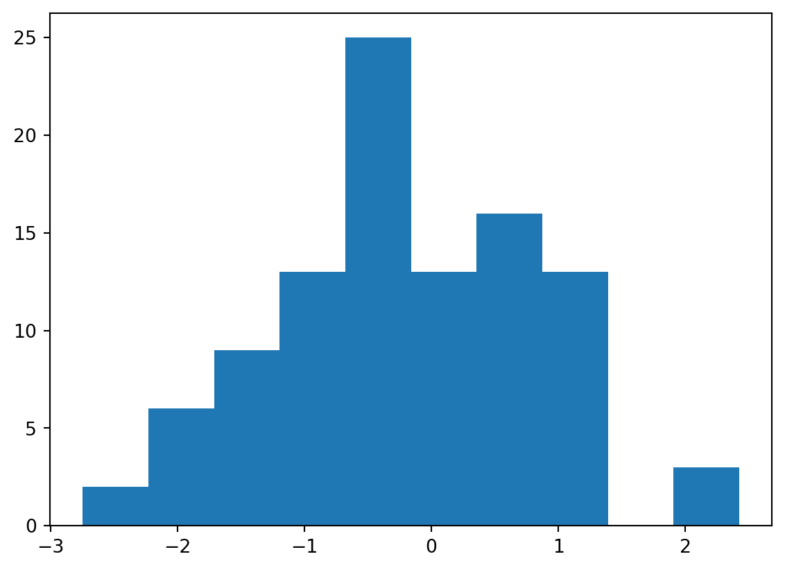
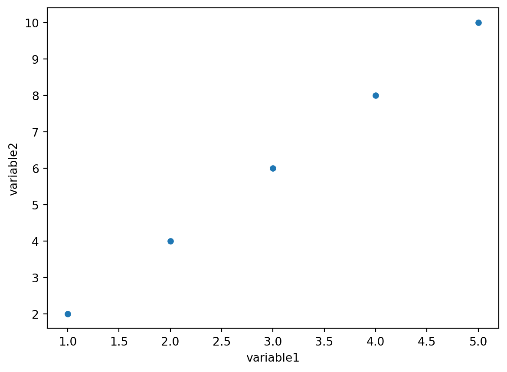

# Introducción a la visualización de datos en estadística

## Importancia de la visualización de datos en el análisis estadístico

## Beneficios de utilizar gráficos en la exploración y comunicación de datos

## Introducción a las bibliotecas y herramientas utilizadas en la visualización de datos en estadística

# Gráficos descriptivos en estadística

## Histogramas y gráficos de barras para representar distribuciones de datos

## Gráficos de dispersión y diagramas de caja para analizar la relación entre variables

## Utilización de gráficos descriptivos para resumir y visualizar características de los datos

# Gráficos de series de tiempo en estadística

## Representación gráfica de series de tiempo para analizar tendencias y patrones temporales

## Utilización de gráficos de series de tiempo para modelar y pronosticar datos

## Ejemplos prácticos de visualización de datos de series de tiempo en estadística

# Gráficos de relaciones y correlaciones en estadística

## Diagramas de dispersión y líneas de regresión para analizar la relación entre variables

## Gráficos de correlación y mapas de calor para visualizar la matriz de correlación

## Utilización de gráficos de relaciones para identificar patrones y tendencias en los datos

# Gráficos avanzados en estadística

## Gráficos de densidad y contorno para representar la distribución conjunta de variables

## Gráficos de violin y gráficos de mosaico para analizar variables categóricas

## Ejemplos prácticos de visualización de datos en estadística utilizando gráficos avanzados

# Visualización interactiva de datos en estadística

## Utilización de bibliotecas como Plotly y Bokeh para crear gráficos interactivos en estadística

## Incorporación de herramientas interactivas como zoom, selección y filtros en gráficos estadísticos

## Ejemplos prácticos de visualización interactiva de datos en estadística

# Casos de estudio y ejemplos prácticos

## Aplicación de la visualización de datos en estadística en diferentes escenarios, como análisis exploratorio, pruebas de hipótesis, etc.

## Ejemplos de visualización de datos en estadística en situaciones reales

# Conclusiones y recursos adicionales

## Resumen de las técnicas y mejores prácticas en la visualización de datos en el campo de la estadística

## Recursos adicionales para aprender más sobre la visualización de datos en el campo de la estadística

# Gráficos y análisis estadístico

## Boxplots y diagramas de violín

En el análisis de datos, a menudo necesitamos comprender la distribución y la variabilidad de nuestros datos. Dos tipos de gráficos útiles para visualizar esta información son los boxplots y los diagramas de violín.

Un boxplot, también conocido como diagrama de caja y bigotes, nos proporciona una representación visual de la mediana, el rango intercuartil (IQR) y los valores atípicos de un conjunto de datos. El gráfico consiste en una caja que representa el IQR, una línea que representa la mediana y dos líneas (los bigotes) que se extienden hasta los valores mínimo y máximo dentro de un rango aceptable. Los valores atípicos se muestran como puntos fuera de los bigotes.

Por otro lado, los diagramas de violín combinan un boxplot con una representación de la densidad de probabilidad de los datos. Estos gráficos muestran una forma de violín que se estrecha o ensancha según la densidad de los datos en diferentes rangos. Esto nos proporciona información adicional sobre la distribución y la concentración de los datos.

Tanto los boxplots como los diagramas de violín son útiles para comparar la distribución de diferentes grupos o categorías, identificar valores atípicos y comprender la variabilidad en nuestros datos. Estos gráficos nos ayudan a obtener una visión rápida y clara de la información estadística clave.

Para crear boxplots y diagramas de violín, podemos utilizar bibliotecas como Matplotlib y Seaborn. Estas bibliotecas nos ofrecen funciones simples y personalizables para generar estos gráficos con facilidad.

Aquí tienes un ejemplo básico de cómo crear un boxplot utilizando Matplotlib:

::: {.cell execution_count=1}
``` {.python .cell-code}
import pandas as pd
import seaborn as sns
import matplotlib.pyplot as plt
import numpy as np

# Cargar datos
data = np.random.randn(100)

# Crear boxplot
plt.boxplot(data)

# Mostrar el boxplot
plt.show()
```

::: {.cell-output .cell-output-display}
{width=569 height=411}
:::
:::


En este ejemplo, cargamos nuestros datos y utilizamos la función `boxplot()` de Matplotlib para crear el gráfico. Luego, utilizamos `plt.show()` para mostrar el boxplot en una ventana emergente.

## Histogramas y distribuciones

En el análisis de datos, es crucial comprender la distribución de nuestros datos para obtener información valiosa. Una herramienta visual poderosa para explorar la distribución es el histograma.

Un histograma es un gráfico de barras que muestra la frecuencia de aparición de diferentes valores en un conjunto de datos. La variable que estamos analizando se divide en intervalos y se representa en el eje x, mientras que la frecuencia se muestra en el eje y. Cada barra representa la cantidad de valores dentro de un intervalo específico.

Al observar un histograma, podemos identificar rápidamente la forma y la simetría de la distribución de nuestros datos. Podemos detectar si los datos siguen una distribución normal, están sesgados hacia la derecha o hacia la izquierda, o si tienen múltiples picos. Esto nos proporciona información valiosa sobre la naturaleza de nuestros datos y nos ayuda a tomar decisiones informadas.

Para crear un histograma, podemos utilizar bibliotecas como Matplotlib y Seaborn. Estas bibliotecas ofrecen funciones sencillas para generar histogramas y personalizar su apariencia.

Aquí tienes un ejemplo básico de cómo crear un histograma utilizando Matplotlib:

::: {.cell execution_count=2}
``` {.python .cell-code}
# Cargar datos
data = np.random.randn(100)

# Crear histograma
plt.hist(data, bins=10)  # bins representa el número de intervalos

# Mostrar el histograma
plt.show()
```

::: {.cell-output .cell-output-display}
{width=579 height=411}
:::
:::


En este ejemplo, cargamos nuestros datos y utilizamos la función `hist()` de Matplotlib para crear el histograma. El parámetro `bins` nos permite especificar el número de intervalos en los que queremos dividir nuestros datos.

## Gráficos de correlación

Cuando trabajamos con conjuntos de datos, a menudo queremos explorar la relación entre diferentes variables. Los gráficos de correlación nos permiten visualizar esta relación y determinar si existe una conexión significativa entre las variables.

Un gráfico de correlación muestra cómo se relacionan dos variables entre sí. Nos ayuda a identificar patrones y tendencias, así como la fuerza y dirección de la relación. El coeficiente de correlación nos proporciona una medida numérica de la relación, donde valores cercanos a 1 indican una correlación positiva, valores cercanos a -1 indican una correlación negativa, y valores cercanos a 0 indican una correlación débil o inexistente.

Una forma común de representar gráficamente la correlación es mediante un diagrama de dispersión. En este tipo de gráfico, cada punto representa una observación en el conjunto de datos, y su posición en el plano cartesiano refleja los valores de las dos variables. Si los puntos tienden a formar una línea ascendente o descendente, indica una correlación positiva o negativa, respectivamente.

Para crear un gráfico de correlación, podemos utilizar bibliotecas como Matplotlib y Seaborn. Estas bibliotecas nos ofrecen funciones sencillas para generar diagramas de dispersión y calcular los coeficientes de correlación.

Aquí tienes un ejemplo básico de cómo crear un gráfico de correlación utilizando Seaborn:

::: {.cell execution_count=3}
``` {.python .cell-code}
# pip install seaborn
# pip install matplotlib


# Cargar datos
data = pd.DataFrame({'variable1': [1, 2, 3, 4, 5],
                     'variable2': [2, 4, 6, 8, 10]})

# Crear gráfico de correlación
sns.scatterplot(x=data['variable1'], y=data['variable2'])

# Mostrar el gráfico
plt.show()
```

::: {.cell-output .cell-output-display}
{width=585 height=429}
:::
:::


En este ejemplo, cargamos nuestros datos y utilizamos la función `scatterplot()` de Seaborn para crear el gráfico de correlación. Simplemente especificamos las variables que queremos comparar en los ejes x e y.

# Publicaciones Similares

Si te interesó este artículo, te recomendamos que explores otros blogs y recursos relacionados que pueden ampliar tus conocimientos. Aquí te dejo algunas sugerencias:

1.  [Introducción](../2023-06-22-01-introduccion-a-python/index.qmd)

2.  [Variables, expresiones y statements](../2023-06-23-02-variables-expresiones-y-statements-con-python/index.qmd)

3.  [Objetos de Python](../2023-06-24-03-objetos-de-python/index.qmd)

4.  [Ejecución condicional](../2023-06-25-04-ejecucion-condicional-con-python/index.qmd)

5.  [Iteraciones](../2023-06-26-05-iteraciones-con-python/index.qmd)

6.  [Funciones](../2023-06-27-06-funciones-con-python/index.qmd)

7.  [Dataframes](../2023-06-28-07-dataframes-con-python/index.qmd)

8.  [Introducción a la visualización de datos](../2023-06-29-introduccion-a-la-visualizacion-de-datos-con-python/index.qmd)

9.  [Gráficos avanzados](../2023-06-30-graficos-avanzados-con-python/index.qmd)

10. [Visualización de datos en tiempo real](../2023-07-01-visualizacion-de-datos-en-tiempo-real-con-python/index.qmd)

11. [Visualización de datos en finanzas](../2023-07-02-visualizacion-de-datos-en-finanzas-con-python/index.qmd)

12. [Visualización de datos en microeconomía](../2023-07-03-visualizacion-de-datos-en-microeconomia-con-python/index.qmd)

13. [Visualización de datos en macroeconomía](../2023-07-04-visualizacion-de-datos-en-macroeconomia-con-python/index.qmd)

14. [Visualización de datos en estadística](../2023-07-05-visualizacion-de-datos-en-estadistica-con-python/index.qmd)

15. [Visualización de datos en econometría](../2023-07-06-visualizacion-de-datos-en-econometria-con-python/index.qmd)

16. [Mejores prácticas y consejos de visualización de datos](../2023-07-07-mejores-practicas-y-consejos-de-visualizacion-de-datos-con-python/index.qmd)

17. [Predicción y métrica de performance](../2023-07-08-08-prediccion-y-metrica-de-performance-con-python/index.qmd)

18. [Métodos de machine learning para clasificación](../2023-07-09-09-metodos-de-machine-learning-para-clasificacion-con-python/index.qmd)

19. [Métodos de machine learning para regresión](../2023-07-10-10-metodos-de-machine-learning-para-regresion-con-python/index.qmd)

20. [Validación cruzada y composición del modelo](../2023-07-11-11-validacion-cruzada-y-composicion-del-modelo-con-python/index.qmd)

Esperamos que encuentres estas publicaciones igualmente interesantes y útiles. ¡Disfruta de la lectura!

