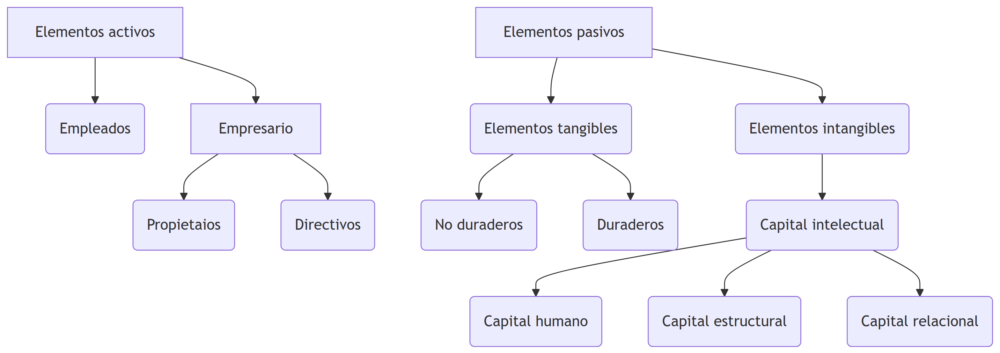

# La Empresa como Organización: Un Enfoque Cooperativo, Humano y Social

La empresa es un tipo específico de organización que se caracteriza por su estructura social, su enfoque cooperativo y su impacto en la sociedad. Destacan los valores cooperativos, humanos y sociales que la empresa promueve en su funcionamiento.

Según varios teóricos, como Etzioni, Hall y Barnard, las organizaciones son unidades sociales creadas con el propósito de alcanzar metas específicas. En el caso de la empresa, esta se compone de diversos factores que interactúan bajo la dirección y supervisión del empresario, con el objetivo principal de lograr fines económicos a través de la producción de bienes y servicios.

Las características distintivas de la empresa incluyen:

1. **Grupo social definido:** La empresa reúne a individuos que colaboran en la consecución de sus objetivos comunes.

2. **Sistema cooperativo:** Existe una dinámica de trabajo en equipo y colaboración entre los miembros de la organización.

3. **Estructuración, coordinación consciente y orientación a un fin:** La empresa se organiza y coordina de manera consciente para lograr sus metas establecidas.

4. **Vocación de permanencia:** A diferencia de proyectos temporales, la empresa tiene una perspectiva de continuidad y estabilidad en el tiempo.

5. **Interacción con el ambiente externo:** La empresa se relaciona y se adapta al entorno externo en el que opera, teniendo en cuenta factores económicos, legales, sociales y tecnológicos.

# La Empresa como Sistema: Coordinación y Complejidad

Un sistema se define como un conjunto de elementos que están discretos e interrelacionados entre sí, y que trabajan de manera coordinada para alcanzar un objetivo común.

La empresa se puede entender como un sistema, que se compone de elementos interrelacionados y coordinados, con el objetivo común de lograr resultados específicos. Esta perspectiva sistémica resalta la importancia de una coordinación consciente en el funcionamiento de la empresa.

1. **Conjunto de elementos:** La empresa está compuesta por diversos elementos, como personas, recursos, procesos y estructuras organizativas, que interactúan entre sí.

2. **Estructura del sistema:** La empresa establece relaciones entre oferentes y demandantes, es decir, entre los que ofrecen bienes o servicios y los que los demandan.

3. **Plan común:** La empresa define un plan en el que se establecen los objetivos que se buscan alcanzar, proporcionando una dirección clara a seguir.

4. **Funciones características:** La empresa desempeña funciones de transformación, es decir, utiliza los recursos disponibles para producir bienes o servicios que satisfacen las necesidades de los clientes.

5. **Conjunto de estados o situaciones en el tiempo:** La empresa atraviesa diferentes etapas y estados a lo largo de su existencia, adaptándose a cambios internos y externos.

Bajo esta perspectiva sistémica, se reconoce que la empresa es un sistema complejo que requiere una coordinación consciente para alcanzar sus objetivos. Esto implica establecer una estructura organizativa eficiente, fomentar una comunicación efectiva, gestionar adecuadamente los recursos y adaptarse a los cambios del entorno.

Al comprender a la empresa como un sistema, se puede tener una visión holística de su funcionamiento y tomar decisiones estratégicas más informadas. Además, se enfatiza la importancia de la coordinación y la interacción entre los elementos del sistema para lograr resultados exitosos y sostenibles en el tiempo.

# Evolución Histórica de la Empresa: Del Feudalismo al Capitalismo Informacional

| Sistema Económico             | Tipo de Empresa                          | Estructura Básica                                                        |
| ----------------------------- | ---------------------------------------- | ------------------------------------------------------------------------ |
| Sistema Feudal                | Empresa Primitiva                        | Unidad simple, de base familiar                                          |
| Capitalismo Mercantilista     | Empresa Comercial                        | Unidad simple, organizada, no siempre de base familiar                   |
| Capitalismo Industrial        | Empresa Industrial                       | Unidad compleja, organizada, societaria y funcional                      |
| Capitalismo Financiero        | Empresa de Organización Financiera       | Unidad compleja, organizada, multisocietaria, divisional y multinacional |
| Capitalismo de la Información | Empresa de Organización del Conocimiento | Unidad compleja evolucionada, organizada, multisocietaria y global       |

1. **Sistema Feudal - Empresa Primitiva**: En el sistema feudal, se caracterizaba por la existencia de unidades económicas y productivas básicas llamadas empresas primitivas. Estas empresas eran unidades simples y de base familiar, donde las actividades económicas se centraban en la subsistencia y estaban vinculadas a la tierra y a la agricultura.

2. **Capitalismo Mercantilista - Empresa Comercial**: Durante el periodo del capitalismo mercantilista, surgieron las empresas comerciales. Estas empresas eran unidades técnicas-económicas que se dedicaban al comercio, tanto a nivel local como internacional. Eran organizaciones simples, pero más estructuradas que las empresas primitivas, y su objetivo principal era obtener beneficios a través de las actividades comerciales.

3. **Capitalismo Industrial - Empresa Industrial**: Con la llegada del capitalismo industrial, se desarrollaron las empresas industriales. Estas empresas se caracterizaban por ser unidades económicas de producción en las que se llevaban a cabo actividades industriales y se utilizaban tecnologías avanzadas. Eran unidades complejas, organizadas en forma societaria y funcional, con el objetivo de maximizar la producción y obtener beneficios.

4. **Capitalismo Financiero - Empresa de Organización Financiera**: En el capitalismo financiero, surgieron las empresas de organización financiera. Estas empresas se centraban en la gestión y dirección de los recursos financieros, tomando decisiones sobre inversiones, financiamiento y dirección estratégica. Eran unidades complejas, organizadas en forma multisocietaria, divisional y multinacional, con un enfoque en la maximización de los beneficios a través de la gestión financiera.

5. **Capitalismo de la Información - Empresa de Organización del Conocimiento**: En la era del capitalismo de la información, se destacan las empresas de organización del conocimiento. Estas empresas se centran en el manejo y utilización de la información como recurso estratégico, tomando decisiones basadas en el conocimiento y la tecnología. Son unidades complejas evolucionadas, organizadas en forma multisocietaria y global, con un enfoque en la creación, gestión y utilización del conocimiento para obtener ventajas competitivas.

# Elementos constitutivos de la empresa

La empresa está compuesta por diversos elementos que desempeñan un papel fundamental en su funcionamiento y desarrollo. A continuación, se detallan los elementos constitutivos de la empresa:

::::::{.cell layout-align="default"}

:::::{.cell-output-display}

::::{}
`<figure class=''>`{=html}

:::{}

{width="11.23in" height="3.98in" fig-pos='H' fig-env='figure'}
:::
`</figure>`{=html}
::::
:::::
::::::

## Elementos activos

### Empresario

El empresario es aquel que asume el riesgo y la responsabilidad de la empresa. Puede ser el propietario o un directivo que toma decisiones estratégicas y dirige las operaciones de la empresa.

### Empleados

Los empleados son el recurso humano que trabaja en la empresa. Estos desempeñan diferentes roles y funciones dentro de la organización, contribuyendo al logro de los objetivos empresariales.

## Elementos pasivos

### Elementos Tangibles

Los elementos tangibles se refieren a los activos físicos de la empresa. Estos pueden ser no duraderos, como materias primas o productos en proceso, o duraderos, como maquinaria, equipos y edificios.

### Elementos Intangibles

Los elementos intangibles se refieren a los activos no físicos de la empresa, que no se pueden tocar ni ver. como el:

Capital Intelectual: Representa el conocimiento y los recursos intelectuales de la empresa.

a. **Capital Humano:** Se refiere a las competencias y capacidades de los empleados, incluyendo su formación, experiencia y habilidades.

b. **Capital Estructural:** Engloba la organización y la tecnología utilizada en la empresa, incluyendo los sistemas de gestión, la infraestructura tecnológica y los procesos operativos.

c. **Capital Relacional:** Hace referencia a las relaciones que la empresa establece con clientes, proveedores y otros agentes del entorno empresarial. Estas relaciones son clave para el desarrollo de alianzas estratégicas, la colaboración y la creación de redes de valor.

# Función de la empresa en la economía

La empresa desempeña un papel fundamental en la economía al generar bienes y servicios de forma eficiente. A continuación, se detallan las funciones principales de la empresa en la economía:

## Generar bienes y servicios de forma eficiente

La empresa tiene como objetivo principal producir bienes y servicios de manera eficiente, utilizando los recursos disponibles de manera óptima. Esto implica minimizar los costos de producción y maximizar la calidad y la productividad.

## Asumir y reducir costos de mercado y de información

La empresa asume y reduce los costos de mercado al organizar la producción de bienes y servicios de manera interna, en lugar de adquirirlos a través del mercado. Al hacerlo, la empresa puede aprovechar economías de escala, especialización y eficiencia en la producción.

Además, la empresa también asume y reduce los costos de información al tener acceso a información privilegiada y especializada sobre el mercado, los consumidores y los proveedores. Esto le permite tomar decisiones informadas y estratégicas para mejorar su desempeño y competitividad.

## Anticipar el producto obtenido

La empresa tiene la capacidad de anticipar el producto obtenido al identificar y satisfacer las necesidades y demandas de los consumidores. A través de la investigación de mercado y el análisis de las tendencias, la empresa puede desarrollar productos y servicios que se ajusten a las preferencias del público objetivo, anticipándose así a sus deseos y expectativas.

## Asumir el riesgo de la actividad económica

La empresa asume el riesgo de la actividad económica al invertir recursos financieros, humanos y tecnológicos en la producción de bienes y servicios. Esto implica enfrentar la incertidumbre del mercado, los cambios en la demanda, la competencia y otros factores externos que pueden afectar su desempeño. La empresa asume este riesgo con el objetivo de obtener beneficios y lograr su supervivencia en el mercado.

## Desarrollar el sistema económico

La empresa juega un papel crucial en el desarrollo del sistema económico al generar empleo, contribuir al crecimiento económico, fomentar la innovación y la investigación, y promover el intercambio comercial. La actividad empresarial impulsa el desarrollo económico de una sociedad al generar riqueza, crear oportunidades y estimular la competencia.

## Coordinar el proceso productivo

La empresa desempeña un papel de coordinación en el proceso productivo al organizar y supervisar las diferentes etapas de producción. Esto implica la planificación, la asignación de recursos, la gestión de inventarios, la coordinación de equipos de trabajo y el control de la calidad, entre otras actividades. La empresa busca garantizar la eficiencia y la coherencia en el proceso productivo para lograr la satisfacción de los clientes y la obtención de resultados óptimos.

# Fundamentos económicos de las empresas

Según Gregory Mankiw, la economía se ocupa del estudio de cómo la sociedad administra sus recursos. En el contexto de las empresas, existen diferentes tipos de recursos que son fundamentales para su funcionamiento. A continuación, se detallan estos recursos y su relación con la producción de bienes y servicios:

## Recursos Naturales

Los recursos naturales son elementos que no son producidos por el ser humano y que se encuentran disponibles en la naturaleza. Ejemplos de recursos naturales incluyen terrenos, bosques, agua, minerales, petróleo, entre otros. Estos recursos son utilizados por las empresas en sus procesos de producción para extraer, transformar o utilizar como insumos en la elaboración de bienes y servicios.

## Recursos Humanos o Mano de obra

Los recursos humanos se refieren a las capacidades físicas y mentales que las personas aplican en la producción de bienes y servicios. Esto incluye tanto el trabajo manual como el trabajo intelectual realizado por los empleados de una empresa. Los recursos humanos son esenciales para llevar a cabo las diferentes tareas y funciones necesarias en la producción y operación de la empresa.

## Recursos Financieros o Capital

Los recursos financieros, también conocidos como capital, se refieren a los fondos con los que se adquieren los recursos naturales y humanos necesarios para la elaboración de productos. El capital puede provenir de diversas fuentes, como inversionistas, préstamos bancarios, capital propio de los empresarios, entre otros. Estos recursos financieros se utilizan para financiar la adquisición de activos, como maquinaria, equipos, tecnología, así como para cubrir los costos operativos y de producción de la empresa.

## Producción de bienes y servicios

La producción de bienes y servicios es el resultado de combinar los recursos naturales, recursos humanos y recursos financieros. En este proceso, los recursos naturales se utilizan como insumos, los recursos humanos aportan su trabajo y conocimiento, y los recursos financieros permiten adquirir y utilizar eficientemente los otros recursos. La producción de bienes y servicios es el objetivo principal de las empresas, donde se busca transformar los insumos en productos finales que satisfagan las necesidades y demandas de los consumidores.

# Publicaciones Similares

Si te interesó este artículo, te recomendamos que explores otros blogs y recursos relacionados que pueden ampliar tus conocimientos. Aquí te dejo algunas sugerencias:

1. [Introducion Organizacion Industrial Oi Cap1](https://achalmaedison.netlify.app/microeconomia/organizacion-industrial/2023-06-12-introducion-organizacion-industrial-oi-cap1) Lee sin conexión 📚 [PDF](https://achalmaedison.netlify.app/microeconomia/organizacion-industrial/2023-06-12-introducion-organizacion-industrial-oi-cap1/index.pdf)
2. [Empresa Como Organizacion Oi Cap1](https://achalmaedison.netlify.app/microeconomia/organizacion-industrial/2023-06-13-empresa-como-organizacion-oi-cap1) Lee sin conexión 📚 [PDF](https://achalmaedison.netlify.app/microeconomia/organizacion-industrial/2023-06-13-empresa-como-organizacion-oi-cap1/index.pdf)
3. [Sistemas Economicos Oi Cap1](https://achalmaedison.netlify.app/microeconomia/organizacion-industrial/2023-06-13-sistemas-economicos-oi-cap1) Lee sin conexión 📚 [PDF](https://achalmaedison.netlify.app/microeconomia/organizacion-industrial/2023-06-13-sistemas-economicos-oi-cap1/index.pdf)
4. [Mercado Relevante Oi Cap2](https://achalmaedison.netlify.app/microeconomia/organizacion-industrial/2023-06-15-mercado-relevante-oi-cap2) Lee sin conexión 📚 [PDF](https://achalmaedison.netlify.app/microeconomia/organizacion-industrial/2023-06-15-mercado-relevante-oi-cap2/index.pdf)
5. [Medidas Concentracion Desempeno Organizacion Industrial Oi Cap3](https://achalmaedison.netlify.app/microeconomia/organizacion-industrial/2023-06-16-medidas-concentracion-desempeno-organizacion-industrial-oi-cap3) Lee sin conexión 📚 [PDF](https://achalmaedison.netlify.app/microeconomia/organizacion-industrial/2023-06-16-medidas-concentracion-desempeno-organizacion-industrial-oi-cap3/index.pdf)
6. [Estructura Mercado Oi Cap4](https://achalmaedison.netlify.app/microeconomia/organizacion-industrial/2023-06-17-estructura-mercado-oi-cap4) Lee sin conexión 📚 [PDF](https://achalmaedison.netlify.app/microeconomia/organizacion-industrial/2023-06-17-estructura-mercado-oi-cap4/index.pdf)
7. [Elasticidad Oi](https://achalmaedison.netlify.app/microeconomia/organizacion-industrial/2023-06-23-elasticidad-oi) Lee sin conexión 📚 [PDF](https://achalmaedison.netlify.app/microeconomia/organizacion-industrial/2023-06-23-elasticidad-oi/index.pdf)

Esperamos que encuentres estas publicaciones igualmente interesantes y útiles. ¡Disfruta de la lectura!

