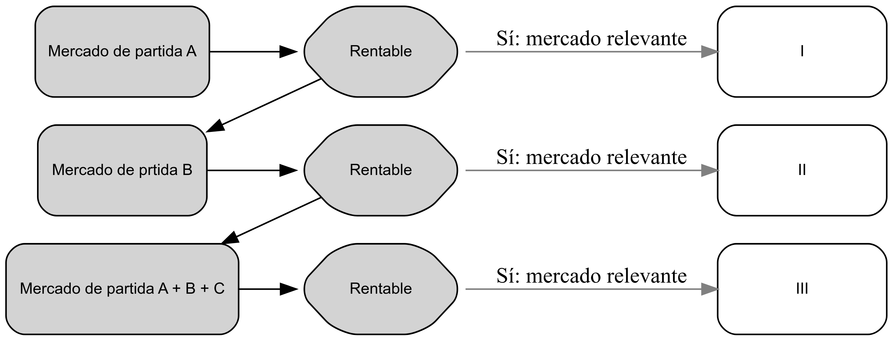
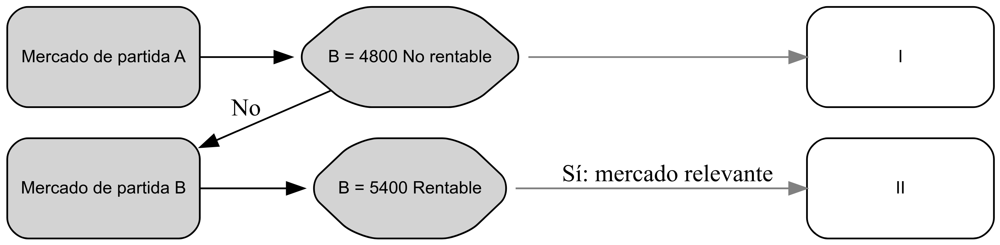

# Sistema económio y mercado

## Sistema económico

El sistema económico se refiere a la forma en que se organiza y dirige la actividad económica de un país, abarcando aspectos sociales, políticos, económicos y jurídicos. Define cómo se producirán y distribuirán los bienes y servicios, así como la asignación de los recursos escasos para su producción. Además, incluye la organización política, la regulación e intervención del estado, y el marco jurídico que rige las transacciones económicas.

## Sistema económico imperante en la economía

El sistema económico imperante en la economía mundial puede manifestarse en diferentes formas, y una de ellas es la economía de mercado.

En una economía de mercado, se establece un lugar, ya sea físico o virtual, donde se crean las condiciones necesarias para que los individuos y las empresas puedan intercambiar bienes y servicios. Este lugar puede ser un mercado físico tradicional, como una plaza o una feria, o un mercado virtual, como una plataforma de comercio electrónico.

El mercado no solo es un espacio físico o virtual, sino también una organización o entidad que facilita el vínculo entre los oferentes (vendedores) y los demandantes (compradores). En este sentido, el mercado proporciona el marco para que se realicen transacciones comerciales, acuerdos e intercambios. Permite que los compradores encuentren los bienes y servicios que desean adquirir y que los vendedores encuentren potenciales compradores para sus productos.

En un sistema económico de mercado, los precios se determinan a través de la oferta y la demanda, y los participantes toman decisiones basadas en sus propios intereses individuales. Este sistema fomenta la competencia entre los diferentes actores económicos, lo que a su vez puede llevar a la eficiencia en la asignación de recursos y a una mayor variedad de productos y servicios disponibles para los consumidores.

Es importante destacar que existen diversos tipos de sistemas económicos, y la economía de mercado es solo uno de ellos. Otros sistemas económicos, como el socialismo o el capitalismo de Estado, presentan diferentes características y formas de organización de la actividad económica.

## Las Diferencias entre Sistemas Económicos

| Características                                 | Economía de Mercado                                                | Economía Planificada                                                   |
|-------------------------------------------------|--------------------------------------------------------------------|------------------------------------------------------------------------|
| Propiedad de los Medios de Producción y Empresa | Los medios de producción y empresas son de propiedad privada.      | Los medios de producción y empresas son de propiedad estatal.          |
| Elección de Bienes y Materiales                 | Los individuos y familias tienen libertad de elección.             | El Estado determina y impone las elecciones de bienes y materiales.    |
| Competencia, Oportunidades y Utilidades         | Existe competencia libre en el mercado.                            | No hay competencia, el Estado controla las oportunidades y utilidades. |
| Disponibilidad y Precio de los Bienes           | La producción y precios son determinados por el mercado.           | El Estado determina la producción y distribución de bienes.            |
| Especialización y Opciones de Empleo            | Los individuos eligen su especialización y hay variedad de empleo. | El Estado determina la especialización y asignación de empleo.         |

Esta tabla compara las características de la economía de mercado y la economía planificada. La economía de mercado se basa en la propiedad privada de los medios de producción y empresas, la libertad de elección de bienes y materiales, la competencia en el mercado, la determinación del precio por oferta y demanda, y la especialización y opciones de empleo determinadas por los individuos. En contraste, en una economía planificada, los medios de producción y empresas son propiedad del Estado, el Estado impone las elecciones de bienes y materiales, no hay competencia, el Estado controla la producción y distribución, y la especialización y empleo son determinados por el Estado.

# Mercados y Precios

## Mercado: Estructura y Determinación

El mercado es el espacio donde se llevan a cabo las transacciones comerciales de bienes y servicios. Su estructura puede variar según la competencia presente en el mercado. En el caso de un mercado perfectamente competitivo, existen numerosos compradores y vendedores, y ninguno de ellos tiene el poder de influir en los precios. En cambio, en un mercado imperfecto, la estructura puede ser monopolística, oligopólica o de otro tipo, lo que implica que algunos participantes tienen cierto grado de poder para influir en los precios.

## Precios: El Lenguaje de los Mercados

Los precios desempeñan un papel crucial en los mercados, ya que actúan como un lenguaje que comunica información sobre la oferta y la demanda de bienes y servicios. Son determinados por la interacción de los compradores y vendedores en el mercado, teniendo en cuenta factores como la oferta, la demanda, los costos de producción y la competencia. En un mercado perfectamente competitivo, los precios se establecen en equilibrio, donde la oferta y la demanda se igualan. Por otro lado, en un mercado imperfecto, como un monopolio, el precio lo determina el productor o la empresa dominante.

# Competencia: Motor del Sistema Económico de Mercado

La competencia desempeña un papel fundamental en el buen funcionamiento del sistema económico de mercado. Cuando existe competencia, los productores se ven obligados a mejorar la calidad de sus productos, reducir los precios y buscar la eficiencia en la producción. Esto beneficia a los consumidores, ya que tienen acceso a una mayor variedad de bienes y servicios a precios competitivos. Además, la competencia estimula la innovación y el progreso económico en general.

## Derecho de la Competencia

El Derecho de la Competencia es un conjunto de normas jurídicas que tiene como objetivo regular el poder actual o potencial de las empresas en un mercado específico, en beneficio del interés público. Su propósito es prevenir prácticas restrictivas de la competencia y regular la adquisición de posiciones de dominio en el mercado.

## Objetivos del Derecho de Competencia

El Derecho de la Competencia persigue varios objetivos para promover la competencia y proteger la eficiencia económica. Estos incluyen:

1.  Proteger y reforzar el proceso de competencia en los mercados donde sea parcial.
2.  Prevenir el abuso de la concentración y el poder de las empresas, ya que estos pueden promover comportamientos anticompetitivos.
3.  Prohibir acuerdos que permitan a los competidores actuales o potenciales asumir conductas anticompetitivas.
4.  Incrementar la eficiencia económica en los mercados.

La Ley Federal de Competencia Económica en EE.UU., en su artículo 2, establece el objetivo de promover, proteger y garantizar la libre concurrencia y la competencia económica, así como prevenir y eliminar prácticas monopólicas, concentraciones ilícitas y restricciones al funcionamiento eficiente de los mercados.

## Beneficios de la Competencia

La competencia tiene múltiples beneficios para la sociedad y la economía:

1.  Mejora de las condiciones de precio y calidad de los productos y servicios, ya que los competidores buscan atraer a los consumidores ofreciendo mejores ofertas.
2.  Aumento de la productividad, ya que la competencia impulsa a las empresas a mejorar constantemente sus procesos y aumentar su eficiencia.
3.  Estímulo a la innovación, ya que las empresas compiten por desarrollar nuevos productos y servicios para destacarse en el mercado.
4.  Sistema descentralizado de precios, que dirige la actividad económica hacia un mayor bienestar de la sociedad al reflejar la oferta y la demanda.

# Definición y Características del Mercado Relevante

## Mercado Relevante

El mercado relevante se refiere a aquel mercado en el cual los bienes y servicios, considerando su estructura de mercado, son sustitutos o razonablemente intercambiables en función de los fines para los cuales fueron creados. Tanto desde la perspectiva del consumidor como del productor, se considera que estos bienes y servicios son intercambiables. Es decir, los consumidores los ven como productos sustitutos y los productores los consideran intercambiables.

## Características del Mercado Relevante

1.  **Áreas geográficas de interacción:** El mercado relevante se define por las áreas geográficas en las que los oferentes y demandantes interactúan para intercambiar bienes y servicios.

2.  **Sustitutos:** Los productos y servicios dentro del mercado relevante son sustitutos entre sí, lo que significa que pueden satisfacer las mismas necesidades del consumidor.

3.  **Elasticidad de precios y demanda son altas:** Las demandas en el mercado relevante son elásticas, lo que implica que los cambios en los precios tienen un impacto significativo en la cantidad demandada.

4.  **Elasticidad cruzada positiva y baja:** La elasticidad cruzada de los bienes dentro del mercado relevante es positiva y baja, lo que indica que los cambios en el precio de un bien tienen un efecto limitado en la demanda de otros bienes.

5.  **Elasticidad de ingreso mayor a cero:** La elasticidad de ingreso de la demanda en el mercado relevante generalmente es mayor a cero y menor a 1. Esto significa que un aumento en los ingresos de los consumidores resulta en un aumento proporcionalmente menor en la demanda de los bienes y servicios del mercado relevante. $0 < \eta_{p_{X}} X^d \leq 1$

## Pasos para Definir un Mercado Relevante

1.  **Descripción de la estructura de los mercados:** Se analiza la organización y dinámica de los mercados en términos de competencia y poder de mercado.

2.  **Sustituibilidad o intercambiabilidad de los bienes:** Se evalúa si los bienes y servicios pueden satisfacer la misma necesidad del consumidor en las mismas circunstancias y en el mismo período de tiempo.

3.  **Oferta diferenciada y diversificada:** Se considera la variedad y diferenciación de los productos ofrecidos en el mercado.

4.  **Accesibilidad para los demandantes:** Se verifica si los bienes y servicios del mercado relevante están disponibles y accesibles para los consumidores.

5.  **Objetividad de la oferta:** Se evalúa la disponibilidad geográfica de los productos, la posibilidad de adquirirlos en el tiempo necesario para satisfacer una necesidad y su accesibilidad para los demandantes.

# Mercado de Producto y Mercado Geográfico Relevante

## Mercado de Producto Relevante

El mercado de producto relevante incluye todos aquellos bienes y servicios que son sustitutos cercanos tanto desde la perspectiva de la demanda como de la oferta. La sustituibilidad de la demanda se refiere a la capacidad de los consumidores para cambiar de un producto a otro en respuesta a cambios en el precio. Si un incremento en el precio de un producto A provoca que los consumidores opten por comprar el producto B en su lugar, se considera que A y B son sustitutos.

Por otro lado, la sustituibilidad de la oferta se refiere a la capacidad de las empresas para ajustar su producción de un producto a otro en respuesta a cambios en el precio. Si las empresas que producen el producto B pueden fácilmente cambiar su producción hacia el producto A cuando el precio de A aumenta, se considera que B es un sustituto de A desde la perspectiva de la oferta.

En ambos casos, la presencia de un bien sustituto en el mercado restringe la capacidad de la empresa que ofrece el bien original para aumentar los precios, ya que los consumidores y las empresas tienen opciones alternativas disponibles.

## Elasticidades

### Elasticidad Precio de la Demanda

Para concocer un mercado relevante

### Elasticida cruzada de la demanda

La elasticidad cruzada de la demanda se calcula mediante la fórmula:

$$
\eta_{XP_{y}} = \frac{\partial X}{\partial P_{y}} \frac{P_{y}}{X}
$$ {#eq-1}

$$
\eta_{XP_{y}} = \frac{\frac{\Delta X}{X}}{\frac{\Delta P_{y}}{P_{y}}}
$$ {#eq-2}

Donde $\eta_{XP_y}$ representa la elasticidad cruzada de la demanda entre los bienes X e Y.

Si $\eta_{XP_y}$ es mayor que 0, significa que los bienes son sustitutos entre sí.

Si $\eta_{XP_y}$ es menor que 0, indica que los bienes son complementarios.

Si $\eta_{XP_y}$ es igual a 0, significa que los bienes no tienen una relación significativa entre ellos.

La elasticidad precio de la demanda nos ayuda a comprender cómo los consumidores reaccionan a los cambios en los precios y cómo se relacionan los diferentes bienes en el mercado. Esto es crucial para identificar sustitutos cercanos y definir un mercado relevante.

## Posición de Poder de un Monopolista en el Mercado

Para determinar la posición de poder de un monopolista en el mercado, es necesario evaluar la respuesta de los consumidores frente a un aumento en el precio del bien. Se busca determinar si la empresa puede seguir operando de manera rentable en el mercado a pesar del aumento de precio. Esto implica analizar si la empresa continúa siendo viable en un conjunto de bienes sustitutos cuando incrementa el precio de su producto respectivo.

El análisis de la posición de poder de un monopolista es fundamental para evaluar la competencia y el funcionamiento eficiente del mercado. Los lineamientos de fusiones (Merger Guidelines) se utilizan para evaluar fusiones y adquisiciones empresariales, asegurándose de que no se genere una concentración excesiva de poder en el mercado y que no se perjudique la competencia y el bienestar del consumidor.

### Cómo determinar la posición de poder de un monopolista en el mercado

Para evaluar la posición de poder de un monopolista en el mercado, se siguen los siguientes pasos de razonamiento.

**Primer Paso: Evaluación del Bien A**

Se plantea la siguiente pregunta: ¿Puede una empresa monopolista incrementar el precio del bien A en un rango del 5% al 10% de manera rentable?

-   Si la respuesta es sí: Esto indica que el mercado es separado. Significa que no existen otros productos suficientemente sustitutos que reduzcan la demanda del bien A ante un incremento de precio del 10%. En este caso, se considera que el mercado es relevante.

-   Si la respuesta es no: Esto implica que existe otro producto, B, que es más competitivo. Por lo tanto, ambos productos pertenecen al mismo mercado.

**Segundo Paso: Evaluación de los Bienes A y B**

Se plantea la siguiente pregunta: ¿Puede un monopolista incrementar el precio de los bienes A y B en un rango del 5% al 10% de manera rentable?

-   Si la respuesta es sí: Esto indica que los bienes A y B pertenecen al mismo mercado. El monopolista tiene la capacidad de aumentar los precios de ambos bienes de manera rentable. En este caso, se considera que el mercado es relevante.

-   Si la respuesta es no: Esto implica que existe otro producto, C, que es más competitivo que los bienes A y B. Por lo tanto, los tres productos pertenecen al mismo mercado.

**Tercer Paso: Repetición del Proceso**

El proceso se repite hasta que no existan productos sustitutos adicionales. Se evalúa cada vez si el monopolista puede incrementar el precio de los bienes de manera rentable y se determina si pertenecen al mismo mercado relevante.

### Esquema de pivot para conocer el poder de un mercado monopolista

::::::{.cell layout-align="default"}

:::::{.cell-output-display}

::::{}
`<figure class=''>`{=html}

:::{}

{width="6.5in" height="6.5in" fig-pos='H' fig-env='figure'}
:::
`</figure>`{=html}
::::
:::::
::::::

1.  ¿Puede una empresa monopólica incrementar el precio de su producto entre 5% a 10% de manera rentable?

2.  ¿Puede una empresa monopólica que produce y vende los bienes A y B incrementar el precio de A y B entre 5% y 10% de manera rentable?

3.  ¿Puede una empresa monopólica que produce y vende los bienes A, B y C incrementar el precio de A, B y C entre 5% y 10% de manera rentable?

Se repite el proceso hasta conocer que ya no hay productos sustitutos.

### Ejemplo de determinación del mercado relevante para un monopolista

En este ejemplo, analizaremos la situación de una empresa monopolista, llamada A, y evaluaremos si el mercado en el que opera es relevante. Utilizaremos datos específicos para ilustrar el proceso.

**Datos de la empresa A**

Supongamos que la empresa A produce el bien A, con un precio inicial de $P_A = 10$, una cantidad producida de $Q_A = 1000$, un costo marginal de producción de $CMeT_A = 5$ y una ganancia bruta de $B_A = 5000$.

**Incremento de precio de la empresa A**

Si la empresa A decide aumentar el precio entre un 5% y un 10%, obtenemos los siguientes resultados: el precio se convierte en $P_A = 11$, la cantidad producida disminuye a $Q_A = 800$, el costo marginal de producción sigue siendo $CMeT_A = 5$ y la ganancia bruta se reduce a $B_A = 4800$.

**Análisis del mercado relevante**

En este caso, al observar el efecto del incremento de precio en la demanda de los consumidores ($Q_A$), podemos concluir que el mercado no es relevante. El aumento en el precio ($\Delta P_A$) provoca una sustitución de $Q_A$ por parte de los consumidores, lo que indica que existen otros productos que son parte del mercado relevante y son considerados como sustitutos.

**Competidores de la empresa A**

Supongamos que la empresa A considera que sus competidores son las empresas B y C. Sus datos son los siguientes:

-   Empresa B: $P_B = 13$, $Q_B = 800$, $CMeT_B = 4$ y $B_B = 7200$.
-   Empresa C: $P_C = 9$, $Q_C = 1100$, $CMeT_C = 4$ y $B_C = 5500$.

La ganancia total en el mercado, considerando las tres empresas, es $B_T = 17,700$.

**Incremento de precio por parte de la empresa A**

Si el monopolista A decide aumentar el precio de su producto en un rango del 5% al 10%, mientras que las otras empresas mantienen constantes sus precios, los resultados son los siguientes:

-   Empresa A: $P_A = 11$, $Q_A = 800$, $CMeT_A = 5$ y $B_A = 4800$.
-   Empresa B: $P_B = 13$, $Q_B = 900$, $CMeT_B = 4$ y $B_B = 8100$.
-   Empresa C: $P_C = 9$, $Q_C = 1200$, $CMeT_C = 4$ y $B_C = 6000$.

La ganancia total en el mercado, considerando las tres empresas, aumenta a $B_T = 18,900$.

**Por lo tanto:**

En este ejemplo, el monopolista A encuentra beneficioso incrementar el precio de su producto A en un 10%. Los consumidores sustituyen el consumo de los otros bienes (B y C), lo que conduce a un incremento en las ganancias totales de \$5000 a \$5400. Por lo tanto, podemos concluir que el mercado es relevante para el producto A.

Estos ejemplos ilustran cómo se puede determinar el mercado relevante para un monopolista, considerando los efectos de los cambios en el precio y la demanda. Este análisis es crucial para comprender la posición de poder de un monopolista y evaluar la competencia en el mercado.

::::::{.cell layout-align="default"}

:::::{.cell-output-display}

::::{}
`<figure class=''>`{=html}

:::{}

{width="6.5in" height="6.5in" fig-pos='H' fig-env='figure'}
:::
`</figure>`{=html}
::::
:::::
::::::

## Elasticidad Precio de la Demanda Residual de una Empresa con Demanda Relevante

La elasticidad precio de la demanda residual es un concepto importante en el análisis económico que permite medir la sensibilidad de la demanda de un producto específico de una empresa ante cambios en su precio, teniendo en cuenta los efectos de la demanda de otros productos relacionados.

Para comprender este concepto, consideremos las siguientes ecuaciones:

La demanda total del mercado $D_T$ se puede expresar como la demanda del producto específico $X_T^d$ multiplicada por el precio del producto $P_x$. Esta relación se muestra en la @eq-3:

$$
D_T = X_{T}^{d} = X_{T}^{d} P_{x}
$$ {#eq-3}

La demanda residual $D_R$ es la demanda que queda para el producto específico después de tener en cuenta las demandas de otros productos relacionados. Se puede expresar como la demanda del producto residual $X_R^d$ multiplicada por el precio del producto $P_x$. Esta relación se muestra en la @eq-4:

$$
D_R = X_R^d = X_R^d P_x
$$ {#eq-4}

La oferta de los competidores $S_C$ es la cantidad ofrecida por otras empresas en el mercado, que se puede expresar como la oferta del producto complementario $X_C^S$ multiplicada por el precio del producto $P_x$. Esta relación se muestra en la @eq-5:

$$
S_C = X_C^S = X_C^S P_x
$$ {#eq-5}

La demanda total $D_T$ es igual a la suma de la demanda residual $D_R$ y la oferta de los competidores $S_C$. Esta relación se muestra en la @eq-6: 

$$
D_T = D_R + S_C \equiv X_t^d = X_R^d + X_C^S \equiv X_t^d P_x = X_R^d P_x + X_C^S P_x
$$ {#eq-6}

Donde:

-   $D_T$ es la demanda total del producto.
-   $D_R$ es la demanda residual del producto.
-   $S_C$ es la demanda de productos complementarios o sustitutos

A partir de la @eq-6, podemos despejar la demanda residual $D_R$ y obtener el siguiente: 

$$
X_R^d P_x = X_T^d P_x - X_C^S P_x
$$ {#eq-7}

Aplicando la @eq-1 a la @eq-7, obtenemos:

$$
\frac{\partial X_R^d P_x}{\partial P_x} \frac{P_x}{X_R^d} = \frac{\partial X_T^d P_x}{\partial P_x} \frac{P_x}{X_T^d} - \frac{\partial X_C^S P_x}{\partial P_x} \frac{P_x}{X_C^S}
$$ {#eq-8}

Multiplicando los elementos de la @eq-8 por $\frac{X_T^d}{X_R^d}$ y $\frac{X_C^S}{X_R^d}$, hacia la derecha, obtenemos:

$$
\frac{\partial X_R^d P_x}{\partial P_x} \frac{P_x}{X_R^d} = \frac{\partial X_T^d P_x}{\partial P_x} \frac{P_x}{X_T^d} \frac{X_T^d}{X_R^d} - \frac{\partial X_C^S P_x}{\partial P_x} \frac{P_x}{X_C^S} \frac{X_C^S}{X_R^d}
$$ {#eq-9}

Dividiendo el primer elemento de la @eq-9 tanto en el numerador como en el denominador por $X_T^d$, obtenemos:

$$
\frac{\partial X_R^d P_x}{\partial P_x} \frac{P_x}{X_R^d} = \frac{\partial X_T^d P_x}{\partial P_x} \frac{P_x}{X_T^d} \frac{\frac{X_T^d}{X_T^d}}{\frac{X_R^d}{X_T^d}} - \frac{\partial X_C^S P_x}{\partial P_x} \frac{P_x}{X_C^S} \frac{X_C^S}{X_R^d}
$$ {#eq-10}

Considerando que $X_C^S = X_T^d - X_R^d$, podemos reemplazarlo en la @eq-10, obteniendo :

$$
\frac{\partial X_R^d P_x}{\partial P_x} \frac{P_x}{X_R^d} = \frac{\partial X_T^d P_x}{\partial P_x} \frac{P_x}{X_T^d} \frac{\frac{X_T^d}{X_T^d}}{\frac{X_R^d}{X_T^d}} - \frac{\partial X_C^S P_x}{\partial P_x} \frac{P_x}{X_C^S} \frac{X_T^d - X_R^d}{X_R^d}
$$ {#eq-11}

En esta @eq-11, tienen la forma de la elasticidad precio de la demanda, por lo que podemos reescribir la ecuación como:

$$
\eta_{P_{x}X_R^d}^d = \eta_{P_{x}X_T^d}^d \frac{1}{\frac{X_R^d}{X_T^d}} - \eta_{P_{x}X_C^S}^S \frac{X_T^d - X_R^d}{X_R^d}
$$ {#eq-12}

Ordenando y considerando que $\frac{X_R^d}{X_T^d} = S_R$, tenemos:

$$
\eta_{P_{x}X_R^d}^d = \eta_{P_{x}X_T^d}^d \frac{1}{S_R} - \eta_{P_{x}X_C^S}^S (\frac{X_T^d}{X_R^d} - 1)
$$ {#eq-13}

Dividiendo el segundo elemento de la @eq-13 dentro del paréntesis tanto en el numerador como en el denominador por $X_T^d$, tenemos:

$$
\eta_{P_{x}X_R^d}^d = \eta_{P_{x}X_T^d}^d \frac{1}{S_R} - \eta_{P_{x}X_C^S}^S (\frac{\frac{X_T^d}{X_T^d}}{\frac{X_R^d}{X_T^d}} - 1)
$$ {#eq-14}

La @eq-14 puede ser simplificada aún más considerando que $\frac{X_R^d}{X_T^d} = S_R$, obtenemos:

$$
\eta_{P_{x}X_R^d}^d = \eta_{P_{x}X_T^d}^d \frac{1}{S_R} - \eta_{P_{x}X_C^S}^S (\frac{1}{S_R} - 1)
$$ {#eq-15}

La @eq-15 nos permite calcular la elasticidad precio de la demanda residual de una empresa considerando las elasticidades de la demanda del mercado y la oferta de las demás empresas. Esta medida es importante para determinar si la elasticidad más relevante para la empresa es la elasticidad de su demanda o la elasticidad del mercado en general. Dependiendo de la conducta de los competidores, una u otra elasticidad puede ser más relevante. por ejemplo:

-   Si el precio del producto de la empresa aumenta y no es seguido por las otras empresas oferentes, entonces la elasticidad precio de la demanda de la empresa es más relevante.
-   Por el contrario, si el precio del producto de la empresa aumenta y es seguido por aumentos similares de precios por parte de los otros oferentes, la elasticidad más relevante para la empresa estará más cerca de la elasticidad precio de la demanda de mercado..

En este sentido, el análisis de la elasticidad relevante nos permite identificar y evaluar las posibles respuestas de los competidores ante determinadas estrategias.s.

Ordenamos la @eq-15 obtenemos:

$$
\eta_{P_{x}X_R^d}^d = \frac{\eta_{P_{x}X_T^d}^d - \eta_{P_{x}X_C^S}^{S} (1-S_R)}{S_R}
$$ {#eq-16}

En esta @eq-16

-   $\eta_{P_{x}X_R^d}^d$ es la elasticidad precio de la demanda residual de la empresa.

-   $\eta_{P_{x}X_T^d}^d$ es la elasticidad precio de la demanda del mercado con componente residual.

-   $\eta_{P_{x}X_C^S}^S$ es la elasticidad precio de la oferta de las demás empresas que compiten en el mercado.

-   $S_R$ es la participación de ventas de la empresa con mercado relevante.

## Implicaciones de la Elasticidad Precio de la Demanda Residual

### 1. Relación entre la Elasticidad de la Demanda de Mercado y la Elasticidad de la Demanda Residual

La relación entre la elasticidad precio de la demanda de mercado y la elasticidad precio de la demanda residual puede variar. Es posible que una demanda de mercado sea inelástica $\eta_{P_{x}X_T^d}^d$ (baja elasticidad precio de la demanda de mercado) pero que la demanda residual sea elástica $\eta_{P_{x}X_R^d}^d$ (alta elasticidad precio de la demanda residual), siempre y cuando exista una elasticidad precio de la oferta de las otras empresas competidoras en el mercado.

En otras palabras, incluso si la demanda de mercado en su conjunto es relativamente insensible a los cambios de precio, la demanda específica de la empresa puede ser más sensible. Esto se debe a que la empresa puede enfrentar una mayor competencia por parte de otras empresas que ofrecen productos similares, lo que aumenta la elasticidad precio de la demanda residual de la empresa.

### 2. Determinación de la Elasticidad de la Demanda Residual en una Empresa Monopólica

En el caso de una empresa monopólica que opera con demanda residual, la elasticidad de la demanda residual ($\eta_{P_{x}X_R^d}^d$) tiene implicaciones importantes. Si la empresa no puede aumentar el precio de su producto en un rango del 5% al 10% sin experimentar una disminución significativa y sostenida en sus ventas, entonces se enfrenta a una función de demanda residual elástica (alta $\eta_{P_{x}X_R^d}^d$).

Por otro lado, si la demanda total o de mercado es inelástica (baja $\eta_{P_{x}X_T^d}^d$), esto implica que la oferta de las otras empresas competidoras es elástica (alta $\eta_{P_{x}X_C^S}^S$). En este caso, las acciones y decisiones de las otras empresas determinan el mercado relevante en términos de oferta y competencia.

## Ejemplo de un Mercado Relevante

En este ejemplo, analizaremos un mercado relevante que involucra a tres productos: Ron Cartavio, Pisco y Cerveza. Utilizaremos datos ficticios para ilustrar el cálculo de los beneficios de cada producto y examinaremos cómo se ven afectados cuando las empresas de Piscos aumentan el precio en un 10%.

> En quechua el idioma de los incas. la palabra Pisko significa ave o pájaro. El licor Pisco es el aguardiente obtenido por destilación de mostos frescos de uvas pisqueras.

### Ron Cartavio

-   Precio: $P_r = 28$
-   Cantidad: $Q_r = 25,000$
-   Costo Medio Total: $CMeT_r = 11$

Para calcular los beneficios ($B_r$) de Ron Cartavio, utilizamos la fórmula:

$B_r = (P_r - CMeT_r) \times Q_r$

Sustituyendo los valores, obtenemos:

$B_r = (28 - 11) \times 25,000$

$B_r = 425,000$

Cuando las empresas de Piscos aumentan el precio en un 10%, los nuevos valores son:

-   Precio: $P_r = 31.8$
-   Cantidad: $Q_r = 21,250$
-   Costo Medio Total: $CMeT_r = 11$

Calculando los beneficios nuevamente:

$B_r = (31.8 - 11) \times 21,250$

$B_r = 420,750$

### Pisco

-   Precio: $P_{co} = 35$
-   Cantidad: $Q_{co} = 20,000$
-   Costo Medio Total: $CMeT_{co} = 15$

Para calcular los beneficios ($B_{co}$) de Pisco, utilizamos la fórmula:

$B_{co} = (P_{co} - CMeT_{co}) \times Q_{co}$

Sustituyendo los valores, obtenemos:

$B_{co} = (35 - 15) \times 20,000$

$B_{co} = 420,000$

Después del aumento del precio en un 10%:

-   Precio: $P_{co} = 38.5$
-   Cantidad: $Q_{co} = 20,000$
-   Costo Medio Total: $CMeT_{co} = 15$

Calculando los beneficios nuevamente:

$B_{co} = (38.5 - 15) \times 20,000$

$B_{co} = 423,000$

### Cerveza

-   Precio: $P_c = 5$
-   Cantidad: $Q_c = 70,000$
-   Costo Medio Total: $CMeT_c = 2$

Para calcular los beneficios ($B_c$) de la Cerveza, utilizamos la fórmula:

$B_c = (P_c - CMeT_c) \times Q_c$

Sustituyendo los valores, obtenemos:

$B_c = (5 - 2) \times 70,000$

$B_c = 210,000$

Después del aumento del precio en un 10%:

-   Precio: $P_c = 5$
-   Cantidad: $Q_c = 70,000$
-   Costo Medio Total: $CMeT_c = 2$

Calculando los beneficios nuevamente:

$B_c = (5 - 2) \times 70,000$

$B_c = 210,000$

Por lo tanto:

-   En el caso de Ron Cartavio, los beneficios disminuyen ligeramente después del aumento del precio de los Piscos.
-   Para Pisco, los beneficios aumentan después del aumento del precio.
-   En el caso de la Cerveza, los beneficios también se mantienen iguales.

## La Falacia del Celofán o Picón

La falacia del celofán, también conocida como falacia del picón, es un tipo de razonamiento incorrecto que se presenta en los mercados relevantes. Se refiere a la situación en la cual una empresa que vende un producto con pocos sustitutos percibe erróneamente que su producto es único en el mercado, lo que la lleva a aumentar repetidamente el precio del producto en un 5%, 10% u otro porcentaje. Sin embargo, a medida que aumenta el precio, se produce una disminución en las ventas. Esto ocurre porque, con el aumento de los precios, otras empresas ingresan al mercado ofreciendo bienes similares o sustitutos, lo que reduce la demanda del producto.

### Explicación de la falacia del celofán

La falacia del celofán se basa en una suposición incorrecta de que un producto no tiene sustitutos directos en el mercado. Esta suposición lleva a la empresa a creer que puede aumentar continuamente el precio sin perder clientes. Sin embargo, a medida que el precio se eleva, los consumidores comienzan a buscar alternativas similares y sustitutas, lo que reduce la demanda del producto original.

Además, la elasticidad cruzada de la demanda de los bienes sustitutos juega un papel importante en esta falacia. Si la elasticidad cruzada de la demanda es baja, significa que los consumidores tienen dificultades para encontrar y adoptar sustitutos cuando el precio de un producto aumenta. Esto permite que la empresa incremente los precios sin enfrentar una disminución significativa en la demanda. Sin embargo, en algún punto, cuando los precios alcanzan un nivel crítico, los consumidores comienzan a buscar alternativas y la demanda del producto original se reduce.

### Consideraciones para los monopolistas

Para los monopolistas, una de las preocupaciones principales es evitar que sus productos sean sustituidos por otros similares en el mercado. Por lo tanto, la sustituibilidad de sus productos debe ser cuidadosamente evaluada, asumiendo un precio competitivo para el bien analizado. Es fundamental conocer y analizar detalladamente la curva de demanda, especialmente a través de las elasticidades.

Por ejemplo, si se opera en la parte elástica de una curva de demanda inicialmente inelástica, a medida que se incrementa el precio del producto, la demanda se vuelve más elástica y, en consecuencia, la cantidad demandada disminuye. En este sentido, la estrategia de aumentar los precios para ampliar la demanda, siguiendo la estrategia de un monopolista, no es una política efectiva para lograr dicho objetivo.

## Otras Formas de Competir y Permanecer en el Mercado Relevante

Existe diversas estrategias que las empresas pueden emplear para competir y mantenerse en el mercado relevante. Estas estrategias van más allá de la simple fijación de precios y se centran en aspectos clave como el diseño de productos, la comprensión de las preferencias de los consumidores, el análisis de productos sustitutos y la optimización de costos, tecnología, inversión e investigación.

### Diseño y Comparación de Productos

Una forma efectiva de competir en el mercado relevante es a través del diseño y la comparación de productos. Esto implica desarrollar productos con características únicas y atractivas que los diferencien de los competidores. Además, es importante realizar un análisis comparativo con los productos existentes en el mercado para identificar fortalezas y debilidades y destacar las ventajas competitivas.

El diseño de productos innovadores y la capacidad de comunicar claramente sus beneficios pueden generar una demanda adicional y atraer a los consumidores que valoran las características distintivas. Es fundamental entender las necesidades y deseos de los clientes para adaptar el diseño y ofrecer un producto que satisfaga sus expectativas.

### Identificación de Gustos, Preferencias y Patrones de Consumo

Otra estrategia es la identificación de los gustos, preferencias y patrones de consumo de los consumidores. Esto se logra a través de investigaciones de mercado, análisis de datos y seguimiento de tendencias. Al comprender a fondo a los clientes, las empresas pueden ajustar sus estrategias de marketing y adaptar sus productos para satisfacer sus necesidades específicas.

La recopilación de información demográfica, comportamiento de compra, preferencias de marca y opiniones del consumidor permite segmentar el mercado y personalizar las ofertas. Esto facilita la creación de campañas publicitarias más efectivas, la mejora de la experiencia del cliente y la construcción de relaciones duraderas con los consumidores.

### Prácticas de Regresión y Correlación entre Productos Sustitutos

La aplicación de técnicas estadísticas como la regresión y la correlación puede proporcionar información valiosa sobre los productos sustitutos en el mercado. Estas prácticas permiten identificar la relación entre variables y determinar qué factores pueden influir en la demanda de un producto en particular.

Al analizar las interacciones entre productos sustitutos, las empresas pueden comprender mejor cómo los cambios en el precio, la calidad o las promociones de un producto afectan la demanda de otros productos similares. Esto proporciona información estratégica para ajustar la oferta, establecer precios competitivos y anticipar las respuestas de los consumidores ante cambios en el mercado.

### Competencia Minimizando Costos, Tecnología, Inversión e Investigación

Para mantenerse en el mercado relevante, las empresas también deben competir eficientemente minimizando costos, aprovechando la tecnología, realizando inversiones inteligentes e impulsando la investigación y el desarrollo. Estas prácticas permiten mejorar la productividad, la calidad y la innovación, lo que puede brindar una ventaja competitiva sostenible.

La optimización de los costos operativos, la implementación de tecnologías avanzadas, las inversiones estratégicas en recursos clave y el fomento de la investigación y el desarrollo son fundamentales para garantizar la eficiencia y la adaptabilidad en un entorno empresarial dinámico. Estas prácticas pueden ayudar a las empresas a ofrecer productos de alta calidad a precios competitivos, mejorar la satisfacción del cliente y mantener una posición sólida en el mercado relevante.

> Hay competencia en muchos otros productos

# Mercado del Producto Relevante por el Lado de la Oferta

## Elasticidad Precio de la Oferta

Un mercado de producto es considerado relevante por el lado de la oferta si la elasticidad precio de la oferta es alta, lo que implica que la oferta es elástica. La elasticidad precio de la oferta se define como la medida de la sensibilidad de la cantidad ofrecida de un bien ante cambios en su precio. Si la elasticidad precio de la oferta es alta, significa que la cantidad ofrecida cambia significativamente en respuesta a cambios en el precio.

$$
\eta_{XP_{y}} = \frac{\partial X^s}{\partial P_{x}} \frac{P_{x}}{X}
$$ {#eq-17}

$$
\eta_{XP_{y}} = \frac{\frac{\Delta X^s}{X}}{\frac{\Delta P_{x}}{P_{x}}}
$$ {#eq-18}

Las ecuaciones presentadas nos permiten calcular la elasticidad precio de la oferta. La @eq-17 muestra la fórmula general, donde $X^s$ representa la cantidad ofrecida del bien, $P_x$ es el precio del bien y $X$ es la cantidad total del bien. La @eq-18 muestra una forma simplificada de calcular la elasticidad precio de la oferta utilizando cambios porcentuales.

## Ampliación del Mercado Relevante

En el largo plazo, es posible que se permita la entrada de nuevas empresas que producen bienes sustitutos a bajos costos. Esto implica la ampliación del mercado relevante, ya que se incluiría a este nuevo grupo de empresas en el mercado futuro. La entrada de nuevas empresas con bienes sustitutos puede tener un impacto significativo en la competencia y en la dinámica del mercado, ya que proporciona a los consumidores más opciones y puede influir en los precios y la calidad de los productos.

## Factores que Limitan el Mercado Geográfico Relevante

Existen varios factores que limitan el alcance geográfico del mercado relevante y que deben tenerse en cuenta al evaluar las posibilidades de aprovisionamiento de bienes sustitutos. Algunos de estos factores son:

1.  Disponibilidad de Proveedores Alternativos: Es importante evaluar si existen proveedores alternativos que puedan atender a los clientes en el mercado relevante. Esto implica analizar la capacidad y disposición de estos proveedores para satisfacer la demanda.

2.  Capacidad de Abastecimiento del Cliente: El cliente debe tener la capacidad de abastecerse de distintos proveedores en caso de necesidad. Esto puede incluir consideraciones logísticas, como la disponibilidad de transporte y la distancia geográfica entre el cliente y los proveedores alternativos.

3.  Seguridad y Confianza: El cliente también puede tener inquietudes relacionadas con la seguridad y la confianza al acudir a un mercado geográficamente relevante. Debe evaluarse la garantía de encontrar el producto deseado, así como el costo y el tiempo de demora asociados con el acceso a ese mercado.

Es fundamental considerar estos factores al determinar el mercado geográfico relevante y evaluar las opciones disponibles para los consumidores en términos de precios, calidad y disponibilidad de productos sustitutos.

# Definición de Mercado Geográfico Relevante en el Perú

## Definición según la Resolución N 0078-1999/DTC -- INDECOPI

La Resolución N 0078-1999/DTC -- INDECOPI, emitida el 5 de marzo de 1999, establece que el mercado geográfico relevante se refiere a las fuentes alternativas de aprovisionamiento a las que puede acudir el consumidor o usuario en el corto plazo si el precio del producto o servicio se incrementa de manera significativa. Esta definición enfatiza la importancia de identificar las opciones disponibles para los consumidores en caso de un aumento de precio considerable.

## Definición según la Resolución N 117-97-TDC

La Resolución N 117-97-TDC, emitida el 5 de mayo de 1997, proporciona una perspectiva adicional sobre la determinación del mercado relevante. Según esta resolución, para determinar el mercado relevante se deben examinar las fuentes de aprovisionamiento a las que un comprador puede acudir. Es importante considerar las alternativas reales disponibles en función del nivel de sustitución entre productos, así como los costos asociados con esas alternativas para el proveedor.

## Explicación de los Conceptos

La definición de mercado geográfico relevante se centra en identificar las fuentes alternativas de aprovisionamiento a las que pueden recurrir los consumidores en caso de un aumento significativo en el precio de un producto o servicio. Es decir, se busca determinar qué otras opciones tienen los consumidores en el corto plazo si el precio de un producto o servicio se vuelve menos atractivo.

La noción de sustitución entre productos es crucial para comprender el mercado relevante. Se refiere a la capacidad de los consumidores para satisfacer una misma necesidad o deseo utilizando diferentes productos o servicios. Cuanto mayor sea el nivel de sustitución entre productos, es decir, cuanto más similares y competitivos sean los productos entre sí, mayor será el alcance del mercado relevante.

Además, al determinar el mercado relevante, es fundamental considerar los costos asociados con las alternativas disponibles para los proveedores. Esto implica evaluar los costos de producción, distribución y otros factores que puedan influir en la viabilidad de las fuentes alternativas de aprovisionamiento.

# Recapitulación de los conceptos clave

**Mercado de Producto o Servicio Relevante**

Desde la perspectiva del consumidor, el mercado de producto o servicio relevante se refiere al conjunto de bienes y servicios que son sustitutos entre sí en términos de características, precios y usos. Estos bienes y servicios satisfacen las mismas necesidades del consumidor en condiciones similares. En otras palabras, son productos o servicios que pueden cumplir la misma función o propósito para el consumidor.

La determinación del mercado de producto o servicio relevante es esencial para comprender la competencia y la dinámica del mercado. Al identificar los sustitutos cercanos, tanto los consumidores como las empresas pueden tomar decisiones estratégicas en relación con la oferta y la demanda de esos productos o servicios.

**Mercado Geográfico Relevante**

El mercado geográfico relevante se define como el área geográfica en la cual se encuentran las fuentes de proveedores alternativos que ofrecen el conjunto de bienes sustitutos. En este mercado, los demandantes o clientes tienen acceso a diferentes proveedores que ofrecen productos o servicios similares en condiciones comparables a las del mercado principal.

El mercado geográfico relevante es importante para comprender la competencia a nivel local o regional. Permite evaluar la disponibilidad de alternativas para los consumidores y la capacidad de los proveedores para competir en esa área geográfica específica. Además, tener en cuenta el mercado geográfico relevante es fundamental para analizar la distribución geográfica de la oferta y la demanda, así como los factores económicos y logísticos que influyen en el comercio y la competencia en una región determinada.

**Mercado Relevante**

El concepto de mercado relevante también puede abarcar la dimensión temporal. En este caso, se refiere a las combinaciones de los mercados de producto y geográfico en un determinado período de tiempo. Esta perspectiva temporal es relevante para comprender la evolución de la competencia y las estrategias de mercado a lo largo del tiempo.

# Publicaciones Similares

Si te interesó este artículo, te recomendamos que explores otros blogs y recursos relacionados que pueden ampliar tus conocimientos. Aquí te dejo algunas sugerencias:

1. [Introducion Organizacion Industrial Oi Cap1](https://achalmaedison.netlify.app/microeconomia/organizacion-industrial/2023-06-12-introducion-organizacion-industrial-oi-cap1) Lee sin conexión 📚 [PDF](https://achalmaedison.netlify.app/microeconomia/organizacion-industrial/2023-06-12-introducion-organizacion-industrial-oi-cap1/index.pdf)
2. [Empresa Como Organizacion Oi Cap1](https://achalmaedison.netlify.app/microeconomia/organizacion-industrial/2023-06-13-empresa-como-organizacion-oi-cap1) Lee sin conexión 📚 [PDF](https://achalmaedison.netlify.app/microeconomia/organizacion-industrial/2023-06-13-empresa-como-organizacion-oi-cap1/index.pdf)
3. [Sistemas Economicos Oi Cap1](https://achalmaedison.netlify.app/microeconomia/organizacion-industrial/2023-06-13-sistemas-economicos-oi-cap1) Lee sin conexión 📚 [PDF](https://achalmaedison.netlify.app/microeconomia/organizacion-industrial/2023-06-13-sistemas-economicos-oi-cap1/index.pdf)
4. [Mercado Relevante Oi Cap2](https://achalmaedison.netlify.app/microeconomia/organizacion-industrial/2023-06-15-mercado-relevante-oi-cap2) Lee sin conexión 📚 [PDF](https://achalmaedison.netlify.app/microeconomia/organizacion-industrial/2023-06-15-mercado-relevante-oi-cap2/index.pdf)
5. [Medidas Concentracion Desempeno Organizacion Industrial Oi Cap3](https://achalmaedison.netlify.app/microeconomia/organizacion-industrial/2023-06-16-medidas-concentracion-desempeno-organizacion-industrial-oi-cap3) Lee sin conexión 📚 [PDF](https://achalmaedison.netlify.app/microeconomia/organizacion-industrial/2023-06-16-medidas-concentracion-desempeno-organizacion-industrial-oi-cap3/index.pdf)
6. [Estructura Mercado Oi Cap4](https://achalmaedison.netlify.app/microeconomia/organizacion-industrial/2023-06-17-estructura-mercado-oi-cap4) Lee sin conexión 📚 [PDF](https://achalmaedison.netlify.app/microeconomia/organizacion-industrial/2023-06-17-estructura-mercado-oi-cap4/index.pdf)
7. [Elasticidad Oi](https://achalmaedison.netlify.app/microeconomia/organizacion-industrial/2023-06-23-elasticidad-oi) Lee sin conexión 📚 [PDF](https://achalmaedison.netlify.app/microeconomia/organizacion-industrial/2023-06-23-elasticidad-oi/index.pdf)

Esperamos que encuentres estas publicaciones igualmente interesantes y útiles. ¡Disfruta de la lectura!

