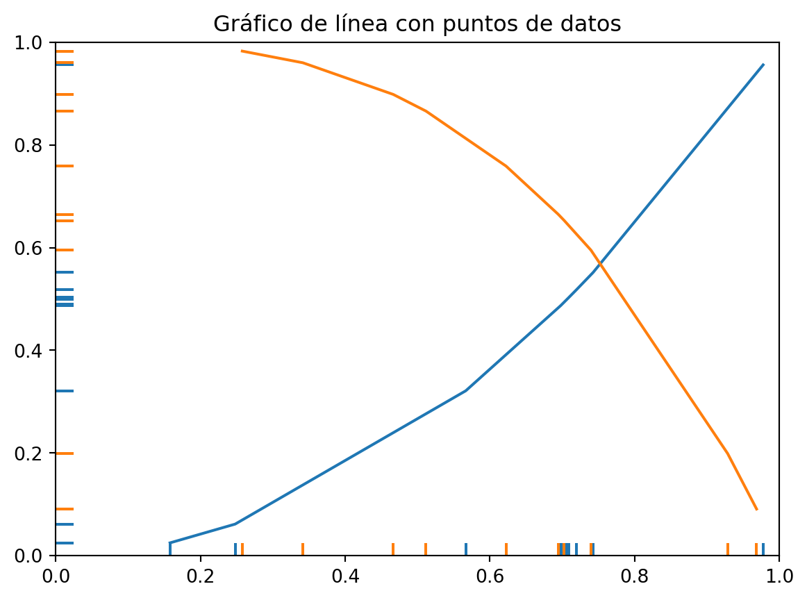

# Introducción a la Elasticidad
## ¿Qué es la elasticidad?

La elasticidad es un concepto fundamental en economía que nos ayuda a comprender cómo responden la demanda y la oferta ante cambios en los precios y otros factores. En pocas palabras, nos permite medir la sensibilidad de la cantidad demandada o ofrecida ante variaciones en determinadas variables.

Imagina que el precio de un producto aumenta. ¿Qué sucederá con la cantidad que las personas están dispuestas a comprar? La elasticidad nos proporciona una medida para responder a esta pregunta. Si la demanda es elástica, significa que los consumidores son sensibles a los cambios en el precio y reducirán su consumo en gran medida. Por otro lado, si la demanda es inelástica, significa que los consumidores son menos sensibles y continuarán comprando a pesar del aumento de precio.

La elasticidad es una herramienta poderosa que nos ayuda a entender cómo funciona el mercado y cómo los cambios en variables clave pueden afectar las decisiones de los consumidores y las empresas. En los siguientes fragmentos, exploraremos diferentes tipos de elasticidad y su aplicación práctica en el mundo empresarial. ¡Vamos a sumergirnos en el fascinante mundo de la elasticidad económica!

## Importancia de la elasticidad en la economía

La elasticidad es un concepto clave en la economía porque nos permite comprender cómo cambian las decisiones y el comportamiento de los consumidores y las empresas frente a los cambios en los precios y otros factores económicos.

Imagina que eres propietario de un negocio y estás considerando aumentar el precio de tus productos. Antes de tomar esa decisión, es fundamental comprender cómo reaccionarán los consumidores. Aquí es donde entra en juego la elasticidad. Si la demanda es elástica, un aumento en el precio podría resultar en una disminución significativa de las ventas, lo que podría afectar negativamente tus ingresos. Por otro lado, si la demanda es inelástica, un aumento en el precio podría tener un impacto menor en las ventas, lo que te brinda una mayor flexibilidad para ajustar tus precios.

Además, la elasticidad también nos ayuda a comprender los efectos de los impuestos, las políticas gubernamentales y otros factores en la economía. Por ejemplo, si se impone un impuesto a un producto, la elasticidad nos permite predecir cómo afectará la demanda y cuánto ingreso generará el impuesto.

## Tipos de elasticidad

Existen varios tipos de elasticidad que nos ayudan a comprender diferentes aspectos del comportamiento de la demanda y la oferta. Cada tipo de elasticidad se centra en una variable específica y nos proporciona información única sobre cómo responden los agentes económicos a los cambios en esa variable.

1. **Elasticidad precio de la demanda:** Esta medida nos indica cómo responde la cantidad demandada de un bien o servicio a cambios en su precio. Si la demanda es elástica, significa que los consumidores son sensibles a las variaciones de precio y una pequeña alteración en el precio puede tener un gran impacto en la cantidad demandada. Por otro lado, si la demanda es inelástica, significa que los consumidores son menos sensibles al cambio de precio.

2. **Elasticidad ingreso de la demanda:** Esta medida nos indica cómo responde la cantidad demandada de un bien o servicio a cambios en el ingreso de los consumidores. Si la demanda es elástica con respecto al ingreso, significa que la cantidad demandada aumentará en proporción mayor al incremento del ingreso. Por el contrario, si la demanda es inelástica, significa que la cantidad demandada no aumentará significativamente ante un incremento en el ingreso.

3. **Elasticidad cruzada de la demanda:** Esta medida nos indica cómo responde la cantidad demandada de un bien o servicio ante cambios en el precio de otro bien o servicio relacionado. Si la elasticidad cruzada de la demanda es positiva, significa que los bienes son sustitutos y un aumento en el precio de uno de ellos conducirá a un aumento en la demanda del otro. Si la elasticidad cruzada es negativa, significa que los bienes son complementarios y un aumento en el precio de uno de ellos reducirá la demanda del otro.

4. **Elasticidad precio de la oferta:** Esta medida nos indica cómo responde la cantidad ofrecida de un bien o servicio a cambios en su precio. Si la oferta es elástica, significa que los productores pueden aumentar la cantidad ofrecida en respuesta a un aumento en el precio. Si la oferta es inelástica, significa que los productores no pueden aumentar significativamente la cantidad ofrecida incluso ante un aumento en el precio.

En los próximos fragmentos, exploraremos cada tipo de elasticidad en más detalle y veremos cómo se aplican en situaciones reales. 

# Elasticidad Precio de la Demanda
## Concepto y fórmula de la elasticidad precio de la demanda

La elasticidad precio de la demanda es una medida importante en economía que nos permite entender cómo cambia la cantidad demandada de un bien o servicio ante variaciones en su precio. Esta medida nos ayuda a comprender la sensibilidad de los consumidores frente a los cambios de precio.

::: {#52942ebe .cell execution_count=1}

::: {.cell-output .cell-output-display}
{width=581 height=432}
:::
:::

Las diferentes fórmulas de la elasticidad precio de la demanda son las siguientes:

$$
Elasticidad precio de la demanda =\frac{\% cambio en la cantidad demandada}{\% cambio en el precio}
$$ {#eq-1}

la @eq-1 nos muestra cómo medir la elasticidad. Simplemente dividimos el porcentaje de cambio en la cantidad demandada entre el porcentaje de cambio en el precio.

$$
\eta _{XP_y} = \frac{\frac {X_f^d - X_i^d}{X_i}}{\frac {P_f^d - P_i^d}{P_i^d}}
$$

$$
= \frac{\frac{\Delta X^d}{X_i^d}}{\frac{\Delta P_x^d}{P_i^d}}
$$

$$
= \frac{\Delta X^d P_i^d}{\Delta P_x^d X_i^d}
$$ {#eq-2}

La @eq-2 nos permite calcular la elasticidad precio de la demanda utilizando los cambios absolutos en la cantidad demandada y el precio inicial. Dividimos la diferencia entre la cantidad final y la cantidad inicial por la cantidad inicial, y hacemos lo mismo con la diferencia entre el precio final y el precio inicial, dividiéndola por el precio inicial.

$$
\eta _{PX^d} = \frac{\partial X^d P_x}{\partial P_x X^d}
$$ {#eq-3}

La @eq-3 se basa en el cálculo de derivadas parciales. Nos permite medir la elasticidad precio de la demanda considerando los cambios infinitesimales en la cantidad demandada y el precio.

$$
\eta _{PX^d} = \frac{\partial \ln(\mathrm X)}{\partial  \ln(\mathrm P_x)}
$$ {#eq-4}

La @eq-4 utiliza logaritmos naturales para calcular la elasticidad. Tomamos las derivadas parciales de los logaritmos de la cantidad demandada y el precio para obtener la elasticidad.
$$
\eta _{PX^d} = \frac{\Delta \% X^d}{\Delta \% P_x}
$$ {#eq-5}

La @eq-5 nos muestra cómo medir la elasticidad utilizando los cambios porcentuales en la cantidad demandada y el precio.

$$
\eta_{PX^d} = m_{ip} \frac{P_i^d}{X^d}
$$ {#eq-6}

La @eq-6 introduce el concepto de pendiente de la curva de demanda. Multiplicamos la pendiente de la curva por el precio inicial dividido por la cantidad demandada para obtener la elasticidad.

Estas fórmulas nos brindan diferentes enfoques para calcular la elasticidad precio de la demanda, y cada una tiene su utilidad en diferentes contextos. Es importante comprender cómo aplicarlas y qué información nos brindan para tomar decisiones estratégicas en el ámbito económico.

## Interpretación de la elasticidad precio de la demanda

Una vez que comprendemos qué es la elasticidad precio de la demanda y cómo se calcula, es importante poder interpretar los resultados obtenidos. La elasticidad nos brinda información valiosa sobre la sensibilidad de los consumidores ante cambios en el precio de un producto. Veamos cómo interpretar los distintos valores de la elasticidad:

- Elasticidad mayor a 1: Si la elasticidad es mayor a 1, se dice que la demanda es elástica. Esto significa que los consumidores son muy sensibles al cambio de precio. Un pequeño aumento en el precio puede resultar en una disminución significativa en la cantidad demandada, y viceversa. En este caso, es crucial para las empresas considerar cuidadosamente los ajustes de precios, ya que podrían tener un impacto considerable en la demanda.

- Elasticidad igual a 1: Si la elasticidad es igual a 1, se dice que la demanda es unitaria. Esto implica que los cambios en el precio tienen un impacto proporcional en la cantidad demandada. Por ejemplo, si el precio aumenta en un 10%, la cantidad demandada disminuirá en un 10%. En este caso, las empresas deben tener en cuenta que cualquier cambio en el precio tendrá un efecto equivalente en la demanda.

- Elasticidad menor a 1: Si la elasticidad es menor a 1, se dice que la demanda es inelástica. Esto indica que los consumidores son menos sensibles a los cambios en el precio. Incluso si el precio aumenta, la cantidad demandada disminuirá en una proporción menor. Aquí, las empresas pueden tener más flexibilidad para ajustar los precios sin experimentar una caída drástica en la demanda.

Es importante destacar que la elasticidad precio de la demanda puede variar según el producto, el mercado y el momento. Por lo tanto, es esencial realizar análisis específicos para comprender cómo los cambios en el precio afectarán la demanda en situaciones particulares.

Ejemplo

$$
X^d = \frac{P_y P_z I^{0.2} N}{2 P_x}
$$

Aplicando la fórmula @eq-2

$$ 
\eta _{PX^d} = \frac{\partial \mathrm{X}}{\partial \mathrm{P_x}} \frac{\mathrm{P_x}}{\mathrm{X^d}} 
$$

$$
= - \frac{P_y P_z I^{0.2} N}{2 (P_x)^2} \frac{\mathrm{P_x}}{\mathrm{X^d} }
$$

reemplazamos $x^d$ con su valor 
$$
= - \frac{P_y P_z I^{0.2} N}{2 (P_x)^2} \frac{\mathrm{P_x}}{\frac{P_y P_z I^{0.2} N}{2 P_x} }
$$

ordenando y resolviendo

$$
= - \frac{2 P_y P_z (P_x)^2 I^{0.2} N}{2 P_y P_z (P_x)^2 I^{0.2} N} = -1
$$

interpretación

Si el $P_x$ aumenta en 1% entonces $X^d$ disminuye en 1%.

## Factores que influyen en la elasticidad precio de la demanda

# Elasticidad Precio de la Oferta
## Significado y cálculo de la elasticidad precio de la oferta
## Análisis de la elasticidad precio de la oferta en diferentes industrias
## Determinantes de la elasticidad precio de la oferta

# Elasticidad Cruzada
## Definición y fórmula de la elasticidad cruzada
## Interpretación de la elasticidad cruzada
## Aplicaciones prácticas de la elasticidad cruzada

# Elasticidad Ingreso de la Demanda
## Explicación y cálculo de la elasticidad ingreso de la demanda
## Impacto de la elasticidad ingreso en los patrones de consumo
## Factores que afectan la elasticidad ingreso de la demanda

# Aplicaciones de la Elasticidad en la Toma de Decisiones Empresariales
## Uso de la elasticidad en la fijación de precios
## Estrategias de marketing basadas en la elasticidad
## Estudio de casos: Ejemplos reales de la aplicación de la elasticidad en empresas

# Conclusiones y Reflexiones Finales
## Recapitulación de los conceptos clave
## Importancia de comprender la elasticidad para la toma de decisiones
## Reflexiones sobre la aplicabilidad y relevancia de la elasticidad en el mundo actual

# Publicaciones Similares

Si te interesó este artículo, te recomendamos que explores otros blogs y recursos relacionados que pueden ampliar tus conocimientos. Aquí te dejo algunas sugerencias:

1.  [Introducción a organización industrial](../2023-06-12-introducion-organizacion-industrial-oi-cap1/index.qmd)

2.  [La Empresa como Organización. Promoviendo Valores Cooperativos, Humanos y Sociales](../2023-06-13-empresa-como-organizacion-oi-cap1/index.qmd)

3.  [Introducción a los Sistemas Económicos. Cómo se distribuyen los recursos y se producen](../2023-06-13-sistemas-economicos-oi.cap1/index.qmd)

4.  [El Mercado Relevante Industrial de Bienes y el Mercado Geográfico](../2023-06-15-mercado-relevante-oi-cap2/index.qmd)

5.  [Medidas de concentracion](../2023-06-16-concentracion-poder-oi-cap3/index.qmd)

6.  [Estructura de mercado](../2023-06-17-estructura-mercado-oi-cap4/index.qmd)

Esperamos que encuentres estas publicaciones igualmente interesantes y útiles. ¡Disfruta de la lectura!

