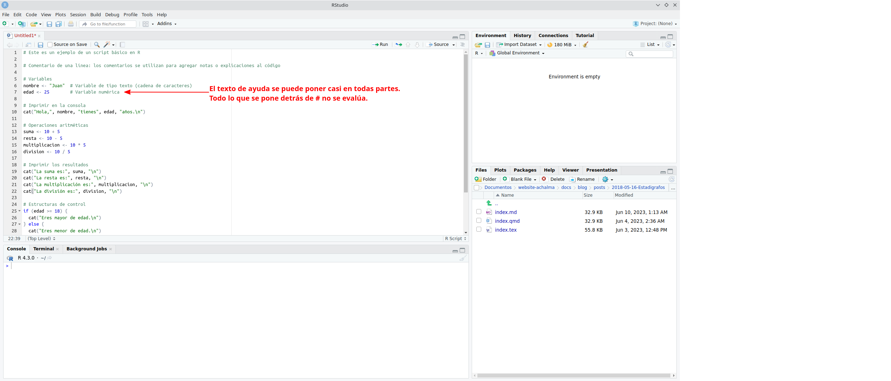
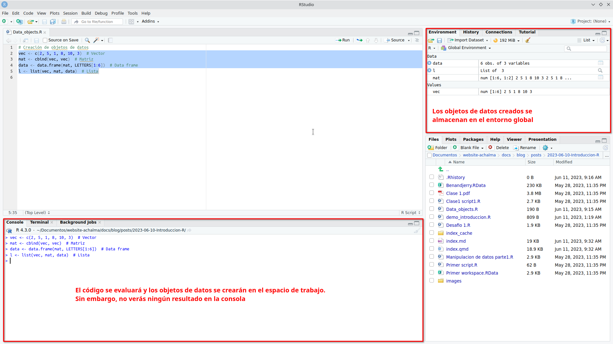
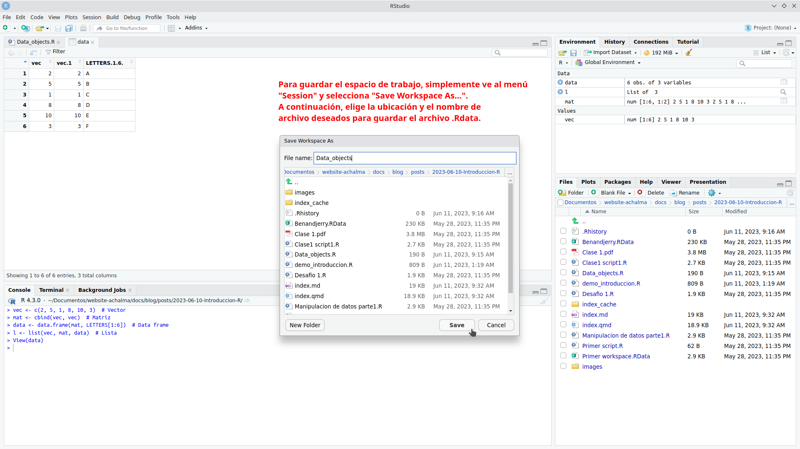
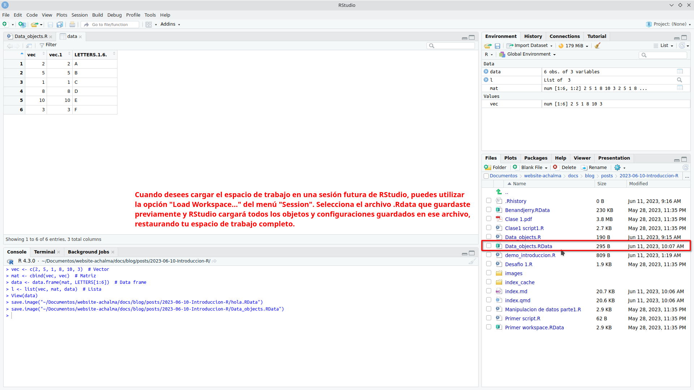
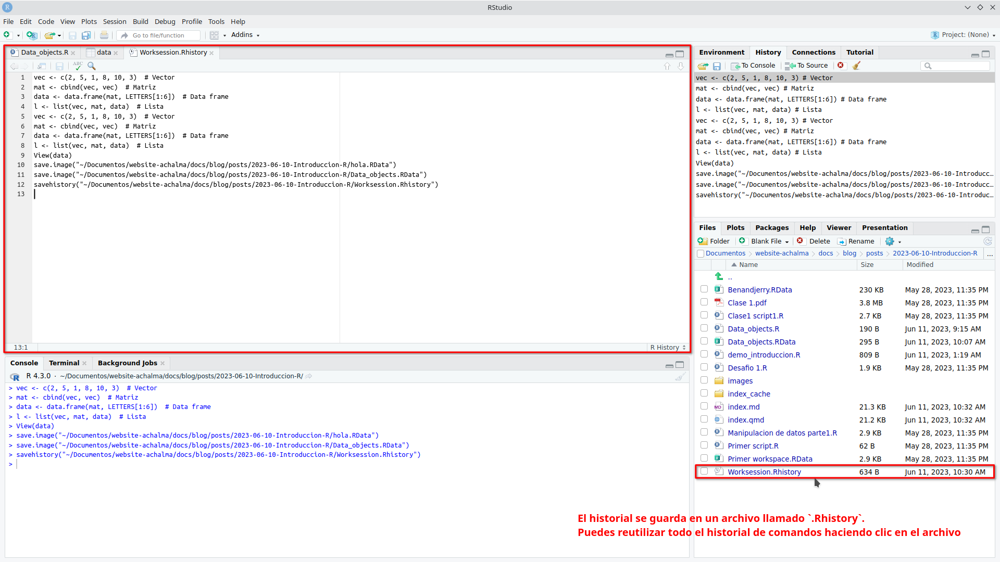
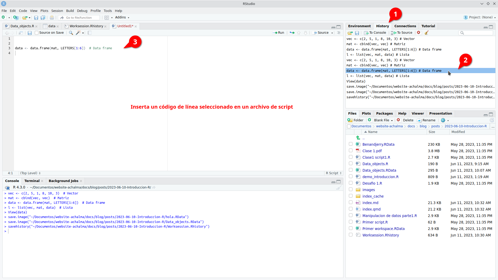

# ¿Qúe nos ofrece RStudio?

## Beneficios del software RStudio

RStudio es una herramienta poderosa que brinda numerosas ventajas para los usuarios. A continuación, destacamos algunas de las funcionalidades que ofrece:

1.  **Potente editor de código:** RStudio proporciona un entorno de desarrollo integrado (IDE) que cuenta con un editor de código robusto. Este editor permite escribir, editar y ejecutar código de manera eficiente, lo que facilita el trabajo con el lenguaje de programación R.

2.  **Gestión del espacio de trabajo:** RStudio ofrece características avanzadas para el manejo del espacio de trabajo. Puedes explorar y administrar fácilmente los objetos, variables y funciones utilizados en tu sesión de R, lo que facilita el seguimiento y la organización de tus datos y resultados.

3.  **Depuración y resaltado de sintaxis:** La función de depuración de RStudio te permite identificar y corregir errores en tu código de manera eficiente. Además, el resaltado de sintaxis te ayuda a visualizar y comprender mejor la estructura de tu código, lo que facilita su lectura y mantenimiento.

4.  **Autocompletado inteligente:** RStudio ofrece una función de autocompletado inteligente, que te sugiere opciones de código a medida que escribes. Esto acelera el proceso de codificación al proporcionar sugerencias contextuales y facilitar la escritura correcta de las funciones y objetos de R.

5.  **Interoperabilidad con otros software y plataformas:** RStudio es compatible con una amplia gama de herramientas y plataformas. Puedes integrar fácilmente tus análisis en flujos de trabajo existentes, colaborar con otros profesionales y compartir tus resultados en diferentes formatos, como informes, gráficos interactivos o aplicaciones web.


## Archivos de Script en R (.R)

En el mundo del análisis de datos y programación en R, los archivos de script (.R) desempeñan un papel fundamental. Estos archivos contienen la secuencia de comandos necesaria para realizar análisis y manipulación de datos de manera sistemática y reproducible.

### Ventajas de utilizar archivos de script en R:

1.  **Documentación de tareas**: Al escribir nuestros comandos en un archivo de script, estamos creando una documentación detallada de los pasos y procesos utilizados en nuestro análisis. Esto facilita la comprensión y revisión de nuestro trabajo, tanto para nosotros mismos como para otros colaboradores.

2.  **Automatización de tareas repetitivas**: Los archivos de script permiten automatizar tareas que se repiten con frecuencia. Podemos definir una serie de comandos en el archivo y ejecutarlos de forma rápida y eficiente cada vez que sea necesario. Esto ahorra tiempo y reduce la posibilidad de errores.

3.  **Evaluación de cambios**: Al tener nuestros comandos en un archivo de script, podemos realizar modificaciones y ajustes en el análisis de manera más ágil. Podemos realizar pruebas y evaluaciones de los cambios sin necesidad de volver a escribir todo el código desde cero. Esto nos brinda flexibilidad y nos permite iterar y mejorar nuestro análisis de manera más eficiente.

### Creando y Ejecutando un Script en RStudio

Los scripts nos permiten escribir y ejecutar una serie de comandos de manera secuencial, lo que facilita la automatización y reproducción de tareas en nuestros análisis de datos.

**Paso 1: Crear un nuevo archivo de script**

En primer lugar, abrimos RStudio y creamos un nuevo archivo de script. Para hacer esto, seleccionamos "Archivo" en la barra de menú, luego "Nuevo archivo" y finalmente "Script R". Esto abrirá un nuevo editor de texto donde podemos escribir nuestro código.


**Paso 2: Escribir el código en el script**

Una vez que tenemos nuestro archivo de script abierto, podemos comenzar a escribir nuestro código en R. Podemos utilizar cualquier comando o función de R en el script para realizar análisis de datos, manipulación de variables, visualización, entre otros. Es importante asegurarse de que el código esté escrito correctamente y tenga una sintaxis válida.




::: {.cell}

```{.r .cell-code}
# Este es un ejemplo de un script básico en R

# Comentario de una línea: los comentarios se utilizan para agregar notas o explicaciones al código

# Variables
nombre <- "Juan" # Variable de tipo texto (cadena de caracteres)
edad <- 25 # Variable numérica

# Imprimir en la consola
cat("Hola,", nombre, "tienes", edad, "años.\n")

# Operaciones aritméticas
suma <- 10 + 5
resta <- 10 - 5
multiplicacion <- 10 * 5
division <- 10 / 5

# Imprimir los resultados
cat("La suma es:", suma, "\n")
cat("La resta es:", resta, "\n")
cat("La multiplicación es:", multiplicacion, "\n")
cat("La división es:", division, "\n")
```
:::


**Paso 3: Ejecutar el script**

Una vez que hemos escrito nuestro código en el archivo de script, podemos ejecutarlo para obtener los resultados deseados. Para hacer esto, podemos utilizar el atajo de teclado "Ctrl + Enter" o simplemente hacer clic en el botón "Ejecutar" en la parte superior del editor de texto.


RStudio ejecutará el código línea por línea y mostrará los resultados en la consola.


**Paso 4: Guardar el script**

Es importante guardar regularmente nuestro script para evitar perder nuestro trabajo. Para guardar el archivo de script, seleccionamos "Archivo" en la barra de menú y luego "Guardar" o "Guardar como".


Podemos elegir una ubicación y un nombre de archivo apropiados para guardar nuestro script.


**Paso 5: Continuar escribiendo y ejecutando el código**

Podemos continuar escribiendo y ejecutando más código en nuestro script según nuestras necesidades. Podemos agregar nuevas líneas de código, modificar las existentes o eliminar las que ya no necesitamos. Es recomendable guardar el script regularmente a medida que realizamos cambios.

**Paso 6: Exportar los resultados (opcional)**

Si deseamos guardar los resultados de nuestro análisis, podemos exportarlos a archivos o formatos específicos. Por ejemplo, podemos guardar tablas de datos en archivos CSV, gráficos en imágenes o informes en formatos de texto. Esto nos permite compartir y utilizar los resultados fuera de RStudio.

> Recuerda que practicar y experimentar con diferentes comandos y funciones en RStudio te ayudará a familiarizarte con el entorno y mejorar tus habilidades de programación en R. ¡Diviértete explorando el mundo del análisis de datos con RStudio!

## Shortcuts

Aquí tienes una tabla con algunos atajos de teclado útiles en RStudio para usuarios de Ubuntu Linux:

| Acción                                                                       | Atajo de teclado     |
|----------------------------------------------------|--------------------|
| Ejecutar el código / selección actual y saltar a la línea siguiente          | Ctrl + Enter         |
| Ejecutar el código / selección actual y no saltar a la línea siguiente       | Alt + Enter          |
| Ejecutar línea de código                                                     | Shift + Enter        |
| Comentar/descomentar línea de código                                         | Ctrl + Shift + C     |
| Copiar línea de código                                                       | Ctrl + Shift + D     |
| Pegar línea de código                                                        | Ctrl + Shift + V     |
| Ir a la línea                                                                | Ctrl + G             |
| Ir al inicio del documento                                                   | Ctrl + Home          |
| Ir al final del documento                                                    | Ctrl + End           |
| Completar código                                                             | Tab                  |
| Abrir ayuda                                                                  | F1                   |
| Guardar el archivo actual                                                    | Ctrl + S             |
| Cerrar archivo                                                               | Ctrl + W             |
| Deshacer                                                                     | Ctrl + Z             |
| Rehacer                                                                      | Ctrl + Y             |
| Abrir consola de R                                                           | Ctrl + Shift + Enter |
| Buscar en el archivo                                                         | Ctrl + F             |
| Buscar y reemplazar en el archivo                                            | Ctrl + Shift + F     |
| Colapsar/expandir bloque de código                                           | Ctrl + Shift +       |
| Aumentar tamaño de fuente                                                    | Ctrl + +             |
| Disminuir tamaño de fuente                                                   | Ctrl + -             |
| Nuevo archivo Script R                                                       | Shift + Ctrl + N     |
| Abrir archivo                                                                | Ctrl + O             |
| Ejecutar todo el script                                                      | Ctrl + Alt + R       |
| Ejecutar el código desde el principio hasta la línea actual                  | Ctrl + Alt + B       |
| Ejecutar el código desde la línea actual hasta el final                      | Ctrl + Alt + E       |
| Mover el cursor al editor de código fuente                                   | Ctrl + 1             |
| Mover el cursor a la consola                                                 | Ctrl + 2             |
| Eliminar selección actual                                                    | Ctrl + D             |
| Limpiar consola                                                              | Ctrl + L             |
| Navegar por el historial de la consola                                       | arriba/abajo         |
| Mover la línea de código arriba y abajo (evita el trabajo de copiar y pegar) | Alt + arriba/abajo   |
| Interrumpir el comando en ejecución                                          | Esc                  |

Estos atajos de teclado te ayudarán a agilizar tu flujo de trabajo en RStudio en Ubuntu Linux. Recuerda que también puedes personalizar los atajos de teclado según tus preferencias en la sección de configuración de RStudio.

## Espacio de trabajo (.Rdata)

El espacio de trabajo en R consiste en todos los objetos que se crean o cargan durante una sesión de R.

### Creación de objetos de datos

1.  Utiliza el operador de asignación (`<-`) para crear un objeto de datos. Por ejemplo: `mi_objeto <- c(1, 2, 3, 4, 5)`.


2.  Selecciona todo el código que contiene los objetos de datos y ejecútalo en la consola de RStudio.


3.  El código se evaluará y los objetos de datos se crearán en el espacio de trabajo. Sin embargo, no verás ningún resultado en la consola.



Los objetos de datos creados se almacenan en el entorno global, que es parte del espacio de trabajo de R.

### Inspección de objetos de datos

Puedes inspeccionar los objetos de datos haciendo clic sobre ellos en el panel de entorno o en el panel de objetos. Esto abrirá una vista previa del objeto en un nuevo archivo. Ten en cuenta que esta vista previa no afecta los objetos en el espacio de trabajo y se puede cerrar sin perder ninguna información.


### Guardado del espacio de trabajo

En RStudio, puedes guardar todos los objetos en tu espacio de trabajo en un archivo llamado `.Rdata`. Esta función te permite almacenar y cargar el espacio de trabajo completo en futuras sesiones de RStudio.

Para guardar el espacio de trabajo, simplemente ve al menú "Session" y selecciona "Save Workspace As...". A continuación, elige la ubicación y el nombre de archivo deseados para guardar el archivo `.Rdata`.



Esta función es especialmente útil cuando trabajas en proyectos largos o cuando deseas retomar tu trabajo en otro momento sin tener que volver a crear o cargar manualmente todos los objetos y configuraciones.

> Recuerda que al guardar y cargar el espacio de trabajo, asegúrate de mantener un respaldo de tus archivos en caso de cualquier eventualidad. ¡Disfruta de la conveniencia de mantener tus objetos y configuraciones en tu espacio de trabajo guardado!

### Carga del espacio de trabajo

Para cargar el espacio de trabajo previamente guardado, sigue estos pasos:

1.  Abre RStudio y ve al menú "Session" en la barra de herramientas superior.
2.  Selecciona la opción "Cargar" del menú desplegable.
3.  Aparecerá una ventana emergente que te permite buscar el archivo `.Rdata` que contiene tu espacio de trabajo guardado. Navega hasta la ubicación donde guardaste el archivo.
4.  Selecciona el archivo `.Rdata` y haz clic en el botón "Abrir".
5.  RStudio cargará automáticamente el archivo y restaurará todos los objetos y sus valores en tu entorno de trabajo actual.



Una vez completados estos pasos, podrás acceder a todos los objetos y continuar trabajando con ellos como lo hiciste en la sesión en la que guardaste el espacio de trabajo.

> ¡Con esta opción de carga, podrás retomar fácilmente tus proyectos anteriores y continuar donde lo dejaste sin tener que volver a crear los objetos desde cero!

## Historial (.Rhistory)

El archivo de historial es un archivo de texto que registra todos los comandos ejecutados durante una sesión de RStudio.

### Inspección del historial de comandos

Puedes ver el historial de comandos ejecutados durante tu sesión de trabajo haciendo clic en la pestaña "History" en la parte superior derecha de la ventana de RStudio. Aquí encontrarás una lista de todos los comandos ejecutados, lo que te permite revisarlos y volver a utilizarlos según sea necesario.


### Guardado del historial de comandos

Si deseas guardar tu historial de comandos, puedes hacerlo en cualquier momento durante tu sesión de trabajo. Esto te permitirá acceder a tus comandos previos en futuras sesiones.

Si deseas guardar tu historial de comandos en RStudio, sigue estos pasos:

1.  En el panel de superior derecha selecciona la opción "Save History" (Guardar Historial).
2.  Aparecerá una ventana emergente que te permitirá seleccionar la ubicación y el nombre de archivo para guardar tu historial de comandos. El archivo tendrá una extensión `.Rhistory` por defecto.
3.  Elige la ubicación donde deseas guardar el archivo y asigna un nombre descriptivo para identificarlo fácilmente.
4.  Haz clic en el botón "Guardar" para guardar el historial de comandos en el archivo seleccionado.


### Reutilización del historial de comandos

El historial se guarda en un archivo llamado `.Rhistory`. Puedes reutilizar todo el historial de comandos haciendo clic en el archivo `.Rhistory` o con el nombre asignado. Luego, puedes copiarlos y pegarlos en tu archivo de script actual.



Inserta un código de línea seleccionado de `.Rhistory` en un archivo de script nuevo.



> ¡Explora y aprovecha al máximo el espacio de trabajo y el historial en RStudio para mejorar tu flujo de trabajo y aprovechar al máximo tus comandos y objetos de datos!


# Publicaciones Similares

Si te interesó este artículo, te recomendamos que explores otros blogs y recursos relacionados que pueden ampliar tus conocimientos. Aquí te dejo algunas sugerencias:


1. [011 Instalacion R](https://achalmaedison.netlify.app/programacion-software/r/2020-06-10-011-instalacion-r) Lee sin conexión 📚 [PDF](https://achalmaedison.netlify.app/programacion-software/r/2020-06-10-011-instalacion-r/index.pdf)
2. [012 Que Ofrece R](https://achalmaedison.netlify.app/programacion-software/r/2020-06-10-012-que-ofrece-r) Lee sin conexión 📚 [PDF](https://achalmaedison.netlify.app/programacion-software/r/2020-06-10-012-que-ofrece-r/index.pdf)
3. [013 Debemos Saber R](https://achalmaedison.netlify.app/programacion-software/r/2020-06-10-013-debemos-saber-r) Lee sin conexión 📚 [PDF](https://achalmaedison.netlify.app/programacion-software/r/2020-06-10-013-debemos-saber-r/index.pdf)
4. [02 Manipulacion De Datos](https://achalmaedison.netlify.app/programacion-software/r/2021-04-05-02-manipulacion-de-datos) Lee sin conexión 📚 [PDF](https://achalmaedison.netlify.app/programacion-software/r/2021-04-05-02-manipulacion-de-datos/index.pdf)
5. [03 Visualizacion De Datos](https://achalmaedison.netlify.app/programacion-software/r/2021-04-12-03-visualizacion-de-datos) Lee sin conexión 📚 [PDF](https://achalmaedison.netlify.app/programacion-software/r/2021-04-12-03-visualizacion-de-datos/index.pdf)
6. [04 Modelo De Machine Learning I Analisis Exploratorio](https://achalmaedison.netlify.app/programacion-software/r/2022-11-07-04-modelo-de-machine-learning-i-analisis-exploratorio) Lee sin conexión 📚 [PDF](https://achalmaedison.netlify.app/programacion-software/r/2022-11-07-04-modelo-de-machine-learning-i-analisis-exploratorio/index.pdf)
7. [05 Modelo De Machine Learning Ii Modelo De Clasificacion](https://achalmaedison.netlify.app/programacion-software/r/2022-11-14-05-modelo-de-machine-learning-ii-modelo-de-clasificacion) Lee sin conexión 📚 [PDF](https://achalmaedison.netlify.app/programacion-software/r/2022-11-14-05-modelo-de-machine-learning-ii-modelo-de-clasificacion/index.pdf)
8. [06 Modelo De Machine Learning Iii Modelo De Regresion](https://achalmaedison.netlify.app/programacion-software/r/2022-11-21-06-modelo-de-machine-learning-iii-modelo-de-regresion) Lee sin conexión 📚 [PDF](https://achalmaedison.netlify.app/programacion-software/r/2022-11-21-06-modelo-de-machine-learning-iii-modelo-de-regresion/index.pdf)
9. [07 Modelo De Machine Learning Iv Tex Mining](https://achalmaedison.netlify.app/programacion-software/r/2022-11-28-07-modelo-de-machine-learning-iv-tex-mining) Lee sin conexión 📚 [PDF](https://achalmaedison.netlify.app/programacion-software/r/2022-11-28-07-modelo-de-machine-learning-iv-tex-mining/index.pdf)


Esperamos que encuentres estas publicaciones igualmente interesantes y útiles. ¡Disfruta de la lectura!

